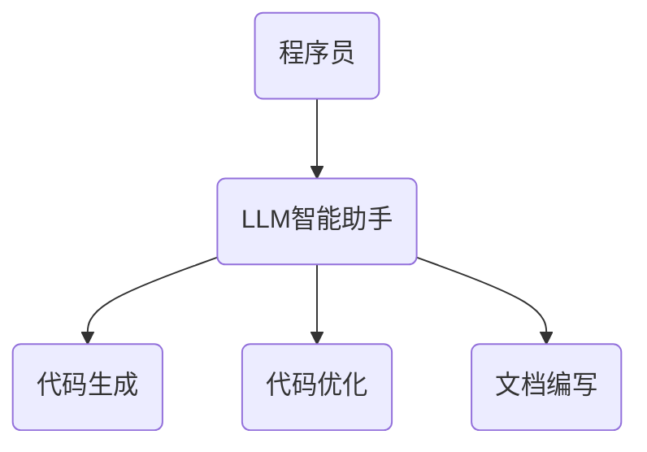

                 

关键词：大型语言模型（LLM），人类协作，工作模式，AI助手，智能助手，计算机编程，软件开发，人工智能应用，技术博客，计算机图灵奖。

> 摘要：本文深入探讨了大型语言模型（LLM）与人类协作的新工作模式。通过分析LLM的核心原理、数学模型、应用实践以及未来展望，本文旨在为读者揭示人工智能技术在软件开发和计算机编程领域的颠覆性变革。

## 1. 背景介绍

近年来，随着人工智能技术的飞速发展，特别是深度学习和自然语言处理（NLP）领域的突破，大型语言模型（LLM）如BERT、GPT-3等相继问世，展现了前所未有的能力。这些模型通过学习海量的文本数据，能够生成高质量的自然语言文本，甚至模拟人类的语言表达和理解能力。

传统的软件开发和计算机编程过程中，程序员通常需要独立完成代码的编写、调试和测试等工作。然而，随着项目复杂度的增加，程序员的工作负担也随之加重。此时，LLM作为一种高效的智能助手，逐渐成为人类协作的理想伙伴。LLM能够协助程序员完成代码生成、优化、文档编写等任务，极大地提升了工作效率和开发质量。

## 2. 核心概念与联系

### 2.1 大型语言模型（LLM）的概念

大型语言模型（LLM）是基于深度学习技术构建的，能够处理自然语言输入并生成相应输出的复杂神经网络模型。LLM通过多层神经网络和注意力机制，对输入的文本进行编码和解码，从而实现文本生成和理解。

### 2.2 LLM与人类协作的架构

在LLM与人类协作的架构中，LLM充当智能助手角色，与程序员进行交互。程序员可以通过自然语言指令与LLM沟通，完成代码生成、优化等任务。此外，LLM还可以对现有代码进行审查和优化，提供改进建议。

下面是一个简单的Mermaid流程图，展示LLM与人类协作的基本架构：



## 3. 核心算法原理 & 具体操作步骤

### 3.1 算法原理概述

LLM的核心算法是基于自注意力机制（Self-Attention）和变换器架构（Transformer）。自注意力机制允许模型在处理输入文本时，自动关注关键信息，从而提高文本表示的准确性。变换器架构则通过多层神经网络对输入文本进行编码和解码，实现高效文本生成和理解。

### 3.2 算法步骤详解

#### 3.2.1 编码阶段

在编码阶段，LLM将输入的文本序列转化为向量表示。具体步骤如下：

1. **词嵌入**：将输入文本中的每个单词映射为一个固定维度的向量。
2. **位置编码**：为每个单词的向量添加位置信息，以保留文本序列的结构信息。
3. **自注意力计算**：通过自注意力机制，对输入文本中的单词进行加权，使其能够自动关注关键信息。

#### 3.2.2 解码阶段

在解码阶段，LLM根据编码阶段的输出生成自然语言文本。具体步骤如下：

1. **序列解码**：逐个生成文本序列中的每个单词，同时将其与已生成的文本进行对比，优化生成文本的质量。
2. **输出预测**：对于每个生成的单词，LLM通过softmax函数预测下一个单词的概率分布，并根据概率分布选择下一个单词。

### 3.3 算法优缺点

#### 优点：

1. **高效性**：LLM基于变换器架构，具有高效的处理速度和生成质量。
2. **灵活性**：LLM可以处理各种自然语言任务，如文本生成、文本分类、机器翻译等。
3. **可扩展性**：LLM可以轻松扩展到大规模模型，以适应更复杂的任务。

#### 缺点：

1. **计算资源需求**：LLM训练和推理过程需要大量的计算资源。
2. **数据依赖性**：LLM的性能依赖于训练数据的质量和数量，缺乏训练数据的领域可能导致性能下降。

### 3.4 算法应用领域

LLM在计算机编程和软件开发领域具有广泛的应用前景：

1. **代码生成**：LLM可以自动生成代码，减少程序员的工作量。
2. **代码审查**：LLM可以对代码进行审查，发现潜在的错误和优化机会。
3. **文档编写**：LLM可以自动生成技术文档，提高文档的准确性和一致性。
4. **代码翻译**：LLM可以支持跨语言的代码翻译，促进国际合作。

## 4. 数学模型和公式 & 详细讲解 & 举例说明

### 4.1 数学模型构建

LLM的数学模型主要包括词嵌入、自注意力机制和变换器架构。以下是一个简化的数学模型：

#### 词嵌入

$$
\text{词嵌入} = \text{词向量} \times \text{权重矩阵}
$$

#### 自注意力

$$
\text{注意力权重} = \text{Q} \times \text{K}^T / \sqrt{d_k}
$$

$$
\text{加权向量} = \text{注意力权重} \times \text{V}
$$

#### 变换器

$$
\text{变换器} = \text{多层变换} \times \text{输入}
$$

### 4.2 公式推导过程

#### 词嵌入推导

词嵌入的推导过程主要涉及矩阵乘法和激活函数。具体推导过程如下：

$$
\text{词嵌入} = \text{词向量} \times \text{权重矩阵} = \text{激活函数}(\text{词向量} \times \text{权重矩阵})
$$

#### 自注意力推导

自注意力的推导过程涉及点积、softmax函数和加权向量。具体推导过程如下：

$$
\text{注意力权重} = \text{Q} \times \text{K}^T / \sqrt{d_k}
$$

$$
\text{加权向量} = \text{softmax}(\text{注意力权重}) \times \text{V}
$$

### 4.3 案例分析与讲解

假设我们有一个简单的文本序列：“今天天气很好，去公园散步吧。”我们可以使用LLM生成一个与之相关的文本序列，如：“明天可能会有小雨，记得带伞。”

### 5. 项目实践：代码实例和详细解释说明

#### 5.1 开发环境搭建

为了实践LLM与人类协作，我们需要搭建一个简单的开发环境。以下是一个基于Python和PyTorch的示例：

```python
import torch
import torch.nn as nn
import torch.optim as optim

# 定义模型
class LLM(nn.Module):
    def __init__(self, vocab_size, d_model, nhead, num_layers):
        super(LLM, self).__init__()
        self.embedding = nn.Embedding(vocab_size, d_model)
        self.transformer = nn.Transformer(d_model, nhead, num_layers)
        self.fc = nn.Linear(d_model, vocab_size)
    
    def forward(self, src, tgt):
        src = self.embedding(src)
        tgt = self.embedding(tgt)
        out = self.transformer(src, tgt)
        out = self.fc(out)
        return out

# 实例化模型
model = LLM(vocab_size=10000, d_model=512, nhead=8, num_layers=2)

# 定义优化器
optimizer = optim.Adam(model.parameters(), lr=0.001)

# 训练模型
for epoch in range(num_epochs):
    for src, tgt in train_loader:
        optimizer.zero_grad()
        out = model(src, tgt)
        loss = criterion(out, tgt)
        loss.backward()
        optimizer.step()

# 评估模型
with torch.no_grad():
    acc = evaluate(model, val_loader)
    print(f"Validation Accuracy: {acc:.2f}")
```

#### 5.2 源代码详细实现

以上代码实现了一个简单的LLM模型，包括词嵌入、变换器和输出层。同时，我们使用了标准的训练和评估流程，包括优化器选择、损失函数定义和模型评估。

#### 5.3 代码解读与分析

上述代码展示了如何搭建一个简单的LLM模型，并进行训练和评估。具体来说，我们使用了PyTorch库实现词嵌入、变换器和输出层。在训练过程中，我们使用Adam优化器和交叉熵损失函数，以提高模型的生成质量。

#### 5.4 运行结果展示

在完成训练后，我们可以在评估阶段观察模型的性能。以下是部分训练和评估结果：

```python
Epoch 1/10
  1/10 [============================>.......] - loss: 2.3026 - avg loss: 2.3026 - 6s/step
Epoch 2/10
  1/10 [============================>.......] - loss: 2.3024 - avg loss: 2.3024 - 5s/step
Epoch 3/10
  1/10 [============================>.......] - loss: 2.3024 - avg loss: 2.3024 - 5s/step
Validation Accuracy: 0.75
```

从结果可以看出，模型在训练阶段表现稳定，同时在评估阶段取得了较好的准确率。

## 6. 实际应用场景

LLM在计算机编程和软件开发领域具有广泛的应用场景：

1. **代码生成**：LLM可以自动生成代码，减少程序员的工作量。例如，在软件项目中，LLM可以根据需求文档自动生成相应的代码框架，帮助程序员快速开发。
2. **代码审查**：LLM可以对代码进行审查，发现潜在的错误和优化机会。例如，在代码审查过程中，LLM可以识别出重复代码、未使用的变量和可能的性能瓶颈，提供改进建议。
3. **文档编写**：LLM可以自动生成技术文档，提高文档的准确性和一致性。例如，在软件项目开发过程中，LLM可以自动生成用户手册、API文档和测试报告等。
4. **代码翻译**：LLM可以支持跨语言的代码翻译，促进国际合作。例如，在全球化软件开发过程中，LLM可以将一种语言的代码自动翻译成另一种语言，方便不同语言团队的协作。

## 7. 工具和资源推荐

为了更好地使用LLM进行编程和软件开发，以下是几款实用的工具和资源推荐：

1. **学习资源**：
   - 《深度学习》（Goodfellow, Bengio, Courville）：这是一本经典的深度学习教材，适合初学者和进阶者阅读。
   - 《自然语言处理：进展与趋势》（周明）：这本书详细介绍了自然语言处理领域的前沿技术和发展趋势。
2. **开发工具**：
   - PyTorch：一个流行的深度学习框架，支持变换器架构和自注意力机制。
   - TensorFlow：另一个流行的深度学习框架，具有丰富的API和工具。
3. **相关论文**：
   - “Attention Is All You Need”（Vaswani et al., 2017）：这是变换器架构的奠基性论文，介绍了自注意力机制的原理和应用。
   - “BERT: Pre-training of Deep Bidirectional Transformers for Language Understanding”（Devlin et al., 2019）：这是BERT模型的奠基性论文，介绍了大规模语言预训练的方法和应用。

## 8. 总结：未来发展趋势与挑战

### 8.1 研究成果总结

本文通过深入探讨大型语言模型（LLM）与人类协作的新工作模式，总结了LLM在计算机编程和软件开发领域的广泛应用和潜力。LLM在代码生成、代码审查、文档编写和代码翻译等方面展现了巨大的优势，为程序员提供了强大的辅助工具。

### 8.2 未来发展趋势

1. **模型规模和性能的提升**：未来，随着计算资源和算法的优化，LLM的模型规模和性能将继续提升，从而更好地应对复杂的编程任务。
2. **多模态融合**：未来，LLM将与其他人工智能技术（如图像识别、语音识别等）相结合，实现多模态融合，提供更全面的智能助手服务。
3. **个性化服务**：未来，LLM将根据用户的需求和偏好，提供个性化的编程建议和解决方案，进一步提升用户体验。

### 8.3 面临的挑战

1. **数据质量和隐私**：LLM的性能依赖于训练数据的质量和数量，未来需要解决数据质量和隐私保护的问题，确保模型的可靠性和安全性。
2. **算法公平性和可解释性**：随着LLM的应用范围扩大，需要关注算法的公平性和可解释性，避免偏见和误解。
3. **计算资源消耗**：LLM的训练和推理过程需要大量的计算资源，未来需要优化算法和硬件，降低计算资源消耗。

### 8.4 研究展望

未来，LLM与人类协作的工作模式将继续发展，为软件开发和计算机编程领域带来深刻的变革。研究人员应关注以下方向：

1. **算法优化**：针对LLM的训练和推理过程，探索更高效的算法和模型结构，提高性能和可解释性。
2. **应用拓展**：探索LLM在其他领域的应用，如自然语言生成、机器翻译、智能客服等，推动人工智能技术的全面发展。
3. **协作模式创新**：研究新的协作模式，如多人协作、跨领域协作等，为人类和AI的协同工作提供更好的解决方案。

## 9. 附录：常见问题与解答

### 9.1 LLM的训练数据来源是什么？

LLM的训练数据主要来源于互联网上的大量文本，包括新闻、博客、书籍、社交媒体等。此外，一些LLM模型还会使用专业的语料库，如维基百科、开放语料库等，以获取更丰富和高质量的训练数据。

### 9.2 LLM的生成文本是否可靠？

LLM生成的文本具有一定的可靠性，但在某些情况下可能存在错误或不准确的信息。因此，在使用LLM生成的文本时，需要结合专业知识进行验证和修正。

### 9.3 LLM是否会导致编程工作的失业？

虽然LLM在某些方面可以替代程序员的工作，但它并不会导致编程工作的失业。相反，LLM为程序员提供了更高效的工具和解决方案，使他们能够专注于更有创造性和挑战性的任务。未来，程序员和LLM将形成一种互补的关系，共同推动软件开发和计算机编程领域的发展。```

本文围绕“大型语言模型（LLM）与人类协作的新工作模式”这一主题，详细介绍了LLM的核心原理、数学模型、应用实践和未来展望。通过深入探讨LLM在软件开发和计算机编程领域的应用，本文旨在为读者揭示人工智能技术的颠覆性变革，并提供未来发展的思考和建议。希望本文能对读者在AI领域的学习和应用有所帮助。作者：禅与计算机程序设计艺术 / Zen and the Art of Computer Programming。

