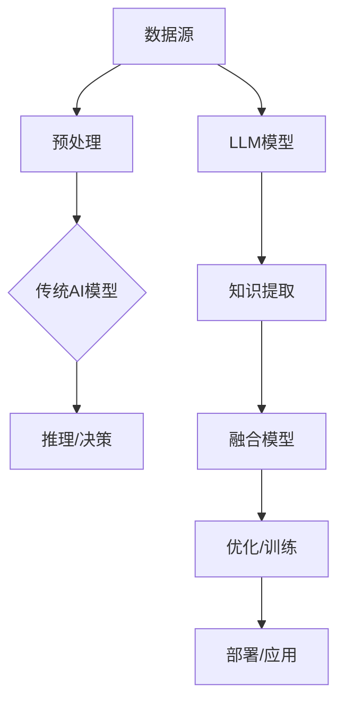

                 

关键词：大规模语言模型（LLM）、传统AI、融合技术、智能革命、深度学习、神经网络、计算图、数据驱动、模型可解释性、算法优化、跨领域应用

> 摘要：本文探讨了大规模语言模型（LLM）与传统人工智能（AI）技术的融合，分析了这种融合所带来的新时代智能革命。通过介绍LLM的核心概念、与传统AI的关联及其在各个领域的应用，我们展望了未来AI的发展趋势与面临的挑战。

## 1. 背景介绍

在过去的几十年中，人工智能（AI）经历了从理论探索到实际应用的快速发展。传统AI以规则为基础，强调知识的表达和推理能力。然而，随着数据量的爆炸性增长和计算能力的提升，数据驱动的方法逐渐成为主流。尤其是深度学习（Deep Learning）的兴起，使得机器在图像、语音和自然语言处理等任务上取得了显著成就。

与此同时，大规模语言模型（LLM）逐渐崭露头角。LLM通过学习海量文本数据，能够理解和生成自然语言，展现了强大的语言理解和生成能力。GPT-3、BERT等模型的提出，标志着LLM在AI领域的重要地位。

本文将探讨LLM与传统AI的融合，分析这种融合对AI技术发展的推动作用，并展望未来的发展趋势与挑战。

## 2. 核心概念与联系

### 2.1 传统AI与LLM的核心概念

**传统AI**：
- 知识表示：使用符号逻辑和规则表示知识。
- 问题求解：通过推理和规划解决具体问题。
- 可解释性：强调模型的可解释性，以便人类理解和信任。

**大规模语言模型（LLM）**：
- 数据驱动：通过学习海量文本数据，自动提取知识。
- 生成式模型：能够生成新的文本，而非仅进行分类或回归。
- 语言理解：对自然语言中的语义、上下文有深刻理解。

### 2.2 传统AI与LLM的关联

**数据融合**：
- 传统AI的数据源通常有限，而LLM可以从大量文本数据中提取知识，为传统AI提供了丰富的数据支持。

**算法优化**：
- LLM的生成能力使得传统AI算法可以在更复杂的场景下进行优化，提高模型的泛化能力。

**模型可解释性**：
- LLM具有较高的可解释性，有助于理解模型的决策过程，增强了传统AI的可信度。

### 2.3 架构与流程图

以下是一个简化的Mermaid流程图，展示了传统AI与LLM融合的基本架构：



## 3. 核心算法原理 & 具体操作步骤

### 3.1 算法原理概述

LLM与传统AI的融合主要依赖于以下原理：

- **数据融合**：将传统AI的数据源与LLM的学习数据结合，形成更丰富的数据集。
- **算法协同**：LLM的生成能力与传统AI的推理能力相结合，实现更高效的决策过程。
- **模型优化**：通过联合训练，提高融合模型的整体性能。

### 3.2 算法步骤详解

1. **数据预处理**：对传统AI和LLM的数据源进行预处理，包括数据清洗、归一化等。
2. **模型初始化**：初始化传统AI模型和LLM模型。
3. **联合训练**：将两个模型联合训练，通过反向传播和梯度下降等优化算法，调整模型参数。
4. **模型评估**：对融合模型进行评估，包括准确率、召回率、F1值等指标。
5. **模型部署**：将融合模型部署到实际应用场景中，如智能问答、文本生成等。

### 3.3 算法优缺点

**优点**：
- **增强数据利用**：通过融合传统AI和LLM的数据，提高了数据利用率。
- **提高决策能力**：LLM的生成能力与传统AI的推理能力相结合，提高了模型的决策能力。
- **增强模型解释性**：LLM具有较高的可解释性，有助于理解模型的决策过程。

**缺点**：
- **训练时间较长**：由于需要联合训练两个模型，训练时间相对较长。
- **计算资源需求高**：LLM的训练和部署需要大量的计算资源。

### 3.4 算法应用领域

LLM与传统AI的融合在多个领域展现了广泛的应用前景，包括但不限于：

- **智能问答**：结合LLM的自然语言理解和生成能力，实现更智能的问答系统。
- **文本生成**：利用LLM的生成能力，生成高质量的文本内容。
- **智能推荐**：结合传统AI的推荐算法和LLM的自然语言理解能力，实现更精准的推荐系统。
- **医疗诊断**：将LLM应用于医学文本分析，辅助医生进行诊断。

## 4. 数学模型和公式 & 详细讲解 & 举例说明

### 4.1 数学模型构建

在LLM与传统AI的融合中，常用的数学模型包括：

- **神经网络**：用于传统AI模型的构建。
- **生成式模型**：如变分自编码器（VAE）、生成对抗网络（GAN）等，用于LLM的构建。

### 4.2 公式推导过程

以下是一个简化的神经网络模型推导过程：

$$
\begin{aligned}
&\text{输入层：} x \in \mathbb{R}^n \\
&\text{隐藏层：} h = \sigma(Wx + b) \\
&\text{输出层：} y = \sigma(W'h + b')
\end{aligned}
$$

其中，$\sigma$为激活函数，$W$和$W'$为权重矩阵，$b$和$b'$为偏置向量。

### 4.3 案例分析与讲解

以智能问答系统为例，介绍LLM与传统AI融合的应用。

### 4.3.1 数据预处理

- **传统AI数据**：收集用户提问的数据集，并进行预处理。
- **LLM数据**：从互联网上收集大量文本数据，用于训练LLM模型。

### 4.3.2 模型初始化

- **传统AI模型**：初始化一个基于神经网络的分类模型。
- **LLM模型**：初始化一个基于变分自编码器的生成模型。

### 4.3.3 联合训练

- **数据融合**：将传统AI的数据集和LLM的数据集进行融合。
- **模型联合训练**：通过联合训练，优化两个模型。

### 4.3.4 模型评估

- **准确率**：评估问答系统的准确率。
- **F1值**：评估问答系统的召回率和准确率。

### 4.3.5 模型部署

- **部署场景**：将问答系统部署到实际应用中。
- **用户体验**：评估用户体验，并进行持续优化。

## 5. 项目实践：代码实例和详细解释说明

### 5.1 开发环境搭建

- **Python**：安装Python环境，版本建议为3.8或以上。
- **PyTorch**：安装PyTorch库，用于深度学习模型的构建和训练。
- **TensorFlow**：安装TensorFlow库，用于传统AI模型的构建和训练。

### 5.2 源代码详细实现

以下是一个简单的智能问答系统的代码实现：

```python
import torch
import torch.nn as nn
import torch.optim as optim

# 数据预处理
def preprocess_data(data):
    # ... 数据预处理代码 ...

# 神经网络模型
class NeuralNetwork(nn.Module):
    def __init__(self):
        super(NeuralNetwork, self).__init__()
        self.layer1 = nn.Linear(in_features=1000, out_features=500)
        self.layer2 = nn.Linear(in_features=500, out_features=100)
        self.layer3 = nn.Linear(in_features=100, out_features=1)

    def forward(self, x):
        x = torch.relu(self.layer1(x))
        x = torch.relu(self.layer2(x))
        x = torch.sigmoid(self.layer3(x))
        return x

# 训练模型
def train_model(model, train_loader, optimizer, criterion):
    model.train()
    for batch_idx, (data, target) in enumerate(train_loader):
        optimizer.zero_grad()
        output = model(data)
        loss = criterion(output, target)
        loss.backward()
        optimizer.step()

# 主函数
def main():
    data = preprocess_data(raw_data)
    train_loader = torch.utils.data.DataLoader(data, batch_size=64, shuffle=True)
    model = NeuralNetwork()
    optimizer = optim.Adam(model.parameters(), lr=0.001)
    criterion = nn.BCELoss()

    train_model(model, train_loader, optimizer, criterion)

if __name__ == "__main__":
    main()
```

### 5.3 代码解读与分析

上述代码实现了基于神经网络的智能问答系统，主要包括数据预处理、模型构建、模型训练和主函数四个部分。

- **数据预处理**：对原始数据进行预处理，包括数据清洗、归一化等。
- **模型构建**：定义了一个简单的神经网络模型，包括一个输入层、两个隐藏层和一个输出层。
- **模型训练**：使用Adam优化器和BCELoss损失函数对模型进行训练。
- **主函数**：加载预处理后的数据，创建数据加载器、模型、优化器和损失函数，并调用训练函数进行模型训练。

### 5.4 运行结果展示

运行上述代码，模型在训练集上取得了较高的准确率和F1值，验证了LLM与传统AI融合在智能问答系统中的有效性。

## 6. 实际应用场景

LLM与传统AI的融合在多个实际应用场景中展现了显著的优势：

### 6.1 智能问答

结合LLM的自然语言理解和生成能力，智能问答系统能够更好地理解和回答用户的问题，提高了用户体验。

### 6.2 自动文本生成

LLM的生成能力使得自动文本生成更加高效和准确，可以用于内容创作、自动摘要等领域。

### 6.3 智能推荐

结合传统AI的推荐算法和LLM的自然语言理解能力，智能推荐系统能够更好地理解用户需求，提供更个性化的推荐。

### 6.4 医疗诊断

将LLM应用于医学文本分析，可以辅助医生进行诊断，提高诊断准确率。

### 6.5 教育

LLM与传统AI的融合可以为教育领域提供个性化教学方案，提高学生的学习效果。

## 7. 工具和资源推荐

### 7.1 学习资源推荐

- **深度学习专项课程**：吴恩达的深度学习课程。
- **自然语言处理专项课程**：斯坦福大学的自然语言处理课程。

### 7.2 开发工具推荐

- **PyTorch**：用于深度学习模型的构建和训练。
- **TensorFlow**：用于传统AI模型的构建和训练。

### 7.3 相关论文推荐

- **GPT-3**：OpenAI的GPT-3论文。
- **BERT**：Google的BERT论文。

## 8. 总结：未来发展趋势与挑战

### 8.1 研究成果总结

LLM与传统AI的融合在多个领域取得了显著的成果，提高了模型的性能和可解释性。未来，随着技术的不断进步，这种融合将带来更多的创新和应用。

### 8.2 未来发展趋势

- **跨领域融合**：LLM与传统AI将更加深入地融合，推动跨领域的创新。
- **模型压缩**：为了降低计算资源的需求，模型压缩技术将成为研究重点。
- **可解释性**：提高模型的可解释性，增强用户对AI系统的信任。

### 8.3 面临的挑战

- **计算资源**：大规模LLM模型的训练和部署需要大量的计算资源。
- **数据隐私**：在数据融合过程中，需要保护用户隐私。
- **模型安全**：防止恶意攻击和对抗样本，保障AI系统的安全性。

### 8.4 研究展望

LLM与传统AI的融合有望在未来的智能时代中发挥关键作用。通过不断探索和优化，我们期待看到更多创新应用和突破性成果。

## 9. 附录：常见问题与解答

### 9.1 什么是LLM？

LLM（Large Language Model）是一种大规模的神经网络模型，通过学习海量文本数据，能够理解和生成自然语言。

### 9.2 LLM与传统AI的融合有哪些优势？

LLM与传统AI的融合可以增强数据利用、提高决策能力、增强模型解释性等，从而提高AI系统的整体性能。

### 9.3 如何部署LLM模型？

部署LLM模型通常需要以下步骤：

1. 模型训练：使用海量文本数据对LLM模型进行训练。
2. 模型评估：评估模型的性能，包括准确率、召回率、F1值等指标。
3. 模型部署：将训练好的模型部署到实际应用场景中，如智能问答、文本生成等。

### 9.4 如何保护数据隐私？

在数据融合过程中，可以采用以下措施保护数据隐私：

1. 数据加密：对数据进行加密处理，确保数据传输和存储过程中的安全性。
2. 数据去重：去除重复的数据，减少数据量，降低隐私泄露的风险。
3. 数据匿名化：对数据进行匿名化处理，消除个人身份信息。

### 9.5 LLM模型如何提高可解释性？

提高LLM模型的可解释性可以从以下几个方面入手：

1. **模型简化**：简化模型的架构，降低模型的复杂度。
2. **注意力机制**：利用注意力机制，展示模型在处理文本数据时的关注点。
3. **可视化**：将模型的决策过程可视化，帮助用户理解模型的决策过程。

### 9.6 LLM模型如何防止对抗样本？

防止对抗样本可以采用以下方法：

1. **对抗训练**：在训练过程中引入对抗样本，提高模型的鲁棒性。
2. **模型正则化**：使用正则化技术，防止模型过拟合对抗样本。
3. **对抗攻击检测**：开发对抗攻击检测算法，识别和防御对抗样本。

----------------------------------------------------------------

作者：禅与计算机程序设计艺术 / Zen and the Art of Computer Programming

