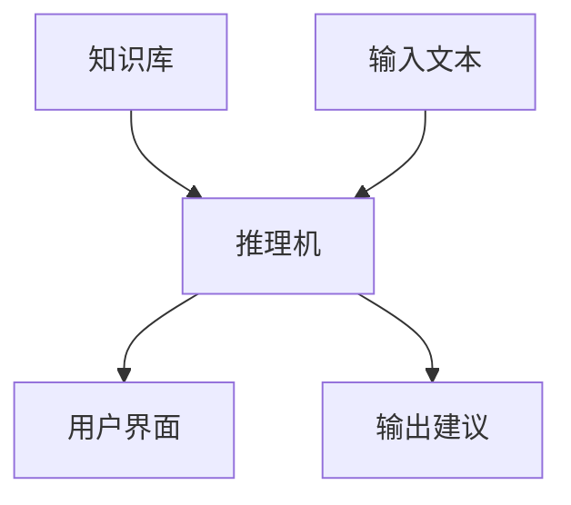

                 

关键词：大型语言模型（LLM），传统专家系统，对比分析，技术架构，算法原理，应用领域，未来展望。

> 摘要：本文旨在探讨大型语言模型（LLM）与传统专家系统之间的异同，从技术架构、算法原理、应用领域等方面进行深入比较。通过对两者的对比分析，揭示各自的优势与局限性，为读者提供对未来人工智能发展的思考与展望。

## 1. 背景介绍

### 1.1 传统专家系统

专家系统是一种基于知识表示和推理的智能系统，旨在模拟人类专家的决策过程。自20世纪70年代以来，专家系统在医学诊断、金融分析、企业管理等领域取得了显著成果。然而，传统专家系统在处理不确定性和复杂问题时存在一定局限性。

### 1.2 大型语言模型（LLM）

近年来，随着深度学习和自然语言处理技术的快速发展，大型语言模型（LLM）如GPT-3、BERT等逐渐崭露头角。这些模型在语言生成、文本分类、机器翻译等任务中表现出色，成为人工智能领域的重要研究方向。

## 2. 核心概念与联系

### 2.1 技术架构

**传统专家系统：** 传统专家系统主要由知识库、推理机、用户界面三部分组成。知识库存储领域专家的经验和知识；推理机负责基于知识库进行推理，为用户提供决策建议；用户界面用于与用户进行交互。

**LLM：** LLM是基于神经网络的大规模预训练模型，通过学习海量文本数据，模型能够生成具有连贯性和可理解性的语言。其技术架构主要包括输入层、隐藏层和输出层，通过反向传播算法进行参数优化。

### 2.2 算法原理

**传统专家系统：** 传统专家系统主要采用基于规则的推理方法，将领域专家的知识表示为一系列规则，通过匹配和推理实现对问题的求解。

**LLM：** LLM基于深度学习技术，采用Transformer架构进行语言建模。通过多层神经网络，模型能够捕捉语言中的复杂模式和依赖关系。

### 2.3 Mermaid 流程图

## 3. 核心算法原理 & 具体操作步骤

### 3.1 算法原理概述

**传统专家系统：** 传统专家系统通过规则匹配和推理实现问题求解。其核心在于知识库的构建和规则的制定。

**LLM：** LLM通过大规模预训练，学习语言中的统计规律和依赖关系。在生成文本时，模型根据上下文信息进行自适应调整。

### 3.2 算法步骤详解

**传统专家系统：**

1. 用户输入问题；
2. 系统在知识库中搜索相关规则；
3. 对规则进行匹配和推理；
4. 输出决策建议。

**LLM：**

1. 输入待生成文本的上下文信息；
2. 模型根据上下文生成初始文本；
3. 对生成的文本进行优化和调整；
4. 输出生成的文本。

### 3.3 算法优缺点

**传统专家系统：**

- **优点：** 结构清晰，易于理解和实现；规则制定灵活，适用于特定领域的问题。
- **缺点：** 难以处理不确定性和复杂问题；知识库构建和维护成本高。

**LLM：**

- **优点：** 能够处理大规模数据和复杂问题；生成文本具有连贯性和可理解性。
- **缺点：** 对特定领域的知识积累有限；模型训练和部署成本较高。

### 3.4 算法应用领域

**传统专家系统：** 医学诊断、金融分析、企业管理等。

**LLM：** 文本生成、机器翻译、对话系统等。

## 4. 数学模型和公式 & 详细讲解 & 举例说明

### 4.1 数学模型构建

**传统专家系统：** 基于概率图模型，如贝叶斯网络、决策树等。

**LLM：** 基于深度学习模型，如Transformer、BERT等。

### 4.2 公式推导过程

**传统专家系统：**

1. 条件概率公式：
$$ P(A|B) = \frac{P(B|A) \cdot P(A)}{P(B)} $$
2. 贝叶斯定理：
$$ P(A|B) = \frac{P(B|A) \cdot P(A)}{\sum_{i} P(B|i) \cdot P(i)} $$

**LLM：**

1. Transformer模型损失函数：
$$ L = -\sum_{i} \log p(y_i|x) $$
2. BERT模型损失函数：
$$ L = \frac{1}{N} \sum_{i} -\log p(y_i|x) $$

### 4.3 案例分析与讲解

**传统专家系统：** 以医学诊断为例，分析患者症状，结合知识库中的规则，输出可能的疾病诊断。

**LLM：** 以文本生成为例，输入一段文本，生成与之相关的话题或续写内容。

## 5. 项目实践：代码实例和详细解释说明

### 5.1 开发环境搭建

1. 安装Python环境和相关依赖；
2. 下载并配置预训练模型；
3. 准备数据集。

### 5.2 源代码详细实现

1. 加载预训练模型；
2. 输入待生成文本的上下文信息；
3. 调用模型生成文本；
4. 对生成的文本进行优化和调整。

### 5.3 代码解读与分析

1. 模型加载与配置；
2. 数据预处理与生成；
3. 文本生成与优化。

### 5.4 运行结果展示

1. 输出生成的文本；
2. 分析文本质量。

## 6. 实际应用场景

1. 文本生成：如自动写作、对话系统等；
2. 机器翻译：如跨语言文本生成、多语言翻译等；
3. 问答系统：如智能客服、学术问答等。

### 6.4 未来应用展望

1. 深度学习模型与传统专家系统的融合；
2. 多模态数据的处理与应用；
3. 新型人工智能应用场景的探索。

## 7. 工具和资源推荐

### 7.1 学习资源推荐

1. 《深度学习》（Goodfellow, Bengio, Courville）；
2. 《统计学习方法》（李航）；
3. 《人工智能：一种现代的方法》（ Stuart Russell, Peter Norvig）。

### 7.2 开发工具推荐

1. Python；
2. TensorFlow；
3. PyTorch。

### 7.3 相关论文推荐

1. “Attention Is All You Need”；
2. “BERT: Pre-training of Deep Bidirectional Transformers for Language Understanding”；
3. “GPT-3: Language Models are few-shot learners”。

## 8. 总结：未来发展趋势与挑战

### 8.1 研究成果总结

1. 传统专家系统在特定领域取得了显著成果；
2. LLM在文本生成、机器翻译等任务中表现出色。

### 8.2 未来发展趋势

1. 深度学习模型与传统专家系统的融合；
2. 多模态数据的处理与应用；
3. 新型人工智能应用场景的探索。

### 8.3 面临的挑战

1. 模型训练和部署成本高；
2. 隐私保护和数据安全；
3. 人工智能伦理和法律问题。

### 8.4 研究展望

1. 探索新型深度学习模型；
2. 加强人工智能伦理和法律研究；
3. 深度学习模型与传统专家系统的融合。

## 9. 附录：常见问题与解答

1. **问题1：** 传统专家系统和LLM之间的区别是什么？
   **解答1：** 传统专家系统基于规则进行推理，适用于特定领域；LLM基于深度学习，能够处理大规模数据和复杂问题。

2. **问题2：** LLM的优势是什么？
   **解答2：** LLM具有强大的文本生成能力、自适应调整能力，适用于多种语言处理任务。

3. **问题3：** 传统专家系统有哪些局限性？
   **解答3：** 传统专家系统难以处理不确定性和复杂问题，知识库构建和维护成本高。

----------------------------------------------------------------

**作者：禅与计算机程序设计艺术 / Zen and the Art of Computer Programming**<|user|>

