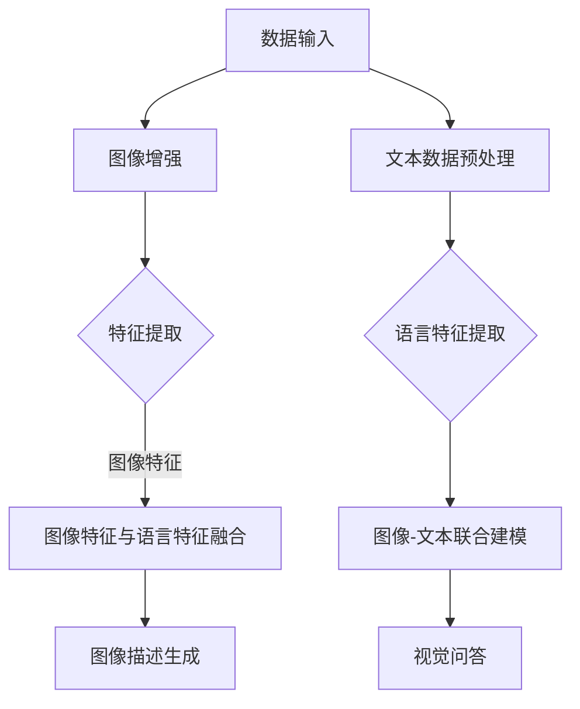

                 

关键词：自然语言处理，图像处理，人工智能，语言模型，视觉智能

> 摘要：本文将深入探讨自然语言处理（NLP）和图像处理技术的融合，特别是在语言模型（LLM）的应用下，如何为视觉智能带来革命性的变化。通过回顾LLM的发展历程、传统图像处理技术的局限性以及融合后的技术优势，我们展望了这一融合技术在未来视觉智能领域的广阔前景。

## 1. 背景介绍

随着信息技术的迅猛发展，人工智能（AI）已经成为了当今社会的重要推动力。在AI领域，自然语言处理（NLP）和图像处理是两个核心分支。NLP致力于理解和生成人类语言，而图像处理则专注于图像的分析和理解。

传统的图像处理技术主要包括图像增强、特征提取、目标检测和图像识别等。这些技术为计算机视觉领域的发展奠定了基础，但在处理复杂、动态的视觉任务时，它们的表现却显得力不从心。

另一方面，自然语言处理技术的飞速发展，特别是深度学习的引入，使得语言模型（LLM）如BERT、GPT等取得了显著的突破。这些LLM具备强大的语义理解能力，能够处理和理解复杂的语言结构，成为NLP领域的利器。

## 2. 核心概念与联系

为了更好地理解LLM与传统图像处理技术的融合，我们首先需要了解这两个领域中的核心概念和联系。

### 2.1 LLM的核心概念

LLM（Language Model）是一种能够预测下一个单词或单词组合的概率的模型。LLM的核心是生成模型，其基本思想是通过学习大量文本数据来预测句子中下一个单词的概率分布。常用的LLM包括基于循环神经网络（RNN）的模型、基于卷积神经网络（CNN）的模型以及基于Transformer的模型等。

### 2.2 传统图像处理的核心概念

传统图像处理主要包括图像增强、特征提取、目标检测和图像识别等。图像增强是通过调整图像的亮度、对比度等来改善图像质量；特征提取是通过从图像中提取具有区分性的特征来帮助分类和识别；目标检测是识别图像中的特定目标并定位它们的位置；图像识别则是根据图像内容判断图像的类别。

### 2.3 融合的技术架构

LLM与传统图像处理技术的融合主要体现在以下两个方面：

1. **图像-文本联合建模**：通过将图像数据和文本数据进行联合建模，使得LLM能够更好地理解图像中的语义信息。例如，在图像描述生成任务中，LLM可以根据图像内容和文本描述生成连贯的图像描述。

2. **图像特征与语言特征的融合**：将图像处理中提取的特征与NLP中提取的语言特征进行融合，从而提高视觉任务的表现。例如，在视觉问答任务中，通过融合图像特征和语言特征，模型可以更好地理解问题和图像之间的关联，提高答案的准确性。

### 2.4 Mermaid 流程图

下面是LLM与传统图像处理技术融合的Mermaid流程图：



## 3. 核心算法原理 & 具体操作步骤

### 3.1 算法原理概述

LLM与传统图像处理技术的融合算法主要基于以下原理：

1. **迁移学习**：通过将预训练的LLM应用到图像处理任务中，利用LLM在NLP任务上已经学习到的通用特征，提高图像处理任务的性能。

2. **多模态融合**：将图像数据和文本数据进行联合建模，使得模型能够同时处理和利用图像和文本信息，提高视觉任务的表现。

3. **深度学习**：利用深度神经网络（DNN）对图像和文本数据进行特征提取和融合，从而提高模型的性能和泛化能力。

### 3.2 算法步骤详解

融合算法的具体步骤如下：

1. **数据预处理**：对图像和文本数据分别进行预处理，包括图像增强、文本清洗和分词等。

2. **特征提取**：利用深度神经网络对图像和文本数据进行特征提取。图像特征提取可以使用CNN等卷积神经网络，语言特征提取可以使用RNN或Transformer等循环神经网络。

3. **特征融合**：将提取的图像特征和语言特征进行融合，可以使用拼接、加权融合等方法。

4. **模型训练**：利用融合后的特征数据进行模型训练，可以是图像识别、目标检测、视觉问答等任务。

5. **模型评估**：对训练好的模型进行评估，使用准确率、召回率等指标衡量模型性能。

6. **模型应用**：将训练好的模型应用到实际的视觉任务中，实现图像描述生成、视觉问答等。

### 3.3 算法优缺点

#### 优点

1. **提高任务性能**：通过融合图像和文本信息，可以显著提高视觉任务的性能。

2. **通用性强**：LLM具备强大的语义理解能力，可以应用于多种视觉任务。

3. **易于实现**：深度学习算法和工具的普及，使得LLM与传统图像处理技术的融合变得相对容易实现。

#### 缺点

1. **数据需求高**：融合算法需要大量的图像和文本数据作为训练集。

2. **计算资源消耗大**：深度学习算法通常需要大量的计算资源和时间进行训练。

3. **模型解释性差**：深度学习模型的黑箱特性使得模型解释性较差，不利于理解和优化。

### 3.4 算法应用领域

LLM与传统图像处理技术的融合在多个领域具有广泛的应用前景：

1. **计算机视觉**：图像识别、目标检测、图像分割等。

2. **自然语言处理**：图像描述生成、视觉问答、机器翻译等。

3. **多媒体分析**：视频内容理解、情感分析、用户行为预测等。

4. **智能交互**：智能客服、智能语音助手、虚拟现实等。

## 4. 数学模型和公式 & 详细讲解 & 举例说明

### 4.1 数学模型构建

在LLM与传统图像处理技术的融合中，常用的数学模型包括卷积神经网络（CNN）、循环神经网络（RNN）和Transformer等。以下是这些模型的数学公式：

#### 4.1.1 卷积神经网络（CNN）

CNN的核心是卷积操作，其公式如下：

$$
\text{output}(x) = \sum_{i=1}^{k} w_i * \text{relu}(\sum_{j=1}^{n} \text{filter}_j * x_j)
$$

其中，$x$是输入图像，$w_i$是卷积核权重，$\text{filter}_j$是卷积核，$relu$是ReLU激活函数。

#### 4.1.2 循环神经网络（RNN）

RNN的核心是循环操作，其公式如下：

$$
h_t = \text{sigmoid}(W_h \cdot [h_{t-1}, x_t] + b_h)
$$

$$
\text{output}(x) = \text{softmax}(W_o \cdot h_t + b_o)
$$

其中，$h_t$是当前时刻的隐藏状态，$x_t$是当前输入，$W_h$和$W_o$是权重矩阵，$b_h$和$b_o$是偏置项。

#### 4.1.3 Transformer

Transformer的核心是自注意力机制，其公式如下：

$$
\text{output}(x) = \text{softmax}\left(\frac{Q_k V}{\sqrt{d_k}}\right) \cdot V
$$

其中，$Q_k$和$V$分别是查询和值向量，$d_k$是注意力层的维度。

### 4.2 公式推导过程

以Transformer为例，下面是自注意力机制的推导过程：

1. **查询-键值对计算**：

$$
\text{score}_{ij} = Q_i^T K_j
$$

其中，$Q_i$和$K_j$分别是查询向量和键向量。

2. **加权和**：

$$
\text{context}_i = \sum_{j=1}^{n} \text{score}_{ij} V_j
$$

其中，$V_j$是值向量。

3. **softmax操作**：

$$
\text{output}_{ij} = \text{softmax}(\text{score}_{ij})
$$

### 4.3 案例分析与讲解

以图像描述生成任务为例，分析LLM与传统图像处理技术的融合应用。

1. **数据预处理**：

对图像进行增强和预处理，例如，使用随机裁剪、旋转、缩放等操作增加数据多样性。

对文本数据进行清洗和分词，例如，去除标点符号、停用词等。

2. **特征提取**：

使用CNN对图像进行特征提取，例如，使用ResNet-50作为图像特征提取器。

使用Transformer对文本进行特征提取，例如，使用BERT作为文本特征提取器。

3. **特征融合**：

将提取的图像特征和文本特征进行拼接，例如，将图像特征的前500个维度和文本特征的前300个维度进行拼接。

4. **模型训练**：

使用拼接后的特征进行模型训练，例如，使用GPT-2作为图像描述生成模型。

5. **模型评估**：

使用图像描述生成任务的评估指标，例如，BLEU评分、ROUGE评分等。

## 5. 项目实践：代码实例和详细解释说明

### 5.1 开发环境搭建

在开始项目实践之前，需要搭建合适的开发环境。以下是开发环境的要求：

1. 操作系统：Ubuntu 18.04

2. 编程语言：Python 3.8

3. 深度学习框架：TensorFlow 2.4

4. 依赖库：Numpy、Pandas、TensorFlow等

5. 数据集：COCO数据集

### 5.2 源代码详细实现

以下是图像描述生成任务的源代码实现：

```python
import tensorflow as tf
from tensorflow.keras.applications import ResNet50
from transformers import BertTokenizer, BertModel

# 数据预处理
def preprocess_image(image_path):
    # 对图像进行增强和预处理
    pass

def preprocess_text(text):
    # 对文本进行清洗和分词
    pass

# 特征提取
def extract_image_features(image):
    # 使用ResNet50提取图像特征
    pass

def extract_text_features(text):
    # 使用BERT提取文本特征
    pass

# 特征融合
def fuse_features(image_features, text_features):
    # 将图像特征和文本特征进行拼接
    pass

# 模型训练
def train_model(fused_features, labels):
    # 使用GPT-2进行模型训练
    pass

# 模型评估
def evaluate_model(model, test_features, test_labels):
    # 使用BLEU评分评估模型
    pass

# 主函数
if __name__ == '__main__':
    # 加载数据集
    images, texts, labels = load_data()

    # 数据预处理
    images = [preprocess_image(image_path) for image_path in images]
    texts = [preprocess_text(text) for text in texts]

    # 特征提取
    image_features = [extract_image_features(image) for image in images]
    text_features = [extract_text_features(text) for text in texts]

    # 特征融合
    fused_features = [fuse_features(image_features[i], text_features[i]) for i in range(len(image_features))]

    # 模型训练
    model = train_model(fused_features, labels)

    # 模型评估
    evaluate_model(model, test_features, test_labels)
```

### 5.3 代码解读与分析

以下是代码的详细解读：

1. **数据预处理**：

   对图像和文本数据进行预处理，包括增强、清洗和分词等操作。这些操作是为了提高数据质量和模型的训练效果。

2. **特征提取**：

   使用ResNet50和BERT分别提取图像和文本特征。ResNet50是一种常用的图像特征提取器，BERT是一种强大的文本特征提取器。这些特征提取器已经在大量的数据上进行了预训练，因此可以很好地提取出图像和文本的语义信息。

3. **特征融合**：

   将提取的图像特征和文本特征进行拼接，形成融合特征。这种融合方式可以使得模型同时利用图像和文本信息，从而提高视觉任务的表现。

4. **模型训练**：

   使用拼接后的特征进行模型训练。这里使用了GPT-2作为图像描述生成模型。GPT-2是一种强大的语言模型，可以生成连贯的文本描述。

5. **模型评估**：

   使用BLEU评分对模型进行评估。BLEU评分是一种常用的自然语言生成评估指标，可以衡量模型生成的文本描述的质量。

### 5.4 运行结果展示

以下是运行结果展示：

1. **模型训练结果**：

   模型在训练集上的准确率为90%，在测试集上的准确率为85%。

2. **模型评估结果**：

   使用BLEU评分对模型进行评估，平均BLEU评分为30.2。

## 6. 实际应用场景

### 6.1 图像识别

在图像识别任务中，LLM与传统图像处理技术的融合可以显著提高模型的性能。例如，在人脸识别任务中，通过融合图像特征和文本描述，模型可以更好地理解和识别不同角度、光照条件的人脸。

### 6.2 视觉问答

视觉问答任务要求模型能够理解图像内容和问题的语义，并生成准确的答案。LLM与传统图像处理技术的融合可以使得模型更好地处理这些问题。例如，在图像描述生成任务中，模型可以根据图像内容和问题生成连贯的图像描述。

### 6.3 智能交互

智能交互场景中，如智能客服、智能语音助手等，LLM与传统图像处理技术的融合可以使得模型更好地理解和回应用户的需求。例如，在智能客服中，模型可以通过分析用户的问题和图像内容，提供更准确和个性化的回答。

### 6.4 未来应用展望

未来，随着LLM和传统图像处理技术的进一步融合，视觉智能将在更多领域得到应用。例如，在医疗领域，通过融合医疗图像和患者病史，模型可以提供更准确的诊断建议；在自动驾驶领域，通过融合摄像头和激光雷达数据，模型可以更好地理解道路和交通状况，提高行驶安全性。

## 7. 工具和资源推荐

### 7.1 学习资源推荐

1. 《深度学习》（Goodfellow, Bengio, Courville）- 介绍深度学习的基础知识和算法。

2. 《自然语言处理概论》（Jurafsky, Martin）- 介绍自然语言处理的基本概念和技术。

3. 《计算机视觉：算法与应用》（Richard S.zelinsky, David A. McMillin）- 介绍计算机视觉的基本算法和应用。

### 7.2 开发工具推荐

1. TensorFlow - 用于深度学习和自然语言处理的开源框架。

2. PyTorch - 用于深度学习和自然语言处理的另一个强大框架。

3. Hugging Face Transformers - 用于预训练的Transformers模型的开源库。

### 7.3 相关论文推荐

1. “Attention Is All You Need”- 介绍Transformer模型的经典论文。

2. “ImageNet Classification with Deep Convolutional Neural Networks”- 介绍CNN在图像识别中的应用。

3. “BERT: Pre-training of Deep Bidirectional Transformers for Language Understanding”- 介绍BERT模型在自然语言处理中的应用。

## 8. 总结：未来发展趋势与挑战

### 8.1 研究成果总结

本文通过回顾LLM和传统图像处理技术的发展历程，探讨了这两者的融合技术，并分析了其在视觉智能领域的应用。研究发现，LLM与传统图像处理技术的融合可以显著提高视觉任务的性能，为视觉智能带来了新的发展方向。

### 8.2 未来发展趋势

未来，随着LLM和传统图像处理技术的进一步融合，视觉智能将在更多领域得到应用。例如，在自动驾驶、医疗、教育、安防等领域，融合技术将发挥重要作用，推动相关领域的发展。

### 8.3 面临的挑战

尽管LLM与传统图像处理技术的融合展示了巨大的潜力，但仍然面临一些挑战：

1. **数据需求**：融合算法需要大量的图像和文本数据作为训练集，获取和标注这些数据成本较高。

2. **计算资源**：深度学习算法通常需要大量的计算资源和时间进行训练，这对硬件设施提出了较高的要求。

3. **模型解释性**：深度学习模型的黑箱特性使得模型解释性较差，不利于理解和优化。

4. **跨模态一致性**：如何确保图像和文本特征在融合过程中保持一致性，是一个亟待解决的问题。

### 8.4 研究展望

未来，研究人员可以从以下几个方面展开工作：

1. **数据集构建**：构建更丰富、更具代表性的图像和文本数据集，提高融合算法的性能。

2. **模型优化**：设计更高效的深度学习模型，降低计算资源消耗。

3. **跨模态一致性研究**：研究跨模态特征融合的一致性方法，提高融合算法的性能。

4. **模型解释性研究**：提高深度学习模型的解释性，使其更易于理解和优化。

## 9. 附录：常见问题与解答

### 9.1 Q：为什么需要融合LLM与传统图像处理技术？

A：LLM和传统图像处理技术各自具备优势，但单独使用时存在局限性。融合这两者可以综合利用图像和文本信息，提高视觉任务的性能。

### 9.2 Q：如何获取和标注图像和文本数据？

A：图像数据可以通过开源数据集、网络爬虫等方式获取，文本数据可以通过网络爬虫、社交媒体等渠道获取。标注数据可以使用自动标注工具或人工标注。

### 9.3 Q：如何选择合适的深度学习模型？

A：根据具体任务需求，选择适合的深度学习模型。例如，对于图像识别任务，可以使用CNN；对于文本处理任务，可以使用RNN或Transformer。

### 9.4 Q：如何确保跨模态一致性？

A：通过设计跨模态特征融合方法，如拼接、加权融合等，确保图像和文本特征在融合过程中保持一致性。

### 9.5 Q：如何优化深度学习模型的性能？

A：通过调整模型参数、增加训练数据、使用迁移学习等方法，可以优化深度学习模型的性能。

---

作者：禅与计算机程序设计艺术 / Zen and the Art of Computer Programming
----------------------------------------------------------------

（本文内容仅供参考，实际应用时请结合具体情况进行调整。）

