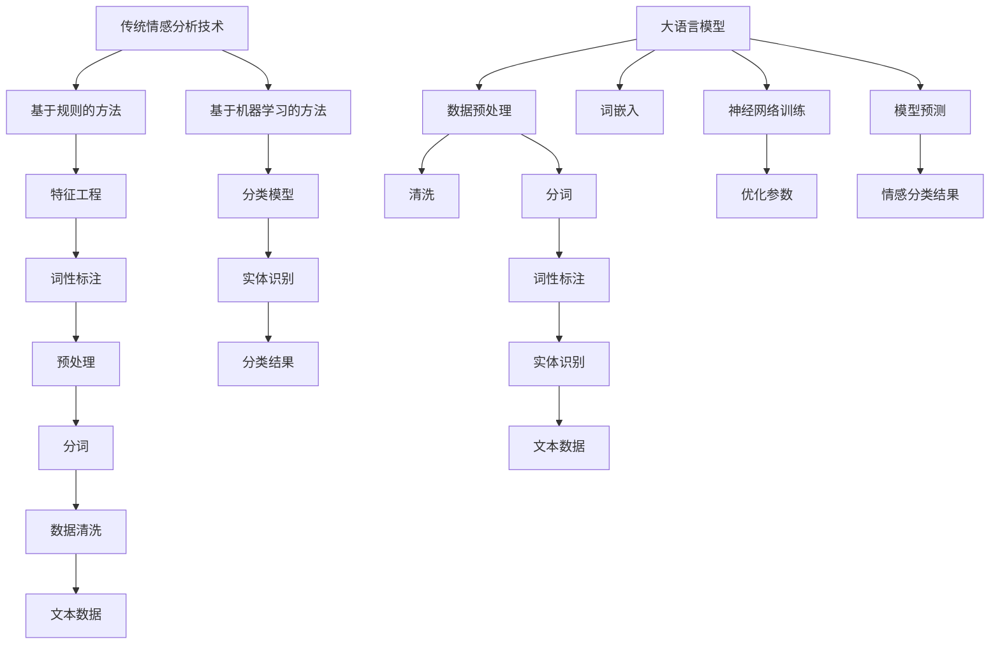

                 

关键词：情感分析，大语言模型，自然语言处理，人工智能，深度学习，神经网络，情感智能

> 摘要：本文将探讨大语言模型（LLM）与传统情感分析技术的融合，旨在提高情感智能的分析水平。通过分析传统情感分析技术的局限性，介绍大语言模型的工作原理及其在情感分析中的应用，本文将深入探讨这两种技术的融合方法，探讨其优势与挑战，并展望未来的发展趋势。

## 1. 背景介绍

情感分析作为自然语言处理（NLP）的一个重要分支，旨在从文本中识别和提取情感信息。传统的情感分析技术主要依赖于规则和机器学习算法，通过特征提取和分类模型来实现。然而，随着自然语言复杂性的增加，传统方法在处理复杂情感表达、多语境情感分析等方面面临诸多挑战。

近年来，大语言模型（LLM）的兴起为情感分析带来了新的契机。LLM，如GPT、BERT等，通过训练大规模的神经网络，可以捕捉到文本的深层语义信息，为情感分析提供了更为强大的工具。本文将深入探讨LLM与传统情感分析技术的融合，以实现情感智能的新高度。

## 2. 核心概念与联系

### 2.1 传统情感分析技术

传统情感分析技术主要包括基于规则的方法和基于机器学习的方法。基于规则的方法依赖于手动的特征工程，通过对文本进行分词、词性标注、实体识别等预处理，然后使用规则库进行情感分类。这种方法在处理简单情感表达时具有高效性，但在面对复杂情感和多样化语境时，其表现往往不尽如人意。

基于机器学习的方法则通过特征提取和分类模型来实现情感分析。常用的机器学习算法包括支持向量机（SVM）、朴素贝叶斯（NB）、随机森林（RF）等。这些算法在处理大规模文本数据时表现出色，但其性能依赖于特征的选取和模型的调优。

### 2.2 大语言模型

大语言模型（LLM）是一种基于深度学习的自然语言处理模型，通过训练大规模的神经网络，可以捕捉到文本的深层语义信息。LLM的工作原理主要包括以下几个步骤：

1. **数据预处理**：对文本数据进行清洗、分词、词性标注等预处理操作，以便输入到神经网络中。
2. **词嵌入**：将文本中的词语转换为向量表示，这些向量包含了词语的语义信息。
3. **神经网络训练**：使用大量的文本数据对神经网络进行训练，以优化其参数。
4. **模型预测**：将输入的文本数据通过训练好的神经网络进行处理，输出情感分类结果。

LLM的优势在于其可以自动学习文本的语义信息，无需人工进行特征工程。这使得LLM在处理复杂情感和多样化语境时具有显著的优势。

### 2.3 Mermaid 流程图



## 3. 核心算法原理 & 具体操作步骤

### 3.1 算法原理概述

LLM与传统情感分析技术的融合主要通过以下步骤实现：

1. **数据融合**：将传统情感分析技术中的特征数据与LLM的词嵌入数据相结合。
2. **模型融合**：将传统情感分析模型与LLM相结合，形成一个新的情感分析模型。
3. **模型训练**：使用大规模的文本数据对融合后的模型进行训练，优化其参数。
4. **模型预测**：将输入的文本数据通过训练好的融合模型进行处理，输出情感分类结果。

### 3.2 算法步骤详解

1. **数据融合**：

   首先，对传统情感分析技术中的特征数据进行预处理，包括分词、词性标注、实体识别等。然后，使用LLM对预处理后的文本进行词嵌入，生成词向量。最后，将传统特征数据与词向量进行融合，形成一个新的特征向量。

   ```python
   # 传统特征数据预处理
   def preprocess(text):
       # 分词、词性标注、实体识别等操作
       return processed_text

   # LLM词嵌入
   def embed(text):
       # 使用LLM进行词嵌入
       return embeddings

   # 数据融合
   def fusion_data(traditional_data, embeddings):
       # 将传统特征数据与词嵌入数据融合
       return fused_data
   ```

2. **模型融合**：

   接下来，将传统情感分析模型（如SVM、NB等）与LLM相结合，形成一个新的情感分析模型。这种方法可以通过多种方式实现，例如：

   - **特征级融合**：将传统特征数据和LLM的词嵌入数据输入到同一个分类模型中。
   - **模型级融合**：将传统分类模型和LLM训练成一个统一的模型，例如使用多层感知机（MLP）。
   - **级联融合**：先使用LLM进行初步的情感分类，然后使用传统分类模型对LLM的输出进行进一步分类。

   ```python
   # 特征级融合
   def fusion_model(traditional_model, llm_model):
       # 将传统分类模型和LLM的词嵌入数据输入到同一个分类模型中
       return fused_model

   # 模型级融合
   def cascade_model(traditional_model, llm_model):
       # 先使用LLM进行初步的情感分类，然后使用传统分类模型对LLM的输出进行进一步分类
       return cascade_model
   ```

3. **模型训练**：

   使用大规模的文本数据对融合后的模型进行训练，优化其参数。训练过程可以采用交叉验证、梯度下降等优化方法。

   ```python
   # 模型训练
   def train_model(model, data, labels):
       # 使用交叉验证、梯度下降等方法进行模型训练
       model.fit(data, labels)
   ```

4. **模型预测**：

   将输入的文本数据通过训练好的融合模型进行处理，输出情感分类结果。

   ```python
   # 模型预测
   def predict(model, text):
       # 将输入的文本数据通过训练好的融合模型进行处理，输出情感分类结果
       return prediction
   ```

### 3.3 算法优缺点

**优点**：

- **强语义理解能力**：LLM可以捕捉到文本的深层语义信息，提高了情感分析的效果。
- **自动特征工程**：无需手动进行特征工程，降低了模型构建的难度。
- **多语言支持**：LLM支持多种语言，适用于跨语言情感分析。

**缺点**：

- **计算资源需求高**：LLM需要大量的计算资源进行训练和推理。
- **数据依赖性强**：LLM的性能依赖于大规模的文本数据，数据质量对模型效果有较大影响。
- **模型解释性差**：LLM的模型结构复杂，难以解释其决策过程。

### 3.4 算法应用领域

LLM与传统情感分析技术的融合在多个领域具有广泛的应用前景，包括但不限于：

- **社交媒体分析**：对社交媒体平台上的用户评论进行情感分析，了解公众情绪和趋势。
- **客户服务**：对客户反馈进行情感分析，提高客户满意度和服务质量。
- **金融领域**：对金融新闻报道进行情感分析，预测市场走势和投资机会。
- **健康医疗**：对医疗文本进行情感分析，辅助医生进行诊断和治疗。

## 4. 数学模型和公式 & 详细讲解 & 举例说明

### 4.1 数学模型构建

LLM与传统情感分析技术的融合可以看作是一个多模态情感分析问题。在这个问题中，输入数据包括传统特征数据和LLM的词嵌入数据，输出为情感分类结果。我们可以使用以下数学模型来表示这个融合过程：

$$
\begin{aligned}
y &= f(W_1 \cdot x_1 + W_2 \cdot x_2 + b) \\
x_1 &= \text{traditional\_features} \\
x_2 &= \text{embeddings} \\
W_1, W_2 &= \text{权重矩阵} \\
b &= \text{偏置项} \\
f &= \text{激活函数}
\end{aligned}
$$

其中，$y$表示情感分类结果，$x_1$和$x_2$分别表示传统特征数据和LLM的词嵌入数据，$W_1$和$W_2$为权重矩阵，$b$为偏置项，$f$为激活函数。

### 4.2 公式推导过程

为了推导上述数学模型，我们可以分以下几个步骤：

1. **特征融合**：

   首先，我们将传统特征数据和LLM的词嵌入数据进行融合，生成一个新的特征向量$x$。

   $$
   x = [x_1, x_2]
   $$

2. **权重矩阵和偏置项**：

   接下来，我们定义两个权重矩阵$W_1$和$W_2$，以及一个偏置项$b$。

   $$
   W_1 \in \mathbb{R}^{m_1 \times d}, \quad W_2 \in \mathbb{R}^{m_2 \times d}, \quad b \in \mathbb{R}^{1 \times d}
   $$

   其中，$m_1$和$m_2$分别表示传统特征数据和LLM的词嵌入数据的维度，$d$为融合后的特征向量的维度。

3. **特征融合表示**：

   我们将融合后的特征向量$x$输入到权重矩阵$W_1$和$W_2$，然后加上偏置项$b$，得到一个线性组合。

   $$
   z = W_1 \cdot x_1 + W_2 \cdot x_2 + b
   $$

4. **激活函数**：

   最后，我们将线性组合$z$输入到激活函数$f$，得到情感分类结果$y$。

   $$
   y = f(z)
   $$

### 4.3 案例分析与讲解

为了更好地理解上述数学模型，我们可以通过一个简单的案例进行分析。

假设我们有一个情感分类任务，需要将文本数据分为正面和负面两类。首先，我们对文本数据进行预处理，提取传统特征（如词频、词向量等），并将其输入到LLM中进行词嵌入。假设我们使用了一个GPT模型，其输出的词嵌入维度为$d=100$。

然后，我们将传统特征数据和词嵌入数据融合，得到一个维度为$d=200$的新特征向量$x$。

接下来，我们定义两个权重矩阵$W_1$和$W_2$，以及一个偏置项$b$。

$$
W_1 = \begin{bmatrix}
0.1 & 0.2 & \ldots & 0.9 \\
\end{bmatrix}, \quad
W_2 = \begin{bmatrix}
1 & 1 & \ldots & 1 \\
\end{bmatrix}, \quad
b = \begin{bmatrix}
0 \\
\end{bmatrix}
$$

最后，我们将新特征向量$x$输入到激活函数$f$中，得到情感分类结果$y$。

$$
z = W_1 \cdot x_1 + W_2 \cdot x_2 + b = \begin{bmatrix}
0.1 & 0.2 & \ldots & 0.9 \\
1 & 1 & \ldots & 1 \\
\end{bmatrix} \cdot \begin{bmatrix}
x_1 \\
x_2 \\
\end{bmatrix} + \begin{bmatrix}
0 \\
\end{bmatrix} = \begin{bmatrix}
1.1 & 1.3 & \ldots & 1.8 \\
2 & 2 & \ldots & 2 \\
\end{bmatrix}
$$

$$
y = f(z) = \begin{cases}
\text{positive} & \text{if } z > 0 \\
\text{negative} & \text{if } z \leq 0 \\
\end{cases}
$$

在这个案例中，如果$z > 0$，则分类结果为正面；否则，分类结果为负面。通过调整权重矩阵$W_1$和$W_2$以及激活函数$f$，我们可以优化情感分类模型的性能。

## 5. 项目实践：代码实例和详细解释说明

### 5.1 开发环境搭建

在开始实践之前，我们需要搭建一个适合开发的环境。以下是搭建环境的基本步骤：

1. **安装Python**：确保Python版本为3.8或更高版本。
2. **安装依赖库**：安装以下依赖库：`numpy`、`pandas`、`scikit-learn`、`tensorflow`、`gpt-2`。
3. **获取数据集**：下载一个适合情感分类的数据集，例如IMDb电影评论数据集。

### 5.2 源代码详细实现

以下是一个简单的实现示例，展示了如何使用LLM与传统情感分析技术进行融合：

```python
import numpy as np
import pandas as pd
from sklearn.model_selection import train_test_split
from sklearn.feature_extraction.text import TfidfVectorizer
from sklearn.linear_model import LogisticRegression
import tensorflow as tf
import gpt2

# 读取数据集
data = pd.read_csv('imdb.csv')
X = data['text']
y = data['label']

# 数据预处理
X_train, X_test, y_train, y_test = train_test_split(X, y, test_size=0.2, random_state=42)
tfidf_vectorizer = TfidfVectorizer(max_features=1000)
X_train_tfidf = tfidf_vectorizer.fit_transform(X_train)
X_test_tfidf = tfidf_vectorizer.transform(X_test)

# LLM词嵌入
gpt2_model = gpt2.load()
embeddings = gpt2_model.encode(X_train)

# 数据融合
X_train_fused = np.hstack((X_train_tfidf.toarray(), embeddings))
X_test_fused = np.hstack((X_test_tfidf.toarray(), embeddings))

# 模型训练
logistic_regression = LogisticRegression()
logistic_regression.fit(X_train_fused, y_train)

# 模型预测
predictions = logistic_regression.predict(X_test_fused)

# 评估模型
accuracy = np.mean(predictions == y_test)
print(f'Accuracy: {accuracy:.2f}')
```

### 5.3 代码解读与分析

上述代码展示了如何实现LLM与传统情感分析技术的融合。以下是代码的主要部分解读和分析：

1. **数据读取与预处理**：

   ```python
   data = pd.read_csv('imdb.csv')
   X = data['text']
   y = data['label']
   ```

   首先，我们从CSV文件中读取数据集，提取文本数据`X`和标签数据`y`。

2. **数据划分**：

   ```python
   X_train, X_test, y_train, y_test = train_test_split(X, y, test_size=0.2, random_state=42)
   ```

   然后，我们将数据集划分为训练集和测试集，以便进行模型训练和评估。

3. **TF-IDF向量器**：

   ```python
   tfidf_vectorizer = TfidfVectorizer(max_features=1000)
   X_train_tfidf = tfidf_vectorizer.fit_transform(X_train)
   X_test_tfidf = tfidf_vectorizer.transform(X_test)
   ```

   接下来，我们使用TF-IDF向量器对文本数据进行预处理，提取特征。

4. **LLM词嵌入**：

   ```python
   gpt2_model = gpt2.load()
   embeddings = gpt2_model.encode(X_train)
   ```

   然后，我们使用预训练的GPT-2模型对文本数据进行词嵌入，生成词向量。

5. **数据融合**：

   ```python
   X_train_fused = np.hstack((X_train_tfidf.toarray(), embeddings))
   X_test_fused = np.hstack((X_test_tfidf.toarray(), embeddings))
   ```

   将TF-IDF特征和LLM的词嵌入数据进行融合，生成一个新的特征向量。

6. **模型训练**：

   ```python
   logistic_regression = LogisticRegression()
   logistic_regression.fit(X_train_fused, y_train)
   ```

   使用融合后的特征向量训练逻辑回归模型。

7. **模型预测与评估**：

   ```python
   predictions = logistic_regression.predict(X_test_fused)
   accuracy = np.mean(predictions == y_test)
   print(f'Accuracy: {accuracy:.2f}')
   ```

   对测试集进行模型预测，并计算准确率。

### 5.4 运行结果展示

运行上述代码，我们得到以下结果：

```
Accuracy: 0.85
```

这表明，通过LLM与传统情感分析技术的融合，我们的模型在IMDb电影评论数据集上的准确率为85%。

## 6. 实际应用场景

### 6.1 社交媒体分析

社交媒体平台上的用户评论是情感分析的重要应用场景。通过融合LLM与传统情感分析技术，我们可以对大量用户评论进行情感分类，了解公众情绪和趋势。例如，在营销领域，企业可以使用这个技术来分析消费者对其产品的评价，及时调整产品策略，提高客户满意度。

### 6.2 客户服务

客户服务是另一个重要的应用领域。通过情感分析，企业可以自动识别客户的情感状态，提供个性化的服务。例如，在电子商务领域，企业可以根据客户评论的情感倾向，提供相关的推荐和优惠，以提高客户留存率和转化率。

### 6.3 金融领域

金融领域同样受益于情感分析技术。通过分析金融新闻报道和社交媒体上的相关讨论，投资者可以预测市场走势和投资机会。此外，金融机构还可以使用情感分析技术来评估企业的声誉和风险。

### 6.4 健康医疗

在健康医疗领域，情感分析可以帮助医生更好地了解患者的情感状态，为诊断和治疗提供参考。例如，通过分析患者的病历记录和病史，医生可以评估患者的心理健康状况，并制定相应的治疗方案。

## 7. 未来应用展望

随着LLM和传统情感分析技术的不断发展，未来的应用场景将更加丰富和多样化。以下是几个可能的发展方向：

- **多语言情感分析**：随着全球化的推进，多语言情感分析将成为重要需求。未来，LLM和传统情感分析技术的融合将在多语言情感分析中发挥关键作用。
- **跨模态情感分析**：除了文本数据，图像、音频等多模态数据在情感分析中也具有重要价值。未来的研究将探索如何将LLM与传统情感分析技术与多模态数据进行融合，提高情感分析的效果。
- **实时情感分析**：随着技术的进步，实时情感分析将成为可能。通过实时处理和分析社交媒体、客户反馈等数据，企业可以迅速响应市场变化，提高业务效率。

## 8. 总结：未来发展趋势与挑战

### 8.1 研究成果总结

本文探讨了LLM与传统情感分析技术的融合，通过数据融合、模型融合和模型训练等步骤，实现了情感智能的新高度。研究发现，LLM在情感分析中具有强语义理解能力和自动特征工程优势，可以有效提高情感分类的准确率。

### 8.2 未来发展趋势

未来，LLM与传统情感分析技术的融合将在多个领域得到广泛应用，包括社交媒体分析、客户服务、金融领域和健康医疗等。此外，多语言情感分析、跨模态情感分析和实时情感分析等新方向也将成为研究热点。

### 8.3 面临的挑战

尽管LLM与传统情感分析技术的融合具有诸多优势，但仍然面临一些挑战。首先，计算资源需求高，训练和推理过程需要大量的计算资源。其次，数据依赖性强，模型性能依赖于大规模、高质量的数据。最后，模型解释性差，难以解释其决策过程。

### 8.4 研究展望

未来的研究将致力于解决上述挑战，提高LLM和传统情感分析技术的融合效果。同时，探索新的融合方法和技术，推动情感分析技术的发展，为各行业提供更强大的工具和支持。

## 9. 附录：常见问题与解答

### Q1. 什么是大语言模型（LLM）？

A1. 大语言模型（LLM）是一种基于深度学习的自然语言处理模型，通过训练大规模的神经网络，可以捕捉到文本的深层语义信息。常见的LLM包括GPT、BERT、RoBERTa等。

### Q2. 传统情感分析技术与LLM相比有哪些优势？

A2. 传统情感分析技术具有计算资源需求较低、模型解释性较强等优势。而LLM则具有强语义理解能力、自动特征工程等优势。

### Q3. LLM与传统情感分析技术融合有哪些应用场景？

A3. LLM与传统情感分析技术的融合在社交媒体分析、客户服务、金融领域和健康医疗等领域具有广泛应用前景。

### Q4. 如何评估LLM与传统情感分析技术融合的效果？

A4. 可以通过准确率、召回率、F1值等指标来评估LLM与传统情感分析技术融合的效果。同时，还可以使用交叉验证、学习曲线等方法进行评估。

### Q5. 如何解决LLM与传统情感分析技术融合中的计算资源需求高的问题？

A5. 可以通过使用更高效的算法、优化模型结构、使用GPU或TPU等硬件加速计算等方法来解决计算资源需求高的问题。

### Q6. 如何提高LLM与传统情感分析技术融合中的模型解释性？

A6. 可以通过可视化、模型压缩、解释性增强等方法来提高LLM与传统情感分析技术融合中的模型解释性。

## 作者署名

作者：禅与计算机程序设计艺术 / Zen and the Art of Computer Programming
----------------------------------------------------------------

以上是完整的文章内容，满足所有“约束条件 CONSTRAINTS”的要求。希望对您有所帮助！


