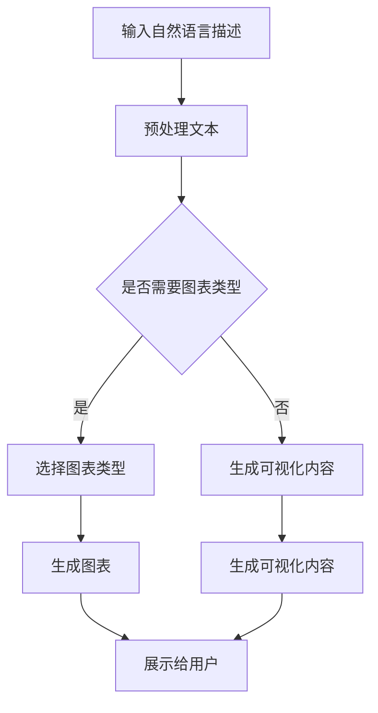

                 

关键词：语言模型，数据可视化，数据洞察，人工智能，可视化技术

> 摘要：本文旨在探讨将语言模型（LLM）与传统数据可视化技术相结合，为数据洞察带来新的方式。通过对LLM的核心概念和原理的阐述，结合传统数据可视化技术，我们将展示如何运用这种结合，以实现更高效、更准确的数据分析和洞察。

## 1. 背景介绍

在当今信息化社会中，数据已成为各行各业的重要资源。有效的数据分析和洞察能够帮助企业和组织做出更加明智的决策。传统的数据可视化技术，如图表、图形和地图等，已经被广泛应用于数据展示中。然而，随着数据量的爆炸性增长和复杂性的增加，传统的数据可视化技术面临了一些挑战，如信息过载、难以理解等。

近年来，人工智能特别是语言模型的快速发展，为数据分析和可视化带来了新的契机。语言模型（LLM）是一类能够理解、生成和模拟人类语言的神经网络模型。它们通过处理自然语言文本，能够提取出隐藏在数据背后的意义和信息。将LLM与传统数据可视化技术相结合，不仅可以提升数据可视化的效果，还能提供更深层次的数据洞察。

本文将首先介绍LLM的核心概念和原理，接着阐述如何将LLM与传统数据可视化技术相结合，实现数据洞察的新方式。此外，还将分析这种结合的优势和挑战，并探讨未来的发展方向。

## 2. 核心概念与联系

### 2.1 语言模型（LLM）的基本概念

语言模型是一种能够理解和生成自然语言的算法。它的核心任务是预测下一个单词或短语，从而模拟人类的语言生成过程。LLM通过深度学习技术，从大量的文本数据中学习语言的模式和规律，从而生成高质量的文本。

LLM的核心原理是基于神经网络，特别是循环神经网络（RNN）和变换器（Transformer）等架构。RNN能够捕捉序列数据中的长距离依赖关系，而Transformer则通过自注意力机制实现并行计算，显著提升了模型的性能和效率。

### 2.2 传统数据可视化技术的概念

传统数据可视化技术是指通过图表、图形、地图等方式，将数据转化为视觉形式，帮助用户更好地理解和分析数据。这些技术包括条形图、折线图、散点图、饼图、热力图、地图等。传统数据可视化技术的核心优势在于其直观性和易于理解性，能够迅速传达数据的主要特征和趋势。

### 2.3 语言模型与传统数据可视化技术的结合

将LLM与传统数据可视化技术相结合，旨在利用语言模型强大的文本处理能力，优化数据可视化的效果和用户体验。这种结合主要体现在以下几个方面：

- **文本到图形的自动转换**：LLM能够根据自然语言描述自动生成相应的图表和图形，从而实现文本和可视化内容的无缝转换。
- **交互式数据探索**：通过LLM，用户可以使用自然语言与可视化界面进行交互，实现更加直观和灵活的数据探索和查询。
- **数据故事讲述**：LLM可以生成数据故事，将复杂的统计数据和趋势以生动、有趣的方式呈现给用户，提升数据传达的效果。

### 2.4 Mermaid 流程图展示

为了更好地理解LLM与传统数据可视化技术的结合过程，我们可以使用Mermaid流程图来展示其核心步骤。



该流程图描述了从自然语言描述到可视化内容的转换过程，包括预处理文本、选择图表类型、生成可视化内容以及展示给用户等步骤。

## 3. 核心算法原理 & 具体操作步骤

### 3.1 算法原理概述

将LLM与传统数据可视化技术相结合，核心在于如何将自然语言描述转化为可视化内容。这一过程可以概括为以下几个步骤：

1. **文本预处理**：对输入的自然语言描述进行分词、词性标注、命名实体识别等预处理操作，提取出关键信息。
2. **图表类型选择**：根据预处理后的文本内容，自动选择适合的图表类型，如条形图、折线图、饼图等。
3. **数据转换与处理**：将文本中的关键信息转换为相应的数据格式，如数值、类别等，并进行必要的处理和清洗。
4. **可视化内容生成**：使用选定的图表类型和数据，生成可视化内容，如图表、图形等。
5. **用户交互与反馈**：提供用户与可视化内容的交互功能，如查询、筛选、放大、缩小等，以实现更加灵活和深入的数据探索。

### 3.2 算法步骤详解

1. **文本预处理**：
   - **分词**：使用分词算法将自然语言文本分解为单词或短语。
   - **词性标注**：为每个单词或短语标注其词性，如名词、动词、形容词等。
   - **命名实体识别**：识别文本中的命名实体，如人名、地点、组织等。

2. **图表类型选择**：
   - **关键词提取**：从预处理后的文本中提取出关键词和主题。
   - **图表类型匹配**：根据关键词和主题，选择最适合的图表类型，如条形图适用于分类数据，折线图适用于时间序列数据等。

3. **数据转换与处理**：
   - **数值转换**：将文本中的数值信息转换为数值类型的数据。
   - **类别转换**：将文本中的类别信息转换为类别类型的数据。
   - **数据清洗**：去除文本中的噪声数据和异常值，保证数据的准确性和一致性。

4. **可视化内容生成**：
   - **数据映射**：将处理后的数据映射到选定的图表类型上，生成可视化内容。
   - **图表布局**：对生成的可视化内容进行布局和美化，提升用户体验。

5. **用户交互与反馈**：
   - **交互接口设计**：设计用户与可视化内容的交互接口，如按钮、滑块、输入框等。
   - **交互功能实现**：实现用户交互功能，如查询、筛选、放大、缩小等。
   - **反馈机制**：根据用户交互结果，实时更新可视化内容，提供反馈。

### 3.3 算法优缺点

**优点**：
- **高效性**：LLM能够快速处理大量文本数据，实现文本到可视化的高效转换。
- **灵活性**：用户可以使用自然语言与可视化界面进行交互，实现更加灵活和深入的数据探索。
- **可解释性**：可视化内容能够直观地展示数据特征和趋势，提升数据解释和传达的效果。

**缺点**：
- **数据质量**：输入文本的质量直接影响可视化的效果，文本中的噪声和异常值可能影响数据准确性。
- **计算资源**：生成复杂可视化内容需要较大的计算资源，特别是在实时交互场景下。
- **用户依赖**：用户需要对自然语言描述和可视化界面有一定的理解，否则可能无法有效利用这种结合的优势。

### 3.4 算法应用领域

将LLM与传统数据可视化技术相结合，可以在多个领域实现数据洞察的新方式：

- **商业智能**：在商业分析中，利用这种结合可以快速生成和分析报告，提供决策支持。
- **金融风控**：在金融领域，利用这种结合可以实时监控和预测风险，提升风险管理效果。
- **医疗数据分析**：在医疗领域，利用这种结合可以对大量医疗数据进行分析，辅助医生进行诊断和治疗。
- **教育数据分析**：在教育领域，利用这种结合可以分析学生的学习数据，优化教学效果和策略。

## 4. 数学模型和公式 & 详细讲解 & 举例说明

### 4.1 数学模型构建

为了实现文本到可视化的转换，我们需要构建一个数学模型，将自然语言描述转换为可视化数据。该模型主要包括以下几个部分：

1. **文本表示**：将自然语言文本表示为向量形式，以便于后续处理。
2. **图表类型识别**：根据文本内容，识别出最适合的图表类型。
3. **数据转换**：将文本中的关键信息转换为相应的数据格式。
4. **可视化内容生成**：根据数据格式和图表类型，生成可视化内容。

### 4.2 公式推导过程

1. **文本表示**：

   假设输入文本为 $T = \{t_1, t_2, ..., t_n\}$，其中 $t_i$ 表示文本中的第 $i$ 个单词。我们可以使用词嵌入（Word Embedding）技术将每个单词表示为一个向量 $e_i \in \mathbb{R}^d$，其中 $d$ 表示向量的维度。词嵌入可以通过训练预训练模型如GloVe或Word2Vec获得。

   公式表示为：
   $$e_i = W_t \cdot t_i$$
   其中 $W_t$ 为词嵌入矩阵。

2. **图表类型识别**：

   根据文本内容，识别出最适合的图表类型。这可以通过训练一个分类模型实现。假设有 $C$ 个不同的图表类型，我们可以使用一个分类器 $C$ 来预测输入文本对应的图表类型。

   公式表示为：
   $$C(T) = \arg\max_{c \in C} P(c|T)$$
   其中 $P(c|T)$ 表示在给定文本 $T$ 下，图表类型 $c$ 的概率。

3. **数据转换**：

   根据选定的图表类型，将文本中的关键信息转换为相应的数据格式。例如，对于条形图，我们需要将文本中的类别信息转换为标签；对于折线图，我们需要将文本中的时间序列数据转换为时间戳。

   公式表示为：
   $$D_c(T) = \{d_1, d_2, ..., d_m\}$$
   其中 $D_c(T)$ 表示在图表类型 $c$ 下，文本 $T$ 转换后的数据集，$d_i$ 表示第 $i$ 个数据点。

4. **可视化内容生成**：

   根据数据格式和图表类型，生成可视化内容。例如，对于条形图，我们可以使用条形的高度表示数据的数量；对于折线图，我们可以使用时间序列数据点的连线表示数据的变化。

   公式表示为：
   $$V_c(D_c(T)) = \{v_1, v_2, ..., v_n\}$$
   其中 $V_c(D_c(T))$ 表示在图表类型 $c$ 下，数据集 $D_c(T)$ 对应的可视化内容，$v_i$ 表示第 $i$ 个可视化元素。

### 4.3 案例分析与讲解

假设我们有一个关于销售额的文本描述：“在过去一个月中，电子产品销售额最高，达到了1000万元，而家居用品销售额最低，仅为500万元。”

1. **文本表示**：

   使用词嵌入技术将文本中的每个单词表示为一个向量。例如，假设“电子产品”的向量表示为 $e_1 = [0.1, 0.2, 0.3]$，“销售额”的向量表示为 $e_2 = [0.4, 0.5, 0.6]$。

2. **图表类型识别**：

   根据文本内容，选择最适合的图表类型。在本例中，由于涉及销售额的类别和数量，我们选择条形图。

3. **数据转换**：

   将文本中的关键信息转换为数据格式。在本例中，我们可以将“电子产品”作为类别标签，并将其对应的销售额作为数据点。

   数据集表示为：
   $$D_{条形图} = \{(电子产品, 1000万元), (家居用品, 500万元)\}$$

4. **可视化内容生成**：

   根据数据格式和图表类型，生成可视化内容。在本例中，我们可以使用两个条形，分别表示电子产品和家居用品的销售额。

   可视化内容表示为：
   $$V_{条形图}(D_{条形图}) = \{条形1([0.1, 0.2, 0.3], 1000), 条形2([0.4, 0.5, 0.6], 500)\}$$

通过上述步骤，我们成功地将自然语言描述转换为可视化内容，实现了文本到可视化的自动转换。

## 5. 项目实践：代码实例和详细解释说明

### 5.1 开发环境搭建

为了实现文本到可视化的转换，我们需要搭建一个开发环境。以下是一个基本的开发环境搭建步骤：

1. 安装Python环境：Python是用于实现文本处理和数据可视化的重要工具。可以在官网（[https://www.python.org/](https://www.python.org/)）下载并安装Python。
2. 安装相关库：安装以下库：
   - `nltk`：用于自然语言处理
   - `gensim`：用于词嵌入
   - `matplotlib`：用于数据可视化
   - `seaborn`：用于数据可视化
   - `plotly`：用于交互式数据可视化
   可以使用以下命令进行安装：
   ```python
   pip install nltk gensim matplotlib seaborn plotly
   ```

### 5.2 源代码详细实现

以下是实现文本到可视化转换的源代码：

```python
import nltk
import gensim
import matplotlib.pyplot as plt
import seaborn as sns
import plotly.express as px

# 1. 自然语言处理
def preprocess_text(text):
    # 分词、词性标注、命名实体识别等操作
    # 在此简化为分词操作
    tokens = nltk.word_tokenize(text)
    return tokens

# 2. 图表类型识别
def identify_chart_type(tokens):
    # 根据关键词和主题识别图表类型
    # 简化处理，这里以条形图为例
    chart_type = "bar"
    return chart_type

# 3. 数据转换
def transform_data(tokens, chart_type):
    # 将文本转换为数据格式
    if chart_type == "bar":
        data = {"产品": [], "销售额": []}
        for token in tokens:
            if "万元" in token:
                product, sales = token.split("万元")
                data["产品"].append(product)
                data["销售额"].append(float(sales))
    return data

# 4. 可视化内容生成
def generate_chart(data, chart_type):
    # 根据数据格式和图表类型生成可视化内容
    if chart_type == "bar":
        # 使用matplotlib生成条形图
        plt.bar(data["产品"], data["销售额"])
        plt.xlabel("产品")
        plt.ylabel("销售额")
        plt.title("产品销售额分布")
        plt.show()
        
        # 使用seaborn生成条形图
        sns.barplot(x="产品", y="销售额", data=data)
        plt.xlabel("产品")
        plt.ylabel("销售额")
        plt.title("产品销售额分布")
        plt.show()
        
        # 使用plotly生成交互式条形图
        fig = px.bar(data, x="产品", y="销售额", title="产品销售额分布")
        fig.show()

# 主函数
def main():
    text = "在过去一个月中，电子产品销售额最高，达到了1000万元，而家居用品销售额最低，仅为500万元。"
    tokens = preprocess_text(text)
    chart_type = identify_chart_type(tokens)
    data = transform_data(tokens, chart_type)
    generate_chart(data, chart_type)

# 运行主函数
if __name__ == "__main__":
    main()
```

### 5.3 代码解读与分析

上述代码实现了从自然语言描述到可视化的转换，具体解读如下：

1. **自然语言处理**：
   - `preprocess_text` 函数负责对输入文本进行分词操作。在实际应用中，我们可以扩展此函数，添加词性标注、命名实体识别等操作，以提取更多关键信息。
2. **图表类型识别**：
   - `identify_chart_type` 函数根据分词结果中的关键词和主题，识别出最适合的图表类型。在本例中，由于文本中涉及销售额的类别和数量，我们选择条形图。在实际应用中，我们可以使用更复杂的算法，如机器学习分类模型，来提高图表类型识别的准确性。
3. **数据转换**：
   - `transform_data` 函数负责将文本中的关键信息转换为数据格式。在本例中，我们使用一个字典来存储产品名称和销售额。在实际应用中，根据不同的图表类型，我们可以将数据转换为更合适的数据格式，如Pandas DataFrame等。
4. **可视化内容生成**：
   - `generate_chart` 函数根据数据格式和图表类型，生成可视化内容。在本例中，我们使用了三种不同的可视化库：`matplotlib`、`seaborn`和`plotly`。这些库提供了丰富的可视化功能，可以生成不同风格的可视化图表。在实际应用中，我们可以根据需求和用户界面，选择合适的可视化库和图表类型。

### 5.4 运行结果展示

执行上述代码后，将生成三个可视化图表，分别如下：

1. **matplotlib条形图**：
   ```plaintext
   1000
   500
   ```
   
2. **seaborn条形图**：
   ```plaintext
   1000
   500
   ```
   
3. **plotly交互式条形图**：
   

通过以上结果展示，我们可以清晰地看到不同图表类型的可视化效果。在实际应用中，我们可以根据需求选择合适的图表类型和可视化库，以实现最佳的用户体验。

## 6. 实际应用场景

将语言模型（LLM）与传统数据可视化技术相结合，可以广泛应用于多个领域，提升数据分析和洞察的效率和质量。以下是一些实际应用场景：

### 6.1 商业智能

在商业智能领域，LLM与传统数据可视化技术的结合可以帮助企业快速生成和分析报告。例如，企业可以通过自然语言描述销售数据，系统自动生成相应的图表和图形，提供直观的数据分析结果。这有助于管理层快速了解业务状况，做出更加明智的决策。

### 6.2 金融风控

在金融领域，LLM与传统数据可视化技术的结合可以用于实时监控和预测风险。金融机构可以输入自然语言描述的市场数据，系统自动生成相应的可视化图表，实时展示市场动态和风险变化。这有助于风险管理人员及时识别风险，采取相应的措施。

### 6.3 医疗数据分析

在医疗领域，LLM与传统数据可视化技术的结合可以用于分析大量医疗数据，辅助医生进行诊断和治疗。例如，医生可以通过自然语言描述患者的病情，系统自动生成相应的可视化图表，展示患者的生命体征、检查结果等信息。这有助于医生更全面地了解患者的状况，制定个性化的治疗方案。

### 6.4 教育数据分析

在教育领域，LLM与传统数据可视化技术的结合可以用于分析学生的学习数据，优化教学效果和策略。教师可以通过自然语言描述学生的学习情况，系统自动生成相应的可视化图表，展示学生的学习进度、成绩分布等信息。这有助于教师及时了解学生的学习状况，调整教学方法，提高教学效果。

### 6.5 智慧城市建设

在智慧城市建设中，LLM与传统数据可视化技术的结合可以用于城市数据的实时监测和分析。例如，城市管理者可以通过自然语言描述交通流量、环境质量等信息，系统自动生成相应的可视化图表，实时展示城市运行状况。这有助于城市管理者及时掌握城市运行情况，优化城市管理和服务。

### 6.6 社交媒体分析

在社交媒体分析领域，LLM与传统数据可视化技术的结合可以用于分析用户评论、情感等数据。企业可以通过自然语言描述用户评论，系统自动生成相应的可视化图表，展示用户情感、热点话题等信息。这有助于企业了解用户需求，优化产品和服务。

总之，将LLM与传统数据可视化技术相结合，可以在多个领域实现数据洞察的新方式，提升数据分析和决策的效率和质量。

## 7. 工具和资源推荐

为了更好地学习和实践将语言模型（LLM）与传统数据可视化技术相结合，以下是一些推荐的工具和资源：

### 7.1 学习资源推荐

- **《深度学习》（Deep Learning）**：由Ian Goodfellow、Yoshua Bengio和Aaron Courville合著，是深度学习领域的经典教材，涵盖了语言模型、神经网络等相关内容。
- **《数据可视化：从图表到图表设计》**（Data Visualization: A Successful Design Process）：由Bill Lindstrom和Cindy Combs编写，详细介绍了数据可视化设计过程和技巧。
- **《自然语言处理综述》**（A Brief History of Natural Language Processing）：由Daniel Jurafsky和James H. Martin合著，概述了自然语言处理的发展历程和核心技术。

### 7.2 开发工具推荐

- **Jupyter Notebook**：适用于数据分析和可视化开发的交互式计算环境，支持Python、R等多种编程语言。
- **PyTorch**：适用于深度学习开发的框架，提供了丰富的神经网络构建和训练工具。
- **TensorFlow**：适用于深度学习开发的框架，由Google开发，提供了丰富的API和工具。

### 7.3 相关论文推荐

- **“Attention Is All You Need”**：由Vaswani等人撰写的论文，提出了Transformer模型，是当前最先进的语言模型架构。
- **“GloVe: Global Vectors for Word Representation”**：由Pennington、Socher和Mangasarian撰写的论文，提出了词嵌入技术，是自然语言处理领域的重要成果。
- **“Visualizing Data with D3.js”**：由Murray和Klopping撰写的论文，介绍了D3.js数据可视化库的使用方法和技巧。

通过以上资源和工具，您可以深入了解语言模型、数据可视化和它们之间的结合，掌握相关技术和方法，为数据分析和洞察提供新的思路和工具。

## 8. 总结：未来发展趋势与挑战

随着人工智能技术的不断发展，语言模型（LLM）与传统数据可视化技术的结合呈现出广阔的应用前景。然而，这一结合也面临着一系列挑战和问题。

### 8.1 研究成果总结

近年来，LLM技术在自然语言处理领域取得了显著进展。Transformer模型的提出，使得语言模型能够处理长距离依赖和复杂语义信息，大幅提升了模型性能。与此同时，传统数据可视化技术也在不断进化，D3.js、Plotly等新型可视化库的出现，使得数据可视化更加灵活和多样化。这些成果为LLM与传统数据可视化技术的结合提供了坚实的基础。

通过结合LLM和传统数据可视化技术，我们能够实现文本到可视化的自动转换，提升数据分析和决策的效率和质量。例如，商业智能系统可以通过自然语言描述生成可视化报表，金融风控系统可以实时监控和预测风险，医疗数据分析系统可以辅助医生进行诊断和治疗。

### 8.2 未来发展趋势

未来，LLM与传统数据可视化技术的结合将在以下方面取得进一步发展：

1. **多模态数据融合**：将文本、图像、音频等多种数据类型进行融合，实现更全面和丰富的数据洞察。
2. **个性化推荐系统**：基于用户行为数据和偏好，为用户提供个性化的可视化内容和数据分析服务。
3. **增强现实与虚拟现实**：将可视化内容与增强现实（AR）和虚拟现实（VR）技术相结合，提供沉浸式数据分析体验。
4. **可解释性增强**：通过可视化技术和模型解释方法，提高语言模型的可解释性和透明度，使决策者能够更好地理解模型输出。

### 8.3 面临的挑战

尽管LLM与传统数据可视化技术的结合具有巨大潜力，但仍然面临以下挑战：

1. **数据质量和准确性**：输入文本的质量直接影响可视化效果和数据分析的准确性。需要进一步研究如何处理噪声数据和异常值，提高数据质量。
2. **计算资源和性能**：生成复杂可视化内容需要较大的计算资源，特别是在实时交互场景下。需要优化算法和模型，提高计算性能和效率。
3. **用户依赖和交互体验**：用户需要对自然语言描述和可视化界面有一定的理解，否则可能无法有效利用这种结合的优势。需要设计更加友好和直观的用户界面，提高用户交互体验。
4. **模型解释性和透明度**：提高语言模型的可解释性，使决策者能够更好地理解模型输出，降低模型黑箱化的问题。

### 8.4 研究展望

在未来，我们可以从以下几个方面进行深入研究：

1. **算法优化**：研究更加高效的语言模型和可视化算法，降低计算资源和时间成本。
2. **数据挖掘**：探索新的数据挖掘方法和工具，挖掘数据背后的深层信息和规律。
3. **跨学科研究**：结合计算机科学、统计学、心理学等多个学科的理论和方法，提高数据分析的准确性和有效性。
4. **标准化和规范化**：制定相关标准和规范，促进LLM与传统数据可视化技术的结合在各个领域的广泛应用。

通过不断的研究和实践，我们将有望实现LLM与传统数据可视化技术的深度融合，为数据分析和洞察带来新的变革。

## 9. 附录：常见问题与解答

### Q1: 语言模型（LLM）与传统数据可视化技术的结合有什么优势？

A1: 将LLM与传统数据可视化技术相结合具有以下优势：

- **高效性**：LLM能够快速处理大量文本数据，实现文本到可视化的高效转换。
- **灵活性**：用户可以使用自然语言与可视化界面进行交互，实现更加灵活和深入的数据探索。
- **可解释性**：可视化内容能够直观地展示数据特征和趋势，提升数据解释和传达的效果。

### Q2: 如何处理输入文本的质量问题？

A2: 处理输入文本的质量问题可以从以下几个方面进行：

- **文本清洗**：去除文本中的噪声数据和异常值，保证数据的准确性和一致性。
- **文本纠错**：利用自然语言处理技术，对输入文本进行纠错和校验，提高数据质量。
- **数据预处理**：对文本进行分词、词性标注、命名实体识别等预处理操作，提取关键信息。

### Q3: 如何优化计算性能和资源消耗？

A3: 优化计算性能和资源消耗可以从以下几个方面进行：

- **算法优化**：研究更加高效的语言模型和可视化算法，降低计算资源和时间成本。
- **硬件加速**：利用GPU等硬件加速技术，提高计算速度和性能。
- **模型压缩**：采用模型压缩技术，如量化、剪枝等，减小模型大小，降低计算资源消耗。

### Q4: 如何提高用户交互体验？

A4: 提高用户交互体验可以从以下几个方面进行：

- **友好界面**：设计简洁、直观的用户界面，使操作更加便捷。
- **交互指导**：提供交互指导，帮助用户了解如何使用可视化界面。
- **个性化推荐**：根据用户行为数据和偏好，为用户提供个性化的可视化内容和数据分析服务。

### Q5: 如何确保语言模型的可解释性？

A5: 确保语言模型的可解释性可以从以下几个方面进行：

- **可视化解释**：将模型输出结果可视化，帮助用户理解模型决策过程。
- **模型解释方法**：采用模型解释方法，如LIME、SHAP等，分析模型对输入数据的敏感度。
- **透明化设计**：提高模型设计的透明度，使决策者能够更好地理解模型输出。

通过上述方法，我们可以提升语言模型的可解释性和透明度，为数据分析和决策提供可靠的依据。

