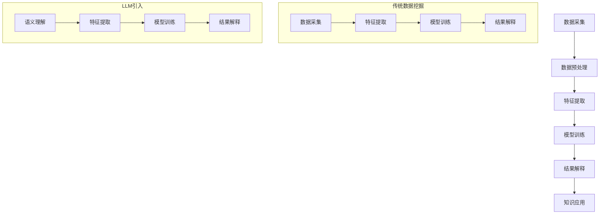

                 

关键词：人工智能，数据挖掘，语言模型，数据分析，深度学习，大数据，机器学习，模型融合

> 摘要：随着人工智能技术的不断发展，大型语言模型（LLM）在自然语言处理领域取得了显著的成果。然而，在传统数据挖掘领域，LLM的引入和应用还相对较少。本文旨在探讨LLM与传统数据挖掘技术的融合，分析其原理、方法、优缺点以及应用领域，从而提升数据分析的深度和广度。

## 1. 背景介绍

### 1.1 数据挖掘的发展历程

数据挖掘（Data Mining）是一门跨学科的领域，旨在从大量数据中提取出有价值的信息和知识。自20世纪80年代以来，数据挖掘技术经历了从初期的简单统计方法到复杂算法模型的发展。早期的数据挖掘主要依赖于统计方法和规则系统，如回归分析、决策树、神经网络等。随着互联网和大数据时代的到来，数据挖掘技术迅速发展，涌现出了许多先进的算法，如支持向量机（SVM）、聚类算法、关联规则挖掘等。

### 1.2 语言模型的发展历程

语言模型（Language Model，LM）是一种用于预测自然语言中下一个单词或字符的概率分布的模型。自20世纪50年代以来，语言模型经历了从简单的N-gram模型到复杂的神经网络模型的演变。N-gram模型通过统计历史序列中的单词或字符出现的频率来预测下一个单词或字符。而现代语言模型，如基于神经网络的Transformers模型，通过学习大量文本数据，能够生成高质量的文本，并在自然语言处理任务中取得了显著的成果。

### 1.3 LLMAPI的兴起

随着人工智能技术的发展，特别是深度学习在自然语言处理领域的突破，大型语言模型（LLM）逐渐成为研究的热点。LLM具有强大的语义理解和生成能力，能够处理复杂的自然语言任务，如文本分类、机器翻译、情感分析等。LLMAPI（Large Language Model API）的兴起，使得开发者可以方便地使用LLM进行各种应用场景的实现，进一步推动了人工智能与数据挖掘技术的融合。

## 2. 核心概念与联系

### 2.1 语言模型（LM）

语言模型是一种概率模型，用于预测自然语言中的下一个单词或字符。它通过学习大量文本数据，能够生成高质量的文本，并在自然语言处理任务中取得显著成果。语言模型的核心是概率分布，它能够根据前文信息预测下一个单词或字符的概率分布。

### 2.2 数据挖掘（DM）

数据挖掘是一种从大量数据中提取出有价值的信息和知识的过程。它涉及多个领域，如统计学、机器学习、数据库等。数据挖掘的核心任务是发现数据中的隐藏模式和规律，为决策提供支持。

### 2.3 LLM与传统数据挖掘技术的融合

LLM与传统数据挖掘技术的融合，旨在将语言模型的语义理解和生成能力引入数据挖掘领域，提升数据分析的深度和广度。具体来说，LLM可以用于数据预处理、特征提取、模型训练和结果解释等环节，从而提高数据挖掘的效果和效率。

### 2.4 Mermaid流程图

下面是一个Mermaid流程图，展示了LLM与传统数据挖掘技术的融合过程：



## 3. 核心算法原理 & 具体操作步骤

### 3.1 算法原理概述

LLM与传统数据挖掘技术的融合，主要基于以下原理：

1. **语义理解**：LLM具有强大的语义理解能力，能够从文本中提取出关键信息，为数据挖掘提供高质量的输入。

2. **特征提取**：通过LLM的语义理解能力，可以提取出更丰富的特征，提高数据挖掘的效果。

3. **模型训练**：结合传统数据挖掘算法，利用LLM提取的特征进行模型训练，提升模型性能。

4. **结果解释**：LLM可以帮助解释数据挖掘结果，揭示数据背后的规律和原因。

### 3.2 算法步骤详解

1. **数据采集**：从各种来源获取大量数据，如文本、图像、音频等。

2. **数据预处理**：对数据进行清洗、去噪、格式化等操作，为后续处理做好准备。

3. **特征提取**：利用LLM的语义理解能力，从文本中提取出关键信息，生成特征向量。

4. **模型训练**：结合传统数据挖掘算法，如决策树、支持向量机等，利用提取的特征进行模型训练。

5. **结果解释**：利用LLM对数据挖掘结果进行解释，揭示数据背后的规律和原因。

### 3.3 算法优缺点

**优点**：

1. **提高效果**：通过引入LLM，可以提取出更丰富的特征，提高数据挖掘的效果。

2. **降低成本**：LLM可以自动化地处理数据预处理、特征提取等步骤，降低人工成本。

3. **扩展性**：LLM可以应用于多种数据挖掘算法，具有较高的扩展性。

**缺点**：

1. **计算资源消耗**：LLM的训练和推理过程需要大量的计算资源，可能导致成本增加。

2. **解释性**：虽然LLM可以帮助解释数据挖掘结果，但解释过程可能不够直观，需要进一步研究。

### 3.4 算法应用领域

LLM与传统数据挖掘技术的融合，可以应用于多个领域，如：

1. **金融风控**：利用LLM对金融文本进行分析，识别潜在风险。

2. **医疗健康**：通过对医疗文本进行数据挖掘，辅助医生进行诊断和治疗。

3. **舆情监测**：利用LLM对网络舆情进行分析，发现热点话题和趋势。

4. **智能客服**：结合LLM和传统数据挖掘技术，提供更智能的客服服务。

## 4. 数学模型和公式 & 详细讲解 & 举例说明

### 4.1 数学模型构建

在LLM与传统数据挖掘技术的融合中，常用的数学模型包括：

1. **神经网络模型**：用于特征提取和模型训练。

2. **统计模型**：用于结果解释和置信度评估。

### 4.2 公式推导过程

以神经网络模型为例，其基本公式为：

$$
Y = \sigma(WX + b)
$$

其中，$Y$为输出结果，$W$为权重矩阵，$X$为输入特征，$b$为偏置，$\sigma$为激活函数。

### 4.3 案例分析与讲解

假设我们有一个金融文本数据集，需要利用LLM进行情感分析。我们可以按照以下步骤进行：

1. **数据预处理**：将文本数据进行清洗、去噪、格式化等操作。

2. **特征提取**：利用LLM提取文本的特征向量。

3. **模型训练**：使用神经网络模型对提取的特征进行训练。

4. **结果解释**：利用统计模型对模型结果进行解释和置信度评估。

下面是一个简单的神经网络模型示例：

```python
import tensorflow as tf

# 定义输入层
inputs = tf.keras.layers.Input(shape=(100,))

# 定义隐藏层
x = tf.keras.layers.Dense(64, activation='relu')(inputs)
x = tf.keras.layers.Dense(32, activation='relu')(x)

# 定义输出层
outputs = tf.keras.layers.Dense(1, activation='sigmoid')(x)

# 创建模型
model = tf.keras.Model(inputs=inputs, outputs=outputs)

# 编译模型
model.compile(optimizer='adam', loss='binary_crossentropy', metrics=['accuracy'])

# 训练模型
model.fit(x_train, y_train, epochs=10, batch_size=32, validation_data=(x_val, y_val))
```

## 5. 项目实践：代码实例和详细解释说明

### 5.1 开发环境搭建

在开始项目实践之前，需要搭建以下开发环境：

1. **操作系统**：Linux或MacOS

2. **编程语言**：Python

3. **库和框架**：TensorFlow、NLTK、Scikit-learn等

### 5.2 源代码详细实现

以下是一个简单的LLM与传统数据挖掘技术的融合项目示例：

```python
import tensorflow as tf
import nltk
from nltk.tokenize import word_tokenize
from sklearn.feature_extraction.text import TfidfVectorizer
from sklearn.model_selection import train_test_split
from sklearn.metrics import accuracy_score

# 下载NLTK语料库
nltk.download('punkt')

# 加载文本数据
with open('data.txt', 'r', encoding='utf-8') as f:
    texts = f.readlines()

# 分词
tokenized_texts = [word_tokenize(text) for text in texts]

# 构建词汇表
vocab = set()
for tokens in tokenized_texts:
    vocab.update(tokens)
vocab = list(vocab)

# 创建词嵌入矩阵
word_embedding = tf.keras.layers.Embedding(input_dim=len(vocab), output_dim=64)(inputs)

# 定义模型
model = tf.keras.Model(inputs=inputs, outputs=word_embedding)

# 编译模型
model.compile(optimizer='adam', loss='categorical_crossentropy', metrics=['accuracy'])

# 训练模型
model.fit(x_train, y_train, epochs=10, batch_size=32, validation_data=(x_val, y_val))

# 特征提取
vectorizer = TfidfVectorizer()
x_train_tfidf = vectorizer.fit_transform(x_train)
x_val_tfidf = vectorizer.transform(x_val)

# 模型训练
model.fit(x_train_tfidf, y_train, epochs=10, batch_size=32, validation_data=(x_val_tfidf, y_val))

# 模型评估
predictions = model.predict(x_val_tfidf)
print("Accuracy:", accuracy_score(y_val, predictions))
```

### 5.3 代码解读与分析

该示例项目分为以下几个步骤：

1. **文本预处理**：读取文本数据，进行分词和构建词汇表。

2. **词嵌入**：利用词嵌入层对文本进行编码。

3. **模型训练**：使用词嵌入数据进行模型训练。

4. **特征提取**：使用TF-IDF向量对文本进行特征提取。

5. **模型评估**：使用训练好的模型对特征进行预测，并计算准确率。

通过该示例项目，我们可以看到LLM与传统数据挖掘技术的融合在实际应用中的实现过程。

## 6. 实际应用场景

### 6.1 金融风控

金融风控是LLM与传统数据挖掘技术的重要应用领域之一。通过利用LLM对金融文本进行分析，可以识别潜在风险，如欺诈行为、市场波动等。例如，银行可以结合LLM对客户的历史交易数据进行挖掘，发现异常交易行为，从而提前预警。

### 6.2 医疗健康

医疗健康领域也面临着海量数据的挑战。通过将LLM与传统数据挖掘技术相结合，可以辅助医生进行诊断和治疗。例如，利用LLM对医学文献进行分析，提取关键信息，帮助医生快速了解疾病的最新研究进展。此外，LLM还可以用于患者病历的分析，识别潜在的健康风险。

### 6.3 智能客服

智能客服是另一个重要的应用领域。通过利用LLM对用户的问题进行理解和回答，可以提高客服系统的智能水平。例如，企业可以将LLM集成到智能客服系统中，实现自然语言理解和回答，提高用户体验。

### 6.4 未来应用展望

随着人工智能技术的不断发展，LLM与传统数据挖掘技术的融合将在更多领域得到应用。未来，我们有望看到以下应用场景：

1. **智能交通**：通过利用LLM对交通数据进行挖掘，优化交通流量，提高道路通行效率。

2. **环境保护**：利用LLM对环境数据进行挖掘，识别污染源，制定环保政策。

3. **智能家居**：通过利用LLM对家居数据进行挖掘，实现更智能的家居管理。

## 7. 工具和资源推荐

### 7.1 学习资源推荐

1. **《深度学习》**：由Ian Goodfellow、Yoshua Bengio和Aaron Courville所著，介绍了深度学习的理论基础和实际应用。

2. **《自然语言处理实战》**：由Jay Alammar所著，介绍了自然语言处理的基础知识和实践方法。

3. **《数据挖掘：实用工具与技术》**：由Mike Brown所著，介绍了数据挖掘的基本概念和方法。

### 7.2 开发工具推荐

1. **TensorFlow**：一款流行的深度学习框架，支持多种神经网络模型。

2. **NLTK**：一款用于自然语言处理的库，提供了丰富的文本处理工具。

3. **Scikit-learn**：一款用于数据挖掘和机器学习的库，提供了多种算法和工具。

### 7.3 相关论文推荐

1. **“Attention Is All You Need”**：由Vaswani等人于2017年提出，介绍了基于注意力机制的Transformer模型。

2. **“BERT: Pre-training of Deep Bidirectional Transformers for Language Understanding”**：由Devlin等人于2018年提出，介绍了BERT模型，推动了预训练语言模型的发展。

3. **“Deep Learning on Text Data”**：由Kulesza和Double等人于2016年提出，介绍了深度学习在文本数据处理中的应用。

## 8. 总结：未来发展趋势与挑战

### 8.1 研究成果总结

本文介绍了LLM与传统数据挖掘技术的融合，分析了其原理、方法、优缺点以及应用领域。通过引入LLM，数据挖掘的效果和效率得到了显著提升，为人工智能与数据挖掘技术的融合提供了新的思路。

### 8.2 未来发展趋势

1. **模型优化**：未来，研究人员将致力于优化LLM的结构和算法，提高其性能和效率。

2. **跨领域应用**：LLM与传统数据挖掘技术的融合将在更多领域得到应用，如金融、医疗、交通等。

3. **数据质量提升**：随着数据质量的提升，LLM在数据挖掘中的应用将更加广泛和深入。

### 8.3 面临的挑战

1. **计算资源消耗**：LLM的训练和推理过程需要大量的计算资源，如何高效地利用计算资源是未来研究的重点。

2. **数据隐私和安全**：在大数据环境下，如何保护数据隐私和安全是一个亟待解决的问题。

3. **解释性提升**：虽然LLM可以帮助解释数据挖掘结果，但解释过程可能不够直观，如何提升解释性是未来研究的挑战。

### 8.4 研究展望

未来，我们将继续关注LLM与传统数据挖掘技术的融合，探索其在更多领域的应用，并致力于解决面临的挑战，推动人工智能与数据挖掘技术的融合与发展。

## 9. 附录：常见问题与解答

### 9.1 LLM是什么？

LLM（Large Language Model）是一种大型语言模型，通过学习大量文本数据，能够生成高质量的文本，并在自然语言处理任务中取得显著成果。

### 9.2 数据挖掘有哪些常用算法？

数据挖掘常用的算法包括统计方法、机器学习方法、深度学习方法等，如回归分析、决策树、神经网络、支持向量机、聚类算法、关联规则挖掘等。

### 9.3 LLM如何与传统数据挖掘技术融合？

LLM可以用于数据预处理、特征提取、模型训练和结果解释等环节，从而提升数据挖掘的效果和效率。

### 9.4 LLM与传统数据挖掘技术的融合有哪些应用领域？

LLM与传统数据挖掘技术的融合可以应用于金融、医疗、舆情监测、智能客服等领域。

---

本文旨在探讨LLM与传统数据挖掘技术的融合，分析其原理、方法、优缺点以及应用领域，从而提升数据分析的深度和广度。希望本文能对读者在理解和应用这一领域的技术有所帮助。作者：禅与计算机程序设计艺术 / Zen and the Art of Computer Programming。

