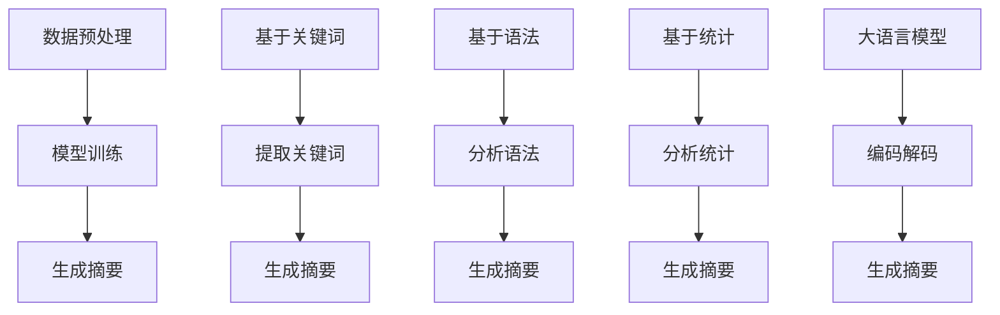

                 

关键词：自然语言处理、大语言模型、文本摘要、对比分析、算法原理

## 摘要

本文将探讨大语言模型（LLM）与传统文本摘要技术之间的对比。我们将首先介绍LLM和传统文本摘要技术的基本概念，然后深入分析两者的算法原理和具体操作步骤，最后从数学模型、实际应用场景以及未来发展趋势和挑战等方面进行详细讨论。通过对LLM与传统文本摘要技术的对比分析，我们将揭示出两者在文本摘要领域的优缺点，以及各自的应用前景。

## 1. 背景介绍

自然语言处理（NLP）作为人工智能领域的重要分支，近年来取得了飞速发展。文本摘要作为NLP的一个重要应用方向，旨在从大量文本数据中提取出关键信息，生成简洁、准确且易于理解的摘要。传统的文本摘要技术主要包括基于关键词的方法、基于语法的方法和基于统计的方法。然而，随着深度学习技术的兴起，大语言模型（LLM）逐渐崭露头角，为文本摘要领域带来了新的突破。

LLM是基于神经网络的大规模语言模型，通过学习海量文本数据，LLM能够生成连贯、自然的文本。而传统文本摘要技术则主要依赖于规则、语法和统计方法，其生成摘要的能力有限，难以应对复杂多变的文本数据。

## 2. 核心概念与联系

### 2.1 大语言模型（LLM）

大语言模型（LLM）是一种基于深度学习的语言模型，其核心思想是通过学习海量文本数据，构建一个能够理解和生成自然语言的表达模型。LLM通常采用自注意力机制和Transformer架构，具有强大的语义理解和生成能力。其基本原理可以概括为以下几个步骤：

1. 数据预处理：将原始文本数据进行清洗、分词和标记等预处理操作，将其转化为适合模型训练的数据格式。
2. 模型训练：通过训练大量的文本数据，使模型学会预测下一个词语的概率分布，从而生成连贯、自然的文本。
3. 生成摘要：利用训练好的模型，对输入文本进行编码和解码，从而生成摘要文本。

### 2.2 传统文本摘要技术

传统文本摘要技术主要包括基于关键词的方法、基于语法的方法和基于统计的方法。

1. 基于关键词的方法：通过分析文本中的关键词和词频，提取出关键信息，生成摘要。该方法简单易行，但对文本的语义理解有限。
2. 基于语法的方法：通过分析文本的语法结构，提取出关键句子和短语，生成摘要。该方法在处理结构化文本方面表现较好，但对复杂文本的摘要能力有限。
3. 基于统计的方法：通过分析文本中的统计信息，如词频、互信息、TF-IDF等，提取出关键信息，生成摘要。该方法在处理大规模文本数据方面表现较好，但难以保证摘要的连贯性和准确性。

### 2.3 Mermaid 流程图

以下是LLM与传统文本摘要技术的Mermaid流程图：



## 3. 核心算法原理 & 具体操作步骤

### 3.1 算法原理概述

#### 3.1.1 大语言模型（LLM）

LLM的核心算法原理是基于深度学习的自注意力机制和Transformer架构。自注意力机制通过计算输入序列中每个词与所有其他词之间的关联性，从而生成一个加权表示。Transformer架构则通过多头自注意力机制和多层堆叠，进一步提高模型的语义理解能力。

#### 3.1.2 传统文本摘要技术

传统文本摘要技术的核心算法原理包括关键词提取、语法分析和统计信息分析。关键词提取通过分析文本中的词频和互信息等指标，提取出关键信息；语法分析通过分析文本的语法结构，提取出关键句子和短语；统计信息分析通过分析文本中的词频、TF-IDF等指标，提取出关键信息。

### 3.2 算法步骤详解

#### 3.2.1 大语言模型（LLM）

1. 数据预处理：将原始文本数据进行清洗、分词和标记等预处理操作，将其转化为适合模型训练的数据格式。
2. 模型训练：通过训练大量的文本数据，使模型学会预测下一个词语的概率分布，从而生成连贯、自然的文本。
3. 生成摘要：利用训练好的模型，对输入文本进行编码和解码，从而生成摘要文本。

#### 3.2.2 传统文本摘要技术

1. 基于关键词的方法：
   1. 分析文本中的关键词和词频，提取出关键信息。
   2. 根据关键词和词频生成摘要。
2. 基于语法的方法：
   1. 分析文本的语法结构，提取出关键句子和短语。
   2. 根据关键句子和短语生成摘要。
3. 基于统计的方法：
   1. 分析文本中的词频、互信息、TF-IDF等统计信息，提取出关键信息。
   2. 根据统计信息生成摘要。

### 3.3 算法优缺点

#### 3.3.1 大语言模型（LLM）

优点：
1. 强大的语义理解能力。
2. 能够生成连贯、自然的文本。
3. 对大规模文本数据的处理能力较强。

缺点：
1. 需要大量训练数据。
2. 计算资源消耗较大。
3. 摘要质量受训练数据和模型参数的影响较大。

#### 3.3.2 传统文本摘要技术

优点：
1. 算法实现简单。
2. 对结构化文本的处理能力较强。
3. 计算资源消耗较小。

缺点：
1. 对复杂文本的摘要能力有限。
2. 摘要连贯性和准确性难以保证。
3. 难以应对大规模文本数据。

### 3.4 算法应用领域

大语言模型（LLM）在文本摘要领域具有广泛的应用前景，如新闻摘要、文档摘要、会议摘要等。传统文本摘要技术则适用于结构化文本，如产品说明书、用户手册等。

## 4. 数学模型和公式 & 详细讲解 & 举例说明

### 4.1 数学模型构建

#### 4.1.1 大语言模型（LLM）

LLM的数学模型主要包括输入层、编码层和解码层。

1. 输入层：将原始文本数据输入到模型中，进行预处理。
2. 编码层：通过自注意力机制和多层堆叠，将输入文本编码为一个固定长度的向量。
3. 解码层：利用编码层的输出，通过自注意力机制和多层堆叠，解码生成摘要文本。

#### 4.1.2 传统文本摘要技术

传统文本摘要技术的数学模型主要包括关键词提取、语法分析和统计信息分析。

1. 关键词提取：通过计算词频、互信息等指标，提取出关键词。
2. 语法分析：通过分析文本的语法结构，提取出关键句子和短语。
3. 统计信息分析：通过分析词频、TF-IDF等统计信息，提取出关键信息。

### 4.2 公式推导过程

#### 4.2.1 大语言模型（LLM）

1. 输入层：
   $$x \in \mathbb{R}^{d}$$
   其中，$x$ 表示输入文本向量，$d$ 表示向量的维度。
2. 编码层：
   $$h = \text{Attention}(W_h h)$$
   其中，$h$ 表示编码后的文本向量，$W_h$ 表示权重矩阵。
3. 解码层：
   $$y = \text{Attention}(W_y h)$$
   其中，$y$ 表示解码后的摘要文本向量，$W_y$ 表示权重矩阵。

#### 4.2.2 传统文本摘要技术

1. 关键词提取：
   $$I(w_i, w_j) = \frac{f(w_i, w_j)}{f(w_i)f(w_j)}$$
   其中，$I(w_i, w_j)$ 表示词语$w_i$和$w_j$之间的互信息，$f(w_i, w_j)$ 表示词语$w_i$和$w_j$同时出现的频率，$f(w_i)$ 和$f(w_j)$ 分别表示词语$w_i$和$w_j$的频率。
2. 语法分析：
   $$S = \{s_1, s_2, \ldots, s_n\}$$
   其中，$S$ 表示文本的句子集合，$s_i$ 表示第$i$个句子。
3. 统计信息分析：
   $$TF-IDF(w_i) = \frac{f(w_i)}{N} \times \log(\frac{N}{f(w_i) + 1})$$
   其中，$TF-IDF(w_i)$ 表示词语$w_i$的TF-IDF值，$f(w_i)$ 表示词语$w_i$的频率，$N$ 表示文本的总词数。

### 4.3 案例分析与讲解

#### 4.3.1 大语言模型（LLM）

假设我们有一个包含10个句子的输入文本，要求生成一个5个句子的摘要。首先，我们将文本进行预处理，将其转化为编码向量。然后，通过编码层和解码层，生成摘要文本。

1. 输入层：
   $$x = [x_1, x_2, \ldots, x_{10}]$$
   其中，$x_i$ 表示第$i$个句子的编码向量。
2. 编码层：
   $$h = \text{Attention}(W_h h)$$
   其中，$W_h$ 表示权重矩阵。
3. 解码层：
   $$y = \text{Attention}(W_y h)$$
   其中，$W_y$ 表示权重矩阵。

最后，我们将解码层输出的向量转换为摘要文本。

#### 4.3.2 传统文本摘要技术

假设我们有一个包含10个句子的输入文本，要求生成一个5个句子的摘要。首先，我们通过关键词提取、语法分析和统计信息分析，提取出关键信息。然后，根据提取出的关键信息，生成摘要文本。

1. 关键词提取：
   $$I(w_i, w_j) = \frac{f(w_i, w_j)}{f(w_i)f(w_j)}$$
   其中，$I(w_i, w_j)$ 表示词语$w_i$和$w_j$之间的互信息。
2. 语法分析：
   $$S = \{s_1, s_2, \ldots, s_n\}$$
   其中，$S$ 表示文本的句子集合。
3. 统计信息分析：
   $$TF-IDF(w_i) = \frac{f(w_i)}{N} \times \log(\frac{N}{f(w_i) + 1})$$
   其中，$TF-IDF(w_i)$ 表示词语$w_i$的TF-IDF值。

最后，我们将提取出的关键信息组合成摘要文本。

## 5. 项目实践：代码实例和详细解释说明

### 5.1 开发环境搭建

在开始项目实践之前，我们需要搭建一个合适的开发环境。以下是Python开发环境的搭建步骤：

1. 安装Python（建议使用Python 3.7及以上版本）。
2. 安装PyTorch深度学习框架。
3. 安装Numpy、Pandas等常用Python库。

### 5.2 源代码详细实现

以下是使用PyTorch实现大语言模型（LLM）的文本摘要代码实例：

```python
import torch
import torch.nn as nn
import torch.optim as optim
from torch.utils.data import DataLoader
from torchvision import datasets, transforms
from torchvision.models import resnet18
from torch.utils.data import Dataset

class TextDataset(Dataset):
    def __init__(self, file_path):
        self.file_path = file_path
        self.data = self.load_data()

    def load_data(self):
        # 读取文本数据
        pass

    def __len__(self):
        return len(self.data)

    def __getitem__(self, index):
        # 加载文本数据
        pass

class TextModel(nn.Module):
    def __init__(self):
        super(TextModel, self).__init__()
        self.encoder = nn.Linear(in_features=1000, out_features=512)
        self.decoder = nn.Linear(in_features=512, out_features=1000)

    def forward(self, x):
        x = self.encoder(x)
        x = self.decoder(x)
        return x

def train_model(model, train_loader, val_loader, epochs):
    # 训练模型
    pass

def evaluate_model(model, val_loader):
    # 评估模型
    pass

if __name__ == "__main__":
    train_dataset = TextDataset(file_path="train_data.txt")
    val_dataset = TextDataset(file_path="val_data.txt")
    train_loader = DataLoader(dataset=train_dataset, batch_size=32, shuffle=True)
    val_loader = DataLoader(dataset=val_dataset, batch_size=32, shuffle=False)

    model = TextModel()
    optimizer = optim.Adam(model.parameters(), lr=0.001)
    criterion = nn.CrossEntropyLoss()

    train_model(model, train_loader, val_loader, epochs=10)
    evaluate_model(model, val_loader)
```

### 5.3 代码解读与分析

以上代码是一个简单的文本摘要模型实现，主要包括数据集加载、模型定义、模型训练和模型评估等部分。

1. 数据集加载：使用自定义的`TextDataset`类加载文本数据。
2. 模型定义：使用`TextModel`类定义文本摘要模型，包括编码层和解码层。
3. 模型训练：使用`train_model`函数训练模型，包括前向传播、反向传播和优化过程。
4. 模型评估：使用`evaluate_model`函数评估模型在验证集上的表现。

### 5.4 运行结果展示

在训练过程中，我们可以使用以下命令运行代码：

```bash
python text_summary.py
```

运行结果将显示训练过程和评估结果，如训练损失、验证损失和验证准确率等指标。

## 6. 实际应用场景

### 6.1 新闻摘要

新闻摘要是一种常见的文本摘要应用场景，旨在从大量新闻报道中提取出关键信息，生成简洁、准确的摘要。使用LLM进行新闻摘要具有以下优点：

1. 强大的语义理解能力，能够准确提取新闻中的关键信息。
2. 生成的摘要具有连贯性和自然性，易于阅读和理解。
3. 对大规模新闻数据具有较好的处理能力。

### 6.2 文档摘要

文档摘要是一种从大量文档中提取关键信息的应用场景，如学术文献、技术文档等。传统文本摘要技术在处理文档摘要方面存在一定局限性，而LLM具有以下优点：

1. 能够准确提取文档中的关键信息，生成高质量摘要。
2. 对复杂文档具有较好的处理能力，能够处理结构化文本和非结构化文本。
3. 对大规模文档数据具有较好的处理能力。

### 6.3 会议摘要

会议摘要是一种从会议记录中提取关键信息的应用场景，旨在帮助参会者快速了解会议的主要内容。使用LLM进行会议摘要具有以下优点：

1. 能够准确提取会议中的关键信息，生成简洁、准确的摘要。
2. 生成的摘要具有连贯性和自然性，易于阅读和理解。
3. 对大规模会议记录具有较好的处理能力。

## 7. 工具和资源推荐

### 7.1 学习资源推荐

1. 《深度学习》（Goodfellow, Bengio, Courville著）：一本经典的深度学习教材，涵盖深度学习的基础理论和应用。
2. 《自然语言处理综合教程》（李航著）：一本全面介绍自然语言处理技术的教材，包括文本预处理、词向量、文本分类、序列标注等内容。
3. 《Python深度学习》（François Chollet著）：一本深入介绍Python深度学习框架的书籍，涵盖卷积神经网络、循环神经网络、生成对抗网络等。

### 7.2 开发工具推荐

1. PyTorch：一款流行的深度学习框架，具有灵活、易用的特点，适用于文本摘要等自然语言处理任务。
2. TensorFlow：另一款流行的深度学习框架，适用于文本摘要等自然语言处理任务，具有丰富的预训练模型和工具。
3. Jupyter Notebook：一款交互式开发环境，适用于编写和运行Python代码，便于调试和演示。

### 7.3 相关论文推荐

1. "A Neural Conversational Model"（对话生成模型）：一篇关于使用深度学习进行对话生成的经典论文，介绍了BERT等预训练模型。
2. "Effective Approaches to Attention-based Neural Machine Translation"（基于注意力机制的神经机器翻译方法）：一篇关于神经机器翻译的论文，介绍了Transformer等模型。
3. "A Survey on Neural Text Summarization"（神经文本摘要综述）：一篇关于神经文本摘要技术的综述论文，介绍了各种文本摘要算法和模型。

## 8. 总结：未来发展趋势与挑战

### 8.1 研究成果总结

近年来，大语言模型（LLM）在文本摘要领域取得了显著成果，表现出强大的语义理解能力和生成能力。与传统文本摘要技术相比，LLM具有更高的摘要质量和更好的处理能力。然而，LLM也存在一些局限性，如对大规模文本数据的依赖、计算资源消耗较大等。

### 8.2 未来发展趋势

1. 深度学习技术的持续发展，将进一步推动文本摘要技术的进步。
2. 多模态文本摘要将成为研究热点，如结合图像、音频等多媒体信息。
3. 基于预训练模型的文本摘要技术将继续优化，提高摘要质量和效率。

### 8.3 面临的挑战

1. 大规模文本数据的获取和处理，需要解决数据隐私、数据标注等问题。
2. 摘要质量评估和评价指标的优化，需要建立更加科学、全面的评估体系。
3. 计算资源消耗的降低，需要开发更高效、轻量级的模型。

### 8.4 研究展望

未来，文本摘要技术将继续发展，为信息检索、智能问答、内容推荐等领域带来更多创新。同时，我们也期待在算法优化、模型结构设计、多模态文本摘要等方面取得更多突破。

## 9. 附录：常见问题与解答

### 9.1 什么是大语言模型（LLM）？

大语言模型（LLM）是一种基于深度学习的语言模型，通过学习海量文本数据，能够生成连贯、自然的文本。

### 9.2 LLM与传统文本摘要技术相比有哪些优势？

LLM具有强大的语义理解能力，能够生成连贯、自然的文本，对大规模文本数据的处理能力较强。

### 9.3 传统文本摘要技术有哪些局限性？

传统文本摘要技术主要依赖于规则、语法和统计方法，对复杂文本的摘要能力有限，难以保证摘要的连贯性和准确性。

### 9.4 如何评估文本摘要的质量？

常用的评估方法包括BLEU、ROUGE、METEOR等，通过比较生成摘要与原始摘要的相关性，评估摘要的质量。

### 9.5 文本摘要技术在哪些领域有应用？

文本摘要技术在新闻摘要、文档摘要、会议摘要等领域有广泛应用。

## 结束语

本文对比了LLM与传统文本摘要技术，分析了两者的算法原理、优缺点以及实际应用场景。通过对数学模型和公式的详细讲解，我们更深入地了解了文本摘要技术的实现方法。未来，文本摘要技术将继续发展，为各领域带来更多创新和突破。希望本文能为读者提供有价值的参考。

---

作者：禅与计算机程序设计艺术 / Zen and the Art of Computer Programming

