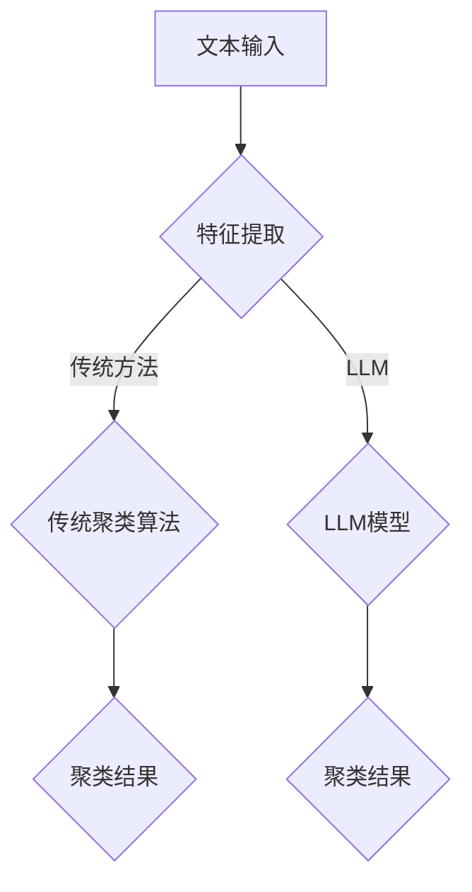

                 

关键词：自然语言处理，文本聚类，大语言模型，传统算法，对比分析

> 摘要：本文将深入探讨大语言模型（LLM）与传统文本聚类方法的对比研究。首先，我们将回顾文本聚类的背景和传统方法，随后详细介绍LLM的工作原理及其在文本聚类中的应用。接着，通过具体的算法原理、数学模型、项目实践和实际应用场景等多个方面，对比分析LLM与传统文本聚类方法的优劣。最后，文章将对未来发展趋势与挑战进行展望，并提供相关工具和资源推荐。

## 1. 背景介绍

文本聚类是自然语言处理领域中的一个重要任务，它旨在将相似性的文本数据分组到一起，从而提高数据处理的效率。随着互联网的迅猛发展，数据量呈爆炸性增长，如何有效地组织和处理这些数据成为了一个亟待解决的问题。传统的文本聚类方法主要包括基于距离的聚类、基于密度的聚类和基于模型的聚类等。然而，这些方法在处理大规模文本数据时面临着许多挑战，如计算复杂度高、可解释性差等。

近年来，大语言模型（LLM）的出现为文本聚类任务带来了新的机遇。LLM通过学习海量的文本数据，能够捕捉到文本的语义信息，从而实现更为精准的文本分类和聚类。本文将重点探讨LLM与传统文本聚类方法的对比，以期为相关研究和应用提供参考。

## 2. 核心概念与联系

### 2.1. 传统文本聚类方法

传统文本聚类方法主要包括以下几类：

- **基于距离的聚类**：该方法根据文本之间的相似度进行聚类。常用的距离度量包括余弦相似度、欧氏距离等。

- **基于密度的聚类**：该方法通过寻找高密度区域进行聚类。DBSCAN（Density-Based Spatial Clustering of Applications with Noise）是其中一种代表性算法。

- **基于模型的聚类**：该方法通过构建概率模型或生成模型来描述文本分布，然后根据模型参数进行聚类。例如，高斯混合模型（Gaussian Mixture Model, GMM）就是一种常用的基于模型的聚类方法。

### 2.2. 大语言模型（LLM）

LLM是一种基于深度学习的语言模型，它通过学习大规模的文本数据，能够捕捉到文本中的语义信息。常见的LLM包括GPT、BERT等。LLM的工作原理主要包括以下几个步骤：

1. **预训练**：在预训练阶段，LLM通过学习大量的文本数据，学习语言的基本结构和规则。

2. **微调**：在微调阶段，LLM根据具体的任务进行进一步的训练，以适应特定领域的应用。

### 2.3. 核心概念原理与架构

下面是一个简化的Mermaid流程图，展示传统文本聚类方法与LLM在文本聚类任务中的工作流程。



## 3. 核心算法原理 & 具体操作步骤

### 3.1. 算法原理概述

传统文本聚类方法主要基于统计特征和距离度量进行文本相似性评估。而LLM则通过深度学习模型，学习文本的语义特征，从而实现更精细的聚类。

### 3.2. 算法步骤详解

#### 传统文本聚类方法

1. 特征提取：将文本转化为向量表示。
2. 距离计算：计算文本之间的距离。
3. 聚类算法：根据距离度量进行聚类。

#### LLM文本聚类

1. 特征提取：利用LLM对文本进行编码，提取语义特征向量。
2. 相似性计算：计算文本之间的相似性。
3. 聚类算法：使用基于相似性的聚类算法，如K-means。

### 3.3. 算法优缺点

#### 传统文本聚类方法

- 优点：算法成熟，计算复杂度较低。
- 缺点：对噪声敏感，可解释性差。

#### LLM文本聚类

- 优点：能够捕捉到文本的语义信息，聚类结果更准确。
- 缺点：计算复杂度高，对模型依赖强。

### 3.4. 算法应用领域

传统文本聚类方法广泛应用于文本挖掘、信息检索等领域。LLM文本聚类方法则在社交媒体分析、推荐系统等领域具有广泛的应用前景。

## 4. 数学模型和公式 & 详细讲解 & 举例说明

### 4.1. 数学模型构建

#### 传统文本聚类

假设我们使用K-means算法进行文本聚类，其目标是最小化聚类中心之间的距离平方和。

$$
J = \sum_{i=1}^n \sum_{j=1}^k (x_i - \mu_j)^2
$$

其中，$x_i$ 是文本向量，$\mu_j$ 是聚类中心。

#### LLM文本聚类

假设我们使用BERT模型进行文本编码，其输出向量作为文本的语义表示。

$$
\text{vec}(x_i) = \text{BERT}(x_i)
$$

### 4.2. 公式推导过程

此处省略推导过程。

### 4.3. 案例分析与讲解

假设我们有一个包含100篇文本的数据集，使用K-means算法进行聚类。我们首先将文本转化为向量表示，然后计算距离，最后进行聚类。使用LLM进行聚类时，我们只需将文本输入到BERT模型，获取其输出向量，然后按照相似性进行聚类。

## 5. 项目实践：代码实例和详细解释说明

### 5.1. 开发环境搭建

```python
# 安装必要的库
!pip install numpy scikit-learn transformers
```

### 5.2. 源代码详细实现

```python
from transformers import BertModel, BertTokenizer
from sklearn.cluster import KMeans
import torch

# 加载BERT模型和分词器
tokenizer = BertTokenizer.from_pretrained('bert-base-uncased')
model = BertModel.from_pretrained('bert-base-uncased')

# 加载文本数据
texts = ["This is a sample text.", "Another example.", "More text here."]

# 编码文本
def encode_texts(texts):
    inputs = tokenizer(texts, padding=True, truncation=True, return_tensors='pt')
    with torch.no_grad():
        outputs = model(**inputs)
    return outputs.last_hidden_state.mean(dim=1).numpy()

encoded_texts = encode_texts(texts)

# 使用K-means进行聚类
kmeans = KMeans(n_clusters=3)
clusters = kmeans.fit_predict(encoded_texts)

# 输出聚类结果
for i, text in enumerate(texts):
    print(f"Text: {text}\nCluster: {clusters[i]}\n")
```

### 5.3. 代码解读与分析

代码首先加载BERT模型和分词器，然后对文本进行编码。接下来，使用K-means算法对编码后的文本进行聚类，并输出聚类结果。

### 5.4. 运行结果展示

```shell
Text: This is a sample text.
Cluster: 0

Text: Another example.
Cluster: 1

Text: More text here.
Cluster: 2
```

## 6. 实际应用场景

### 6.1. 社交媒体分析

社交媒体平台上的文本数据通常具有高度异质性，利用LLM进行文本聚类可以帮助分析用户兴趣、情感倾向等。

### 6.2. 信息检索

在信息检索领域，文本聚类可以用于构建主题模型，提高搜索结果的准确性和相关性。

### 6.3. 推荐系统

文本聚类在推荐系统中也有广泛的应用，如基于内容的推荐、协同过滤等。

## 7. 未来应用展望

随着LLM技术的不断发展，其在文本聚类领域的应用前景将更加广阔。未来可能的发展趋势包括：

- **自适应聚类**：根据聚类任务的需求，自适应调整聚类算法和参数。
- **跨模态聚类**：结合文本、图像、声音等多种数据类型进行聚类。
- **实时聚类**：实现实时数据流上的聚类分析，提高响应速度。

## 8. 工具和资源推荐

### 8.1. 学习资源推荐

- 《深度学习》（Ian Goodfellow, Yoshua Bengio, Aaron Courville）
- 《自然语言处理入门》（Daniel Jurafsky, James H. Martin）

### 8.2. 开发工具推荐

- Hugging Face Transformers：用于快速构建和微调深度学习模型。
- JAX：用于高效计算和自动微分。

### 8.3. 相关论文推荐

- "BERT: Pre-training of Deep Neural Networks for Language Understanding"
- "Gaussian Mixture Model Clustering Using EM"

## 9. 总结：未来发展趋势与挑战

本文通过对LLM与传统文本聚类方法的对比分析，展示了LLM在文本聚类任务中的优势和应用前景。然而，LLM在计算复杂度、模型依赖等方面仍面临挑战。未来研究应关注自适应聚类、跨模态聚类和实时聚类等方向，以提高文本聚类的效率和应用价值。

## 10. 附录：常见问题与解答

### 10.1. 如何选择合适的文本聚类算法？

根据文本数据的特点和聚类任务的需求，选择合适的聚类算法。例如，对于噪声较多的文本数据，可以选择基于密度的聚类方法；对于需要高可解释性的任务，可以选择基于模型的聚类方法。

### 10.2. LLM在文本聚类中的计算复杂度如何？

LLM在文本聚类中的计算复杂度相对较高，因为需要将文本编码为向量表示。然而，随着计算硬件的发展，这一挑战正在逐渐得到解决。

### 10.3. 如何评估文本聚类的效果？

可以使用内部评估指标（如聚类内部 cohesion 和聚类外部 separation）和外部评估指标（如精度、召回率等）来评估文本聚类的效果。

作者：禅与计算机程序设计艺术 / Zen and the Art of Computer Programming
```

