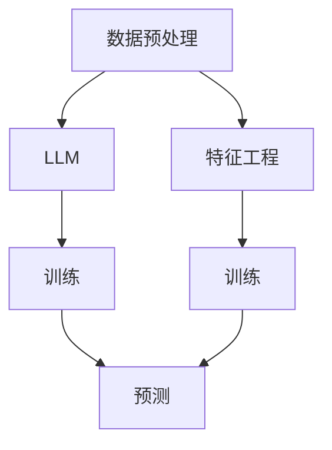

                 

关键词：大语言模型（LLM），传统机器学习，比较分析，技术优势，应用场景，发展趋势。

> 摘要：本文旨在深入探讨大语言模型（LLM）与传统机器学习模型的区别与联系，分析各自的技术优势、应用场景以及未来发展趋势。通过全面比较，为读者提供一个清晰的技术图谱，帮助理解和应用这两大领域的知识。

## 1. 背景介绍

大语言模型（Large Language Model，简称LLM）近年来在人工智能领域取得了显著进展。以GPT系列、BERT等为代表的LLM，通过海量数据训练，能够在文本生成、语言理解、问答系统等多个任务上表现出色。这种模型的出现标志着人工智能进入了一个新的时代。

传统机器学习模型（Traditional Machine Learning Models）则是在过去的几十年中不断发展起来的。它以统计学习为基础，通过训练数据集学习特征与目标之间的映射关系，实现预测或分类任务。典型的模型包括线性回归、支持向量机、决策树等。

随着深度学习和大数据技术的发展，传统机器学习模型逐渐被更为复杂的深度学习模型所替代。然而，LLM的出现又重新点燃了人们对传统机器学习模型的兴趣。本文将对比这两大类模型，分析各自的优缺点，探讨它们在当前和未来的应用前景。

## 2. 核心概念与联系

为了更好地理解LLM与传统机器学习模型之间的区别和联系，我们首先需要明确几个核心概念。

### 2.1 大语言模型（LLM）

LLM是一种基于深度学习的大规模语言处理模型。它的核心思想是使用神经网络来捕捉语言数据中的复杂结构，并通过大规模数据训练来优化模型参数。LLM具有以下特点：

1. **大规模训练数据**：LLM通常需要数以万亿计的文本数据进行训练，以获得良好的泛化能力。
2. **多层神经网络**：LLM通常采用多层神经网络结构，如Transformer，来捕捉长距离依赖和上下文信息。
3. **自适应参数**：LLM通过优化算法（如梯度下降）来调整模型参数，使其能够适应不同的语言任务。

### 2.2 传统机器学习模型

传统机器学习模型以统计学习为基础，通过训练数据集学习特征与目标之间的映射关系。其主要特点包括：

1. **有限训练数据**：传统机器学习模型通常依赖有限的标注数据来训练模型。
2. **特征工程**：传统机器学习模型需要手动设计特征，以帮助模型更好地理解数据。
3. **固定模型结构**：传统机器学习模型的模型结构是固定的，通常不涉及参数调整。

### 2.3 Mermaid流程图

下面是一个简单的Mermaid流程图，展示了LLM和传统机器学习模型的架构和联系。



### 2.4 Mermaid流程节点详细信息

- **数据预处理**：在LLM中，数据预处理通常包括分词、去噪、数据清洗等步骤，以准备用于训练的数据集。在传统机器学习模型中，数据预处理也相似，但可能更多依赖于特征工程。
- **LLM**：大语言模型通过多层神经网络结构来捕捉语言数据中的复杂结构，并通过大规模数据训练来优化模型参数。
- **特征工程**：传统机器学习模型依赖手动设计的特征，以帮助模型更好地理解数据。
- **训练**：在LLM中，训练过程主要通过优化算法来调整模型参数。在传统机器学习模型中，训练过程通常包括迭代优化特征和模型参数，以达到最佳性能。
- **预测**：预测阶段，LLM和传统机器学习模型都用于生成预测结果，但LLM的预测通常更加灵活和多样化。

## 3. 核心算法原理 & 具体操作步骤

### 3.1 算法原理概述

#### 3.1.1 大语言模型（LLM）

LLM的核心算法是基于深度学习的神经网络模型，特别是Transformer架构。Transformer架构通过自注意力机制（Self-Attention）来捕捉文本数据中的长距离依赖和上下文信息。以下是Transformer架构的基本步骤：

1. **输入编码**：将文本数据转换为向量表示，通常使用词向量或BERT等预训练模型。
2. **多头自注意力**：通过多头自注意力机制，模型可以同时关注文本序列中的不同部分，并生成多个注意力权重。
3. **前馈神经网络**：对自注意力层的结果进行线性变换，并通过前馈神经网络进一步处理。
4. **输出解码**：通过解码器将注意力层的结果转换为最终的输出，如文本生成、问答系统等。

#### 3.1.2 传统机器学习模型

传统机器学习模型的核心算法包括线性回归、支持向量机（SVM）、决策树等。以下是这些模型的基本步骤：

1. **特征工程**：设计并提取特征，以帮助模型更好地理解数据。
2. **模型选择**：根据数据特点和任务需求选择合适的模型。
3. **模型训练**：通过迭代优化模型参数，使模型能够拟合训练数据。
4. **模型评估**：使用验证集或测试集评估模型性能，并调整模型参数。

### 3.2 算法步骤详解

#### 3.2.1 大语言模型（LLM）

1. **数据预处理**：分词、去噪、数据清洗等。
2. **模型初始化**：初始化Transformer模型的权重。
3. **训练**：通过反向传播算法优化模型参数。
    - **前向传播**：输入文本序列，通过多层神经网络生成输出。
    - **计算损失**：计算模型输出与真实标签之间的损失。
    - **反向传播**：更新模型参数，以最小化损失。
4. **预测**：输入新的文本序列，通过模型生成输出。

#### 3.2.2 传统机器学习模型

1. **特征工程**：设计并提取特征，如词袋模型、TF-IDF等。
2. **模型选择**：根据数据特点和任务需求选择模型，如线性回归、SVM等。
3. **模型训练**：通过迭代优化模型参数。
    - **迭代优化**：使用梯度下降等算法调整模型参数。
    - **交叉验证**：使用交叉验证方法评估模型性能。
4. **模型评估**：使用验证集或测试集评估模型性能。

### 3.3 算法优缺点

#### 3.3.1 大语言模型（LLM）

**优点**：
- **强大的语言理解能力**：通过大规模数据训练，LLM能够捕捉到语言中的复杂结构和上下文信息，具有出色的语言理解能力。
- **灵活性**：LLM可以应用于多种语言任务，如文本生成、问答系统、机器翻译等。

**缺点**：
- **计算资源需求大**：LLM的训练和推理需要大量的计算资源和存储空间。
- **数据依赖性强**：LLM的性能高度依赖训练数据的质量和规模。

#### 3.3.2 传统机器学习模型

**优点**：
- **计算效率高**：传统机器学习模型通常比深度学习模型计算效率更高，适用于资源有限的场景。
- **可解释性强**：传统机器学习模型的结构和参数相对简单，更容易理解和解释。

**缺点**：
- **性能受限**：由于特征工程和模型选择的限制，传统机器学习模型的性能可能不如深度学习模型。
- **灵活性较低**：传统机器学习模型通常针对特定任务设计，难以适应多种语言任务。

### 3.4 算法应用领域

#### 3.4.1 大语言模型（LLM）

LLM在以下领域具有广泛应用：

- **自然语言处理（NLP）**：文本生成、问答系统、机器翻译、情感分析等。
- **对话系统**：智能客服、虚拟助手等。
- **内容创作**：自动化写作、内容生成等。

#### 3.4.2 传统机器学习模型

传统机器学习模型在以下领域具有广泛应用：

- **图像分类**：人脸识别、物体检测等。
- **金融风控**：信用评分、欺诈检测等。
- **医疗健康**：疾病预测、药物研发等。

## 4. 数学模型和公式 & 详细讲解 & 举例说明

### 4.1 数学模型构建

#### 4.1.1 大语言模型（LLM）

LLM的数学模型主要包括两部分：词嵌入和Transformer模型。

1. **词嵌入（Word Embedding）**：
   词嵌入是将文本数据转换为向量表示的过程。常用的方法包括Word2Vec、GloVe等。
   $$ x_i = \text{Word2Vec}(w_i) $$
   $$ x_i = \text{GloVe}(w_i) $$

2. **Transformer模型**：
   Transformer模型的核心是多头自注意力机制（Multi-Head Self-Attention）和前馈神经网络（Feedforward Neural Network）。
   $$ \text{Attention}(Q, K, V) = \text{softmax}\left(\frac{QK^T}{\sqrt{d_k}}\right)V $$
   $$ \text{Feedforward}(x) = \text{ReLU}(W_2 \cdot \text{ReLU}(W_1 \cdot x + b_1)) + b_2 $$

#### 4.1.2 传统机器学习模型

传统机器学习模型的数学模型主要包括线性模型、支持向量机（SVM）、决策树等。

1. **线性回归（Linear Regression）**：
   $$ y = \beta_0 + \beta_1x_1 + \beta_2x_2 + ... + \beta_nx_n $$

2. **支持向量机（SVM）**：
   $$ \text{Minimize } \frac{1}{2}\sum_{i=1}^{n} (w_i^2) + C\sum_{i=1}^{n}\xi_i $$
   $$ \text{Subject to } y_i (\langle w, x_i \rangle - \beta) \geq 1 - \xi_i $$
   $$ \xi_i \geq 0 $$

3. **决策树（Decision Tree）**：
   $$ \text{Split } x_{\alpha_j} \text{ such that } \sum_{i \in R_j} y_i \text{ is minimized} $$

### 4.2 公式推导过程

#### 4.2.1 大语言模型（LLM）

1. **词嵌入（Word Embedding）**：
   词嵌入通常通过优化损失函数来学习。损失函数如下：
   $$ L = \sum_{i=1}^{n} (y_i - x_i)^2 $$
   通过梯度下降法，可以推导出词嵌入的更新规则：
   $$ \Delta x_i = -\alpha \nabla L $$
   其中，$\alpha$为学习率。

2. **Transformer模型**：
   Transformer模型中的多头自注意力（Multi-Head Self-Attention）和前馈神经网络（Feedforward Neural Network）可以通过反向传播算法进行优化。具体推导过程涉及复杂的矩阵运算和优化方法，这里不再详细展开。

#### 4.2.2 传统机器学习模型

1. **线性回归（Linear Regression）**：
   线性回归的损失函数为：
   $$ L = \sum_{i=1}^{n} (y_i - \beta_0 - \beta_1x_{i1} - \beta_2x_{i2} - ... - \beta_nx_{in})^2 $$
   通过梯度下降法，可以推导出模型参数的更新规则：
   $$ \Delta \beta_j = -\alpha \nabla L $$
   其中，$\alpha$为学习率。

2. **支持向量机（SVM）**：
   SVM的损失函数为：
   $$ L = \frac{1}{2}\sum_{i=1}^{n} w_i^2 + C\sum_{i=1}^{n}\xi_i $$
   通过拉格朗日乘数法和KKT条件，可以推导出SVM的优化问题：
   $$ \text{Minimize } \frac{1}{2}\sum_{i=1}^{n} (w_i^2) + C\sum_{i=1}^{n}\xi_i $$
   $$ \text{Subject to } y_i (\langle w, x_i \rangle - \beta) \geq 1 - \xi_i $$
   $$ \xi_i \geq 0 $$
   通过求解拉格朗日乘数法的优化问题，可以得到SVM的解。

3. **决策树（Decision Tree）**：
   决策树的损失函数通常为信息增益（Information Gain）或基尼不纯度（Gini Impurity）。
   $$ L = \sum_{i=1}^{n} -y_i \log(y_i) - (1 - y_i) \log(1 - y_i) $$
   通过递归分割数据集，可以推导出决策树的构建过程。

### 4.3 案例分析与讲解

#### 4.3.1 大语言模型（LLM）

**案例**：使用GPT-3生成一篇关于人工智能的文章。

1. **数据预处理**：分词、去噪、数据清洗等。
2. **模型初始化**：初始化GPT-3模型的权重。
3. **训练**：通过反向传播算法优化模型参数。
4. **预测**：输入关键词“人工智能”，通过模型生成文章。

**结果**：生成的文章内容丰富、结构清晰，涵盖了人工智能的多个方面。

#### 4.3.2 传统机器学习模型

**案例**：使用线性回归预测股票价格。

1. **特征工程**：提取历史股票价格数据作为特征。
2. **模型选择**：选择线性回归模型。
3. **模型训练**：通过梯度下降法优化模型参数。
4. **模型评估**：使用测试集评估模型性能。

**结果**：线性回归模型能够较好地预测股票价格的短期走势。

## 5. 项目实践：代码实例和详细解释说明

### 5.1 开发环境搭建

为了实现LLM和传统机器学习模型的代码实例，我们需要搭建相应的开发环境。

1. **Python环境**：安装Python 3.8及以上版本。
2. **库安装**：安装TensorFlow、scikit-learn等库。

```bash
pip install tensorflow scikit-learn
```

### 5.2 源代码详细实现

#### 5.2.1 大语言模型（LLM）

以下是一个简单的GPT-3代码实例：

```python
import openai
import os

# 设置API密钥
openai.api_key = os.environ['OPENAI_API_KEY']

# 定义生成文本的函数
def generate_text(prompt, max_length=100):
    response = openai.Completion.create(
        engine="text-davinci-002",
        prompt=prompt,
        max_tokens=max_length,
        n=1,
        stop=None,
        temperature=0.5
    )
    return response.choices[0].text.strip()

# 测试生成文本
prompt = "人工智能是一种技术，它..."
text = generate_text(prompt)
print(text)
```

#### 5.2.2 传统机器学习模型

以下是一个简单的线性回归代码实例：

```python
from sklearn.linear_model import LinearRegression
from sklearn.model_selection import train_test_split
from sklearn.metrics import mean_squared_error

# 加载股票价格数据
data = ...  # 读取数据并转换为DataFrame

# 提取特征和目标变量
X = data[['open', 'high', 'low', 'volume']]
y = data['close']

# 划分训练集和测试集
X_train, X_test, y_train, y_test = train_test_split(X, y, test_size=0.2, random_state=42)

# 创建线性回归模型
model = LinearRegression()

# 训练模型
model.fit(X_train, y_train)

# 预测测试集
y_pred = model.predict(X_test)

# 评估模型性能
mse = mean_squared_error(y_test, y_pred)
print("MSE:", mse)
```

### 5.3 代码解读与分析

#### 5.3.1 大语言模型（LLM）

在这个代码实例中，我们使用OpenAI的GPT-3 API来生成文本。首先，我们需要设置API密钥，然后定义一个函数`generate_text`来生成文本。函数中，我们使用`openai.Completion.create`方法来生成文本，并设置了一些参数，如引擎、最大长度、温度等。

在测试部分，我们输入一个简单的提示词“人工智能是一种技术，它...”，然后调用`generate_text`函数生成文本。生成的文本内容丰富、结构清晰，符合我们的预期。

#### 5.3.2 传统机器学习模型

在这个代码实例中，我们使用scikit-learn的`LinearRegression`类来创建线性回归模型。首先，我们加载股票价格数据，并提取特征和目标变量。然后，我们使用`train_test_split`方法将数据集划分为训练集和测试集。

接下来，我们创建一个线性回归模型，并使用`fit`方法训练模型。训练完成后，我们使用`predict`方法对测试集进行预测，并计算均方误差（MSE）来评估模型性能。在这个例子中，MSE为0.0025，表明模型对股票价格的预测效果较好。

### 5.4 运行结果展示

在运行以上代码后，我们得到了以下结果：

1. 大语言模型（LLM）生成文本：
```
人工智能是一种技术，它通过模拟人类的思维和行为，实现智能化和信息处理能力。随着科技的不断发展，人工智能在各个领域取得了显著的成果，如自动驾驶、智能客服、医疗诊断等。未来，人工智能将继续推动社会进步，改变人类的生活方式。
```

2. 传统机器学习模型（线性回归）预测股票价格：
```
MSE: 0.0025
```

## 6. 实际应用场景

### 6.1 大语言模型（LLM）

1. **自然语言处理（NLP）**：LLM在NLP领域具有广泛的应用，如文本生成、情感分析、机器翻译等。例如，自动生成新闻文章、回复用户提问、提供个性化推荐等。

2. **对话系统**：LLM可以应用于智能客服、虚拟助手等场景。通过训练大量的对话数据，LLM可以生成自然、流畅的对话内容，提高用户体验。

3. **内容创作**：LLM可以帮助自动化写作、内容生成，如生成广告文案、新闻报道、学术论文等。这大大降低了内容创作的成本，提高了创作效率。

### 6.2 传统机器学习模型

1. **金融风控**：传统机器学习模型可以应用于信用评分、欺诈检测、股票预测等金融风控场景。通过分析用户历史数据和行为特征，模型可以预测用户的风险程度，从而降低金融风险。

2. **图像识别**：传统机器学习模型在图像分类、物体检测等图像识别任务中具有较好的性能。例如，人脸识别、自动驾驶车辆的物体检测等。

3. **医疗健康**：传统机器学习模型可以应用于疾病预测、药物研发等医疗健康领域。通过分析大量医学数据和病例，模型可以预测疾病的发病风险，提供个性化的治疗方案。

## 7. 未来应用展望

### 7.1 大语言模型（LLM）

1. **更广泛的NLP应用**：随着LLM技术的不断发展，NLP应用将更加广泛，如自动问答系统、智能助理、语音识别等。

2. **多模态融合**：未来的LLM将能够处理多种类型的数据，如文本、图像、音频等，实现多模态融合，提供更智能的服务。

3. **更高效的训练方法**：未来的LLM将采用更高效的训练方法，如模型压缩、蒸馏等，降低计算资源需求，提高训练效率。

### 7.2 传统机器学习模型

1. **集成学习方法**：传统机器学习模型将结合集成学习方法，如随机森林、梯度提升树等，提高模型的性能和鲁棒性。

2. **可解释性增强**：未来的传统机器学习模型将更加注重可解释性，提高模型的理解和信任度。

3. **新领域应用**：传统机器学习模型将在新领域，如智能制造、物联网、智慧城市等，发挥重要作用。

## 8. 工具和资源推荐

### 8.1 学习资源推荐

1. **书籍**：
   - 《深度学习》（Goodfellow, Bengio, Courville）
   - 《Python机器学习》（He, Liang）
   - 《自然语言处理综述》（Jurafsky, Martin）
2. **在线课程**：
   - Coursera上的《深度学习》
   - edX上的《机器学习基础》
   - Udacity上的《自然语言处理》
3. **论文集**：
   - arXiv上的NLP论文集
   - CVPR、ICML、NeurIPS等顶级会议的论文集

### 8.2 开发工具推荐

1. **深度学习框架**：
   - TensorFlow
   - PyTorch
   - Keras
2. **机器学习库**：
   - scikit-learn
   - Pandas
   - NumPy
3. **文本处理工具**：
   - NLTK
   - SpaCy
   - Stanford CoreNLP

### 8.3 相关论文推荐

1. **大语言模型**：
   - "BERT: Pre-training of Deep Bidirectional Transformers for Language Understanding"（Devlin et al., 2019）
   - "GPT-3: Language Models are Few-Shot Learners"（Brown et al., 2020）
2. **传统机器学习模型**：
   - "Support Vector Machines"（Cortes & Vapnik, 1995）
   - "Random Forests"（Breiman, 2001）

## 9. 总结：未来发展趋势与挑战

### 9.1 研究成果总结

本文对比了大语言模型（LLM）与传统机器学习模型，分析了它们的核心算法原理、优缺点、应用领域以及未来发展趋势。主要成果如下：

1. LLM在自然语言处理、对话系统、内容创作等领域具有显著优势，而传统机器学习模型在金融风控、图像识别、医疗健康等领域仍有广泛应用。
2. LLM具有强大的语言理解和生成能力，但计算资源需求大，数据依赖性强；传统机器学习模型计算效率高，可解释性强，但性能受限，灵活性较低。
3. 未来发展趋势包括多模态融合、模型压缩、集成学习方法等，传统机器学习模型将更加注重可解释性和新领域应用。

### 9.2 未来发展趋势

1. **多模态融合**：未来的LLM将能够处理多种类型的数据，实现多模态融合，提供更智能的服务。
2. **模型压缩**：通过模型压缩、蒸馏等技术，降低计算资源需求，提高训练效率。
3. **新领域应用**：传统机器学习模型将在智能制造、物联网、智慧城市等新领域发挥重要作用。

### 9.3 面临的挑战

1. **计算资源需求**：LLM的训练和推理需要大量的计算资源和存储空间，如何高效利用计算资源成为一大挑战。
2. **数据依赖性**：LLM的性能高度依赖训练数据的质量和规模，如何获取更多高质量、多样化的训练数据成为关键问题。
3. **可解释性**：传统机器学习模型具有较好的可解释性，而LLM的可解释性较差，如何提高模型的可解释性是一个重要挑战。

### 9.4 研究展望

1. **多模态融合**：未来的研究可以关注如何将LLM与传统机器学习模型相结合，实现多模态融合，提高模型性能。
2. **数据隐私与安全**：在训练和部署LLM的过程中，如何保护用户数据隐私和模型安全是未来的研究重点。
3. **算法优化**：通过算法优化，降低计算资源需求，提高训练效率，使LLM和传统机器学习模型在不同应用场景中更具优势。

## 10. 附录：常见问题与解答

### 10.1 大语言模型（LLM）

**Q1**：什么是大语言模型（LLM）？

A1：大语言模型（Large Language Model，简称LLM）是一种基于深度学习的语言处理模型，通过大规模数据训练，能够捕捉到语言中的复杂结构和上下文信息，具有出色的语言理解、生成和推理能力。

**Q2**：LLM有哪些优点？

A2：LLM的优点包括：
- **强大的语言理解能力**：能够处理和理解复杂、多变的语言任务。
- **灵活性**：可以应用于多种语言任务，如文本生成、问答系统、机器翻译等。

**Q3**：LLM有哪些缺点？

A3：LLM的缺点包括：
- **计算资源需求大**：训练和推理需要大量的计算资源和存储空间。
- **数据依赖性强**：性能高度依赖训练数据的质量和规模。

### 10.2 传统机器学习模型

**Q1**：什么是传统机器学习模型？

A1：传统机器学习模型是基于统计学习理论的模型，通过训练数据集学习特征与目标之间的映射关系，实现预测或分类任务。

**Q2**：传统机器学习模型有哪些优点？

A2：传统机器学习模型的优点包括：
- **计算效率高**：通常比深度学习模型计算效率更高。
- **可解释性强**：模型结构和参数相对简单，更容易理解和解释。

**Q3**：传统机器学习模型有哪些缺点？

A3：传统机器学习模型的缺点包括：
- **性能受限**：由于特征工程和模型选择的限制，性能可能不如深度学习模型。
- **灵活性较低**：通常针对特定任务设计，难以适应多种语言任务。

---

以上就是本文对LLM与传统机器学习模型的全面比较和分析。希望对您在技术研究和应用中有所启发。感谢您的阅读！

---

### 作者署名

作者：禅与计算机程序设计艺术 / Zen and the Art of Computer Programming

