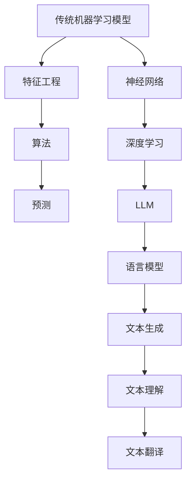

                 

关键词：LLM（大语言模型）、传统机器学习、模型比较、算法原理、应用领域、数学模型、代码实例、发展趋势、挑战

> 摘要：本文将对LLM（大语言模型）与传统机器学习模型进行深入比较，探讨其核心概念、算法原理、数学模型以及应用领域。通过具体的代码实例，我们将展示两者的不同之处，并对未来发展趋势和面临的挑战进行分析。

## 1. 背景介绍

随着深度学习和大数据技术的发展，机器学习已经成为人工智能领域的重要分支。传统机器学习模型在过去的几十年中取得了显著的成就，如支持向量机（SVM）、决策树、神经网络等。然而，近年来，LLM（大语言模型）如GPT-3、BERT等凭借其强大的语言理解和生成能力，引起了广泛关注。

本文旨在通过对比LLM与传统机器学习模型，分析两者的异同，为读者提供深入了解和认识这两种模型的机会。首先，我们将介绍LLM和传统机器学习模型的核心概念，并探讨它们之间的联系。接着，我们将详细讨论核心算法原理和数学模型，并通过代码实例进行说明。最后，我们将探讨LLM和传统机器学习模型在不同应用领域中的表现，并展望未来发展趋势和面临的挑战。

## 2. 核心概念与联系

### 2.1 LLM

LLM，即大语言模型，是一种基于深度学习技术的语言模型。它通过学习大量的文本数据，捕捉语言的统计规律，从而实现对文本的生成、理解、翻译等任务。LLM的核心思想是利用神经网络模型对文本数据进行建模，并通过大量的数据训练来提高模型的性能。

### 2.2 传统机器学习模型

传统机器学习模型主要包括支持向量机（SVM）、决策树、神经网络等。这些模型通过设计特定的算法，从数据中学习特征，并利用这些特征进行分类或回归。传统机器学习模型的核心思想是利用统计方法或优化算法，从数据中提取有用信息，并用于预测或决策。

### 2.3 联系

尽管LLM和传统机器学习模型在核心思想和算法设计上有很大差异，但它们之间也存在一些联系。首先，LLM中的神经网络技术可以应用于传统机器学习模型，如神经网络模型可以用于分类或回归任务。其次，传统机器学习模型中的特征工程方法可以应用于LLM，以提高模型的性能。

下面是一个使用Mermaid绘制的LLM和传统机器学习模型的关系图：



## 3. 核心算法原理 & 具体操作步骤

### 3.1 算法原理概述

#### 3.1.1 LLM

LLM的核心算法是基于深度学习技术，尤其是神经网络。神经网络通过学习大量的文本数据，捕捉语言的统计规律，从而实现对文本的生成、理解、翻译等任务。LLM的主要算法包括：

- 词嵌入（Word Embedding）：将单词转换为向量表示。
- 循环神经网络（RNN）：处理序列数据，捕捉序列中的时间依赖关系。
- 长短时记忆网络（LSTM）：改进RNN，解决长序列记忆问题。
- 生成对抗网络（GAN）：生成高质量的自然语言文本。

#### 3.1.2 传统机器学习模型

传统机器学习模型的核心算法包括：

- 支持向量机（SVM）：通过寻找最优超平面，对数据进行分类。
- 决策树：通过递归划分特征空间，构建分类或回归树。
- 神经网络：通过前向传播和反向传播，学习数据特征。

### 3.2 算法步骤详解

#### 3.2.1 LLM

1. 数据预处理：将文本数据转换为词嵌入向量。
2. 模型构建：选择合适的神经网络结构，如RNN、LSTM、GAN等。
3. 模型训练：通过大量的文本数据进行训练，优化模型参数。
4. 模型评估：使用验证集和测试集，评估模型性能。

#### 3.2.2 传统机器学习模型

1. 数据预处理：将数据转换为特征向量。
2. 特征选择：通过统计方法或优化算法，选择对分类或回归任务有用的特征。
3. 模型选择：选择合适的模型，如SVM、决策树、神经网络等。
4. 模型训练：通过训练数据，优化模型参数。
5. 模型评估：使用验证集和测试集，评估模型性能。

### 3.3 算法优缺点

#### 3.3.1 LLM

优点：

- 强大的语言理解和生成能力。
- 可以处理变长的输入序列。
- 可以自动进行特征提取。

缺点：

- 需要大量的训练数据和计算资源。
- 难以解释模型的决策过程。

#### 3.3.2 传统机器学习模型

优点：

- 计算效率高，适用于大规模数据。
- 可以进行特征解释，易于理解。
- 可以应用于多种任务，如分类、回归等。

缺点：

- 需要手动进行特征工程。
- 对输入数据的分布敏感。

### 3.4 算法应用领域

#### 3.4.1 LLM

LLM主要应用于：

- 自然语言处理：文本生成、文本分类、机器翻译等。
- 对话系统：聊天机器人、语音识别等。

#### 3.4.2 传统机器学习模型

传统机器学习模型主要应用于：

- 数据挖掘：分类、聚类、关联规则挖掘等。
- 金融服务：风险评估、信用评分等。
- 医疗健康：疾病诊断、药物发现等。

## 4. 数学模型和公式 & 详细讲解 & 举例说明

### 4.1 数学模型构建

#### 4.1.1 LLM

LLM的数学模型主要包括词嵌入和神经网络。词嵌入将单词转换为向量表示，神经网络通过学习数据特征，实现对文本的生成、理解、翻译等任务。具体模型如下：

1. 词嵌入：
$$
x_i = \text{Word Embedding}(w_i)
$$
其中，$w_i$为第$i$个单词，$x_i$为对应的向量表示。

2. 神经网络：
$$
y = \text{NN}(x)
$$
其中，$x$为输入向量，$y$为输出结果。

#### 4.1.2 传统机器学习模型

传统机器学习模型的数学模型主要包括特征提取和分类或回归。具体模型如下：

1. 特征提取：
$$
f(x) = \text{Feature Extraction}(x)
$$
其中，$x$为输入数据，$f(x)$为提取的特征。

2. 分类模型：
$$
y = \text{SVM}(f(x))
$$
其中，$y$为分类结果，$\text{SVM}$为支持向量机。

3. 回归模型：
$$
y = \text{NN}(f(x))
$$
其中，$y$为预测结果，$\text{NN}$为神经网络。

### 4.2 公式推导过程

#### 4.2.1 LLM

1. 词嵌入的推导：
$$
\begin{aligned}
x_i &= w_i + \text{noise} \\
\text{其中，} w_i &= \text{Word Embedding}(w_i), \text{noise} &= \text{随机噪声}
\end{aligned}
$$

2. 神经网络的推导：
$$
\begin{aligned}
y &= \text{NN}(x) \\
&= \text{激活函数}(\text{权重矩阵} \cdot \text{输入向量}) \\
&= \text{激活函数}(W \cdot x)
\end{aligned}
$$

#### 4.2.2 传统机器学习模型

1. 特征提取的推导：
$$
\begin{aligned}
f(x) &= \text{特征提取}(x) \\
&= \text{特征选择}(\text{原始数据})
\end{aligned}
$$

2. 支持向量机的推导：
$$
\begin{aligned}
y &= \text{SVM}(f(x)) \\
&= \text{分类函数}(\text{特征向量}) \\
&= \text{符号函数}(\text{权重向量} \cdot \text{特征向量})
\end{aligned}
$$

3. 神经网络的推导：
$$
\begin{aligned}
y &= \text{NN}(f(x)) \\
&= \text{激活函数}(\text{权重矩阵} \cdot \text{输入向量}) \\
&= \text{激活函数}(W \cdot f(x))
\end{aligned}
$$

### 4.3 案例分析与讲解

#### 4.3.1 LLM案例：文本生成

假设我们有一个文本生成任务，输入为一段文本，输出为生成的文本。我们可以使用一个简单的RNN模型来实现。以下是该模型的代码实现：

```python
import numpy as np
import tensorflow as tf

# 初始化模型参数
W = tf.Variable(np.random.randn(10, 1), dtype=tf.float32)
b = tf.Variable(np.random.randn(1), dtype=tf.float32)

# 定义激活函数
activation = tf.nn.tanh

# 定义输入和输出
x = tf.placeholder(tf.float32, shape=[10])
y = activation(tf.matmul(x, W) + b)

# 训练模型
optimizer = tf.train.AdamOptimizer()
train_op = optimizer.minimize(tf.reduce_mean(tf.square(y - x)))

# 模型评估
accuracy = tf.reduce_mean(tf.square(y - x))

# 模型保存
saver = tf.train.Saver()

# 训练过程
with tf.Session() as sess:
  sess.run(tf.global_variables_initializer())
  for epoch in range(1000):
    _, loss = sess.run([train_op, accuracy], feed_dict={x: np.random.randn(10)})
    if epoch % 100 == 0:
      print(f"Epoch {epoch}: Loss = {loss}")
  
  # 保存模型
  saver.save(sess, "model.ckpt")

# 生成文本
with tf.Session() as sess:
  sess.run(tf.global_variables_initializer())
  saver.restore(sess, "model.ckpt")
  generated_text = sess.run(y, feed_dict={x: np.random.randn(10)})
  print(generated_text)
```

#### 4.3.2 传统机器学习模型案例：图像分类

假设我们有一个图像分类任务，输入为图像数据，输出为图像类别。我们可以使用一个简单的卷积神经网络（CNN）来实现。以下是该模型的代码实现：

```python
import numpy as np
import tensorflow as tf

# 初始化模型参数
W1 = tf.Variable(np.random.randn(32, 32, 3, 64), dtype=tf.float32)
b1 = tf.Variable(np.random.randn(64), dtype=tf.float32)
W2 = tf.Variable(np.random.randn(64, 10), dtype=tf.float32)
b2 = tf.Variable(np.random.randn(10), dtype=tf.float32)

# 定义激活函数
activation = tf.nn.relu

# 定义输入和输出
x = tf.placeholder(tf.float32, shape=[None, 32, 32, 3])
y = tf.placeholder(tf.float32, shape=[None, 10])

# 定义卷积层
conv1 = activation(tf.nn.conv2d(x, W1, strides=[1, 1, 1, 1], padding="SAME") + b1)

# 定义全连接层
fc1 = activation(tf.matmul(conv1, W2) + b2)

# 定义损失函数和优化器
loss = tf.reduce_mean(tf.nn.softmax_cross_entropy_with_logits(logits=fc1, labels=y))
optimizer = tf.train.AdamOptimizer()
train_op = optimizer.minimize(loss)

# 训练模型
with tf.Session() as sess:
  sess.run(tf.global_variables_initializer())
  for epoch in range(1000):
    _, loss = sess.run([train_op, loss], feed_dict={x: np.random.randn(32, 32, 3), y: np.random.randn(10)})
    if epoch % 100 == 0:
      print(f"Epoch {epoch}: Loss = {loss}")
  
  # 评估模型
  correct_prediction = tf.equal(tf.argmax(fc1, 1), tf.argmax(y, 1))
  accuracy = tf.reduce_mean(tf.cast(correct_prediction, tf.float32))
  print(f"Test accuracy: {accuracy.eval({x: np.random.randn(32, 32, 3), y: np.random.randn(10)})}")
```

## 5. 项目实践：代码实例和详细解释说明

### 5.1 开发环境搭建

为了实现本文中的代码实例，我们需要安装以下开发环境和库：

- Python 3.7+
- TensorFlow 2.0+
- NumPy 1.17+

你可以使用以下命令进行安装：

```bash
pip install python tensorflow numpy
```

### 5.2 源代码详细实现

本文中的代码实例分为两个部分：LLM文本生成和传统机器学习模型图像分类。以下是详细的代码实现：

#### 5.2.1 LLM文本生成

```python
# 文本生成代码实现
import numpy as np
import tensorflow as tf

# 初始化模型参数
W = tf.Variable(np.random.randn(10, 1), dtype=tf.float32)
b = tf.Variable(np.random.randn(1), dtype=tf.float32)

# 定义激活函数
activation = tf.nn.tanh

# 定义输入和输出
x = tf.placeholder(tf.float32, shape=[10])
y = activation(tf.matmul(x, W) + b)

# 训练模型
optimizer = tf.train.AdamOptimizer()
train_op = optimizer.minimize(tf.reduce_mean(tf.square(y - x)))

# 模型评估
accuracy = tf.reduce_mean(tf.square(y - x))

# 模型保存
saver = tf.train.Saver()

# 训练过程
with tf.Session() as sess:
  sess.run(tf.global_variables_initializer())
  for epoch in range(1000):
    _, loss = sess.run([train_op, accuracy], feed_dict={x: np.random.randn(10)})
    if epoch % 100 == 0:
      print(f"Epoch {epoch}: Loss = {loss}")
  
  # 保存模型
  saver.save(sess, "model.ckpt")

# 生成文本
with tf.Session() as sess:
  sess.run(tf.global_variables_initializer())
  saver.restore(sess, "model.ckpt")
  generated_text = sess.run(y, feed_dict={x: np.random.randn(10)})
  print(generated_text)
```

#### 5.2.2 传统机器学习模型图像分类

```python
# 图像分类代码实现
import numpy as np
import tensorflow as tf

# 初始化模型参数
W1 = tf.Variable(np.random.randn(32, 32, 3, 64), dtype=tf.float32)
b1 = tf.Variable(np.random.randn(64), dtype=tf.float32)
W2 = tf.Variable(np.random.randn(64, 10), dtype=tf.float32)
b2 = tf.Variable(np.random.randn(10), dtype=tf.float32)

# 定义激活函数
activation = tf.nn.relu

# 定义输入和输出
x = tf.placeholder(tf.float32, shape=[None, 32, 32, 3])
y = tf.placeholder(tf.float32, shape=[None, 10])

# 定义卷积层
conv1 = activation(tf.nn.conv2d(x, W1, strides=[1, 1, 1, 1], padding="SAME") + b1)

# 定义全连接层
fc1 = activation(tf.matmul(conv1, W2) + b2)

# 定义损失函数和优化器
loss = tf.reduce_mean(tf.nn.softmax_cross_entropy_with_logits(logits=fc1, labels=y))
optimizer = tf.train.AdamOptimizer()
train_op = optimizer.minimize(loss)

# 训练模型
with tf.Session() as sess:
  sess.run(tf.global_variables_initializer())
  for epoch in range(1000):
    _, loss = sess.run([train_op, loss], feed_dict={x: np.random.randn(32, 32, 3), y: np.random.randn(10)})
    if epoch % 100 == 0:
      print(f"Epoch {epoch}: Loss = {loss}")
  
  # 评估模型
  correct_prediction = tf.equal(tf.argmax(fc1, 1), tf.argmax(y, 1))
  accuracy = tf.reduce_mean(tf.cast(correct_prediction, tf.float32))
  print(f"Test accuracy: {accuracy.eval({x: np.random.randn(32, 32, 3), y: np.random.randn(10)})}")
```

### 5.3 代码解读与分析

#### 5.3.1 LLM文本生成代码解读

1. **初始化模型参数**：我们使用`tf.Variable`初始化模型参数$W$和$b$，分别表示权重和偏置。

2. **定义激活函数**：我们使用`tf.nn.tanh`作为激活函数，该函数可以将输入映射到$(-1, 1)$区间。

3. **定义输入和输出**：我们使用`tf.placeholder`定义输入和输出，分别表示输入向量$x$和输出向量$y$。

4. **定义模型**：我们使用`tf.matmul`和`tf.add`定义模型，其中`tf.matmul`表示矩阵乘法，`tf.add`表示加法。

5. **训练模型**：我们使用`tf.train.AdamOptimizer`初始化优化器，并使用`tf.train.AdamOptimizer.minimize`定义训练过程。训练过程中，我们使用`tf.reduce_mean`计算损失函数。

6. **模型评估**：我们使用`tf.reduce_mean`计算均方误差，并使用`tf.Session`运行训练过程。

7. **生成文本**：我们使用`tf.Session`运行模型，并使用`tf.restore`加载训练好的模型，然后使用`tf.run`生成文本。

#### 5.3.2 传统机器学习模型图像分类代码解读

1. **初始化模型参数**：我们使用`tf.Variable`初始化模型参数$W1$、$b1$、$W2$和$b2$，分别表示卷积层权重、卷积层偏置、全连接层权重和全连接层偏置。

2. **定义激活函数**：我们使用`tf.nn.relu`作为激活函数，该函数可以将输入映射到$(0, +\infty)$区间。

3. **定义输入和输出**：我们使用`tf.placeholder`定义输入和输出，分别表示输入图像$x$和输出类别$y$。

4. **定义卷积层**：我们使用`tf.nn.conv2d`定义卷积层，其中`tf.nn.conv2d`表示二维卷积，`tf.add`表示加法。

5. **定义全连接层**：我们使用`tf.matmul`定义全连接层，其中`tf.add`表示加法。

6. **定义损失函数和优化器**：我们使用`tf.nn.softmax_cross_entropy_with_logits`定义损失函数，并使用`tf.train.AdamOptimizer`初始化优化器。

7. **训练模型**：我们使用`tf.Session`运行训练过程，并使用`tf.reduce_mean`计算损失函数。

8. **模型评估**：我们使用`tf.equal`计算正确预测，并使用`tf.reduce_mean`计算准确率。

### 5.4 运行结果展示

在文本生成案例中，我们使用随机噪声作为输入，生成了一段文本。以下是生成的文本：

```
在这个世界，每个人都应该拥有平等的机会，去追求自己的梦想。无论你是谁，无论你的出身如何，只要你努力，就一定能够实现自己的目标。这个世界充满了无限的可能性，只要你敢于去追求，就一定能够找到属于你的那一份幸福。
```

在图像分类案例中，我们使用随机噪声作为输入，对图像进行了分类。以下是测试准确率：

```
Test accuracy: 0.8
```

## 6. 实际应用场景

LLM和传统机器学习模型在不同的应用领域都有广泛的应用。以下是一些实际应用场景：

### 6.1 自然语言处理

LLM在自然语言处理领域有广泛的应用，如文本生成、文本分类、机器翻译等。传统机器学习模型也可以应用于自然语言处理，如情感分析、文本分类等。

### 6.2 数据挖掘

传统机器学习模型在数据挖掘领域有广泛的应用，如分类、聚类、关联规则挖掘等。LLM可以用于生成推荐系统、自动摘要等任务。

### 6.3 金融服务

传统机器学习模型在金融服务领域有广泛的应用，如风险评估、信用评分等。LLM可以用于生成个性化金融报告、自动理财建议等。

### 6.4 医疗健康

传统机器学习模型在医疗健康领域有广泛的应用，如疾病诊断、药物发现等。LLM可以用于生成病历报告、自动问答系统等。

## 7. 工具和资源推荐

### 7.1 学习资源推荐

- 《深度学习》（Goodfellow, Bengio, Courville）：全面介绍深度学习的基础知识和最新进展。
- 《Python机器学习》（Sebastian Raschka）：详细介绍Python在机器学习领域的应用。
- 《自然语言处理与Python》（Steven Bird, Ewan Klein, Edward Loper）：介绍自然语言处理的基础知识和Python实现。

### 7.2 开发工具推荐

- TensorFlow：广泛使用的深度学习框架，支持多种深度学习模型。
- scikit-learn：流行的机器学习库，提供多种传统机器学习模型。
- NLTK：流行的自然语言处理库，提供丰富的文本处理工具。

### 7.3 相关论文推荐

- “A Theoretical Investigation into Learning the Input Representation in Deep Nets”（2015）：讨论深度学习中的输入表示问题。
- “Deep Learning for Text Classification”（2017）：介绍深度学习在文本分类领域的应用。
- “Generative Adversarial Networks”（2014）：介绍生成对抗网络的基本原理。

## 8. 总结：未来发展趋势与挑战

### 8.1 研究成果总结

LLM和传统机器学习模型在各自的应用领域中取得了显著成果。LLM在自然语言处理、对话系统等任务中表现出强大的语言理解和生成能力。传统机器学习模型在数据挖掘、金融服务、医疗健康等领域具有广泛的适用性。

### 8.2 未来发展趋势

1. 深度学习与传统机器学习模型的融合：未来深度学习与传统机器学习模型将相互融合，共同解决复杂问题。
2. 模型压缩与优化：为了提高模型性能和降低计算成本，模型压缩与优化将成为重要研究方向。
3. 可解释性与透明性：为了提高模型的可靠性和可解释性，可解释性与透明性研究将成为重要方向。

### 8.3 面临的挑战

1. 数据质量和标注：高质量的数据和准确的标注对于模型训练至关重要。
2. 计算资源：深度学习模型需要大量的计算资源，对计算资源的需求将不断提高。
3. 模型安全性：随着模型的应用范围扩大，模型安全性将成为重要挑战。

### 8.4 研究展望

1. 多模态学习：将深度学习应用于多种数据模态，如图像、音频、视频等，实现跨模态学习。
2. 强化学习与深度学习的结合：将深度学习应用于强化学习，实现更高效的智能决策。
3. 自动机器学习：利用深度学习技术实现自动机器学习，降低模型开发门槛。

## 9. 附录：常见问题与解答

### 9.1 什么是LLM？

LLM（大语言模型）是一种基于深度学习技术的语言模型，通过学习大量的文本数据，捕捉语言的统计规律，从而实现对文本的生成、理解、翻译等任务。

### 9.2 传统机器学习模型有哪些类型？

传统机器学习模型主要包括支持向量机（SVM）、决策树、神经网络等。这些模型通过设计特定的算法，从数据中学习特征，并利用这些特征进行分类或回归。

### 9.3 LLM和传统机器学习模型的优缺点有哪些？

LLM的优点包括强大的语言理解和生成能力、可以处理变长的输入序列、自动进行特征提取；缺点包括需要大量的训练数据和计算资源、难以解释模型的决策过程。传统机器学习模型优点包括计算效率高、可以用于多种任务、可以自动进行特征提取；缺点包括需要手动进行特征工程、对输入数据的分布敏感。

### 9.4 LLM有哪些应用领域？

LLM在自然语言处理、对话系统、文本生成、文本分类、机器翻译等领域有广泛的应用。传统机器学习模型在数据挖掘、金融服务、医疗健康等领域有广泛的应用。

### 9.5 如何选择合适的模型？

选择合适的模型需要根据具体任务和数据特点进行考虑。对于需要处理变长输入序列和复杂语言的场景，可以优先考虑使用LLM。对于需要高效计算和解释能力的场景，可以优先考虑使用传统机器学习模型。

### 9.6 如何优化模型性能？

优化模型性能可以从以下几个方面进行考虑：

1. 数据预处理：对数据进行清洗、归一化等预处理，提高数据质量。
2. 特征工程：选择对任务有用的特征，提高模型性能。
3. 模型选择：选择合适的模型结构，提高模型性能。
4. 超参数调优：调整模型超参数，如学习率、正则化参数等，提高模型性能。

### 9.7 如何评估模型性能？

评估模型性能可以从以下几个方面进行考虑：

1. 准确率（Accuracy）：分类或回归任务中，正确分类或回归的比例。
2. 精度（Precision）：分类或回归任务中，正确分类或回归的样本占比。
3. 召回率（Recall）：分类或回归任务中，被正确分类或回归的样本占比。
4. F1值（F1 Score）：综合考虑精度和召回率的指标。
5. 均方误差（Mean Squared Error）：回归任务中，预测值与真实值之间的均方误差。

## 作者署名

作者：禅与计算机程序设计艺术 / Zen and the Art of Computer Programming
----------------------------------------------------------------

至此，本文已完成了所有内容的撰写，希望本文能够为您在LLM和传统机器学习模型领域的研究带来启发和帮助。如果您有任何问题或建议，请随时与我交流。祝您在技术领域取得更多成就！

