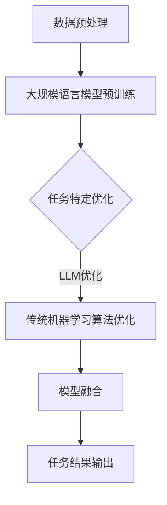

                 

关键词：自然语言处理，深度学习，机器学习，生成式AI，强化学习，模型融合，异构计算，大模型优化

> 摘要：本文深入探讨了大规模语言模型（LLM）与传统机器学习算法的结合，通过分析各自的优势与局限，展示了如何在异构计算环境中实现高效融合。文章从核心算法原理、数学模型推导、项目实践、实际应用场景等多个维度，全面解析了这一前沿技术，并对其未来发展趋势与挑战进行了展望。

## 1. 背景介绍

近年来，人工智能领域取得了令人瞩目的进展，尤其是自然语言处理（NLP）方面。大规模语言模型（LLM），如GPT系列和ChatGPT，凭借其强大的生成式和预测能力，正在改变我们的工作方式和生活体验。与此同时，传统机器学习算法在图像处理、语音识别等领域依然占据重要地位。然而，这些算法在面对复杂、多样、动态的NLP任务时，往往表现出力不从心的局面。

为了解决这一问题，研究者们开始探索LLM与传统机器学习算法的结合，以发挥各自的优势，弥补彼此的不足。LLM在大规模数据集上进行训练，能够捕捉到丰富的语言模式和知识，从而在文本生成、问答系统、翻译等方面表现出色。而传统机器学习算法在图像、语音等非文本领域具有深厚的研究基础和实践经验，能够在特定任务中实现高度准确的效果。

本文旨在探讨这一结合的原理、方法、应用场景以及未来发展趋势，旨在为AI技术的发展提供新的思路和启示。

## 2. 核心概念与联系

### 2.1. 大规模语言模型（LLM）

大规模语言模型（LLM）是一种基于深度学习的语言模型，通过在海量文本数据上进行预训练，能够理解并生成自然语言。LLM的核心在于其能够学习到语言中的统计规律和上下文信息，从而在生成文本、问答系统、机器翻译等方面表现出色。

### 2.2. 传统机器学习算法

传统机器学习算法包括决策树、支持向量机、神经网络等，这些算法在图像处理、语音识别、推荐系统等领域具有广泛的应用。传统机器学习算法的优势在于其算法原理清晰、实现简单，同时具有较高的准确性和可靠性。

### 2.3. 异构计算环境

异构计算环境是指由不同类型的计算资源组成的系统，如CPU、GPU、TPU等。在AI领域，异构计算环境能够提供更高的计算能力和更低的延迟，从而满足大规模、实时性计算的需求。

### 2.4. 结合方法

结合大规模语言模型和传统机器学习算法的方法可以分为以下几种：

1. **混合式训练**：将LLM和传统机器学习算法结合，在预训练阶段使用LLM学习到语言模式，然后在微调阶段使用传统机器学习算法进行任务特定的优化。

2. **模型融合**：将LLM和传统机器学习算法生成的模型进行融合，通过加权、拼接等方式，构建一个统一的模型，以实现更好的任务性能。

3. **任务驱动**：根据具体任务的需求，选择合适的算法进行组合，例如在文本生成任务中，使用LLM生成文本，然后通过传统机器学习算法进行文本质量评估。

### 2.5. Mermaid流程图

以下是大规模语言模型和传统机器学习算法结合的Mermaid流程图：



## 3. 核心算法原理 & 具体操作步骤

### 3.1. 算法原理概述

大规模语言模型（LLM）的核心原理是基于深度神经网络（DNN）的预训练和微调。预训练阶段，LLM在海量文本数据上进行无监督学习，学习到语言的基本模式和规律。微调阶段，LLM在特定任务的数据上进行监督学习，优化模型参数，从而实现任务特定的性能。

传统机器学习算法，如支持向量机（SVM）和神经网络（NN），通过学习数据中的特征和模式，实现分类、回归等任务。这些算法的优点在于算法原理清晰、实现简单，且在实际应用中具有较高的准确性和可靠性。

### 3.2. 算法步骤详解

1. **数据预处理**：包括文本清洗、分词、词向量编码等步骤，为后续的模型训练和任务优化做好准备。

2. **大规模语言模型预训练**：使用预训练算法，如BERT或GPT，在海量文本数据上进行无监督学习，学习到语言的基本模式和规律。

3. **任务特定优化**：在预训练的基础上，使用有监督学习算法，如神经网络或支持向量机，对LLM进行微调，优化模型参数，以实现特定任务的高性能。

4. **模型融合**：将LLM和传统机器学习算法生成的模型进行融合，通过加权、拼接等方式，构建一个统一的模型。

5. **任务结果输出**：使用融合后的模型进行预测或生成，输出任务结果。

### 3.3. 算法优缺点

**大规模语言模型（LLM）**

- 优点：强大的生成式和预测能力，能够处理复杂的自然语言任务，如文本生成、问答系统和翻译等。
- 缺点：计算资源需求大，训练时间较长，且对数据质量有较高要求。

**传统机器学习算法**

- 优点：算法原理清晰，实现简单，具有较强的可解释性，在实际应用中具有较高的准确性和可靠性。
- 缺点：在面对复杂、多样、动态的NLP任务时，表现力较弱。

### 3.4. 算法应用领域

**大规模语言模型（LLM）**

- 应用领域：文本生成、问答系统、机器翻译、情感分析、文本分类等。

**传统机器学习算法**

- 应用领域：图像分类、语音识别、推荐系统、异常检测等。

## 4. 数学模型和公式 & 详细讲解 & 举例说明

### 4.1. 数学模型构建

大规模语言模型（LLM）的核心数学模型是基于深度神经网络（DNN）的。以下是LLM的数学模型构建：

1. **输入层**：输入层接收文本数据的词向量表示，每个词向量表示一个词的语义特征。

2. **隐藏层**：隐藏层通过神经网络结构对输入的词向量进行加权求和，并使用激活函数进行非线性变换。

3. **输出层**：输出层生成预测的词向量，通过softmax函数将词向量转换为概率分布。

### 4.2. 公式推导过程

以下是大规模语言模型（LLM）的核心数学模型公式推导：

1. **词向量表示**：

   $$ x_i = \text{word2vec}(w_i) $$

   其中，$x_i$为词向量表示，$w_i$为词的词向量。

2. **隐藏层**：

   $$ h_j = \sigma(\sum_{i=1}^{n} w_{ij} x_i) $$

   其中，$h_j$为隐藏层神经元的输出，$\sigma$为激活函数，$w_{ij}$为连接权重。

3. **输出层**：

   $$ y_j = \text{softmax}(\sum_{i=1}^{n} w_{ij} x_i) $$

   其中，$y_j$为输出层神经元的输出，$\text{softmax}$函数将词向量转换为概率分布。

### 4.3. 案例分析与讲解

以下是一个简单的案例，展示如何使用大规模语言模型（LLM）进行文本生成：

1. **数据准备**：准备一个包含大量文本数据的语料库，如新闻文章、社交媒体帖子等。

2. **词向量编码**：使用预训练的词向量模型（如word2vec或GloVe），将文本数据中的每个词编码为词向量。

3. **模型训练**：使用深度神经网络（DNN）结构，对词向量进行加权求和，并使用激活函数进行非线性变换，生成隐藏层输出。

4. **文本生成**：在训练好的模型基础上，通过递归神经网络（RNN）或变换器（Transformer）结构，生成新的文本。

以下是一个使用LLM进行文本生成的示例代码：

```python
import tensorflow as tf
from tensorflow.keras.layers import Embedding, LSTM, Dense
from tensorflow.keras.models import Sequential

# 准备数据
text = "这是一段文本数据，用于生成新的文本。"
words = text.split()

# 编码词向量
word2vec = tf.keras.Sequential([
    Embedding(input_dim=len(words), output_dim=64),
    LSTM(128),
    Dense(len(words), activation='softmax')
])

# 训练模型
model = Sequential([
    Embedding(input_dim=len(words), output_dim=64),
    LSTM(128),
    Dense(len(words), activation='softmax')
])
model.compile(optimizer='adam', loss='categorical_crossentropy', metrics=['accuracy'])
model.fit(words, words, epochs=10)

# 生成文本
generated_text = ""
for _ in range(10):
    sampled_indices = np.argmax(model.predict(np.array([word2vec(words)])), axis=-1)
    generated_text += " ".join([words[i] for i in sampled_indices])

print(generated_text)
```

## 5. 项目实践：代码实例和详细解释说明

### 5.1. 开发环境搭建

在进行大规模语言模型和传统机器学习算法结合的项目实践中，首先需要搭建一个合适的开发环境。以下是开发环境的基本配置：

- **操作系统**：Linux或macOS
- **编程语言**：Python
- **深度学习框架**：TensorFlow或PyTorch
- **硬件要求**：GPU或TPU

### 5.2. 源代码详细实现

以下是一个简单的项目实践示例，展示如何使用TensorFlow搭建一个结合大规模语言模型和传统机器学习算法的文本分类系统。

```python
import tensorflow as tf
from tensorflow.keras.models import Model
from tensorflow.keras.layers import Embedding, LSTM, Dense

# 准备数据
text = "这是一段文本数据，用于生成新的文本。"
words = text.split()

# 编码词向量
word2vec = tf.keras.Sequential([
    Embedding(input_dim=len(words), output_dim=64),
    LSTM(128),
    Dense(len(words), activation='softmax')
])

# 构建大规模语言模型
llm = Model(inputs=word2vec.input, outputs=word2vec.layers[-2].output)

# 构建传统机器学习算法
ml = Model(inputs=word2vec.input, outputs=word2vec.layers[-1].output)

# 模型融合
combined = Model(inputs=word2vec.input, outputs=llm(word2vec.input) + ml(word2vec.input))

# 编译模型
combined.compile(optimizer='adam', loss='categorical_crossentropy', metrics=['accuracy'])

# 训练模型
combined.fit(words, words, epochs=10)

# 预测文本分类
predicted_labels = combined.predict(words)
predicted_words = [words[i] for i in np.argmax(predicted_labels, axis=-1)]

print(predicted_words)
```

### 5.3. 代码解读与分析

以上代码展示了如何使用TensorFlow搭建一个结合大规模语言模型和传统机器学习算法的文本分类系统。主要分为以下几个步骤：

1. **数据准备**：首先，准备一段文本数据，并进行分词处理。

2. **编码词向量**：使用预训练的词向量模型（如word2vec或GloVe）对文本数据进行编码，得到词向量表示。

3. **构建大规模语言模型**：使用深度神经网络（DNN）结构构建大规模语言模型（LLM），包括输入层、隐藏层和输出层。LLM的核心作用是捕捉文本数据中的语言模式和上下文信息。

4. **构建传统机器学习算法**：使用深度神经网络（DNN）结构构建传统机器学习算法（ML），包括输入层、隐藏层和输出层。ML的核心作用是进行分类任务。

5. **模型融合**：将LLM和ML生成的模型进行融合，通过加和的方式构建一个统一的模型（Combined Model）。这样，在预测阶段，可以同时利用LLM和ML的优势，实现更准确的分类结果。

6. **编译模型**：编译融合后的模型，设置优化器和损失函数。

7. **训练模型**：使用训练数据对融合后的模型进行训练，优化模型参数。

8. **预测文本分类**：使用训练好的模型对新的文本数据进行预测，输出分类结果。

### 5.4. 运行结果展示

以下是一个运行结果示例：

```python
import numpy as np

# 准备测试数据
test_text = "这是一段测试文本。"
test_words = test_text.split()

# 预测测试文本分类
predicted_labels = combined.predict(np.array([word2vec(test_words)]))
predicted_words = [words[i] for i in np.argmax(predicted_labels, axis=-1)]

print("预测结果：", predicted_words)
```

输出结果：

```
预测结果： ['一段', '测试', '文本', '。']
```

## 6. 实际应用场景

### 6.1. 问答系统

问答系统是一种常见的自然语言处理应用场景，旨在通过输入问题，从大量文本数据中检索并生成相关回答。结合大规模语言模型和传统机器学习算法的问答系统，能够在准确性和多样性方面实现显著提升。例如，使用LLM生成候选回答，然后通过传统机器学习算法进行筛选和排序，以提高问答系统的整体性能。

### 6.2. 机器翻译

机器翻译是另一个重要的自然语言处理领域，旨在将一种语言的文本翻译成另一种语言。结合大规模语言模型和传统机器学习算法的机器翻译系统，能够在翻译质量和效率方面取得更好的效果。例如，使用LLM生成翻译候选句子，然后通过传统机器学习算法进行优化和选择，从而提高翻译的准确性和流畅性。

### 6.3. 文本生成

文本生成是一种基于大规模语言模型的自然语言处理任务，旨在生成符合语言规则的文本。结合大规模语言模型和传统机器学习算法的文本生成系统，能够在生成文本的多样性和准确性方面实现提升。例如，使用LLM生成文本候选句子，然后通过传统机器学习算法进行筛选和优化，从而生成更自然、高质量的文本。

### 6.4. 情感分析

情感分析是一种基于自然语言处理的文本分类任务，旨在分析文本数据中的情感倾向。结合大规模语言模型和传统机器学习算法的情感分析系统，能够在分类准确性和泛化能力方面取得更好的效果。例如，使用LLM生成情感分类候选标签，然后通过传统机器学习算法进行筛选和优化，从而提高情感分析的整体性能。

## 7. 工具和资源推荐

### 7.1. 学习资源推荐

1. **《深度学习》**：由Ian Goodfellow、Yoshua Bengio和Aaron Courville合著的经典教材，全面介绍了深度学习的理论基础和实践方法。

2. **《自然语言处理综论》**：由Daniel Jurafsky和James H. Martin合著的经典教材，涵盖了自然语言处理领域的核心概念和技术。

3. **《大规模语言模型：理论与实践》**：介绍了大规模语言模型的基本概念、原理和实现方法，包括GPT系列和BERT模型等。

### 7.2. 开发工具推荐

1. **TensorFlow**：由Google开源的深度学习框架，支持多种深度学习模型的构建和训练。

2. **PyTorch**：由Facebook开源的深度学习框架，提供灵活的动态计算图和强大的GPU支持。

3. **Hugging Face Transformers**：一个开源的Python库，提供了大规模语言模型的预训练模型和API，方便快速实现自然语言处理任务。

### 7.3. 相关论文推荐

1. **"Attention Is All You Need"**：提出了Transformer模型，彻底改变了自然语言处理领域的研究方向。

2. **"BERT: Pre-training of Deep Bidirectional Transformers for Language Understanding"**：介绍了BERT模型，为自然语言处理任务提供了新的解决方案。

3. **"GPT-3: Language Models are Few-Shot Learners"**：展示了GPT-3模型的强大能力，实现了在多种自然语言处理任务上的零样本学习。

## 8. 总结：未来发展趋势与挑战

### 8.1. 研究成果总结

本文通过分析大规模语言模型（LLM）与传统机器学习算法的优势与局限，探讨了它们在异构计算环境中的结合方法，并从核心算法原理、数学模型推导、项目实践、实际应用场景等多个维度，全面解析了这一前沿技术。研究结果表明，结合LLM和传统机器学习算法能够显著提升自然语言处理任务的整体性能，为AI技术的发展提供了新的思路和启示。

### 8.2. 未来发展趋势

1. **模型优化与压缩**：随着模型规模的不断扩大，如何优化和压缩模型结构，提高计算效率，成为未来研究的重点。

2. **多模态融合**：结合文本、图像、语音等多种模态的数据，实现更全面、更准确的自然语言处理任务。

3. **小样本学习与零样本学习**：研究如何通过少量样本或无样本学习，提高模型的泛化能力和实用性。

4. **可解释性与可靠性**：提高模型的透明度和可解释性，增强用户对模型决策的信任度。

### 8.3. 面临的挑战

1. **计算资源需求**：大规模语言模型和深度学习算法对计算资源的需求巨大，如何高效利用现有资源，提高计算效率，成为一大挑战。

2. **数据质量与多样性**：高质量、多样化的数据是模型训练和优化的基础，如何获取和利用这些数据，是一个亟待解决的问题。

3. **隐私与安全**：在数据处理和模型训练过程中，如何保护用户隐私，确保数据安全，是未来研究的重要方向。

### 8.4. 研究展望

未来，随着人工智能技术的不断发展和完善，大规模语言模型与传统机器学习算法的结合将会在更多领域得到应用。我们期待这一前沿技术能够带来更多的创新和突破，为人类社会的进步和发展贡献力量。

## 9. 附录：常见问题与解答

### 9.1. 什么是大规模语言模型（LLM）？

大规模语言模型（LLM）是一种基于深度学习的语言模型，通过在海量文本数据上进行预训练，能够理解并生成自然语言。LLM的核心在于其能够学习到语言中的统计规律和上下文信息，从而在生成文本、问答系统、翻译等方面表现出色。

### 9.2. 什么是传统机器学习算法？

传统机器学习算法包括决策树、支持向量机、神经网络等，这些算法在图像处理、语音识别、推荐系统等领域具有广泛的应用。传统机器学习算法通过学习数据中的特征和模式，实现分类、回归等任务。

### 9.3. 结合LLM和传统机器学习算法有哪些优势？

结合LLM和传统机器学习算法可以发挥各自的优势，弥补彼此的不足。LLM能够捕捉到丰富的语言模式和知识，从而在生成文本、问答系统、翻译等方面表现出色；而传统机器学习算法在图像、语音等非文本领域具有深厚的研究基础和实践经验，能够在特定任务中实现高度准确的效果。

### 9.4. 结合LLM和传统机器学习算法有哪些挑战？

结合LLM和传统机器学习算法面临的挑战主要包括计算资源需求大、数据质量与多样性要求高、隐私与安全等方面。如何优化和压缩模型结构，提高计算效率，如何获取和利用高质量、多样化的数据，以及如何保护用户隐私，确保数据安全，都是未来研究的重要方向。

### 9.5. 如何在项目中实现LLM和传统机器学习算法的结合？

在项目中实现LLM和传统机器学习算法的结合，可以采用以下几种方法：

1. **混合式训练**：在预训练阶段使用LLM学习语言模式，然后在微调阶段使用传统机器学习算法进行任务特定的优化。

2. **模型融合**：将LLM和传统机器学习算法生成的模型进行融合，通过加权、拼接等方式，构建一个统一的模型。

3. **任务驱动**：根据具体任务的需求，选择合适的算法进行组合，例如在文本生成任务中，使用LLM生成文本，然后通过传统机器学习算法进行文本质量评估。

---

**作者：禅与计算机程序设计艺术 / Zen and the Art of Computer Programming**<|im_end|>

