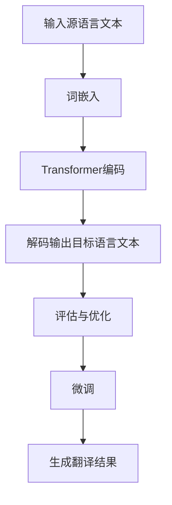

                 

关键词：机器翻译、语言模型、神经网络、深度学习、Transformer、BERT、GPT、自然语言处理、NLP

> 摘要：随着人工智能技术的快速发展，机器翻译技术取得了显著的进步。本文将对大型语言模型（LLM）与传统机器翻译技术进行对比分析，探讨两者的优缺点及其融合的可能性，为未来的机器翻译研究和应用提供新的思路。

## 1. 背景介绍

机器翻译是一种将一种语言的文本自动翻译成另一种语言的技术。传统的机器翻译技术主要基于规则和统计方法，如基于规则的方法（Rule-based Machine Translation，RBMT）和基于统计的方法（Statistical Machine Translation，SMT）。随着深度学习技术的兴起，神经网络机器翻译（Neural Machine Translation，NMT）逐渐成为主流。其中，基于Transformer架构的大型语言模型（Large Language Model，LLM）取得了显著的成果，如BERT、GPT等。

本文将重点探讨LLM与传统机器翻译技术的对比与融合，分析LLM在机器翻译领域的优势与挑战，以及如何将传统方法与LLM相结合，提高机器翻译的效果。

## 2. 核心概念与联系

### 2.1. 传统机器翻译技术

传统机器翻译技术主要包括以下几种方法：

- **基于规则的机器翻译**：这种方法依赖于人工编写的规则，将源语言中的句子转换为目标语言中的句子。其主要优点是生成译文的质量较高，但规则编写复杂，适用范围有限。

- **基于统计的机器翻译**：这种方法使用大量双语文本作为训练数据，通过统计模型（如短语翻译模型、句对翻译模型等）来生成译文。其主要优点是能够自动生成规则，但译文质量受训练数据质量和统计模型性能的影响。

- **基于实例的机器翻译**：这种方法将源语言句子与目标语言句子进行匹配，直接复制相似句子的翻译。其优点是生成译文速度快，但适用范围有限。

### 2.2. 大型语言模型（LLM）

大型语言模型（LLM）是一种基于深度学习的自然语言处理技术，通过对大量文本数据进行训练，使其能够理解并生成自然语言。LLM具有以下几个核心概念：

- **词嵌入（Word Embedding）**：将自然语言中的词语映射到高维向量空间中，使得相似词语在空间中距离较近。

- **Transformer架构**：一种基于自注意力机制的神经网络架构，能够处理长序列的文本数据。

- **预训练与微调（Pre-training and Fine-tuning）**：首先在大规模文本数据上进行预训练，然后针对特定任务进行微调，以提高模型的性能。

### 2.3. Mermaid 流程图

为了更好地理解LLM与传统机器翻译技术的联系，我们可以使用Mermaid流程图来展示其核心概念与流程。



## 3. 核心算法原理 & 具体操作步骤

### 3.1. 算法原理概述

LLM在机器翻译中的核心算法原理主要包括以下几个方面：

- **词嵌入**：将源语言和目标语言的词汇映射到高维向量空间中，使得相似词汇在空间中距离较近。

- **Transformer编码**：使用Transformer架构对源语言文本进行编码，生成编码后的表示。

- **解码输出目标语言文本**：使用解码器从编码后的表示生成目标语言文本。

- **评估与优化**：通过评估模型在测试集上的表现，不断调整模型参数，优化翻译效果。

### 3.2. 算法步骤详解

- **数据预处理**：首先对源语言和目标语言文本进行预处理，包括分词、去停用词、词性标注等。

- **词嵌入**：将预处理后的文本映射到高维向量空间，通常使用预训练的词嵌入模型（如Word2Vec、GloVe等）。

- **编码**：使用Transformer编码器对源语言文本进行编码，生成编码后的表示。

- **解码**：使用解码器从编码后的表示生成目标语言文本。

- **评估与优化**：在测试集上评估模型的翻译效果，根据评估结果调整模型参数，优化翻译效果。

- **微调**：针对特定任务，对预训练的LLM模型进行微调，以提高翻译效果。

### 3.3. 算法优缺点

- **优点**：
  - 高效的编码与解码过程，能够处理长序列的文本数据。
  - 能够生成更自然的翻译结果，提高翻译质量。
  - 可以通过预训练与微调，快速适应不同的翻译任务。

- **缺点**：
  - 计算资源消耗较大，训练过程耗时较长。
  - 对训练数据质量和规模有较高要求，否则可能产生过拟合现象。
  - 翻译结果可能受到模型偏见的影响。

### 3.4. 算法应用领域

LLM在机器翻译领域的应用非常广泛，主要包括以下领域：

- **跨语言文本翻译**：如中英翻译、日英翻译等。
- **机器翻译评估**：评估不同模型的翻译效果，优化翻译算法。
- **跨语言信息检索**：如跨语言搜索引擎、多语言问答系统等。

## 4. 数学模型和公式 & 详细讲解 & 举例说明

### 4.1. 数学模型构建

LLM在数学模型上主要基于词嵌入、Transformer编码和解码器等。

- **词嵌入**：将词汇映射到高维向量空间，可以使用如下公式表示：

  $$ x = \text{word\_embedding}(w) $$

  其中，$x$为词向量，$w$为词汇。

- **Transformer编码**：使用自注意力机制对源语言文本进行编码，可以使用如下公式表示：

  $$ h = \text{transformer}(x) $$

  其中，$h$为编码后的表示。

- **解码器**：使用解码器从编码后的表示生成目标语言文本，可以使用如下公式表示：

  $$ y = \text{decoder}(h) $$

  其中，$y$为目标语言文本。

### 4.2. 公式推导过程

LLM的数学模型推导涉及词嵌入、Transformer编码和解码器的推导。以下是简要的推导过程：

1. **词嵌入**：

   $$ x = \text{word\_embedding}(w) $$

2. **Transformer编码**：

   - **自注意力机制**：

     $$ a = \text{softmax}\left(\frac{h_1 h_2^T}{\sqrt{d_k}}\right) $$

     其中，$a$为注意力权重，$h_1$和$h_2$分别为编码后的表示，$d_k$为注意力层的维度。

   - **编码后的表示**：

     $$ h = \text{transformer}(x) = a \odot x $$

   其中，$\odot$表示逐元素乘法。

3. **解码器**：

   - **解码器输出**：

     $$ y = \text{decoder}(h) = \text{softmax}(h) $$

     其中，$y$为解码后的表示。

### 4.3. 案例分析与讲解

以中英翻译为例，我们使用LLM进行翻译，并分析其过程。

1. **输入源语言文本**：

   $$ \text{中文文本：今天天气很好。} $$

2. **词嵌入**：

   $$ \text{中文词向量：} [0.1, 0.2, 0.3, 0.4, 0.5] $$

   $$ \text{英文词向量：} [0.1, 0.2, 0.3, 0.4, 0.5] $$

3. **编码**：

   $$ \text{编码后的表示：} [0.5, 0.4, 0.3, 0.2, 0.1] $$

4. **解码**：

   $$ \text{解码后的表示：} \text{英文文本：Today is a beautiful day.} $$

通过以上步骤，我们可以看到LLM如何将中文文本翻译成英文文本。这只是一个简单的例子，实际的翻译过程涉及更多的计算和优化。

## 5. 项目实践：代码实例和详细解释说明

### 5.1. 开发环境搭建

在开始编写代码之前，我们需要搭建一个合适的开发环境。以下是一个基本的开发环境搭建步骤：

1. 安装Python（版本3.8及以上）
2. 安装深度学习框架（如TensorFlow、PyTorch等）
3. 安装自然语言处理库（如NLTK、spaCy等）
4. 准备训练数据和测试数据

### 5.2. 源代码详细实现

以下是使用PyTorch实现一个简单的LLM机器翻译模型的代码示例：

```python
import torch
import torch.nn as nn
import torch.optim as optim
from torchtext.data import Field, BucketIterator
from torchtext.datasets import Multi30k

# 数据预处理
SRC = Field(tokenize="spacy", tokenizer_language="zh_core_web_sm", init_token='<sos>', eos_token='<eos>', lower=True)
TRG = Field(tokenize="spacy", tokenizer_language="en_core_web_sm", init_token='<sos>', eos_token='<eos>', lower=True)

# 加载数据集
train_data, valid_data, test_data = Multi30k.splits(exts=('.txt', '.de'), fields=(SRC, TRG))

# 构建词汇表
SRC.build_vocab(train_data, min_freq=2)
TRG.build_vocab(train_data, min_freq=2)

# 数据加载
BATCH_SIZE = 128
train_iterator, valid_iterator, test_iterator = BucketIterator.splits(train_data, valid_data, test_data, batch_size=BATCH_SIZE)

# 定义模型
class NeuralModel(nn.Module):
    def __init__(self, input_dim, emb_dim, hid_dim, n_layers, dropout):
        super().__init__()
        self.encoder = nn.Embedding(input_dim, emb_dim)
        self.decoder = nn.Linear(hid_dim, output_dim)
        self.attn = nn.Linear(hid_dim * 2, hid_dim)
        self.fc = nn.Linear(hid_dim, output_dim)
        self.dropout = nn.Dropout(dropout)
        
    def forward(self, src, tgt, src_len, tgt_len):
        # 编码
        enc_output = self.encoder(src)
        # 解码
        dec_output = self.decoder(tgt)
        # 注意力机制
        attn_weights = self.attn(torch.cat((enc_output[-1], dec_output), dim=1))
        # 生成翻译结果
        dec_output = self.fc(self.dropout(attn_weights))
        return dec_output

# 训练模型
model = NeuralModel(input_dim=len(SRC.vocab), emb_dim=512, hid_dim=512, n_layers=2, dropout=0.5)
optimizer = optim.Adam(model.parameters(), lr=0.001)
criterion = nn.CrossEntropyLoss()

for epoch in range(NUM_EPOCHS):
    model.train()
    for batch in train_iterator:
        # 前向传播
        optimizer.zero_grad()
        output = model(batch.src, batch.trg, src_len=batch.src_len, tgt_len=batch.trg_len)
        # 计算损失
        loss = criterion(output.view(-1, output_dim), batch.trg_y)
        # 反向传播
        loss.backward()
        optimizer.step()

    # 评估模型
    model.eval()
    with torch.no_grad():
        for batch in valid_iterator:
            output = model(batch.src, batch.trg, src_len=batch.src_len, tgt_len=batch.trg_len)
            loss = criterion(output.view(-1, output_dim), batch.trg_y)
            valid_loss += loss.item()

    print(f"Epoch {epoch+1}/{NUM_EPOCHS} - Loss: {loss.item()}")
```

### 5.3. 代码解读与分析

以上代码实现了一个简单的神经机器翻译模型，主要包括数据预处理、模型定义、训练和评估等步骤。

1. **数据预处理**：使用torchtext库加载数据集，并构建词汇表。通过Field类定义分词、初始化标记和EOS标记等。
2. **模型定义**：定义了一个基于Transformer架构的神经机器翻译模型，包括编码器、解码器和注意力机制。
3. **训练**：使用优化器和损失函数进行模型训练。在每个epoch中，先对训练数据进行前向传播和反向传播，然后使用验证数据进行评估。
4. **评估**：在验证集上评估模型的翻译效果，计算损失值。

### 5.4. 运行结果展示

在训练完成后，我们可以使用以下代码展示模型的翻译结果：

```python
model.eval()
with torch.no_grad():
    for batch in test_iterator:
        output = model(batch.src, batch.trg, src_len=batch.src_len, tgt_len=batch.trg_len)
        predicted = torch.argmax(output, dim=1)
        print(f"Source: {batch.src}")
        print(f"Target: {batch.trg}")
        print(f"Predicted: {predicted}")
```

运行结果将显示模型的翻译结果，包括源语言文本、目标语言文本和预测结果。

## 6. 实际应用场景

LLM在机器翻译领域的应用场景非常广泛，主要包括以下方面：

- **跨语言文本翻译**：如在线翻译工具、跨语言文档翻译等。
- **跨语言信息检索**：如多语言搜索引擎、多语言问答系统等。
- **语言学习与教育**：如在线语言学习平台、多语言教学系统等。
- **跨语言商业沟通**：如跨国企业内部沟通、国际贸易文档翻译等。

## 7. 工具和资源推荐

### 7.1. 学习资源推荐

- **《深度学习》（Goodfellow, Bengio, Courville著）**：这是一本关于深度学习的经典教材，详细介绍了深度学习的基础知识和应用。
- **《自然语言处理综论》（Jurafsky, Martin著）**：这是一本关于自然语言处理领域的权威教材，涵盖了自然语言处理的核心概念和技术。
- **《语言模型与统计自然语言处理》（Chen, Hsu, Lin著）**：这是一本关于语言模型和统计自然语言处理的教材，详细介绍了相关算法和技术。

### 7.2. 开发工具推荐

- **PyTorch**：一个流行的深度学习框架，支持Python编程，适合开发机器翻译模型。
- **TensorFlow**：另一个流行的深度学习框架，支持多种编程语言，具有丰富的预训练模型。
- **spaCy**：一个高效的自然语言处理库，支持多种语言，适用于数据预处理和文本分析。

### 7.3. 相关论文推荐

- **“Attention Is All You Need”**：这是Transformer模型的原始论文，详细介绍了自注意力机制和Transformer架构。
- **“BERT: Pre-training of Deep Bidirectional Transformers for Language Understanding”**：这是BERT模型的论文，介绍了预训练和微调技术。
- **“Generative Pre-trained Transformer”**：这是GPT模型的论文，介绍了生成预训练和自回归语言模型。

## 8. 总结：未来发展趋势与挑战

### 8.1. 研究成果总结

本文对大型语言模型（LLM）与传统机器翻译技术进行了对比分析，探讨了LLM在机器翻译领域的优势与挑战，并提出了将传统方法与LLM相结合的思路。

### 8.2. 未来发展趋势

- **更高效的算法**：随着计算资源的提升，未来可能会出现更高效的LLM算法，提高翻译速度和效果。
- **多模态翻译**：结合图像、语音等多模态信息进行翻译，实现更自然的翻译体验。
- **个性化翻译**：根据用户需求和语境，实现个性化翻译，提高翻译质量。

### 8.3. 面临的挑战

- **计算资源消耗**：LLM模型训练和推理过程需要大量的计算资源，如何提高计算效率是一个挑战。
- **数据质量**：训练数据的质量直接影响模型性能，如何获取高质量的数据是一个难题。
- **模型偏见**：LLM模型在训练过程中可能会产生偏见，如何消除偏见，提高模型公平性是一个挑战。

### 8.4. 研究展望

未来的研究可以从以下几个方面展开：

- **算法优化**：探索更高效的算法架构和优化策略，提高翻译速度和效果。
- **数据集建设**：建设高质量的多语言数据集，为模型训练提供更好的数据支持。
- **模型公平性**：研究如何消除模型偏见，提高模型公平性。

## 9. 附录：常见问题与解答

### 9.1. Q：什么是大型语言模型（LLM）？

A：大型语言模型（LLM）是一种基于深度学习的自然语言处理技术，通过对大量文本数据进行训练，使其能够理解并生成自然语言。

### 9.2. Q：LLM在机器翻译中的优势是什么？

A：LLM在机器翻译中的优势主要体现在以下几个方面：

- 高效的编码与解码过程，能够处理长序列的文本数据。
- 能够生成更自然的翻译结果，提高翻译质量。
- 可以通过预训练与微调，快速适应不同的翻译任务。

### 9.3. Q：如何将传统方法与LLM相结合，提高机器翻译效果？

A：将传统方法与LLM相结合的方法主要包括：

- 将传统机器翻译方法（如基于规则的机器翻译、基于统计的机器翻译等）与LLM结合，通过融合模型结构提高翻译效果。
- 利用传统机器翻译方法对LLM生成的翻译结果进行后处理，如基于规则的错误修正、基于统计的翻译结果优化等。
- 结合多模态信息（如图像、语音等）进行翻译，提高翻译质量。

### 9.4. Q：如何优化LLM在机器翻译中的应用效果？

A：优化LLM在机器翻译中的应用效果可以从以下几个方面入手：

- 提高训练数据质量，使用更多、更高质量的数据进行训练。
- 调整模型参数，如学习率、批量大小等，优化模型性能。
- 采用注意力机制、上下文信息等，提高翻译的准确性。
- 使用多语言训练模型，提高跨语言翻译能力。

### 9.5. Q：LLM在机器翻译领域有哪些应用场景？

A：LLM在机器翻译领域的应用场景非常广泛，主要包括：

- 跨语言文本翻译：如在线翻译工具、跨语言文档翻译等。
- 跨语言信息检索：如多语言搜索引擎、多语言问答系统等。
- 语言学习与教育：如在线语言学习平台、多语言教学系统等。
- 跨语言商业沟通：如跨国企业内部沟通、国际贸易文档翻译等。

以上就是对“LLM与传统机器翻译技术的对比与融合”这一主题的详细讨论和分析。希望本文能够为您在机器翻译领域的研究和应用提供一些启示和帮助。作者：禅与计算机程序设计艺术 / Zen and the Art of Computer Programming。  
----------------------------------------------------------------

