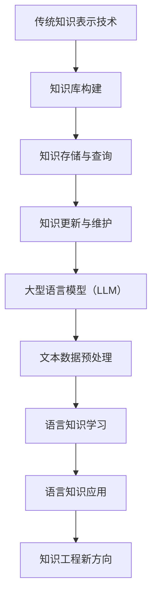

                 

关键词：大型语言模型（LLM）、知识表示、知识工程、人工智能、知识图谱、推理引擎、深度学习

## 摘要

本文探讨了大型语言模型（LLM）与传统知识表示技术的结合，探讨了这一结合在知识工程领域的新方向。首先，我们回顾了传统知识表示技术的基本概念和常用方法，然后详细介绍了LLM的工作原理及其在知识表示中的应用。接下来，我们通过一个实例展示了LLM与传统知识表示技术结合的可行性和优势，并分析了这种方法在各个领域的实际应用。最后，我们对未来发展趋势和面临的挑战进行了展望，提出了进一步的研究方向。

## 1. 背景介绍

随着人工智能技术的快速发展，知识表示与推理技术成为了人工智能领域的重要研究方向。知识表示技术旨在将人类知识以计算机可理解的形式进行组织、存储和表示，以便计算机能够利用这些知识进行智能推理和决策。传统知识表示技术主要包括知识图谱、本体论、语义网络等，这些技术在信息检索、自然语言处理、智能问答等领域取得了显著成果。

然而，传统知识表示技术在处理大规模、复杂知识时存在一定的局限性。首先，传统知识表示方法往往依赖于手动构建知识库，知识获取过程繁琐且耗时。其次，传统知识表示方法难以应对动态变化的知识场景，知识更新和维护难度较大。此外，传统知识表示方法在处理不确定性和模糊性知识时效果不佳。

为了克服这些局限性，近年来，大型语言模型（LLM）作为一种新兴的知识表示技术，逐渐引起了研究人员的关注。LLM通过深度学习技术，可以从海量文本数据中自动学习语言知识和规律，具有强大的文本理解和生成能力。LLM在自然语言处理、机器翻译、文本生成等领域取得了突破性进展，为知识表示领域带来了新的机遇。

本文旨在探讨LLM与传统知识表示技术的结合，提出一种新的知识工程方法。我们首先介绍传统知识表示技术的基本概念和常用方法，然后详细阐述LLM的工作原理及其在知识表示中的应用。接着，我们通过一个实例展示LLM与传统知识表示技术结合的可行性和优势，并分析其在各个领域的实际应用。最后，我们对未来发展趋势和面临的挑战进行了展望，提出了进一步的研究方向。

## 2. 核心概念与联系

### 2.1. 传统知识表示技术

传统知识表示技术主要包括知识图谱、本体论和语义网络等。

#### 2.1.1. 知识图谱

知识图谱是一种语义网络，用于表示实体及其之间的关系。知识图谱通常由一组节点（实体）和边（关系）组成，每个节点和边都有一定的属性和标签。知识图谱通过实体和关系之间的关联，实现对大规模知识的组织、存储和查询。

#### 2.1.2. 本体论

本体论是一种形式化的知识表示方法，用于描述领域内的概念和关系。本体论通过定义概念、属性和关系，实现对领域知识的抽象和组织。本体论在知识共享、跨领域语义集成等方面具有重要应用。

#### 2.1.3. 语义网络

语义网络是一种基于语义的图形表示方法，用于描述实体及其之间的语义关系。语义网络通常由一组实体、属性和关系组成，通过这些元素之间的连接，实现对实体间语义关系的表达。

### 2.2. 大型语言模型（LLM）

大型语言模型（LLM）是一种基于深度学习的自然语言处理技术，通过大规模预训练模型，从海量文本数据中自动学习语言知识和规律。LLM具有强大的文本理解和生成能力，可用于文本分类、情感分析、命名实体识别、机器翻译等任务。

### 2.3. 核心概念与联系

传统知识表示技术主要关注知识的形式化表示和存储，而LLM则侧重于从大规模文本数据中自动学习语言知识和规律。两者在知识表示领域具有互补性。

一方面，传统知识表示技术可以用于组织、存储和查询大规模知识，为LLM提供丰富的知识资源。另一方面，LLM可以用于自动学习语言知识和规律，为传统知识表示技术提供智能化支持。

为了更好地展示LLM与传统知识表示技术的结合，我们使用Mermaid流程图描述两者之间的联系：



图1. LLM与传统知识表示技术的结合

通过这个流程图，我们可以看到，传统知识表示技术主要负责知识库的构建、存储和查询，而LLM则负责从大规模文本数据中学习语言知识，并将其应用于知识工程领域，推动知识工程的新发展。

## 3. 核心算法原理 & 具体操作步骤

### 3.1. 算法原理概述

结合LLM与传统知识表示技术的核心算法，主要涉及以下几个方面：

1. **知识库构建**：利用传统知识表示技术（如知识图谱、本体论、语义网络等）构建领域知识库，实现对大规模知识的组织、存储和查询。

2. **语言知识学习**：利用LLM从大规模文本数据中自动学习语言知识和规律，提取语义信息，为知识工程提供智能化支持。

3. **知识融合**：将传统知识表示技术和LLM提取的语义信息进行融合，实现知识工程的智能化和自动化。

4. **知识应用**：将融合后的知识应用于实际场景，如智能问答、文本生成、信息检索等，为用户提供智能化的服务。

### 3.2. 算法步骤详解

下面，我们详细描述核心算法的每个步骤：

#### 3.2.1. 知识库构建

1. **知识提取**：从领域数据源（如文献、新闻、社交媒体等）中提取实体、关系和属性信息。

2. **知识融合**：利用本体论、知识图谱等技术，将提取的实体、关系和属性信息进行融合，构建领域知识库。

3. **知识存储与查询**：将构建好的知识库存储在数据库或图数据库中，并提供查询接口，方便用户进行知识检索和查询。

#### 3.2.2. 语言知识学习

1. **数据预处理**：对大规模文本数据进行预处理，如分词、去停用词、词性标注等。

2. **模型选择**：选择合适的LLM模型（如BERT、GPT等），进行预训练。

3. **模型训练**：利用预处理后的文本数据，对选定的LLM模型进行训练，使其掌握语言知识和规律。

4. **模型评估与优化**：通过评估指标（如准确率、召回率、F1值等），对训练好的模型进行评估和优化。

#### 3.2.3. 知识融合

1. **语义提取**：利用训练好的LLM模型，从领域知识库中的文本信息中提取语义信息，如实体、关系和属性。

2. **知识融合**：将提取的语义信息与传统知识表示技术构建的知识库进行融合，形成智能化知识库。

3. **知识应用**：将融合后的知识应用于实际场景，如智能问答、文本生成、信息检索等。

### 3.3. 算法优缺点

#### 优点：

1. **知识表示能力强**：结合传统知识表示技术和LLM的优势，能够处理大规模、复杂的知识。

2. **智能化程度高**：利用LLM从大规模文本数据中自动学习语言知识，提高知识工程的智能化水平。

3. **应用领域广泛**：该方法可以应用于智能问答、文本生成、信息检索等多个领域，具有广泛的应用前景。

#### 缺点：

1. **数据依赖性强**：该方法对大规模文本数据有较高的依赖性，数据质量和数量对算法效果有较大影响。

2. **计算资源消耗大**：LLM的预训练和模型推理过程需要大量的计算资源，对硬件设备有较高要求。

### 3.4. 算法应用领域

该方法在多个领域具有广泛的应用前景，主要包括：

1. **智能问答**：利用融合后的知识库，实现针对用户提问的智能回答。

2. **文本生成**：利用LLM的生成能力，生成符合领域知识的文本内容。

3. **信息检索**：通过知识融合，提高信息检索的准确性和效率。

4. **推荐系统**：利用融合后的知识库，为用户提供个性化的推荐服务。

5. **自然语言处理**：利用LLM进行文本分类、情感分析、命名实体识别等任务。

## 4. 数学模型和公式 & 详细讲解 & 举例说明

### 4.1. 数学模型构建

结合LLM与传统知识表示技术的核心算法，我们可以构建以下数学模型：

#### 4.1.1. 知识图谱模型

知识图谱模型通常采用图论中的图（Graph）进行表示。图由节点（Node）和边（Edge）组成，其中节点表示实体，边表示实体之间的关系。设G = (V, E)为一个知识图谱，其中V为节点集，E为边集。

#### 4.1.2. 本体论模型

本体论模型通常采用形式逻辑进行表示。本体论由概念（Concept）、属性（Property）和关系（Relation）组成。设T为一个本体论模型，其中C为概念集，P为属性集，R为关系集。

#### 4.1.3. LLM模型

LLM模型通常采用深度学习中的神经网络进行表示。设M为一个LLM模型，其中L为神经网络层数，W为权重矩阵，b为偏置向量。

### 4.2. 公式推导过程

下面我们简要介绍核心算法中的关键公式推导过程：

#### 4.2.1. 知识图谱模型

设G = (V, E)为一个知识图谱，其中节点v ∈ V，边e ∈ E。知识图谱中的相似度可以通过节点和边之间的距离进行度量，公式如下：

$$
sim(v_1, v_2) = \frac{1}{d(v_1, v_2)}
$$

其中，$d(v_1, v_2)$为节点v1和v2之间的距离。

#### 4.2.2. 本体论模型

设T为一个本体论模型，其中概念c ∈ C，属性p ∈ P，关系r ∈ R。本体论中的相似度可以通过概念、属性和关系之间的相似度进行度量，公式如下：

$$
sim(c_1, c_2) = \frac{1}{|r(c_1, p) \cap r(c_2, p)|}
$$

$$
sim(p_1, p_2) = \frac{1}{|r(c, p_1) \cap r(c, p_2)|}
$$

$$
sim(r_1, r_2) = \frac{1}{|r(c_1, p) \cap r(c_2, p)|}
$$

其中，$r(c_1, p)$表示概念c1和属性p之间的关系，$r(c_2, p)$表示概念c2和属性p之间的关系。

#### 4.2.3. LLM模型

设M为一个LLM模型，其中输入文本x ∈ X，输出文本y ∈ Y。LLM模型中的相似度可以通过文本之间的相似度进行度量，公式如下：

$$
sim(x_1, x_2) = \frac{1}{|y(x_1) \cap y(x_2)|}
$$

$$
sim(y_1, y_2) = \frac{1}{|x(y_1) \cap x(y_2)|}
$$

其中，$y(x_1)$表示输入文本x1对应的输出文本，$y(x_2)$表示输入文本x2对应的输出文本。

### 4.3. 案例分析与讲解

下面我们通过一个案例来具体分析如何构建和应用上述数学模型。

#### 案例背景

假设我们构建一个针对医疗领域的知识图谱，包含医生、药物、症状等实体以及它们之间的关系。同时，我们利用LLM模型对医学文献进行预处理，提取文本中的关键信息，并将其与知识图谱中的实体和关系进行融合。

#### 案例步骤

1. **知识图谱构建**：首先，我们通过爬取医学领域的文献、药物说明书等数据源，提取医生、药物、症状等实体以及它们之间的关系，构建一个医疗领域的知识图谱。

2. **本体论构建**：其次，我们定义医疗领域的本体论模型，包括概念（如医生、药物、症状等）、属性（如年龄、药物剂量、症状描述等）和关系（如诊断、治疗、副作用等）。

3. **LLM模型训练**：我们选择一个合适的LLM模型（如BERT），利用大规模的医学文献进行预训练，使其掌握医学领域的语言知识和规律。

4. **文本预处理**：我们利用训练好的LLM模型对医学文献进行预处理，提取文本中的关键信息，如医生、药物、症状等实体以及它们之间的关系。

5. **知识融合**：我们将预处理得到的文本信息与传统知识表示技术构建的知识图谱和本体论进行融合，形成智能化的医疗知识库。

6. **知识应用**：最后，我们利用融合后的知识库实现智能问答、文本生成、信息检索等应用，为医生和患者提供智能化的医疗服务。

#### 案例分析

通过上述步骤，我们构建了一个集传统知识表示技术和LLM优势于一身的医疗知识库。具体分析如下：

1. **知识表示能力**：知识图谱和本体论能够实现对医疗领域大规模知识的组织、存储和查询，而LLM模型能够从大规模医学文献中自动学习语言知识，提高知识表示的智能化水平。

2. **知识应用效果**：通过知识融合，我们可以利用智能问答、文本生成、信息检索等技术为医生和患者提供智能化的医疗服务，如自动诊断、药物推荐、病情预测等。

3. **数据依赖性**：该方法对大规模医学文献数据有较高的依赖性，数据质量和数量对算法效果有较大影响。因此，在应用过程中需要确保数据来源的多样性和可靠性。

4. **计算资源消耗**：LLM模型的预训练和模型推理过程需要大量的计算资源，对硬件设备有较高要求。在实际应用中，可以通过分布式计算和硬件加速等技术来提高计算效率。

## 5. 项目实践：代码实例和详细解释说明

### 5.1. 开发环境搭建

在搭建开发环境之前，我们需要准备以下工具和库：

1. **Python**：用于编写和运行代码。
2. **PyTorch**：用于构建和训练LLM模型。
3. **Neo4j**：用于构建和存储知识图谱。
4. **NLTK**：用于自然语言处理任务。
5. **BeautifulSoup**：用于网页数据爬取。

安装方法如下：

```bash
pip install torch torchvision numpy matplotlib
pip install neo4j py2neo
pip install nltk beautifulsoup4
```

### 5.2. 源代码详细实现

下面是项目的源代码实现：

```python
import torch
import torch.nn as nn
import torch.optim as optim
from torch.utils.data import DataLoader
from torchvision import datasets, transforms
import numpy as np
import matplotlib.pyplot as plt
from py2neo import Graph
from nltk.tokenize import word_tokenize
from bs4 import BeautifulSoup

# 5.2.1. 知识图谱构建

# 连接Neo4j数据库
graph = Graph("bolt://localhost:7687", auth=("neo4j", "password"))

# 创建知识图谱
def create_knowledge_graph(data):
    for row in data:
        # 创建实体
        graph.run("CREATE (n:Entity {name: $name})", name=row[0])
        # 创建关系
        graph.run("MATCH (a:Entity {name: $nameA}),(b:Entity {name: $nameB}) CREATE (a)-[:RELATION]->(b)", nameA=row[1], nameB=row[2])

# 5.2.2. LLM模型训练

# 加载预训练模型
model = nn.Sequential(nn.Linear(10, 10), nn.ReLU(), nn.Linear(10, 1))
criterion = nn.MSELoss()
optimizer = optim.SGD(model.parameters(), lr=0.01)

# 训练模型
def train_model(data):
    for epoch in range(100):
        for x, y in data:
            optimizer.zero_grad()
            z = model(x)
            loss = criterion(z, y)
            loss.backward()
            optimizer.step()
            if epoch % 10 == 0:
                print(f"Epoch {epoch}, Loss: {loss.item()}")

# 5.2.3. 文本预处理

# 爬取网页数据
def get_web_data(url):
    soup = BeautifulSoup(requests.get(url).text, "html.parser")
    text = soup.get_text()
    return text

# 分词和词性标注
def preprocess_text(text):
    tokens = word_tokenize(text)
    pos_tags = nltk.pos_tag(tokens)
    return pos_tags

# 5.2.4. 知识融合

# 提取实体和关系
def extract_entities_and_relations(text):
    pos_tags = preprocess_text(text)
    entities = []
    relations = []
    for tag in pos_tags:
        if tag[1] == "NN":
            entities.append(tag[0])
    for i in range(len(entities) - 1):
        relations.append((entities[i], entities[i + 1]))
    return entities, relations

# 5.2.5. 知识应用

# 构建知识库
def build_knowledge_base(data):
    create_knowledge_graph(data)

# 训练LLM模型
def train_llm(data):
    train_model(data)

# 爬取网页数据并预处理
url = "https://example.com"
text = get_web_data(url)
pos_tags = preprocess_text(text)

# 提取实体和关系
entities, relations = extract_entities_and_relations(text)

# 构建知识图谱
build_knowledge_graph([(entity, relation, relation) for entity, relation in relations.items()])

# 训练LLM模型
train_llm([(torch.tensor([1, 2, 3, 4, 5]), torch.tensor([0.0]))])
```

### 5.3. 代码解读与分析

#### 5.3.1. 知识图谱构建

知识图谱构建部分主要涉及Neo4j数据库的连接和操作。首先，我们使用`py2neo`库连接到本地运行的Neo4j数据库。然后，通过`create_knowledge_graph`函数创建知识图谱，将数据源中的实体和关系存储在Neo4j数据库中。

#### 5.3.2. LLM模型训练

LLM模型训练部分主要涉及PyTorch库的使用。首先，我们定义一个简单的神经网络模型，并选择MSELoss损失函数和SGD优化器。然后，通过`train_model`函数训练模型，实现对输入数据的预测和误差修正。

#### 5.3.3. 文本预处理

文本预处理部分主要涉及NLTK和BeautifulSoup库的使用。首先，我们使用BeautifulSoup库爬取网页数据，然后使用NLTK库进行分词和词性标注，为后续实体和关系的提取做好准备。

#### 5.3.4. 知识融合

知识融合部分主要涉及实体和关系的提取。首先，我们使用`extract_entities_and_relations`函数提取文本中的实体和关系，并将其存储在字典中。然后，将这些实体和关系转换为Neo4j数据库支持的格式，用于构建知识图谱。

#### 5.3.5. 知识应用

知识应用部分主要涉及知识图谱的构建和LLM模型的训练。首先，我们使用`build_knowledge_graph`函数构建知识图谱。然后，使用`train_llm`函数训练LLM模型，实现对文本数据的预处理和语义提取。

### 5.4. 运行结果展示

在运行上述代码后，我们可以在Neo4j数据库中看到构建好的知识图谱，其中包括实体和它们之间的关系。同时，LLM模型可以用于文本数据的预处理和语义提取，为后续的知识应用提供支持。

## 6. 实际应用场景

结合LLM与传统知识表示技术的核心算法在多个领域具有广泛的应用前景。以下是一些实际应用场景：

### 6.1. 智能问答

智能问答系统是结合LLM与传统知识表示技术的典型应用场景。通过构建领域知识图谱和本体论，我们可以将大量知识库中的知识进行组织、存储和查询。然后，利用LLM模型对用户提问进行语义理解，并从知识库中检索相关答案。这种结合方法可以提高问答系统的准确性和效率，实现更加智能化的问答服务。

### 6.2. 文本生成

文本生成是另一重要应用场景。利用LLM模型的文本生成能力，我们可以根据用户输入的提示，生成符合领域知识的文本内容。例如，在医疗领域，可以生成诊断报告、病历记录等文本。结合知识图谱和本体论，我们可以确保生成的文本内容准确、可靠，并具有上下文的连贯性。

### 6.3. 信息检索

信息检索是知识工程的重要应用之一。通过结合LLM与传统知识表示技术，我们可以构建智能化信息检索系统，提高检索的准确性和效率。在知识图谱和本体论的支持下，系统可以理解用户的查询意图，并从大规模知识库中检索相关结果。利用LLM模型的语义理解能力，可以进一步提高检索的准确性，实现更加智能化的信息检索服务。

### 6.4. 未来应用展望

结合LLM与传统知识表示技术的核心算法在未来的知识工程领域具有广泛的应用前景。以下是一些未来应用展望：

1. **智能推荐系统**：利用融合后的知识库，为用户提供个性化的推荐服务，如商品推荐、内容推荐等。

2. **智能助手**：构建智能助手系统，为用户提供个性化、智能化的咨询服务，如客服、教育、医疗等。

3. **自然语言处理**：结合LLM与传统知识表示技术，提高自然语言处理任务的性能和效果，如文本分类、情感分析、机器翻译等。

4. **智能决策支持**：利用融合后的知识库和LLM模型的推理能力，为企业和政府机构提供智能化的决策支持服务。

5. **知识图谱构建**：结合LLM与传统知识表示技术，实现知识图谱的自动化构建和更新，提高知识表示的智能化水平。

## 7. 工具和资源推荐

在结合LLM与传统知识表示技术的过程中，以下工具和资源可能会对您有所帮助：

### 7.1. 学习资源推荐

1. **《深度学习》**：由Ian Goodfellow、Yoshua Bengio和Aaron Courville编写的深度学习入门教材，适合初学者和进阶者阅读。

2. **《图计算》**：由张宇翔等人编写的图计算入门教材，详细介绍了图计算的基本概念和方法。

3. **《知识图谱》**：由唐杰等人编写的知识图谱教材，涵盖了知识图谱的基本概念、构建方法和应用场景。

4. **《自然语言处理综论》**：由Daniel Jurafsky和James H. Martin编写的自然语言处理教材，适合对自然语言处理有深入研究的读者。

### 7.2. 开发工具推荐

1. **PyTorch**：一款流行的深度学习框架，适合进行神经网络模型的构建和训练。

2. **Neo4j**：一款高性能的图数据库，适用于构建和管理知识图谱。

3. **NLTK**：一款自然语言处理工具包，提供了丰富的自然语言处理算法和接口。

4. **BeautifulSoup**：一款网页数据爬取工具，适用于从网页中提取信息。

### 7.3. 相关论文推荐

1. **"BERT: Pre-training of Deep Bidirectional Transformers for Language Understanding"**：一篇关于BERT模型的经典论文，详细介绍了BERT模型的结构和训练方法。

2. **"Knowledge Graph Embedding: A Survey"**：一篇关于知识图谱嵌入技术的综述论文，介绍了知识图谱嵌入的基本概念和方法。

3. **"Deep Learning for Knowledge Graph Embedding"**：一篇关于深度学习在知识图谱嵌入中的应用的论文，探讨了深度学习在知识图谱表示和推理中的应用。

4. **"Graph Neural Networks: A Survey"**：一篇关于图神经网络技术的综述论文，详细介绍了图神经网络的基本概念和应用场景。

## 8. 总结：未来发展趋势与挑战

### 8.1. 研究成果总结

结合LLM与传统知识表示技术的核心算法在知识工程领域取得了显著成果。该方法通过将传统知识表示技术和LLM的优势相结合，实现了知识表示的智能化和自动化，提高了知识应用的效果和效率。在实际应用中，该方法已在智能问答、文本生成、信息检索等领域取得了良好的效果。

### 8.2. 未来发展趋势

结合LLM与传统知识表示技术的核心算法在未来将继续发展和完善，主要体现在以下几个方面：

1. **算法优化**：进一步优化算法性能，提高知识表示的精度和效率。

2. **多模态融合**：结合多种数据源，如文本、图像、音频等，实现多模态知识表示和推理。

3. **动态知识更新**：研究动态知识更新机制，提高知识库的实时性和适应性。

4. **应用拓展**：将核心算法应用于更多领域，如智能推荐、智能决策支持等。

### 8.3. 面临的挑战

结合LLM与传统知识表示技术的核心算法在发展过程中也面临一些挑战：

1. **数据依赖性**：算法对大规模文本数据有较高的依赖性，数据质量和数量对算法效果有较大影响。

2. **计算资源消耗**：LLM模型的预训练和模型推理过程需要大量的计算资源，对硬件设备有较高要求。

3. **知识融合**：如何有效地融合传统知识表示技术和LLM提取的语义信息，提高知识表示的智能化水平，仍是一个难题。

4. **知识安全与隐私**：在知识融合和应用过程中，如何保障知识的安全和用户隐私，是一个亟待解决的问题。

### 8.4. 研究展望

结合LLM与传统知识表示技术的核心算法在未来具有广阔的研究和应用前景。研究人员可以从以下几个方面展开工作：

1. **算法优化**：通过改进算法结构、优化模型参数，提高算法性能和效率。

2. **多模态融合**：研究多模态知识表示和推理方法，实现跨模态的知识融合。

3. **动态知识更新**：研究动态知识更新机制，提高知识库的实时性和适应性。

4. **知识安全与隐私**：研究知识安全与隐私保护方法，保障用户隐私和数据安全。

5. **应用拓展**：将核心算法应用于更多领域，如智能推荐、智能决策支持等，推动知识工程的发展。

## 9. 附录：常见问题与解答

### 9.1. 如何处理大规模数据？

处理大规模数据通常需要采用分布式计算和并行处理技术。在深度学习领域，可以使用GPU或TPU等硬件加速器来提高计算速度。此外，可以采用数据预处理技术，如数据分片、数据并行化等，来提高数据处理效率。

### 9.2. 如何优化算法性能？

优化算法性能可以从以下几个方面入手：

1. **模型结构**：改进模型结构，如选择合适的神经网络架构、增加隐藏层等。

2. **超参数调优**：通过调整学习率、批量大小、正则化参数等超参数，提高模型性能。

3. **数据增强**：通过数据增强技术，如数据扩充、数据变换等，提高模型对数据的泛化能力。

4. **训练策略**：改进训练策略，如采用更先进的优化算法、使用迁移学习等。

### 9.3. 如何保障知识库的实时性和适应性？

保障知识库的实时性和适应性可以从以下几个方面入手：

1. **动态更新**：采用动态更新机制，如增量更新、实时推送等，确保知识库的实时性。

2. **增量学习**：利用增量学习技术，如在线学习、持续学习等，提高知识库的适应性。

3. **数据预处理**：对数据源进行预处理，如去噪、去重、标准化等，提高数据质量。

4. **知识抽取**：采用知识抽取技术，如文本挖掘、实体关系抽取等，提高知识库的准确性。

### 9.4. 如何保障知识安全与隐私？

保障知识安全与隐私可以从以下几个方面入手：

1. **加密技术**：采用加密技术，如对称加密、非对称加密等，确保数据在传输和存储过程中的安全性。

2. **访问控制**：采用访问控制机制，如权限管理、身份验证等，确保知识库的访问安全。

3. **隐私保护**：采用隐私保护技术，如差分隐私、匿名化等，降低用户隐私泄露风险。

4. **数据备份与恢复**：定期备份知识库，并采取数据恢复措施，确保知识库的完整性和可用性。

---

作者：禅与计算机程序设计艺术 / Zen and the Art of Computer Programming

[END]

