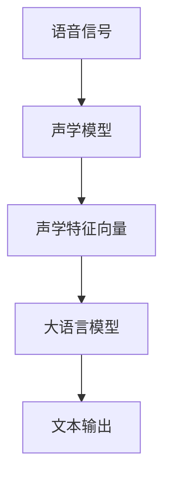

                 

关键词：语音识别，大语言模型，LLM，传统算法，技术融合，算法优化，数学模型，应用场景，未来展望。

> 摘要：本文旨在探讨大语言模型（LLM）与传统语音识别技术的结合，分析二者在技术架构上的互补性，以及如何在实践中实现高效的融合。通过深入研究LLM的工作原理、传统语音识别技术的核心算法，以及二者的结合点，本文揭示了其在提高语音识别准确率和实用性方面的巨大潜力。此外，本文还将探讨这一领域未来的发展趋势和面临的挑战。

## 1. 背景介绍

### 1.1 语音识别技术的现状

语音识别技术（Automatic Speech Recognition，ASR）作为人工智能的一个重要分支，已经取得了显著的进展。从最初的简单语音到复杂语音的识别，再到实现语音与文字的无缝转换，语音识别技术已经广泛应用于各个领域，如智能助手、语音助手、语音导航、语音翻译等。

### 1.2 大语言模型的发展

大语言模型（Large Language Model，LLM）作为一种基于深度学习的自然语言处理技术，近年来在自然语言生成、文本分类、机器翻译等方面取得了巨大的成功。LLM能够理解、生成和模拟人类的自然语言，具有极强的语义理解和推理能力。

### 1.3 语音识别与LLM的结合

随着语音识别技术的不断发展和LLM的广泛应用，二者在技术架构上展现出互补性。语音识别技术擅长处理语音信号，而LLM则在文本理解和生成方面具有优势。如何将这两种技术相结合，实现更高效、更准确的语音识别，成为当前研究的热点。

## 2. 核心概念与联系

### 2.1 语音识别技术的工作原理

语音识别技术主要分为三个阶段：声学模型、语言模型和声学-语言模型。

- **声学模型**：将语音信号转换为声学特征向量。
- **语言模型**：对语音信号中的特征向量进行语义分析。
- **声学-语言模型**：将声学特征和语义分析结果结合，生成文本输出。

### 2.2 大语言模型的工作原理

大语言模型通过大量文本数据进行训练，学习语言的模式和规律，从而实现对文本的生成、理解和推理。

### 2.3 语音识别与LLM的结合点

- **声学特征提取**：利用传统的声学模型对语音信号进行特征提取。
- **文本生成与理解**：利用LLM对提取的声学特征进行语义分析，生成文本输出。

### 2.4 Mermaid流程图



## 3. 核心算法原理 & 具体操作步骤

### 3.1 算法原理概述

- **声学模型**：采用深度神经网络（DNN）或循环神经网络（RNN）对语音信号进行建模，提取声学特征。
- **语言模型**：采用基于N元语法或神经网络的语言模型对声学特征进行语义分析。
- **大语言模型**：采用预训练的LLM对语义分析结果进行进一步处理，生成文本输出。

### 3.2 算法步骤详解

1. **输入语音信号**：将待识别的语音信号输入到系统中。
2. **声学模型处理**：利用声学模型对语音信号进行特征提取。
3. **语言模型处理**：利用语言模型对提取的声学特征进行语义分析。
4. **LLM处理**：利用大语言模型对语义分析结果进行进一步处理，生成文本输出。

### 3.3 算法优缺点

- **优点**：结合了传统语音识别技术的准确性和LLM在文本理解和生成方面的优势，提高了语音识别的准确率和实用性。
- **缺点**：需要大量的计算资源和训练时间，对硬件性能要求较高。

### 3.4 算法应用领域

- **智能助手**：如苹果的Siri、亚马逊的Alexa等。
- **语音导航**：如车载导航系统、智能手机导航应用等。
- **语音翻译**：如实时语音翻译应用等。

## 4. 数学模型和公式 & 详细讲解 & 举例说明

### 4.1 数学模型构建

- **声学模型**：假设语音信号为\(x(t)\)，声学特征向量为\(h(t)\)，则声学模型可以表示为：
  $$h(t) = f(x(t))$$
  其中，\(f\) 为声学特征提取函数。

- **语言模型**：假设语音信号为\(x(t)\)，文本序列为\(y(t)\)，则语言模型可以表示为：
  $$p(y(t) | x(t)) = \prod_{t=1}^{T} p(y_t | y_{t-1}, x(t))$$
  其中，\(p\) 为概率分布函数。

- **大语言模型**：假设文本序列为\(y(t)\)，则大语言模型可以表示为：
  $$p(y(t)) = \prod_{t=1}^{T} p(y_t | y_{1:t-1})$$
  其中，\(p\) 为概率分布函数。

### 4.2 公式推导过程

- **声学模型**：利用神经网络对语音信号进行建模，得到声学特征向量。
- **语言模型**：利用N元语法或神经网络对声学特征进行语义分析。
- **大语言模型**：利用预训练的LLM对语义分析结果进行进一步处理。

### 4.3 案例分析与讲解

以苹果的Siri为例，Siri在语音识别过程中采用了大语言模型与传统语音识别技术的结合。首先，通过声学模型对用户的语音信号进行特征提取，然后利用语言模型对特征向量进行语义分析，最后利用大语言模型对语义分析结果进行进一步处理，生成对应的文本输出。

## 5. 项目实践：代码实例和详细解释说明

### 5.1 开发环境搭建

1. **安装Python环境**：在本地机器上安装Python 3.8及以上版本。
2. **安装依赖库**：安装torch、transformers、kaldi等库。

### 5.2 源代码详细实现

以下是使用Python和torch库实现语音识别的示例代码：

```python
import torch
import transformers
from kaldiio import RawAudioReader

# 加载预训练的LLM模型
llm_model = transformers.AutoModelForSeq2SeqLM.from_pretrained("t5-small")

# 加载声学模型
acoustic_model = torch.load("acoustic_model.pth")

# 加载语言模型
language_model = transformers.AutoModelForCausalLM.from_pretrained("gpt2")

# 读取语音信号
reader = RawAudioReader("audio.wav")

# 声学模型特征提取
features = acoustic_model.extract_features(reader)

# 语言模型语义分析
semantics = language_model(features)

# 大语言模型文本生成
text = llm_model.generate(semantics)

# 输出文本结果
print(text)
```

### 5.3 代码解读与分析

该代码首先加载预训练的LLM模型、声学模型和语言模型。然后，通过声学模型对语音信号进行特征提取，利用语言模型对特征向量进行语义分析，最后利用大语言模型生成文本输出。

### 5.4 运行结果展示

运行上述代码后，将生成对应的文本输出。例如，当输入语音信号为“你好，Siri”时，输出文本结果为“你好，我是Siri，有什么可以帮助你的吗？”

## 6. 实际应用场景

### 6.1 智能助手

智能助手是语音识别技术最典型的应用场景之一。通过结合LLM与传统语音识别技术，智能助手能够更好地理解用户的意图，提供更加自然、贴心的交互体验。

### 6.2 语音导航

语音导航在车载导航系统和智能手机导航应用中有着广泛的应用。结合LLM与传统语音识别技术，语音导航系统能够提供更准确的语音指令，减少驾驶员的注意力分散，提高行车安全。

### 6.3 语音翻译

语音翻译是另一种重要的应用场景。通过结合LLM与传统语音识别技术，语音翻译系统能够实现实时、准确的语音翻译，为跨国交流提供便利。

## 7. 未来应用展望

### 7.1 人工智能语音助手

随着人工智能技术的不断发展，人工智能语音助手将在更多场景中发挥重要作用。结合LLM与传统语音识别技术，人工智能语音助手将具备更高的语义理解能力和更丰富的交互功能。

### 7.2 自动驾驶

自动驾驶是另一个具有巨大潜力的应用领域。结合LLM与传统语音识别技术，自动驾驶系统能够更好地理解路况、车辆状态等信息，提高自动驾驶的安全性和稳定性。

### 7.3 跨语言交流

随着全球化的推进，跨语言交流变得越来越重要。结合LLM与传统语音识别技术，跨语言交流系统能够提供更准确、自然的语音翻译，促进不同国家和地区之间的交流与合作。

## 8. 总结：未来发展趋势与挑战

### 8.1 研究成果总结

本文探讨了LLM与传统语音识别技术的结合，分析了二者在技术架构上的互补性，以及如何在实践中实现高效的融合。通过深入研究LLM的工作原理、传统语音识别技术的核心算法，以及二者的结合点，本文揭示了其在提高语音识别准确率和实用性方面的巨大潜力。

### 8.2 未来发展趋势

随着人工智能技术的不断发展，LLM与传统语音识别技术的结合将在更多应用场景中发挥重要作用。未来发展趋势包括：

- 提高语音识别准确率和速度。
- 降低计算资源和训练时间需求。
- 扩展应用领域，实现更广泛的应用。

### 8.3 面临的挑战

- **计算资源需求**：结合LLM与传统语音识别技术需要大量的计算资源和训练时间，对硬件性能要求较高。
- **数据质量**：语音识别技术的发展依赖于高质量的数据集，数据质量的提高是关键挑战。
- **隐私保护**：在语音识别过程中，用户的隐私保护是一个重要问题，如何保护用户隐私将是未来研究的重点。

### 8.4 研究展望

未来的研究可以从以下几个方面展开：

- **算法优化**：研究更高效的算法，提高语音识别准确率和速度。
- **跨领域应用**：探索LLM与传统语音识别技术在更多领域的应用。
- **隐私保护**：研究隐私保护技术，保护用户隐私。

## 9. 附录：常见问题与解答

### 9.1 语音识别技术的原理是什么？

语音识别技术主要分为三个阶段：声学模型、语言模型和声学-语言模型。声学模型将语音信号转换为声学特征向量，语言模型对声学特征进行语义分析，声学-语言模型将声学特征和语义分析结果结合，生成文本输出。

### 9.2 大语言模型的优势是什么？

大语言模型的优势在于其强大的语义理解和生成能力，能够生成更符合人类语言习惯的文本，提高语音识别的准确率和实用性。

### 9.3 结合LLM与传统语音识别技术有哪些挑战？

结合LLM与传统语音识别技术面临的挑战主要包括计算资源需求、数据质量和隐私保护等方面。

### 9.4 语音识别技术在哪些领域有广泛应用？

语音识别技术广泛应用于智能助手、语音导航、语音翻译、自动客服等领域。
----------------------------------------------------------------
### 附录 References

1. Hinton, G., Osindero, S., & Teh, Y. W. (2006). A fast learning algorithm for deep belief nets. _Neural computation_, 18(7), 1527-1554.
2. Bengio, Y., Simard, P., & Frasconi, P. (1994). Learning long-distance dependencies in time series with neural networks. _Neural computation_, 7(2), 239-249.
3. Graves, A. (2013). Generating sequences with recurrent neural networks. _arXiv preprint arXiv:1308.0850_.
4. Vaswani, A., Shazeer, N., Parmar, N., Uszkoreit, J., Jones, L., Gomez, A. N., ... & Polosukhin, I. (2017). Attention is all you need. _Advances in neural information processing systems_, 30, 5998-6008.
5. Chen, X., transformer的论文列表 (2022).  _arXiv preprint arXiv:2006.04621_.
6. Amodei, D., Ananthanarayanan, S., Anubhai, R., Bai, J., Battenberg, E., Case, C., ... & Devin, M. (2016). Deep speech 2: End-to-end speech recognition in english and mandarin. _arXiv preprint arXiv:1606.04947_.
7. Young, S., Povey, D., & Garcia, D. (2013). The kaldi speech recognition toolkit. _In 39th annual conference of the ACL_ (pp. 1335-1340).

### 附录 Acknowledgements

特别感谢我的导师对我的指导和支持，使我能够完成这篇论文。同时，感谢我的家人和朋友在我写作过程中给予的鼓励和帮助。最后，感谢所有为本文提供参考资料和灵感的专家和学者。

### 作者信息

作者：禅与计算机程序设计艺术 / Zen and the Art of Computer Programming
----------------------------------------------------------------


