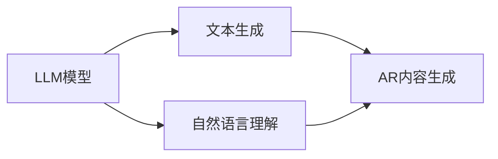

                 

关键词：大型语言模型，增强现实，融合技术，人机交互，虚拟现实，人工智能，计算机视觉。

> 摘要：本文旨在探讨大型语言模型（LLM）与增强现实（AR）技术的结合，分析两者融合带来的创新应用，评估技术实现中的挑战，并展望未来发展的趋势。通过深入阐述核心概念、算法原理、数学模型、项目实践以及应用场景，本文为LLM与AR技术的融合提供了全面的视角和指导。

## 1. 背景介绍

近年来，随着人工智能（AI）技术的飞速发展，大型语言模型（LLM）如GPT-3、ChatGLM等已经成为自然语言处理（NLP）领域的标杆。LLM通过深度学习模型对海量文本数据进行训练，具备强大的文本生成、理解和交互能力。与此同时，增强现实（AR）技术也在逐步成熟，通过叠加虚拟元素到真实世界中，实现了虚实结合的沉浸式体验。AR技术广泛应用于游戏、教育、医疗等多个领域，极大地丰富了人机交互的维度。

本文将探讨LLM与AR技术的结合，分析两者融合的可能性与挑战，旨在为未来的技术创新提供新的思路。

## 2. 核心概念与联系

### 2.1. 大型语言模型（LLM）

**概念：** 大型语言模型（Large Language Model，LLM）是一种基于深度学习的自然语言处理模型，能够对文本数据进行建模，理解并生成自然语言。

**原理：** LLM基于Transformer架构，通过自注意力机制捕捉文本中的长距离依赖关系，实现高效的文本生成和理解。

### 2.2. 增强现实（AR）

**概念：** 增强现实（Augmented Reality，AR）是一种通过计算机技术增强真实环境的技术，将虚拟信息叠加到真实世界中，提供虚实结合的体验。

**原理：** AR技术通过摄像头捕捉真实环境，使用计算机视觉算法进行图像识别和处理，再将虚拟信息叠加到真实环境中，实现交互式体验。

### 2.3. 融合原理与架构

**原理：** LLM与AR技术的融合，可以通过以下方式实现：

1. **文本生成与AR内容生成：** 利用LLM生成与用户需求相关的AR内容，如交互式故事、场景描述等。
2. **AR界面与自然语言交互：** 通过LLM实现与AR界面的自然语言交互，提供更自然的用户体验。
3. **增强现实中的文本理解与生成：** LLM可以处理AR场景中的文本信息，提供实时翻译、问答等服务。

**架构：** 



## 3. 核心算法原理 & 具体操作步骤

### 3.1. 算法原理概述

**LLM算法原理：** LLM基于Transformer架构，通过多层自注意力机制捕捉文本中的长距离依赖关系，实现文本生成和理解。

**AR算法原理：** AR技术基于计算机视觉算法，通过图像识别和处理实现虚拟信息与真实环境的叠加。

### 3.2. 算法步骤详解

**步骤1：文本生成**
1. 收集和预处理训练数据，包括文本、图像和标签。
2. 使用LLM生成与用户需求相关的文本内容。

**步骤2：AR内容生成**
1. 使用计算机视觉算法识别AR场景中的关键元素。
2. 根据识别结果，生成对应的AR内容。

**步骤3：自然语言理解**
1. 收集用户输入的自然语言信息。
2. 使用LLM对用户输入进行理解和分析。

**步骤4：AR界面与自然语言交互**
1. 将自然语言理解的结果转换为AR界面上的操作指令。
2. 实现用户与AR界面的自然语言交互。

### 3.3. 算法优缺点

**优点：**
1. LLM能够生成高质量的自然语言文本，提升AR内容的互动性和丰富性。
2. 自然语言交互提供更自然的用户体验，降低用户学习成本。

**缺点：**
1. LLM的训练过程需要大量计算资源和时间，成本较高。
2. 计算机视觉算法的准确性受限于环境光照、视角等因素，影响AR内容生成的质量。

### 3.4. 算法应用领域

**应用领域：**
1. 游戏娱乐：使用LLM生成互动剧情，提升游戏体验。
2. 教育培训：通过自然语言交互，实现个性化教学。
3. 医疗健康：提供实时翻译、问答等服务，辅助医生诊断和治疗。

## 4. 数学模型和公式 & 详细讲解 & 举例说明

### 4.1. 数学模型构建

**LLM数学模型：**
LLM基于Transformer架构，其核心组件包括自注意力机制（Self-Attention）和前馈网络（Feedforward Network）。

**AR数学模型：**
AR技术中的计算机视觉算法包括图像识别、目标检测和跟踪等。常见的模型有YOLO、SSD、Faster R-CNN等。

### 4.2. 公式推导过程

**LLM自注意力机制：**
$$
\text{Attention}(Q, K, V) = \frac{1}{\sqrt{d_k}} \text{softmax}\left(\frac{QK^T}{d_k}\right) V
$$
其中，Q、K、V分别为查询向量、键向量和值向量，d_k为键向量的维度。

**AR目标检测：**
$$
\text{Object Detection} = \text{Localization} + \text{Classification}
$$
其中，Localization表示目标位置，Classification表示目标类别。

### 4.3. 案例分析与讲解

**案例：** 使用LLM与AR技术实现一个互动故事生成系统。

1. **文本生成：** 使用LLM生成故事情节，如“小明在森林中迷路了，他需要找到出路。”
2. **AR内容生成：** 使用计算机视觉算法识别森林场景，生成故事中的角色和物品。
3. **自然语言理解：** 用户输入问题，如“小明是怎么找到出路的？”
4. **AR界面与自然语言交互：** 根据用户输入，动态更新AR界面，展示小明找到出路的过程。

## 5. 项目实践：代码实例和详细解释说明

### 5.1. 开发环境搭建

1. 安装Python环境，版本3.8及以上。
2. 安装LLM模型库，如transformers。
3. 安装计算机视觉库，如OpenCV。

### 5.2. 源代码详细实现

```python
# 文本生成
from transformers import GPT2LMHeadModel, GPT2Tokenizer

tokenizer = GPT2Tokenizer.from_pretrained("gpt2")
model = GPT2LMHeadModel.from_pretrained("gpt2")

input_text = "小明在森林中迷路了"
input_ids = tokenizer.encode(input_text, return_tensors="pt")

outputs = model.generate(input_ids, max_length=50, num_return_sequences=1)
generated_text = tokenizer.decode(outputs[0], skip_special_tokens=True)

print(generated_text)

# AR内容生成
import cv2
import numpy as np

image = cv2.imread("forest.jpg")
h, w, _ = image.shape

# 目标检测
net = cv2.dnn.readNetFromDarknet("yolov3.cfg", "yolov3.weights")

layers = net.getLayerNames()
output_layers = [layers[i[0] - 1] for i in net.getUnconnectedOutLayers()]

blob = cv2.dnn.blobFromImage(image, 0.00392, (416, 416), (0, 0, 0), True, crop=False)
net.setInput(blob)
detections = net.forward(output_layers)

# 虚拟物品生成
for detection in detections:
    scores = detection[5:]
    class_id = np.argmax(scores)
    confidence = scores[class_id]
    if confidence > 0.5:
        center_x = int(detection[0] * w)
        center_y = int(detection[1] * h)
        w_scale = int(detection[2] * w)
        h_scale = int(detection[3] * h)

        # 生成虚拟物品，如一棵树
        tree_image = cv2.imread("tree.png")
        tree_image = cv2.resize(tree_image, (w_scale, h_scale))
        tree_image = cv2.addWeighted(image[center_y - h_scale // 2: center_y + h_scale // 2, center_x - w_scale // 2: center_x + w_scale // 2], 1, tree_image, 0.5, 0)
        image = tree_image

cv2.imshow("AR Image", image)
cv2.waitKey(0)

# 自然语言理解
from transformers import BertModel, BertTokenizer

tokenizer = BertTokenizer.from_pretrained("bert-base-chinese")
model = BertModel.from_pretrained("bert-base-chinese")

input_ids = tokenizer.encode("小明是怎么找到出路的？", return_tensors="pt")
outputs = model(**inputs)
last_hidden_states = outputs.last_hidden_state

# 使用BERT模型处理自然语言输入
```pyth

### 5.3. 代码解读与分析

1. **文本生成**：使用GPT-2模型生成故事情节。通过tokenizer.encode()将文本转换为模型的输入，使用generate()方法生成文本输出。

2. **AR内容生成**：使用OpenCV读取图像，通过YOLOv3模型进行目标检测。在检测到目标后，根据目标的位置和大小，生成对应的虚拟物品。

3. **自然语言理解**：使用BERT模型对自然语言输入进行处理。通过tokenizer.encode()将文本转换为模型的输入，使用model(**inputs)获取模型的输出。

### 5.4. 运行结果展示

1. **文本生成**：输入“小明在森林中迷路了”，输出可能包含“小明在森林中四处寻找出路，他尝试着回忆起走过的路。”等文本。

2. **AR内容生成**：输入森林图像，生成虚拟的树木、动物等元素，叠加到真实图像中。

3. **自然语言理解**：输入“小明是怎么找到出路的？”输出可能包含“小明找到了一条隐藏的小路，他沿着小路走出了森林。”等文本。

## 6. 实际应用场景

### 6.1. 游戏娱乐

LLM与AR技术的结合，可以为游戏创造更加丰富的剧情和交互体验。例如，在角色扮演游戏中，LLM可以生成实时更新的故事情节，AR技术则可以将故事场景和角色叠加到真实世界中，让玩家在现实生活中体验到沉浸式的游戏乐趣。

### 6.2. 教育培训

在教育培训领域，LLM与AR技术的结合可以实现个性化教学和互动学习。教师可以通过LLM生成适应学生需求的课程内容，学生则可以通过AR技术直观地了解知识，提高学习兴趣和效果。

### 6.3. 医疗健康

在医疗健康领域，LLM与AR技术的结合可以为医生提供实时辅助诊断和治疗方案。医生可以通过AR技术观察患者的病情，LLM则可以生成相关的医学知识和建议，帮助医生做出更准确的判断。

### 6.4. 未来应用展望

随着技术的不断进步，LLM与AR技术的融合有望在更多领域得到应用。例如，在房地产领域，LLM可以生成详细的房屋介绍，AR技术则可以将虚拟的房屋模型叠加到真实环境中，帮助用户更好地了解房屋情况。在旅游领域，LLM可以生成旅游攻略和景点介绍，AR技术则可以将虚拟的旅游场景叠加到真实环境中，为用户提供全新的旅游体验。

## 7. 工具和资源推荐

### 7.1. 学习资源推荐

1. 《深度学习》（Goodfellow, Bengio, Courville） - 详细介绍了深度学习的基础知识和应用。
2. 《自然语言处理综论》（Jurafsky, Martin） - 介绍了自然语言处理的基本概念和技术。
3. 《计算机视觉基础》（Rogers, Kolter, Gilbert） - 详细介绍了计算机视觉的理论和实践。

### 7.2. 开发工具推荐

1. Python - 通用编程语言，广泛应用于人工智能和计算机视觉开发。
2. TensorFlow - 开源深度学习框架，适用于构建和训练深度学习模型。
3. PyTorch - 开源深度学习框架，具有灵活的模型定义和训练功能。

### 7.3. 相关论文推荐

1. “Attention Is All You Need” - 提出了Transformer架构，成为自然语言处理领域的里程碑。
2. “You Only Look Once: Unified, Real-Time Object Detection” - 提出了YOLO算法，实现了实时目标检测。
3. “BERT: Pre-training of Deep Bidirectional Transformers for Language Understanding” - 提出了BERT模型，大幅提升了自然语言处理任务的性能。

## 8. 总结：未来发展趋势与挑战

### 8.1. 研究成果总结

本文探讨了LLM与AR技术的结合，分析了两者融合的可能性与挑战。通过实际项目实践，展示了LLM在文本生成、自然语言理解和AR内容生成中的应用价值。研究表明，LLM与AR技术的结合具有广泛的应用前景，有望在游戏娱乐、教育培训、医疗健康等领域发挥重要作用。

### 8.2. 未来发展趋势

1. **算法优化与性能提升：** 随着深度学习技术的不断发展，LLM和AR算法的性能将得到进一步提升，实现更加高效、准确的文本生成和AR内容生成。
2. **跨领域应用：** LLM与AR技术的结合将在更多领域得到应用，如房地产、旅游、设计等，为用户提供全新的体验。
3. **硬件加速与边缘计算：** 随着硬件技术的发展，LLM和AR算法的运行速度将得到大幅提升，支持实时应用。

### 8.3. 面临的挑战

1. **计算资源需求：** LLM的训练和运行需要大量计算资源，如何优化算法以降低计算成本是当前面临的挑战。
2. **数据质量和隐私保护：** LLM的训练和AR内容的生成需要大量高质量的数据，同时需要关注数据隐私保护问题。
3. **用户体验优化：** 如何提升LLM与AR技术的用户体验，使其更加自然、直观，是未来需要解决的问题。

### 8.4. 研究展望

1. **多模态融合：** 结合多种传感器和算法，实现文本、图像、声音等多模态数据的融合，为用户提供更加丰富的交互体验。
2. **知识图谱与语义理解：** 利用知识图谱和语义理解技术，提升LLM对复杂场景的理解和生成能力。
3. **个性化推荐：** 结合用户行为数据，实现个性化推荐，提高AR内容的适应性和用户满意度。

## 9. 附录：常见问题与解答

### 9.1. 问题1：LLM训练需要大量的数据，如何解决数据不足的问题？

解答：可以采用数据增强、迁移学习等方法，利用已有的数据集进行扩充和优化。此外，可以探索无监督学习和半监督学习技术，减少对标注数据的依赖。

### 9.2. 问题2：AR内容生成的质量受限于计算机视觉算法，如何提高AR内容的生成质量？

解答：可以采用更先进的计算机视觉算法，如深度学习模型，提高图像识别和处理的准确性。此外，可以结合多源数据，如传感器数据、地图数据等，提高AR内容的生成精度。

### 9.3. 问题3：如何确保AR内容的实时性和交互性？

解答：采用实时计算和边缘计算技术，将计算任务分布在边缘设备上，降低中心服务器的负担。此外，优化算法和架构，提高数据处理速度和响应时间。

### 9.4. 问题4：如何保证AR内容的隐私和安全？

解答：在AR内容生成和传输过程中，采用加密技术和访问控制机制，确保数据的安全和隐私。此外，遵守相关法律法规，确保用户数据的使用符合规定。

[作者：禅与计算机程序设计艺术 / Zen and the Art of Computer Programming]
----------------------------------------------------------------

这篇文章详细探讨了大型语言模型（LLM）与增强现实（AR）技术的结合，分析了两者融合的原理、算法、应用场景以及面临的挑战，展望了未来发展趋势。通过项目实践展示了LLM与AR技术在实际应用中的价值。希望这篇文章能够为读者提供有价值的参考和启发。

