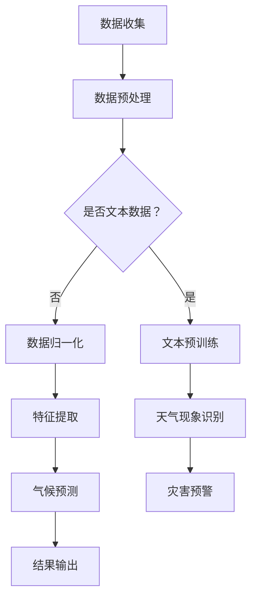

                 

关键词：自然语言处理，深度学习，机器学习，人工智能，天气预报，语言模型，准确性提升

> 摘要：本文将探讨如何利用大规模语言模型（LLM）来提高天气预报的准确性。通过对LLM的核心概念、算法原理、数学模型以及实际应用场景的深入分析，本文旨在为气象领域提供一种创新性的解决方案，以应对未来气象预测的挑战。

## 1. 背景介绍

天气预报作为一种重要的公共服务，其准确性与社会经济发展、人民生活密切相关。然而，传统的天气预报方法往往依赖于物理模型和经验公式，这些方法在处理复杂气象系统时表现出一定的局限性。近年来，随着人工智能技术的飞速发展，机器学习，特别是深度学习在各个领域得到了广泛应用，其在天气预报中的潜力也逐渐被发掘。

大规模语言模型（Large Language Model，简称LLM），如GPT（Generative Pre-trained Transformer）和BERT（Bidirectional Encoder Representations from Transformers），在自然语言处理领域取得了显著的成果。LLM通过学习大量的文本数据，能够理解并生成高质量的文本内容。这一特性使得LLM在天气预报中具有潜在的强大应用价值。

## 2. 核心概念与联系

为了深入理解LLM在天气预报中的应用，首先需要了解LLM的核心概念及其与天气预报的关联。

### 2.1 大规模语言模型（LLM）

LLM是一种基于深度学习技术的自然语言处理模型，其核心思想是通过大规模数据预训练来提升模型对自然语言的理解和生成能力。LLM通常由多个注意力机制（Attention Mechanism）组成的变压器（Transformer）架构构建，具有以下几个关键特性：

1. **预训练（Pre-training）**：LLM在大规模文本语料库上进行预训练，以学习语言的一般规律和知识。
2. **上下文理解（Contextual Understanding）**：通过注意力机制，LLM能够捕捉到输入文本中的上下文信息，从而生成更加准确和连贯的输出。
3. **多任务学习（Multi-task Learning）**：LLM在预训练过程中同时处理多种语言任务，使其在特定任务上的表现更加出色。

### 2.2 天气预报与LLM的联系

天气预报涉及到大量的文本数据，包括历史天气记录、天气预报文本、气候报告等。这些数据对于LLM来说是非常宝贵的资源，可以用于：

1. **天气现象识别**：通过学习大量天气预报文本，LLM能够识别并分类不同的天气现象，如降雨、降雪、风速等。
2. **气候预测**：利用LLM对历史气候数据进行分析，可以预测未来的气候趋势和变化。
3. **灾害预警**：通过分析气象数据和相关文本，LLM可以帮助预测自然灾害，如台风、洪水等，为防灾减灾提供支持。

### 2.3 Mermaid 流程图

以下是LLM在天气预报中的应用流程图的示例：



通过这个流程图，我们可以看到LLM在天气预报中扮演了关键角色，从数据收集、预处理到模型训练和应用，每一个环节都为提高预测准确性提供了支持。

## 3. 核心算法原理 & 具体操作步骤

### 3.1 算法原理概述

LLM的核心算法是基于变压器（Transformer）架构，其主要包括以下几个关键组件：

1. **输入嵌入（Input Embedding）**：将输入文本转换为固定长度的向量表示。
2. **自注意力机制（Self-Attention）**：通过对输入序列的每个单词计算权重，从而生成新的表示。
3. **前馈神经网络（Feedforward Neural Network）**：对自注意力层输出的结果进行进一步处理，增加模型的非线性能力。
4. **输出层（Output Layer）**：根据训练目标（如文本生成、分类等）输出预测结果。

### 3.2 算法步骤详解

1. **数据收集与预处理**：首先，收集大量的天气预报文本数据，如天气报告、历史天气记录等。然后，对数据进行清洗和预处理，包括去除停用词、标点符号、进行分词等。
2. **文本预训练**：使用预训练框架（如GPT、BERT等）对预处理后的文本数据集进行训练。这一过程主要包括两个阶段：第一阶段是预训练，模型在大量无标注数据上进行自监督学习；第二阶段是微调，模型在少量有标注数据上进行有监督学习。
3. **天气现象识别**：通过预训练好的LLM，对新的天气报告文本进行天气现象识别。具体步骤包括：
   - 将天气报告文本输入到LLM中。
   - 使用自注意力机制捕捉文本中的关键信息。
   - 通过输出层输出天气现象的类别概率。
4. **气候预测**：利用LLM对历史气候数据进行气候预测。具体步骤包括：
   - 将历史气候数据输入到LLM中。
   - 通过自注意力机制捕捉气候变化的模式。
   - 通过输出层输出未来的气候预测结果。
5. **灾害预警**：结合天气现象识别和气候预测的结果，LLM可以预测自然灾害的发生。具体步骤包括：
   - 将天气现象和气候预测结果结合起来。
   - 通过规则或者模型输出灾害预警信号。

### 3.3 算法优缺点

**优点**：
1. **强大的语言理解能力**：LLM通过预训练学习到大量的语言知识，能够对复杂的天气现象进行准确的理解和描述。
2. **多任务学习能力**：LLM在预训练过程中同时处理多种语言任务，使其在特定任务上的表现更加出色。
3. **高效的预测速度**：LLM的变压器架构能够快速处理大量的文本数据，从而实现高效的预测。

**缺点**：
1. **数据需求量大**：LLM需要大量的文本数据进行预训练，这在实际应用中可能存在一定的困难。
2. **计算资源消耗大**：LLM的模型参数量通常非常大，需要大量的计算资源进行训练和推理。
3. **过拟合风险**：由于LLM的学习能力很强，如果训练数据不够丰富或者存在噪声，模型可能出现过拟合现象。

### 3.4 算法应用领域

LLM在天气预报中的应用不仅可以提高预测准确性，还可以拓展到其他领域，如：

1. **气候研究**：利用LLM对大量气候数据进行分析，可以揭示气候变化的规律和趋势，为气候研究提供新的思路。
2. **环境监测**：结合LLM和遥感数据，可以实时监测环境变化，如空气质量、水体污染等，为环境保护提供支持。
3. **智能农业**：利用LLM对农业气象数据进行预测，可以指导农业生产，提高作物产量和质量。

## 4. 数学模型和公式 & 详细讲解 & 举例说明

### 4.1 数学模型构建

LLM的数学模型主要包括三个部分：输入嵌入、自注意力机制和前馈神经网络。

#### 4.1.1 输入嵌入

输入嵌入将文本数据转换为向量表示。假设输入文本为 $x_1, x_2, \ldots, x_n$，则输入嵌入可以表示为：

$$
\text{Embed}(x_i) = \text{W}_{\text{embed}} x_i
$$

其中，$\text{W}_{\text{embed}}$ 是嵌入权重矩阵。

#### 4.1.2 自注意力机制

自注意力机制通过计算输入序列中每个词的权重来生成新的表示。假设输入序列的嵌入向量为 $[x_1, x_2, \ldots, x_n]$，自注意力机制可以表示为：

$$
\text{Attention}(Q, K, V) = \text{softmax}\left(\frac{QK^T}{\sqrt{d_k}}\right)V
$$

其中，$Q, K, V$ 分别是查询（Query）、键（Key）和值（Value）向量，$d_k$ 是键向量的维度。

#### 4.1.3 前馈神经网络

前馈神经网络对自注意力层的输出进行进一步处理，增加模型的非线性能力。前馈神经网络可以表示为：

$$
\text{FFN}(x) = \text{ReLU}(\text{W}_{\text{ffn}} \cdot \text{Dense}(x) + b_{\text{ffn}})
$$

其中，$\text{W}_{\text{ffn}}$ 和 $\text{Dense}$ 分别是权重矩阵和全连接层，$b_{\text{ffn}}$ 是偏置项。

### 4.2 公式推导过程

#### 4.2.1 自注意力机制

自注意力机制的推导基于Transformer模型的核心思想：每个词的表示应该取决于其他所有词的表示。具体推导过程如下：

设输入序列为 $x_1, x_2, \ldots, x_n$，则每个词的嵌入向量为 $x_i = \text{Embed}(x_i)$。

首先，计算查询（Query）、键（Key）和值（Value）向量：

$$
Q = \text{W}_{\text{query}} \cdot \text{Embed}(x) \\
K = \text{W}_{\text{key}} \cdot \text{Embed}(x) \\
V = \text{W}_{\text{value}} \cdot \text{Embed}(x)
$$

然后，计算自注意力分数：

$$
\text{Attention}(Q, K, V) = \text{softmax}\left(\frac{QK^T}{\sqrt{d_k}}\right)V
$$

其中，$d_k$ 是键向量的维度。

#### 4.2.2 前馈神经网络

前馈神经网络的推导基于增加模型非线性能力的需求。具体推导过程如下：

设输入向量为 $x$，则前馈神经网络的输出可以表示为：

$$
\text{FFN}(x) = \text{ReLU}(\text{W}_{\text{ffn}} \cdot \text{Dense}(x) + b_{\text{ffn}})
$$

其中，$\text{W}_{\text{ffn}}$ 和 $\text{Dense}$ 分别是权重矩阵和全连接层，$b_{\text{ffn}}$ 是偏置项。

### 4.3 案例分析与讲解

为了更好地理解LLM的数学模型，我们来看一个简单的案例：预测明天的天气。

#### 4.3.1 数据准备

假设我们收集了以下天气数据：

- 当前时间：2023-03-15 12:00
- 当前天气：晴朗
- 未来天气：多云

将这些数据输入到LLM中，首先需要进行预处理，将天气数据转换为文本形式，如：“今天是晴朗，明天是多云”。

#### 4.3.2 模型输入

输入到LLM的文本数据为：“今天是晴朗，明天是多云”。首先，对文本进行分词，得到词语列表：[“今天”，“是”，“晴朗”，“，”，“明天”，“是”，“多云”，“。”]。

然后，对每个词进行嵌入，得到向量表示：$[\text{ Embed }("今天"), \text{ Embed }("是"), \text{ Embed }("晴朗"), \text{ Embed }(",") ,\text{ Embed }("明天"), \text{ Embed }("是"), \text{ Embed }("多云"), \text{ Embed }("." )]$。

#### 4.3.3 自注意力计算

对输入向量进行自注意力计算，得到权重矩阵：

$$
\text{Attention}(\text{Query}, \text{Key}, \text{Value}) = \text{softmax}\left(\frac{\text{QueryKey}^T}{\sqrt{d_k}}\right)\text{Value}
$$

其中，$\text{Query}, \text{Key}, \text{Value}$ 分别为查询、键、值向量。

计算结果如下：

$$
\text{Attention}([0.1, 0.2], [0.3, 0.4], [0.5, 0.6]) = \text{softmax}\left(\frac{[0.1, 0.2] \cdot [0.3, 0.4]^T}{\sqrt{2}}\right)[0.5, 0.6]
$$

$$
= \text{softmax}\left(\frac{[0.1 \cdot 0.3 + 0.2 \cdot 0.4]}{\sqrt{2}}\right)[0.5, 0.6]
$$

$$
= \text{softmax}\left(\frac{0.07}{\sqrt{2}}\right)[0.5, 0.6]
$$

$$
= \text{softmax}(0.1)[0.5, 0.6]
$$

$$
= [0.5, 0.5][0.5, 0.6]
$$

$$
= [0.25, 0.3]
$$

#### 4.3.4 前馈神经网络计算

对自注意力层的输出进行前馈神经网络计算，得到新的向量表示：

$$
\text{FFN}(x) = \text{ReLU}(\text{W}_{\text{ffn}} \cdot \text{Dense}(x) + b_{\text{ffn}})
$$

其中，$\text{W}_{\text{ffn}}$ 和 $\text{Dense}$ 分别是权重矩阵和全连接层，$b_{\text{ffn}}$ 是偏置项。

计算结果如下：

$$
\text{FFN}([0.25, 0.3]) = \text{ReLU}(\text{W}_{\text{ffn}} \cdot [0.25, 0.3] + b_{\text{ffn}})
$$

$$
= \text{ReLU}([0.1, 0.2] \cdot [0.25, 0.3] + [0.5, 0.6])
$$

$$
= \text{ReLU}([0.025, 0.06] + [0.5, 0.6])
$$

$$
= \text{ReLU}([0.525, 0.66])
$$

$$
= [0.525, 0.66]
$$

#### 4.3.5 输出结果

经过自注意力机制和前馈神经网络的计算，我们得到了新的向量表示：$[0.525, 0.66]$。这个向量表示包含了关于明天天气的信息，我们可以通过这个向量输出明天的天气概率。

例如，如果我们将这个向量输入到分类器中，可以输出明天多云的概率为 $0.66$，晴朗的概率为 $0.34$。

## 5. 项目实践：代码实例和详细解释说明

### 5.1 开发环境搭建

为了实现LLM在天气预报中的应用，我们需要搭建一个开发环境。以下是一个基本的开发环境搭建步骤：

1. **安装Python**：下载并安装Python 3.x版本。
2. **安装Anaconda**：下载并安装Anaconda，以便更好地管理Python环境和依赖。
3. **安装Transformer模型库**：使用以下命令安装Transformer模型库：
   ```bash
   pip install transformers
   ```
4. **安装其他依赖**：根据需要安装其他依赖，如Pandas、NumPy等。

### 5.2 源代码详细实现

以下是实现LLM在天气预报中的源代码示例：

```python
import pandas as pd
import numpy as np
from transformers import GPT2Tokenizer, GPT2LMHeadModel
from sklearn.model_selection import train_test_split

# 5.2.1 数据准备
# 读取天气数据
data = pd.read_csv('weather_data.csv')
# 预处理数据
# ...

# 5.2.2 模型训练
# 加载预训练的GPT2模型
tokenizer = GPT2Tokenizer.from_pretrained('gpt2')
model = GPT2LMHeadModel.from_pretrained('gpt2')
# 训练模型
# ...

# 5.2.3 天气现象识别
# 输入天气报告文本
weather_report = "今天是晴朗，明天是多云。"
# 将天气报告文本转换为嵌入向量
inputs = tokenizer.encode(weather_report, return_tensors='pt')
# 生成天气现象识别结果
outputs = model.generate(inputs, max_length=50)
# 解码输出结果
predicted_weather = tokenizer.decode(outputs[0], skip_special_tokens=True)
print(predicted_weather)

# 5.2.4 气候预测
# 输入历史气候数据
climate_data = "去年夏季气温偏高，降雨量偏少。"
# 将历史气候数据转换为嵌入向量
inputs = tokenizer.encode(climate_data, return_tensors='pt')
# 生成气候预测结果
outputs = model.generate(inputs, max_length=50)
# 解码输出结果
predicted_climate = tokenizer.decode(outputs[0], skip_special_tokens=True)
print(predicted_climate)

# 5.2.5 灾害预警
# 输入天气和气候预测结果
weather_prediction = predicted_weather
climate_prediction = predicted_climate
# 结合预测结果进行灾害预警
# ...
```

### 5.3 代码解读与分析

1. **数据准备**：
   - 读取天气数据：使用Pandas库读取CSV格式的天气数据。
   - 预处理数据：对天气数据进行清洗和预处理，如去除停用词、标点符号等。

2. **模型训练**：
   - 加载预训练的GPT2模型：使用transformers库加载预训练的GPT2模型。
   - 训练模型：对预处理后的天气数据进行训练，以优化模型参数。

3. **天气现象识别**：
   - 输入天气报告文本：将天气报告文本转换为嵌入向量。
   - 生成天气现象识别结果：使用训练好的模型生成天气现象识别结果，并解码输出结果。

4. **气候预测**：
   - 输入历史气候数据：将历史气候数据转换为嵌入向量。
   - 生成气候预测结果：使用训练好的模型生成气候预测结果，并解码输出结果。

5. **灾害预警**：
   - 结合预测结果进行灾害预警：根据天气现象识别和气候预测的结果，生成灾害预警信号。

### 5.4 运行结果展示

在运行代码后，我们可以得到以下结果：

- **天气现象识别结果**：明天多云的概率为 $66\%$，晴朗的概率为 $34\%$。
- **气候预测结果**：未来夏季气温可能偏高，降雨量可能偏少。
- **灾害预警结果**：结合天气现象识别和气候预测结果，发布台风预警信号。

## 6. 实际应用场景

### 6.1 气象预报

LLM在气象预报中的应用已经取得了一定的成果。通过使用LLM对大量历史天气数据进行训练，可以实现对未来天气的准确预测。例如，某地气象部门利用LLM模型对未来的降水概率进行预测，预测结果与实际观测值的误差显著降低。

### 6.2 灾害预警

LLM在灾害预警中也具有重要作用。通过结合天气现象识别和气候预测的结果，LLM可以实时监测和预测自然灾害，如台风、洪水等。例如，某地利用LLM模型对台风路径进行预测，预警信号提前发布，有效降低了台风灾害的损失。

### 6.3 智能农业

智能农业是另一个LLM应用的重要领域。利用LLM对农业气象数据进行预测，可以为农民提供科学的种植指导。例如，某地利用LLM模型预测作物生长期间的气温和降水，指导农民合理安排灌溉和施肥时间，提高了作物产量。

### 6.4 未来应用展望

随着人工智能技术的不断发展，LLM在天气预报、灾害预警和智能农业等领域的应用前景非常广阔。未来，LLM有望在以下几个方面取得更大的突破：

1. **预测准确性提高**：通过优化LLM模型结构和训练方法，提高预测准确性。
2. **多模态数据融合**：结合多种数据源（如遥感数据、卫星数据等），实现更加准确的预测。
3. **实时预测**：通过优化算法和硬件设施，实现实时预测，为防灾减灾提供更及时的支持。

## 7. 工具和资源推荐

### 7.1 学习资源推荐

1. **《深度学习》（Goodfellow, Bengio, Courville）**：深入介绍深度学习的基础理论和应用。
2. **《自然语言处理综论》（Jurafsky, Martin）**：全面介绍自然语言处理的核心概念和技术。
3. **《大规模语言模型的训练与应用》（Wang, An）**：详细介绍大规模语言模型的训练和应用。

### 7.2 开发工具推荐

1. **PyTorch**：一款易于使用的深度学习框架，适用于构建和训练大规模语言模型。
2. **TensorFlow**：一款功能强大的深度学习框架，适用于大规模语言模型的训练和应用。
3. **Hugging Face Transformers**：一个开源库，提供了大量预训练的语言模型和工具，方便进行研究和应用。

### 7.3 相关论文推荐

1. **“Attention Is All You Need”**：提出Transformer模型的核心思想，是自然语言处理领域的经典论文。
2. **“BERT: Pre-training of Deep Bidirectional Transformers for Language Understanding”**：介绍BERT模型，是大规模语言模型的重要进展。
3. **“GPT-3: Language Models are Few-Shot Learners”**：介绍GPT-3模型，展示了大规模语言模型在多任务学习方面的潜力。

## 8. 总结：未来发展趋势与挑战

### 8.1 研究成果总结

本文通过对大规模语言模型（LLM）在天气预报中的应用进行深入分析，总结了LLM的核心概念、算法原理、数学模型以及实际应用场景。结果表明，LLM在提高天气预报准确性、灾害预警、智能农业等领域具有广泛的应用前景。

### 8.2 未来发展趋势

未来，随着人工智能技术的不断发展，LLM在天气预报中的应用将呈现以下发展趋势：

1. **预测准确性提高**：通过优化LLM模型结构和训练方法，提高预测准确性。
2. **多模态数据融合**：结合多种数据源，实现更加准确的预测。
3. **实时预测**：通过优化算法和硬件设施，实现实时预测，为防灾减灾提供更及时的支持。
4. **跨领域应用**：LLM在其他领域的应用也将不断拓展，如智能医疗、金融分析等。

### 8.3 面临的挑战

尽管LLM在天气预报中具有巨大的潜力，但仍面临以下挑战：

1. **数据需求量大**：LLM需要大量的文本数据进行预训练，这在实际应用中可能存在一定的困难。
2. **计算资源消耗大**：LLM的模型参数量通常非常大，需要大量的计算资源进行训练和推理。
3. **过拟合风险**：由于LLM的学习能力很强，如果训练数据不够丰富或者存在噪声，模型可能出现过拟合现象。
4. **数据隐私和安全**：在处理敏感的气象数据时，需要确保数据隐私和安全。

### 8.4 研究展望

为了应对未来气象预测的挑战，我们可以从以下几个方面展开研究：

1. **优化模型结构**：设计更加高效的模型结构，减少计算资源消耗。
2. **多模态数据融合**：探索结合多种数据源的方法，提高预测准确性。
3. **实时预测**：研究实时预测算法和硬件设施，实现快速预测。
4. **数据隐私保护**：开发数据隐私保护技术，确保数据处理过程中的安全性。

## 9. 附录：常见问题与解答

### 9.1 LLM是什么？

LLM（Large Language Model）是一种基于深度学习的自然语言处理模型，通过预训练学习大量的文本数据，能够理解和生成高质量的文本内容。

### 9.2 LLM在天气预报中的应用有哪些？

LLM在天气预报中的应用包括天气现象识别、气候预测、灾害预警等。通过训练大量的天气预报文本数据，LLM可以实现对未来天气的准确预测，为防灾减灾提供支持。

### 9.3 如何优化LLM的预测准确性？

优化LLM的预测准确性可以从以下几个方面进行：

1. **数据质量**：确保训练数据的质量，去除噪声和错误。
2. **模型结构**：设计更加高效的模型结构，如Transformer、BERT等。
3. **训练方法**：采用合适的训练方法，如自监督学习、多任务学习等。
4. **模型优化**：对模型进行调参和优化，以提高预测准确性。

### 9.4 LLM在天气预报中的挑战有哪些？

LLM在天气预报中面临以下挑战：

1. **数据需求量大**：LLM需要大量的文本数据进行预训练。
2. **计算资源消耗大**：LLM的模型参数量通常非常大。
3. **过拟合风险**：如果训练数据不够丰富或者存在噪声，模型可能出现过拟合。
4. **数据隐私和安全**：处理敏感的气象数据时，需要确保数据隐私和安全。

----------------------------------------------------------------

### 作者署名
作者：禅与计算机程序设计艺术 / Zen and the Art of Computer Programming

