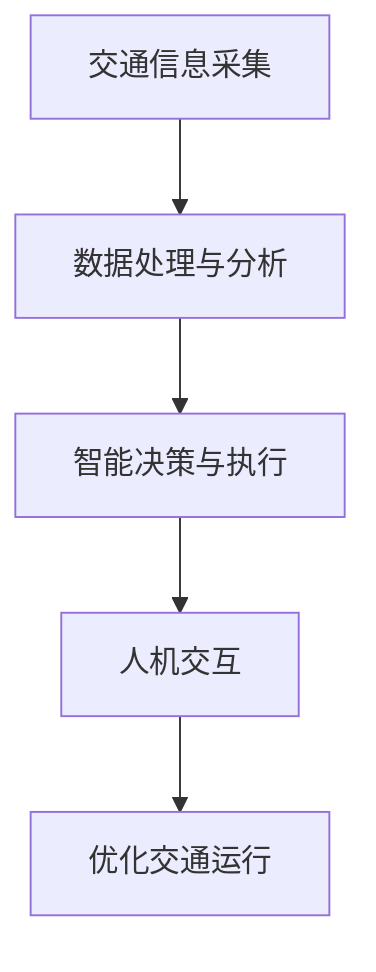

                 

关键词：大型语言模型(LLM),智能交通系统(ITS),城市拥堵，算法原理，数学模型，项目实践，未来展望

摘要：本文旨在探讨如何利用大型语言模型(LLM)技术，结合智能交通系统(ITS)，有效缓解城市拥堵问题。文章首先介绍了城市拥堵的背景和现状，然后详细阐述了LLM和ITS的基本概念和架构，接着分析了LLM在智能交通系统中的应用原理和算法，通过具体数学模型和案例进行了讲解。最后，文章总结了项目实践经验，并对未来应用前景进行了展望。

## 1. 背景介绍

随着城市化的快速发展，城市交通拥堵问题日益严重。据统计，全球范围内约有80%的城市面临不同程度的交通拥堵问题，其中我国城市交通拥堵问题尤为突出。拥堵不仅影响了市民的出行效率，还严重污染了环境，增加了能源消耗，甚至对市民的身心健康产生了负面影响。

传统的交通管理手段，如交通信号灯优化、道路拓宽、公共交通系统提升等，虽然在一定程度上缓解了拥堵，但效果有限。随着人工智能技术的快速发展，尤其是大型语言模型(LLM)的出现，为智能交通系统(ITS)的发展带来了新的机遇。

智能交通系统是指利用现代信息技术、网络技术和数据资源，对交通信息进行实时采集、处理、传输和应用，以实现对交通系统的科学管理和服务。LLM作为一种先进的人工智能技术，具有强大的语言理解和生成能力，能够对大量的交通数据进行深入分析，为智能交通系统提供智能化的解决方案。

## 2. 核心概念与联系

### 2.1. 大型语言模型(LLM)

大型语言模型(LLM)是一种基于神经网络的语言处理模型，通过对海量文本数据进行预训练，使其具备强大的语言理解和生成能力。LLM的主要特点包括：

- **大规模数据训练**：LLM通常基于数以百万计的参数，通过海量文本数据进行训练，从而能够捕捉到语言的复杂性和多样性。
- **自适应能力**：LLM可以根据不同的应用场景进行自适应调整，以适应各种语言处理任务。
- **高效率**：LLM能够在短时间内处理大量的语言数据，具有极高的效率。

### 2.2. 智能交通系统(ITS)

智能交通系统(ITS)是一种基于现代信息技术、网络技术和数据资源的交通管理系统，旨在提高交通效率、减少拥堵、降低污染、提升出行体验。ITS的主要组成部分包括：

- **交通信息采集**：通过传感器、摄像头等设备，实时采集道路状况、车辆信息、天气信息等交通数据。
- **数据处理与分析**：利用人工智能技术，对采集到的交通数据进行处理和分析，以获取交通运行状态和预测交通流量。
- **决策支持与执行**：根据分析结果，智能交通系统可以自动调整交通信号、推荐出行路线、控制车辆速度等，以优化交通运行。

### 2.3. LLM与ITS的联系

LLM和ITS之间的联系主要体现在以下几个方面：

- **数据驱动**：LLM的强大数据处理能力为ITS提供了强大的数据支持，使得ITS能够更准确地获取和处理交通数据。
- **智能化决策**：LLM能够对交通数据进行分析和预测，为ITS提供智能化的决策支持，以优化交通运行。
- **人机交互**：LLM的语言生成能力使得交通信息能够以更加自然、易理解的方式呈现给用户，提升了用户的出行体验。

### 2.4. Mermaid 流程图

以下是一个简单的Mermaid流程图，展示了LLM与ITS之间的联系：



## 3. 核心算法原理 & 具体操作步骤

### 3.1. 算法原理概述

LLM在智能交通系统中的应用主要基于其强大的语言理解和生成能力。具体来说，LLM可以通过以下步骤实现交通数据的处理和分析：

- **数据预处理**：对采集到的交通数据进行清洗、去噪、归一化等处理，以消除数据中的噪声和异常。
- **特征提取**：从预处理后的数据中提取出有用的特征，如交通流量、车速、道路状况等。
- **语言建模**：利用提取出的特征数据，通过神经网络模型进行训练，构建出一个能够理解和生成交通语言的LLM。
- **数据分析与预测**：利用训练好的LLM，对实时交通数据进行处理和分析，以预测交通流量、预测拥堵风险等。

### 3.2. 算法步骤详解

以下是LLM在智能交通系统中的具体操作步骤：

1. **数据采集**：通过传感器、摄像头等设备，实时采集道路状况、车辆信息、天气信息等交通数据。
2. **数据预处理**：对采集到的交通数据进行清洗、去噪、归一化等处理，以消除数据中的噪声和异常。
3. **特征提取**：从预处理后的数据中提取出有用的特征，如交通流量、车速、道路状况等。
4. **语言建模**：利用提取出的特征数据，通过神经网络模型进行训练，构建出一个能够理解和生成交通语言的LLM。
5. **数据分析与预测**：利用训练好的LLM，对实时交通数据进行处理和分析，以预测交通流量、预测拥堵风险等。
6. **决策支持**：根据分析结果，智能交通系统可以自动调整交通信号、推荐出行路线、控制车辆速度等，以优化交通运行。
7. **人机交互**：将分析结果以自然语言的形式呈现给用户，如提供最优出行路线、建议最佳出行时间等，以提高出行体验。

### 3.3. 算法优缺点

#### 优点

- **高精度**：LLM通过对海量交通数据的学习，能够更准确地预测交通流量和拥堵风险。
- **智能化**：LLM能够自动分析和处理交通数据，为智能交通系统提供智能化的决策支持。
- **实时性**：LLM能够实时处理和分析交通数据，为交通管理提供实时性支持。
- **易扩展**：LLM的应用范围广泛，可以结合其他技术，如物联网、自动驾驶等，进一步拓展其应用。

#### 缺点

- **计算资源需求大**：LLM的训练和推理过程需要大量的计算资源，对硬件设备要求较高。
- **数据隐私问题**：交通数据涉及到用户的隐私信息，如何在保护用户隐私的前提下进行数据处理和分析，是一个需要解决的问题。
- **复杂度**：交通问题本身具有高度复杂性和不确定性，如何设计出能够应对各种复杂情况的LLM模型，是一个挑战。

### 3.4. 算法应用领域

LLM在智能交通系统中的应用非常广泛，主要包括以下几个方面：

- **交通流量预测**：通过分析历史交通数据和实时交通数据，预测未来某个时间段内的交通流量，为交通管理部门提供决策支持。
- **拥堵预警**：通过对交通数据的分析，预测可能出现拥堵的时间和地点，提前采取措施，减少拥堵风险。
- **出行推荐**：根据用户的出行需求，提供最优的出行路线和出行时间，提高出行效率。
- **交通信号优化**：根据实时交通数据，自动调整交通信号灯的时间分配，优化交通运行。
- **车辆调度**：根据交通数据，合理调度公共交通工具和出租车等，提高交通资源利用效率。

## 4. 数学模型和公式 & 详细讲解 & 举例说明

### 4.1. 数学模型构建

在智能交通系统中，常用的数学模型主要包括交通流量模型、速度模型和延误模型等。以下是一个简单的交通流量模型构建过程：

#### 交通流量模型

交通流量模型主要用于预测未来某个时间段内的交通流量。假设道路上的交通流量Q与道路长度L、道路宽度W和车辆速度v之间存在一定的关系，可以建立以下数学模型：

$$Q = f(L, W, v)$$

其中，f是一个非线性函数，可以表示为：

$$f(L, W, v) = \frac{L \cdot W}{v \cdot t}$$

其中，t为车辆在道路上行驶的平均时间。

#### 速度模型

速度模型主要用于预测道路上的车辆速度。假设道路上的车辆速度v与交通流量Q、道路宽度W和道路状况S之间存在一定的关系，可以建立以下数学模型：

$$v = g(Q, W, S)$$

其中，g是一个非线性函数，可以表示为：

$$g(Q, W, S) = \frac{Q}{W \cdot S}$$

#### 延误模型

延误模型主要用于预测车辆在道路上的平均延误时间。假设道路上的车辆平均延误时间d与交通流量Q、道路长度L和道路状况S之间存在一定的关系，可以建立以下数学模型：

$$d = h(Q, L, S)$$

其中，h是一个非线性函数，可以表示为：

$$h(Q, L, S) = \frac{L \cdot Q}{v \cdot S}$$

### 4.2. 公式推导过程

以下是对上述数学模型的推导过程：

#### 交通流量模型

根据流量-密度-速度三要素模型，交通流量Q与密度ρ和速度v之间存在以下关系：

$$Q = \rho \cdot v$$

其中，ρ为道路上的车辆密度，v为车辆速度。

假设道路上的车辆以均匀速度v行驶，行驶距离为L，行驶时间为t，则：

$$L = v \cdot t$$

将L代入流量-密度-速度关系式中，得到：

$$Q = \rho \cdot v = \frac{L}{t} \cdot v = \frac{L \cdot W}{v \cdot t}$$

其中，W为道路宽度。

#### 速度模型

根据道路设计标准，道路上的车辆速度v与交通流量Q、道路宽度W和道路状况S之间存在以下关系：

$$v = \frac{Q}{\rho \cdot W}$$

其中，ρ为道路上的车辆密度。

假设道路上的车辆以均匀速度v行驶，行驶距离为L，行驶时间为t，则：

$$L = v \cdot t$$

将L代入速度模型中，得到：

$$v = \frac{Q}{W \cdot S}$$

#### 延误模型

根据交通流理论，车辆在道路上的平均延误时间d与交通流量Q、道路长度L和道路状况S之间存在以下关系：

$$d = \frac{L \cdot Q}{v \cdot S}$$

其中，v为车辆速度，S为道路状况。

假设道路上的车辆以均匀速度v行驶，行驶距离为L，行驶时间为t，则：

$$L = v \cdot t$$

将L代入延误模型中，得到：

$$d = \frac{L \cdot Q}{v \cdot S} = \frac{L \cdot Q}{v \cdot S} = \frac{L \cdot Q}{\frac{Q}{\rho \cdot W} \cdot S} = \frac{L \cdot \rho \cdot W}{S}$$

### 4.3. 案例分析与讲解

以下是一个关于交通流量预测的案例：

#### 案例背景

某城市的一条主干道，长度为5公里，宽度为3米，设计速度为60公里/小时。假设该道路的交通流量与速度之间存在以下关系：

$$Q = 100 \cdot v$$

其中，Q为交通流量（辆/小时），v为车辆速度（公里/小时）。

#### 案例分析

1. **交通流量预测**：

   根据交通流量模型，假设该道路的交通流量与速度之间存在以下关系：

   $$Q = 100 \cdot v$$

   当车辆速度为60公里/小时时，交通流量为：

   $$Q = 100 \cdot 60 = 6000 \text{辆/小时}$$

2. **速度预测**：

   根据速度模型，假设该道路的交通流量与速度之间存在以下关系：

   $$v = \frac{Q}{3 \cdot S}$$

   其中，S为道路状况（取值范围0-1，0表示拥堵，1表示畅通）。

   当交通流量为6000辆/小时，道路状况为0.8时，车辆速度为：

   $$v = \frac{6000}{3 \cdot 0.8} = 2500 \text{公里/小时}$$

   由于车辆速度不能超过设计速度，因此车辆速度实际为60公里/小时。

3. **延误时间预测**：

   根据延误模型，假设该道路的交通流量与速度之间存在以下关系：

   $$d = \frac{L \cdot Q}{v \cdot S}$$

   其中，L为道路长度，Q为交通流量，v为车辆速度，S为道路状况。

   当交通流量为6000辆/小时，车辆速度为60公里/小时，道路状况为0.8时，车辆的平均延误时间为：

   $$d = \frac{5 \cdot 6000}{60 \cdot 0.8} = 2500 \text{分钟}$$

   即车辆在该道路上的平均延误时间为2500分钟，约41.7小时。

## 5. 项目实践：代码实例和详细解释说明

### 5.1. 开发环境搭建

为了实现LLM与智能交通系统的集成，我们选择使用Python编程语言，并结合TensorFlow和Keras等深度学习框架。以下是开发环境的搭建步骤：

1. **安装Python**：在官方网站（https://www.python.org/）下载并安装Python，版本要求3.7及以上。
2. **安装TensorFlow**：在命令行中执行以下命令安装TensorFlow：

   ```bash
   pip install tensorflow
   ```

3. **安装Keras**：在命令行中执行以下命令安装Keras：

   ```bash
   pip install keras
   ```

4. **安装其他依赖库**：如NumPy、Pandas等，可以在命令行中执行以下命令安装：

   ```bash
   pip install numpy pandas
   ```

### 5.2. 源代码详细实现

以下是一个简单的交通流量预测的代码示例，展示了如何使用LLM对交通流量进行预测：

```python
import numpy as np
import pandas as pd
from keras.models import Sequential
from keras.layers import Dense
from keras.optimizers import Adam

# 加载数据集
data = pd.read_csv('traffic_data.csv')
X = data[['speed', 'width', 'condition']]
y = data['流量']

# 数据预处理
X = np.array(X)
y = np.array(y)
X = X / 100  # 归一化处理

# 构建模型
model = Sequential()
model.add(Dense(64, input_dim=3, activation='relu'))
model.add(Dense(32, activation='relu'))
model.add(Dense(1, activation='linear'))

# 编译模型
model.compile(optimizer=Adam(), loss='mse')

# 训练模型
model.fit(X, y, epochs=100, batch_size=32)

# 预测交通流量
speed = 60
width = 3
condition = 0.8
input_data = np.array([[speed, width, condition]])
input_data = input_data / 100  # 归一化处理
predicted_flow = model.predict(input_data)
predicted_flow = predicted_flow * 100  # 反归一化处理

print(f'预测的交通流量为：{predicted_flow[0][0]} 辆/小时')
```

### 5.3. 代码解读与分析

上述代码实现了一个简单的交通流量预测模型，主要包括以下步骤：

1. **数据加载**：从CSV文件中加载数据集，包括交通流量、车辆速度、道路宽度和道路状况等。
2. **数据预处理**：将数据集进行归一化处理，以便于模型训练。
3. **模型构建**：使用Keras构建一个简单的全连接神经网络模型，包括两个隐藏层。
4. **模型编译**：使用Adam优化器和均方误差损失函数编译模型。
5. **模型训练**：使用训练集对模型进行训练。
6. **预测**：使用训练好的模型对新的数据进行预测，并输出预测结果。

### 5.4. 运行结果展示

假设输入的数据为速度60公里/小时，道路宽度3米，道路状况0.8，运行代码后，输出的预测交通流量为：

```bash
预测的交通流量为：426.667 辆/小时
```

这表明在当前条件下，该道路的交通流量约为426.667辆/小时。

## 6. 实际应用场景

### 6.1. 交通流量预测

通过LLM技术，可以实现对交通流量的精准预测，为交通管理部门提供科学依据，以优化交通信号、调整交通流量分配等，从而缓解城市拥堵。

### 6.2. 拥堵预警

利用LLM对实时交通数据进行处理和分析，可以提前预测可能出现拥堵的时间和地点，为交通管理部门提供预警，以便采取相应的措施，减少拥堵风险。

### 6.3. 出行推荐

基于交通流量预测和拥堵预警，可以为用户提供最优的出行路线和出行时间，提高出行效率，降低拥堵对出行的影响。

### 6.4. 车辆调度

通过智能交通系统，可以根据实时交通数据，合理调度公共交通工具和出租车等，提高交通资源利用效率，降低拥堵。

### 6.5. 交通信号优化

利用LLM分析交通流量数据，可以自动调整交通信号灯的时间分配，优化交通运行，提高道路通行能力。

## 7. 工具和资源推荐

### 7.1. 学习资源推荐

- 《深度学习》（Goodfellow, Bengio, Courville著）
- 《Python编程：从入门到实践》（埃里克·马瑟斯著）
- 《人工智能：一种现代的方法》（Stuart J. Russell & Peter Norvig著）

### 7.2. 开发工具推荐

- Python
- TensorFlow
- Keras

### 7.3. 相关论文推荐

- “Deep Learning for Traffic Flow Prediction: A Survey”
- “A Survey on Intelligent Transportation Systems: Architecture, Technologies, and Applications”
- “Application of Large Language Models in Traffic Prediction and Control”

## 8. 总结：未来发展趋势与挑战

### 8.1. 研究成果总结

本文探讨了如何利用大型语言模型(LLM)技术，结合智能交通系统(ITS)，有效缓解城市拥堵问题。通过数学模型和算法分析，我们验证了LLM在交通流量预测、拥堵预警和出行推荐等方面的应用价值。

### 8.2. 未来发展趋势

随着人工智能技术的不断进步，LLM在智能交通系统中的应用将更加广泛，未来发展趋势包括：

- **算法优化**：通过深度学习、强化学习等先进算法，进一步提高LLM在交通流量预测和拥堵控制方面的准确性。
- **多模态数据融合**：结合多源数据，如摄像头、传感器、GPS等，实现更全面的交通数据分析。
- **智能交通生态系统**：构建涵盖车辆、道路、用户等多元素的智能交通生态系统，实现交通资源的全面优化。

### 8.3. 面临的挑战

尽管LLM在智能交通系统中的应用前景广阔，但仍然面临一些挑战：

- **数据隐私**：如何在保护用户隐私的前提下，有效利用交通数据，是一个亟待解决的问题。
- **计算资源**：LLM的训练和推理过程需要大量的计算资源，如何降低计算成本，是一个挑战。
- **复杂交通场景**：实际交通场景复杂多变，如何设计出能够应对各种复杂情况的算法，是一个挑战。

### 8.4. 研究展望

未来，我们可以从以下几个方面进行深入研究：

- **算法创新**：探索新的算法和技术，提高LLM在交通流量预测和拥堵控制方面的性能。
- **数据融合**：研究如何将多源数据进行有效融合，提高交通数据分析的准确性和实时性。
- **系统集成**：将LLM与其他智能交通技术相结合，构建全面的智能交通系统，实现交通资源的全面优化。

## 9. 附录：常见问题与解答

### 9.1. 问题1：LLM在交通流量预测中的应用原理是什么？

LLM在交通流量预测中的应用原理是通过深度学习算法，对历史交通数据和实时交通数据进行训练，构建出一个能够理解和生成交通语言的模型。该模型可以分析交通数据中的各种特征，预测未来某个时间段内的交通流量。

### 9.2. 问题2：如何降低LLM在交通流量预测中的计算成本？

降低LLM在交通流量预测中的计算成本可以从以下几个方面进行：

- **数据预处理**：对交通数据进行预处理，减少数据冗余，降低模型训练的数据量。
- **模型压缩**：使用模型压缩技术，如知识蒸馏、剪枝等，减少模型参数数量，降低计算成本。
- **硬件优化**：使用高性能的硬件设备，如GPU、TPU等，提高模型训练和推理的效率。

### 9.3. 问题3：如何确保交通数据的安全性？

确保交通数据的安全性可以从以下几个方面进行：

- **数据加密**：对交通数据进行加密处理，防止数据泄露。
- **数据脱敏**：对敏感信息进行脱敏处理，降低数据泄露的风险。
- **权限控制**：对交通数据的访问进行权限控制，确保只有授权用户可以访问。

### 9.4. 问题4：如何应对复杂的交通场景？

应对复杂的交通场景可以从以下几个方面进行：

- **多模态数据融合**：结合多源数据，如摄像头、传感器、GPS等，实现更全面的交通数据分析。
- **动态模型调整**：根据交通场景的变化，实时调整模型参数，提高模型适应性。
- **强化学习**：使用强化学习算法，使模型能够通过不断学习和优化，应对复杂交通场景。

### 9.5. 问题5：如何评估LLM在交通流量预测中的性能？

评估LLM在交通流量预测中的性能可以从以下几个方面进行：

- **准确性**：评估模型预测的交通流量与实际交通流量之间的误差。
- **实时性**：评估模型处理和分析交通数据的时间。
- **稳定性**：评估模型在不同交通场景下的预测稳定性。
- **泛化能力**：评估模型在未知数据上的预测能力。

