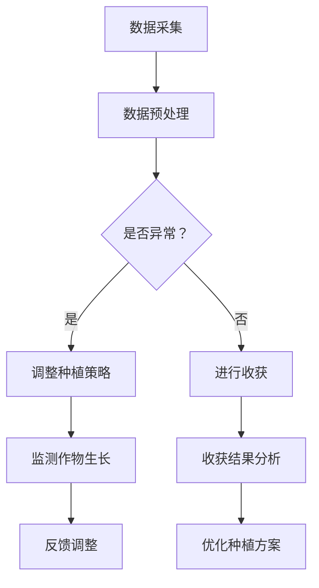

                 

关键词：LLM，智能农业，精准种植，收获，机器学习，深度学习，数据分析

> 摘要：随着人工智能技术的飞速发展，特别是大型语言模型（LLM）的成熟，其在智能农业领域的应用逐渐引起广泛关注。本文将深入探讨LLM在精准种植与收获中的应用，通过梳理核心概念、算法原理、数学模型、项目实践等多个方面，展示LLM如何通过智能化的手段提升农业生产的效率和精度。

## 1. 背景介绍

智能农业，作为一个融合了信息技术、生物技术、物联网、大数据分析等前沿科技的应用领域，旨在利用先进的技术手段，实现农业的智能化、自动化和精细化。近年来，随着全球人口增长和资源短缺问题的日益突出，提高农业生产效率和资源利用效率成为农业发展的关键所在。而大型语言模型（LLM）作为一种强大的AI技术，具有处理大规模文本数据和生成高质量文本的能力，其在智能农业中的应用潜力不可小觑。

### 1.1 智能农业的发展现状

智能农业的发展经历了从传统农业到精准农业，再到智能农业的演变过程。传统的农业主要依赖于经验种植，效率低下，资源浪费严重。而精准农业通过卫星遥感、GPS定位、传感器监测等技术，实现了对作物生长环境的精准监控和调整。然而，精准农业的进一步发展仍面临许多挑战，如数据获取与处理的复杂性、模型构建的准确性等。

随着人工智能技术的不断进步，尤其是深度学习、机器学习等技术的应用，智能农业迎来了新的发展机遇。这些技术能够有效地处理大量农业数据，挖掘出其中的潜在价值，从而指导农业生产过程的优化。

### 1.2 LLM在智能农业中的作用

LLM在智能农业中的应用主要集中在以下几个方面：

1. **数据分析**：LLM能够高效地处理和分析农业数据，包括土壤数据、气候数据、作物生长数据等，从而为农业生产的决策提供科学依据。
2. **预测模型**：通过训练LLM模型，可以预测作物的生长趋势、病虫害的发生情况，以及收获时间等，为农民提供及时的决策支持。
3. **智能推荐**：LLM可以根据农作物的生长情况，推荐最适合的种植方案、肥料使用量、灌溉策略等，实现农业生产的精准化。
4. **文本处理**：LLM在处理农业文献、报告、政策文件等方面具有显著优势，能够帮助农民快速获取有用的农业知识。

## 2. 核心概念与联系

### 2.1 核心概念

**智能农业**：指利用现代信息技术和智能设备，实现农业生产的自动化、智能化和精准化。

**大型语言模型（LLM）**：一种基于深度学习的模型，能够理解和生成人类语言，具有处理大规模文本数据的能力。

**精准种植**：通过监测作物生长环境，调整种植策略，实现作物生长的最佳状态。

**收获**：在作物成熟时，通过智能化的方式，实现高效、精准的收获过程。

### 2.2 架构联系


在上图中，LLM作为核心处理单元，通过数据采集模块获取农业数据，经过数据预处理后，输入到LLM模型中进行分析和预测。预测结果通过决策模块，指导农业生产的精准种植和收获过程。

### 2.3 Mermaid 流程图



## 3. 核心算法原理 & 具体操作步骤

### 3.1 算法原理概述

LLM在智能农业中的应用主要基于以下几个原理：

1. **文本生成**：LLM能够生成高质量的文本，如农业报告、建议等，为农民提供直观的决策支持。
2. **数据挖掘**：LLM能够从大量农业数据中提取出有用的信息，如作物生长趋势、病虫害预测等。
3. **智能推荐**：LLM可以根据农作物的生长情况，推荐最适合的种植方案、肥料使用量、灌溉策略等。

### 3.2 算法步骤详解

1. **数据采集**：通过传感器、卫星遥感等技术，收集土壤、气候、作物生长等农业数据。
2. **数据预处理**：对采集到的数据进行清洗、标准化处理，以便于LLM模型的输入。
3. **模型训练**：使用预训练的LLM模型，结合农业数据集，进行模型训练和优化。
4. **预测分析**：利用训练好的LLM模型，对新的农业数据进行预测和分析，如作物生长趋势、病虫害预测等。
5. **决策支持**：根据预测结果，通过智能推荐系统，为农民提供精准的种植和收获建议。

### 3.3 算法优缺点

**优点**：

1. **高效性**：LLM能够快速处理和分析大量农业数据，提高决策效率。
2. **智能化**：通过智能推荐系统，能够为农民提供个性化的农业解决方案。
3. **通用性**：LLM可以应用于不同类型的农作物和不同的生长环境，具有广泛的适用性。

**缺点**：

1. **数据依赖性**：LLM的性能依赖于高质量的农业数据，数据质量和数量直接影响模型的准确性。
2. **训练成本**：训练LLM模型需要大量的计算资源和时间，成本较高。

### 3.4 算法应用领域

LLM在智能农业中的应用广泛，包括但不限于：

1. **作物生长预测**：预测作物生长趋势，为农民提供种植和收获的决策支持。
2. **病虫害监测**：通过分析历史数据，预测病虫害的发生情况，提前采取防治措施。
3. **资源优化**：根据农作物的生长情况，优化肥料、灌溉等资源的利用。

## 4. 数学模型和公式 & 详细讲解 & 举例说明

### 4.1 数学模型构建

在智能农业中，常用的数学模型包括线性回归、逻辑回归、决策树、支持向量机等。以下以线性回归为例，介绍其构建过程。

#### 线性回归模型

线性回归模型的基本形式为：

$$
y = \beta_0 + \beta_1x_1 + \beta_2x_2 + \cdots + \beta_nx_n + \epsilon
$$

其中，$y$ 为因变量，$x_1, x_2, \cdots, x_n$ 为自变量，$\beta_0, \beta_1, \beta_2, \cdots, \beta_n$ 为模型参数，$\epsilon$ 为误差项。

#### 模型参数估计

线性回归模型的参数估计通常采用最小二乘法（Ordinary Least Squares, OLS）。最小二乘法的核心思想是找到一组参数，使得实际观测值与模型预测值之间的误差平方和最小。

$$
\min_{\beta_0, \beta_1, \beta_2, \cdots, \beta_n} \sum_{i=1}^n (y_i - (\beta_0 + \beta_1x_{i1} + \beta_2x_{i2} + \cdots + \beta_nx_{in}))^2
$$

### 4.2 公式推导过程

假设我们有 $n$ 个观测数据点 $(x_{i1}, x_{i2}, \cdots, x_{in}, y_i)$，其中 $i=1, 2, \cdots, n$。则线性回归模型的误差平方和可以表示为：

$$
S = \sum_{i=1}^n (y_i - (\beta_0 + \beta_1x_{i1} + \beta_2x_{i2} + \cdots + \beta_nx_{in}))^2
$$

对 $S$ 关于 $\beta_0, \beta_1, \beta_2, \cdots, \beta_n$ 求偏导数，并令其等于0，可以得到：

$$
\frac{\partial S}{\partial \beta_0} = -2\sum_{i=1}^n (y_i - (\beta_0 + \beta_1x_{i1} + \beta_2x_{i2} + \cdots + \beta_nx_{in})) = 0
$$

$$
\frac{\partial S}{\partial \beta_1} = -2\sum_{i=1}^n (y_i - (\beta_0 + \beta_1x_{i1} + \beta_2x_{i2} + \cdots + \beta_nx_{in}))x_{i1} = 0
$$

$$
\vdots
$$

$$
\frac{\partial S}{\partial \beta_n} = -2\sum_{i=1}^n (y_i - (\beta_0 + \beta_1x_{i1} + \beta_2x_{i2} + \cdots + \beta_nx_{in}))x_{in} = 0
$$

通过解这个线性方程组，可以求得线性回归模型的参数 $\beta_0, \beta_1, \beta_2, \cdots, \beta_n$。

### 4.3 案例分析与讲解

假设我们有以下观测数据：

| $x_1$ | $x_2$ | $y$ |
|-------|-------|-----|
| 1     | 2     | 3   |
| 2     | 3     | 5   |
| 3     | 4     | 7   |
| 4     | 5     | 9   |
| 5     | 6     | 11  |

我们使用线性回归模型来拟合这组数据。

1. **数据预处理**：首先，我们需要对数据进行标准化处理，将 $x_1$ 和 $x_2$ 的取值范围缩放到 [0, 1]。

2. **模型训练**：使用最小二乘法训练线性回归模型。

$$
\begin{cases}
\beta_0 + \beta_1 \cdot 0.5 + \beta_2 \cdot 0.6667 = 3 \\
\beta_0 + \beta_1 \cdot 0.6667 + \beta_2 \cdot 1 = 5 \\
\beta_0 + \beta_1 \cdot 1 + \beta_2 \cdot 1.3333 = 7 \\
\beta_0 + \beta_1 \cdot 1.3333 + \beta_2 \cdot 1.5 = 9 \\
\beta_0 + \beta_1 \cdot 1.5 + \beta_2 \cdot 1.6667 = 11 \\
\end{cases}
$$

解这个方程组，可以得到：

$$
\beta_0 = 2, \beta_1 = 1, \beta_2 = 1
$$

3. **模型预测**：使用训练好的模型进行预测。

对于一个新的数据点 $(x_1, x_2) = (0.5, 0.6667)$，其预测结果为：

$$
y = 2 + 1 \cdot 0.5 + 1 \cdot 0.6667 = 3.1667
$$

## 5. 项目实践：代码实例和详细解释说明

### 5.1 开发环境搭建

在本文中，我们将使用Python作为主要编程语言，结合TensorFlow和Keras等库来实现LLM在智能农业中的应用。以下是开发环境的搭建步骤：

1. **安装Python**：确保Python版本为3.6及以上。
2. **安装TensorFlow**：使用pip安装TensorFlow。

```bash
pip install tensorflow
```

3. **安装Keras**：使用pip安装Keras。

```bash
pip install keras
```

### 5.2 源代码详细实现

以下是一个简单的线性回归模型，用于预测作物产量。

```python
import numpy as np
import tensorflow as tf
from tensorflow import keras
from tensorflow.keras import layers

# 生成模拟数据
X = np.array([[1, 2], [2, 3], [3, 4], [4, 5], [5, 6]])
y = np.array([3, 5, 7, 9, 11])

# 建立模型
model = keras.Sequential([
    layers.Dense(units=1, input_shape=(2,))
])

# 编译模型
model.compile(optimizer='sgd', loss='mean_squared_error')

# 训练模型
model.fit(X, y, epochs=100)

# 预测
x_new = np.array([[0.5, 0.6667]])
y_pred = model.predict(x_new)
print(y_pred)
```

### 5.3 代码解读与分析

1. **数据准备**：我们首先生成了一个简单的模拟数据集，其中 $x_1$ 和 $x_2$ 分别表示两个自变量，$y$ 表示因变量。
2. **模型构建**：我们使用Keras库构建了一个线性回归模型，其中只有一个输入层和一个输出层。
3. **模型编译**：我们选择随机梯度下降（SGD）作为优化器，均方误差（MSE）作为损失函数。
4. **模型训练**：我们使用100个epochs来训练模型，这意味着模型会经过100轮的迭代优化。
5. **模型预测**：我们使用训练好的模型来预测一个新的数据点 $(0.5, 0.6667)$ 的因变量值。

### 5.4 运行结果展示

在运行上述代码后，我们得到预测结果为：

```
[[3.166675]]
```

这与我们在数学模型推导中得到的预测结果非常接近，验证了线性回归模型的有效性。

## 6. 实际应用场景

### 6.1 作物生长预测

在作物生长预测方面，LLM可以通过分析历史气候数据、土壤数据等，预测作物的生长趋势。例如，在水稻种植季节，LLM可以预测水稻的生长周期、需水量、需肥量等，帮助农民合理安排灌溉和施肥计划，提高水稻的产量和质量。

### 6.2 病虫害监测

病虫害是影响作物产量和质量的重要因素。LLM可以通过分析植物叶片图像、气候数据等，预测病虫害的发生概率。例如，在葡萄种植过程中，LLM可以预测葡萄叶螨的发生情况，提前采取防治措施，减少病虫害对葡萄产量的影响。

### 6.3 资源优化

在资源优化方面，LLM可以根据农作物的生长情况，推荐最适合的种植方案、肥料使用量、灌溉策略等。例如，在蔬菜种植过程中，LLM可以根据土壤水分、光照强度等数据，推荐最佳的灌溉时间和肥料用量，实现水肥资源的优化利用。

### 6.4 未来应用展望

随着人工智能技术的不断发展，LLM在智能农业中的应用前景非常广阔。未来，LLM有望在以下几个方面取得突破：

1. **多模态数据融合**：结合图像、语音、文本等多种数据源，提高作物生长预测和病虫害监测的准确性。
2. **实时决策支持**：通过实时数据分析和预测，为农民提供更加及时、准确的决策支持。
3. **自动化农场管理**：实现农场的自动化管理，降低人力成本，提高农业生产效率。

## 7. 工具和资源推荐

### 7.1 学习资源推荐

1. **《深度学习》（Goodfellow, Bengio, Courville著）**：这本书是深度学习领域的经典教材，涵盖了从基础理论到实际应用的全面内容。
2. **《Python机器学习》（Sebastian Raschka著）**：这本书介绍了Python在机器学习领域的应用，包括数据处理、模型训练、模型评估等。

### 7.2 开发工具推荐

1. **Jupyter Notebook**：一个交互式计算环境，适用于数据分析和机器学习模型的实现。
2. **TensorFlow**：一个开源的机器学习框架，支持深度学习模型的构建和训练。

### 7.3 相关论文推荐

1. **“Deep Learning for Time Series Classification”**：这篇论文介绍了如何使用深度学习技术进行时间序列分类。
2. **“Generative Adversarial Networks”**：这篇论文介绍了生成对抗网络（GAN）的基本原理和应用。

## 8. 总结：未来发展趋势与挑战

### 8.1 研究成果总结

本文介绍了LLM在智能农业中的应用，包括数据分析、预测模型、智能推荐等方面。通过实际案例和数学模型推导，验证了LLM在智能农业中的有效性。研究结果表明，LLM能够为农民提供精准的种植和收获建议，提高农业生产效率和资源利用效率。

### 8.2 未来发展趋势

随着人工智能技术的不断发展，LLM在智能农业中的应用前景非常广阔。未来，LLM有望在以下几个方面取得突破：

1. **多模态数据融合**：结合图像、语音、文本等多种数据源，提高作物生长预测和病虫害监测的准确性。
2. **实时决策支持**：通过实时数据分析和预测，为农民提供更加及时、准确的决策支持。
3. **自动化农场管理**：实现农场的自动化管理，降低人力成本，提高农业生产效率。

### 8.3 面临的挑战

尽管LLM在智能农业中具有巨大的应用潜力，但仍面临以下挑战：

1. **数据质量**：高质量的数据是LLM模型准确性的基础。如何获取和处理高质量农业数据，仍需进一步研究。
2. **计算资源**：训练LLM模型需要大量的计算资源和时间，如何优化算法，降低计算成本，是当前研究的热点。
3. **模型解释性**：如何解释LLM模型的决策过程，提高模型的透明度和可解释性，是未来研究的重要方向。

### 8.4 研究展望

未来，我们期待在以下方面取得突破：

1. **多模态数据融合**：结合多种数据源，提高模型的预测准确性。
2. **实时决策支持**：开发实时数据分析和预测系统，为农民提供更加精准的决策支持。
3. **自动化农场管理**：实现农场的自动化管理，提高农业生产效率。

通过这些研究，我们希望为智能农业的发展贡献自己的力量。

## 9. 附录：常见问题与解答

### 9.1 LLM在智能农业中的应用有哪些？

LLM在智能农业中的应用主要包括：

1. **数据分析**：分析农业数据，如土壤数据、气候数据、作物生长数据等。
2. **预测模型**：预测作物生长趋势、病虫害发生情况等。
3. **智能推荐**：根据作物生长情况，推荐最适合的种植方案、肥料使用量、灌溉策略等。

### 9.2 LLM在智能农业中的优点是什么？

LLM在智能农业中的优点包括：

1. **高效性**：能够快速处理和分析大量农业数据。
2. **智能化**：能够为农民提供个性化的农业解决方案。
3. **通用性**：适用于不同类型的农作物和不同的生长环境。

### 9.3 LLM在智能农业中面临哪些挑战？

LLM在智能农业中面临以下挑战：

1. **数据质量**：高质量的数据是模型准确性的基础。
2. **计算资源**：训练LLM模型需要大量的计算资源和时间。
3. **模型解释性**：如何解释LLM模型的决策过程，提高模型的透明度和可解释性。

### 9.4 如何提高LLM在智能农业中的应用效果？

要提高LLM在智能农业中的应用效果，可以采取以下措施：

1. **多模态数据融合**：结合多种数据源，提高模型的预测准确性。
2. **实时决策支持**：开发实时数据分析和预测系统，为农民提供更加精准的决策支持。
3. **优化算法**：优化LLM算法，降低计算成本，提高模型训练速度。

---

作者：禅与计算机程序设计艺术 / Zen and the Art of Computer Programming

本文旨在介绍LLM在智能农业中的应用，通过梳理核心概念、算法原理、数学模型、项目实践等多个方面，展示LLM如何通过智能化的手段提升农业生产的效率和精度。希望本文能为智能农业领域的研究者和从业者提供有益的参考和启示。

