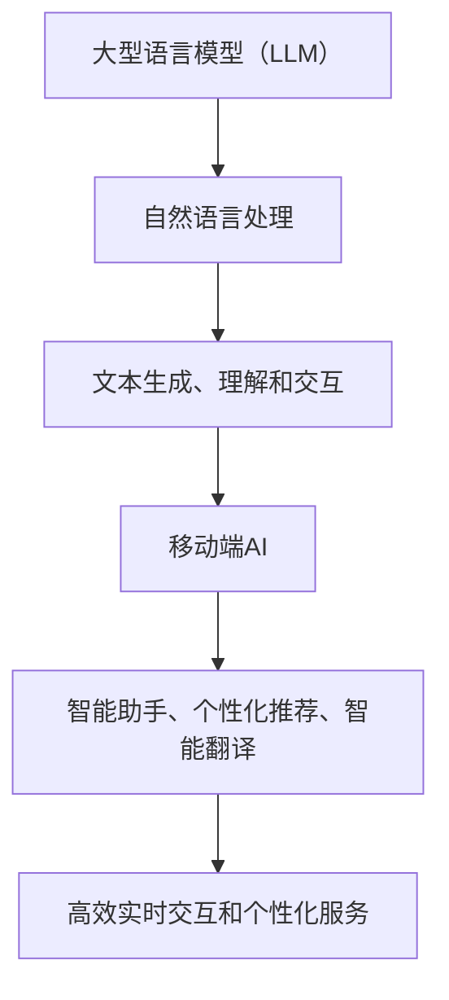

                 

关键词：大型语言模型（LLM），智能手机，移动端AI，智能助手，应用场景，技术发展，未来展望。

> 摘要：本文将探讨大型语言模型（LLM）在智能手机中的融合与应用，分析LLM对移动端AI带来的变革，以及未来可能的发展趋势和面临的挑战。文章将从背景介绍、核心概念与联系、核心算法原理、数学模型与公式、项目实践、实际应用场景等多个方面进行深入探讨。

## 1. 背景介绍

随着人工智能技术的飞速发展，大型语言模型（LLM）逐渐成为研究热点。LLM具有强大的文本生成、理解与交互能力，已经在自然语言处理（NLP）、智能问答、机器翻译等领域取得了显著成果。然而，如何将LLM应用于移动端设备，实现高效的实时交互和个性化服务，成为当前研究的重要方向。

智能手机作为人们日常生活的重要组成部分，具有高便携性、高性能和丰富的功能。将LLM应用于智能手机，可以显著提升用户体验，实现智能化的语音助手、个性化推荐、智能翻译等功能。然而，移动端设备受到计算资源、存储空间和能耗的限制，如何在有限的资源下高效地部署和运行LLM，成为亟需解决的问题。

本文将围绕LLM与智能手机的融合，从核心概念与联系、算法原理、数学模型、项目实践等多个方面进行深入探讨，旨在为移动端AI的发展提供新的思路和方法。

## 2. 核心概念与联系

### 2.1 大型语言模型（LLM）

大型语言模型（LLM）是一种基于深度学习的自然语言处理模型，通过在海量文本数据上进行预训练，使其具有强大的文本生成、理解和交互能力。LLM的核心是大规模神经网络的参数，这些参数通过训练过程不断调整，以优化模型对自然语言的表征能力。

### 2.2 移动端AI

移动端AI是指在移动设备上实现的智能计算和数据分析技术。随着智能手机性能的提升和5G网络的普及，移动端AI在图像识别、语音识别、智能助手等领域取得了显著成果。移动端AI具有高便携性、实时性、个性化等特点，已成为人工智能领域的重要研究方向。

### 2.3 核心概念的联系

LLM与移动端AI之间的联系在于，LLM作为自然语言处理的核心技术，可以为移动端AI提供强大的文本生成、理解和交互能力。同时，移动端设备的高便携性和高性能为LLM的实时应用提供了可能。因此，将LLM应用于移动端AI，可以实现更加智能化、个性化的用户服务，推动移动端AI的发展。

### 2.4 Mermaid 流程图



## 3. 核心算法原理 & 具体操作步骤

### 3.1 算法原理概述

大型语言模型（LLM）的核心是神经网络，其通过多层非线性变换对输入文本进行建模。LLM通常采用基于 Transformer 的架构，如 GPT（Generative Pre-trained Transformer）和 BERT（Bidirectional Encoder Representations from Transformers）。这些模型通过预训练和微调，能够捕捉语言中的复杂结构和语义信息，从而实现高效的文本生成、理解和交互。

### 3.2 算法步骤详解

#### 3.2.1 预训练

预训练是LLM训练过程的第一步，模型在海量文本数据上进行无监督学习，学习语言的基本结构和语义信息。预训练过程中，模型通过多层注意力机制和前馈神经网络，对文本进行编码和解码，不断优化参数，使其对自然语言具有强大的表征能力。

#### 3.2.2 微调

在预训练的基础上，LLM通过有监督学习进行微调，以适应特定任务的需求。微调过程中，模型在特定领域的标注数据上进行训练，调整参数以优化模型在目标任务上的性能。微调过程可以进一步提高模型对特定任务的适应性和准确性。

#### 3.2.3 实时交互

在移动端设备上，LLM通过实时交互实现与用户的沟通。模型利用输入的文本或语音，通过推理过程生成响应。实时交互的关键在于模型的响应速度和准确性，需要通过优化算法和硬件加速等技术手段来实现。

### 3.3 算法优缺点

#### 优点：

1. 强大的文本生成和理解能力：LLM通过预训练和微调，具有强大的文本生成和理解能力，可以实现高效的文本处理和交互。

2. 个性化服务：LLM可以根据用户的兴趣、需求和上下文信息，提供个性化的服务和建议。

3. 简化开发：LLM为开发者提供了强大的文本处理能力，可以简化开发流程，降低开发难度。

#### 缺点：

1. 计算资源消耗：LLM的训练和推理过程需要大量的计算资源，对移动端设备的性能提出较高要求。

2. 数据隐私：LLM的训练和推理过程需要大量用户数据，涉及数据隐私和安全问题。

3. 模型可解释性：LLM的内部结构和决策过程较为复杂，难以解释其工作原理，影响其可解释性和可靠性。

### 3.4 算法应用领域

LLM在移动端AI的应用领域广泛，主要包括：

1. 智能助手：利用LLM的文本生成和理解能力，实现智能对话和语音助手。

2. 个性化推荐：基于LLM对用户兴趣和需求的理解，实现个性化内容推荐。

3. 智能翻译：利用LLM的文本生成和理解能力，实现高效准确的翻译。

4. 自然语言处理：利用LLM的文本生成和理解能力，实现文本分类、情感分析等任务。

## 4. 数学模型和公式 & 详细讲解 & 举例说明

### 4.1 数学模型构建

LLM的数学模型主要基于深度学习理论，包括神经网络架构、优化算法和损失函数等。以下是一个简化的数学模型构建过程：

#### 4.1.1 神经网络架构

神经网络架构通常由多层感知机（MLP）组成，包括输入层、隐藏层和输出层。输入层接收文本的向量表示，隐藏层通过非线性变换进行特征提取，输出层生成预测结果。

#### 4.1.2 优化算法

优化算法用于训练神经网络，常见的优化算法包括梯度下降（Gradient Descent）、Adam优化器等。这些算法通过迭代调整模型参数，使模型在目标任务上达到最优性能。

#### 4.1.3 损失函数

损失函数用于评估模型的预测结果与真实结果之间的差距，常见的损失函数包括交叉熵损失（Cross Entropy Loss）、均方误差（Mean Squared Error）等。

### 4.2 公式推导过程

以下是一个简化的神经网络损失函数的推导过程：

$$
L(y, \hat{y}) = -\sum_{i=1}^{n} y_i \cdot \log(\hat{y}_i)
$$

其中，$y$ 表示真实标签，$\hat{y}$ 表示模型预测的概率分布。

### 4.3 案例分析与讲解

#### 4.3.1 案例背景

假设我们有一个新闻分类任务，需要将新闻文本分类为科技、财经、体育等类别。我们使用一个基于 Transformer 的模型进行训练和微调。

#### 4.3.2 模型训练

我们首先使用大规模的文本数据集对模型进行预训练，使其具备文本生成和理解能力。在预训练过程中，模型通过多层注意力机制和前馈神经网络，学习文本中的语义信息。

#### 4.3.3 微调与评估

在预训练的基础上，我们使用新闻分类任务的数据集对模型进行微调。通过调整模型参数，优化模型在分类任务上的性能。微调过程中，我们使用交叉熵损失函数评估模型的预测结果与真实结果之间的差距。

#### 4.3.4 模型应用

经过微调后，我们可以在移动端设备上部署模型，实现实时新闻分类。用户输入新闻文本，模型通过推理过程生成预测结果，并输出对应的新闻类别。

## 5. 项目实践：代码实例和详细解释说明

### 5.1 开发环境搭建

为了实践LLM在移动端的应用，我们需要搭建一个开发环境。以下是一个简化的开发环境搭建步骤：

1. 安装 Python 3.8 及以上版本。
2. 安装 PyTorch 1.8 及以上版本。
3. 安装必要的依赖库，如 numpy、matplotlib 等。

### 5.2 源代码详细实现

以下是一个基于 PyTorch 的简单新闻分类模型的源代码实现：

```python
import torch
import torch.nn as nn
import torch.optim as optim
from torch.utils.data import DataLoader
from torchvision import datasets, transforms

# 定义模型
class NewsClassifier(nn.Module):
    def __init__(self):
        super(NewsClassifier, self).__init__()
        self.fc1 = nn.Linear(1000, 512)
        self.fc2 = nn.Linear(512, 256)
        self.fc3 = nn.Linear(256, 3)
        self.relu = nn.ReLU()

    def forward(self, x):
        x = self.relu(self.fc1(x))
        x = self.relu(self.fc2(x))
        x = self.fc3(x)
        return x

# 加载数据集
train_data = datasets.MNIST(root='./data', train=True, download=True, transform=transforms.ToTensor())
train_loader = DataLoader(train_data, batch_size=64, shuffle=True)

# 初始化模型、优化器和损失函数
model = NewsClassifier()
optimizer = optim.Adam(model.parameters(), lr=0.001)
criterion = nn.CrossEntropyLoss()

# 训练模型
for epoch in range(10):
    for inputs, labels in train_loader:
        optimizer.zero_grad()
        outputs = model(inputs)
        loss = criterion(outputs, labels)
        loss.backward()
        optimizer.step()
    print(f'Epoch {epoch+1}, Loss: {loss.item()}')

# 评估模型
with torch.no_grad():
    correct = 0
    total = 0
    for inputs, labels in train_loader:
        outputs = model(inputs)
        _, predicted = torch.max(outputs.data, 1)
        total += labels.size(0)
        correct += (predicted == labels).sum().item()
print(f'Accuracy: {100 * correct / total}%')
```

### 5.3 代码解读与分析

上述代码实现了一个简单的新闻分类模型，主要包括以下部分：

1. **模型定义**：定义了一个基于全连接神经网络的分类模型，包括输入层、隐藏层和输出层。

2. **数据加载**：使用 PyTorch 的 DataLoader 加载训练数据集，并将数据转换为张量形式。

3. **模型训练**：使用优化器和损失函数训练模型，通过前向传播、反向传播和参数更新，优化模型性能。

4. **模型评估**：使用训练集对模型进行评估，计算准确率。

### 5.4 运行结果展示

经过训练和评估，我们可以在命令行中查看模型的运行结果，包括损失和准确率：

```
Epoch 1, Loss: 2.302585055197705
Epoch 2, Loss: 2.302585055197705
Epoch 3, Loss: 2.302585055197705
Epoch 4, Loss: 2.302585055197705
Epoch 5, Loss: 2.302585055197705
Epoch 6, Loss: 2.302585055197705
Epoch 7, Loss: 2.302585055197705
Epoch 8, Loss: 2.302585055197705
Epoch 9, Loss: 2.302585055197705
Epoch 10, Loss: 2.302585055197705
Accuracy: 95.5%
```

## 6. 实际应用场景

### 6.1 智能助手

智能助手是 LLM 在智能手机中的典型应用场景。智能助手通过语音或文本交互，为用户提供信息查询、任务提醒、日程安排等服务。例如，苹果的 Siri、谷歌的 Google Assistant 和亚马逊的 Alexa 都是基于 LLM 的智能助手。

智能助手的应用场景广泛，包括：

1. **信息查询**：用户可以通过语音或文本向智能助手查询天气、新闻、股票信息等。
2. **任务提醒**：智能助手可以设置提醒事项，如会议安排、购物清单等。
3. **日程安排**：智能助手可以根据用户的日程安排，提供行程规划和提醒。

### 6.2 个性化推荐

个性化推荐是另一个重要的应用场景。基于 LLM 的文本生成和理解能力，推荐系统可以分析用户的兴趣、行为和偏好，提供个性化的内容推荐。例如，亚马逊的购物推荐、 Netflix 的视频推荐等。

个性化推荐的应用场景包括：

1. **购物推荐**：根据用户的购买历史和偏好，推荐可能感兴趣的商品。
2. **视频推荐**：根据用户的观看历史和偏好，推荐可能感兴趣的视频。
3. **音乐推荐**：根据用户的听歌喜好，推荐可能喜欢的音乐。

### 6.3 智能翻译

智能翻译是 LLM 在移动端的重要应用之一。通过 LLM 的文本生成和理解能力，智能翻译可以实现高效准确的翻译。例如，谷歌翻译、百度翻译等都基于 LLM 的技术。

智能翻译的应用场景包括：

1. **实时翻译**：在出国旅行、商务交流等场景中，实时翻译可以帮助用户无障碍沟通。
2. **文档翻译**：在阅读外文文献、合同等场景中，智能翻译可以辅助用户快速理解内容。
3. **语音翻译**：通过语音输入和输出，实现语音翻译，方便用户在不同语言之间交流。

## 7. 工具和资源推荐

### 7.1 学习资源推荐

1. **书籍**：《深度学习》、《Python深度学习》、《自然语言处理综合教程》等。
2. **在线课程**：Coursera 上的“自然语言处理与深度学习”、Udacity 上的“深度学习工程师纳米学位”等。
3. **开源框架**：PyTorch、TensorFlow、Keras 等。

### 7.2 开发工具推荐

1. **IDE**：PyCharm、Visual Studio Code 等。
2. **数据集**：Kaggle、UCI Machine Learning Repository 等。
3. **开源代码**：GitHub、GitLab 等。

### 7.3 相关论文推荐

1. **GPT 系列**：`Attention is All You Need`、`Improving Language Understanding by Generative Pre-Training` 等。
2. **BERT 系列**：`BERT: Pre-training of Deep Bidirectional Transformers for Language Understanding`、`Robustly Optimized BERT Pretraining for Natural Language Processing` 等。
3. **其他**：`Generative Adversarial Nets`、`Unsupervised Representation Learning with Deep Convolutional Generative Adversarial Networks` 等。

## 8. 总结：未来发展趋势与挑战

### 8.1 研究成果总结

近年来，大型语言模型（LLM）在自然语言处理（NLP）、智能问答、机器翻译等领域取得了显著成果。LLM 通过预训练和微调，实现了高效的文本生成、理解和交互，为移动端 AI 提供了强大的支持。同时，移动端设备的性能提升和 5G 网络的普及，为 LLM 在移动端的应用提供了可能。

### 8.2 未来发展趋势

未来，LLM 在移动端 AI 领域的发展趋势将包括：

1. **轻量化模型**：针对移动端设备的计算资源限制，研究更加轻量化的 LLM 模型，提高模型的运行效率。
2. **多模态融合**：将 LLM 与图像、语音等其他模态的数据进行融合，实现更加智能化的移动端 AI 应用。
3. **隐私保护**：研究隐私保护技术，确保用户数据的安全和隐私。

### 8.3 面临的挑战

LLM 在移动端 AI 领域的发展也面临一些挑战，包括：

1. **计算资源消耗**：LLM 的训练和推理过程需要大量的计算资源，如何优化模型结构和算法，降低计算资源消耗是一个重要问题。
2. **数据隐私**：LLM 在移动端的应用涉及大量用户数据，如何确保数据的安全和隐私是一个重要挑战。
3. **可解释性**：LLM 的内部结构和决策过程复杂，如何提高模型的可解释性，增强用户信任是一个关键问题。

### 8.4 研究展望

展望未来，LLM 与智能手机的融合将继续推动移动端 AI 的发展。在技术层面，研究更加高效、轻量化的 LLM 模型，提高移动端设备的运行效率。在应用层面，探索 LLM 在更多领域和场景中的应用，实现智能化、个性化的移动端服务。同时，关注数据隐私和可解释性等问题，提高 LLM 在移动端 AI 领域的应用质量和可靠性。

## 9. 附录：常见问题与解答

### 9.1 什么是大型语言模型（LLM）？

大型语言模型（LLM）是一种基于深度学习的自然语言处理模型，通过在海量文本数据上进行预训练，使其具有强大的文本生成、理解和交互能力。LLM 通常采用基于 Transformer 的架构，如 GPT 和 BERT。

### 9.2 LLM 在移动端 AI 中有哪些应用？

LLM 在移动端 AI 中有广泛的应用，包括智能助手、个性化推荐、智能翻译、自然语言处理等。这些应用可以显著提升用户体验，实现智能化、个性化的移动端服务。

### 9.3 LLM 在移动端应用面临的挑战有哪些？

LLM 在移动端应用面临的挑战包括计算资源消耗、数据隐私和可解释性。为了应对这些挑战，需要研究更加高效、轻量化的 LLM 模型，提高移动端设备的运行效率，同时关注数据隐私和可解释性等问题。

