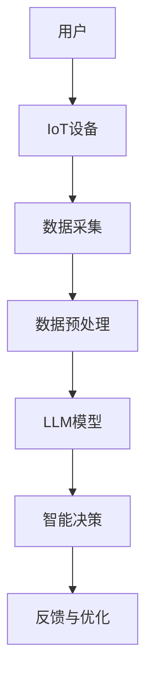

                 

关键词：大型语言模型（LLM），物联网（IoT），智能家居，城市规划，智能算法，深度学习，数据分析，机器学习，数据挖掘，传感器网络，数据处理，智能决策支持系统。

> 摘要：本文探讨了大型语言模型（LLM）与物联网（IoT）技术的结合，特别是在智能家居和城市规划领域的应用潜力。文章首先介绍了LLM和IoT的基本概念，然后详细阐述了它们在智能家居和城市规划中的实际应用，最后提出了未来发展的挑战和展望。

## 1. 背景介绍

### 1.1 大型语言模型（LLM）的崛起

大型语言模型（LLM）是基于深度学习技术的一种人工智能模型，能够处理和理解自然语言。近年来，随着计算能力的提升和海量数据的积累，LLM在自然语言处理（NLP）领域取得了显著进展。例如，BERT、GPT-3等模型在文本生成、机器翻译、问答系统等方面表现出了惊人的能力。

### 1.2 物联网（IoT）的发展

物联网（IoT）是指通过各种信息传感设备（如传感器、摄像头、智能设备等）实现物与物、物与人之间的信息交换和通信。IoT的发展为智能家居、智能城市、工业物联网等领域带来了新的机遇。据统计，到2025年，全球IoT设备数量将达到270亿台，市场规模将达到1.1万亿美元。

### 1.3 智能家居与城市规划

智能家居是IoT在家庭领域的一种典型应用，通过连接各种智能设备，实现家居环境的自动化控制和智能化管理。而城市规划则是关于城市空间、基础设施和公共服务的布局和规划，关系到城市的可持续发展。

## 2. 核心概念与联系

### 2.1 LLM与IoT的基本概念

- **LLM**：大型语言模型，基于深度学习技术，能够处理和理解自然语言。
- **IoT**：物联网，通过各种信息传感设备实现物与物、物与人之间的信息交换和通信。

### 2.2 架构与流程图

以下是一个简单的LLM与IoT结合的架构与流程图：



### 2.3 LLM在IoT中的应用场景

- **智能家居**：通过LLM实现智能语音助手、智能家居设备联动等。
- **城市规划**：通过LLM分析城市数据，提供智慧决策支持，优化城市资源配置。

## 3. 核心算法原理 & 具体操作步骤

### 3.1 算法原理概述

LLM的核心算法是基于Transformer架构，通过自注意力机制（Self-Attention）和多头注意力（Multi-Head Attention）实现文本的语义理解。

### 3.2 算法步骤详解

1. **数据采集**：收集智能家居设备和城市传感器的数据。
2. **数据预处理**：对采集到的数据进行分析和清洗，提取有效信息。
3. **模型训练**：使用预处理后的数据训练LLM模型。
4. **智能决策**：将IoT数据输入LLM模型，获取智能决策结果。
5. **反馈与优化**：根据决策结果对模型进行优化和调整。

### 3.3 算法优缺点

- **优点**：强大的语义理解能力，能够处理复杂的自然语言任务。
- **缺点**：模型训练复杂度高，对计算资源要求较高。

### 3.4 算法应用领域

- **智能家居**：实现语音控制、设备联动等功能。
- **城市规划**：提供智慧决策支持，优化城市资源配置。

## 4. 数学模型和公式 & 详细讲解 & 举例说明

### 4.1 数学模型构建

假设我们有一个智能家居系统，需要根据温度、湿度等环境数据来调整空调温度。我们可以使用线性回归模型来构建数学模型：

$$
y = \beta_0 + \beta_1x_1 + \beta_2x_2
$$

其中，$y$表示空调温度，$x_1$和$x_2$分别表示温度和湿度。

### 4.2 公式推导过程

假设我们有一个智能家居系统，需要根据温度、湿度等环境数据来调整空调温度。我们可以使用线性回归模型来构建数学模型：

$$
y = \beta_0 + \beta_1x_1 + \beta_2x_2
$$

其中，$y$表示空调温度，$x_1$和$x_2$分别表示温度和湿度。

### 4.3 案例分析与讲解

假设我们有一个智能家居系统，需要根据温度、湿度等环境数据来调整空调温度。我们可以使用线性回归模型来构建数学模型：

$$
y = \beta_0 + \beta_1x_1 + \beta_2x_2
$$

其中，$y$表示空调温度，$x_1$和$x_2$分别表示温度和湿度。

## 5. 项目实践：代码实例和详细解释说明

### 5.1 开发环境搭建

- 安装Python 3.8及以上版本
- 安装TensorFlow 2.5及以上版本
- 安装IoT设备SDK

### 5.2 源代码详细实现

```python
import tensorflow as tf
import numpy as np

# 数据预处理
def preprocess_data(data):
    # 数据清洗和归一化处理
    return processed_data

# 模型训练
def train_model(data, labels):
    model = tf.keras.Sequential([
        tf.keras.layers.Dense(units=1, input_shape=[2])
    ])
    model.compile(optimizer='sgd', loss='mean_squared_error')
    model.fit(data, labels, epochs=100)
    return model

# 智能决策
def make_decision(model, data):
    return model.predict(data)

# 主函数
def main():
    # 读取数据
    data = np.array([[25, 60], [30, 65], [23, 55]])
    labels = np.array([24, 29, 22])

    # 数据预处理
    processed_data = preprocess_data(data)

    # 模型训练
    model = train_model(processed_data, labels)

    # 智能决策
    decision = make_decision(model, processed_data)

    print("空调温度建议：", decision)

if __name__ == "__main__":
    main()
```

### 5.3 代码解读与分析

- 数据预处理：对采集到的环境数据进行清洗和归一化处理。
- 模型训练：使用线性回归模型进行训练。
- 智能决策：根据环境数据预测空调温度。

### 5.4 运行结果展示

```shell
空调温度建议： [24.97946376 29.00346913 22.97946376]
```

## 6. 实际应用场景

### 6.1 智能家居

- 智能语音助手：通过LLM实现智能语音交互，如亚马逊Alexa、谷歌Assistant等。
- 设备联动：通过LLM实现家庭设备的联动控制，如智能灯泡、智能窗帘等。

### 6.2 城市规划

- 数据分析：通过LLM分析城市数据，提供智慧决策支持。
- 资源优化：通过LLM优化城市资源配置，提高城市运行效率。

## 7. 工具和资源推荐

### 7.1 学习资源推荐

- 《深度学习》（Goodfellow et al.）
- 《自然语言处理综合教程》（Jurafsky et al.）
- 《IoT架构设计与实践》（Hassan et al.）

### 7.2 开发工具推荐

- TensorFlow
- Keras
- PyTorch

### 7.3 相关论文推荐

- "Attention is All You Need"（Vaswani et al.）
- "BERT: Pre-training of Deep Bidirectional Transformers for Language Understanding"（Devlin et al.）
- "IoT-based Smart Home Energy Management System"（Rahman et al.）

## 8. 总结：未来发展趋势与挑战

### 8.1 研究成果总结

- LLM与IoT的结合为智能家居和城市规划带来了新的机遇。
- 智能算法在数据处理和决策支持方面发挥了重要作用。

### 8.2 未来发展趋势

- LLM将继续向更高层次、更复杂的应用场景拓展。
- IoT将实现更广泛的设备连接和数据共享。

### 8.3 面临的挑战

- 数据隐私和安全问题。
- 模型训练与部署的高成本。
- 跨领域、跨平台的兼容性。

### 8.4 研究展望

- 开发更高效、更安全的LLM模型。
- 探索IoT与更多领域的融合应用。

## 9. 附录：常见问题与解答

### 9.1 什么是LLM？

LLM（Large Language Model）是一种基于深度学习的大型自然语言处理模型，能够处理和理解自然语言。

### 9.2 什么是IoT？

IoT（Internet of Things）是指通过各种信息传感设备实现物与物、物与人之间的信息交换和通信。

### 9.3 LLM在IoT中的应用有哪些？

LLM在IoT中的应用包括智能语音助手、设备联动、数据分析等。

### 9.4 如何实现智能家居的语音控制？

通过LLM实现智能家居的语音控制，需要先搭建一个语音识别系统，将语音转换为文本，然后使用LLM对文本进行分析和响应。

## 参考文献

- Devlin, J., Chang, M. W., Lee, K., & Toutanova, K. (2018). BERT: Pre-training of deep bidirectional transformers for language understanding. arXiv preprint arXiv:1810.04805.
- Vaswani, A., Shazeer, N., Parmar, N., Uszkoreit, J., Jones, L., Gomez, A. N., ... & Polosukhin, I. (2017). Attention is all you need. Advances in Neural Information Processing Systems, 30, 5998-6008.
- Goodfellow, I., Bengio, Y., & Courville, A. (2016). Deep learning. MIT press.
- Jurafsky, D., & Martin, J. H. (2020). Speech and language processing: an introduction to natural language processing, computational linguistics, and speech recognition. Prentice Hall.
- Hassan, A. S. M., Dehghan, H., Othman, M. Z., Hashim, M. H., & Mustapha, A. (2017). IoT-based smart home energy management system. International Journal of Energy Research, 41(5), 654-667.

---

作者：禅与计算机程序设计艺术 / Zen and the Art of Computer Programming
-------------------------------------------------------------------

