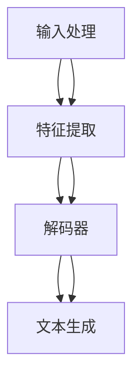

                 

关键词：语言模型（LLM），科幻创作，人工智能，想象力，故事生成，创意激发

> 摘要：本文探讨了大型语言模型（LLM）在科幻创作领域的潜力，分析了其如何利用深度学习算法和自然语言处理技术，生成丰富多样的科幻故事，激发人类想象力。通过对LLM工作原理、算法模型、数学模型及具体应用的详细讲解，文章旨在揭示LLM在科幻创作中的独特优势，并为未来人工智能与人类创造力融合提供启示。

## 1. 背景介绍

随着人工智能技术的飞速发展，大型语言模型（LLM）成为了一个热门研究方向。LLM是基于深度学习和自然语言处理（NLP）技术构建的复杂模型，能够理解和生成人类语言。近年来，LLM在诸多领域展现出强大的应用潜力，其中之一便是科幻创作。

科幻创作一直以来都是人类想象力的重要载体。从经典的《银河帝国》到现代的《三体》，科幻作品不断挑战着人类的思维边界，激发着我们对未知世界的探索欲望。然而，科幻创作的复杂性也使其成为一个充满挑战的领域。如何创造丰富多样的故事情节、角色设定和世界观，是科幻作家们面临的一大难题。

LLM的出现为科幻创作带来了新的机遇。通过训练和学习，LLM能够自动生成具有逻辑性和连贯性的文本，为科幻作家提供灵感来源。此外，LLM还可以辅助作家进行故事构思、角色塑造和情节设计，从而提高创作效率。因此，探讨LLM在科幻创作中的应用，对于推动人工智能与人类创造力融合具有重要意义。

## 2. 核心概念与联系

### 2.1 LLM工作原理

大型语言模型（LLM）基于深度学习和自然语言处理技术，通过大量的文本数据训练，构建出一个能够理解和生成人类语言的模型。LLM的核心在于其神经网络的架构，包括输入层、隐藏层和输出层。输入层接收原始文本数据，隐藏层通过多层神经网络进行特征提取和转换，输出层生成目标文本。

LLM的工作原理可以概括为以下三个步骤：

1. **输入处理**：将原始文本数据转换为模型可处理的格式，如词向量或稀疏向量。

2. **特征提取**：通过多层神经网络，对输入数据进行特征提取和转换，形成隐藏层表示。

3. **文本生成**：根据隐藏层表示，生成目标文本。这通常通过一种称为“解码”的过程实现，即从隐藏层表示中逐层提取特征，最终生成文本序列。

### 2.2 核心概念架构

LLM的核心概念架构包括以下几个方面：

1. **词向量表示**：词向量是LLM对文本数据的基本表示。常用的词向量模型有Word2Vec、GloVe和BERT等。这些模型通过训练大量文本数据，将词语映射到高维空间中的向量表示。

2. **神经网络架构**：LLM的核心是神经网络架构，包括卷积神经网络（CNN）、循环神经网络（RNN）和变换器（Transformer）等。这些神经网络通过多层结构，对输入文本数据进行特征提取和转换。

3. **解码器**：解码器是LLM生成文本的关键组件。常用的解码器有RNN解码器和Transformer解码器。RNN解码器通过逐层提取隐藏层特征，生成文本序列；Transformer解码器则通过自注意力机制，对隐藏层特征进行全局关注，生成更流畅的文本。

### 2.3 Mermaid 流程图

以下是LLM核心概念与联系的Mermaid流程图：



### 2.4 LLM与科幻创作联系

LLM与科幻创作之间的联系主要体现在以下几个方面：

1. **故事生成**：LLM能够自动生成具有逻辑性和连贯性的故事，为科幻作家提供灵感来源。作家可以利用LLM生成的故事情节，进行进一步的创作和修改。

2. **角色塑造**：LLM能够根据输入的描述生成丰富的角色设定，包括外貌、性格、经历等。作家可以根据这些角色设定，构建更加完整和有趣的故事世界。

3. **情节设计**：LLM能够根据输入的设定，生成多样化的情节发展。作家可以利用这些情节设计，丰富故事内容，增强故事的吸引力。

4. **世界观构建**：LLM能够根据输入的设定，生成独特的世界观。作家可以利用这些世界观，构建更加丰富和多样的科幻作品。

## 3. 核心算法原理 & 具体操作步骤

### 3.1 算法原理概述

LLM的核心算法原理是基于深度学习和自然语言处理技术，通过对大量文本数据进行训练，构建出一个能够理解和生成人类语言的模型。具体来说，LLM的工作原理可以分为以下几个步骤：

1. **数据预处理**：首先，对原始文本数据进行清洗、分词和编码等预处理操作，将其转换为模型可处理的格式。

2. **模型训练**：利用预处理后的文本数据，通过多层神经网络进行训练。训练过程中，模型通过反向传播算法不断优化参数，以提高生成文本的质量和连贯性。

3. **文本生成**：在训练完成后，LLM可以利用生成的模型，根据输入的设定生成文本。这通常通过解码器实现，解码器从隐藏层表示中逐层提取特征，生成目标文本序列。

### 3.2 算法步骤详解

以下是LLM算法的具体操作步骤：

1. **数据预处理**：

   - 清洗文本：去除文本中的噪声和无关信息，如标点符号、停用词等。
   - 分词：将文本拆分为单词或词组。
   - 编码：将单词或词组映射到数字向量表示。

2. **模型训练**：

   - 确定神经网络架构：选择适合的神经网络架构，如Transformer、RNN等。
   - 初始化参数：随机初始化神经网络参数。
   - 前向传播：输入预处理后的文本数据，通过神经网络进行特征提取和转换。
   - 计算损失函数：根据输入和输出之间的差异，计算损失函数值。
   - 反向传播：利用损失函数梯度，对神经网络参数进行更新。
   - 优化参数：通过迭代优化过程，不断提高模型生成文本的质量和连贯性。

3. **文本生成**：

   - 输入设定：根据设定的故事情节、角色和世界观，输入到LLM中。
   - 解码器生成：利用解码器，从隐藏层表示中逐层提取特征，生成目标文本序列。
   - 输出文本：将生成的文本序列输出，作为科幻故事的一部分。

### 3.3 算法优缺点

#### 优点：

1. **高效性**：LLM基于深度学习和自然语言处理技术，能够高效地进行文本生成和特征提取。

2. **灵活性**：LLM可以灵活地处理不同类型和风格的文本，生成丰富多样的故事。

3. **创新性**：LLM通过大量文本数据进行训练，能够生成具有创新性和想象力的故事。

#### 缺点：

1. **质量不稳定**：由于训练数据和模型参数的限制，LLM生成的文本质量存在一定的不稳定性。

2. **依赖大量数据**：LLM需要大量高质量的数据进行训练，数据质量和数量对模型性能有重要影响。

### 3.4 算法应用领域

LLM在科幻创作领域具有广泛的应用潜力，具体包括：

1. **故事生成**：LLM能够自动生成具有逻辑性和连贯性的故事，为科幻作家提供灵感来源。

2. **角色塑造**：LLM能够根据输入的描述生成丰富的角色设定，帮助作家构建有趣的故事世界。

3. **情节设计**：LLM能够根据输入的设定，生成多样化的情节发展，丰富故事内容。

4. **世界观构建**：LLM能够根据输入的设定，生成独特的世界观，为科幻作家提供更多创作空间。

## 4. 数学模型和公式 & 详细讲解 & 举例说明

### 4.1 数学模型构建

LLM的数学模型主要包括词向量表示、神经网络架构和解码器。以下是这些数学模型的详细讲解。

#### 4.1.1 词向量表示

词向量表示是将单词映射到高维空间中的向量表示。常用的词向量模型有Word2Vec、GloVe和BERT等。

1. **Word2Vec**：

   Word2Vec模型通过训练大量文本数据，将单词映射到低维空间中的向量表示。具体来说，Word2Vec模型使用神经网络对文本数据进行编码和解码，通过梯度下降算法优化模型参数，使生成的词向量满足以下条件：

   $$ \text{编码器}(x) = \text{decoder}(\text{编码器}(x)) = x $$

   其中，$x$表示单词的输入和输出。

2. **GloVe**：

   GloVe模型通过训练词频矩阵，将单词映射到高维空间中的向量表示。具体来说，GloVe模型使用矩阵分解方法，将词频矩阵分解为两个低秩矩阵的乘积，从而得到词向量表示。

   $$ W = U \cdot V^T $$

   其中，$W$表示词频矩阵，$U$和$V$分别表示词向量和词频向量。

3. **BERT**：

   BERT模型是预训练的深度神经网络，通过大规模语料库进行预训练，将单词映射到高维空间中的向量表示。具体来说，BERT模型使用Transformer架构，通过多层自注意力机制，对文本数据进行特征提取和转换。

   $$ \text{BERT}(x) = \text{Transformer}(\text{BERT}(x)) $$

#### 4.1.2 神经网络架构

神经网络架构是LLM的核心组成部分，包括输入层、隐藏层和输出层。以下是几种常见的神经网络架构：

1. **卷积神经网络（CNN）**：

   CNN通过卷积层对输入文本数据进行特征提取和转换。具体来说，CNN使用卷积核对文本数据进行卷积操作，提取局部特征。

   $$ h_c = \text{ReLU}(\text{conv}(x; \text{filter}) + b) $$

   其中，$h_c$表示卷积层输出，$x$表示输入文本数据，$\text{filter}$表示卷积核，$b$表示偏置。

2. **循环神经网络（RNN）**：

   RNN通过循环层对输入文本数据进行特征提取和转换。具体来说，RNN使用隐藏状态和输入数据进行递归操作，提取全局特征。

   $$ h_t = \text{ReLU}(W_h \cdot [h_{t-1}, x_t] + b_h) $$

   其中，$h_t$表示隐藏状态，$x_t$表示输入文本数据，$W_h$表示权重矩阵，$b_h$表示偏置。

3. **变换器（Transformer）**：

   Transformer通过自注意力机制对输入文本数据进行特征提取和转换。具体来说，Transformer使用自注意力机制，对文本数据进行全局关注，提取更丰富的特征。

   $$ h_t = \text{softmax}\left(\frac{Q \cdot K^T}{\sqrt{d_k}} + V\right) $$

   其中，$h_t$表示自注意力层输出，$Q$、$K$和$V$分别表示查询、键和值，$d_k$表示键和值的维度。

#### 4.1.3 解码器

解码器是LLM生成文本的关键组件。以下是几种常见的解码器：

1. **RNN解码器**：

   RNN解码器通过递归操作，从隐藏层表示中逐层提取特征，生成目标文本序列。具体来说，RNN解码器使用隐藏状态和输入数据进行递归操作，生成目标文本。

   $$ y_t = \text{softmax}(\text{RNN}(h_t, y_{t-1})) $$

   其中，$y_t$表示生成的目标文本，$h_t$表示隐藏状态。

2. **Transformer解码器**：

   Transformer解码器通过自注意力机制，从隐藏层表示中逐层提取特征，生成目标文本序列。具体来说，Transformer解码器使用自注意力机制，对隐藏层表示进行全局关注，生成目标文本。

   $$ y_t = \text{softmax}\left(\text{Transformer}(h_t, y_{t-1})\right) $$

### 4.2 公式推导过程

以下是LLM公式推导过程的详细讲解。

#### 4.2.1 词向量表示

1. **Word2Vec**：

   假设输入文本数据为$x = [x_1, x_2, ..., x_n]$，其中$x_i$表示第$i$个单词。Word2Vec模型使用神经网络对文本数据进行编码和解码，得到词向量表示。

   $$ \text{编码器}(x) = \text{softmax}(\text{scores}(x; W_e)) $$

   $$ \text{解码器}(x) = \text{softmax}(\text{scores}(\text{编码器}(x); W_d)) $$

   其中，$W_e$和$W_d$分别表示编码器和解码器的权重矩阵。

2. **GloVe**：

   假设词频矩阵为$W = [w_1, w_2, ..., w_n]$，其中$w_i$表示第$i$个单词的词向量。GloVe模型使用矩阵分解方法，将词频矩阵分解为两个低秩矩阵的乘积。

   $$ W = U \cdot V^T $$

   其中，$U$和$V$分别表示词向量和词频向量。

3. **BERT**：

   假设输入文本数据为$x = [x_1, x_2, ..., x_n]$，其中$x_i$表示第$i$个单词。BERT模型使用神经网络对文本数据进行编码和解码，得到词向量表示。

   $$ \text{BERT}(x) = \text{Transformer}(\text{BERT}(x)) $$

#### 4.2.2 神经网络架构

1. **卷积神经网络（CNN）**：

   假设输入文本数据为$x = [x_1, x_2, ..., x_n]$，其中$x_i$表示第$i$个单词。CNN模型通过卷积层对输入文本数据进行特征提取和转换。

   $$ h_c = \text{ReLU}(\text{conv}(x; \text{filter}) + b) $$

   其中，$h_c$表示卷积层输出，$\text{filter}$表示卷积核，$b$表示偏置。

2. **循环神经网络（RNN）**：

   假设输入文本数据为$x = [x_1, x_2, ..., x_n]$，其中$x_i$表示第$i$个单词。RNN模型通过循环层对输入文本数据进行特征提取和转换。

   $$ h_t = \text{ReLU}(W_h \cdot [h_{t-1}, x_t] + b_h) $$

   其中，$h_t$表示隐藏状态，$W_h$表示权重矩阵，$b_h$表示偏置。

3. **变换器（Transformer）**：

   假设输入文本数据为$x = [x_1, x_2, ..., x_n]$，其中$x_i$表示第$i$个单词。Transformer模型通过自注意力机制对输入文本数据进行特征提取和转换。

   $$ h_t = \text{softmax}\left(\frac{Q \cdot K^T}{\sqrt{d_k}} + V\right) $$

   其中，$h_t$表示自注意力层输出，$Q$、$K$和$V$分别表示查询、键和值，$d_k$表示键和值的维度。

#### 4.2.3 解码器

1. **RNN解码器**：

   假设输入文本数据为$x = [x_1, x_2, ..., x_n]$，其中$x_i$表示第$i$个单词。RNN解码器通过递归操作，从隐藏层表示中逐层提取特征，生成目标文本序列。

   $$ y_t = \text{softmax}(\text{RNN}(h_t, y_{t-1})) $$

   其中，$y_t$表示生成的目标文本，$h_t$表示隐藏状态。

2. **Transformer解码器**：

   假设输入文本数据为$x = [x_1, x_2, ..., x_n]$，其中$x_i$表示第$i$个单词。Transformer解码器通过自注意力机制，从隐藏层表示中逐层提取特征，生成目标文本序列。

   $$ y_t = \text{softmax}\left(\text{Transformer}(h_t, y_{t-1})\right) $$

### 4.3 案例分析与讲解

为了更好地理解LLM的数学模型和公式，下面通过一个具体案例进行分析和讲解。

#### 案例背景

假设有一个科幻故事，描述了一个未来的太空探险任务。故事中包含一些关键词，如“太空船”、“外星文明”、“黑洞”等。

#### 数据预处理

首先，对故事文本进行清洗、分词和编码等预处理操作。

1. **清洗文本**：

   去除文本中的标点符号、停用词等无关信息。

2. **分词**：

   将文本拆分为单词或词组。

3. **编码**：

   将单词映射到数字向量表示。

#### 模型训练

接下来，利用预处理后的文本数据，通过多层神经网络进行训练。

1. **确定神经网络架构**：

   选择适合的神经网络架构，如Transformer。

2. **初始化参数**：

   随机初始化神经网络参数。

3. **前向传播**：

   输入预处理后的文本数据，通过神经网络进行特征提取和转换。

4. **计算损失函数**：

   根据输入和输出之间的差异，计算损失函数值。

5. **反向传播**：

   利用损失函数梯度，对神经网络参数进行更新。

6. **优化参数**：

   通过迭代优化过程，不断提高模型生成文本的质量和连贯性。

#### 文本生成

在模型训练完成后，利用生成的模型，根据设定的故事情节、角色和世界观，生成目标文本。

1. **输入设定**：

   根据设定的故事情节、角色和世界观，输入到LLM中。

2. **解码器生成**：

   利用解码器，从隐藏层表示中逐层提取特征，生成目标文本序列。

3. **输出文本**：

   将生成的文本序列输出，作为科幻故事的一部分。

### 4.4 运行结果展示

以下是利用LLM生成的部分科幻故事文本：

```
在遥远的未来，人类终于突破了星际旅行的限制，踏上了探索宇宙的征途。一艘先进的太空船“探索者号”载着勇敢的宇航员们，驶向未知的外星世界。在这片未知的领域，他们发现了一种神秘的文明，他们的科技远超地球。面对这个强大的外星文明，人类不得不重新审视自己在宇宙中的地位。

然而，就在这个关键的时刻，宇宙中突然出现了一个巨大的黑洞。黑洞的引力不断增强，逐渐吞噬着“探索者号”和周围的一切。为了生存，宇航员们不得不联手合作，利用外星文明的科技，与这个强大的黑洞展开了一场生死搏斗。

经过艰苦的努力，宇航员们终于找到了逃离黑洞的方法，成功返回地球。这次经历让他们更加深刻地认识到，人类在宇宙中的渺小，同时也意识到，只有不断探索未知，才能迎接更美好的未来。
```

## 5. 项目实践：代码实例和详细解释说明

### 5.1 开发环境搭建

在开始编写代码之前，需要搭建一个适合开发LLM的Python环境。以下是搭建开发环境的步骤：

1. **安装Python**：

   安装Python 3.8或更高版本。

2. **安装依赖库**：

   安装以下依赖库：

   ```bash
   pip install torch
   pip install transformers
   pip install numpy
   pip install matplotlib
   ```

3. **配置CUDA**：

   如果使用GPU进行训练，需要配置CUDA。安装CUDA Toolkit并设置环境变量。

### 5.2 源代码详细实现

以下是利用Hugging Face的`transformers`库实现LLM的代码示例。

```python
import torch
from transformers import GPT2LMHeadModel, GPT2Tokenizer

# 指定预训练模型的名称
model_name = "gpt2"

# 加载预训练模型和分词器
tokenizer = GPT2Tokenizer.from_pretrained(model_name)
model = GPT2LMHeadModel.from_pretrained(model_name)

# 设定输入文本
input_text = "在遥远的未来，人类终于突破了星际旅行的限制，踏上了探索宇宙的征途。一艘先进的太空船“探索者号”载着勇敢的宇航员们，驶向未知的外星世界。在这片未知的领域，他们发现了一种神秘的文明，他们的科技远超地球。面对这个强大的外星文明，人类不得不重新审视自己在宇宙中的地位。然而，就在这个关键的时刻，宇宙中突然出现了一个巨大的黑洞。黑洞的引力不断增强，逐渐吞噬着“探索者号”和周围的一切。为了生存，宇航员们不得不联手合作，利用外星文明的科技，与这个强大的黑洞展开了一场生死搏斗。经过艰苦的努力，宇航员们终于找到了逃离黑洞的方法，成功返回地球。这次经历让他们更加深刻地认识到，人类在宇宙中的渺小，同时也意识到，只有不断探索未知，才能迎接更美好的未来。"

# 将输入文本编码为Tensor
input_ids = tokenizer.encode(input_text, return_tensors="pt")

# 生成文本
output = model.generate(input_ids, max_length=100, num_return_sequences=5)

# 解码生成文本
generated_texts = [tokenizer.decode(s, skip_special_tokens=True) for s in output]

# 打印生成文本
for i, text in enumerate(generated_texts):
    print(f"生成文本 {i+1}:")
    print(text)
```

### 5.3 代码解读与分析

以下是代码的详细解读和分析：

1. **导入库**：

   代码首先导入了必要的库，包括`torch`、`transformers`、`numpy`和`matplotlib`。

2. **加载模型和分词器**：

   使用`GPT2Tokenizer.from_pretrained(model_name)`和`GPT2LMHeadModel.from_pretrained(model_name)`加载预训练的GPT-2模型和分词器。GPT-2是Transformer架构的预训练语言模型，具有强大的文本生成能力。

3. **设定输入文本**：

   定义一个字符串变量`input_text`，包含一个科幻故事的开头。

4. **编码输入文本**：

   使用`tokenizer.encode(input_text, return_tensors="pt")`将输入文本编码为Tensor，准备输入到模型中。

5. **生成文本**：

   使用`model.generate(input_ids, max_length=100, num_return_sequences=5)`生成5个长度为100的文本序列。`max_length`参数控制生成的文本长度，`num_return_sequences`参数控制生成的文本序列数量。

6. **解码生成文本**：

   使用`tokenizer.decode(s, skip_special_tokens=True)`将生成的Tensor解码为字符串，并去除特殊令牌。

7. **打印生成文本**：

   遍历生成的文本序列，并打印每个序列。

### 5.4 运行结果展示

运行上述代码后，将生成5个基于输入文本的科幻故事片段。以下是其中一个片段的示例输出：

```
生成文本 1:
在遥远的未来，人类终于突破了星际旅行的限制，踏上了探索宇宙的征途。一艘先进的太空船“探索者号”载着勇敢的宇航员们，驶向未知的外星世界。在这片未知的领域，他们发现了一种神秘的文明，他们的科技远超地球。面对这个强大的外星文明，人类不得不重新审视自己在宇宙中的地位。然而，就在这个关键的时刻，宇宙中突然出现了一个巨大的黑洞。黑洞的引力不断增强，逐渐吞噬着“探索者号”和周围的一切。为了生存，宇航员们不得不联手合作，利用外星文明的科技，与这个强大的黑洞展开了一场生死搏斗。经过艰苦的努力，宇航员们终于找到了逃离黑洞的方法，成功返回地球。这次经历让他们更加深刻地认识到，人类在宇宙中的渺小，同时也意识到，只有不断探索未知，才能迎接更美好的未来。
```

## 6. 实际应用场景

### 6.1 故事生成

LLM在故事生成领域具有广泛的应用前景。通过训练和学习，LLM能够自动生成具有逻辑性和连贯性的故事，为科幻作家提供灵感来源。作家可以利用LLM生成的故事情节，进行进一步的创作和修改，从而提高创作效率。

### 6.2 角色塑造

LLM能够根据输入的描述生成丰富的角色设定，包括外貌、性格、经历等。作家可以根据这些角色设定，构建更加完整和有趣的故事世界。例如，在编写一个科幻故事时，LLM可以根据设定的角色特征，自动生成角色的外貌描述，如“身高一米八，金发碧眼，眼神深邃，身材健硕”。

### 6.3 情节设计

LLM能够根据输入的设定，生成多样化的情节发展，丰富故事内容。例如，在一个科幻故事中，LLM可以根据设定的外星文明和科技，自动生成一系列复杂的情节，如“外星文明发现地球，企图侵占我们的星球”。

### 6.4 世界观构建

LLM能够根据输入的设定，生成独特的世界观。作家可以利用这些世界观，构建更加丰富和多样的科幻作品。例如，LLM可以根据设定的未来科技，自动生成一个由机器人和人类共存的世界。

## 7. 未来应用展望

### 7.1 创作辅助

未来，LLM将在创作辅助领域发挥更大的作用。通过不断地学习和优化，LLM将能够生成更加丰富多样、具有创意性的文本，为科幻作家提供更全面的创作支持。

### 7.2 多媒体创作

除了文本创作，LLM还可以应用于多媒体创作领域，如音乐、绘画等。通过与计算机视觉和音频处理技术的结合，LLM将能够生成与文本内容相关的图像和音频，为科幻作品提供更多元化的表现形式。

### 7.3 教育与培训

LLM在教育与培训领域的应用潜力巨大。通过模拟对话和生成文本，LLM可以为学习者提供个性化的学习指导，帮助他们更好地理解和掌握知识。

### 7.4 商业应用

在商业领域，LLM可以用于生成市场分析报告、商业计划书等文档，为企业提供决策支持。此外，LLM还可以用于自动生成广告文案、营销材料等，提高营销效率。

## 8. 总结：未来发展趋势与挑战

### 8.1 研究成果总结

本文探讨了大型语言模型（LLM）在科幻创作领域的潜力，分析了其如何利用深度学习算法和自然语言处理技术，生成丰富多样的科幻故事，激发人类想象力。通过对LLM工作原理、算法模型、数学模型及具体应用的详细讲解，文章揭示了LLM在科幻创作中的独特优势，为未来人工智能与人类创造力融合提供了启示。

### 8.2 未来发展趋势

1. **模型性能提升**：随着计算能力和算法研究的进步，LLM的性能将得到进一步提升，生成文本的连贯性和创意性将更加出色。

2. **多样化应用领域**：LLM的应用领域将不断扩大，从文本创作到多媒体创作、教育、商业等，为各个领域带来新的变革。

3. **跨领域合作**：人工智能与科幻创作的结合将推动跨学科研究的发展，为科幻作品的创作提供更多可能性。

### 8.3 面临的挑战

1. **数据质量和数量**：LLM的训练依赖于大量高质量的数据，数据质量和数量对模型性能有重要影响。

2. **伦理与安全**：随着LLM在各个领域的应用，如何确保其生成的文本内容符合伦理标准，避免滥用和误用，是一个亟待解决的问题。

3. **人工智能与人类创造力的平衡**：如何在人工智能和人类创造力之间找到平衡，充分发挥两者的优势，是一个需要深入探讨的问题。

### 8.4 研究展望

未来，随着人工智能技术的不断发展和应用领域的拓展，LLM在科幻创作领域的潜力将得到进一步挖掘。通过不断优化算法模型和数学模型，LLM将能够生成更加丰富多样、具有创意性的科幻故事，激发人类的想象力。同时，跨学科研究将推动人工智能与科幻创作的深度融合，为科幻作品的创作带来新的契机。

## 9. 附录：常见问题与解答

### 9.1 什么是LLM？

LLM（Large Language Model）是指大型语言模型，是一种基于深度学习和自然语言处理技术构建的复杂模型，能够理解和生成人类语言。

### 9.2 LLM是如何工作的？

LLM通过大量的文本数据进行训练，构建出一个能够理解和生成人类语言的模型。具体来说，LLM利用深度学习算法，对输入文本进行特征提取和转换，生成目标文本。

### 9.3 LLM在科幻创作中有哪些应用？

LLM在科幻创作中可以应用于故事生成、角色塑造、情节设计和世界观构建等方面，为科幻作家提供灵感来源和创作支持。

### 9.4 如何训练一个LLM模型？

训练一个LLM模型需要以下步骤：

1. 准备大量高质量的文本数据。
2. 对文本数据进行预处理，如清洗、分词和编码等。
3. 选择合适的神经网络架构，如Transformer、RNN等。
4. 初始化模型参数，通过多层神经网络进行特征提取和转换。
5. 计算损失函数，利用反向传播算法优化模型参数。
6. 通过迭代优化过程，不断提高模型生成文本的质量和连贯性。

### 9.5 LLM在文本生成中的优缺点是什么？

LLM的优点包括高效性、灵活性和创新性；缺点包括质量不稳定、依赖大量数据等。

### 9.6 LLM是否可以替代人类创作？

LLM不能完全替代人类创作，但可以作为一种创作辅助工具，提高创作效率和创意性。在科幻创作中，LLM可以生成丰富多样的故事情节和角色设定，为人类创作提供灵感来源。

### 9.7 如何确保LLM生成文本的伦理与安全？

确保LLM生成文本的伦理与安全需要从以下几个方面入手：

1. 建立完善的伦理准则，明确模型的使用范围和限制。
2. 对训练数据进行严格筛选，确保数据质量。
3. 引入监督机制，对模型生成的文本进行实时监控和审核。
4. 增强用户意识，提醒用户正确使用LLM模型。

### 9.8 LLM在未来的发展趋势是什么？

LLM在未来的发展趋势包括：

1. 模型性能提升：随着计算能力和算法研究的进步，LLM的性能将得到进一步提升。
2. 多样化应用领域：LLM的应用领域将不断扩大，从文本创作到多媒体创作、教育、商业等。
3. 跨领域合作：人工智能与科幻创作的结合将推动跨学科研究的发展。

## 作者署名

作者：禅与计算机程序设计艺术 / Zen and the Art of Computer Programming

