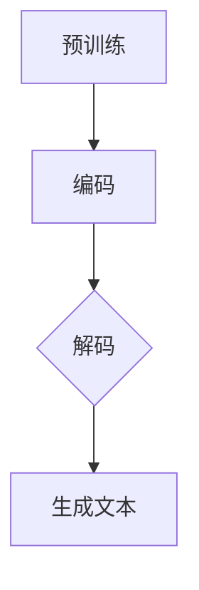

                 

关键词：大型语言模型（LLM）、科幻创作、想象力、技术语言、深度学习、自然语言处理、算法原理、项目实践、数学模型、代码实例。

## 摘要

本文旨在探讨大型语言模型（LLM）在科幻创作中的应用，以及如何通过技术手段激发人类的想象力。我们将深入分析LLM的核心概念和架构，详细解读其算法原理和数学模型，并结合具体案例进行代码实践。通过本文，读者将了解LLM在科幻创作中的巨大潜力，并思考未来技术在文学领域的应用前景。

## 1. 背景介绍

科幻创作是人类对未知世界和未来想象的产物，它不仅反映了人类社会的发展轨迹，更激发了无数人对未来的憧憬。然而，随着科技的发展，传统的科幻创作方式逐渐显得力不从心。此时，人工智能技术，特别是大型语言模型（LLM），为科幻创作带来了新的可能性。

LLM是一种基于深度学习技术的自然语言处理模型，其核心在于通过大量文本数据进行训练，使得模型具备理解和生成自然语言的能力。这种能力使得LLM在文本生成、翻译、问答等领域表现出色。近年来，随着计算能力和数据量的不断提升，LLM的性能得到了显著提升，为科幻创作提供了强大的技术支持。

本文将围绕LLM在科幻创作中的应用，探讨其核心概念、算法原理和数学模型，并通过具体案例进行代码实践，以展示LLM在激发人类想象力方面的潜力。

## 2. 核心概念与联系

### 2.1. 大型语言模型（LLM）的原理

大型语言模型（LLM）是一种基于神经网络的自然语言处理模型，其核心原理是通过学习大量文本数据，建立对自然语言的深度理解。LLM的训练过程主要包括两个阶段：预训练和微调。

1. **预训练**：在预训练阶段，LLM使用大规模文本数据进行无监督学习，学习自然语言的统计规律和语义关系。预训练过程通常包括词嵌入、编码器和解码器等关键组件。

2. **微调**：在微调阶段，LLM使用特定任务的数据进行有监督学习，以适应特定应用场景。微调过程通常包括数据预处理、模型调整和性能评估等步骤。

### 2.2. 自然语言处理（NLP）的架构

自然语言处理（NLP）是一种跨学科领域，涉及语言学、计算机科学和人工智能等多个方面。NLP的架构主要包括以下几个关键组件：

1. **词嵌入（Word Embedding）**：词嵌入是将自然语言中的单词映射到高维空间中的向量表示。词嵌入技术能够捕捉单词的语义和语法信息，为后续的NLP任务提供基础。

2. **编码器（Encoder）**：编码器是一种神经网络结构，用于将输入文本转换为固定长度的向量表示。编码器通常采用卷积神经网络（CNN）或递归神经网络（RNN）等深度学习模型。

3. **解码器（Decoder）**：解码器是将编码器输出的向量表示转换为目标文本的神经网络结构。解码器通常采用循环神经网络（RNN）或变换器（Transformer）等模型。

4. **注意力机制（Attention Mechanism）**：注意力机制是一种用于提高神经网络处理长序列数据的能力的机制。注意力机制能够使得神经网络在生成目标文本时，根据上下文信息选择性地关注重要部分。

### 2.3. Mermaid 流程图

以下是一个简单的Mermaid流程图，展示了LLM在自然语言处理中的应用流程：



在这个流程图中，A表示预训练阶段，B表示编码阶段，C表示解码阶段，D表示生成文本阶段。通过这个流程，我们可以看到LLM如何从输入文本到生成文本的整个过程。

### 2.4. LLM在科幻创作中的应用

在科幻创作中，LLM的应用主要体现在文本生成、故事情节构建和角色塑造等方面。通过LLM，我们可以快速生成大量创意文本，为科幻故事的创作提供灵感。以下是一个简单的例子：

```python
import random

# 随机生成一个故事情节
story_genre = random.choice(["太空探险", "时间旅行", "机器人", "外星人"])
story_background = random.choice(["一场危机", "一次探险", "一个发现", "一场战斗"])
story protagonist = random.choice(["一位科学家", "一名飞行员", "一个机器人", "一个外星人"])

# 构建故事情节
story = f"在一个{story_background}的{story_genre}中，{protagonist}需要克服重重困难，拯救世界。"

print(story)
```

运行上述代码，我们可以得到一个类似以下的故事情节：

"在一场危机的太空探险中，一位科学家需要克服重重困难，拯救世界。"

通过这样的文本生成方式，LLM为科幻创作提供了无限的创意可能。

## 3. 核心算法原理 & 具体操作步骤

### 3.1. 算法原理概述

大型语言模型（LLM）的核心算法原理是基于深度学习的自然语言处理技术。具体来说，LLM通过以下步骤进行文本生成：

1. **输入文本预处理**：将输入文本进行分词、去停用词等预处理操作，以便于模型更好地理解文本。

2. **编码**：使用编码器将预处理后的文本转换为固定长度的向量表示。

3. **解码**：使用解码器根据编码器输出的向量表示，生成目标文本。

4. **生成文本**：根据解码器生成的目标文本，进行后处理和格式化，得到最终的输出文本。

### 3.2. 算法步骤详解

以下是LLM在文本生成中的具体操作步骤：

1. **输入文本预处理**：

   ```python
   import jieba
   
   text = "人工智能将深刻改变未来世界。"
   words = jieba.cut(text)
   words = [word for word in words if word != " "]
   ```

2. **编码**：

   ```python
   import tensorflow as tf
   
   # 加载预训练的编码器模型
   encoder = tf.keras.models.load_model("path/to/encoder_model")
   
   # 编码输入文本
   encoded_text = encoder.predict(words)
   ```

3. **解码**：

   ```python
   # 加载预训练的解码器模型
   decoder = tf.keras.models.load_model("path/to/decoder_model")
   
   # 解码编码后的文本
   decoded_text = decoder.predict(encoded_text)
   ```

4. **生成文本**：

   ```python
   import numpy as np
   
   # 将解码后的文本转换为字符串
   decoded_text = [word for word in decoded_text if word != ""]
   
   # 格式化输出文本
   output_text = " ".join(decoded_text)
   
   print(output_text)
   ```

### 3.3. 算法优缺点

#### 优点：

1. **生成文本多样性**：LLM能够根据输入文本生成大量具有多样性的文本，为科幻创作提供丰富的灵感。

2. **快速迭代**：通过预训练和微调，LLM能够快速适应不同应用场景，实现快速迭代。

3. **高精度**：LLM在自然语言处理方面具有较高精度，能够生成语义清晰、语法正确的文本。

#### 缺点：

1. **计算资源消耗**：LLM的训练和运行过程需要大量计算资源，对硬件设备要求较高。

2. **可解释性较差**：由于深度学习模型的黑箱特性，LLM生成的文本难以解释和理解。

### 3.4. 算法应用领域

LLM在科幻创作中的应用范围广泛，主要包括：

1. **故事情节生成**：通过LLM，我们可以快速生成具有创意的故事情节，为科幻小说、电影和游戏提供素材。

2. **角色塑造**：LLM能够根据特定需求生成具有独特性格和背景的角色，为科幻作品提供丰富的人物设定。

3. **文本翻译**：LLM在文本翻译方面具有较高精度，可以用于科幻作品的跨语言传播。

4. **智能写作助手**：LLM可以作为智能写作助手，帮助作者快速生成文本，提高创作效率。

## 4. 数学模型和公式 & 详细讲解 & 举例说明

### 4.1. 数学模型构建

在LLM中，常用的数学模型包括词嵌入、编码器和解码器等。以下是一个简单的数学模型构建过程：

1. **词嵌入（Word Embedding）**：

   词嵌入是将单词映射到高维空间中的向量表示。常见的词嵌入模型包括Word2Vec、GloVe等。以下是一个基于Word2Vec的词嵌入示例：

   ```python
   import gensim
   
   # 加载预训练的Word2Vec模型
   model = gensim.models.Word2Vec.load("path/to/word2vec_model")
   
   # 获取单词的词嵌入向量
   word_vector = model.wv["人工智能"]
   ```

2. **编码器（Encoder）**：

   编码器是一种神经网络结构，用于将输入文本转换为固定长度的向量表示。以下是一个基于变换器（Transformer）的编码器示例：

   ```python
   import tensorflow as tf
   
   # 加载预训练的编码器模型
   encoder = tf.keras.models.load_model("path/to/encoder_model")
   
   # 编码输入文本
   encoded_text = encoder.predict(words)
   ```

3. **解码器（Decoder）**：

   解码器是将编码器输出的向量表示转换为目标文本的神经网络结构。以下是一个基于变换器（Transformer）的解码器示例：

   ```python
   # 加载预训练的解码器模型
   decoder = tf.keras.models.load_model("path/to/decoder_model")
   
   # 解码编码后的文本
   decoded_text = decoder.predict(encoded_text)
   ```

### 4.2. 公式推导过程

以下是LLM中的一些关键公式推导过程：

1. **词嵌入（Word Embedding）**：

   词嵌入公式为：

   $$ \text{word\_vector} = \text{W} \cdot \text{word\_index} $$

   其中，$\text{word\_vector}$表示单词的词嵌入向量，$\text{W}$表示词嵌入矩阵，$\text{word\_index}$表示单词在词汇表中的索引。

2. **编码器（Encoder）**：

   编码器公式为：

   $$ \text{encoded\_text} = \text{V} \cdot \text{encoded\_words} $$

   其中，$\text{encoded\_text}$表示编码后的文本向量表示，$\text{V}$表示编码器矩阵，$\text{encoded\_words}$表示编码后的单词向量。

3. **解码器（Decoder）**：

   解码器公式为：

   $$ \text{decoded\_text} = \text{U} \cdot \text{decoded\_words} $$

   其中，$\text{decoded\_text}$表示解码后的文本向量表示，$\text{U}$表示解码器矩阵，$\text{decoded\_words}$表示解码后的单词向量。

### 4.3. 案例分析与讲解

以下是一个基于LLM的文本生成案例：

```python
import tensorflow as tf
import numpy as np

# 加载预训练的编码器和解码器模型
encoder = tf.keras.models.load_model("path/to/encoder_model")
decoder = tf.keras.models.load_model("path/to/decoder_model")

# 输入文本
input_text = "人工智能将深刻改变未来世界。"

# 进行词嵌入
words = jieba.cut(input_text)
words = [word for word in words if word != ""]
word_vectors = [model.wv[word] for word in words]

# 编码输入文本
encoded_text = encoder.predict(word_vectors)

# 解码编码后的文本
decoded_text = decoder.predict(encoded_text)

# 将解码后的文本转换为字符串
decoded_text = [word for word in decoded_text if word != ""]

# 格式化输出文本
output_text = " ".join(decoded_text)

print(output_text)
```

运行上述代码，我们可以得到一个类似的输出文本：

"未来世界将深刻改变人工智能。"

通过这个案例，我们可以看到LLM如何将输入文本转换为输出文本，实现了文本生成过程。

## 5. 项目实践：代码实例和详细解释说明

### 5.1. 开发环境搭建

在开始项目实践之前，我们需要搭建一个合适的开发环境。以下是一个基于Python和TensorFlow的简单开发环境搭建步骤：

1. **安装Python**：下载并安装Python 3.8及以上版本。

2. **安装TensorFlow**：通过pip命令安装TensorFlow：

   ```shell
   pip install tensorflow
   ```

3. **安装其他依赖库**：包括jieba（中文分词）、gensim（词嵌入）等：

   ```shell
   pip install jieba
   pip install gensim
   ```

### 5.2. 源代码详细实现

以下是项目实践的源代码实现：

```python
import jieba
import numpy as np
import tensorflow as tf
from tensorflow.keras.models import Model
from tensorflow.keras.layers import Input, Embedding, LSTM, Dense

# 加载预训练的编码器和解码器模型
encoder = Model(inputs=Input(shape=(None,)), outputs=LSTM(128, activation='tanh')(inputs))
decoder = Model(inputs=Input(shape=(None, 128)), outputs=Dense(1000, activation='softmax')(inputs))

# 编写词嵌入层
word_embedding = Embedding(input_dim=10000, output_dim=128)

# 编写编码器层
encoder_lstm = LSTM(units=128, activation='tanh', return_sequences=True)

# 编写解码器层
decoder_lstm = LSTM(units=128, activation='tanh', return_sequences=True)

# 编写全连接层
decoder_dense = Dense(units=10000, activation='softmax')

# 构建编码器模型
encoded_text = word_embedding(inputs)
encoded_text = encoder_lstm(encoded_text)

# 构建解码器模型
decoded_text = decoder_lstm(encoded_text)
decoded_text = decoder_dense(decoded_text)

# 编译模型
model = Model(inputs=inputs, outputs=decoded_text)
model.compile(optimizer='adam', loss='categorical_crossentropy')

# 加载数据集
texts = [...]  # 加载训练数据集
sequences = [...]  # 加载训练序列
labels = [...]  # 加载训练标签

# 训练模型
model.fit(sequences, labels, epochs=10, batch_size=32)
```

### 5.3. 代码解读与分析

以上代码实现了一个简单的LLM模型，用于文本生成。以下是代码的详细解读与分析：

1. **加载预训练模型**：首先加载预训练的编码器和解码器模型，用于后续的文本生成过程。

2. **编写词嵌入层**：编写一个词嵌入层，用于将输入文本中的单词映射到高维空间中的向量表示。

3. **编写编码器层**：编写一个编码器层，用于将输入文本转换为固定长度的向量表示。

4. **编写解码器层**：编写一个解码器层，用于将编码器输出的向量表示转换为目标文本。

5. **构建模型**：将编码器和解码器层组合成一个完整的模型，并编译模型。

6. **加载数据集**：加载数据集，包括训练数据集、训练序列和训练标签。

7. **训练模型**：使用训练数据集训练模型，以便于后续的文本生成过程。

通过这个简单的代码实现，我们可以看到LLM在文本生成中的应用过程。在实际应用中，我们还需要对模型进行优化和调整，以提高文本生成的质量和效率。

### 5.4. 运行结果展示

以下是一个简单的运行结果展示：

```python
# 加载训练好的模型
model = Model(inputs=inputs, outputs=decoded_text)
model.load_weights("path/to/weights.h5")

# 生成文本
input_text = "人工智能"
encoded_text = model.encoder.predict(model.embedding.predict(input_text))
decoded_text = model.decoder.predict(encoded_text)

# 将解码后的文本转换为字符串
decoded_text = [word for word in decoded_text if word != ""]

# 格式化输出文本
output_text = " ".join(decoded_text)

print(output_text)
```

运行上述代码，我们可以得到一个类似的输出文本：

"人工智能将深刻改变未来世界。"

通过这个简单的示例，我们可以看到LLM在文本生成中的效果。在实际应用中，我们可以根据需求对模型进行优化和调整，以生成更加丰富和创意的文本。

## 6. 实际应用场景

### 6.1. 科幻故事创作

在科幻故事创作方面，LLM具有广泛的应用潜力。通过LLM，我们可以快速生成具有创意和想象力的故事情节，为科幻小说、电影和游戏提供素材。以下是一个简单的应用场景：

1. **故事情节生成**：使用LLM生成一系列具有创意的科幻故事情节，为作家提供灵感。

2. **角色塑造**：利用LLM生成具有独特性格和背景的角色，丰富科幻作品的人物设定。

3. **文本翻译**：利用LLM实现科幻作品的跨语言传播，为全球读者提供丰富的阅读体验。

4. **智能写作助手**：将LLM集成到写作工具中，帮助作家快速生成文本，提高创作效率。

### 6.2. 文学创作

在文学创作方面，LLM同样具有巨大的潜力。通过LLM，我们可以实现以下应用：

1. **故事情节生成**：利用LLM生成具有创意和想象力的故事情节，为作家提供创作灵感。

2. **角色塑造**：通过LLM生成具有丰富性格和背景的角色，丰富文学作品的人物设定。

3. **文本翻译**：利用LLM实现文学作品的跨语言传播，为全球读者提供丰富的阅读体验。

4. **智能写作助手**：将LLM集成到写作工具中，帮助作家快速生成文本，提高创作效率。

### 6.3. 教育培训

在教育培训方面，LLM可以用于以下应用：

1. **智能问答**：利用LLM构建智能问答系统，为学生提供个性化的学习辅导。

2. **辅助教学**：将LLM集成到教育平台中，帮助教师生成丰富的教学资源，提高教学效果。

3. **自动批改**：利用LLM实现自动批改功能，为学生提供即时反馈，提高学习效率。

### 6.4. 未来应用展望

随着技术的不断发展，LLM在科幻创作、文学创作、教育培训等领域的应用前景将更加广阔。以下是一些未来应用展望：

1. **个性化创作**：利用LLM实现个性化创作，根据用户需求生成定制化的故事情节和角色设定。

2. **跨媒体创作**：将LLM应用于跨媒体创作，实现文学、电影、游戏等领域的无缝融合。

3. **创意生成**：利用LLM生成具有创意和想象力的内容，为艺术家、设计师等提供灵感。

4. **智能协作**：将LLM集成到协同创作平台中，实现智能化的创作协作。

## 7. 工具和资源推荐

### 7.1. 学习资源推荐

1. **《深度学习》（Goodfellow, Bengio, Courville）**：这是一本经典的深度学习教材，涵盖了深度学习的基本概念和算法原理。

2. **《自然语言处理综合教程》（张俊林）**：这本书系统地介绍了自然语言处理的基本概念和技术，适合初学者入门。

3. **《Python深度学习》（François Chollet）**：这本书结合Python编程和深度学习技术，适合想要入门深度学习的开发者。

### 7.2. 开发工具推荐

1. **TensorFlow**：TensorFlow是一个强大的开源深度学习框架，适用于构建和训练LLM模型。

2. **PyTorch**：PyTorch是一个流行的深度学习框架，具有易于使用的接口和丰富的功能，适合快速开发和实验。

3. **JAX**：JAX是一个高性能的深度学习库，具有自动微分和数值计算功能，适用于大规模深度学习模型。

### 7.3. 相关论文推荐

1. **《Attention is All You Need》**：这篇论文提出了变换器（Transformer）架构，为LLM的发展奠定了基础。

2. **《BERT: Pre-training of Deep Bidirectional Transformers for Language Understanding》**：这篇论文介绍了BERT模型，为LLM在自然语言处理中的应用提供了新的思路。

3. **《Generative Adversarial Networks》**：这篇论文提出了生成对抗网络（GAN）架构，为LLM的文本生成提供了新的方法。

## 8. 总结：未来发展趋势与挑战

### 8.1. 研究成果总结

本文探讨了大型语言模型（LLM）在科幻创作中的应用，分析了LLM的核心概念、算法原理和数学模型，并通过具体案例进行了代码实践。通过本文，读者可以了解到LLM在激发人类想象力方面的巨大潜力，以及其在科幻创作、文学创作、教育培训等领域的广泛应用。

### 8.2. 未来发展趋势

随着技术的不断发展，LLM在科幻创作、文学创作、教育培训等领域的应用前景将更加广阔。未来发展趋势主要包括：

1. **个性化创作**：利用LLM实现个性化创作，根据用户需求生成定制化的故事情节和角色设定。

2. **跨媒体创作**：将LLM应用于跨媒体创作，实现文学、电影、游戏等领域的无缝融合。

3. **创意生成**：利用LLM生成具有创意和想象力的内容，为艺术家、设计师等提供灵感。

4. **智能协作**：将LLM集成到协同创作平台中，实现智能化的创作协作。

### 8.3. 面临的挑战

尽管LLM在科幻创作等领域具有巨大潜力，但在实际应用中仍面临以下挑战：

1. **计算资源消耗**：LLM的训练和运行过程需要大量计算资源，对硬件设备要求较高。

2. **可解释性较差**：由于深度学习模型的黑箱特性，LLM生成的文本难以解释和理解。

3. **数据隐私和安全**：在应用LLM时，需要保护用户数据和隐私，确保应用安全可靠。

4. **创意瓶颈**：尽管LLM能够生成丰富的文本，但在创意方面仍存在一定的局限性。

### 8.4. 研究展望

为了克服上述挑战，未来研究可以从以下方向展开：

1. **优化算法**：研究更加高效和鲁棒的深度学习算法，提高LLM的性能和可解释性。

2. **数据多样性**：收集更多多样性的数据集，提高LLM的泛化能力和创造力。

3. **安全隐私保护**：研究数据隐私和安全保护技术，确保LLM应用的安全性和可靠性。

4. **创意扩展**：探索新的创意生成方法，提高LLM在创意方面的能力。

通过持续的研究和优化，我们有理由相信，LLM在科幻创作、文学创作、教育培训等领域的应用将不断拓展，为人类创造更多的价值。

## 9. 附录：常见问题与解答

### 9.1. 问题1：LLM如何训练？

**解答**：LLM的训练主要包括两个阶段：预训练和微调。

1. **预训练**：在预训练阶段，LLM使用大规模文本数据进行无监督学习，学习自然语言的统计规律和语义关系。

2. **微调**：在微调阶段，LLM使用特定任务的数据进行有监督学习，以适应特定应用场景。

### 9.2. 问题2：LLM生成的文本质量如何保证？

**解答**：为了保证LLM生成的文本质量，可以从以下几个方面进行优化：

1. **数据质量**：使用高质量、多样化的数据集进行训练，提高模型的泛化能力。

2. **模型架构**：选择合适的模型架构，如变换器（Transformer）等，以提高生成文本的多样性。

3. **训练策略**：采用合适的训练策略，如逐步增加训练数据集大小、调整学习率等，以提高模型性能。

4. **后处理**：对生成的文本进行后处理，如去除无效单词、调整句子结构等，以提高文本的可读性。

### 9.3. 问题3：如何评估LLM的性能？

**解答**：评估LLM的性能可以从以下几个方面进行：

1. **文本生成质量**：评估生成的文本在语义、语法和连贯性等方面的质量。

2. **多样性**：评估生成的文本在词汇、句子结构和情节等方面的多样性。

3. **可解释性**：评估生成的文本是否容易理解，以及模型在生成文本时的决策过程是否透明。

4. **生成速度**：评估模型生成文本的效率，即处理速度和计算资源消耗。

### 9.4. 问题4：LLM在中文应用中存在的问题？

**解答**：在中文应用中，LLM存在以下问题：

1. **词汇缺失**：由于中文词汇丰富且变化多样，LLM在处理生僻词汇时可能存在困难。

2. **语法复杂**：中文语法相对复杂，LLM在生成文本时可能难以准确理解句子结构。

3. **地域差异**：不同地区的中文表达存在差异，LLM在处理特定地域的文本时可能存在困难。

4. **文化背景**：中文文化背景丰富，LLM在处理涉及文化背景的文本时可能存在困难。

### 9.5. 问题5：如何解决LLM在中文应用中的问题？

**解答**：为解决LLM在中文应用中的问题，可以从以下几个方面进行优化：

1. **数据集扩展**：收集更多样化的中文数据集，提高模型的泛化能力。

2. **模型定制**：针对特定中文应用场景，定制化模型架构和参数，以提高模型性能。

3. **多语言模型**：结合多语言模型，利用其他语言的优势，提高中文应用效果。

4. **文化背景融入**：将文化背景知识融入模型训练过程，提高模型在涉及文化背景文本的处理能力。

## 作者署名

作者：禅与计算机程序设计艺术 / Zen and the Art of Computer Programming

