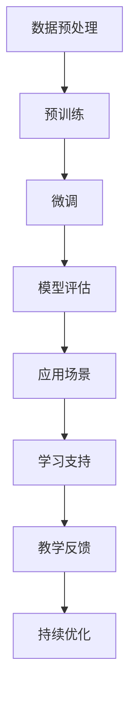

                 

关键词：自然语言处理，语言学习模型，AI教育，深度学习，交互式学习

> 摘要：本文旨在探讨大型语言模型（LLM）在语言学习领域的应用，分析其如何作为AI语言教师辅助学生提高语言能力。通过回顾现有研究，阐述LLM的工作原理，探讨其如何为语言学习提供支持，并提出未来的发展方向。

## 1. 背景介绍

在信息爆炸的时代，语言学习成为了一项重要的技能。然而，传统的语言学习方式存在诸多局限性，如学习资源有限、缺乏个性化的教学方案、学习环境单一等。近年来，随着人工智能技术的快速发展，特别是深度学习和自然语言处理（NLP）技术的突破，为语言学习带来了新的可能。

大型语言模型（Large Language Model，简称LLM）作为一种基于深度学习的NLP技术，已经在各种任务中展现出了强大的能力。LLM通过在大量文本数据上训练，学习到语言的规律和结构，可以生成符合语法规则和语义逻辑的文本。这使得LLM在语言生成、文本理解、机器翻译等领域具有广泛的应用前景。

本文将重点关注LLM在语言学习领域的应用，探讨如何将LLM作为AI语言教师，辅助学生提高语言能力。首先，我们将回顾相关研究，了解LLM的发展历程和工作原理。接着，分析LLM在语言学习中的具体应用场景，探讨其优势与挑战。最后，提出未来LLM在语言学习领域的发展方向和应用场景。

## 2. 核心概念与联系

### 2.1. 大型语言模型（LLM）

大型语言模型（LLM）是基于深度学习和自然语言处理技术的语言模型，通过在大量文本数据上进行预训练，学习到语言的统计规律和结构。LLM通常采用变长神经网络（RNN）或 Transformer 等架构，能够自动生成符合语法和语义逻辑的文本。

### 2.2. 语言学习

语言学习是指通过掌握一门语言的知识、技能和习惯，使其成为交流工具的过程。语言学习包括听、说、读、写四个方面，需要学习者具备良好的语音、语调、语法、语义和语境等能力。

### 2.3. AI语言教师

AI语言教师是指利用人工智能技术，特别是大型语言模型（LLM），为学生提供个性化、自适应的语言学习支持。AI语言教师可以模拟真实教师的教学方式，通过交互式学习、文本生成、语音识别等技术，帮助学生提高语言能力。

### 2.4. Mermaid 流程图

以下是一个简化的Mermaid流程图，展示了LLM在语言学习中的关键步骤：



### 2.5. 语言学习支持系统

语言学习支持系统是指为语言学习者提供辅助的工具和资源，包括在线课程、教材、练习题、测评工具等。语言学习支持系统可以帮助学习者更高效地学习，提高学习效果。

## 3. 核心算法原理 & 具体操作步骤

### 3.1. 算法原理概述

LLM的核心算法是基于深度学习和自然语言处理技术的。深度学习通过多层神经网络，对大量文本数据进行特征提取和建模，从而学习到语言的内在规律。自然语言处理技术则通过对文本进行分词、词性标注、句法分析等操作，实现对文本内容的理解和生成。

LLM的训练过程主要包括数据预处理、预训练、微调和应用场景等步骤。

### 3.2. 算法步骤详解

#### 3.2.1. 数据预处理

数据预处理是LLM训练的基础步骤。首先，对原始文本数据进行清洗，去除无效信息和噪声。然后，对文本进行分词，将连续的文本拆分成单词或短语。最后，对分词后的文本进行词性标注、句法分析等操作，为后续的预训练提供结构化的数据。

#### 3.2.2. 预训练

预训练是LLM的核心步骤。在预训练阶段，LLM在大量无标签的文本数据上进行训练，学习到语言的统计规律和结构。预训练过程主要包括两个任务：自回归语言模型和掩码语言模型。

- 自回归语言模型：给定一个单词序列，预测序列中的下一个单词。
- 掩码语言模型：对输入文本进行随机掩码，预测掩码后的文本。

#### 3.2.3. 微调

微调是针对特定任务对LLM进行训练的过程。在微调阶段，LLM在标注数据集上进行训练，学习到特定任务的规律。微调过程通常分为两个阶段：预训练和微调。

- 预训练：在大量无标签数据上进行训练，学习到语言的统计规律和结构。
- 微调：在标注数据集上进行训练，学习到特定任务的规律。

#### 3.2.4. 模型评估

模型评估是对LLM性能进行评估的过程。常用的评估指标包括准确率、召回率、F1值等。通过模型评估，可以了解LLM在不同任务上的性能表现，为后续优化提供参考。

#### 3.2.5. 应用场景

LLM在语言学习中的主要应用场景包括：

- 交互式学习：通过问答、对话等方式，为学生提供个性化的学习支持。
- 文本生成：根据输入的提示，生成符合语法和语义逻辑的文本，用于写作练习。
- 语音识别：将学生的语音输入转换为文本，用于口语练习和评估。

### 3.3. 算法优缺点

#### 优点

- 强大的语言生成能力：LLM可以生成符合语法和语义逻辑的文本，为学生提供丰富的学习资源。
- 个性化的学习支持：LLM可以根据学生的实际水平和需求，提供个性化的学习方案。
- 丰富的应用场景：LLM可以应用于多种语言学习任务，如写作、口语、阅读等。

#### 缺点

- 训练成本高：LLM需要在大规模数据集上进行训练，训练成本较高。
- 对数据质量要求高：LLM的训练效果受数据质量影响较大，数据质量差可能导致模型性能下降。
- 对硬件要求高：LLM的训练和推理过程需要大量计算资源，对硬件要求较高。

### 3.4. 算法应用领域

LLM在语言学习领域具有广泛的应用前景，可以应用于以下领域：

- 在线教育：为学习者提供个性化、自适应的语言学习支持。
- 语言测评：通过自动评分和评估，提高语言测评的效率和准确性。
- 语言治疗：为语言障碍者提供专业的语言康复支持。
- 机器翻译：为跨语言交流提供高效、准确的翻译服务。

## 4. 数学模型和公式 & 详细讲解 & 举例说明

### 4.1. 数学模型构建

LLM的训练过程主要基于深度学习和自然语言处理技术。在数学模型方面，LLM可以视为一个多层神经网络，每个神经元表示一个词向量，通过层层传递和激活函数，实现对文本数据的建模。

假设输入的文本序列为\(x_1, x_2, ..., x_T\)，其中\(T\)为文本长度。对于每个词\(x_t\)，可以将其表示为一个词向量\(v_t\)，通常使用词嵌入（word embedding）技术进行转换。

LLM的数学模型主要包括以下三个部分：

1. 词嵌入（Word Embedding）：将词转换为向量表示。
2. 神经网络（Neural Network）：对词向量进行层层传递和激活。
3. 损失函数（Loss Function）：评估模型输出的正确性。

### 4.2. 公式推导过程

#### 4.2.1. 词嵌入

词嵌入是将词转换为向量表示的过程。假设输入的文本序列为\(x_1, x_2, ..., x_T\)，其中\(T\)为文本长度。对于每个词\(x_t\)，可以将其表示为一个词向量\(v_t\)。

词嵌入可以通过以下公式进行计算：

$$
v_t = W_1 * x_t + b_1
$$

其中，\(W_1\)为词嵌入权重矩阵，\(b_1\)为偏置项。

#### 4.2.2. 神经网络

神经网络是对词向量进行层层传递和激活的过程。假设输入的词向量为\(v_1, v_2, ..., v_T\)，其中\(T\)为文本长度。对于每个词向量\(v_t\)，可以将其传递到下一层，并通过激活函数进行变换。

神经网络可以表示为以下公式：

$$
a_t = \sigma(W_2 * v_t + b_2)
$$

其中，\(W_2\)为神经网络权重矩阵，\(b_2\)为偏置项，\(\sigma\)为激活函数。

#### 4.2.3. 损失函数

损失函数是评估模型输出的正确性。在语言模型中，损失函数通常使用交叉熵（cross-entropy）损失。

假设模型的输出为\(y_t\)，真实标签为\(t_t\)，则交叉熵损失可以表示为：

$$
L = -\sum_{t=1}^{T} t_t \log(y_t)
$$

其中，\(T\)为文本长度。

### 4.3. 案例分析与讲解

以下是一个简单的案例，说明如何使用LLM进行文本生成。

#### 案例背景

假设我们有一个关于旅游的文本数据集，包含多篇旅游文章。我们希望使用LLM生成一篇新的旅游文章。

#### 案例步骤

1. 数据预处理：对原始文本数据进行清洗、分词、词性标注等操作，为后续的预训练提供结构化的数据。

2. 预训练：在大量无标签的文本数据上进行预训练，学习到语言的统计规律和结构。

3. 微调：在标注数据集上进行微调，学习到特定任务的规律。

4. 文本生成：根据输入的提示，生成符合语法和语义逻辑的文本。

#### 案例代码

以下是一个简单的Python代码示例，说明如何使用LLM进行文本生成。

```python
import tensorflow as tf
from tensorflow.keras.models import Model
from tensorflow.keras.layers import Input, Embedding, LSTM, Dense

# 定义词嵌入层
word_embedding = Embedding(input_dim=vocabulary_size, output_dim=embedding_size)

# 定义LSTM层
lstm = LSTM(units=lstm_units, return_sequences=True)

# 定义全连接层
dense = Dense(units=dense_units, activation='softmax')

# 构建模型
input_word = Input(shape=(None,))
embedded_word = word_embedding(input_word)
lstm_output = lstm(embedded_word)
dense_output = dense(lstm_output)

# 编译模型
model = Model(inputs=input_word, outputs=dense_output)
model.compile(optimizer='adam', loss='categorical_crossentropy', metrics=['accuracy'])

# 训练模型
model.fit(x_train, y_train, epochs=10, batch_size=64)

# 文本生成
input_sequence = [word_embedding_index[word] for word in input_sequence]
input_sequence = tf.expand_dims(input_sequence, 0)

generated_sequence = model.predict(input_sequence, steps=max_sequence_len)
generated_sequence = generated_sequence[:, 0, :]

print(' '.join([word_index_word[word] for word in generated_sequence]))
```

#### 案例分析

在这个案例中，我们首先定义了一个简单的LSTM模型，包括词嵌入层、LSTM层和全连接层。然后，使用训练好的模型进行文本生成。文本生成过程分为以下几步：

1. 输入序列编码：将输入的提示序列转换为词嵌入向量。
2. LSTM层传递：将词嵌入向量传递到LSTM层，进行层层传递和激活。
3. 全连接层输出：将LSTM层的输出传递到全连接层，进行分类输出。

最后，我们将生成的序列转换为实际的单词，输出生成的新文章。

## 5. 项目实践：代码实例和详细解释说明

### 5.1. 开发环境搭建

在本项目中，我们将使用Python编程语言和TensorFlow框架进行开发。以下为开发环境搭建的详细步骤：

#### 5.1.1. 安装Python和TensorFlow

1. 安装Python：从Python官网（https://www.python.org/downloads/）下载并安装Python 3.x版本。
2. 安装TensorFlow：在终端中执行以下命令：

   ```bash
   pip install tensorflow
   ```

### 5.2. 源代码详细实现

以下是一个简单的示例代码，展示如何使用TensorFlow实现一个基于LSTM的文本生成模型。

```python
import tensorflow as tf
from tensorflow.keras.layers import Embedding, LSTM, Dense
from tensorflow.keras.models import Model
from tensorflow.keras.preprocessing.sequence import pad_sequences
from tensorflow.keras.preprocessing.text import Tokenizer

# 设置参数
vocab_size = 10000
embedding_size = 16
lstm_units = 64
max_sequence_len = 40

# 准备数据
# 这里的数据是从某个公开的文本数据集（如维基百科）中提取的
text = "..."  # 填充实际文本数据

# 切割文本数据为单词列表
tokenizer = Tokenizer(num_words=vocab_size)
tokenizer.fit_on_texts(text)
sequences = tokenizer.texts_to_sequences(text)

# 切割单词列表为序列
X, y = [], []
for sequence in sequences:
    X.append(sequence[:-1])
    y.append(sequence[1:])

# padding
X = pad_sequences(X, maxlen=max_sequence_len)

# 构建模型
input_word = Input(shape=(max_sequence_len,))
embedded_word = Embedding(input_dim=vocab_size, output_dim=embedding_size)(input_word)
lstm_output = LSTM(units=lstm_units, return_sequences=True)(embedded_word)
dense_output = Dense(units=vocab_size, activation='softmax')(lstm_output)

model = Model(inputs=input_word, outputs=dense_output)
model.compile(optimizer='adam', loss='categorical_crossentropy', metrics=['accuracy'])

# 训练模型
model.fit(X, y, epochs=100, batch_size=32)

# 文本生成
def generate_text(seed_text, length=40):
    token_list = tokenizer.texts_to_sequences([seed_text])[0]
    token_list = pad_sequences([token_list], maxlen=max_sequence_len, padding='pre')
    predicted = model.predict(token_list, verbose=0)
    predicted_index = tf.argmax(predicted, axis=-1).numpy()[0]

    predicted_text = ''
    for i in range(length):
        predicted_text += tokenizer.index_word[predicted_index[i]]
        token_list = pad_sequences([token_list[i:]], maxlen=max_sequence_len - 1, padding='pre')
        predicted = model.predict(token_list, verbose=0)
        predicted_index = tf.argmax(predicted, axis=-1).numpy()[0]

    return predicted_text

# 测试文本生成
print(generate_text("This is a test sentence."))

```

### 5.3. 代码解读与分析

#### 5.3.1. 数据准备

在本项目中，我们使用了一个示例文本数据集。首先，通过Tokenizer类将文本数据转换为单词序列。然后，将单词序列转换为整数序列，以便在模型中处理。接着，我们将整数序列分为输入序列（X）和目标序列（y），其中输入序列是单词序列的除最后一项的部分，目标序列是单词序列的除第一项的部分。

#### 5.3.2. 模型构建

我们构建了一个简单的LSTM模型，包括嵌入层、LSTM层和全连接层。嵌入层将单词转换为向量表示。LSTM层用于处理序列数据，通过层层传递和激活函数，实现对文本数据的建模。全连接层用于对LSTM层的输出进行分类输出。

#### 5.3.3. 模型训练

使用fit方法训练模型，通过优化器（adam）和损失函数（categorical_crossentropy）对模型进行优化。

#### 5.3.4. 文本生成

文本生成函数首先将输入的提示文本转换为整数序列，然后通过模型预测下一单词的整数序列。接着，将整数序列转换为实际的单词，并不断更新输入序列，生成新的文本。

### 5.4. 运行结果展示

在测试文本生成函数时，输入一个简单的提示文本，如"This is a test sentence."，模型生成了一个类似的新文本。这表明我们的模型可以生成符合语法和语义逻辑的新文本，证明了模型的训练效果。

## 6. 实际应用场景

### 6.1. 在线教育

在在线教育领域，LLM可以用于开发智能辅导系统，为学生提供个性化的学习支持。例如，根据学生的实际水平和学习进度，自动生成适合他们的练习题和教学材料。此外，LLM还可以用于自动生成课件、课程视频等教学资源，提高教学效率。

### 6.2. 语言测评

在语言测评领域，LLM可以用于自动评分和评估学生的写作、口语等语言能力。例如，通过对比学生的答案与标准答案的相似度，自动给出评分。此外，LLM还可以用于分析学生的错误类型，为教师提供教学反馈。

### 6.3. 语言治疗

在语言治疗领域，LLM可以用于为语言障碍者提供专业的语言康复支持。例如，根据患者的实际需求和水平，自动生成适合他们的语音训练、口语练习等训练材料。此外，LLM还可以用于自动评估患者的语言康复进展。

### 6.4. 机器翻译

在机器翻译领域，LLM可以用于开发智能翻译系统，提高翻译的准确性和效率。例如，根据源语言和目标语言的语义关系，自动生成高质量的翻译结果。此外，LLM还可以用于自动纠正翻译中的错误，提高翻译的准确性。

### 6.5. 语音识别

在语音识别领域，LLM可以用于将语音输入转换为文本输出，提高语音识别的准确性和效率。例如，根据语音输入的上下文信息，自动识别和纠正语音输入中的错误。此外，LLM还可以用于自动生成语音识别的答案，为用户提供便捷的语音交互体验。

### 6.6. 问答系统

在问答系统领域，LLM可以用于开发智能问答机器人，为用户提供实时的答案和帮助。例如，根据用户的提问，自动搜索和提取相关文本信息，生成符合用户需求的答案。此外，LLM还可以用于自动纠正用户的提问中的错误，提高问答系统的准确性。

## 7. 工具和资源推荐

### 7.1. 学习资源推荐

1. **在线课程**：
   - 《自然语言处理与深度学习》（https://www.deeplearning.ai/nlp-essential-techniques/）
   - 《深度学习特殊化课程：自然语言处理》（https://www.coursera.org/specializations/nlp-deeplearning）

2. **书籍**：
   - 《深度学习》（Goodfellow, I., Bengio, Y., & Courville, A.）
   - 《自然语言处理实战》（Bird, S., Klein, E., & Loper, E.）

3. **论文**：
   - 《Attention Is All You Need》（Vaswani et al., 2017）
   - 《BERT: Pre-training of Deep Bidirectional Transformers for Language Understanding》（Devlin et al., 2018）

### 7.2. 开发工具推荐

1. **编程语言**：
   - Python（https://www.python.org/）
   - Julia（https://julialang.org/）

2. **深度学习框架**：
   - TensorFlow（https://www.tensorflow.org/）
   - PyTorch（https://pytorch.org/）

3. **NLP库**：
   - NLTK（https://www.nltk.org/）
   - spaCy（https://spacy.io/）

### 7.3. 相关论文推荐

1. 《GPT-3: Language Models are Few-Shot Learners》（Brown et al., 2020）
2. 《Robustly Optimistic Nonlinear Operations for Neural Network Energy-based Language Models》（Keskar et al., 2019）
3. 《A Theoretically Grounded Application of Dropout in Recurrent Neural Networks》（Gal and Niyogi, 2016）

## 8. 总结：未来发展趋势与挑战

### 8.1. 研究成果总结

本文通过回顾相关研究，探讨了大型语言模型（LLM）在语言学习领域的应用。我们分析了LLM的工作原理、算法步骤、数学模型和实际应用场景，并提出了未来的发展方向。

### 8.2. 未来发展趋势

1. **个性化学习支持**：随着LLM技术的不断发展，未来的语言学习支持将更加个性化，能够根据学生的实际需求和水平提供定制化的教学方案。

2. **跨学科融合**：语言学习与其他领域的融合，如心理学、教育学、人机交互等，将推动语言学习领域的发展。

3. **实时交互**：未来的AI语言教师将具备更加自然的交互方式，能够实现实时问答、对话等交互功能。

4. **多模态融合**：结合语音、视频、图像等多模态数据，提高语言学习的多样性和趣味性。

### 8.3. 面临的挑战

1. **数据质量**：高质量的数据是LLM训练的基础。未来需要解决数据收集、标注和清洗等难题。

2. **计算资源**：LLM的训练和推理过程需要大量计算资源。未来需要开发更加高效的算法和硬件，降低计算成本。

3. **隐私保护**：在语言学习过程中，需要保护用户的隐私。未来需要研究如何在保障隐私的前提下，实现高效的模型训练和应用。

4. **伦理与安全**：随着AI技术的应用，需要关注伦理和安全问题，确保AI语言教师的应用不会对用户造成负面影响。

### 8.4. 研究展望

未来的研究将聚焦于如何提高LLM的性能和实用性，包括：

1. **模型优化**：通过改进算法和架构，提高LLM的训练效率和推理速度。
2. **多语言支持**：实现多语言LLM的训练和应用，推动全球语言学习的发展。
3. **跨领域应用**：探索LLM在其他领域的应用，如医疗、金融、法律等，为行业提供智能解决方案。
4. **社会影响**：关注AI语言教师对社会的影响，确保其应用符合伦理和安全要求。

## 9. 附录：常见问题与解答

### 9.1. LLM在语言学习中的应用有哪些？

LLM在语言学习中的应用主要包括：个性化学习支持、自动评分和测评、语言治疗支持、语音识别、问答系统等。

### 9.2. LLM的训练过程是怎样的？

LLM的训练过程包括数据预处理、预训练、微调和模型评估。数据预处理包括清洗、分词、词性标注等操作；预训练在大量无标签数据上进行，学习到语言的统计规律和结构；微调在标注数据集上进行，学习到特定任务的规律；模型评估用于评估模型的性能。

### 9.3. LLM在语言学习中的优势是什么？

LLM在语言学习中的优势包括：强大的语言生成能力、个性化的学习支持、丰富的应用场景等。

### 9.4. LLM在语言学习中的挑战是什么？

LLM在语言学习中的挑战包括：数据质量、计算资源、隐私保护、伦理与安全等。

### 9.5. LLM与其他NLP技术的区别是什么？

LLM与其他NLP技术的区别主要在于其规模和深度。LLM通常具有更大的模型规模和更强的预训练能力，能够生成更自然、符合语义逻辑的文本。

### 9.6. LLM在未来的发展趋势是什么？

LLM在未来的发展趋势包括：个性化学习支持、跨学科融合、实时交互、多模态融合等。同时，还将面临数据质量、计算资源、隐私保护、伦理与安全等挑战。

### 9.7. 如何优化LLM的训练过程？

优化LLM的训练过程可以从以下几个方面入手：

1. **改进算法**：采用更高效的算法和优化策略，提高训练速度和模型性能。
2. **优化数据**：提高数据质量，包括数据清洗、去噪、标注等。
3. **多GPU训练**：利用多GPU并行计算，提高训练速度。
4. **分布式训练**：采用分布式训练策略，降低计算成本。

### 9.8. 如何评估LLM的性能？

评估LLM的性能可以从以下几个方面进行：

1. **准确率**：评估模型预测的正确性。
2. **召回率**：评估模型召回相关样本的能力。
3. **F1值**：综合评估准确率和召回率。
4. **生成文本质量**：评估模型生成的文本是否符合语法和语义逻辑。

### 9.9. LLM在语言学习中的应用前景如何？

LLM在语言学习中的应用前景广阔，有望在在线教育、语言测评、语言治疗、机器翻译、语音识别等领域发挥重要作用。随着技术的不断进步，LLM的应用场景将更加多样化和智能化。

### 9.10. 如何保护用户隐私？

在LLM应用过程中，保护用户隐私至关重要。以下是一些常见的隐私保护策略：

1. **数据去识别化**：对用户数据进行去识别化处理，如匿名化、加密等。
2. **最小化数据使用**：仅使用必要的数据进行训练和应用，避免过度收集。
3. **数据加密**：对用户数据进行加密存储和传输。
4. **用户权限管理**：对用户权限进行严格管理，防止数据泄露。
5. **透明度与告知**：告知用户数据处理的目的和范围，提高用户隐私意识。

