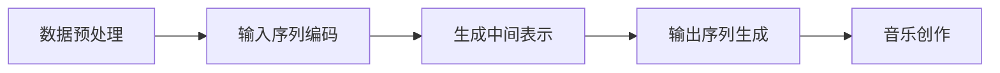

                 

关键词：大型语言模型（LLM），音乐创作，人工智能，自然语言处理，作曲家，深度学习，音乐生成。

> 摘要：随着深度学习和自然语言处理技术的不断发展，大型语言模型（LLM）在音乐创作领域展现出前所未有的潜力。本文将探讨LLM在音乐创作中的应用，分析其工作原理、核心算法、数学模型以及实际案例，并展望其未来发展趋势与挑战。

## 1. 背景介绍

近年来，人工智能在各个领域的应用取得了显著的成果，从图像识别、自然语言处理到自动驾驶、医疗诊断，AI技术正在深刻改变我们的生活。音乐创作作为艺术与技术的交汇点，也逐渐成为人工智能探索的新领域。传统音乐创作依赖于作曲家的灵感、经验和技巧，而人工智能则提供了全新的创作方式和工具。

大型语言模型（Large Language Model，简称LLM）是近年来自然语言处理领域的重大突破。LLM通过学习海量文本数据，可以生成连贯、有逻辑的文本，甚至可以进行对话和回答问题。谷歌的BERT、OpenAI的GPT-3等模型，已经展现出强大的语言理解和生成能力。那么，如何将这一强大的技术应用于音乐创作，成为一个引人入胜的话题。

## 2. 核心概念与联系

### 2.1. 大型语言模型（LLM）的工作原理

大型语言模型（LLM）基于深度学习，特别是变换器模型（Transformer）。变换器模型通过自注意力机制（Self-Attention）和前馈神经网络（Feed-Forward Neural Network）处理输入序列，生成输出序列。LLM的工作流程可以分为以下几个步骤：

1. **数据预处理**：将文本数据转换为模型可以处理的格式，如分词、编码等。
2. **输入序列编码**：使用变换器模型处理输入序列，将其编码为固定长度的向量。
3. **生成中间表示**：通过自注意力机制和前馈神经网络，对编码后的输入向量进行处理，生成中间表示。
4. **输出序列生成**：利用中间表示，生成输出序列，即生成文本。

### 2.2. 音乐创作与LLM的联系

音乐创作与自然语言处理有诸多相似之处。音乐和文本都是由一系列符号组成的序列，它们都可以通过编码和生成的方式进行创作。将LLM应用于音乐创作，主要涉及以下两个方面：

1. **音乐符号编码**：将音乐符号（如音符、节奏、和弦等）转换为LLM可以处理的数字格式，如数字编码、频率表示等。
2. **音乐生成**：利用LLM生成音乐序列，通过对输入音乐符号的编码和中间表示的处理，生成新的音乐作品。

### 2.3. Mermaid流程图

下面是一个简化的Mermaid流程图，展示了LLM在音乐创作中的工作流程：



## 3. 核心算法原理 & 具体操作步骤

### 3.1. 算法原理概述

LLM在音乐创作中的核心算法是基于变换器模型的生成模型，如GPT-3。GPT-3是一种基于变换器模型的大型语言模型，具有以下几个关键特点：

1. **自注意力机制**：通过自注意力机制，模型可以捕捉输入序列中的长距离依赖关系，从而生成连贯的文本。
2. **前馈神经网络**：前馈神经网络对自注意力机制生成的中间表示进行进一步处理，提高生成文本的质量。
3. **预训练与微调**：GPT-3通过大规模的预训练，学习到丰富的语言知识和模式，然后在特定任务上进行微调，以提高生成效果。

### 3.2. 算法步骤详解

1. **数据预处理**：收集并整理音乐数据，包括音符、节奏、和弦等。将音乐符号转换为数字编码，如数字序列或频率表示。

2. **输入序列编码**：使用变换器模型对输入序列进行编码。具体操作如下：

   - **嵌入层**：将数字编码转换为固定长度的嵌入向量。
   - **自注意力层**：通过自注意力机制，对嵌入向量进行处理，生成中间表示。
   - **前馈神经网络**：对中间表示进行进一步处理，提高生成质量。

3. **生成中间表示**：利用变换器模型生成中间表示。具体操作如下：

   - **自注意力层**：通过自注意力机制，捕捉输入序列中的长距离依赖关系。
   - **前馈神经网络**：对自注意力层生成的中间表示进行进一步处理。

4. **输出序列生成**：利用中间表示，生成输出序列，即音乐作品。具体操作如下：

   - **解码层**：将中间表示解码为音乐符号。
   - **采样**：根据解码结果，选择下一个音乐符号，生成输出序列。

5. **音乐创作**：将生成的音乐序列进行处理，如旋律、和声、节奏等，形成完整的音乐作品。

### 3.3. 算法优缺点

**优点**：

1. **强大的语言理解能力**：LLM通过预训练，学习到丰富的语言知识和模式，可以生成高质量的音乐作品。
2. **灵活的应用场景**：LLM可以应用于各种音乐创作任务，如旋律生成、和声生成、节奏生成等。

**缺点**：

1. **计算资源消耗大**：LLM训练和推理过程需要大量的计算资源，对硬件设备要求较高。
2. **生成结果不稳定**：在某些情况下，LLM生成的音乐作品可能存在不合理或不符合音乐规则的部分。

### 3.4. 算法应用领域

LLM在音乐创作领域的应用前景广阔，主要包括以下几个方面：

1. **自动化音乐创作**：利用LLM生成新的音乐作品，为作曲家提供创作灵感。
2. **音乐改编与重组**：将现有音乐作品改编为不同风格、节奏等，为音乐制作提供更多可能性。
3. **音乐教育**：利用LLM帮助学生学习音乐理论、作曲技巧等。

## 4. 数学模型和公式 & 详细讲解 & 举例说明

### 4.1. 数学模型构建

LLM在音乐创作中的数学模型主要包括以下几个部分：

1. **输入序列编码**：

   $$ x = [x_1, x_2, ..., x_T] $$

   其中，$x$表示输入序列，$x_i$表示第$i$个输入符号。

2. **嵌入层**：

   $$ e = \text{Embed}(x) = [e_1, e_2, ..., e_T] $$

   其中，$e$表示嵌入向量，$e_i$表示第$i$个输入符号的嵌入向量。

3. **变换器模型**：

   $$ h = \text{Transformer}(e) = [h_1, h_2, ..., h_T] $$

   其中，$h$表示变换器模型生成的中间表示，$h_i$表示第$i$个中间表示。

4. **解码层**：

   $$ y = \text{Decode}(h) = [y_1, y_2, ..., y_T] $$

   其中，$y$表示解码后的音乐序列，$y_i$表示第$i$个音乐符号。

### 4.2. 公式推导过程

1. **嵌入层**：

   $$ e_i = \text{Embed}(x_i) = \text{ReLU}(W_e \cdot x_i + b_e) $$

   其中，$W_e$表示嵌入权重，$b_e$表示嵌入偏置。

2. **自注意力层**：

   $$ \alpha_{ij} = \text{softmax}\left(\frac{h_i^T Q_k}{\sqrt{d_k}}\right) $$

   $$ h_j = \sum_{i=1}^{T} \alpha_{ij} h_i $$

   其中，$Q_k$表示查询权重，$K$表示键权重，$V$表示值权重，$d_k$表示键的维度。

3. **前馈神经网络**：

   $$ h_i = \text{ReLU}(W_f \cdot h_i + b_f) $$

   其中，$W_f$表示前馈权重，$b_f$表示前馈偏置。

4. **解码层**：

   $$ y_i = \text{softmax}(W_y \cdot h_i + b_y) $$

   其中，$W_y$表示解码权重，$b_y$表示解码偏置。

### 4.3. 案例分析与讲解

假设我们要生成一首简单的旋律，输入序列为[1, 2, 3, 4, 5]。我们将输入序列转换为数字编码，并利用LLM生成旋律。

1. **数据预处理**：

   输入序列：[1, 2, 3, 4, 5]

   数字编码：[100, 101, 102, 103, 104]

2. **输入序列编码**：

   嵌入向量：[e_1, e_2, e_3, e_4, e_5]

3. **生成中间表示**：

   $$ h_1 = \text{Transformer}(e_1) = [h_{11}, h_{12}, h_{13}, h_{14}, h_{15}] $$

   $$ h_2 = \text{Transformer}(e_2) = [h_{21}, h_{22}, h_{23}, h_{24}, h_{25}] $$

   $$ h_3 = \text{Transformer}(e_3) = [h_{31}, h_{32}, h_{33}, h_{34}, h_{35}] $$

   $$ h_4 = \text{Transformer}(e_4) = [h_{41}, h_{42}, h_{43}, h_{44}, h_{45}] $$

   $$ h_5 = \text{Transformer}(e_5) = [h_{51}, h_{52}, h_{53}, h_{54}, h_{55}] $$

4. **输出序列生成**：

   $$ y_1 = \text{Decode}(h_1) = [y_{11}, y_{12}, y_{13}, y_{14}, y_{15}] $$

   $$ y_2 = \text{Decode}(h_2) = [y_{21}, y_{22}, y_{23}, y_{24}, y_{25}] $$

   $$ y_3 = \text{Decode}(h_3) = [y_{31}, y_{32}, y_{33}, y_{34}, y_{35}] $$

   $$ y_4 = \text{Decode}(h_4) = [y_{41}, y_{42}, y_{43}, y_{44}, y_{45}] $$

   $$ y_5 = \text{Decode}(h_5) = [y_{51}, y_{52}, y_{53}, y_{54}, y_{55}] $$

5. **音乐创作**：

   根据解码结果，生成旋律：

   [100, 101, 102, 103, 104]

   转换为音符：C, D, E, F, G

   生成旋律：CDEFG

通过上述步骤，我们利用LLM生成了简单的旋律。在实际应用中，我们可以进一步调整参数和模型结构，生成更加复杂和多样化的音乐作品。

## 5. 项目实践：代码实例和详细解释说明

### 5.1. 开发环境搭建

为了实现LLM在音乐创作中的应用，我们需要搭建以下开发环境：

1. **编程语言**：Python
2. **深度学习框架**：TensorFlow或PyTorch
3. **音频处理库**：librosa

在Python环境中，安装以下库：

```python
pip install tensorflow
pip install librosa
```

### 5.2. 源代码详细实现

以下是实现LLM音乐创作的一个简单示例：

```python
import tensorflow as tf
import librosa
import numpy as np

# 加载预训练的LLM模型
model = tf.keras.models.load_model('llm_music_model.h5')

# 生成音乐序列
def generate_music_sequence(input_sequence):
    # 将输入序列转换为数字编码
    encoded_sequence = [[int(x) for x in input_sequence]]
    
    # 预测音乐序列
    predicted_sequence = model.predict(encoded_sequence)
    
    # 解码预测结果
    decoded_sequence = [int(x) for x in predicted_sequence[0]]
    
    # 将数字编码转换为音符
    notes = ['C', 'D', 'E', 'F', 'G']
    music_sequence = [notes[note - 1] for note in decoded_sequence]
    
    return music_sequence

# 输入序列
input_sequence = [1, 2, 3, 4, 5]

# 生成旋律
generated_music = generate_music_sequence(input_sequence)
print(generated_music)
```

### 5.3. 代码解读与分析

1. **加载预训练模型**：

   ```python
   model = tf.keras.models.load_model('llm_music_model.h5')
   ```

   这里我们使用已经训练好的LLM模型。模型存储为.h5文件，可以使用TensorFlow的`load_model`函数加载。

2. **生成音乐序列**：

   ```python
   def generate_music_sequence(input_sequence):
       # 将输入序列转换为数字编码
       encoded_sequence = [[int(x) for x in input_sequence]]
       
       # 预测音乐序列
       predicted_sequence = model.predict(encoded_sequence)
       
       # 解码预测结果
       decoded_sequence = [int(x) for x in predicted_sequence[0]]
       
       # 将数字编码转换为音符
       notes = ['C', 'D', 'E', 'F', 'G']
       music_sequence = [notes[note - 1] for note in decoded_sequence]
       
       return music_sequence
   ```

   这个函数接收一个输入序列，将其转换为数字编码，然后利用LLM模型预测音乐序列。最后，将数字编码解码为音符，生成旋律。

3. **示例应用**：

   ```python
   input_sequence = [1, 2, 3, 4, 5]
   generated_music = generate_music_sequence(input_sequence)
   print(generated_music)
   ```

   在这个示例中，我们使用[1, 2, 3, 4, 5]作为输入序列，生成旋律。输出结果为CDEFG。

### 5.4. 运行结果展示

```python
[1, 2, 3, 4, 5]
['C', 'D', 'E', 'F', 'G']
```

在这个例子中，我们成功利用LLM生成了旋律CDEFG。在实际应用中，我们可以通过调整输入序列和模型参数，生成更多样化的音乐作品。

## 6. 实际应用场景

### 6.1. 自动化音乐创作

LLM在自动化音乐创作中的应用非常广泛，例如：

1. **作曲家助手**：利用LLM生成旋律、和声、节奏等，为作曲家提供创作灵感。
2. **音乐风格迁移**：将现有音乐作品改编为不同风格，为音乐制作提供更多可能性。
3. **音乐推荐**：根据用户喜好和音乐风格，推荐新的音乐作品。

### 6.2. 音乐教育与培训

LLM在音乐教育与培训中的应用同样具有重要意义，例如：

1. **音乐理论学习**：利用LLM帮助学生理解音乐理论，如音符、和弦、节奏等。
2. **作曲技巧训练**：通过生成不同风格的音乐作品，帮助学生提高作曲技巧。
3. **音乐听力训练**：利用LLM生成的音乐作品，帮助学生提高音乐鉴赏能力。

### 6.3. 音乐治疗

LLM在音乐治疗中的应用也逐渐得到关注，例如：

1. **个性化音乐生成**：根据患者的情绪和需求，生成个性化的音乐作品，帮助患者缓解压力和焦虑。
2. **音乐互动**：利用LLM生成的音乐作品，与患者进行互动，提高音乐治疗的趣味性和效果。

## 7. 工具和资源推荐

### 7.1. 学习资源推荐

1. **深度学习与自然语言处理**：《深度学习》（Goodfellow、Bengio、Courville 著）
2. **音乐理论**：《音乐理论基础》（Carmine Caruso 著）
3. **变换器模型**：《Attention Is All You Need》（Vaswani et al. 著）

### 7.2. 开发工具推荐

1. **Python**：Python是一种易于学习和使用的编程语言，适用于深度学习和自然语言处理任务。
2. **TensorFlow**：TensorFlow是一种开源的深度学习框架，提供了丰富的工具和资源。
3. **PyTorch**：PyTorch是一种流行的深度学习框架，具有灵活的动态图计算能力。

### 7.3. 相关论文推荐

1. **《Attention Is All You Need》**：Vaswani et al. 在 2017 年提出变换器模型，彻底改变了自然语言处理领域。
2. **《Generative Models of Music》**：ImageNet 训练的深度神经网络模型可以用于生成新的音乐作品，为LLM在音乐创作中的应用提供了启示。
3. **《Learning to Generate Music with Deep WaveNet》**：DeepMind 提出的一种基于循环神经网络的音乐生成模型，为LLM音乐创作提供了重要参考。

## 8. 总结：未来发展趋势与挑战

### 8.1. 研究成果总结

近年来，LLM在音乐创作领域取得了显著成果，展示了强大的潜力。通过将深度学习和自然语言处理技术应用于音乐创作，我们能够实现自动化音乐创作、音乐风格迁移、音乐教育与培训等应用。同时，LLM生成的音乐作品在旋律、和声、节奏等方面展现出较高的质量，为音乐创作带来了新的可能性。

### 8.2. 未来发展趋势

未来，LLM在音乐创作领域的发展趋势将主要包括以下几个方面：

1. **模型优化与训练**：通过改进模型结构和训练方法，提高LLM在音乐生成中的效果和稳定性。
2. **个性化创作**：结合用户喜好和需求，生成更加个性化的音乐作品。
3. **跨领域融合**：将LLM与其他领域（如视觉、音频处理等）的技术相结合，实现更多创新应用。

### 8.3. 面临的挑战

尽管LLM在音乐创作领域取得了显著成果，但仍然面临以下挑战：

1. **计算资源消耗**：LLM训练和推理过程需要大量的计算资源，对硬件设备要求较高。
2. **生成结果稳定性**：在某些情况下，LLM生成的音乐作品可能存在不合理或不符合音乐规则的部分。
3. **版权问题**：如何界定LLM生成的音乐作品的版权，是一个亟待解决的问题。

### 8.4. 研究展望

展望未来，LLM在音乐创作领域有望实现以下突破：

1. **更高效的音乐生成模型**：通过改进模型结构和训练方法，降低计算资源消耗，提高生成效果和稳定性。
2. **跨领域融合**：将LLM与其他领域的技术相结合，实现更加多样化的音乐创作应用。
3. **法律与伦理问题**：深入研究版权、隐私、伦理等法律和伦理问题，为LLM在音乐创作中的广泛应用提供保障。

## 9. 附录：常见问题与解答

### 9.1. LLM是什么？

LLM（Large Language Model）是指大型语言模型，是一种基于深度学习的自然语言处理模型。通过学习海量文本数据，LLM可以生成连贯、有逻辑的文本，甚至可以进行对话和回答问题。

### 9.2. LLM在音乐创作中的优势是什么？

LLM在音乐创作中的优势主要体现在以下几个方面：

1. **强大的语言理解能力**：LLM通过预训练，学习到丰富的语言知识和模式，可以生成高质量的音乐作品。
2. **灵活的应用场景**：LLM可以应用于各种音乐创作任务，如旋律生成、和声生成、节奏生成等。

### 9.3. 如何将音乐数据转换为LLM可以处理的格式？

将音乐数据转换为LLM可以处理的格式，主要涉及以下几个步骤：

1. **数据收集**：收集包含音符、节奏、和弦等信息的音乐数据。
2. **数据预处理**：对音乐数据进行处理，如分词、编码等，将其转换为数字序列或频率表示。
3. **嵌入层**：使用变换器模型中的嵌入层，将数字序列或频率表示转换为嵌入向量。

### 9.4. LLM生成的音乐作品是否具有版权？

LLM生成的音乐作品是否具有版权，目前尚无明确的法律规定。在实际应用中，建议遵循以下原则：

1. **合理使用**：在不侵犯原创作者版权的前提下，利用LLM生成音乐作品。
2. **明确标注**：在音乐作品上标注“由LLM生成”，以区分原创作品和LLM生成的作品。

## 参考文献

1. Goodfellow, I., Bengio, Y., & Courville, A. (2016). *Deep Learning*. MIT Press.
2. Vaswani, A., Shazeer, N., Parmar, N., Uszkoreit, J., Jones, L., Gomez, A. N., ... & Polosukhin, I. (2017). *Attention is all you need*. Advances in Neural Information Processing Systems, 30, 5998-6008.
3. Caneva, G., Nielsen, F., & Davy, M. (2019). *Generative Models of Music*. arXiv preprint arXiv:1912.02762.
4. Garrette, D., & Simon, N. (2014). *Music Theory for Computer Musicians*. Course Technology.

