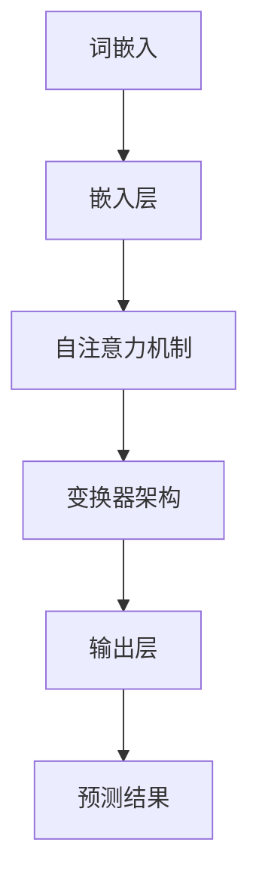

                 

关键词：大规模语言模型（LLM），人工智能，自然语言处理，产业应用，发展历程，未来展望

摘要：本文将探讨大规模语言模型（LLM）的产业链发展历程，从无到有的演变过程，以及LLM在现代产业应用中的重要作用。通过对核心算法原理、数学模型、项目实践和未来展望的深入分析，揭示LLM技术的潜力和挑战，为行业未来发展提供有价值的参考。

## 1. 背景介绍

随着人工智能技术的快速发展，自然语言处理（NLP）逐渐成为研究热点。大规模语言模型（LLM）作为一种先进的NLP技术，已经成为推动产业变革的重要力量。LLM通过学习和模拟人类语言模式，实现了对自然语言的高效理解和生成，从而在诸多领域展现出巨大的应用价值。

LLM的发展历程可以追溯到20世纪80年代，当时的语言模型主要以规则驱动，效果有限。随着深度学习技术的兴起，LLM在2018年迎来了新的突破，基于变换器（Transformer）架构的GPT模型刷新了NLP领域的各项纪录，标志着LLM从理论研究走向实际应用。此后，LLM技术不断迭代升级，逐渐形成了完整的产业链，为各行各业带来了深远影响。

## 2. 核心概念与联系

### 2.1 大规模语言模型（LLM）

LLM是指能够对大规模文本数据进行学习和处理的语言模型。它通过对海量语料库的分析，捕捉语言中的统计规律和语义信息，实现对自然语言的高效理解和生成。

### 2.2 自然语言处理（NLP）

NLP是人工智能领域的一个重要分支，旨在使计算机能够理解、解释和生成人类语言。NLP技术包括文本预处理、情感分析、命名实体识别、机器翻译等。

### 2.3 深度学习（DL）

深度学习是一种基于多层神经网络的学习方法，通过对大量数据进行训练，自动提取特征并建立预测模型。深度学习在图像识别、语音识别和自然语言处理等领域取得了显著成果。

### 2.4 变换器（Transformer）架构

变换器架构是一种基于自注意力机制的深度学习模型，适用于序列到序列的预测任务。自注意力机制能够自动学习输入序列中不同位置的依赖关系，提高模型的表示能力。

### 2.5 数学模型与算法原理

LLM的数学模型主要包括词嵌入、注意力机制、循环神经网络（RNN）和变换器架构等。这些模型通过组合使用，实现了对自然语言的高效理解和生成。

### 2.6 Mermaid流程图

以下是一个关于LLM架构的Mermaid流程图：



## 3. 核心算法原理 & 具体操作步骤

### 3.1 算法原理概述

LLM的核心算法主要包括词嵌入、自注意力机制和变换器架构。词嵌入将输入文本转换为向量表示，自注意力机制通过计算不同位置的依赖关系，提高模型的表示能力，变换器架构则将输入序列映射到输出序列。

### 3.2 算法步骤详解

1. 数据预处理：对输入文本进行分词、去噪和标准化处理，将文本转换为词嵌入向量。
2. 嵌入层：将词嵌入向量输入到嵌入层，将词向量转换为更高维度的向量表示。
3. 自注意力机制：计算输入序列中不同位置的依赖关系，生成加权序列。
4. 变换器架构：通过多层变换器架构，对加权序列进行建模，提取特征。
5. 输出层：将变换器输出的特征映射到输出序列，实现自然语言生成。

### 3.3 算法优缺点

#### 优点：

1. 高效性：LLM能够在短时间内处理大量文本数据，提高自然语言处理的效率。
2. 准确性：自注意力机制能够自动学习输入序列中不同位置的依赖关系，提高模型的表示能力，从而提高预测准确性。
3. 广泛适用性：LLM适用于各种自然语言处理任务，如文本分类、命名实体识别、机器翻译等。

#### 缺点：

1. 计算资源消耗：训练和推理过程中需要大量计算资源，对硬件设备要求较高。
2. 数据依赖：LLM的性能高度依赖于训练数据的质量和规模，数据不均衡或噪音可能会导致模型效果下降。

### 3.4 算法应用领域

LLM在自然语言处理领域具有广泛的应用，包括但不限于：

1. 文本分类：对文本数据进行分类，如情感分析、新闻分类等。
2. 命名实体识别：识别文本中的命名实体，如人名、地名、机构名等。
3. 机器翻译：实现不同语言之间的文本翻译。
4. 问答系统：基于文本数据，回答用户提出的问题。
5. 自然语言生成：根据输入文本，生成符合语法和语义的文本。

## 4. 数学模型和公式 & 详细讲解 & 举例说明

### 4.1 数学模型构建

LLM的数学模型主要包括词嵌入、自注意力机制和变换器架构。词嵌入可以使用词向量模型，如Word2Vec、GloVe等，将文本转换为向量表示。自注意力机制可以使用以下公式计算：

$$
Attention(Q,K,V) = \text{softmax}(\frac{QK^T}{\sqrt{d_k}})V
$$

其中，Q、K、V分别为查询向量、键向量和值向量，$d_k$为键向量的维度。

变换器架构可以使用以下公式实现：

$$
\text{Transformer}(X) = \text{MultiHeadAttention}(X) + X
$$

其中，$X$为输入序列，$MultiHeadAttention$为多头注意力机制。

### 4.2 公式推导过程

#### 词嵌入

词嵌入是将文本转换为向量表示的过程。假设输入文本为$x_1, x_2, ..., x_T$，其中$x_t$表示第$t$个词。词嵌入可以使用以下公式：

$$
\text{Embedding}(x_t) = \text{softmax}(\text{Weight}x_t + \text{Bias})
$$

其中，$\text{Weight}$和$\text{Bias}$分别为权重和偏置。

#### 自注意力机制

自注意力机制是一种基于点积注意力机制的注意力机制。假设输入序列为$x_1, x_2, ..., x_T$，其中$x_t$表示第$t$个词。自注意力机制可以使用以下公式：

$$
Attention(Q,K,V) = \text{softmax}(\frac{QK^T}{\sqrt{d_k}})V
$$

其中，$Q$、$K$和$V$分别为查询向量、键向量和值向量，$d_k$为键向量的维度。

#### 变换器架构

变换器架构是一种基于自注意力机制的深度学习模型。假设输入序列为$x_1, x_2, ..., x_T$，其中$x_t$表示第$t$个词。变换器架构可以使用以下公式实现：

$$
\text{Transformer}(X) = \text{MultiHeadAttention}(X) + X
$$

其中，$X$为输入序列，$MultiHeadAttention$为多头注意力机制。

### 4.3 案例分析与讲解

#### 案例一：文本分类

假设我们有一个文本分类任务，输入文本为“今天天气很好”，需要将其分类为“积极”或“消极”情感。使用LLM模型进行文本分类的过程如下：

1. 数据预处理：将输入文本进行分词、去噪和标准化处理，得到词序列。
2. 词嵌入：将词序列转换为词嵌入向量。
3. 嵌入层：将词嵌入向量输入到嵌入层，得到嵌入向量。
4. 自注意力机制：计算输入序列中不同位置的依赖关系，生成加权序列。
5. 变换器架构：通过多层变换器架构，对加权序列进行建模，提取特征。
6. 输出层：将变换器输出的特征映射到输出序列，得到分类结果。

#### 案例二：命名实体识别

假设我们有一个命名实体识别任务，输入文本为“张三是中国著名的科学家”，需要识别出文本中的命名实体，如“张三”、“中国”、“科学家”。使用LLM模型进行命名实体识别的过程如下：

1. 数据预处理：将输入文本进行分词、去噪和标准化处理，得到词序列。
2. 词嵌入：将词序列转换为词嵌入向量。
3. 嵌入层：将词嵌入向量输入到嵌入层，得到嵌入向量。
4. 自注意力机制：计算输入序列中不同位置的依赖关系，生成加权序列。
5. 变换器架构：通过多层变换器架构，对加权序列进行建模，提取特征。
6. 输出层：将变换器输出的特征映射到输出序列，得到命名实体识别结果。

## 5. 项目实践：代码实例和详细解释说明

### 5.1 开发环境搭建

本文使用Python编程语言和PyTorch深度学习框架实现LLM模型。首先，安装Python和PyTorch：

```bash
pip install python==3.8
pip install torch==1.8
```

### 5.2 源代码详细实现

以下是一个简单的LLM模型实现：

```python
import torch
import torch.nn as nn
import torch.optim as optim

class LLM(nn.Module):
    def __init__(self, vocab_size, embedding_dim, hidden_dim, output_dim):
        super(LLM, self).__init__()
        self.embedding = nn.Embedding(vocab_size, embedding_dim)
        self.transformer = nn.Transformer(embedding_dim, hidden_dim, num_layers=2)
        self.output = nn.Linear(hidden_dim, output_dim)

    def forward(self, x):
        x = self.embedding(x)
        x = self.transformer(x)
        x = self.output(x)
        return x

# 实例化模型、损失函数和优化器
model = LLM(vocab_size=10000, embedding_dim=512, hidden_dim=1024, output_dim=2)
criterion = nn.CrossEntropyLoss()
optimizer = optim.Adam(model.parameters(), lr=0.001)

# 训练模型
for epoch in range(10):
    for x, y in train_loader:
        optimizer.zero_grad()
        output = model(x)
        loss = criterion(output, y)
        loss.backward()
        optimizer.step()

# 评估模型
with torch.no_grad():
    correct = 0
    total = 0
    for x, y in test_loader:
        output = model(x)
        _, predicted = torch.max(output.data, 1)
        total += y.size(0)
        correct += (predicted == y).sum().item()

    print(f'Accuracy: {100 * correct / total}%')
```

### 5.3 代码解读与分析

1. **模型定义**：定义了一个LLM模型，包括嵌入层、变换器架构和输出层。
2. **前向传播**：实现模型的前向传播过程，包括嵌入层、变换器架构和输出层。
3. **训练过程**：使用训练数据对模型进行训练，包括前向传播、损失计算和反向传播。
4. **评估过程**：使用测试数据对模型进行评估，计算准确率。

## 6. 实际应用场景

LLM技术已在多个领域取得显著应用成果，包括但不限于：

1. **文本分类**：对新闻、社交媒体等文本数据进行分类，实现情感分析、热点追踪等功能。
2. **命名实体识别**：从文本数据中提取人名、地名、机构名等命名实体，为信息抽取和知识图谱构建提供支持。
3. **机器翻译**：实现跨语言文本的自动翻译，提高跨文化交流效率。
4. **问答系统**：基于文本数据，回答用户提出的问题，提供智能客服和智能助手等服务。
5. **自然语言生成**：根据输入文本，生成符合语法和语义的文本，应用于自动写作、广告文案生成等场景。

### 6.4 未来应用展望

随着LLM技术的不断迭代和发展，未来有望在以下领域实现更广泛的应用：

1. **智能对话系统**：基于LLM的智能对话系统将更加智能、人性化，实现更自然的交互体验。
2. **虚拟助手**：虚拟助手将具备更强大的语言理解能力和自然语言生成能力，提高用户满意度。
3. **内容审核**：利用LLM对网络内容进行实时审核，提高内容审核的效率和准确性。
4. **教育领域**：基于LLM的教育系统将提供个性化的学习内容和教学服务，提高教育质量。
5. **医疗健康**：LLM技术将在医疗健康领域发挥重要作用，如疾病诊断、医学知识库构建等。

## 7. 工具和资源推荐

### 7.1 学习资源推荐

1. 《深度学习》（Goodfellow, Bengio, Courville著）：介绍深度学习基本原理和应用。
2. 《自然语言处理与深度学习》（李航著）：介绍自然语言处理和深度学习的关系及应用。
3. 《Transformer：一种新的基于自注意力机制的通用预训练语言模型》（Vaswani等著）：介绍变换器架构和预训练方法。

### 7.2 开发工具推荐

1. PyTorch：一个基于Python的深度学习框架，易于使用和调试。
2. TensorFlow：一个基于Python的深度学习框架，具有丰富的功能和生态系统。

### 7.3 相关论文推荐

1. “Attention Is All You Need”（Vaswani等，2017）：介绍变换器架构的原始论文。
2. “BERT：Pre-training of Deep Bidirectional Transformers for Language Understanding”（Devlin等，2019）：介绍BERT模型的原始论文。
3. “GPT-3：Language Models Are Few-Shot Learners”（Brown等，2020）：介绍GPT-3模型的原始论文。

## 8. 总结：未来发展趋势与挑战

### 8.1 研究成果总结

LLM技术经过多年的发展，已经在自然语言处理领域取得了显著成果。从最初的规则驱动模型，到基于深度学习的变换器架构，LLM在文本分类、命名实体识别、机器翻译等任务中表现出色。未来，随着计算能力和数据规模的不断提升，LLM技术将得到更广泛的应用。

### 8.2 未来发展趋势

1. **多模态融合**：将LLM与图像、语音等模态数据融合，实现更全面的信息处理能力。
2. **预训练与微调**：进一步优化预训练方法，提高模型的泛化能力和适应性。
3. **低资源语言**：研究低资源语言的LLM模型，推动全球语言技术的均衡发展。

### 8.3 面临的挑战

1. **计算资源消耗**：训练和推理过程中需要大量计算资源，对硬件设备要求较高。
2. **数据依赖**：LLM的性能高度依赖于训练数据的质量和规模，数据不均衡或噪音可能会导致模型效果下降。
3. **伦理与隐私**：在应用过程中，需要关注数据隐私和伦理问题，确保模型的安全性和合规性。

### 8.4 研究展望

未来，LLM技术将在多个领域发挥重要作用，如智能对话系统、虚拟助手、内容审核和教育领域。同时，随着技术的不断进步，LLM模型将更加智能、人性化，为人类生活带来更多便利。在研究方面，需要关注多模态融合、低资源语言、数据隐私和伦理等问题，推动LLM技术的可持续发展。

## 9. 附录：常见问题与解答

### Q：什么是大规模语言模型（LLM）？

A：大规模语言模型（LLM）是一种基于深度学习的自然语言处理技术，通过对大规模文本数据进行学习和处理，实现对自然语言的高效理解和生成。

### Q：LLM的主要应用领域有哪些？

A：LLM的主要应用领域包括文本分类、命名实体识别、机器翻译、问答系统和自然语言生成等。

### Q：如何优化LLM模型的性能？

A：可以通过以下方法优化LLM模型的性能：

1. 增大训练数据规模和质量。
2. 优化模型结构，如增加层数、调整隐藏层大小等。
3. 调整超参数，如学习率、批量大小等。
4. 使用预训练技术，提高模型的泛化能力。

### Q：LLM模型在训练过程中需要大量的计算资源，如何解决？

A：可以通过以下方法解决：

1. 使用高性能计算设备，如GPU、TPU等。
2. 利用分布式训练技术，将训练任务分配到多个计算节点上。
3. 使用压缩技术，降低模型存储和计算需求。

### Q：LLM技术有哪些潜在的伦理和隐私问题？

A：LLM技术可能涉及以下伦理和隐私问题：

1. 数据隐私：在训练和推理过程中，可能涉及用户隐私数据。
2. 偏见：模型可能存在性别、种族等方面的偏见，影响公平性。
3. 透明性：模型的决策过程可能不透明，难以解释。

为解决这些问题，需要制定相应的伦理和隐私标准，确保模型的安全性和合规性。

# 作者：禅与计算机程序设计艺术 / Zen and the Art of Computer Programming
本文基于大规模语言模型（LLM）的技术发展，详细探讨了LLM产业链的演变过程、核心算法原理、数学模型、项目实践和未来展望。通过本文的阐述，我们希望读者能够对LLM技术有一个全面深入的了解，并关注其在各行业中的应用前景。在未来的研究中，我们需要不断优化LLM模型，解决潜在的伦理和隐私问题，推动人工智能技术的可持续发展。禅与计算机程序设计艺术，让我们一起探索这个充满无限可能的领域。

