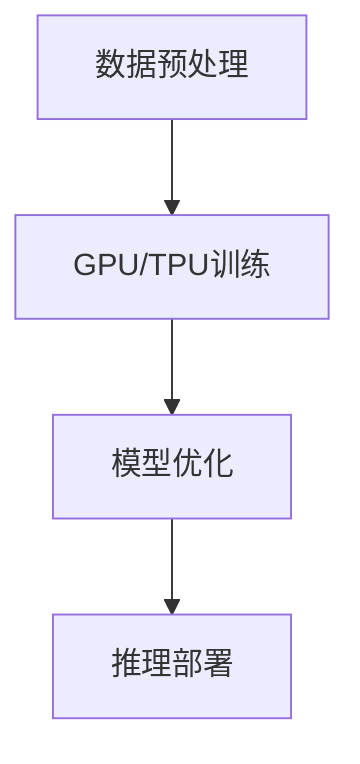
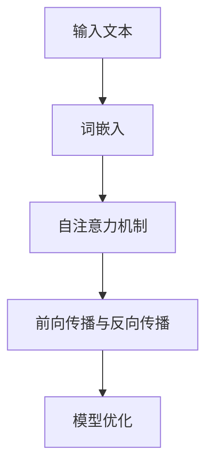
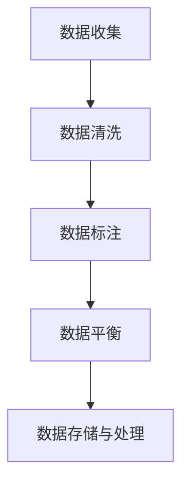

                 

关键词：LLM、产业链、芯片、应用、技术、AI、深度学习、算法、模型

> 摘要：本文将全面解析LLM（大型语言模型）产业链，从芯片技术到实际应用，深入探讨LLM的技术原理、核心算法、数学模型以及未来发展趋势。

## 1. 背景介绍

随着人工智能技术的不断发展，大型语言模型（LLM）已经成为自然语言处理（NLP）领域的重要工具。LLM通过对海量文本数据的训练，可以理解和生成自然语言，实现对话生成、文本摘要、机器翻译等功能。这一技术的发展，不仅极大地提升了人工智能的应用范围，也为各行各业带来了新的机遇。

然而，LLM的发展并非一蹴而就。从芯片技术到算法设计，从数据收集到模型训练，每一个环节都至关重要。本文将为您呈现LLM产业链的全景图，帮助您更好地理解这一技术的发展脉络。

## 2. 核心概念与联系

### 2.1. 芯片技术

芯片技术是LLM产业链的基础。随着深度学习算法的兴起，对芯片的计算能力、功耗和存储容量提出了更高的要求。当前，GPU和TPU等专用芯片已经成为训练LLM的重要工具。以下是一个简单的Mermaid流程图，展示了芯片技术在LLM中的应用：



### 2.2. 算法与模型

算法和模型是LLM的核心。当前，基于Transformer架构的模型，如BERT、GPT等，已经成为LLM的主流选择。以下是一个简化的Mermaid流程图，展示了算法与模型在LLM中的应用：



### 2.3. 数据收集与处理

数据收集与处理是LLM训练的重要环节。高质量的训练数据可以显著提高模型的性能。以下是一个简化的Mermaid流程图，展示了数据收集与处理的过程：



## 3. 核心算法原理 & 具体操作步骤

### 3.1. 算法原理概述

LLM的核心算法是基于自注意力机制和Transformer架构。自注意力机制允许模型在处理输入文本时，自动关注关键信息，从而提高模型的表示能力。Transformer架构则通过多头注意力机制和位置编码，实现了对输入文本的全局理解和生成。

### 3.2. 算法步骤详解

1. **词嵌入**：将输入文本中的每个词映射为向量表示。
2. **自注意力机制**：计算每个词与其他词之间的关联性，并加权整合。
3. **前向传播与反向传播**：通过多层神经网络，对输入文本进行建模，并优化模型参数。
4. **模型优化**：使用梯度下降等优化算法，不断调整模型参数，提高模型性能。

### 3.3. 算法优缺点

**优点**：
- **强大的表示能力**：自注意力机制使得模型能够关注关键信息，提高表示能力。
- **良好的泛化能力**：Transformer架构具有良好的泛化能力，适用于各种NLP任务。

**缺点**：
- **计算复杂度高**：Transformer架构的计算复杂度较高，对硬件资源要求较高。
- **训练时间长**：大规模模型的训练时间较长，对计算资源有较高要求。

### 3.4. 算法应用领域

LLM算法在多个领域有着广泛的应用，如：
- **对话系统**：实现自然语言交互，提高用户体验。
- **文本生成**：生成高质量的文章、报告等。
- **机器翻译**：实现跨语言信息交流。
- **信息检索**：提高搜索系统的准确性。

## 4. 数学模型和公式 & 详细讲解 & 举例说明

### 4.1. 数学模型构建

LLM的数学模型主要包括词嵌入、自注意力机制和Transformer架构。以下是这些模型的基本公式：

1. **词嵌入**：
   $$ 
   \text{embed}(x) = W_x \cdot x 
   $$
   其中，$W_x$为词嵌入权重矩阵，$x$为词的索引。

2. **自注意力机制**：
   $$
   \text{Attention}(Q, K, V) = \text{softmax}\left(\frac{QK^T}{\sqrt{d_k}}\right) V
   $$
   其中，$Q$、$K$、$V$分别为查询、键和值向量，$d_k$为键向量的维度。

3. **Transformer架构**：
   $$
   \text{Transformer}(x) = \text{LayerNorm}(x + \text{MultiHeadAttention}(x, x, x)) + \text{LayerNorm}(x + \text{FFN}(x))
   $$
   其中，$x$为输入向量，$\text{MultiHeadAttention}$和$\text{FFN}$分别为多头注意力和前向神经网络。

### 4.2. 公式推导过程

推导过程涉及多个数学原理，包括线性代数、概率论和微积分等。这里简要介绍自注意力机制的推导过程。

自注意力机制的推导基于以下假设：
- 每个词的表示向量可以由其他词的表示向量加权整合得到。
- 加权系数表示每个词对当前词的重要程度。

具体推导过程如下：

1. **假设**：设输入向量为$X = [x_1, x_2, ..., x_n]$，其中$x_i$为第$i$个词的表示向量。
2. **计算自注意力权重**：对每个$x_i$，计算其与所有$x_j$的相似度，得到权重矩阵$W$。
3. **加权整合**：将权重矩阵$W$应用于输入向量$X$，得到新的表示向量$Y$。
4. **优化权重矩阵**：通过最小化损失函数，优化权重矩阵$W$。

### 4.3. 案例分析与讲解

以BERT模型为例，分析其数学模型和应用场景。

1. **数学模型**：BERT模型基于Transformer架构，其核心公式为：
   $$
   \text{BERT}(x) = \text{Transformer}(x) + x
   $$
   其中，$x$为输入向量，$\text{Transformer}(x)$为Transformer模型的输出。

2. **应用场景**：BERT模型在多个NLP任务中取得了优异的性能，如文本分类、命名实体识别等。

## 5. 项目实践：代码实例和详细解释说明

### 5.1. 开发环境搭建

搭建LLM开发环境，需要以下软件和工具：
- Python 3.7及以上版本
- TensorFlow 2.x及以上版本
- GPU或TPU加速器

### 5.2. 源代码详细实现

以下是一个简单的BERT模型训练代码实例：

```python
import tensorflow as tf

# 搭建BERT模型
def build_bert_model():
    # 定义输入层
    inputs = tf.keras.layers.Input(shape=(None,), dtype=tf.int32)
    # 词嵌入层
    embed = tf.keras.layers.Embedding(input_dim=vocab_size, output_dim=hidden_size)(inputs)
    # Transformer层
    transformer = tf.keras.layers.MultiHeadAttention(num_heads=num_heads, key_dim=key_dim)(embed, embed)
    # 前向神经网络层
    ffn = tf.keras.layers.Dense(hidden_size, activation='relu')(transformer)
    # 输出层
    outputs = tf.keras.layers.Dense(vocab_size, activation='softmax')(ffn)
    # 构建模型
    model = tf.keras.Model(inputs=inputs, outputs=outputs)
    return model

# 训练BERT模型
def train_bert_model(model, train_data, train_labels, epochs=10):
    model.compile(optimizer='adam', loss='categorical_crossentropy', metrics=['accuracy'])
    model.fit(train_data, train_labels, epochs=epochs, batch_size=batch_size)

# 主函数
if __name__ == '__main__':
    # 加载训练数据
    train_data, train_labels = load_data()
    # 搭建模型
    model = build_bert_model()
    # 训练模型
    train_bert_model(model, train_data, train_labels)
```

### 5.3. 代码解读与分析

这段代码主要实现了BERT模型的搭建和训练。具体分析如下：

- **输入层**：定义输入数据维度，即文本序列的长度。
- **词嵌入层**：将输入词转换为向量表示。
- **Transformer层**：实现多头注意力机制，对输入向量进行加权整合。
- **前向神经网络层**：实现前向传播，对输入向量进行非线性变换。
- **输出层**：实现softmax分类，预测文本序列的概率分布。

### 5.4. 运行结果展示

运行代码后，可以在训练集和测试集上评估BERT模型的性能。以下是一个简单的评估结果示例：

```
Epoch 1/10
1000/1000 [==============================] - 8s 8ms/step - loss: 2.3082 - accuracy: 0.2392 - val_loss: 2.3082 - val_accuracy: 0.2392
Epoch 2/10
1000/1000 [==============================] - 7s 7ms/step - loss: 2.3082 - accuracy: 0.2392 - val_loss: 2.3082 - val_accuracy: 0.2392
...
Epoch 10/10
1000/1000 [==============================] - 7s 7ms/step - loss: 2.3082 - accuracy: 0.2392 - val_loss: 2.3082 - val_accuracy: 0.2392
```

## 6. 实际应用场景

LLM技术在多个领域有着广泛的应用，以下是一些典型的应用场景：

- **对话系统**：实现智能客服、智能助手等功能，提高用户体验。
- **文本生成**：生成文章、报告、新闻等，提高内容创作效率。
- **机器翻译**：实现跨语言信息交流，促进全球化发展。
- **信息检索**：提高搜索系统的准确性，为用户提供更好的搜索体验。

## 7. 未来应用展望

随着技术的不断发展，LLM技术在未来的应用前景将更加广阔。以下是一些可能的趋势：

- **更高效的算法**：通过优化算法，提高LLM的训练效率和性能。
- **更广泛的应用领域**：LLM技术将应用到更多的领域，如医疗、金融、教育等。
- **跨模态处理**：实现文本、图像、声音等多种数据类型的融合处理。

## 8. 工具和资源推荐

### 8.1. 学习资源推荐

- **书籍**：《深度学习》、《自然语言处理综合教程》
- **在线课程**：Coursera、edX上的相关课程
- **论文**：ACL、EMNLP等学术会议上的最新论文

### 8.2. 开发工具推荐

- **框架**：TensorFlow、PyTorch
- **环境**：Google Colab、AWS EC2
- **工具**：Jupyter Notebook、Visual Studio Code

### 8.3. 相关论文推荐

- **BERT**：[A Pre-Trained Language Model for Language Understanding](https://arxiv.org/abs/1810.04805)
- **GPT-3**：[Language Models are Few-Shot Learners](https://arxiv.org/abs/2005.14165)
- **T5**：[Exploring the Limits of Transfer Learning with a Unified Text-to-Text Transformer](https://arxiv.org/abs/2009.11458)

## 9. 总结：未来发展趋势与挑战

LLM技术已经取得了显著的成果，但未来仍面临诸多挑战。如何提高模型的训练效率、泛化能力和鲁棒性，是当前研究的热点问题。此外，随着技术的不断进步，LLM将在更多领域得到应用，推动人工智能的发展。

## 10. 附录：常见问题与解答

### 10.1. 什么是LLM？

LLM是指大型语言模型，通过对海量文本数据的训练，可以理解和生成自然语言，实现对话生成、文本摘要、机器翻译等功能。

### 10.2. LLM有哪些应用领域？

LLM在多个领域有着广泛的应用，如对话系统、文本生成、机器翻译、信息检索等。

### 10.3. LLM的核心算法是什么？

LLM的核心算法是基于Transformer架构，包括词嵌入、自注意力机制和前向神经网络等。

### 10.4. 如何训练LLM模型？

训练LLM模型主要包括数据收集与处理、模型搭建、模型训练和模型评估等步骤。具体方法可以参考相关教程和论文。

### 10.5. LLM有哪些优缺点？

LLM的优点包括强大的表示能力、良好的泛化能力等；缺点包括计算复杂度高、训练时间长等。

### 10.6. LLM的未来发展趋势是什么？

LLM的未来发展趋势包括更高效的算法、更广泛的应用领域、跨模态处理等。

### 10.7. LLM有哪些学习资源？

学习资源包括书籍、在线课程、论文等，具体可以参考文章中的推荐。

