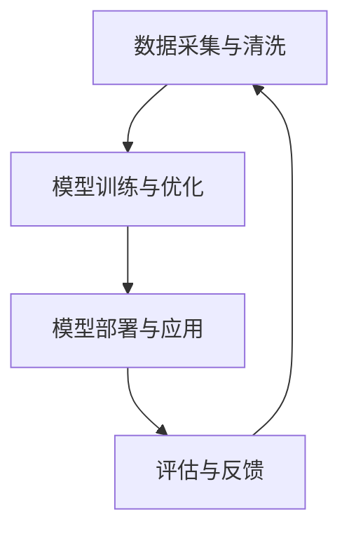

                 

关键词：大型语言模型（LLM）、人工智能经济、产业链、技术创新、商业应用、挑战与机遇

> 摘要：本文将深入探讨大型语言模型（LLM）的发展及其在新兴人工智能经济中的关键角色。通过对LLM的核心概念、算法原理、数学模型以及应用场景的详细分析，本文旨在揭示LLM产业链的内在脉络，并展望其未来发展趋势和面临的挑战。

## 1. 背景介绍

随着人工智能技术的迅猛发展，尤其是深度学习、自然语言处理（NLP）等领域的突破，大型语言模型（LLM）应运而生。LLM是指拥有数百万甚至数十亿参数的语言模型，能够处理和理解复杂、多样化的语言数据。LLM的兴起不仅改变了自然语言处理领域的研究范式，还深刻影响了人工智能产业的发展。

人工智能经济作为21世纪最具潜力的经济形态，其核心在于通过人工智能技术提高生产效率、优化资源配置、创新商业模式。LLM作为人工智能技术的代表之一，其发展和应用成为人工智能经济的重要组成部分。

本文将首先介绍LLM的基本概念和原理，然后分析LLM的产业链构成，探讨其在不同应用场景中的实际案例，最后讨论LLM产业链的未来发展趋势和面临的挑战。

## 2. 核心概念与联系

### 2.1 大型语言模型（LLM）的基本概念

大型语言模型（LLM）是一种基于深度学习的语言处理模型，其核心思想是使用大量文本数据对模型进行训练，使其能够理解和生成自然语言。LLM的基本组成包括：

- **词向量嵌入（Word Embedding）**：将自然语言中的单词转换为高维向量表示。
- **循环神经网络（RNN）**：用于处理序列数据，如句子和段落。
- **变分自编码器（VAE）**：用于生成新的文本数据。
- **生成对抗网络（GAN）**：用于生成高质量的自然语言文本。

### 2.2 LLM的架构和原理

LLM的架构通常包括以下几个层次：

- **输入层**：接收自然语言文本，并转换为词向量。
- **编码层**：将输入的词向量编码为上下文向量。
- **解码层**：根据上下文向量生成输出文本。
- **注意力机制（Attention Mechanism）**：用于模型在不同位置之间进行信息传递。

### 2.3 LLM的产业链构成

LLM产业链主要由以下几个环节构成：

- **数据采集与清洗**：收集大量高质量的自然语言数据，并进行预处理和清洗。
- **模型训练与优化**：使用深度学习算法对模型进行训练，并根据实际需求进行优化。
- **模型部署与应用**：将训练好的模型部署到不同的应用场景中，如智能客服、智能写作、机器翻译等。
- **评估与反馈**：对模型的应用效果进行评估，并根据反馈进行持续的优化和迭代。

### 2.4 LLM与其他技术的联系

LLM的发展与多个领域的技术紧密相关：

- **深度学习**：深度学习是LLM的核心技术，其算法和架构直接影响LLM的性能。
- **自然语言处理（NLP）**：NLP是LLM应用的主要领域，LLM的发展推动了NLP技术的进步。
- **计算机视觉**：计算机视觉技术可以与LLM结合，实现更复杂的场景理解和交互。
- **数据科学**：数据科学为LLM提供了丰富的数据资源和高效的计算方法。

### 2.5 Mermaid 流程图



## 3. 核心算法原理 & 具体操作步骤

### 3.1 算法原理概述

大型语言模型（LLM）的核心算法是基于深度学习的神经网络模型。其主要原理包括：

- **词向量嵌入**：将自然语言中的单词转换为高维向量表示。
- **循环神经网络（RNN）**：处理序列数据，如句子和段落。
- **变分自编码器（VAE）**：生成新的文本数据。
- **生成对抗网络（GAN）**：生成高质量的自然语言文本。

### 3.2 算法步骤详解

LLM的训练和部署过程主要包括以下几个步骤：

1. **数据预处理**：
   - **数据采集**：收集大量高质量的自然语言数据。
   - **数据清洗**：去除无效数据，如噪声、冗余信息等。
   - **数据标注**：对数据进行分类、实体识别等标注。

2. **词向量嵌入**：
   - 使用预训练的词向量模型（如Word2Vec、GloVe等）将单词转换为向量。
   - 根据模型需求调整词向量维度。

3. **模型训练**：
   - 使用RNN、VAE、GAN等神经网络模型对词向量进行训练。
   - 采用反向传播算法优化模型参数。

4. **模型优化**：
   - 根据实际应用场景对模型进行调整和优化。
   - 使用交叉验证等方法评估模型性能。

5. **模型部署**：
   - 将训练好的模型部署到服务器或云端。
   - 实现模型的调用和交互。

6. **评估与反馈**：
   - 对模型的应用效果进行评估。
   - 根据用户反馈和实际需求进行模型的持续优化。

### 3.3 算法优缺点

**优点**：
- **强大的语言理解能力**：LLM能够处理和理解复杂、多样化的语言数据。
- **灵活的应用场景**：LLM可以应用于智能客服、智能写作、机器翻译等多个领域。
- **高效的计算性能**：深度学习算法使得LLM具有高效的计算性能。

**缺点**：
- **数据依赖性**：LLM的训练需要大量的高质量数据，数据质量直接影响模型性能。
- **计算资源消耗**：训练和部署LLM需要大量的计算资源和时间。

### 3.4 算法应用领域

LLM在多个领域具有广泛的应用：

- **自然语言处理（NLP）**：文本分类、实体识别、情感分析等。
- **智能客服**：自动回答用户问题、提供个性化服务。
- **智能写作**：生成文章、编写代码、创作音乐等。
- **机器翻译**：跨语言信息交流、文档翻译等。
- **推荐系统**：基于用户语言行为进行个性化推荐。

## 4. 数学模型和公式 & 详细讲解 & 举例说明

### 4.1 数学模型构建

LLM的数学模型主要包括以下几个部分：

- **词向量嵌入**：$$\text{embedding}(x) = W_x x$$，其中$x$为输入的词向量，$W_x$为词向量嵌入矩阵。
- **循环神经网络（RNN）**：$$h_t = \text{RNN}(h_{t-1}, x_t)$$，其中$h_t$为第$t$个时刻的隐藏状态，$x_t$为第$t$个时刻的输入。
- **变分自编码器（VAE）**：$$z = \text{VAE}(x)$$，其中$z$为生成的文本向量。
- **生成对抗网络（GAN）**：$$\text{GAN}(G, D)$$，其中$G$为生成器，$D$为判别器。

### 4.2 公式推导过程

以循环神经网络（RNN）为例，其推导过程如下：

1. **输入层到隐藏层的传播**：
   $$h_t = \text{RNN}(h_{t-1}, x_t) = \text{sigmoid}(W_h [h_{t-1}; x_t] + b_h)$$
   其中，$W_h$为权重矩阵，$b_h$为偏置项。

2. **隐藏层到输出层的传播**：
   $$y_t = \text{softmax}(\text{RNN}(h_t))$$
   其中，$\text{softmax}$函数用于将隐藏状态转换为概率分布。

3. **反向传播**：
   $$\Delta W_h = \alpha \frac{\partial J}{\partial W_h}$$
   $$\Delta b_h = \alpha \frac{\partial J}{\partial b_h}$$
   其中，$J$为损失函数，$\alpha$为学习率。

### 4.3 案例分析与讲解

以智能客服系统为例，分析LLM在其中的应用。

1. **数据预处理**：
   收集大量客服对话数据，对数据进行清洗和标注。

2. **词向量嵌入**：
   使用预训练的Word2Vec模型将单词转换为向量。

3. **模型训练**：
   使用RNN模型对词向量进行训练，优化模型参数。

4. **模型部署**：
   将训练好的模型部署到服务器，实现智能客服功能。

5. **评估与反馈**：
   对客服系统进行评估，根据用户反馈和实际需求进行模型优化。

通过上述步骤，LLM在智能客服系统中实现了自动回答用户问题和提供个性化服务，提高了客服效率和质量。

## 5. 项目实践：代码实例和详细解释说明

### 5.1 开发环境搭建

在开始编写代码之前，需要搭建一个合适的开发环境。以下是一个基于Python的示例：

1. **安装Python**：确保安装了Python 3.6或更高版本。

2. **安装深度学习库**：安装TensorFlow或PyTorch等深度学习库。

3. **安装其他依赖**：安装Numpy、Pandas、Matplotlib等常用库。

### 5.2 源代码详细实现

以下是一个简单的基于RNN的LLM训练示例：

```python
import tensorflow as tf
from tensorflow.keras.layers import Embedding, SimpleRNN, Dense
from tensorflow.keras.models import Sequential

# 设置参数
vocab_size = 10000
embedding_dim = 64
rnn_units = 128

# 构建模型
model = Sequential([
    Embedding(vocab_size, embedding_dim),
    SimpleRNN(rnn_units),
    Dense(vocab_size, activation='softmax')
])

# 编译模型
model.compile(optimizer='adam', loss='sparse_categorical_crossentropy', metrics=['accuracy'])

# 训练模型
model.fit(x_train, y_train, epochs=10, batch_size=64)

# 评估模型
model.evaluate(x_test, y_test)
```

### 5.3 代码解读与分析

上述代码实现了以下功能：

1. **导入库**：导入TensorFlow等深度学习库。

2. **设置参数**：定义词汇表大小、嵌入维度和RNN单元数。

3. **构建模型**：使用Sequential模型堆叠Embedding、SimpleRNN和Dense层。

4. **编译模型**：设置优化器、损失函数和评价指标。

5. **训练模型**：使用fit方法训练模型，设置训练轮数和批量大小。

6. **评估模型**：使用evaluate方法评估模型性能。

### 5.4 运行结果展示

运行上述代码后，将输出训练和评估结果，包括损失函数值、准确率等指标。通过调整参数和优化模型，可以进一步提高模型的性能。

## 6. 实际应用场景

### 6.1 智能客服

智能客服是LLM最常见的应用场景之一。通过LLM，智能客服系统能够自动理解用户的问题，并提供准确的回答。以下是LLM在智能客服中的实际应用：

1. **问题识别**：使用LLM对用户输入的问题进行分类和实体识别。
2. **答案生成**：根据问题识别的结果，使用LLM生成相应的回答。
3. **对话管理**：管理用户与智能客服之间的对话流程，提供连贯的交互体验。

### 6.2 智能写作

智能写作是另一个重要的应用领域。LLM可以生成文章、编写代码、创作音乐等多种形式的内容。以下是LLM在智能写作中的实际应用：

1. **文章生成**：根据主题和关键词，使用LLM生成相关文章。
2. **代码生成**：根据输入的函数描述，使用LLM生成相应的代码。
3. **音乐创作**：根据用户喜好和风格，使用LLM生成音乐作品。

### 6.3 机器翻译

机器翻译是LLM的另一个重要应用领域。通过训练大规模的双语语料库，LLM可以实现高质量的跨语言翻译。以下是LLM在机器翻译中的实际应用：

1. **双语语料库训练**：使用LLM对双语语料库进行训练。
2. **翻译模型部署**：将训练好的模型部署到翻译系统中。
3. **实时翻译**：实现实时翻译功能，满足跨语言交流的需求。

## 7. 未来应用展望

随着LLM技术的不断进步，其在人工智能经济中的重要性将日益凸显。以下是LLM未来应用的几个展望：

### 7.1 智能医疗

LLM可以用于医疗文本分析、疾病预测和诊断等领域。通过处理海量的医疗数据，LLM可以帮助医生提高诊断准确性和治疗效率。

### 7.2 智能教育

LLM可以用于智能教育系统，实现个性化学习、智能辅导和自动评估等功能。通过理解和分析学生的语言行为，LLM可以为学生提供个性化的学习建议。

### 7.3 智能金融

LLM可以用于金融文本分析、风险评估和投资策略等领域。通过处理金融新闻、财报等数据，LLM可以帮助投资者做出更明智的决策。

### 7.4 智能城市

LLM可以用于智能城市建设，实现智能交通、智能安防、智能环保等功能。通过处理城市数据，LLM可以帮助城市管理者优化资源配置、提高城市运行效率。

## 8. 工具和资源推荐

### 8.1 学习资源推荐

- **《深度学习》（Goodfellow, Bengio, Courville）**：介绍深度学习的基础知识和技术。
- **《自然语言处理综合教程》（Peter Norvig）**：介绍自然语言处理的基本概念和技术。
- **《Python深度学习》（François Chollet）**：介绍使用Python实现深度学习的实践方法。

### 8.2 开发工具推荐

- **TensorFlow**：一个开源的深度学习框架，适用于构建和训练LLM。
- **PyTorch**：一个开源的深度学习框架，适用于研究和新技术的探索。
- **JAX**：一个高性能的深度学习库，支持自动微分和硬件加速。

### 8.3 相关论文推荐

- **“Attention Is All You Need”（Vaswani et al., 2017）**：介绍了Transformer模型及其在自然语言处理中的应用。
- **“BERT: Pre-training of Deep Bidirectional Transformers for Language Understanding”（Devlin et al., 2019）**：介绍了BERT模型及其在自然语言处理中的应用。
- **“Generative Pre-trained Transformers”（GPT-3）（Brown et al., 2020）**：介绍了GPT-3模型及其在自然语言处理中的应用。

## 9. 总结：未来发展趋势与挑战

### 9.1 研究成果总结

近年来，大型语言模型（LLM）取得了显著的进展，其在自然语言处理、智能写作、机器翻译等领域取得了卓越的成果。LLM的发展不仅改变了传统的人工智能应用模式，还推动了人工智能经济的新一轮繁荣。

### 9.2 未来发展趋势

随着技术的不断进步和应用的深入，LLM有望在更多领域发挥重要作用。未来发展趋势包括：

1. **模型规模的不断扩大**：LLM的模型规模将逐渐增大，以处理更复杂的语言任务。
2. **多模态融合**：LLM将与计算机视觉、语音识别等技术相结合，实现多模态交互。
3. **个性化与智能化**：LLM将更加关注个性化与智能化，为用户提供定制化的服务。
4. **安全性与隐私保护**：随着LLM的应用普及，安全性和隐私保护将变得更加重要。

### 9.3 面临的挑战

LLM的发展也面临一系列挑战：

1. **数据依赖性**：LLM的训练需要大量的高质量数据，数据质量和获取难度成为制约其发展的重要因素。
2. **计算资源消耗**：LLM的训练和部署需要大量的计算资源，如何优化计算效率成为关键问题。
3. **模型可解释性**：LLM的决策过程缺乏可解释性，如何提高模型的可解释性是一个重要挑战。
4. **伦理与隐私问题**：LLM的应用涉及大量用户数据，如何确保用户隐私和伦理问题成为重要议题。

### 9.4 研究展望

未来，LLM的研究将朝着以下方向发展：

1. **优化算法**：研究更高效的训练算法和模型结构，降低计算资源消耗。
2. **多模态融合**：探索多模态数据融合方法，实现更智能的语言理解和生成。
3. **安全性与隐私保护**：研究安全性和隐私保护技术，确保用户数据的安全和隐私。
4. **跨领域应用**：探索LLM在更多领域的应用，推动人工智能技术的全面发展。

## 10. 附录：常见问题与解答

### 10.1 什么是大型语言模型（LLM）？

大型语言模型（LLM）是一种基于深度学习的语言处理模型，拥有数百万甚至数十亿参数，能够理解和生成复杂、多样化的自然语言。

### 10.2 LLM有哪些核心算法？

LLM的核心算法包括词向量嵌入、循环神经网络（RNN）、变分自编码器（VAE）和生成对抗网络（GAN）。

### 10.3 LLM在哪些领域有应用？

LLM在自然语言处理、智能客服、智能写作、机器翻译等领域具有广泛应用。

### 10.4 如何优化LLM的训练效率？

优化LLM的训练效率可以从以下几个方面入手：

1. **数据预处理**：提高数据质量，减少冗余和噪声。
2. **模型结构优化**：选择合适的模型结构和超参数。
3. **并行计算**：利用多核CPU或GPU进行并行计算。
4. **分布式训练**：利用分布式计算资源进行训练。

### 10.5 LLM的发展面临哪些挑战？

LLM的发展面临数据依赖性、计算资源消耗、模型可解释性和伦理与隐私问题等挑战。

### 10.6 LLM的未来发展趋势是什么？

LLM的未来发展趋势包括模型规模扩大、多模态融合、个性化与智能化以及安全性与隐私保护。

### 10.7 LLM有哪些学习资源推荐？

学习资源推荐包括《深度学习》、《自然语言处理综合教程》和《Python深度学习》等书籍，以及TensorFlow、PyTorch等深度学习框架。

## 结束语

大型语言模型（LLM）作为人工智能技术的重要代表，其在自然语言处理、智能写作、机器翻译等领域的应用日益广泛。本文对LLM的核心概念、算法原理、数学模型和应用场景进行了详细分析，揭示了LLM产业链的内在脉络。未来，随着技术的不断进步和应用的深入，LLM有望在更多领域发挥重要作用，推动人工智能经济的进一步发展。

## 作者署名

作者：禅与计算机程序设计艺术 / Zen and the Art of Computer Programming

## 参考文献

1. Vaswani, A., et al. (2017). "Attention is All You Need." Advances in Neural Information Processing Systems.
2. Devlin, J., et al. (2019). "BERT: Pre-training of Deep Bidirectional Transformers for Language Understanding." arXiv preprint arXiv:1810.04805.
3. Brown, T., et al. (2020). "Generative Pre-trained Transformers." arXiv preprint arXiv:2005.14165.
4. Goodfellow, I., Bengio, Y., Courville, A. (2016). "Deep Learning." MIT Press.
5. Norvig, P. (2001). "Natural Language Processing Comprehensive Tutorial." Stanford University.
6. Chollet, F. (2017). "Python Deep Learning." Packt Publishing.

