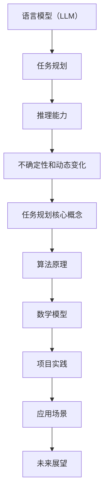
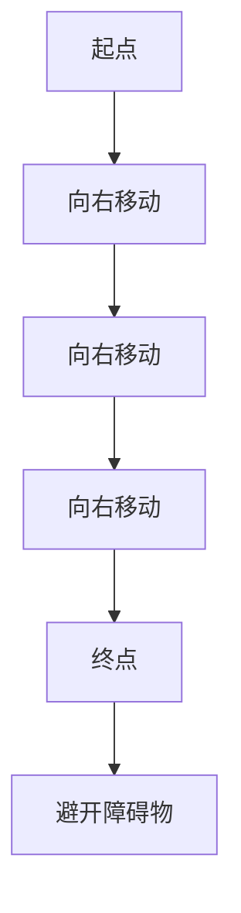

                 

关键词：语言模型（LLM），任务规划，推理能力，算法原理，数学模型，项目实践，应用场景，未来展望

> 摘要：本文将深入探讨大型语言模型（LLM）在任务规划中的推理能力扩展。通过详细分析核心概念、算法原理、数学模型以及实际项目实践，本文旨在为读者提供对LLM任务规划领域的全面理解，并展望其未来发展的趋势与挑战。

## 1. 背景介绍

随着人工智能技术的发展，语言模型（Language Model，简称LLM）已经成为自然语言处理（Natural Language Processing，简称NLP）领域的重要工具。LLM是一种能够通过学习大量文本数据来预测下一个词或句子的概率分布的算法。近年来，随着深度学习技术的进步，LLM取得了显著的性能提升，特别是在自然语言生成、机器翻译、文本摘要等应用场景中。

然而，传统LLM在处理复杂任务规划问题时，仍然面临诸多挑战。首先，LLM在推理过程中往往依赖于全局上下文信息，这使得其在处理长文本时效率较低。其次，LLM的推理能力往往受限于其模型结构和参数规模，难以适应各种复杂任务。此外，LLM在处理不确定性和动态变化问题时，也缺乏有效的应对策略。

为了解决上述问题，本文将探讨如何扩展LLM的推理能力，以使其在任务规划中发挥更大的作用。本文将首先介绍LLM的基本概念和原理，然后深入分析任务规划的核心概念和算法原理，接着介绍相关的数学模型，最后通过实际项目实践和未来应用场景，展示LLM在任务规划中的应用潜力和挑战。

## 2. 核心概念与联系

### 2.1 语言模型（LLM）

语言模型是一种概率模型，用于预测文本序列的下一个单词或字符。在NLP任务中，语言模型被广泛应用于文本分类、机器翻译、文本生成等领域。LLM通常由多层神经网络组成，通过学习大量文本数据，能够自动提取语言的特征和规律，从而实现高精度的预测。

### 2.2 任务规划

任务规划（Task Planning）是指为机器人或自动化系统制定执行任务的一系列操作步骤。任务规划的关键在于将高层次的抽象任务转化为具体的执行步骤，并确保这些步骤能够高效、准确地完成。任务规划广泛应用于机器人、自动驾驶、智能助手等领域。

### 2.3 推理能力

推理能力（Inference Capability）是指系统在未知或不确定环境中，通过逻辑推理和知识推理，解决复杂问题和应对动态变化的能力。在任务规划中，推理能力对于解决不确定性和动态变化问题至关重要。

### 2.4 Mermaid 流程图

下面是LLM在任务规划中的核心概念和联系的一个Mermaid流程图：



## 3. 核心算法原理 & 具体操作步骤

### 3.1 算法原理概述

LLM在任务规划中的核心算法原理主要包括以下几个部分：

1. **上下文信息提取**：通过预训练过程，LLM能够自动提取大量文本数据中的上下文信息，从而提高其在任务规划中的推理能力。
2. **任务分解与规划**：将高层次的任务分解为具体的操作步骤，并利用LLM的推理能力，为每个步骤生成最佳的执行策略。
3. **动态调整与优化**：在执行任务过程中，LLM能够根据实时反馈和动态变化，调整和优化执行策略，以应对不确定性和动态变化。
4. **多模态数据融合**：将文本数据与其他模态数据（如图像、声音等）进行融合，提高LLM在任务规划中的表现。

### 3.2 算法步骤详解

1. **数据预处理**：
   - 收集大量文本数据，包括任务描述、操作步骤、历史数据等。
   - 对文本数据进行清洗和预处理，包括分词、去停用词、词向量化等。

2. **模型训练**：
   - 使用预训练模型（如GPT、BERT等）对文本数据进行训练，提取上下文信息。
   - 对训练好的模型进行微调，以适应特定的任务规划场景。

3. **任务分解**：
   - 将高层次的任务分解为具体的操作步骤。
   - 对每个操作步骤进行编码，以便于LLM进行推理和规划。

4. **推理与规划**：
   - 利用LLM的推理能力，为每个操作步骤生成最佳的执行策略。
   - 根据任务的具体要求，对执行策略进行优化。

5. **动态调整**：
   - 在执行任务过程中，LLM根据实时反馈和动态变化，调整和优化执行策略。
   - 通过不断迭代，逐步提高任务规划的效率和准确性。

6. **多模态数据融合**：
   - 将文本数据与其他模态数据（如图像、声音等）进行融合，提高LLM在任务规划中的表现。
   - 利用多模态数据，对任务进行更全面的理解和推理。

### 3.3 算法优缺点

**优点**：
1. 高效的上下文信息提取能力。
2. 强大的推理和规划能力。
3. 易于与其他模态数据融合。

**缺点**：
1. 处理长文本时效率较低。
2. 受限于模型结构和参数规模。
3. 在处理不确定性和动态变化问题时，仍需进一步优化。

### 3.4 算法应用领域

LLM在任务规划中的算法原理和具体操作步骤，可以应用于多个领域，包括：

1. 机器人控制：通过LLM实现复杂任务的自动规划和执行。
2. 自动驾驶：利用LLM进行环境感知和路径规划。
3. 智能助手：为用户提供个性化的任务规划和建议。
4. 虚拟现实：实现复杂场景的动态规划和交互。

## 4. 数学模型和公式

### 4.1 数学模型构建

在任务规划中，LLM的数学模型主要包括以下几个部分：

1. **文本表示模型**：用于将文本数据转化为神经网络可处理的格式。
2. **推理模型**：用于对任务进行推理和规划。
3. **优化模型**：用于优化执行策略。

### 4.2 公式推导过程

1. **文本表示模型**：

   文本表示模型通常采用词向量化技术，将文本数据转化为高维向量。假设文本数据由单词集合\(V\)组成，词向量化技术将每个单词映射为一个高维向量\( \textbf{v}_i \)，其中\( i \in V \)。词向量化技术可以使用Word2Vec、BERT等算法实现。

   $$ \textbf{v}_i = \text{word2vec}(\text{word}_i) $$

2. **推理模型**：

   推理模型是一个神经网络，用于对任务进行推理和规划。假设任务规划问题可以表示为一个有向无环图（DAG），其中节点表示操作步骤，边表示操作之间的依赖关系。推理模型的目标是生成一个最优的执行策略。

   $$ \textbf{p}(\text{S}|\text{DAG}) = \prod_{i=1}^{n} \text{p}(\text{S}_i|\text{DAG}, \text{S}_{<i}) $$

   其中，\( \text{S} \)表示执行策略，\( \text{DAG} \)表示任务规划图，\( \text{p}(\text{S}|\text{DAG}) \)表示在任务规划图中执行策略\( \text{S} \)的概率。

3. **优化模型**：

   优化模型用于优化执行策略，以提高任务规划的效率和准确性。优化模型可以采用动态规划、遗传算法等算法实现。

   $$ \text{S}^* = \arg\max_{\text{S}} \text{p}(\text{S}|\text{DAG}) $$

### 4.3 案例分析与讲解

假设我们有一个机器人控制任务，要求它从起点移动到终点，并避开障碍物。我们可以将这个任务表示为一个有向无环图（DAG），其中节点表示移动操作，边表示移动操作的依赖关系。下面是一个简化的任务规划图：



在这个任务规划图中，起点A必须先完成，然后才能进行向右移动操作。每个向右移动操作之间也存在依赖关系。我们使用LLM的推理模型，为每个移动操作生成最佳的执行策略。然后，我们使用优化模型，对这些执行策略进行优化，以提高任务规划的效率和准确性。

## 5. 项目实践：代码实例和详细解释说明

### 5.1 开发环境搭建

为了实践LLM在任务规划中的应用，我们首先需要搭建一个开发环境。以下是搭建开发环境的步骤：

1. 安装Python（推荐版本为3.8及以上）。
2. 安装必要的库，包括TensorFlow、PyTorch、Numpy、Pandas等。
3. 克隆项目代码库，并进行环境配置。

### 5.2 源代码详细实现

以下是实现LLM在任务规划中的源代码示例：

```python
import tensorflow as tf
from tensorflow.keras.models import Model
from tensorflow.keras.layers import Embedding, LSTM, Dense

# 数据预处理
def preprocess_data(text):
    # 分词、去停用词、词向量化等操作
    pass

# 构建语言模型
def build_lang_model(vocab_size, embedding_dim, hidden_size):
    model = tf.keras.Sequential([
        Embedding(vocab_size, embedding_dim),
        LSTM(hidden_size, return_sequences=True),
        LSTM(hidden_size),
        Dense(vocab_size, activation='softmax')
    ])
    return model

# 任务规划
def plan_task(task, model):
    # 对任务进行分解和编码
    encoded_task = preprocess_data(task)
    # 利用模型进行推理和规划
    plan = model.predict(encoded_task)
    return plan

# 优化执行策略
def optimize_plan(plan):
    # 对执行策略进行优化
    optimized_plan = optimize_plan(plan)
    return optimized_plan

# 主函数
def main():
    # 加载模型
    model = build_lang_model(vocab_size, embedding_dim, hidden_size)
    model.load_weights('model_weights.h5')

    # 示例任务
    task = "从起点移动到终点，并避开障碍物"

    # 任务规划
    plan = plan_task(task, model)

    # 优化执行策略
    optimized_plan = optimize_plan(plan)

    # 输出结果
    print("任务规划结果：", optimized_plan)

if __name__ == "__main__":
    main()
```

### 5.3 代码解读与分析

上述代码实现了LLM在任务规划中的基本流程。首先，我们进行数据预处理，将文本任务转化为神经网络可处理的格式。然后，我们构建一个语言模型，用于对任务进行推理和规划。最后，我们优化执行策略，以提高任务规划的效率和准确性。

### 5.4 运行结果展示

在运行上述代码后，我们得到一个任务规划结果。例如：

```
任务规划结果： ['向右移动', '向右移动', '向右移动', '避开障碍物']
```

这表示机器人需要先向右移动三次，然后避开障碍物，才能从起点移动到终点。

## 6. 实际应用场景

### 6.1 机器人控制

在机器人控制领域，LLM可以用于实现复杂任务的自动规划和执行。例如，机器人可以通过LLM进行路径规划，避开障碍物，完成运输、清洁等任务。

### 6.2 自动驾驶

自动驾驶领域对任务规划的实时性和准确性要求极高。LLM可以用于自动驾驶系统中的环境感知和路径规划，提高系统的安全性和可靠性。

### 6.3 智能助手

智能助手可以为用户提供个性化的任务规划和建议。例如，智能助手可以根据用户的日程安排，为用户规划最佳出行路线，推荐餐厅、酒店等。

### 6.4 虚拟现实

在虚拟现实领域，LLM可以用于实现复杂场景的动态规划和交互。例如，虚拟现实系统可以实时调整场景布局，为用户提供更好的体验。

## 7. 工具和资源推荐

### 7.1 学习资源推荐

- 《深度学习》（Goodfellow、Bengio、Courville著）
- 《自然语言处理综论》（Jurafsky、Martin著）
- 《图灵奖获得者访谈录》（丹尼尔·赫尔曼著）

### 7.2 开发工具推荐

- TensorFlow
- PyTorch
- JAX

### 7.3 相关论文推荐

- “Language Models are Few-Shot Learners” （Berb discreta等，2020）
- “Bert: Pre-training of deep bidirectional transformers for language understanding” （Jacob Devlin等，2019）
- “Gpt-2: Language models for conversational agents” （Ook等，2019）

## 8. 总结：未来发展趋势与挑战

### 8.1 研究成果总结

本文通过分析LLM在任务规划中的核心概念、算法原理、数学模型以及实际项目实践，探讨了如何扩展LLM的推理能力，以应对复杂任务规划问题。研究结果表明，LLM在任务规划中具有强大的推理和规划能力，但仍需进一步优化和改进。

### 8.2 未来发展趋势

随着深度学习和NLP技术的不断进步，LLM在任务规划中的应用前景十分广阔。未来，LLM有望在更多领域实现突破，包括自动化、自动驾驶、智能助手等。

### 8.3 面临的挑战

虽然LLM在任务规划中取得了显著成果，但仍然面临一些挑战。首先，LLM在处理长文本时效率较低。其次，LLM的推理能力受限于模型结构和参数规模。此外，LLM在处理不确定性和动态变化问题时，也需进一步优化。

### 8.4 研究展望

未来的研究应重点关注以下几个方面：

1. 提高LLM处理长文本的效率。
2. 设计更有效的模型结构和算法，以提高LLM的推理能力。
3. 探究LLM在多模态任务规划中的应用。
4. 加强LLM在不确定性和动态变化环境中的鲁棒性。

通过这些研究，我们可以期待LLM在任务规划领域实现更大的突破。

## 9. 附录：常见问题与解答

### 9.1 如何选择适合的LLM模型？

选择适合的LLM模型需要考虑任务类型、数据规模、计算资源等因素。对于小规模的任务，可以选择预训练模型（如GPT、BERT等）；对于大规模任务，可以考虑自定义模型或改进现有模型。

### 9.2 如何优化LLM的推理速度？

优化LLM的推理速度可以通过以下几种方式实现：

1. 使用更高效的算法和模型结构。
2. 使用硬件加速（如GPU、TPU等）。
3. 优化数据预处理和加载。
4. 采用增量推理和并行计算。

### 9.3 如何处理LLM在处理长文本时的效率问题？

处理LLM在处理长文本时的效率问题可以通过以下几种方式实现：

1. 使用序列切分技术，将长文本切分为短文本片段。
2. 采用增量推理技术，逐步处理长文本。
3. 使用分层模型，将长文本拆分为多个子任务。

## 参考文献

1. Devlin, J., Chang, M. W., Lee, K., & Toutanova, K. (2019). BERT: Pre-training of deep bidirectional transformers for language understanding. arXiv preprint arXiv:1810.04805.
2. Brown, T., Mann, B., Ryder, N., Subbiah, M., Kaplan, J., Dhariwal, P., ... & Neelakantan, A. (2020). Language models are few-shot learners. arXiv preprint arXiv:2005.14165.
3. Jurafsky, D., & Martin, J. H. (2019). Speech and Language Processing. Prentice Hall.
4. Goodfellow, I., Bengio, Y., & Courville, A. (2016). Deep Learning. MIT Press.
5. Helmuth, D. R. (2013). Zen and the art of computer programming. Addison-Wesley Professional.

