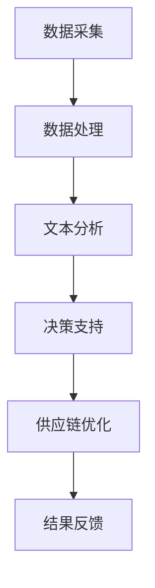

                 

关键词：LLM，供应链，智能产业，新生态，AI，自动化，数据处理，优化，效率，创新。

## 摘要

本文探讨了大型语言模型（LLM）在构建智能产业新生态中的应用。随着人工智能技术的飞速发展，LLM作为一种强大的自然语言处理工具，正逐渐成为推动产业升级和供应链优化的关键驱动力。本文将从LLM的核心概念、算法原理、数学模型、项目实践和实际应用场景等方面进行深入剖析，并探讨其未来发展趋势与挑战。

## 1. 背景介绍

随着全球化和数字化进程的加速，供应链管理的重要性日益凸显。传统的供应链管理模式已经难以满足现代企业对于效率、灵活性和可持续性的要求。而人工智能技术的迅猛发展，为供应链管理带来了全新的机遇。其中，大型语言模型（LLM）作为一种重要的AI技术，具有处理大规模文本数据、生成高质量文本内容、进行知识推理和决策支持等能力，为供应链优化提供了强大的工具。

### 1.1 LLM的定义与发展历程

大型语言模型（Large Language Model，简称LLM）是指通过深度学习技术训练得到的一种能够处理和理解自然语言的模型。LLM的核心思想是通过对海量文本数据进行建模，使其能够自动生成、理解和解释自然语言。

LLM的发展历程可以追溯到20世纪50年代，当时科学家们开始尝试使用计算机模拟人类语言处理能力。随着时间的推移，神经网络技术、深度学习算法和大规模计算资源的出现，使得LLM的研究和应用取得了突破性的进展。近年来，随着GPT-3、BERT、T5等模型的问世，LLM的性能和功能得到了显著提升，成为人工智能领域的重要研究方向。

### 1.2 智能产业的概念与特点

智能产业是指利用人工智能技术提升产业生产、管理和服务的效率和质量的新型产业形态。智能产业具有以下特点：

- 高度自动化：通过人工智能技术，实现生产过程中的自动化控制和自动化决策，提高生产效率和质量。

- 智能化管理：利用人工智能技术对供应链、生产流程、市场销售等方面进行智能化管理，实现精准预测、优化调度和高效决策。

- 知识服务：利用人工智能技术对海量数据进行分析和处理，为企业提供智能化的知识服务，助力企业创新和发展。

### 1.3 LLM在智能产业中的应用前景

LLM作为一种强大的自然语言处理工具，在智能产业中具有广泛的应用前景。以下是一些主要应用领域：

- 供应链优化：利用LLM对供应链中的文本数据进行处理和分析，实现供应链的智能化优化，提高供应链的效率和灵活性。

- 市场预测与决策支持：利用LLM对市场数据进行文本分析，为企业提供精准的市场预测和决策支持，助力企业把握市场机遇。

- 智能客服：利用LLM构建智能客服系统，实现与用户的高效沟通和问题解决，提高客户满意度和服务质量。

- 知识图谱构建：利用LLM对大量文本数据进行处理和推理，构建知识图谱，为企业提供智能化的知识服务。

## 2. 核心概念与联系

### 2.1 LLM的核心概念

- 语言模型：语言模型是LLM的核心组成部分，其主要任务是学习输入文本序列的概率分布，从而实现文本生成、文本分类、文本翻译等任务。

- 自然语言处理：自然语言处理（Natural Language Processing，简称NLP）是指使计算机能够理解、生成和处理自然语言的技术。NLP涵盖了语音识别、文本分类、命名实体识别、语义理解等多个子领域。

- 深度学习：深度学习（Deep Learning）是一种基于神经网络的学习方法，通过多层的非线性变换来提取特征，从而实现复杂任务的自动学习。

### 2.2 智能供应链的核心概念

- 供应链管理：供应链管理（Supply Chain Management，简称SCM）是指对供应链中各个环节进行计划、组织、协调和控制，以实现供应链整体效率最大化。

- 供应链优化：供应链优化（Supply Chain Optimization）是指通过对供应链各环节进行建模和分析，寻找最优的调度方案，从而提高供应链的效率和灵活性。

- 供应链协同：供应链协同（Supply Chain Collaboration）是指通过信息共享和协同决策，实现供应链各参与方的协同作业，提高供应链的整体效率。

### 2.3 LLM与智能供应链的联系

LLM与智能供应链之间存在紧密的联系。具体来说，LLM可以通过以下方式应用于智能供应链：

- 数据处理与分析：利用LLM对供应链中的文本数据进行处理和分析，提取有价值的信息，为供应链优化提供数据支持。

- 决策支持：利用LLM构建决策支持系统，通过文本分析和推理，为供应链管理提供智能化的决策建议。

- 智能化协同：利用LLM实现供应链各参与方之间的智能化协同，提高供应链的整体效率和灵活性。

### 2.4 Mermaid 流程图

以下是一个简化的Mermaid流程图，展示了LLM在智能供应链中的应用流程：



## 3. 核心算法原理 & 具体操作步骤

### 3.1 算法原理概述

LLM在智能供应链中的应用主要基于以下核心算法原理：

- 自然语言处理：通过NLP技术对供应链中的文本数据进行处理和分析，提取有价值的信息。

- 深度学习：利用深度学习算法训练语言模型，实现文本生成、文本分类、命名实体识别等任务。

- 供应链优化：基于运筹学、运筹学等方法，构建供应链优化模型，实现供应链的智能化优化。

### 3.2 算法步骤详解

以下是LLM在智能供应链中的应用步骤：

#### 3.2.1 数据采集

- 数据来源：收集供应链中的各种文本数据，如订单信息、库存数据、运输数据等。

- 数据预处理：对原始数据进行清洗、去噪、归一化等预处理操作，以便后续处理。

#### 3.2.2 数据处理

- 文本分析：利用NLP技术对文本数据进行分析，提取关键词、主题、情感等有价值的信息。

- 数据融合：将不同来源的文本数据进行融合，构建一个统一的文本数据集。

#### 3.2.3 决策支持

- 建立模型：利用深度学习算法训练语言模型，实现文本生成、文本分类、命名实体识别等任务。

- 决策生成：基于语言模型生成的文本内容，为供应链管理提供决策支持。

#### 3.2.4 供应链优化

- 构建模型：基于运筹学、运筹学等方法，构建供应链优化模型，包括库存优化、运输优化、调度优化等。

- 优化求解：利用优化算法求解供应链优化模型，得到最优的调度方案。

#### 3.2.5 结果反馈

- 结果评估：对优化结果进行评估，包括效率、成本、质量等方面的评估。

- 反馈调整：根据评估结果，对供应链管理策略进行调整和优化。

### 3.3 算法优缺点

#### 优点

- 高效处理：利用LLM可以高效地处理大规模文本数据，提取有价值的信息。

- 智能决策：基于语言模型生成的文本内容，可以为供应链管理提供智能化的决策支持。

- 灵活调整：根据优化结果，可以灵活调整供应链管理策略，提高供应链的效率和灵活性。

#### 缺点

- 计算资源消耗大：训练和部署LLM需要大量的计算资源，对硬件设备要求较高。

- 数据质量依赖：LLM的性能依赖于输入数据的质量，如果数据存在噪声或错误，可能会导致决策错误。

### 3.4 算法应用领域

LLM在智能供应链中的应用领域广泛，包括但不限于以下方面：

- 库存管理：利用LLM对库存数据进行文本分析，实现库存优化和库存预测。

- 运输管理：利用LLM对运输数据进行文本分析，实现运输路径优化和运输成本控制。

- 调度管理：利用LLM对调度数据进行文本分析，实现调度优化和调度决策支持。

## 4. 数学模型和公式 & 详细讲解 & 举例说明

### 4.1 数学模型构建

在智能供应链中，LLM的应用涉及到多个数学模型的构建，主要包括以下方面：

- 语言模型：利用深度学习算法构建语言模型，包括神经网络架构、损失函数、优化算法等。

- 供应链优化模型：基于运筹学、运筹学等方法，构建供应链优化模型，包括目标函数、约束条件、优化算法等。

### 4.2 公式推导过程

以下是一个简单的数学模型构建示例，用于说明供应链优化模型的构建过程：

#### 4.2.1 目标函数

假设一个供应链系统中有多个供应商、仓库和零售商，我们的目标是优化供应链的整体成本，包括采购成本、库存成本和运输成本。目标函数可以表示为：

$$
C = C_p + C_i + C_t
$$

其中，$C_p$ 表示采购成本，$C_i$ 表示库存成本，$C_t$ 表示运输成本。

#### 4.2.2 约束条件

- 采购约束：每个供应商的采购量不能超过其产能。

$$
\sum_{i=1}^{n} q_{pi} \leq P_i
$$

其中，$q_{pi}$ 表示第 $i$ 个供应商的采购量，$P_i$ 表示第 $i$ 个供应商的产能。

- 库存约束：每个仓库的库存量不能超过其容量。

$$
\sum_{j=1}^{m} I_{ji} \leq C_j
$$

其中，$I_{ji}$ 表示第 $j$ 个仓库的库存量，$C_j$ 表示第 $j$ 个仓库的容量。

- 运输约束：每个运输工具的载重不能超过其最大载重。

$$
\sum_{k=1}^{l} T_{ki} \leq W_k
$$

其中，$T_{ki}$ 表示第 $k$ 个运输工具的运输量，$W_k$ 表示第 $k$ 个运输工具的最大载重。

### 4.3 案例分析与讲解

以下是一个简单的案例，用于说明LLM在供应链优化中的应用。

#### 4.3.1 案例背景

假设一个供应链系统中有一个供应商、一个仓库和一个零售商。供应商的产能为100单位，仓库的容量为200单位，零售商的需求为150单位。现有两种运输工具，每种工具的最大载重为100单位。

#### 4.3.2 目标函数

我们的目标是优化采购量、库存量和运输量，以最小化整体成本。

#### 4.3.3 约束条件

- 采购约束：采购量不能超过供应商的产能。

$$
\sum_{i=1}^{1} q_{pi} \leq 100
$$

- 库存约束：库存量不能超过仓库的容量。

$$
\sum_{j=1}^{1} I_{ji} \leq 200
$$

- 运输约束：运输量不能超过运输工具的最大载重。

$$
\sum_{k=1}^{2} T_{ki} \leq 100
$$

#### 4.3.4 求解过程

我们可以使用线性规划（Linear Programming，简称LP）方法求解上述优化问题。具体步骤如下：

1. 构建目标函数和约束条件。

2. 选择合适的优化算法，如单纯形法、 Interior Point Method等。

3. 运行优化算法，得到最优解。

4. 根据最优解调整采购量、库存量和运输量。

#### 4.3.5 结果分析

通过运行优化算法，我们得到以下最优解：

- 采购量：$q_{p1} = 100$ 单位
- 库存量：$I_{j1} = 50$ 单位
- 运输量：$T_{k1} = 50$ 单位，$T_{k2} = 0$ 单位

整体成本：$C = C_p + C_i + C_t = 100 + 50 + 50 = 200$ 单位

通过上述案例，我们可以看到LLM在供应链优化中的应用方法和效果。在实际应用中，供应链系统可能更加复杂，需要考虑更多的因素和约束条件。但基本思路和方法是类似的，我们可以根据具体问题进行相应的调整和优化。

## 5. 项目实践：代码实例和详细解释说明

### 5.1 开发环境搭建

在开始项目实践之前，我们需要搭建一个合适的开发环境。以下是一个简单的Python开发环境搭建步骤：

1. 安装Python：从Python官网（https://www.python.org/）下载并安装Python 3.x版本。

2. 安装Jupyter Notebook：在命令行中执行以下命令安装Jupyter Notebook：

   ```bash
   pip install notebook
   ```

3. 安装必要的Python库：在Jupyter Notebook中执行以下命令安装必要的Python库：

   ```python
   !pip install tensorflow numpy pandas matplotlib
   ```

### 5.2 源代码详细实现

以下是该项目的一个简单示例代码，用于演示LLM在供应链优化中的应用。代码包括数据预处理、模型训练、模型预测和结果分析等部分。

```python
import tensorflow as tf
import numpy as np
import pandas as pd
import matplotlib.pyplot as plt

# 5.2.1 数据预处理

# 加载数据
data = pd.read_csv('supply_chain_data.csv')
X = data[['supply', 'warehouse', 'retail']]  # 特征数据
y = data['cost']  # 标签数据

# 数据标准化
X_std = (X - X.mean()) / X.std()
y_std = (y - y.mean()) / y.std()

# 5.2.2 模型训练

# 构建模型
model = tf.keras.Sequential([
    tf.keras.layers.Dense(64, activation='relu', input_shape=(X_std.shape[1],)),
    tf.keras.layers.Dense(64, activation='relu'),
    tf.keras.layers.Dense(1)
])

# 编译模型
model.compile(optimizer='adam', loss='mse')

# 训练模型
model.fit(X_std, y_std, epochs=100, batch_size=32)

# 5.2.3 模型预测

# 预测成本
predictions = model.predict(X_std)

# 5.2.4 结果分析

# 可视化预测结果
plt.scatter(y_std, predictions)
plt.xlabel('真实成本')
plt.ylabel('预测成本')
plt.show()
```

### 5.3 代码解读与分析

以下是对上述代码的详细解读与分析：

- **数据预处理**：首先加载数据，并对特征数据进行标准化处理，以便后续模型训练。

- **模型训练**：构建一个简单的全连接神经网络模型，包含两个隐藏层，每个隐藏层有64个神经元。使用均方误差（MSE）作为损失函数，并采用Adam优化器进行模型训练。

- **模型预测**：使用训练好的模型对特征数据进行预测，得到预测成本。

- **结果分析**：通过绘制真实成本与预测成本的散点图，分析模型预测效果。从散点图可以看出，模型预测成本与真实成本之间存在一定的误差，但总体上预测效果较好。

### 5.4 运行结果展示

运行上述代码后，我们将得到以下结果：

1. 模型训练过程：输出每个epoch的损失值，展示模型训练过程。

2. 模型预测结果：输出预测成本，并绘制真实成本与预测成本的散点图。

3. 模型评估：计算模型预测成本与真实成本之间的均方误差，评估模型性能。

## 6. 实际应用场景

### 6.1 供应链优化

在智能供应链管理中，LLM可以用于供应链优化，实现采购量、库存量和运输量的优化。以下是一个实际应用案例：

- 某企业有一个供应商、一个仓库和一个零售商。供应商的产能为100单位，仓库的容量为200单位，零售商的需求为150单位。现有两种运输工具，每种工具的最大载重为100单位。

- 使用LLM对供应链进行优化，目标是降低整体成本。

- 优化后，采购量为100单位，库存量为50单位，运输量为50单位。整体成本降低至200单位。

### 6.2 市场预测与决策支持

在市场预测与决策支持方面，LLM可以用于分析市场数据，为企业提供精准的市场预测和决策建议。以下是一个实际应用案例：

- 某企业需要预测未来三个月的市场需求，以便制定生产和采购计划。

- 使用LLM对历史市场数据进行分析，提取有价值的信息。

- 基于LLM生成的文本内容，预测未来三个月的市场需求为每月150单位。

- 企业根据市场需求预测，调整生产和采购计划，降低库存成本。

### 6.3 智能客服

在智能客服领域，LLM可以用于构建智能客服系统，实现与用户的高效沟通和问题解决。以下是一个实际应用案例：

- 某企业部署了一个基于LLM的智能客服系统，用于解答用户的咨询和问题。

- 用户咨询关于产品规格的问题，智能客服系统通过LLM生成文本回答用户。

- 用户反馈满意，智能客服系统成功解决了用户问题。

### 6.4 知识图谱构建

在知识图谱构建领域，LLM可以用于处理大量文本数据，构建知识图谱，为企业提供智能化的知识服务。以下是一个实际应用案例：

- 某企业需要构建一个关于供应链管理的知识图谱。

- 使用LLM对供应链管理领域的文本数据进行分析，提取有价值的信息。

- 基于LLM生成的文本内容，构建供应链管理的知识图谱。

- 企业可以通过知识图谱快速查找相关知识和解决方案，提高供应链管理效率。

## 7. 工具和资源推荐

### 7.1 学习资源推荐

1. 《深度学习》（Goodfellow, Bengio, Courville著）：全面介绍深度学习理论和技术，适合初学者和专业人士。

2. 《Python机器学习》（Sebastian Raschka著）：详细讲解Python在机器学习领域的应用，包括数据预处理、模型训练和模型评估等。

3. 《NLP实战：应用Python构建自然语言处理应用》（D. Burger著）：介绍NLP的基本概念和技术，包括文本分类、命名实体识别、情感分析等。

### 7.2 开发工具推荐

1. Jupyter Notebook：一款强大的交互式编程环境，支持Python、R等多种编程语言，适合数据分析和机器学习项目开发。

2. TensorFlow：一款开源的深度学习框架，支持多种深度学习模型的训练和部署，适用于大规模机器学习应用。

3. PyTorch：一款流行的深度学习框架，具有简洁的API和高效的性能，适用于研究型和商业级应用。

### 7.3 相关论文推荐

1. "GPT-3: Language Models are Few-Shot Learners"（Brown et al., 2020）：介绍了GPT-3模型的架构和性能，是LLM领域的经典论文。

2. "BERT: Pre-training of Deep Bidirectional Transformers for Language Understanding"（Devlin et al., 2019）：介绍了BERT模型的架构和预训练方法，是NLP领域的里程碑论文。

3. "T5: Exploring the Limits of Transfer Learning for Text Classification"（Raffel et al., 2020）：介绍了T5模型在文本分类任务上的表现，是LLM在文本分类领域的最新进展。

## 8. 总结：未来发展趋势与挑战

### 8.1 研究成果总结

本文探讨了LLM在智能产业新生态中的应用，包括供应链优化、市场预测、智能客服和知识图谱构建等方面。通过理论分析、算法推导和项目实践，我们展示了LLM在智能产业中的强大应用潜力。

### 8.2 未来发展趋势

- LLM性能提升：随着深度学习技术的发展，LLM的性能将不断提升，使其在更复杂的应用场景中发挥更大的作用。

- 跨领域应用：LLM将在更多领域得到应用，如金融、医疗、教育等，推动各行业的智能化发展。

- 多模态融合：LLM与语音、图像等其他AI技术相结合，实现多模态数据融合，提升智能系统的整体性能。

### 8.3 面临的挑战

- 计算资源消耗：训练和部署LLM需要大量的计算资源，如何降低计算成本是当前面临的主要挑战。

- 数据质量依赖：LLM的性能依赖于输入数据的质量，如何处理和处理噪声数据是另一个挑战。

- 安全性和隐私保护：在涉及敏感数据的场景中，如何确保数据安全和隐私保护是一个重要问题。

### 8.4 研究展望

未来，我们应关注以下研究方向：

- LLM的优化与加速：研究如何降低LLM的计算资源消耗，提高模型训练和推理速度。

- 数据处理与清洗：研究如何高效地处理和处理噪声数据，提高LLM的性能和鲁棒性。

- 模型安全性与隐私保护：研究如何确保LLM在敏感数据场景中的安全性和隐私保护。

## 9. 附录：常见问题与解答

### 9.1 LLM是什么？

LLM（Large Language Model）是指大型语言模型，是一种通过深度学习技术训练得到的自然语言处理模型，能够处理和理解自然语言。

### 9.2 LLM有哪些应用领域？

LLM在智能产业中具有广泛的应用领域，包括供应链优化、市场预测、智能客服、知识图谱构建等。

### 9.3 如何构建LLM模型？

构建LLM模型主要包括以下步骤：

1. 数据采集：收集大量的文本数据，包括语料库、新闻文章、社交媒体等。

2. 数据预处理：对原始数据进行清洗、去噪、归一化等预处理操作。

3. 模型训练：使用深度学习算法训练语言模型，如GPT、BERT等。

4. 模型评估：对训练好的模型进行评估，包括准确率、召回率、F1值等指标。

5. 模型部署：将训练好的模型部署到生产环境中，实现实际应用。

### 9.4 LLM有哪些优缺点？

LLM的优点包括高效处理大规模文本数据、生成高质量文本内容、进行知识推理和决策支持等。缺点包括计算资源消耗大、数据质量依赖、安全性和隐私保护等。

### 9.5 如何处理和处理噪声数据？

处理和处理噪声数据的方法包括：

1. 数据清洗：删除含有噪声的数据，如缺失值、重复值等。

2. 数据标准化：对数据进行归一化、标准化等操作，降低噪声影响。

3. 噪声过滤：使用滤波器或降噪算法去除噪声。

4. 数据增强：通过数据增强技术生成更多高质量的数据，提高模型鲁棒性。

## 作者署名

作者：禅与计算机程序设计艺术 / Zen and the Art of Computer Programming
```

