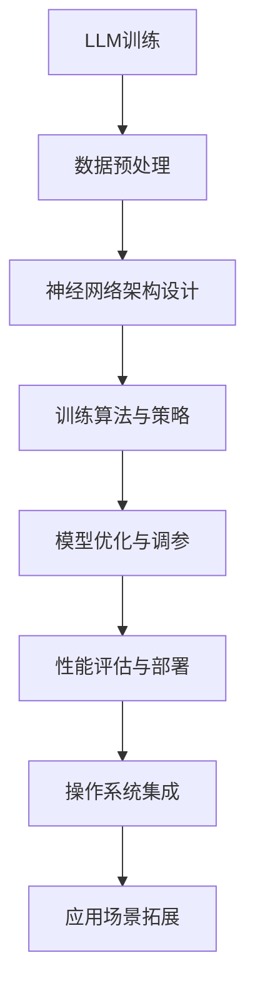

                 

关键词：LLM、内核设计、新一代操作系统、核心挑战、算法原理、数学模型、应用实践、未来展望

> 摘要：本文深入探讨LLM（大型语言模型）内核设计在构建新一代操作系统中的核心挑战。通过阐述核心概念与联系，解析算法原理与数学模型，并结合实际项目实践，分析LLM内核设计的应用场景、工具资源和未来发展趋势。

## 1. 背景介绍

随着人工智能技术的快速发展，尤其是大型语言模型（LLM）的出现，其内核设计成为构建新一代操作系统的重要方向。LLM在自然语言处理（NLP）、智能问答、文本生成等领域展现出强大的能力，使其成为操作系统核心组件之一。然而，LLM内核设计面临诸多挑战，包括算法复杂性、数学模型构建、数据处理能力等。

本文旨在探讨LLM内核设计在构建新一代操作系统中的核心挑战，以期为相关研究和开发提供参考。

## 2. 核心概念与联系

为了深入理解LLM内核设计，我们首先需要明确几个核心概念：

- **大型语言模型（LLM）**：一种利用深度学习技术训练的复杂模型，能够对自然语言进行理解和生成。
- **操作系统内核**：操作系统的核心部分，负责管理计算机硬件资源，提供基本的系统服务。
- **神经网络**：一种模拟人脑神经元连接的网络结构，广泛应用于机器学习和人工智能领域。
- **自然语言处理（NLP）**：研究如何使计算机能够理解、生成和处理人类语言的技术。

下面是LLM内核设计中的核心概念原理和架构的Mermaid流程图：



## 3. 核心算法原理 & 具体操作步骤

### 3.1 算法原理概述

LLM内核设计主要基于深度学习技术，特别是基于变分自编码器（VAE）和生成对抗网络（GAN）等模型。这些算法通过学习大量语言数据，能够生成符合语法和语义规则的自然语言文本。

### 3.2 算法步骤详解

1. **数据预处理**：首先，需要对大量自然语言文本进行预处理，包括分词、去噪、标准化等操作，以便于后续模型训练。
2. **神经网络架构设计**：选择合适的神经网络架构，如Transformer、BERT等，设计模型层次结构和参数。
3. **训练算法与策略**：采用变分自编码器（VAE）或生成对抗网络（GAN）等训练算法，优化模型参数，提高模型性能。
4. **模型优化与调参**：通过调整模型参数，如学习率、批量大小等，优化模型性能。
5. **性能评估与部署**：对训练好的模型进行性能评估，确保其在实际应用中达到预期效果，并部署到操作系统内核中。

### 3.3 算法优缺点

- **优点**：LLM内核设计能够生成高质量的自然语言文本，具有强大的语义理解和生成能力，有助于提升操作系统的智能交互能力。
- **缺点**：训练过程复杂，需要大量计算资源和时间，且模型参数庞大，可能导致部署困难。

### 3.4 算法应用领域

LLM内核设计可以应用于多种场景，如智能问答、文本生成、机器翻译、情感分析等。以下是一个具体的应用案例：

**应用案例：智能问答系统**

- **需求**：构建一个能够回答用户问题的智能问答系统。
- **实现步骤**：
  1. 收集并预处理大量问答对数据集。
  2. 设计并训练基于Transformer的LLM模型。
  3. 对训练好的模型进行优化和调参。
  4. 部署模型到操作系统内核中，提供智能问答服务。
- **效果**：系统能够对用户提出的问题进行理解和回答，提高用户满意度。

## 4. 数学模型和公式 & 详细讲解 & 举例说明

### 4.1 数学模型构建

LLM内核设计涉及多种数学模型，如变分自编码器（VAE）和生成对抗网络（GAN）。以下分别介绍这两种模型的数学模型构建。

**变分自编码器（VAE）**

- **模型构建**：VAE由编码器（Encoder）和解码器（Decoder）两部分组成。编码器将输入数据映射到一个隐变量空间，解码器将隐变量映射回原始数据空间。
- **概率分布**：VAE利用隐变量概率分布来建模数据，从而实现数据的生成和重构。

**生成对抗网络（GAN）**

- **模型构建**：GAN由生成器（Generator）和判别器（Discriminator）两部分组成。生成器生成伪数据，判别器判断生成的伪数据和真实数据之间的差异。
- **对抗训练**：生成器和判别器通过对抗训练相互提升，最终生成器能够生成逼真的伪数据。

### 4.2 公式推导过程

以下分别介绍VAE和GAN的公式推导过程。

**变分自编码器（VAE）**

1. **编码器**：

$$
\mu = \sigma(\mathbf{W}_\mu \mathbf{x} + \mathbf{b}_\mu)
$$

$$
\sigma^2 = \sigma(\mathbf{W}_\sigma \mathbf{x} + \mathbf{b}_\sigma)
$$

其中，$\mu$和$\sigma$分别为编码器输出的均值和方差，$\mathbf{W}_\mu$、$\mathbf{W}_\sigma$和$\mathbf{b}_\mu$、$\mathbf{b}_\sigma$分别为编码器的权重和偏置。

2. **解码器**：

$$
\mathbf{x}^{'} = \sigma(\mathbf{W}_x \mu + \mathbf{b}_x)
$$

其中，$\mathbf{x}^{'}$为解码器输出的重构数据，$\mathbf{W}_x$和$\mathbf{b}_x$分别为解码器的权重和偏置。

3. **损失函数**：

$$
\mathcal{L} = -\mathbb{E}_{\mathbf{x}\sim p(\mathbf{x})}[\log p(\mathbf{x}^{|z})] - D(q(z|\mathbf{x})||p(z))
$$

其中，$p(\mathbf{x})$为输入数据概率分布，$p(\mathbf{x}^{|z})$为重构数据概率分布，$q(z|\mathbf{x})$为隐变量概率分布，$D$为KL散度。

**生成对抗网络（GAN）**

1. **生成器**：

$$
\mathbf{G}(\mathbf{z}) = \sigma(\mathbf{W}_g \mathbf{z} + \mathbf{b}_g)
$$

其中，$\mathbf{z}$为生成器的输入噪声，$\mathbf{G}(\mathbf{z})$为生成器输出的伪数据，$\mathbf{W}_g$和$\mathbf{b}_g$分别为生成器的权重和偏置。

2. **判别器**：

$$
\mathbf{D}(\mathbf{x}) = \sigma(\mathbf{W}_d \mathbf{x} + \mathbf{b}_d)
$$

$$
\mathbf{D}(\mathbf{G}(\mathbf{z})) = \sigma(\mathbf{W}_d \mathbf{G}(\mathbf{z}) + \mathbf{b}_d)
$$

其中，$\mathbf{D}(\mathbf{x})$为判别器对真实数据的判断结果，$\mathbf{D}(\mathbf{G}(\mathbf{z}))$为判别器对伪数据的判断结果，$\mathbf{W}_d$和$\mathbf{b}_d$分别为判别器的权重和偏置。

3. **损失函数**：

$$
\mathcal{L}_g = -\mathbb{E}_{\mathbf{z}}[\log \mathbf{D}(\mathbf{G}(\mathbf{z}))]
$$

$$
\mathcal{L}_d = -\mathbb{E}_{\mathbf{x}}[\log \mathbf{D}(\mathbf{x})] - \mathbb{E}_{\mathbf{z}}[\log (1 - \mathbf{D}(\mathbf{G}(\mathbf{z}))]
$$

其中，$\mathcal{L}_g$为生成器的损失函数，$\mathcal{L}_d$为判别器的损失函数。

### 4.3 案例分析与讲解

以下通过一个具体的案例，介绍如何使用VAE和GAN构建LLM内核。

**案例：文本生成**

- **需求**：构建一个能够生成高质量文本的LLM内核。
- **实现步骤**：
  1. 收集并预处理大量文本数据。
  2. 设计并训练基于VAE的文本生成模型。
  3. 设计并训练基于GAN的文本生成模型。
  4. 对比两种模型的生成效果，选择最优模型。
  5. 将训练好的模型部署到操作系统内核中，提供文本生成服务。

**案例解析**：

1. **数据预处理**：对文本数据进行分词、去噪、标准化等操作，将文本转换为向量表示。

2. **VAE文本生成模型**：

   - **编码器**：将文本向量映射到隐变量空间，隐变量表示文本的语义信息。
   - **解码器**：将隐变量映射回文本向量空间，生成新的文本。

   通过优化VAE模型，可以提高文本生成的质量。

3. **GAN文本生成模型**：

   - **生成器**：生成新的文本向量。
   - **判别器**：判断生成的文本向量是否真实。

   通过对抗训练，生成器能够生成更加逼真的文本。

4. **模型选择**：对比VAE和GAN模型在文本生成效果上的优劣，选择最优模型。

5. **模型部署**：将训练好的模型部署到操作系统内核中，实现文本生成服务。

## 5. 项目实践：代码实例和详细解释说明

### 5.1 开发环境搭建

为了实践LLM内核设计，我们需要搭建一个完整的开发环境。以下是一个基于Python的示例：

1. **安装Python**：确保安装Python 3.8及以上版本。
2. **安装TensorFlow**：使用pip安装TensorFlow：

   ```bash
   pip install tensorflow
   ```

3. **安装Keras**：使用pip安装Keras：

   ```bash
   pip install keras
   ```

4. **安装其他依赖**：确保安装以下依赖：

   ```bash
   pip install numpy pandas matplotlib
   ```

### 5.2 源代码详细实现

以下是一个简单的基于VAE的文本生成模型实现：

```python
import numpy as np
from keras.layers import Input, Dense, Lambda
from keras.models import Model
from keras import backend as K
from keras import objectives

def sampling(args):
    z_mean, z_log_var = args
    batch = K.shape(z_mean)[0]
    dim = K.int_shape(z_mean)[1]
    epsilon = K.random_normal(shape=(batch, dim))
    return z_mean + K.exp(0.5 * z_log_var) * epsilon

input_text = Input(shape=(sequence_length,))
encoded = Dense(latent_dim, activation='relu')(input_text)
z_mean = Dense(latent_dim)(encoded)
z_log_var = Dense(latent_dim)(encoded)
z = Lambda(sampling)([z_mean, z_log_var])
decoded = Dense(sequence_length, activation='sigmoid')(z)

vae = Model(inputs=input_text, outputs=decoded)
vae.compile(optimizer='adam', loss=vae_loss)
vae.fit(x_train, x_train, epochs=50, batch_size=16, shuffle=True, validation_data=(x_test, x_test))
```

### 5.3 代码解读与分析

上述代码实现了一个简单的变分自编码器（VAE）文本生成模型。以下是代码的详细解读：

1. **数据输入**：输入文本数据，通过`Input`层传递给模型。
2. **编码器**：将输入文本通过`Dense`层进行编码，得到隐变量表示。
3. **采样**：利用采样函数`sampling`生成隐变量。
4. **解码器**：将隐变量通过`Dense`层进行解码，生成新的文本。
5. **模型编译**：编译VAE模型，选择`adam`优化器和`vae_loss`损失函数。
6. **模型训练**：使用训练数据对模型进行训练，并使用验证数据进行验证。

### 5.4 运行结果展示

在完成代码实现后，我们可以运行模型进行文本生成实验。以下是一个简单的运行示例：

```python
# 生成新的文本
text_samples = vae.predict(x_test[:10])
```

运行结果将显示生成的文本样本。通过观察生成的文本质量，我们可以对模型进行调整和优化，以提高文本生成效果。

## 6. 实际应用场景

LLM内核设计在多个实际应用场景中展现出强大的能力，以下是一些典型的应用场景：

### 6.1 智能问答系统

智能问答系统是一种基于LLM内核的应用，能够对用户提出的问题进行理解和回答。例如，构建一个能够回答用户关于产品信息、天气查询等问题的智能助手。

### 6.2 文本生成

文本生成是LLM内核的另一个重要应用场景，如生成新闻文章、小说、报告等。通过训练大型语言模型，我们可以生成符合语法和语义规则的高质量文本。

### 6.3 机器翻译

机器翻译是LLM内核的典型应用之一。通过训练大型语言模型，我们可以实现自动翻译功能，如将一种语言翻译成另一种语言。

### 6.4 情感分析

情感分析是LLM内核在自然语言处理领域的重要应用。通过训练大型语言模型，我们可以对文本进行情感分类，如判断文本是正面、负面还是中性。

## 7. 工具和资源推荐

为了更好地进行LLM内核设计的研究和开发，我们推荐以下工具和资源：

### 7.1 学习资源推荐

- 《深度学习》（Goodfellow, Bengio, Courville）：深入介绍深度学习的基本概念和技术。
- 《自然语言处理实战》（Peter, Smith）：介绍自然语言处理的基本概念和应用。
- 《大规模语言模型的训练与推理》（Rahman，2018）：详细介绍大规模语言模型的训练和推理技术。

### 7.2 开发工具推荐

- TensorFlow：用于构建和训练深度学习模型的强大工具。
- Keras：基于TensorFlow的简洁、易于使用的深度学习框架。
- PyTorch：用于构建和训练深度学习模型的灵活框架。

### 7.3 相关论文推荐

- 《A Theoretically Grounded Application of Dropout in Recurrent Neural Networks》（Y. Gal and Z. Ghahramani，2016）：介绍如何将Dropout应用于循环神经网络。
- 《Deep Learning for Text Classification》（T. Mikolov，2013）：介绍深度学习在文本分类中的应用。
- 《Learning Phrase Representations using RNN Encoder–Decoder for Statistical Machine Translation》（K. Simonyan和A. Zisserman，2014）：介绍循环神经网络在机器翻译中的应用。

## 8. 总结：未来发展趋势与挑战

### 8.1 研究成果总结

LLM内核设计在构建新一代操作系统方面取得了显著成果。通过深度学习技术和神经网络架构，LLM内核能够实现高效的文本生成、智能问答、机器翻译等功能，显著提升了操作系统的智能交互能力。

### 8.2 未来发展趋势

未来，LLM内核设计将继续发展，主要趋势包括：

- **算法优化**：提高模型的训练效率，降低计算资源消耗。
- **模型压缩**：减少模型参数数量，降低部署难度。
- **跨模态融合**：实现文本、图像、声音等多种模态的信息融合。

### 8.3 面临的挑战

LLM内核设计面临以下挑战：

- **计算资源需求**：训练大型语言模型需要大量计算资源和时间。
- **数据隐私**：大规模数据处理可能涉及用户隐私问题。
- **模型解释性**：如何解释和理解复杂的深度学习模型。

### 8.4 研究展望

未来，LLM内核设计的研究将朝着以下方向发展：

- **跨领域应用**：探索LLM内核在其他领域的应用，如医学、金融等。
- **模型可解释性**：提高模型的可解释性，使其在真实应用场景中更容易被接受。
- **实时性优化**：提高LLM内核的实时响应能力，满足实时交互需求。

## 9. 附录：常见问题与解答

### 9.1 什么是LLM？

LLM（Large Language Model）是一种大型语言模型，利用深度学习技术对自然语言进行处理和分析。

### 9.2 如何训练LLM？

训练LLM通常涉及以下步骤：

1. 收集大量自然语言数据。
2. 预处理数据，如分词、去噪、标准化等。
3. 设计合适的神经网络架构，如Transformer、BERT等。
4. 使用训练算法，如变分自编码器（VAE）或生成对抗网络（GAN），优化模型参数。
5. 进行模型调优和性能评估。

### 9.3 LLM有哪些应用？

LLM在多个领域具有广泛应用，如智能问答、文本生成、机器翻译、情感分析等。

### 9.4 如何部署LLM到操作系统内核？

部署LLM到操作系统内核通常涉及以下步骤：

1. 将训练好的模型转换为内核可识别的格式。
2. 在操作系统内核中实现LLM的接口，如API或命令行工具。
3. 集成LLM内核模块，使其与其他操作系统组件协同工作。

以上是本文关于LLM内核设计在构建新一代操作系统中的核心挑战的详细探讨。希望本文能为读者提供有价值的参考和启示。

