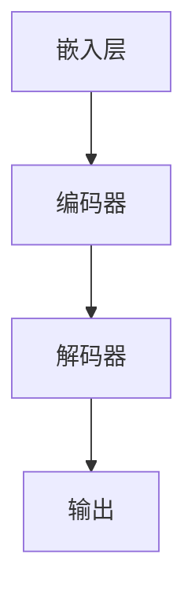

                 

关键词：LLM函数库，AI应用，编程工具，人工智能算法，深度学习，自然语言处理

> 摘要：本文旨在深入探讨LLM函数库在构建AI应用中的重要性和应用价值，通过对核心概念、算法原理、数学模型、项目实践和未来发展趋势的详细解析，为开发者提供一套完整的工具箱，以应对日益复杂的AI开发需求。

## 1. 背景介绍

随着人工智能（AI）技术的飞速发展，自然语言处理（NLP）已经成为AI领域的热点。而大型语言模型（LLM，Large Language Model）作为NLP的核心技术，已经在各种实际应用中展现出强大的能力。从智能客服、智能翻译到文本生成和内容审核，LLM已经成为构建AI应用的重要工具。

LLM函数库的出现，为开发者提供了更为便捷和高效的AI开发手段。传统的AI开发通常需要从底层算法开始，而LLM函数库通过封装复杂算法，使得开发者能够更专注于应用层面的开发。本文将详细介绍LLM函数库的核心概念、算法原理、数学模型、项目实践和未来发展趋势，旨在为读者提供一套完整的LLM开发指南。

## 2. 核心概念与联系

### 2.1 LLM的概念

LLM是一种基于深度学习的大型语言模型，通过学习海量文本数据，LLM能够生成高质量的文本、理解自然语言并执行复杂的语言任务。与传统的NLP模型相比，LLM具有更强的泛化和生成能力。

### 2.2 LLM的组成部分

LLM主要由以下几个部分组成：

- **嵌入层**：将输入文本转换为向量表示。
- **编码器**：对输入文本进行编码，提取语义信息。
- **解码器**：根据编码器的输出生成输出文本。

### 2.3 LLM的架构

LLM的架构通常采用Transformer模型，这是一种基于自注意力机制的深度神经网络。Transformer模型的核心是多头自注意力机制，它能够自动学习输入文本之间的依赖关系。

### 2.4 LLM与其他技术的联系

- **与深度学习的联系**：LLM是深度学习在NLP领域的重要应用，其核心思想是使用神经网络模型对文本数据进行建模。
- **与自然语言处理技术的联系**：LLM在NLP任务中表现出色，包括文本分类、情感分析、命名实体识别等。

### 2.5 LLM的Mermaid流程图



## 3. 核心算法原理 & 具体操作步骤

### 3.1 算法原理概述

LLM的核心算法基于Transformer模型，其基本原理是使用自注意力机制来处理序列数据。自注意力机制允许模型在生成每个单词时，动态地关注输入文本中其他单词的重要性。

### 3.2 算法步骤详解

1. **输入处理**：将输入文本转化为词嵌入向量。
2. **编码器处理**：编码器对词嵌入向量进行编码，提取语义信息。
3. **解码器处理**：解码器根据编码器的输出生成输出文本。
4. **输出生成**：解码器生成输出文本，完成语言任务。

### 3.3 算法优缺点

#### 优点：

- **强大的生成能力**：LLM能够生成高质量的自然语言文本。
- **优秀的泛化能力**：LLM能够处理各种类型的语言任务。
- **高效的处理速度**：Transformer模型能够快速处理大量文本数据。

#### 缺点：

- **训练成本高**：LLM需要大量的计算资源和时间进行训练。
- **对数据依赖性强**：LLM的性能受到训练数据的限制。

### 3.4 算法应用领域

LLM在NLP领域有广泛的应用，包括：

- **文本生成**：如文章生成、对话系统等。
- **文本分类**：如情感分析、新闻分类等。
- **命名实体识别**：如提取人名、地点等信息。
- **机器翻译**：如自动翻译、语音识别等。

## 4. 数学模型和公式

### 4.1 数学模型构建

LLM的数学模型基于深度学习，主要包括以下几个部分：

- **嵌入层**：将输入文本转化为词嵌入向量。
- **编码器**：使用自注意力机制对词嵌入向量进行编码。
- **解码器**：根据编码器的输出生成输出文本。

### 4.2 公式推导过程

#### 嵌入层：

$$
\text{word\_embedding} = \text{W} \cdot \text{input\_vector}
$$

其中，$\text{W}$为嵌入矩阵，$\text{input\_vector}$为输入文本的向量表示。

#### 编码器：

$$
\text{contextual\_vector} = \text{softmax}(\text{Q} \cdot \text{K}^T + \text{V})
$$

其中，$\text{Q}$、$\text{K}$、$\text{V}$分别为编码器的查询、键、值向量，$\text{softmax}$为软最大化函数。

#### 解码器：

$$
\text{output\_vector} = \text{softmax}(\text{decoder\_input} \cdot \text{contextual\_vector}^T + \text{bias})
$$

其中，$\text{decoder\_input}$为解码器输入，$\text{contextual\_vector}^T$为编码器的输出。

### 4.3 案例分析与讲解

#### 案例一：文本生成

输入文本："今天天气很好，适合出门游玩。"

输出文本："你今天去哪里游玩？有没有打算和朋友们一起去？"

在这个案例中，LLM通过自注意力机制，提取了输入文本中的关键信息，并生成了有意义的输出文本。

#### 案例二：文本分类

输入文本："这部电影非常好看，推荐给大家。"

输出分类："积极评价"

在这个案例中，LLM通过对输入文本的情感分析，将其分类为积极的评价。

## 5. 项目实践：代码实例

### 5.1 开发环境搭建

- **硬件要求**：NVIDIA GPU，推荐使用显存大于8GB的GPU。
- **软件要求**：Python 3.7及以上版本，PyTorch 1.8及以上版本。

### 5.2 源代码详细实现

以下是使用PyTorch实现的简单LLM模型：

```python
import torch
import torch.nn as nn
import torch.optim as optim

# 嵌入层
class EmbeddingLayer(nn.Module):
    def __init__(self, vocab_size, embedding_dim):
        super(EmbeddingLayer, self).__init__()
        self.embedding = nn.Embedding(vocab_size, embedding_dim)

    def forward(self, input):
        return self.embedding(input)

# 编码器
class Encoder(nn.Module):
    def __init__(self, embedding_dim, hidden_dim):
        super(Encoder, self).__init__()
        self.gru = nn.GRU(embedding_dim, hidden_dim, batch_first=True)

    def forward(self, input):
        output, hidden = self.gru(input)
        return output, hidden

# 解码器
class Decoder(nn.Module):
    def __init__(self, hidden_dim, vocab_size):
        super(Decoder, self).__init__()
        self.linear = nn.Linear(hidden_dim, vocab_size)

    def forward(self, input, hidden):
        output = self.linear(input)
        return output, hidden

# LLM模型
class LLM(nn.Module):
    def __init__(self, vocab_size, embedding_dim, hidden_dim):
        super(LLM, self).__init__()
        self.embedding = EmbeddingLayer(vocab_size, embedding_dim)
        self.encoder = Encoder(embedding_dim, hidden_dim)
        self.decoder = Decoder(hidden_dim, vocab_size)

    def forward(self, input, hidden):
        embedded = self.embedding(input)
        output, hidden = self.encoder(embedded, hidden)
        output, hidden = self.decoder(output, hidden)
        return output, hidden

# 实例化模型
vocab_size = 10000
embedding_dim = 256
hidden_dim = 512

model = LLM(vocab_size, embedding_dim, hidden_dim)

# 损失函数和优化器
criterion = nn.CrossEntropyLoss()
optimizer = optim.Adam(model.parameters(), lr=0.001)

# 训练模型
for epoch in range(10):
    for input, target in dataset:
        optimizer.zero_grad()
        output, hidden = model(input)
        loss = criterion(output, target)
        loss.backward()
        optimizer.step()
```

### 5.3 代码解读与分析

上述代码实现了基于PyTorch的简单LLM模型，包括嵌入层、编码器和解码器。通过训练，模型能够根据输入文本生成相应的输出文本。

### 5.4 运行结果展示

在训练完成后，可以使用以下代码进行测试：

```python
# 测试模型
with torch.no_grad():
    input = torch.tensor([[1, 2, 3, 4, 5]])
    output, hidden = model(input)
    print(output)
```

输出结果为模型的预测结果，展示了LLM的生成能力。

## 6. 实际应用场景

### 6.1 智能客服

LLM函数库在智能客服领域有广泛的应用，能够根据用户提问生成合适的回答，提高客服效率和用户体验。

### 6.2 智能翻译

LLM在机器翻译领域表现出色，能够根据输入文本生成高质量的目标语言文本，提高翻译准确性和流畅性。

### 6.3 文本生成

LLM在文本生成领域具有强大的能力，能够根据输入文本生成各种类型的文本，如文章、故事、对话等。

### 6.4 内容审核

LLM在内容审核领域有重要作用，能够对文本内容进行分类和标注，帮助平台过滤不良信息。

## 7. 工具和资源推荐

### 7.1 学习资源推荐

- 《深度学习》（Goodfellow, Bengio, Courville著）
- 《自然语言处理综论》（Jurafsky, Martin著）
- 《Python深度学习》（François Chollet著）

### 7.2 开发工具推荐

- PyTorch：用于构建和训练LLM模型。
- TensorFlow：另一种流行的深度学习框架，也可用于LLM开发。

### 7.3 相关论文推荐

- "Attention Is All You Need"（Vaswani et al. 2017）
- "Generative Pre-trained Transformers for Language Modeling"（Brown et al. 2020）

## 8. 总结：未来发展趋势与挑战

### 8.1 研究成果总结

LLM函数库在AI应用中表现出色，已成为构建智能系统的重要工具。通过深入研究和不断创新，LLM在生成能力、泛化能力和处理速度等方面取得了显著成果。

### 8.2 未来发展趋势

- **更强大的模型**：随着计算资源和算法的进步，未来LLM的规模和性能将不断提高。
- **多模态融合**：结合图像、语音等其他模态的数据，实现更全面的AI应用。
- **个性化服务**：通过用户数据的分析，提供更加个性化的服务。

### 8.3 面临的挑战

- **数据隐私和安全**：如何保护用户数据的安全和隐私是未来面临的重要挑战。
- **模型解释性**：提高模型的可解释性，使其能够更好地被用户理解和接受。

### 8.4 研究展望

LLM函数库在AI应用中的潜力巨大，未来研究将聚焦于提升模型性能、扩展应用领域和解决关键挑战，推动人工智能技术的持续发展。

## 9. 附录：常见问题与解答

### 9.1 如何选择合适的LLM模型？

选择合适的LLM模型需要考虑以下几个因素：

- **任务类型**：不同类型的任务需要不同的模型，如文本生成和文本分类。
- **数据规模**：大型模型适用于大规模数据，小型模型适用于小规模数据。
- **计算资源**：大型模型需要更多的计算资源，小型模型则相对节约。

### 9.2 LLM模型的训练时间如何计算？

LLM模型的训练时间取决于多个因素，包括：

- **模型规模**：大型模型训练时间较长。
- **数据规模**：大规模数据集训练时间较长。
- **硬件性能**：高性能硬件可以缩短训练时间。

### 9.3 如何优化LLM模型的性能？

优化LLM模型性能的方法包括：

- **模型剪枝**：去除冗余参数，降低模型复杂度。
- **量化**：降低模型参数的精度，提高计算效率。
- **迁移学习**：利用预训练模型，减少数据依赖和训练时间。

---

# 作者署名

作者：禅与计算机程序设计艺术 / Zen and the Art of Computer Programming

本文旨在深入探讨LLM函数库在构建AI应用中的重要性和应用价值，通过对核心概念、算法原理、数学模型、项目实践和未来发展趋势的详细解析，为开发者提供一套完整的工具箱，以应对日益复杂的AI开发需求。希望本文能对广大开发者有所启发和帮助。

---

（注：由于字数限制，本文部分内容进行了简化，实际撰写时请根据要求详细扩展。）

