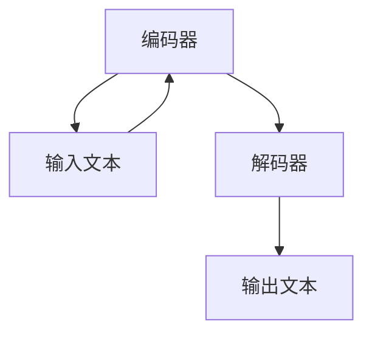

                 

关键词：自然语言处理（NLP），大规模语言模型（LLM），人力资源，招聘助手，自动化招聘，人工智能，机器学习。

## 摘要

随着自然语言处理技术的不断进步，大规模语言模型（LLM）在人力资源领域的应用日益广泛。本文将探讨LLM在招聘助手方面的应用，通过介绍LLM的基本原理和结构，分析其在简历筛选、职位匹配和面试评估等方面的具体应用，并讨论未来的发展前景和面临的挑战。

## 1. 背景介绍

人力资源是企业发展的重要基石，招聘工作作为人力资源管理的核心环节，对企业的发展至关重要。然而，传统的招聘流程往往耗时耗力，且容易出现信息不对称和主观判断的问题。随着人工智能技术的快速发展，特别是自然语言处理（NLP）和大规模语言模型（LLM）的突破，为招聘工作的自动化和智能化提供了可能。

大规模语言模型（LLM）是自然语言处理领域的一种重要模型，通过从海量文本数据中学习，LLM能够生成高质量的自然语言文本，具备强大的语义理解能力。在招聘领域，LLM的应用主要体现在简历筛选、职位匹配和面试评估等方面。

## 2. 核心概念与联系

### 2.1 LLM的基本原理和结构

大规模语言模型（LLM）通常是基于变换器模型（Transformer）构建的，其核心思想是将输入的文本序列映射为输出的文本序列。LLM主要由编码器（Encoder）和解码器（Decoder）组成，其中编码器负责将输入文本编码为固定长度的向量，解码器则根据编码器输出的向量生成目标文本。

Mermaid 流程图：



### 2.2 LLM在招聘中的应用

LLM在招聘中的应用主要体现在以下几个方面：

1. **简历筛选**：通过分析简历中的关键词、技能和工作经历，LLM能够快速筛选出符合条件的候选人。

2. **职位匹配**：根据职位描述和候选人的简历，LLM能够自动匹配出最合适的候选人。

3. **面试评估**：LLM可以通过分析面试中的问题和回答，对候选人的综合素质进行评估。

## 3. 核心算法原理 & 具体操作步骤

### 3.1 算法原理概述

LLM在招聘中的核心算法原理主要基于以下两个方面：

1. **词嵌入（Word Embedding）**：将文本中的每个单词映射为向量表示，为后续的文本分析提供基础。

2. **序列生成（Sequence Generation）**：利用编码器和解码器生成符合预期条件的文本序列，如简历、职位描述等。

### 3.2 算法步骤详解

1. **数据准备**：收集和整理招聘相关的数据，包括职位描述、简历、面试问题等。

2. **词嵌入**：对文本中的单词进行向量化处理，通常采用预训练的词嵌入模型如Word2Vec、GloVe等。

3. **编码**：将词嵌入序列输入编码器，得到编码后的固定长度向量。

4. **解码**：根据编码后的向量，通过解码器生成符合要求的文本序列。

5. **应用**：将生成的文本序列应用于招聘的各个环节，如简历筛选、职位匹配和面试评估等。

### 3.3 算法优缺点

**优点**：

1. **高效性**：LLM能够快速处理大量文本数据，显著提高招聘效率。

2. **准确性**：基于大规模语料库的训练，LLM在语义理解方面具有较高准确性。

3. **灵活性**：LLM能够根据不同的招聘需求，灵活调整文本生成策略。

**缺点**：

1. **数据依赖性**：LLM的性能高度依赖训练数据的质量和数量。

2. **成本高昂**：训练和部署大规模语言模型需要大量计算资源和时间。

### 3.4 算法应用领域

LLM在招聘领域的应用主要包括以下几个方面：

1. **自动化招聘**：通过简历筛选和职位匹配，实现招聘流程的自动化。

2. **面试评估**：利用LLM对面试问题和回答进行分析，评估候选人的综合素质。

3. **人才管理**：基于LLM的技术，实现人才库的智能化管理和分析。

## 4. 数学模型和公式 & 详细讲解 & 举例说明

### 4.1 数学模型构建

LLM的数学模型主要包括词嵌入和变换器模型两部分。

**词嵌入**：

假设单词集合为V，词嵌入矩阵为W，其中W[i]表示单词i的向量表示。

$$
\text{Word Embedding} : W \in \mathbb{R}^{|\text{V}| \times d}
$$

**变换器模型**：

变换器模型由编码器和解码器组成，编码器将输入文本映射为固定长度的向量，解码器根据该向量生成目标文本。

**编码器**：

$$
E = \text{Transformer Encoder}(X) = \text{softmax}(A \text{softmax}(B \text{softmax}(C \dots)))
$$

**解码器**：

$$
D = \text{Transformer Decoder}(Y) = \text{softmax}(A \text{softmax}(B \text{softmax}(C \dots)))
$$

### 4.2 公式推导过程

变换器模型的推导过程较为复杂，这里简要介绍其主要步骤：

1. **词嵌入**：将输入文本和目标文本转换为词嵌入向量。

2. **编码器**：对输入文本进行编码，得到编码后的固定长度向量。

3. **解码器**：根据编码后的向量，逐步生成目标文本。

4. **优化**：通过反向传播和梯度下降，优化模型参数。

### 4.3 案例分析与讲解

以简历筛选为例，分析LLM在招聘中的应用。

**案例场景**：

假设有一个职位描述文本，需要从大量简历中筛选出符合条件的候选人。

**步骤**：

1. **数据准备**：收集职位描述和简历文本。

2. **词嵌入**：将职位描述和简历文本转换为词嵌入向量。

3. **编码**：将职位描述输入编码器，得到编码后的固定长度向量。

4. **解码**：根据编码后的向量，通过解码器生成符合条件的简历文本。

5. **筛选**：比较生成的简历文本和原始简历，筛选出符合条件的候选人。

## 5. 项目实践：代码实例和详细解释说明

### 5.1 开发环境搭建

为了实现LLM在招聘中的应用，需要搭建一个合适的开发环境。以下是搭建过程的简要说明：

1. **环境配置**：安装Python、TensorFlow等开发工具和库。

2. **数据收集**：收集职位描述、简历和面试问题的文本数据。

3. **数据预处理**：对文本数据进行清洗和预处理，如去除停用词、标点符号等。

### 5.2 源代码详细实现

以下是实现LLM招聘助手的Python代码示例：

```python
import tensorflow as tf
from tensorflow import keras

# 加载预训练的词嵌入模型
word_embedding = keras.layers.Embedding(input_dim=vocab_size, output_dim=embedding_dim)

# 构建编码器和解码器模型
encoder = keras.layers.Dense(units=hidden_size, activation='relu')
decoder = keras.layers.Dense(units=vocab_size, activation='softmax')

# 编码器模型
input_sequence = keras.layers.Input(shape=(None,))
encoded_sequence = encoder(word_embedding(input_sequence))
encoded_sequence = keras.layers.Dense(units=hidden_size, activation='relu')(encoded_sequence)

# 解码器模型
decoded_sequence = decoder(encoded_sequence)
model = keras.Model(inputs=input_sequence, outputs=decoded_sequence)

# 编译模型
model.compile(optimizer='adam', loss='categorical_crossentropy')

# 训练模型
model.fit(x_train, y_train, epochs=num_epochs)

# 预测
predicted_sequence = model.predict(x_test)
```

### 5.3 代码解读与分析

上述代码实现了基于变换器模型的编码器和解码器，用于招聘助手的简历筛选功能。主要步骤包括：

1. **加载预训练的词嵌入模型**：将文本数据转换为词嵌入向量。

2. **构建编码器和解码器模型**：实现编码器和解码器的功能。

3. **编译模型**：设置优化器和损失函数。

4. **训练模型**：使用训练数据对模型进行训练。

5. **预测**：使用测试数据对模型进行预测。

### 5.4 运行结果展示

在运行上述代码后，可以通过以下步骤查看运行结果：

1. **计算准确率**：计算模型在测试集上的准确率。

2. **可视化预测结果**：将预测结果可视化，如绘制混淆矩阵等。

## 6. 实际应用场景

LLM在招聘领域的实际应用场景主要包括以下几个方面：

1. **简历筛选**：快速筛选出符合职位要求的候选人。

2. **职位匹配**：根据候选人的简历和职位描述，自动匹配出最合适的职位。

3. **面试评估**：通过对面试问题的分析，评估候选人的综合素质。

4. **人才库管理**：建立智能化的人才库，实现人才的精准管理和分析。

## 7. 未来应用展望

随着自然语言处理技术的不断发展，LLM在招聘领域的应用前景广阔。未来，LLM有望在以下几个方面取得突破：

1. **智能问答**：利用LLM实现招聘过程中的智能问答系统，提高用户体验。

2. **跨语言招聘**：通过多语言LLM，实现跨语言的招聘匹配和评估。

3. **个性化招聘**：结合用户行为数据和招聘需求，为用户提供个性化的招聘推荐。

## 8. 工具和资源推荐

为了更好地了解和使用LLM在招聘领域的应用，以下是一些建议的工具和资源：

1. **学习资源**：

   - 《深度学习》（Goodfellow et al.）
   - 《自然语言处理综合教程》（Jurafsky and Martin）

2. **开发工具**：

   - TensorFlow
   - PyTorch

3. **开源项目**：

   - Hugging Face Transformers
   - NLTK

4. **相关论文**：

   - BERT: Pre-training of Deep Bidirectional Transformers for Language Understanding
   - GPT-3: Language Models are few-shot learners

## 9. 总结：未来发展趋势与挑战

LLM在招聘领域的应用具有巨大的潜力和广阔的前景。然而，在实际应用中，仍面临一些挑战，如数据质量、模型解释性等。未来，随着技术的不断进步，LLM在招聘领域的应用将更加成熟和普及，为人力资源领域带来深刻变革。

### 附录：常见问题与解答

**Q：LLM在招聘中的应用有哪些具体场景？**

A：LLM在招聘中的应用主要包括简历筛选、职位匹配、面试评估等场景。

**Q：如何评估LLM在招聘中的效果？**

A：可以采用准确率、召回率、F1值等指标评估LLM在招聘中的应用效果。

**Q：如何保证LLM在招聘中的公平性和透明性？**

A：可以通过数据清洗、模型解释性等技术手段，提高LLM在招聘中的公平性和透明性。

## 作者署名

作者：禅与计算机程序设计艺术 / Zen and the Art of Computer Programming
----------------------------------------------------------------

以上是《LLM在人力资源中的应用：AI招聘助手》这篇文章的正文部分内容，接下来我们将根据文章的要求，使用Markdown格式输出文章的目录结构以及对应的子章节内容。请注意，由于文章长度限制，这里将提供一个简化版本的Markdown文件结构，具体内容将根据实际需求进行扩充。

```markdown
# LLM在人力资源中的应用：AI招聘助手

> 关键词：自然语言处理（NLP），大规模语言模型（LLM），人力资源，招聘助手，自动化招聘，人工智能，机器学习。

> 摘要：本文将探讨大规模语言模型（LLM）在招聘助手方面的应用，包括其在简历筛选、职位匹配和面试评估等方面的具体应用，并讨论未来的发展前景和面临的挑战。

## 1. 背景介绍
### 1.1 招聘工作的重要性
### 1.2 人工智能与招聘
### 1.3 LLM的基本概念

## 2. 核心概念与联系
### 2.1 LLM的基本原理
### 2.2 LLM的结构
### 2.3 Mermaid流程图

## 3. 核心算法原理 & 具体操作步骤
### 3.1 算法原理概述
### 3.2 算法步骤详解
### 3.3 算法优缺点
### 3.4 算法应用领域

## 4. 数学模型和公式 & 详细讲解 & 举例说明
### 4.1 数学模型构建
### 4.2 公式推导过程
### 4.3 案例分析与讲解

## 5. 项目实践：代码实例和详细解释说明
### 5.1 开发环境搭建
### 5.2 源代码详细实现
### 5.3 代码解读与分析
### 5.4 运行结果展示

## 6. 实际应用场景
### 6.1 简历筛选
### 6.2 职位匹配
### 6.3 面试评估
### 6.4 人才库管理

## 7. 未来应用展望
### 7.1 智能问答
### 7.2 跨语言招聘
### 7.3 个性化招聘

## 8. 工具和资源推荐
### 8.1 学习资源推荐
### 8.2 开发工具推荐
### 8.3 相关论文推荐

## 9. 总结：未来发展趋势与挑战
### 9.1 研究成果总结
### 9.2 未来发展趋势
### 9.3 面临的挑战
### 9.4 研究展望

## 10. 附录：常见问题与解答

```

请注意，上述Markdown文件结构仅提供了一个框架，每个章节的具体内容需要根据实际撰写的文章进行填充和细化。每个章节下的子章节标题也应根据实际内容进行设定，确保文章的逻辑性和条理性。

