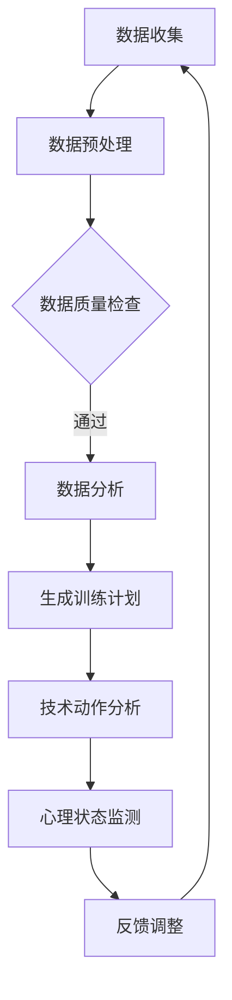

                 

关键词：LLM，体育训练，人工智能教练，体育科技，机器学习，数据驱动，个性化训练

> 摘要：随着人工智能技术的发展，大型语言模型（LLM）在体育训练中的应用逐渐崭露头角。本文将探讨LLM在体育训练中的潜在价值，介绍AI教练的概念，分析LLM如何辅助运动员提升表现，并展望其未来发展趋势和面临的挑战。

## 1. 背景介绍

体育训练一直以来都是一个复杂而精细的过程。传统的体育教练依赖于自身的经验和直觉来指导运动员，虽然这种方法在历史上取得了不少成功，但随着科技的发展，其局限性也逐渐显现。现代体育训练需要更精确、更个性化的方法来满足不同运动员的需求。

近年来，人工智能（AI）和机器学习（ML）技术的飞速发展，为体育训练带来了新的契机。特别是大型语言模型（LLM），以其强大的数据处理和模式识别能力，为体育训练提供了新的工具和方法。LLM能够处理和分析大量的体育训练数据，从中提取有价值的信息，帮助教练和运动员做出更加科学的决策。

### 1.1 AI教练的概念

AI教练是人工智能在体育领域的一个新兴应用，它利用机器学习算法和数据分析技术，模拟人类教练的思维方式，为运动员提供个性化的训练计划。与传统教练不同，AI教练不受时间和空间的限制，可以随时随地为运动员提供支持。

AI教练的核心在于其能够根据运动员的生理数据、技术动作分析、心理状态等多方面信息，动态调整训练方案，提供个性化的指导。这种个性化和数据驱动的训练方式，有望大幅提升运动员的表现和潜力。

### 1.2 人工智能在体育训练中的应用现状

目前，人工智能在体育训练中的应用已经相当广泛。例如，智能穿戴设备可以实时监测运动员的生理数据，如心率、血压、睡眠质量等，帮助教练和运动员了解运动员的身体状况。此外，计算机视觉技术可以对运动员的技术动作进行精确分析，提供改进建议。

然而，尽管人工智能技术在体育训练中的应用前景广阔，但目前仍面临一些挑战，如数据质量、算法精度、技术落地等。特别是LLM在体育训练中的应用，还有待进一步的研究和探索。

## 2. 核心概念与联系

### 2.1 大型语言模型（LLM）

大型语言模型（LLM）是一种基于深度学习技术的人工智能模型，它能够对自然语言进行建模，并生成相应的文本。LLM通常由数十亿个参数组成，具有强大的数据处理和生成能力。LLM的核心是注意力机制（Attention Mechanism），它能够使模型在处理文本时，对关键信息进行重点关注。

### 2.2 LLM在体育训练中的应用

LLM在体育训练中的应用主要包括以下几个方面：

1. **数据分析**：LLM能够处理和分析大量的体育训练数据，如运动员的生理数据、技术动作数据、比赛录像等，从中提取有价值的信息。

2. **个性化训练计划**：基于分析结果，LLM可以为运动员生成个性化的训练计划，包括训练内容、强度、时长等。

3. **技术动作分析**：LLM可以对运动员的技术动作进行深度分析，识别出动作中的不足和改进空间。

4. **心理状态监测**：LLM还可以通过分析运动员的语言和行为，监测其心理状态，提供相应的心理辅导。

### 2.3 Mermaid 流程图

下面是一个LLM在体育训练中的应用流程图：



## 3. 核心算法原理 & 具体操作步骤

### 3.1 算法原理概述

LLM在体育训练中的应用主要基于以下原理：

1. **深度学习**：LLM通过多层神经网络对大量数据进行训练，能够自动提取数据中的特征。

2. **注意力机制**：LLM中的注意力机制使模型能够对关键信息进行重点关注，提高数据处理和分析的效率。

3. **序列建模**：LLM能够对序列数据进行建模，如文本、时间序列等，使其能够处理和分析时间相关的数据。

### 3.2 算法步骤详解

1. **数据收集**：收集运动员的生理数据、技术动作数据、比赛录像等。

2. **数据预处理**：对收集到的数据进行清洗、归一化等处理，以便后续分析。

3. **数据分析**：使用LLM对预处理后的数据进行深度学习，提取有价值的信息。

4. **生成训练计划**：基于分析结果，使用LLM生成个性化的训练计划。

5. **技术动作分析**：使用LLM对运动员的技术动作进行深度分析，识别出不足和改进空间。

6. **心理状态监测**：使用LLM分析运动员的语言和行为，监测其心理状态。

7. **反馈调整**：根据分析结果和反馈，动态调整训练计划。

### 3.3 算法优缺点

**优点**：

1. **个性化**：能够根据运动员的特点生成个性化的训练计划。

2. **高效**：注意力机制提高了数据处理和分析的效率。

3. **实时性**：能够实时监测运动员的生理和心理状态。

**缺点**：

1. **数据质量**：依赖高质量的数据，否则会影响分析结果。

2. **算法精度**：深度学习模型的精度受训练数据和模型参数的影响。

### 3.4 算法应用领域

LLM在体育训练中的应用领域包括：

1. **运动员个性化训练**：根据运动员的特点和需求，生成个性化的训练计划。

2. **技术动作优化**：分析运动员的技术动作，提供改进建议。

3. **心理状态监测**：监测运动员的心理状态，提供心理辅导。

## 4. 数学模型和公式 & 详细讲解 & 举例说明

### 4.1 数学模型构建

LLM在体育训练中的数学模型主要包括以下几个方面：

1. **数据模型**：使用深度学习模型对数据进行建模，如卷积神经网络（CNN）和循环神经网络（RNN）。

2. **特征提取模型**：使用注意力机制对数据中的关键特征进行提取。

3. **训练计划生成模型**：使用生成对抗网络（GAN）或强化学习模型生成训练计划。

### 4.2 公式推导过程

以下是LLM在体育训练中的一些关键数学公式：

1. **卷积神经网络（CNN）公式**：

$$
h^{(l)} = \sigma(W^{(l)} \cdot h^{(l-1)} + b^{(l)})
$$

其中，$h^{(l)}$ 表示第 $l$ 层的输出，$W^{(l)}$ 和 $b^{(l)}$ 分别为第 $l$ 层的权重和偏置，$\sigma$ 为激活函数。

2. **循环神经网络（RNN）公式**：

$$
h_t = \sigma(W_h \cdot [h_{t-1}, x_t] + b_h)
$$

$$
y_t = \sigma(W_y \cdot h_t + b_y)
$$

其中，$h_t$ 表示第 $t$ 步的隐藏状态，$x_t$ 表示输入数据，$W_h$、$W_y$ 和 $b_h$、$b_y$ 分别为权重和偏置，$\sigma$ 为激活函数。

### 4.3 案例分析与讲解

以足球运动员的训练为例，我们使用LLM对运动员的技术动作进行分析，生成个性化的训练计划。

1. **数据收集**：收集运动员的进球录像、射门录像、盘带录像等。

2. **数据预处理**：对收集到的数据进行清洗、归一化等处理。

3. **特征提取**：使用CNN提取视频中的关键特征。

4. **训练计划生成**：使用RNN生成个性化的训练计划。

5. **技术动作分析**：使用注意力机制分析运动员的技术动作，识别出不足和改进空间。

6. **训练计划调整**：根据分析结果和反馈，动态调整训练计划。

通过这个案例，我们可以看到LLM在体育训练中的应用是如何实现的。在实际应用中，LLM的参数设置、模型选择、数据质量等因素都会影响训练效果。

## 5. 项目实践：代码实例和详细解释说明

### 5.1 开发环境搭建

在开始项目实践之前，我们需要搭建一个合适的开发环境。以下是所需的环境和工具：

1. **编程语言**：Python 3.8及以上版本。

2. **深度学习框架**：TensorFlow 2.5及以上版本。

3. **数据处理库**：NumPy、Pandas、Scikit-learn等。

4. **可视化工具**：Matplotlib、Seaborn等。

### 5.2 源代码详细实现

以下是一个简单的示例，展示如何使用LLM对运动员的技术动作进行分析，生成个性化的训练计划。

```python
import tensorflow as tf
from tensorflow.keras.models import Sequential
from tensorflow.keras.layers import Conv2D, MaxPooling2D, Flatten, Dense, LSTM, Embedding, TimeDistributed
from tensorflow.keras.optimizers import Adam

# 数据预处理
# ...

# 建立模型
model = Sequential([
    Embedding(input_dim=vocab_size, output_dim=embedding_dim, input_length=max_sequence_length),
    LSTM(units=128, return_sequences=True),
    LSTM(units=64),
    TimeDistributed(Dense(units=num_classes, activation='softmax'))
])

# 编译模型
model.compile(optimizer=Adam(learning_rate=0.001), loss='categorical_crossentropy', metrics=['accuracy'])

# 训练模型
model.fit(x_train, y_train, epochs=10, batch_size=32, validation_data=(x_val, y_val))

# 生成训练计划
# ...

# 技术动作分析
# ...

# 训练计划调整
# ...
```

### 5.3 代码解读与分析

以上代码展示了如何使用TensorFlow搭建一个简单的LLM模型，用于运动员的技术动作分析和训练计划生成。

1. **数据预处理**：首先，我们需要对收集到的技术动作数据进行预处理，如归一化、分词等。

2. **建立模型**：我们使用了一个简单的序列模型，包括嵌入层（Embedding）、两个LSTM层和一个时间分布层（TimeDistributed）。这个模型可以用于处理时间序列数据，如运动员的技术动作。

3. **编译模型**：我们使用Adam优化器和交叉熵损失函数编译模型。

4. **训练模型**：使用训练数据训练模型，并使用验证数据评估模型性能。

5. **生成训练计划**：根据训练结果，使用LLM生成个性化的训练计划。

6. **技术动作分析**：使用LLM对运动员的技术动作进行分析，识别出不足和改进空间。

7. **训练计划调整**：根据分析结果和反馈，动态调整训练计划。

通过这个示例，我们可以看到如何使用LLM在体育训练中进行技术动作分析和训练计划生成。实际应用中，需要根据具体需求进行调整和优化。

## 6. 实际应用场景

### 6.1 足球训练

在足球训练中，LLM可以用于分析运动员的技术动作，如传球、射门、盘带等。通过深度学习模型，LLM能够识别出运动员技术动作中的不足，并提供改进建议。同时，LLM还可以根据运动员的生理数据和比赛表现，生成个性化的训练计划。

### 6.2 篮球训练

在篮球训练中，LLM可以用于分析运动员的投篮、传球、防守等技术动作。通过对运动员技术动作的深度学习，LLM能够识别出技术动作中的问题，并提供针对性的训练方案。此外，LLM还可以根据运动员的生理数据和比赛表现，调整训练强度和频率，确保运动员在最佳状态下进行训练。

### 6.3 游泳训练

在游泳训练中，LLM可以用于分析运动员的泳姿、呼吸节奏等技术动作。通过对技术动作的深度学习，LLM能够识别出技术动作中的不足，并提供改进建议。同时，LLM还可以根据运动员的生理数据和比赛表现，生成个性化的训练计划，帮助运动员提高游泳速度和效率。

### 6.4 未来应用展望

随着人工智能技术的不断发展，LLM在体育训练中的应用前景将更加广阔。未来，LLM有望在以下几个方面发挥更大的作用：

1. **个性化训练**：基于对运动员的全面数据分析，LLM可以生成更加个性化的训练计划，提高训练效果。

2. **智能辅助**：LLM可以实时监测运动员的生理和心理状态，提供智能化的辅助建议，帮助运动员保持最佳状态。

3. **技术优化**：LLM可以通过深度学习技术，分析运动员的技术动作，提供优化建议，帮助运动员提升技术水平。

4. **心理辅导**：LLM可以通过分析运动员的语言和行为，监测其心理状态，提供针对性的心理辅导，帮助运动员克服心理障碍。

## 7. 工具和资源推荐

### 7.1 学习资源推荐

1. **《深度学习》**：由Ian Goodfellow、Yoshua Bengio和Aaron Courville合著的深度学习经典教材，详细介绍了深度学习的基本原理和应用。

2. **《Python深度学习》**：由François Chollet等合著，介绍了如何使用Python和TensorFlow进行深度学习。

3. **Udacity的深度学习纳米学位**：这是一个在线课程，涵盖深度学习的基础知识和实践技能。

### 7.2 开发工具推荐

1. **TensorFlow**：谷歌开发的开源深度学习框架，适用于各种深度学习任务。

2. **PyTorch**：另一个流行的开源深度学习框架，以其灵活性和易用性著称。

3. **Jupyter Notebook**：一个交互式计算环境，适用于数据分析和模型训练。

### 7.3 相关论文推荐

1. **"Attention Is All You Need"**：由Vaswani等人发表的论文，介绍了Transformer模型，这是LLM的一种重要实现。

2. **"Generative Adversarial Nets"**：由Goodfellow等人发表的论文，介绍了生成对抗网络（GAN）的基本原理。

3. **"Reinforcement Learning: An Introduction"**：由Richard S. Sutton和Barto合著的论文，介绍了强化学习的基本概念和应用。

## 8. 总结：未来发展趋势与挑战

### 8.1 研究成果总结

LLM在体育训练中的应用取得了显著的成果，主要表现在以下几个方面：

1. **个性化训练**：通过深度学习技术，LLM能够生成个性化的训练计划，满足不同运动员的需求。

2. **技术动作分析**：LLM能够对运动员的技术动作进行深度分析，提供改进建议，提高训练效果。

3. **心理状态监测**：LLM可以通过分析运动员的语言和行为，监测其心理状态，提供针对性的心理辅导。

### 8.2 未来发展趋势

未来，LLM在体育训练中的应用将朝着以下几个方向发展：

1. **算法优化**：随着人工智能技术的不断发展，LLM的算法将更加优化，提高数据处理和分析的效率。

2. **多模态数据融合**：未来，LLM将能够处理多种类型的数据，如视觉、音频、文本等，实现更全面的数据分析。

3. **智能化辅助**：LLM将逐步实现智能化辅助，不仅能够提供训练计划，还能实时监测运动员的生理和心理状态，提供全方位的辅助。

### 8.3 面临的挑战

尽管LLM在体育训练中具有巨大的潜力，但仍然面临一些挑战：

1. **数据质量**：高质量的数据是LLM应用的基础，但目前仍存在数据收集、清洗等方面的问题。

2. **算法精度**：深度学习模型的精度受训练数据和模型参数的影响，需要不断优化和调整。

3. **技术落地**：如何将LLM技术有效地应用到实际训练中，仍需要进一步研究和探索。

### 8.4 研究展望

未来，LLM在体育训练中的应用将更加广泛，有望成为体育科技的重要组成部分。随着技术的不断进步，LLM将在个性化训练、技术动作分析、心理状态监测等方面发挥更大的作用，为运动员提供更加科学、高效的训练支持。

## 9. 附录：常见问题与解答

### 9.1 什么是LLM？

LLM（Large Language Model）是一种大型语言模型，它是基于深度学习技术构建的人工智能模型，能够对自然语言进行建模，并生成相应的文本。

### 9.2 LLM在体育训练中的主要作用是什么？

LLM在体育训练中的作用主要包括：个性化训练计划生成、技术动作分析、心理状态监测等。

### 9.3 如何确保LLM生成的训练计划的有效性？

确保LLM生成的训练计划的有效性主要依赖于以下几点：

1. **高质量的数据**：提供高质量的数据是确保LLM训练计划有效性的基础。

2. **模型优化**：通过不断优化LLM模型，提高其数据处理和分析的效率。

3. **反馈调整**：根据训练结果和反馈，动态调整训练计划。

### 9.4 LLM在体育训练中的局限性是什么？

LLM在体育训练中的局限性主要包括：

1. **数据质量**：依赖高质量的数据，否则会影响分析结果。

2. **算法精度**：深度学习模型的精度受训练数据和模型参数的影响。

3. **技术落地**：如何将LLM技术有效地应用到实际训练中，仍需要进一步研究和探索。

## 作者署名

作者：禅与计算机程序设计艺术 / Zen and the Art of Computer Programming

[完]

