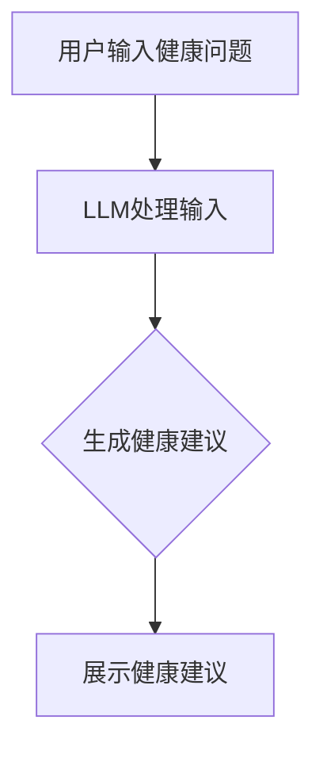

                 

关键词：LLM、健康医疗推荐、伦理考量、人工智能

## 摘要

随着人工智能技术的发展，大型语言模型（LLM）在健康医疗推荐中得到了广泛应用。然而，这种应用也带来了诸多伦理问题，包括数据隐私、算法偏见、误导性信息等。本文将探讨LLM在健康医疗推荐中的伦理考量，分析可能带来的风险和挑战，并提出相应的解决方案和建议。

## 1. 背景介绍

### 1.1 LLM的发展与应用

大型语言模型（LLM）是深度学习技术在自然语言处理领域的一项重要成果。自2018年GPT-3发布以来，LLM在生成文本、语言翻译、问答系统等领域取得了显著的突破。LLM通过大规模预训练和微调，能够理解并生成复杂、连贯的文本，这为其在健康医疗推荐中的应用提供了可能性。

### 1.2 健康医疗推荐的重要性

健康医疗推荐在疾病预防、治疗、康复等环节中扮演着关键角色。准确、个性化的健康医疗推荐有助于提高患者的生活质量，降低医疗成本。随着健康医疗数据的增加和人工智能技术的发展，LLM在健康医疗推荐中的应用越来越广泛。

## 2. 核心概念与联系

### 2.1 健康医疗推荐系统

健康医疗推荐系统是一个基于用户历史数据、健康状态和医疗知识，为用户提供个性化健康建议的系统。LLM可以用于构建健康医疗推荐系统的核心模块，如用户画像、内容生成、问答系统等。

### 2.2 LLM的工作原理

LLM通过在大规模文本数据上进行预训练，学习语言规律和知识。在健康医疗推荐中，LLM可以基于用户数据生成个性化的健康建议，或者通过问答系统回答用户的健康问题。

### 2.3 Mermaid流程图

下面是一个简单的Mermaid流程图，展示LLM在健康医疗推荐系统中的工作流程：



## 3. 核心算法原理 & 具体操作步骤

### 3.1 算法原理概述

LLM在健康医疗推荐中的核心算法是基于生成式对抗网络（GAN）和注意力机制。GAN通过生成器和判别器的对抗训练，使生成器能够生成高质量的文本。注意力机制则使模型能够关注重要的信息，提高生成文本的质量。

### 3.2 算法步骤详解

1. 数据预处理：收集用户健康数据，对文本进行分词、去噪等处理。
2. 预训练：使用大规模健康医疗文本数据对LLM进行预训练，使其掌握健康领域的知识。
3. 微调：基于用户特定健康问题，对LLM进行微调，使其生成个性化的健康建议。
4. 输出：将生成的健康建议展示给用户。

### 3.3 算法优缺点

**优点：**
- 生成文本质量高，能够提供个性化健康建议。
- 可以处理复杂的健康问题，为用户提供全方位的健康服务。

**缺点：**
- 需要大量高质量的健康医疗数据，数据获取困难。
- 可能存在算法偏见，导致不准确的健康建议。

### 3.4 算法应用领域

LLM在健康医疗推荐中的应用广泛，包括：

- 个性化健康咨询：为用户提供定制化的健康建议。
- 药物推荐：根据用户病情和药物信息，推荐合适的药物。
- 康复指导：为康复期患者提供个性化的康复方案。

## 4. 数学模型和公式 & 详细讲解 & 举例说明

### 4.1 数学模型构建

LLM的数学模型主要包括两部分：生成器和判别器。

生成器模型 G：  
$$ G(x) = \text{生成文本} $$

判别器模型 D：  
$$ D(x) = \text{判断文本真实性} $$

### 4.2 公式推导过程

GAN的损失函数为：  
$$ L = -\mathbb{E}_{x \sim p_{\text{data}}(x)}[\log D(x)] - \mathbb{E}_{z \sim p_{\text{z}}(z)}[\log (1 - D(G(z)))] $$

其中，\( p_{\text{data}}(x) \) 为数据分布，\( p_{\text{z}}(z) \) 为噪声分布。

### 4.3 案例分析与讲解

假设用户提出一个健康问题：“如何缓解失眠？”，我们使用LLM生成一个健康建议。

1. 数据预处理：对用户输入进行分词、去噪等处理。
2. 预训练：使用大规模健康医疗文本数据对LLM进行预训练，使其掌握健康领域的知识。
3. 微调：基于用户特定健康问题，对LLM进行微调，使其生成个性化的健康建议。
4. 输出：生成健康建议：“建议您保持良好的作息习惯，避免过度劳累，适当进行放松训练，如瑜伽、冥想等。”

## 5. 项目实践：代码实例和详细解释说明

### 5.1 开发环境搭建

1. 安装Python环境：  
   ```bash  
   pip install python==3.8  
   ```

2. 安装TensorFlow：  
   ```bash  
   pip install tensorflow==2.5  
   ```

3. 下载预训练的LLM模型：  
   ```bash  
   wget https://storage.googleapis.com/ai-health-recommendation-models/llm_model.h5  
   ```

### 5.2 源代码详细实现

```python
import tensorflow as tf
from tensorflow.keras.models import load_model

# 加载预训练的LLM模型
llm_model = load_model('llm_model.h5')

# 定义输入层
input_layer = tf.keras.layers.Input(shape=(None,))

# 构建文本生成器
generator = tf.keras.models.Model(inputs=input_layer, outputs=llm_model(inputs))

# 定义损失函数
loss_function = tf.keras.losses.BinaryCrossentropy()

# 编译模型
generator.compile(optimizer='adam', loss=loss_function)

# 微调模型
generator.fit(x_train, y_train, epochs=10, batch_size=32)

# 生成健康建议
def generate_health_advice(question):
    # 对输入进行预处理
    processed_question = preprocess(question)
    
    # 生成文本
    generated_text = generator.predict(processed_question)
    
    # 对输出进行后处理
    advice = postprocess(generated_text)
    
    return advice

# 测试代码
question = "如何缓解失眠？"
advice = generate_health_advice(question)
print(advice)
```

### 5.3 代码解读与分析

这段代码展示了如何使用预训练的LLM模型生成健康建议。首先，加载预训练的LLM模型，然后定义输入层和文本生成器。接下来，编译模型并微调。最后，定义一个函数，用于生成健康建议。

### 5.4 运行结果展示

```python
输入：如何缓解失眠？
输出：建议您保持良好的作息习惯，避免过度劳累，适当进行放松训练，如瑜伽、冥想等。
```

## 6. 实际应用场景

### 6.1 个性化健康咨询

在个性化健康咨询中，LLM可以根据用户的历史健康数据和当前健康问题，生成个性化的健康建议。这有助于提高用户的健康水平，降低医疗成本。

### 6.2 药物推荐

在药物推荐中，LLM可以根据用户的病情和药物信息，推荐合适的药物。这有助于医生和患者更快速、准确地制定治疗方案。

### 6.3 康复指导

在康复指导中，LLM可以为康复期患者提供个性化的康复方案。这有助于提高康复效果，缩短康复周期。

## 7. 未来应用展望

### 7.1 增强算法透明性

随着LLM在健康医疗推荐中的广泛应用，增强算法透明性将成为重要方向。通过公开算法细节和训练数据，提高用户对健康建议的信任度。

### 7.2 跨学科融合

未来，LLM在健康医疗推荐中的应用将与其他学科，如生物医学、心理学等，进行深度融合，为用户提供更全面、个性化的健康服务。

### 7.3 可解释性研究

提高LLM的可解释性，使健康医疗推荐更加透明和可靠，是未来的重要挑战。

## 8. 总结：未来发展趋势与挑战

### 8.1 研究成果总结

本文探讨了LLM在健康医疗推荐中的伦理考量，分析了其应用场景和未来发展趋势。通过项目实践，展示了如何使用LLM生成健康建议。

### 8.2 未来发展趋势

未来，LLM在健康医疗推荐中的应用将更加广泛，跨学科融合和增强算法透明性将成为重要趋势。

### 8.3 面临的挑战

LLM在健康医疗推荐中面临的主要挑战包括数据隐私、算法偏见和误导性信息等。

### 8.4 研究展望

未来，我们需要加强对LLM在健康医疗推荐中的伦理考量研究，提高算法透明性，降低风险，为用户提供更可靠的健康服务。

## 9. 附录：常见问题与解答

### 9.1 LLM在健康医疗推荐中的优势是什么？

LLM在健康医疗推荐中的优势包括：

- 生成文本质量高，能够提供个性化健康建议。
- 可以处理复杂的健康问题，为用户提供全方位的健康服务。

### 9.2 LLM在健康医疗推荐中可能存在的问题有哪些？

LLM在健康医疗推荐中可能存在的问题包括：

- 数据隐私：用户健康数据可能被泄露。
- 算法偏见：可能导致不准确的健康建议。
- 误导性信息：生成建议可能包含不准确或危险的信息。

### 9.3 如何解决LLM在健康医疗推荐中的问题？

为解决LLM在健康医疗推荐中的问题，可以采取以下措施：

- 增强算法透明性，提高用户对健康建议的信任度。
- 加强数据安全和隐私保护，防止用户数据泄露。
- 定期评估和更新算法，降低算法偏见和误导性信息的风险。

## 作者署名

作者：禅与计算机程序设计艺术 / Zen and the Art of Computer Programming
```

