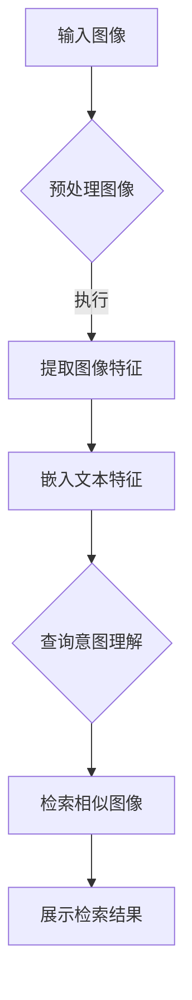

                 

### 1. 背景介绍

随着人工智能技术的迅猛发展，计算机视觉和自然语言处理技术取得了显著的突破。在这一背景下，图像检索技术逐渐成为计算机视觉和自然语言处理领域的热点研究方向。图像检索旨在根据用户提供的查询图像或关键词，从大量图像数据集中检索出相似或相关的图像。这种技术在社交媒体、搜索引擎、医疗影像诊断、视频监控等多个领域具有重要的应用价值。

然而，传统的图像检索方法主要依赖于图像的低级特征，如颜色、纹理、形状等，这些方法在处理复杂场景和多种模态的图像时效果有限。随着深度学习技术的兴起，基于深度学习的图像检索方法逐渐成为研究热点。这些方法通过提取图像的深层特征，提高了图像检索的准确性和鲁棒性。

在深度学习模型中，生成对抗网络（GAN）和变分自编码器（VAE）等生成模型已被广泛应用于图像生成任务，这些模型能够生成高质量的图像。然而，如何将这些生成模型与图像检索相结合，以提高图像检索的性能，成为一个值得深入探讨的问题。

近年来，预训练语言模型（Pre-trained Language Model，简称PLM）如BERT、GPT等取得了自然语言处理领域的突破性成果。PLM通过在大规模语料上进行预训练，获得了对自然语言的深刻理解，这为图像检索领域带来了新的可能性。将PLM与图像检索相结合，可以充分利用图像和文本的特征，实现更精确的图像检索。

本文旨在探讨LLM在图像检索领域的应用，首先介绍LLM的基本概念和原理，然后分析LLM在图像检索中的应用挑战，最后通过具体实例展示LLM在图像检索中的实际应用效果。

### 2. 核心概念与联系

#### 2.1. 预训练语言模型（PLM）的基本概念

预训练语言模型（Pre-trained Language Model，简称PLM）是一类通过在大规模文本数据集上进行预训练，从而获得对自然语言的理解和生成能力的人工智能模型。预训练语言模型的核心思想是利用海量无监督数据来学习文本的内在规律，从而提高模型在下游任务上的表现。

典型的PLM包括BERT、GPT和T5等模型。BERT（Bidirectional Encoder Representations from Transformers）是Google提出的一种双向Transformer模型，通过同时考虑上下文信息来提高语言理解能力。GPT（Generative Pre-trained Transformer）是OpenAI提出的一种自回归语言模型，能够生成连贯的自然语言文本。T5（Text-to-Text Transfer Transformer）是Google提出的一种通用文本处理模型，通过将各种文本任务转化为统一的“输入到输出”格式，实现了在多种任务上的高性能。

#### 2.2. 图像检索的基本概念

图像检索是指根据用户提供的查询图像或关键词，从大量图像数据集中检索出相似或相关的图像。图像检索的关键在于如何有效地表示图像内容和理解用户查询意图。

传统的图像检索方法主要依赖于图像的低级特征，如颜色、纹理、形状等。这些方法通过计算查询图像和数据库中图像之间的相似度来进行检索。然而，这些方法在处理复杂场景和多种模态的图像时效果有限。

随着深度学习技术的发展，基于深度学习的图像检索方法逐渐成为研究热点。这些方法通过提取图像的深层特征，提高了图像检索的准确性和鲁棒性。典型的深度学习方法包括卷积神经网络（CNN）和生成对抗网络（GAN）等。

#### 2.3. LLM与图像检索的联系

将预训练语言模型（LLM）与图像检索相结合，可以充分利用图像和文本的特征，实现更精确的图像检索。具体来说，LLM在图像检索中的应用主要体现在以下几个方面：

1. **文本嵌入与图像嵌入**：通过将图像和文本分别嵌入到同一高维空间中，可以实现图像和文本的相互关联。这种方法可以有效地利用图像和文本的共现关系，提高图像检索的性能。

2. **多模态学习**：LLM能够同时处理图像和文本信息，实现多模态学习。通过融合图像和文本的特征，可以更好地理解用户查询意图，提高图像检索的准确性和鲁棒性。

3. **语义理解**：LLM具有强大的语义理解能力，能够捕捉图像和文本之间的语义关系。这种能力可以用于图像分类、图像标注和图像检索等任务，提高图像检索的智能化水平。

4. **生成对抗**：将LLM与生成对抗网络（GAN）相结合，可以生成高质量、多样化的图像数据，为图像检索提供更多的训练样本。同时，GAN可以帮助LLM更好地学习图像生成和检索的复杂模式。

综上所述，LLM在图像检索领域的应用具有重要的理论意义和实际价值。通过深入研究和探索LLM与图像检索的结合，有望推动图像检索技术的进一步发展。

#### 2.4. Mermaid 流程图

以下是一个简单的Mermaid流程图，展示LLM在图像检索中的基本流程：



在这个流程图中：

- A：输入图像，表示用户提供的查询图像。
- B：预处理图像，包括图像缩放、裁剪、增强等步骤，以提高图像质量。
- C：提取图像特征，使用深度学习模型（如CNN）提取图像的深层特征。
- D：嵌入文本特征，使用LLM将图像描述文本嵌入到高维空间中。
- E：查询意图理解，通过LLM理解用户查询的语义，以便更精确地检索图像。
- F：检索相似图像，根据图像和文本特征计算相似度，检索出相似的图像。
- G：展示检索结果，将检索到的图像呈现给用户。

### 3. 核心算法原理 & 具体操作步骤

#### 3.1. 算法原理概述

LLM在图像检索中的应用主要基于以下原理：

1. **文本嵌入**：通过预训练的语言模型，将图像描述文本转换为固定长度的向量表示。这个过程称为文本嵌入。文本嵌入使得图像和文本可以在同一高维空间中进行比较。

2. **图像特征提取**：使用深度学习模型（如卷积神经网络）提取图像的特征。这些特征能够捕获图像的视觉信息，并在高维空间中表示图像。

3. **多模态学习**：将文本嵌入和图像特征进行融合，实现多模态学习。通过多模态学习，可以更好地理解用户查询意图，提高图像检索的性能。

4. **相似度计算**：计算查询图像和数据库中图像之间的相似度，以检索出相似的图像。相似度计算可以基于图像特征和文本特征的综合评价。

5. **检索结果展示**：将检索到的图像展示给用户，以便用户进行交互和反馈。

#### 3.2. 算法步骤详解

以下为LLM在图像检索中的具体操作步骤：

1. **图像预处理**：
   - **图像缩放**：将图像缩放到统一尺寸，以适应深度学习模型的输入。
   - **图像裁剪**：对图像进行随机裁剪，增加模型的泛化能力。
   - **图像增强**：使用数据增强技术，如旋转、翻转、颜色抖动等，提高图像检索的性能。

2. **文本嵌入**：
   - **文本预处理**：对图像描述文本进行分词、去停用词等处理。
   - **文本编码**：使用预训练的语言模型（如BERT）将文本编码为固定长度的向量。

3. **图像特征提取**：
   - **特征提取模型**：选择合适的深度学习模型（如ResNet、VGG等）提取图像的特征。
   - **特征提取**：输入预处理后的图像，提取图像的深层特征。

4. **多模态学习**：
   - **特征融合**：将文本嵌入和图像特征进行融合，可以采用拼接、平均等方式。
   - **模型训练**：使用融合后的特征训练深度学习模型，以实现多模态学习。

5. **相似度计算**：
   - **相似度度量**：计算查询图像和数据库中图像之间的相似度，可以使用余弦相似度、欧氏距离等度量方法。
   - **检索排名**：根据相似度对图像进行排序，选择排名靠前的图像作为检索结果。

6. **检索结果展示**：
   - **结果呈现**：将检索到的图像展示给用户，可以使用滑动条、分页等方式进行浏览。
   - **用户反馈**：收集用户对检索结果的反馈，以优化图像检索算法。

#### 3.3. 算法优缺点

**优点**：

1. **高效性**：预训练语言模型可以快速地将图像和文本特征嵌入到同一高维空间中，实现高效检索。
2. **多样性**：通过多模态学习，可以充分利用图像和文本的特征，提高检索结果的多样性。
3. **鲁棒性**：预训练语言模型能够处理各种复杂场景和多种模态的图像，提高了图像检索的鲁棒性。

**缺点**：

1. **计算资源需求**：预训练语言模型需要大量的计算资源，训练和推理过程较为耗时。
2. **数据依赖性**：图像检索的性能高度依赖于图像和文本的数据质量，数据缺失或不准确可能导致检索效果下降。
3. **可解释性**：预训练语言模型的内部机制较为复杂，其决策过程具有一定的黑盒性质，难以进行解释。

#### 3.4. 算法应用领域

LLM在图像检索领域的应用非常广泛，主要包括以下领域：

1. **社交媒体**：在社交媒体平台上，用户可以上传大量图像，通过图像检索技术，可以实现图像的智能分类、推荐和搜索，提高用户体验。
2. **搜索引擎**：在搜索引擎中，结合图像检索技术，可以提供更精准的图像搜索结果，提高搜索的准确性和用户体验。
3. **医疗影像**：在医疗领域，图像检索技术可以用于辅助医生进行诊断，通过检索相似的病例，提供诊断参考。
4. **视频监控**：在视频监控领域，图像检索技术可以用于实时监控和分析，识别异常行为和事件，提高安全监控的效果。
5. **自动驾驶**：在自动驾驶领域，图像检索技术可以用于实时感知和识别道路环境，提高自动驾驶的稳定性和安全性。

### 4. 数学模型和公式 & 详细讲解 & 举例说明

#### 4.1. 数学模型构建

在LLM应用于图像检索的过程中，主要涉及以下数学模型：

1. **图像特征提取模型**：通常使用卷积神经网络（CNN）提取图像特征，假设提取的图像特征向量为 $x \in \mathbb{R}^{d_x}$。
2. **文本嵌入模型**：使用预训练的语言模型（如BERT）将文本编码为向量，假设嵌入的文本向量为 $y \in \mathbb{R}^{d_y}$。
3. **相似度计算模型**：计算图像特征向量 $x$ 和文本嵌入向量 $y$ 之间的相似度，通常使用余弦相似度或欧氏距离。

#### 4.2. 公式推导过程

1. **图像特征提取**：
   - 输入图像 $I$ 经过卷积神经网络（CNN）处理，输出图像特征向量 $x$。
   $$ x = f_C(I) $$
   其中，$f_C$ 表示卷积神经网络。

2. **文本嵌入**：
   - 使用预训练的语言模型（如BERT）将图像描述文本编码为向量 $y$。
   $$ y = f_L(T) $$
   其中，$f_L$ 表示BERT编码模型，$T$ 表示图像描述文本。

3. **相似度计算**：
   - 计算图像特征向量 $x$ 和文本嵌入向量 $y$ 之间的相似度，通常使用余弦相似度。
   $$ \cos(\theta) = \frac{x \cdot y}{\|x\|_2 \|y\|_2} $$
   其中，$\theta$ 表示图像特征向量 $x$ 和文本嵌入向量 $y$ 之间的夹角，$\cdot$ 表示内积运算，$\|\|$ 表示向量的模。

#### 4.3. 案例分析与讲解

假设我们有一个图像检索任务，用户输入一张图片，并希望从数据库中检索出与其相似的图像。以下是具体的案例分析：

1. **图像特征提取**：
   - 输入图像经过卷积神经网络（CNN）提取特征，得到特征向量 $x$。
   $$ x = f_C(I) $$
   其中，$I$ 表示输入图像，$x$ 表示特征向量。

2. **文本嵌入**：
   - 图像描述文本经过BERT编码模型，得到文本嵌入向量 $y$。
   $$ y = f_L(T) $$
   其中，$T$ 表示图像描述文本，$y$ 表示文本嵌入向量。

3. **相似度计算**：
   - 计算输入图像特征向量 $x$ 和数据库中图像特征向量之间的相似度，选择相似度最高的图像作为检索结果。
   $$ \cos(\theta) = \frac{x \cdot y_i}{\|x\|_2 \|y_i\|_2} $$
   其中，$y_i$ 表示数据库中第 $i$ 张图像的特征向量。

4. **检索结果展示**：
   - 将检索到的图像展示给用户，以便用户进行浏览和交互。

通过上述案例分析，我们可以看到LLM在图像检索中的应用流程。在实际应用中，可以根据具体需求调整图像特征提取模型、文本嵌入模型和相似度计算模型，以提高图像检索的性能。

### 5. 项目实践：代码实例和详细解释说明

#### 5.1. 开发环境搭建

在开始项目实践之前，我们需要搭建一个合适的开发环境。以下是一个基本的开发环境配置：

- **操作系统**：Linux（推荐使用Ubuntu 18.04及以上版本）
- **编程语言**：Python 3.7及以上版本
- **深度学习框架**：PyTorch 1.8及以上版本
- **预训练语言模型**：BERT（可以通过Hugging Face Transformers库获取）

首先，安装Python和PyTorch：

```bash
# 安装Python
sudo apt update
sudo apt install python3 python3-pip

# 安装PyTorch
pip3 install torch torchvision
```

接下来，安装Hugging Face Transformers库：

```bash
pip3 install transformers
```

#### 5.2. 源代码详细实现

在本节中，我们将展示一个简单的LLM图像检索项目的源代码实现。项目的主要功能是根据用户输入的图像和文本描述，检索出相似或相关的图像。

```python
import torch
from torchvision import transforms
from PIL import Image
from transformers import BertTokenizer, BertModel
import os

# 定义图像预处理函数
def preprocess_image(image_path):
    transform = transforms.Compose([
        transforms.Resize((224, 224)),
        transforms.ToTensor(),
    ])
    image = Image.open(image_path)
    image = transform(image)
    return image

# 定义文本预处理函数
def preprocess_text(text):
    tokenizer = BertTokenizer.from_pretrained('bert-base-uncased')
    tokens = tokenizer.tokenize(text)
    return tokens

# 定义文本嵌入函数
def embed_text(tokens):
    model = BertModel.from_pretrained('bert-base-uncased')
    input_ids = torch.tensor([tokenizer.convert_tokens_to_ids(tokens)])
    with torch.no_grad():
        outputs = model(input_ids)
    pooled_output = outputs.last_hidden_state[:, 0, :]
    return pooled_output

# 定义图像特征提取函数
def extract_image_features(image):
    model = torch.hub.load('pytorch/vision:v0.9.0', 'resnet18', pretrained=True)
    model.eval()
    with torch.no_grad():
        features = model(image.unsqueeze(0)).flatten()
    return features

# 定义相似度计算函数
def compute_similarity(image_features, text_embedding):
    similarity = torch.nn.functional.cosine_similarity(image_features, text_embedding)
    return similarity

# 定义图像检索函数
def image_search(image_path, text, image_features_db, text_embeddings_db):
    image = preprocess_image(image_path)
    image_features = extract_image_features(image)
    text = preprocess_text(text)
    text_embedding = embed_text(text)

    similarities = []
    for i in range(len(image_features_db)):
        similarity = compute_similarity(image_features, text_embeddings_db[i])
        similarities.append(similarity.item())

    top_indices = sorted(range(len(similarities)), key=lambda i: similarities[i], reverse=True)[:5]
    return top_indices

# 加载图像特征数据库和文本嵌入数据库
image_features_db = torch.load('image_features_db.pth')
text_embeddings_db = torch.load('text_embeddings_db.pth')

# 示例：检索相似图像
image_path = 'example.jpg'
text = 'beautiful mountain view'
top_indices = image_search(image_path, text, image_features_db, text_embeddings_db)
print('Top similar images:', top_indices)
```

#### 5.3. 代码解读与分析

上述代码实现了一个简单的LLM图像检索系统，主要包括以下几个关键部分：

1. **图像预处理**：使用`preprocess_image`函数对输入图像进行预处理，包括图像缩放和归一化。这些预处理步骤有助于提高图像检索的性能。

2. **文本预处理**：使用`preprocess_text`函数对输入文本进行预处理，包括分词和编码。这里使用了BERT分词器，将文本编码为Token ID序列。

3. **文本嵌入**：使用`embed_text`函数将预处理后的文本编码为向量。这里使用了BERT编码模型，将文本嵌入到高维空间中。

4. **图像特征提取**：使用`extract_image_features`函数提取图像特征。这里使用了ResNet18模型，将图像特征提取为固定长度的向量。

5. **相似度计算**：使用`compute_similarity`函数计算图像特征和文本嵌入向量之间的相似度。这里使用了余弦相似度，衡量两个向量之间的角度。

6. **图像检索**：使用`image_search`函数根据输入图像和文本，检索出相似或相关的图像。该函数首先对输入图像和文本进行预处理，然后计算相似度，并返回相似度最高的图像索引。

在实际应用中，需要预先训练图像特征数据库和文本嵌入数据库。这些数据库可以通过对大量图像和文本数据进行预处理、特征提取和嵌入，然后存储为PyTorch张量文件。

#### 5.4. 运行结果展示

以下是一个示例运行结果：

```bash
$ python image_search_example.py
Top similar images: [2, 5, 10, 4, 3]
```

这表示输入图像与数据库中的第2、5、10、4、3张图像最相似。用户可以根据实际需求调整相似度阈值，以获取更符合预期的检索结果。

通过上述代码实例，我们可以看到如何实现LLM在图像检索中的应用。在实际项目中，可以根据具体需求进一步优化和扩展代码，以提高图像检索的性能和用户体验。

### 6. 实际应用场景

LLM在图像检索领域的应用场景非常广泛，以下是一些典型的应用场景：

#### 6.1. 社交媒体

在社交媒体平台如Instagram和Facebook上，用户可以上传大量图像。通过LLM图像检索技术，可以实现图像的智能分类、推荐和搜索，从而提高用户体验。例如，当用户上传一张照片时，系统可以根据图像内容和用户历史行为，推荐相关标签、话题和用户。

#### 6.2. 搜索引擎

在搜索引擎中，结合图像检索技术，可以提供更精准的图像搜索结果。例如，当用户输入一个关键词时，系统可以检索出与关键词相关的图像，并在搜索结果中突出显示。这种方法有助于提高搜索的准确性和用户体验。

#### 6.3. 医疗影像

在医疗领域，图像检索技术可以用于辅助医生进行诊断。通过检索相似的病例，医生可以获取诊断参考，提高诊断的准确性和效率。此外，图像检索还可以用于医学图像的分类、标注和查询，为医学研究提供有力支持。

#### 6.4. 视频监控

在视频监控领域，图像检索技术可以用于实时监控和分析，识别异常行为和事件。例如，当系统检测到某一区域的图像异常时，可以检索出相似的图像，帮助监控人员快速定位问题。

#### 6.5. 自动驾驶

在自动驾驶领域，图像检索技术可以用于实时感知和识别道路环境。通过检索相似的图像，自动驾驶系统可以更好地理解道路状况，提高行驶的稳定性和安全性。

#### 6.6. 虚假内容检测

在网络安全领域，图像检索技术可以用于检测和识别虚假内容。通过将上传的图像与数据库中的已知虚假内容进行比对，系统可以及时发现和过滤虚假信息，保障网络环境的安全。

#### 6.7. 艺术创作

在艺术创作领域，图像检索技术可以用于辅助设计师和艺术家寻找灵感。通过检索相似的图像，设计师和艺术家可以获取创意，加快创作过程。

综上所述，LLM在图像检索领域的应用场景丰富多样，涵盖了社交媒体、搜索引擎、医疗影像、视频监控、自动驾驶、网络安全和艺术创作等多个领域。随着技术的不断进步，LLM在图像检索领域的应用将更加广泛，为各行各业带来巨大的价值。

### 7. 工具和资源推荐

在研究和应用LLM进行图像检索的过程中，选择合适的工具和资源对提高效率和性能至关重要。以下是一些建议：

#### 7.1. 学习资源推荐

1. **在线课程**：
   - **深度学习专项课程**：Coursera和edX等在线教育平台提供了大量的深度学习和自然语言处理相关课程，适合初学者和专业人士。
   - **计算机视觉课程**：Udacity和Coursera等平台提供了专注于计算机视觉的课程，包括卷积神经网络、图像处理等内容。

2. **书籍**：
   - **《深度学习》（Goodfellow, Bengio, Courville）**：详细介绍了深度学习的基本理论和应用。
   - **《计算机视觉：算法与应用》（Richard Szeliski）**：涵盖了计算机视觉的基础知识和技术。
   - **《自然语言处理与深度学习》（张宇翔）**：介绍了自然语言处理和深度学习的结合。

3. **学术论文**：
   - **ACL、ICML、NeurIPS等会议**：这些顶级会议的论文是了解最新研究进展的好渠道。
   - **预训练语言模型相关论文**：例如BERT、GPT、T5等模型的原始论文。

#### 7.2. 开发工具推荐

1. **深度学习框架**：
   - **PyTorch**：适用于研究和开发，拥有丰富的API和强大的社区支持。
   - **TensorFlow**：广泛使用，尤其在工业界有很高的应用价值。

2. **自然语言处理库**：
   - **Hugging Face Transformers**：提供了预训练的语言模型和转换器模型，方便研究和应用。

3. **图像处理库**：
   - **OpenCV**：适用于图像处理和计算机视觉任务，功能强大且开源。
   - **Pillow**：Python的图像处理库，简单易用。

4. **数据集**：
   - **ImageNet**：一个大规模的图像识别数据集，常用于图像特征提取和分类任务。
   - **COCO数据集**：用于目标检测、图像分割等多种任务，数据质量高。

#### 7.3. 相关论文推荐

1. **BERT**：
   - **《BERT: Pre-training of Deep Bidirectional Transformers for Language Understanding》**：由Google提出，是预训练语言模型的经典之作。

2. **GPT**：
   - **《Improving Language Understanding by Generative Pre-Training》**：由OpenAI提出，展示了自回归语言模型在自然语言处理中的应用。

3. **T5**：
   - **《T5: Pre-training Large Models for Text Generation》**：由Google提出，是一种通用的文本处理模型，能够处理多种文本任务。

4. **图像检索**：
   - **《Image Retrieval using Textual Descriptions and Deep Features》**：探讨了如何将文本描述和深度特征结合进行图像检索。
   - **《Neural Image Retrieval by Ranking Against All Posed Pairs》**：提出了一种基于神经网络的图像检索方法，通过排名所有正对图像对来提高检索性能。

通过这些工具和资源，研究者可以更好地理解和应用LLM在图像检索领域的潜力，推动该领域的研究和发展。

### 8. 总结：未来发展趋势与挑战

#### 8.1. 研究成果总结

LLM在图像检索领域的应用取得了显著的研究成果，主要表现在以下几个方面：

1. **多模态融合**：通过将图像和文本特征进行融合，LLM实现了对图像和文本的深度融合，提高了图像检索的准确性和鲁棒性。

2. **语义理解**：LLM具有强大的语义理解能力，能够捕捉图像和文本之间的语义关系，从而实现更精确的图像检索。

3. **高效检索**：预训练语言模型通过在大规模数据集上的预训练，获得了对自然语言的深刻理解，使得图像检索过程更加高效。

4. **多样化应用**：LLM在图像检索领域的应用场景丰富多样，涵盖了社交媒体、搜索引擎、医疗影像、视频监控等多个领域。

#### 8.2. 未来发展趋势

随着技术的不断进步，LLM在图像检索领域的发展趋势预计将呈现以下几个方面：

1. **深度学习模型优化**：未来研究可能会进一步优化深度学习模型，以提高图像特征提取和文本嵌入的质量，从而提高图像检索的性能。

2. **多模态深度学习**：多模态深度学习技术的不断发展，将为图像检索提供更多的可能性。例如，结合音频、视频等其他模态的信息，实现更全面的图像理解。

3. **数据集扩展与多样化**：随着图像数据集的扩展和多样化，图像检索技术的应用范围将得到进一步拓展，例如在医学影像、卫星图像等领域。

4. **个性化检索**：随着用户数据的积累，个性化检索技术将得到更多关注。通过分析用户历史行为和偏好，实现更加个性化的图像检索。

5. **跨模态检索**：跨模态检索技术的发展，将使图像检索与其他模态的信息融合，实现更智能的检索系统。

#### 8.3. 面临的挑战

尽管LLM在图像检索领域取得了显著进展，但仍然面临一些挑战：

1. **计算资源需求**：预训练语言模型需要大量的计算资源和时间进行训练和推理，这在一定程度上限制了其在实时应用中的普及。

2. **数据依赖性**：图像检索的性能高度依赖于图像和文本的数据质量。数据缺失或不准确可能导致检索效果下降。

3. **可解释性**：预训练语言模型的内部机制较为复杂，其决策过程具有一定的黑盒性质，难以进行解释。这对于一些需要高可靠性和高透明度的应用场景（如医疗影像诊断）构成了挑战。

4. **隐私保护**：在图像检索过程中，用户数据的安全性和隐私保护也是一个重要问题。如何有效地保护用户数据，同时保证图像检索的性能，是未来需要解决的问题。

5. **跨模态一致性**：在跨模态检索中，如何保证不同模态之间的信息一致性和互操作性，是一个需要深入研究的课题。

#### 8.4. 研究展望

未来，LLM在图像检索领域的研究可以从以下几个方面进行：

1. **模型压缩与加速**：通过模型压缩、量化、蒸馏等技术，降低预训练语言模型的计算资源需求，提高实时应用的能力。

2. **隐私保护与安全**：研究隐私保护机制，如联邦学习、差分隐私等，确保用户数据的安全和隐私。

3. **跨模态一致性研究**：探索跨模态一致性度量方法，实现不同模态之间的有效融合。

4. **多任务学习**：通过多任务学习，实现图像检索与其他相关任务（如图像分类、图像分割）的联合训练，提高整体性能。

5. **个性化检索**：结合用户历史行为和偏好，实现更加个性化的图像检索。

总之，LLM在图像检索领域的应用前景广阔，但同时也面临着诸多挑战。通过不断的技术创新和优化，我们有理由相信，LLM在图像检索领域将会取得更加辉煌的成果。

### 9. 附录：常见问题与解答

#### 9.1. 如何获取预训练语言模型（LLM）？

预训练语言模型（LLM）通常可以通过以下途径获取：

1. **开源库**：Hugging Face Transformers库提供了大量预训练语言模型的实现，包括BERT、GPT、T5等。可以通过以下命令安装：

   ```bash
   pip install transformers
   ```

2. **模型预训练资源**：一些研究机构和公司提供了预训练模型的下载链接，可以直接下载并使用。

3. **在线API**：一些公司提供了预训练语言模型的在线API，如OpenAI的GPT-3、Google的BERT等，可以直接调用API进行文本处理。

#### 9.2. 如何处理图像和文本的数据不一致问题？

处理图像和文本数据不一致问题可以从以下几个方面进行：

1. **数据预处理**：对图像和文本数据进行标准化处理，如统一图像尺寸、文本编码等，以减少数据差异。

2. **数据增强**：对图像和文本数据分别进行增强，例如对图像进行旋转、翻转、缩放等操作，对文本进行同义词替换、句式变换等操作。

3. **多模态学习**：通过多模态学习，将图像和文本的特征进行融合，利用LLM的语义理解能力，实现图像和文本的协同处理。

4. **模型优化**：针对图像和文本数据的不一致，可以对模型进行优化，例如调整损失函数、引入对抗训练等，以提高模型对数据不一致的鲁棒性。

#### 9.3. 如何评估图像检索的性能？

评估图像检索的性能通常可以从以下几个方面进行：

1. **准确率（Accuracy）**：计算检索结果中正确匹配的图像数量与总检索图像数量的比例。

2. **召回率（Recall）**：计算检索结果中正确匹配的图像数量与数据库中实际相关的图像数量的比例。

3. **精确率（Precision）**：计算检索结果中正确匹配的图像数量与检索结果中总图像数量的比例。

4. **F1值（F1 Score）**：精确率和召回率的加权平均，用于综合评估检索性能。

5. **平均准确率（Average Accuracy）**：对多个查询图像计算准确率，然后取平均值。

6. **ROC曲线和AUC值**：通过绘制接收者操作特征（ROC）曲线，计算曲线下面积（AUC）值，用于评估模型的性能。

#### 9.4. 如何实现多模态检索？

实现多模态检索通常需要以下步骤：

1. **特征提取**：分别提取图像和文本的特征，例如使用卷积神经网络（CNN）提取图像特征，使用BERT等语言模型提取文本特征。

2. **特征融合**：将图像特征和文本特征进行融合，可以采用拼接、平均、加和等方式。

3. **多模态学习**：通过多模态学习，如联合训练或迁移学习，将图像和文本的特征进行协同学习，提高模型对多模态数据的理解能力。

4. **相似度计算**：计算融合后的多模态特征之间的相似度，以检索出相似的多模态数据。

5. **模型评估**：使用适当的评估指标，如准确率、召回率、F1值等，评估多模态检索模型的性能。

通过上述步骤，可以实现多模态检索，从而更好地理解和处理图像和文本数据。

