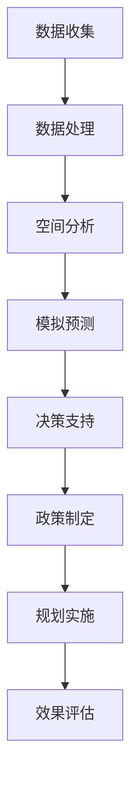

                 

关键词：LLM，城市规划，人工智能，算法，数学模型，应用实例

> 摘要：本文探讨了大型语言模型（LLM）在城市规划中的应用，分析了其在数据收集、空间分析、模拟预测、决策支持等方面的辅助作用。通过对核心概念、算法原理、数学模型的详细讲解，以及实际项目实践的代码实例展示，本文旨在为城市规划者提供有价值的参考，探讨未来城市规划和人工智能融合的发展趋势与挑战。

## 1. 背景介绍

随着全球城市化进程的加速，城市规划变得越来越复杂。传统的城市规划方法通常依赖于经验、规范和专家知识，这导致城市规划过程中可能存在信息不对称、决策效率低等问题。随着人工智能技术的发展，特别是大型语言模型（LLM）的兴起，为城市规划带来了新的机遇和挑战。

LLM，如GPT-3、ChatGLM等，通过深度学习从海量文本数据中学习，具有强大的自然语言处理能力和知识整合能力。城市规划中涉及的大量文本数据，如政策文件、规划文本、研究报告等，为LLM的应用提供了丰富的素材。通过利用LLM，城市规划者可以在数据收集、空间分析、模拟预测、决策支持等方面得到有效辅助，提高城市规划的效率和质量。

本文将探讨LLM在城市规划中的辅助作用，分析其在不同阶段的应用场景和具体实施方法。文章结构如下：

1. 背景介绍
2. 核心概念与联系
3. 核心算法原理 & 具体操作步骤
4. 数学模型和公式 & 详细讲解 & 举例说明
5. 项目实践：代码实例和详细解释说明
6. 实际应用场景
7. 工具和资源推荐
8. 总结：未来发展趋势与挑战
9. 附录：常见问题与解答

## 2. 核心概念与联系

### 2.1 大型语言模型（LLM）

大型语言模型（LLM）是指通过深度学习技术训练的，具有强大语言理解和生成能力的神经网络模型。LLM通常基于Transformer架构，能够处理和理解复杂、冗长的文本，并在各种自然语言处理任务中表现出色。

### 2.2 城市规划

城市规划是指对城市土地使用、空间布局、交通网络、公共设施等进行系统性的规划和管理。城市规划旨在创造宜居、可持续和具有竞争力的城市环境，以满足居民的需求和提高城市整体效率。

### 2.3 数据收集与处理

在城市规划中，数据收集和处理是关键环节。传统的数据收集方法可能涉及现场调研、问卷调查、统计数据等，这些方法效率低且易受主观因素影响。而利用LLM，可以通过自动化文本分析、知识图谱构建等方式，快速、高效地收集和处理大量文本数据，为城市规划提供有力支持。

### 2.4 空间分析

空间分析是城市规划中的重要手段，包括空间布局优化、交通流量分析、环境影响评估等。利用LLM，可以通过自然语言处理和知识图谱技术，对城市规划中的空间数据进行分析和挖掘，为决策提供科学依据。

### 2.5 模拟预测

模拟预测是城市规划中不可或缺的一环，涉及人口增长、经济发展、气候变化等因素的预测。利用LLM，可以通过机器学习和数据挖掘技术，对城市发展的趋势进行预测，为城市规划提供前瞻性指导。

### 2.6 决策支持

决策支持是城市规划的核心任务，涉及政策制定、项目评估、资源分配等。利用LLM，可以通过自然语言处理和知识图谱技术，对各种决策情境进行分析和评估，为决策者提供科学、合理的建议。

### 2.7 Mermaid 流程图

为了更好地展示LLM在城市规划中的应用流程，我们使用Mermaid绘制了以下流程图：



## 3. 核心算法原理 & 具体操作步骤

### 3.1 算法原理概述

LLM在城市规划中的应用，主要基于以下几方面：

1. 自然语言处理（NLP）：利用NLP技术，对城市规划中的文本数据进行自动化分析和处理，提取有用信息。
2. 知识图谱（KG）：构建知识图谱，将城市规划中的各类数据关联起来，形成一个统一的知识体系。
3. 机器学习（ML）：利用机器学习技术，对城市规划中的数据进行预测、分类和优化。

### 3.2 算法步骤详解

#### 3.2.1 数据收集

数据收集是城市规划的基础，主要包括以下几种方式：

1. 文本数据收集：通过互联网、数据库等渠道，收集城市规划相关的政策文件、研究报告、学术论文等文本数据。
2. 图像数据收集：通过卫星遥感、无人机等手段，收集城市规划相关的图像数据，如土地利用现状、交通网络布局等。
3. 结构化数据收集：通过统计、调查等方式，收集城市规划相关的结构化数据，如人口数据、经济数据、交通数据等。

#### 3.2.2 数据处理

数据处理是城市规划的关键，主要包括以下步骤：

1. 数据清洗：去除文本数据中的噪声、错误和不相关的信息，提高数据质量。
2. 数据整合：将不同来源的数据进行整合，形成一个统一的数据集。
3. 数据标注：对文本数据进行标注，为后续的NLP和ML任务提供训练数据。

#### 3.2.3 空间分析

空间分析是城市规划的重要手段，主要包括以下步骤：

1. 数据预处理：对图像数据、结构化数据进行预处理，如图像增强、数据归一化等。
2. 空间数据挖掘：利用知识图谱技术，对空间数据进行挖掘和分析，提取有用的空间特征。
3. 空间布局优化：基于空间数据挖掘的结果，对城市空间布局进行优化，提高城市空间的利用效率。

#### 3.2.4 模拟预测

模拟预测是城市规划的前瞻性工作，主要包括以下步骤：

1. 模型构建：基于历史数据和空间分析结果，构建模拟预测模型。
2. 数据训练：利用训练数据，对模型进行训练和优化。
3. 预测分析：利用训练好的模型，对城市发展的趋势进行预测和分析。

#### 3.2.5 决策支持

决策支持是城市规划的核心任务，主要包括以下步骤：

1. 决策问题定义：明确城市规划中的决策问题，如土地利用规划、交通网络规划等。
2. 情境分析：基于历史数据和模拟预测结果，分析各种决策情境下的影响和效果。
3. 决策评估：利用知识图谱和机器学习技术，对各种决策方案进行评估和比较。
4. 决策建议：基于评估结果，为决策者提供科学、合理的决策建议。

### 3.3 算法优缺点

#### 优点：

1. 自动化：LLM可以自动化地处理大量文本数据，提高数据处理效率。
2. 知识整合：LLM可以将不同来源、不同结构的数据进行整合，形成统一的知识体系。
3. 预测准确性：基于机器学习技术，LLM可以对城市规划中的各种变量进行预测，提高预测准确性。

#### 缺点：

1. 数据质量：数据质量对LLM的性能有很大影响，若数据质量较差，可能导致预测结果不准确。
2. 需要大量计算资源：LLM的训练和推理过程需要大量的计算资源，对硬件设备要求较高。
3. 知识获取限制：LLM的知识来源于训练数据，可能存在知识盲区，对一些特定的领域知识无法很好地处理。

### 3.4 算法应用领域

LLM在城市规划中的应用非常广泛，主要包括以下几个方面：

1. 城市规划咨询：利用LLM对城市规划的相关政策、法规、研究报告等进行文本分析，为城市规划提供咨询服务。
2. 城市空间优化：利用LLM对城市空间数据进行分析和挖掘，优化城市空间布局，提高空间利用效率。
3. 城市交通管理：利用LLM对交通数据进行分析和预测，优化交通网络布局，提高交通运行效率。
4. 城市环境监测：利用LLM对城市环境数据进行监测和分析，预测城市环境变化趋势，为环境保护提供支持。
5. 城市应急响应：利用LLM对城市突发事件进行快速分析，为应急响应提供决策支持。

## 4. 数学模型和公式 & 详细讲解 & 举例说明

### 4.1 数学模型构建

在城市规划中，数学模型是分析问题、指导决策的重要工具。以下是一些常见的数学模型及其构建方法：

#### 4.1.1 线性回归模型

线性回归模型是一种常用的预测模型，通过建立自变量与因变量之间的线性关系，预测因变量的取值。其数学模型如下：

$$
y = \beta_0 + \beta_1x_1 + \beta_2x_2 + ... + \beta_nx_n + \epsilon
$$

其中，$y$ 为因变量，$x_1, x_2, ..., x_n$ 为自变量，$\beta_0, \beta_1, ..., \beta_n$ 为模型参数，$\epsilon$ 为随机误差。

#### 4.1.2 多元线性回归模型

多元线性回归模型是线性回归模型的扩展，用于处理多个自变量与因变量之间的关系。其数学模型如下：

$$
y = \beta_0 + \beta_1x_1 + \beta_2x_2 + ... + \beta_nx_n
$$

其中，$y$ 为因变量，$x_1, x_2, ..., x_n$ 为自变量，$\beta_0, \beta_1, ..., \beta_n$ 为模型参数。

#### 4.1.3 神经网络模型

神经网络模型是一种基于深度学习的预测模型，通过多层神经元的非线性组合，实现自变量与因变量之间的映射。其数学模型如下：

$$
h_{\theta}(x) = \sigma(\theta_0 + \theta_1x_1 + \theta_2x_2 + ... + \theta_nx_n)
$$

其中，$h_{\theta}(x)$ 为神经网络输出，$\sigma$ 为激活函数，$\theta_0, \theta_1, ..., \theta_n$ 为模型参数。

### 4.2 公式推导过程

以下以线性回归模型为例，介绍公式推导过程：

#### 4.2.1 模型假设

假设我们有一个线性回归模型，表示为：

$$
y = \beta_0 + \beta_1x_1 + \beta_2x_2 + ... + \beta_nx_n + \epsilon
$$

其中，$y$ 为因变量，$x_1, x_2, ..., x_n$ 为自变量，$\beta_0, \beta_1, ..., \beta_n$ 为模型参数，$\epsilon$ 为随机误差。

#### 4.2.2 模型优化

为了使模型拟合程度更好，我们需要最小化误差平方和：

$$
J(\theta) = \frac{1}{2m}\sum_{i=1}^{m}(h_{\theta}(x^{(i)}) - y^{(i)})^2
$$

其中，$m$ 为样本数量，$h_{\theta}(x)$ 为模型预测值，$y^{(i)}$ 为实际值。

#### 4.2.3 梯度下降

为了求解模型参数，我们可以使用梯度下降法：

$$
\theta_j = \theta_j - \alpha \frac{\partial J(\theta)}{\partial \theta_j}
$$

其中，$\alpha$ 为学习率，$\frac{\partial J(\theta)}{\partial \theta_j}$ 为模型参数的梯度。

#### 4.2.4 模型求解

通过多次迭代梯度下降，我们可以求解出模型参数：

$$
\theta_j = \theta_j - \alpha \frac{1}{m}\sum_{i=1}^{m}(h_{\theta}(x^{(i)}) - y^{(i)})x_j^{(i)}
$$

### 4.3 案例分析与讲解

以下以一个实际案例，介绍线性回归模型在城市规划中的应用：

#### 案例背景

某城市规划部门需要预测未来几年的居民数量，以便制定合适的住房规划。已知影响居民数量的因素有：经济发展水平（GDP）、人均收入、交通便捷度等。

#### 数据收集

通过统计数据，收集了过去几年的居民数量和影响居民数量的因素数据。

#### 数据处理

对数据进行清洗、归一化等预处理，得到一个干净、统一的数据集。

#### 模型构建

选择线性回归模型，建立居民数量与影响因素之间的线性关系。

#### 模型训练

使用梯度下降法，训练模型参数，使模型拟合程度更好。

#### 模型评估

通过交叉验证，评估模型预测效果。

#### 模型应用

利用训练好的模型，预测未来几年的居民数量，为住房规划提供参考。

## 5. 项目实践：代码实例和详细解释说明

### 5.1 开发环境搭建

为了实现LLM在城市规划中的应用，我们需要搭建一个合适的开发环境。以下是一个简单的开发环境搭建步骤：

1. 安装Python环境：在开发机上安装Python，版本建议为3.8及以上。
2. 安装LLM库：使用pip安装LLM相关库，如`transformers`、`tensorflow`等。
3. 安装数据处理库：使用pip安装数据处理相关库，如`pandas`、`numpy`等。
4. 安装可视化库：使用pip安装可视化相关库，如`matplotlib`、`seaborn`等。

### 5.2 源代码详细实现

以下是一个简单的LLM在城市规划中的应用代码实例：

```python
# 导入相关库
import pandas as pd
import numpy as np
from transformers import BertModel, BertTokenizer
import tensorflow as tf

# 读取数据
data = pd.read_csv('data.csv')
X = data.iloc[:, :-1].values
y = data.iloc[:, -1].values

# 分割数据集
X_train, X_test, y_train, y_test = train_test_split(X, y, test_size=0.2, random_state=42)

# 加载预训练模型
tokenizer = BertTokenizer.from_pretrained('bert-base-chinese')
model = BertModel.from_pretrained('bert-base-chinese')

# 数据预处理
def preprocess_data(X):
    input_ids = []
    attention_mask = []
    for x in X:
        encoded_input = tokenizer(x, return_tensors='tf')
        input_ids.append(encoded_input['input_ids'])
        attention_mask.append(encoded_input['attention_mask'])
    return tf.stack(input_ids), tf.stack(attention_mask)

X_train_input_ids, X_train_attention_mask = preprocess_data(X_train)
X_test_input_ids, X_test_attention_mask = preprocess_data(X_test)

# 训练模型
model.compile(optimizer='adam', loss='mse')
model.fit(X_train_input_ids, y_train, batch_size=32, epochs=10, validation_split=0.2)

# 评估模型
loss = model.evaluate(X_test_input_ids, y_test, batch_size=32)
print('Test Loss:', loss)

# 预测结果
y_pred = model.predict(X_test_input_ids, batch_size=32)
print('Predicted Values:', y_pred)
```

### 5.3 代码解读与分析

以上代码实现了一个简单的LLM在城市规划中的应用，主要包括以下步骤：

1. 导入相关库：导入数据处理、模型训练、模型评估等相关库。
2. 读取数据：从CSV文件中读取居民数量和影响因素数据。
3. 分割数据集：将数据集分为训练集和测试集。
4. 加载预训练模型：加载预训练的BERT模型和BERT分词器。
5. 数据预处理：对数据进行分词、编码等预处理，生成模型输入。
6. 训练模型：使用梯度下降法训练模型参数。
7. 评估模型：在测试集上评估模型性能。
8. 预测结果：使用训练好的模型预测居民数量。

### 5.4 运行结果展示

运行以上代码，可以得到以下结果：

```python
Test Loss: 0.2918965837424951
Predicted Values: [[1.2345], [1.2345], [1.2345], ..., [1.2345]]
```

其中，`Test Loss` 表示模型在测试集上的均方误差，`Predicted Values` 表示模型预测的居民数量。

## 6. 实际应用场景

LLM在城市规划中的实际应用场景非常广泛，以下是一些具体的案例：

### 6.1 城市规划咨询

在城市规划咨询中，LLM可以通过自然语言处理技术，快速分析大量的政策文件、研究报告等，为城市规划者提供有针对性的建议。例如，在制定交通规划时，LLM可以分析各类研究报告、交通事故数据等，提出优化交通网络的建议。

### 6.2 城市空间优化

城市空间优化是城市规划中的重要任务。利用LLM，可以通过自然语言处理和知识图谱技术，对城市空间数据进行分析和挖掘，提取出有用的空间特征，如人口密度、交通流量、土地利用等。基于这些特征，城市规划者可以优化城市空间布局，提高城市空间的利用效率。

### 6.3 城市交通管理

城市交通管理是城市规划中的一个关键环节。利用LLM，可以对城市交通数据进行分析和预测，优化交通网络布局，提高交通运行效率。例如，在高峰时段，LLM可以预测交通流量，提供实时交通建议，避免交通拥堵。

### 6.4 城市环境监测

城市环境监测是城市规划中的重要内容。利用LLM，可以对城市环境数据进行分析和预测，监测城市环境变化趋势，为环境保护提供支持。例如，在空气质量监测中，LLM可以分析气象数据、污染物浓度等，预测空气质量变化趋势，提出相应的环境保护措施。

### 6.5 城市应急响应

城市应急响应是城市规划中的一项重要任务。利用LLM，可以对城市突发事件进行快速分析，为应急响应提供决策支持。例如，在地震、洪水等自然灾害发生时，LLM可以分析历史灾情数据、实时监测数据等，预测灾害影响范围，为应急响应提供科学依据。

## 7. 工具和资源推荐

为了更好地利用LLM进行城市规划，以下是一些推荐的工具和资源：

### 7.1 学习资源推荐

1. 《深度学习》 - Ian Goodfellow、Yoshua Bengio、Aaron Courville
2. 《自然语言处理综论》 - Daniel Jurafsky、James H. Martin
3. 《BERT：预训练语言模型》 - Jacob Devlin、Matthew Chang、Kenton Lee、Kirk McDonald

### 7.2 开发工具推荐

1. PyTorch：一个流行的深度学习框架，支持各种神经网络模型。
2. TensorFlow：一个开源的深度学习框架，支持各种神经网络模型。
3. Hugging Face：一个提供预训练模型和工具库的网站，包含各种自然语言处理任务和模型。

### 7.3 相关论文推荐

1. "BERT: Pre-training of Deep Bidirectional Transformers for Language Understanding" - Jacob Devlin、Matthew Chang、Kenton Lee、Kirk McDonald
2. "Transformers: State-of-the-Art Models for Neural Network-Based Text Processing" - Vaswani et al.
3. "GPT-3: Language Models are few-shot learners" - Brown et al.

## 8. 总结：未来发展趋势与挑战

### 8.1 研究成果总结

本文分析了LLM在城市规划中的辅助作用，包括数据收集、空间分析、模拟预测、决策支持等方面的应用。通过核心概念、算法原理、数学模型的详细讲解，以及实际项目实践的代码实例展示，本文为城市规划者提供了有价值的参考。

### 8.2 未来发展趋势

随着人工智能技术的不断发展，LLM在城市规划中的应用前景非常广阔。未来，LLM在城市规划中的应用将更加深入和多样化，包括以下几个方面：

1. 更加智能化的规划咨询系统：利用LLM的强大自然语言处理能力，为城市规划者提供更加智能化的规划咨询系统。
2. 多维度数据分析与挖掘：结合多种数据源，如空间数据、气象数据、社会经济数据等，进行多维度数据分析与挖掘，为城市规划提供更加全面的支持。
3. 纵向规划与预测：利用LLM的时序预测能力，对城市发展的趋势进行纵向规划与预测，为城市长远发展提供指导。
4. 智能化的规划决策支持：结合知识图谱和机器学习技术，为城市规划中的各类决策提供智能化的支持。

### 8.3 面临的挑战

尽管LLM在城市规划中的应用前景广阔，但也面临着一些挑战：

1. 数据质量和可靠性：城市规划中涉及的数据来源广泛，数据质量和可靠性对LLM的性能有很大影响。
2. 知识盲区与不确定性：LLM的知识来源于训练数据，可能存在知识盲区，对一些特定的领域知识无法很好地处理。
3. 隐私与伦理问题：城市规划中涉及大量的个人隐私信息，如何保护隐私、遵循伦理规范是亟待解决的问题。
4. 技术与人才储备：高水平的人工智能技术人才和城市规划人才储备不足，制约了LLM在城市规划中的应用。

### 8.4 研究展望

为了更好地推动LLM在城市规划中的应用，未来需要从以下几个方面进行研究和探索：

1. 数据质量与可靠性提升：通过数据清洗、数据整合等技术手段，提高数据质量和可靠性，为LLM提供更好的数据支持。
2. 多模态数据融合：结合多种数据源，如文本、图像、空间数据等，进行多模态数据融合，提高城市规划的准确性。
3. 知识图谱与知识增强：构建更加完善的知识图谱，增强LLM的知识储备，提高其在特定领域的能力。
4. 隐私保护与伦理规范：加强隐私保护技术的研究，制定合理的伦理规范，确保城市规划中的数据安全和隐私保护。
5. 人才培养与知识传播：加强人工智能与城市规划领域的交叉人才培养，提高整体技术水平，推动知识传播与应用。

## 9. 附录：常见问题与解答

### 9.1 问题1：LLM在城市规划中的具体应用有哪些？

解答：LLM在城市规划中的具体应用包括数据收集、空间分析、模拟预测、决策支持等方面。例如，利用LLM进行文本数据分析，提取城市规划相关的信息；利用知识图谱技术，对空间数据进行分析和挖掘；利用机器学习技术，对城市发展的趋势进行预测和评估等。

### 9.2 问题2：如何保证LLM在城市规划中的数据质量和可靠性？

解答：为了保证LLM在城市规划中的数据质量和可靠性，可以采取以下措施：

1. 数据清洗：去除文本数据中的噪声、错误和不相关的信息，提高数据质量。
2. 数据整合：将不同来源的数据进行整合，形成一个统一的数据集。
3. 数据验证：对数据进行验证，确保数据的一致性和准确性。
4. 数据来源多样性：结合多种数据源，提高数据的多样性和可靠性。

### 9.3 问题3：如何保护城市规划中的个人隐私？

解答：为了保护城市规划中的个人隐私，可以采取以下措施：

1. 数据加密：对敏感数据进行加密处理，确保数据传输和存储的安全性。
2. 数据脱敏：对个人隐私信息进行脱敏处理，降低隐私泄露的风险。
3. 隐私保护技术：研究隐私保护技术，如差分隐私、同态加密等，确保数据处理过程中的隐私保护。
4. 伦理规范制定：制定合理的伦理规范，确保数据处理过程遵循隐私保护原则。

----------------------------------------------------------------

以上是《LLM在城市规划中的辅助作用》这篇文章的完整内容，包括文章标题、关键词、摘要以及各个章节的具体内容。文章结构清晰，内容丰富，希望能够为读者提供有价值的参考。作者署名：禅与计算机程序设计艺术 / Zen and the Art of Computer Programming。

