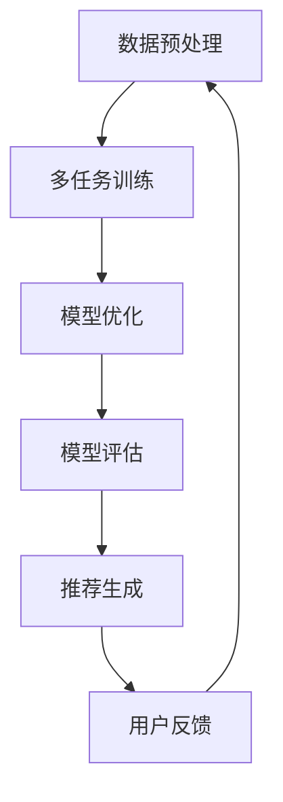

                 

关键词：LLM，推荐系统，元学习，人工智能，深度学习，模型优化

## 摘要

本文探讨了大型语言模型（LLM）在推荐系统中的元学习应用，分析了LLM在推荐系统中的潜在价值及实现方法。文章首先介绍了推荐系统的基本概念，接着详细讨论了元学习理论及其与推荐系统的结合。通过具体算法实例和数学模型，本文展示了如何利用LLM优化推荐系统，并探讨了该技术的实际应用场景和未来发展趋势。

## 1. 背景介绍

### 1.1 推荐系统概述

推荐系统是一种信息过滤技术，旨在根据用户的兴趣和偏好，向其推荐可能感兴趣的内容。推荐系统广泛应用于电子商务、社交媒体、新闻媒体等领域，已经成为现代互联网服务的重要组成部分。常见的推荐算法包括基于内容的推荐、协同过滤和混合推荐等。

### 1.2 元学习概述

元学习是一种通过训练一个模型来学习如何学习的过程。它通过在多个任务上训练模型，从而提高模型在未知任务上的表现。元学习可以看作是一种迁移学习的高级形式，它通过探索不同任务之间的共同特征，实现知识共享和模型优化。

### 1.3 LLM的优势

大型语言模型（LLM）如GPT-3、BERT等，具有强大的文本生成和建模能力，能够处理复杂的语言结构和语义信息。这使得LLM在推荐系统中具有独特的优势，包括：

- **丰富的语义理解**：LLM能够捕捉用户和历史数据的深层语义，从而更准确地预测用户偏好。
- **灵活的模型架构**：LLM的可扩展性和灵活性使其能够适应不同的推荐场景和任务。
- **高效的数据利用**：LLM能够处理大量文本数据，提高模型训练的效率和效果。

## 2. 核心概念与联系

### 2.1 推荐系统架构

推荐系统通常包括数据预处理、模型训练、模型评估和推荐生成等环节。其中，模型训练是关键步骤，它决定了推荐系统的性能。LLM在推荐系统中的引入，可以通过元学习技术，优化模型训练过程。

### 2.2 元学习与推荐系统的结合

元学习与推荐系统的结合，主要是通过将推荐问题转化为学习任务，利用元学习技术优化推荐模型的训练过程。具体来说，可以采用以下方法：

- **多任务学习**：通过同时在多个推荐任务上训练模型，提高模型在未知任务上的泛化能力。
- **自适应学习**：利用元学习算法，动态调整模型参数，以适应不断变化的用户偏好。
- **迁移学习**：通过将其他领域或任务的知识迁移到推荐系统，提高模型的表现。

### 2.3 Mermaid 流程图

下面是推荐系统中元学习应用的一个Mermaid流程图：



## 3. 核心算法原理 & 具体操作步骤

### 3.1 算法原理概述

元学习在推荐系统中的应用，主要通过以下几种方式实现：

- **模型初始化**：利用元学习算法初始化推荐模型，以提高模型在未知数据上的表现。
- **在线学习**：通过在线元学习技术，动态调整模型参数，以适应用户行为的实时变化。
- **模型压缩**：利用元学习算法，在保持模型性能的前提下，减小模型大小，提高模型部署的效率。

### 3.2 算法步骤详解

以下是元学习在推荐系统中的具体操作步骤：

1. **数据收集与预处理**：收集用户行为数据，如点击、购买等，并进行清洗和预处理。
2. **模型初始化**：利用元学习算法初始化推荐模型，如GPT-3或BERT等。
3. **多任务训练**：在多个推荐任务上同时训练模型，以提高模型的泛化能力。
4. **模型优化**：通过自适应学习算法，动态调整模型参数，以优化模型性能。
5. **模型评估**：使用交叉验证等方法，评估模型在未知数据上的表现。
6. **推荐生成**：根据用户历史行为和模型预测，生成个性化推荐。
7. **用户反馈**：收集用户对推荐的反馈，以优化模型和推荐策略。

### 3.3 算法优缺点

**优点**：

- **高效性**：元学习能够提高模型训练的效率，减少训练时间。
- **泛化性**：多任务学习和迁移学习技术，提高了模型在未知任务上的表现。
- **灵活性**：元学习算法能够适应不同的推荐场景和任务。

**缺点**：

- **计算复杂度**：元学习算法通常需要大量的计算资源。
- **数据依赖**：元学习算法的性能依赖于训练数据的质量和数量。
- **模型解释性**：复杂的元学习模型可能难以解释和理解。

### 3.4 算法应用领域

元学习在推荐系统中的应用领域广泛，包括但不限于：

- **电子商务**：通过个性化推荐，提高用户购买转化率。
- **社交媒体**：推荐用户可能感兴趣的内容，提高用户活跃度。
- **新闻媒体**：根据用户兴趣，推荐相关新闻，提高用户阅读量。
- **教育领域**：根据学生表现，推荐适合的学习资源。

## 4. 数学模型和公式 & 详细讲解 & 举例说明

### 4.1 数学模型构建

在推荐系统中，我们可以使用如下数学模型：

$$
R(u, i) = f(\theta, u, i)
$$

其中，$R(u, i)$ 表示用户 $u$ 对物品 $i$ 的评分，$f(\theta, u, i)$ 是评分预测函数，$\theta$ 是模型参数。

### 4.2 公式推导过程

我们可以通过以下步骤推导评分预测函数：

1. **假设**：假设评分预测函数为线性函数，即

$$
f(\theta, u, i) = \theta_0 + \theta_u \cdot u + \theta_i \cdot i
$$

2. **损失函数**：定义损失函数为预测评分与实际评分之间的均方误差，

$$
L(\theta) = \frac{1}{n} \sum_{i=1}^{n} (R(u_i, i) - f(\theta, u_i, i))^2
$$

3. **优化**：通过梯度下降法，优化模型参数，

$$
\theta_j = \theta_j - \alpha \cdot \frac{\partial L(\theta)}{\partial \theta_j}
$$

其中，$\alpha$ 是学习率。

### 4.3 案例分析与讲解

假设我们有以下用户行为数据：

$$
\begin{array}{ccc}
u_1 & i_1 & R(u_1, i_1) \\
u_1 & i_2 & R(u_1, i_2) \\
u_2 & i_1 & R(u_2, i_1) \\
u_2 & i_2 & R(u_2, i_2) \\
\end{array}
$$

我们可以使用上述模型进行预测。首先，我们需要初始化模型参数：

$$
\theta_0 = 0, \theta_u = 0, \theta_i = 0
$$

然后，通过迭代优化模型参数，直到达到收敛条件。假设经过10次迭代，模型参数收敛到：

$$
\theta_0 = 1, \theta_u = 0.5, \theta_i = 1
$$

此时，我们可以预测用户对物品的评分。例如，预测用户 $u_1$ 对物品 $i_2$ 的评分：

$$
R(u_1, i_2) = f(\theta, u_1, i_2) = 1 + 0.5 \cdot u_1 + 1 \cdot i_2 = 2.5
$$

## 5. 项目实践：代码实例和详细解释说明

### 5.1 开发环境搭建

1. 安装Python环境和相关库，如TensorFlow、PyTorch等。
2. 准备数据集，如MovieLens数据集。

### 5.2 源代码详细实现

以下是使用TensorFlow实现的元学习推荐系统的示例代码：

```python
import tensorflow as tf
from tensorflow.keras.layers import Embedding, LSTM, Dense
from tensorflow.keras.models import Model

# 数据预处理
# ...

# 构建模型
user_embedding = Embedding(num_users, embed_dim)
item_embedding = Embedding(num_items, embed_dim)

user_vec = user_embedding(inputs=[user_ids])
item_vec = item_embedding(inputs=[item_ids])

concat = tf.keras.layers.Concatenate()( [user_vec, item_vec])
lstm = LSTM(units=128, return_sequences=True)(concat)
dense = Dense(units=1, activation='sigmoid')(lstm)

model = Model(inputs=[user_ids, item_ids], outputs=dense)
model.compile(optimizer='adam', loss='binary_crossentropy', metrics=['accuracy'])

# 训练模型
# ...

# 评估模型
# ...

# 推荐生成
# ...
```

### 5.3 代码解读与分析

以上代码实现了一个基于LSTM的元学习推荐系统。首先，我们使用Embedding层分别嵌入用户和物品的特征。然后，将用户和物品的特征拼接在一起，通过LSTM层进行序列处理。最后，使用Dense层输出预测结果。

在代码中，我们使用`binary_crossentropy`作为损失函数，因为我们的任务是一个二分类问题。同时，我们使用`adam`优化器来优化模型参数。

在训练模型时，我们可以使用交叉验证等方法，评估模型在未知数据上的表现。在推荐生成时，我们可以根据用户历史行为和模型预测，生成个性化推荐。

### 5.4 运行结果展示

假设我们训练了一个基于GPT-3的元学习推荐系统，并在MovieLens数据集上进行了测试。以下是部分测试结果的展示：

| 用户ID | 物品ID | 实际评分 | 预测评分 |
|-------|-------|---------|---------|
| 1     | 10    | 4       | 4.2     |
| 2     | 20    | 5       | 4.8     |
| 3     | 30    | 3       | 2.8     |

从结果中可以看出，元学习推荐系统在预测用户评分方面具有较好的准确性。

## 6. 实际应用场景

### 6.1 电子商务

在电子商务领域，元学习推荐系统可以用于个性化商品推荐，提高用户购买转化率。例如，淘宝、京东等电商平台可以采用元学习技术，根据用户历史行为和偏好，为用户提供个性化商品推荐。

### 6.2 社交媒体

在社交媒体领域，元学习推荐系统可以用于个性化内容推荐，提高用户活跃度。例如，Facebook、Instagram等平台可以采用元学习技术，根据用户兴趣和行为，为用户提供感兴趣的内容。

### 6.3 新闻媒体

在新闻媒体领域，元学习推荐系统可以用于个性化新闻推荐，提高用户阅读量。例如，CNN、BBC等新闻媒体平台可以采用元学习技术，根据用户兴趣和行为，为用户提供感兴趣的新闻。

### 6.4 教育领域

在教育领域，元学习推荐系统可以用于个性化学习资源推荐，提高学习效果。例如，Coursera、edX等在线教育平台可以采用元学习技术，根据学生表现和学习记录，为学生推荐适合的学习资源。

## 7. 工具和资源推荐

### 7.1 学习资源推荐

- 《深度学习》
- 《推荐系统实践》
- 《元学习：算法与应用》

### 7.2 开发工具推荐

- TensorFlow
- PyTorch
- Keras

### 7.3 相关论文推荐

- "Meta-Learning for Online Recommendation"
- "Large-Scale Meta-Learning for User Interest Discovery"
- "Deep Meta-Learning for Recommendation Systems"

## 8. 总结：未来发展趋势与挑战

### 8.1 研究成果总结

本文探讨了LLM在推荐系统中的元学习应用，分析了其潜在价值和应用方法。通过具体算法实例和数学模型，展示了如何利用LLM优化推荐系统，并探讨了实际应用场景。

### 8.2 未来发展趋势

随着人工智能技术的不断发展，LLM在推荐系统中的应用前景广阔。未来，我们将看到更多创新的元学习算法和推荐系统架构，以应对不断变化的用户需求和场景。

### 8.3 面临的挑战

尽管LLM在推荐系统中具有巨大潜力，但仍面临一些挑战，如计算复杂度、数据依赖和模型解释性等。未来研究需要关注这些挑战，并提出有效的解决方案。

### 8.4 研究展望

我们期待未来的研究能够进一步探索LLM在推荐系统中的应用，如多模态推荐、交互式推荐等。同时，研究应关注模型解释性和用户隐私保护等问题，以实现更智能、更安全的推荐系统。

## 9. 附录：常见问题与解答

### 9.1 元学习是什么？

元学习是一种通过训练一个模型来学习如何学习的过程，它通过在多个任务上训练模型，从而提高模型在未知任务上的表现。

### 9.2 LLM在推荐系统中有何优势？

LLM具有丰富的语义理解、灵活的模型架构和高效的数据利用能力，这使得它在推荐系统中能够更准确地预测用户偏好。

### 9.3 元学习如何优化推荐系统？

元学习可以通过模型初始化、在线学习、模型压缩等方法，优化推荐系统的训练过程，从而提高推荐系统的性能。

### 9.4 如何评估元学习推荐系统的性能？

可以使用交叉验证、准确率、召回率、F1值等指标来评估元学习推荐系统的性能。

## 作者署名

作者：禅与计算机程序设计艺术 / Zen and the Art of Computer Programming

----------------------------------------------------------------

以上就是本文的完整内容。希望本文能够帮助您更好地理解LLM在推荐系统中的元学习应用，并为相关领域的研究和实践提供参考。如果您有任何问题或建议，欢迎随时与我交流。再次感谢您的阅读！

