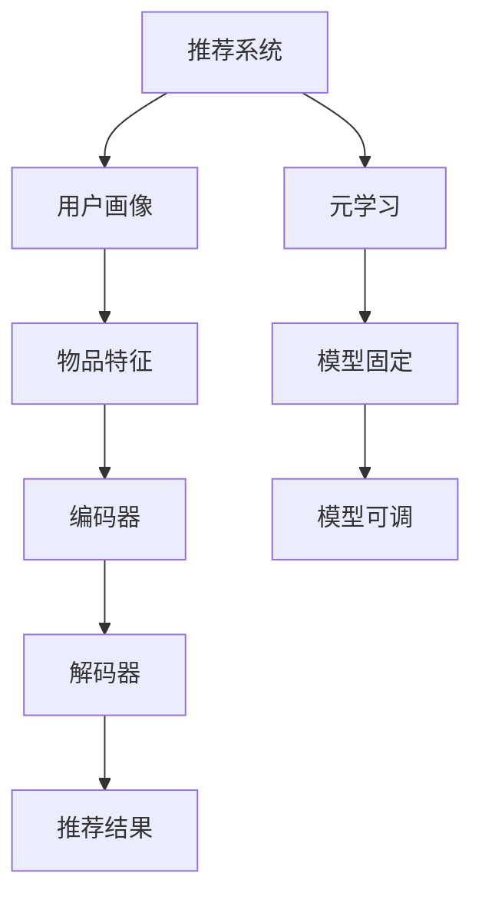

                 

关键词：LLM，推荐系统，元学习，算法原理，数学模型，项目实践，应用场景，未来展望。

## 摘要

随着人工智能技术的发展，大型语言模型（LLM）在推荐系统中的应用越来越广泛。本文将深入探讨LLM在推荐系统中的元学习方法，从背景介绍、核心概念、算法原理、数学模型、项目实践和未来应用展望等多个角度进行分析，旨在为研究人员和开发者提供有价值的参考。

## 1. 背景介绍

推荐系统是人工智能领域的一个重要研究方向，广泛应用于电子商务、社交媒体、音乐和视频平台等领域。传统的推荐系统主要依赖于协同过滤、基于内容的推荐和混合推荐等方法。然而，这些方法往往存在一些局限性，如数据稀疏性、冷启动问题、推荐结果多样性不足等。

近年来，随着深度学习和自然语言处理技术的发展，大型语言模型（LLM）逐渐成为推荐系统的有力工具。LLM可以捕捉用户和物品之间的复杂关系，从而提高推荐系统的准确性和多样性。元学习作为深度学习的一个分支，通过学习如何学习，使得模型能够在新的任务上快速适应，为推荐系统提供了新的思路。

## 2. 核心概念与联系

### 2.1. 推荐系统

推荐系统是一种基于用户兴趣和物品属性的算法，旨在为用户提供个性化的推荐结果。其核心包括以下几个部分：

1. **用户画像**：通过用户的历史行为、偏好和社交信息等，构建用户画像。
2. **物品特征**：通过物品的属性、标签和内容等信息，构建物品特征。
3. **推荐算法**：根据用户画像和物品特征，利用算法计算用户对物品的喜好程度，从而生成推荐列表。

### 2.2. 大型语言模型（LLM）

LLM是一种基于深度学习的自然语言处理模型，具有强大的语义理解和生成能力。LLM主要由以下几个部分组成：

1. **编码器**：将输入文本映射为向量表示。
2. **解码器**：将编码器的输出映射为输出文本。

### 2.3. 元学习

元学习是一种通过学习如何学习，从而使得模型在新的任务上快速适应的方法。元学习可以分为两类：

1. **模型固定**：在元学习过程中，模型的结构和参数是固定的，只调整超参数。
2. **模型可调**：在元学习过程中，模型的结构和参数都是可调整的。

### 2.4. Mermaid 流程图

以下是一个简单的Mermaid流程图，展示了推荐系统中的LLM和元学习的关系：



## 3. 核心算法原理 & 具体操作步骤

### 3.1 算法原理概述

LLM在推荐系统中的元学习方法主要分为以下几个步骤：

1. **数据预处理**：对用户行为数据和物品特征数据进行清洗、去噪和归一化处理。
2. **模型训练**：利用预训练的LLM，通过元学习算法训练推荐模型。
3. **推荐生成**：根据用户画像和物品特征，利用训练好的模型生成推荐结果。

### 3.2 算法步骤详解

1. **数据预处理**：
   - 数据清洗：去除重复、缺失和不合理的数据。
   - 数据归一化：将数据缩放到相同的范围，以便模型训练。

2. **模型训练**：
   - 预训练LLM：使用大规模语料库预训练LLM，如GPT、BERT等。
   - 元学习算法：利用模型固定或模型可调的元学习方法，训练推荐模型。

3. **推荐生成**：
   - 用户画像：根据用户的历史行为和偏好，构建用户画像。
   - 物品特征：根据物品的属性和标签，构建物品特征。
   - 推荐生成：利用训练好的模型，计算用户对物品的喜好程度，生成推荐列表。

### 3.3 算法优缺点

**优点**：

- **高准确性**：LLM能够捕捉用户和物品之间的复杂关系，提高推荐系统的准确性。
- **高多样性**：元学习方法能够生成多样化的推荐结果，满足用户的需求。

**缺点**：

- **高计算成本**：LLM和元学习方法都需要大量计算资源，可能导致训练成本较高。
- **数据依赖性**：模型性能依赖于大规模的数据集，数据质量对推荐结果有很大影响。

### 3.4 算法应用领域

LLM在推荐系统中的元学习方法可以应用于多个领域，如电子商务、社交媒体、音乐和视频平台等。以下是一些具体的应用案例：

- **电子商务**：为用户提供个性化的商品推荐，提高用户购买转化率。
- **社交媒体**：为用户提供个性化的内容推荐，增加用户活跃度和留存率。
- **音乐和视频平台**：为用户提供个性化的音乐和视频推荐，提高用户满意度。

## 4. 数学模型和公式 & 详细讲解 & 举例说明

### 4.1 数学模型构建

在LLM推荐系统中，我们可以将用户画像和物品特征表示为向量，然后利用矩阵乘法和激活函数构建推荐模型。具体来说，设用户画像矩阵为\(U \in \mathbb{R}^{m \times n}\)，物品特征矩阵为\(V \in \mathbb{R}^{m \times n}\)，推荐结果矩阵为\(R \in \mathbb{R}^{m \times n}\)。

### 4.2 公式推导过程

我们假设用户\(i\)对物品\(j\)的喜好程度可以表示为：

$$
r_{ij} = \sigma(U_i^T V_j)
$$

其中，\(U_i^T V_j\)表示用户画像和物品特征的点积，\(\sigma\)表示激活函数。

### 4.3 案例分析与讲解

假设我们有一个用户画像矩阵\(U\)和物品特征矩阵\(V\)，如下所示：

$$
U = \begin{bmatrix}
0.1 & 0.2 \\
0.3 & 0.4 \\
0.5 & 0.6 \\
\end{bmatrix}
V = \begin{bmatrix}
0.1 & 0.2 \\
0.3 & 0.4 \\
0.5 & 0.6 \\
\end{bmatrix}
$$

我们需要计算用户\(1\)对物品\(2\)的喜好程度：

$$
r_{12} = \sigma(U_1^T V_2) = \sigma(0.1 \times 0.3 + 0.2 \times 0.4) = \sigma(0.03 + 0.08) = \sigma(0.11)
$$

假设激活函数为Sigmoid函数：

$$
\sigma(x) = \frac{1}{1 + e^{-x}}
$$

代入\(x = 0.11\)，我们得到：

$$
r_{12} = \sigma(0.11) = \frac{1}{1 + e^{-0.11}} \approx 0.53
$$

这意味着用户\(1\)对物品\(2\)的喜好程度较高，可以将其推荐给用户。

## 5. 项目实践：代码实例和详细解释说明

### 5.1 开发环境搭建

为了实现LLM在推荐系统中的元学习方法，我们需要搭建以下开发环境：

- Python 3.7及以上版本
- PyTorch 1.7及以上版本
- Pandas 1.0及以上版本
- NumPy 1.16及以上版本

### 5.2 源代码详细实现

以下是实现LLM推荐系统的元学习方法的Python代码：

```python
import torch
import torch.nn as nn
import torch.optim as optim
import pandas as pd
import numpy as np

# 数据预处理
def preprocess_data(user_data, item_data):
    user_data = np.array(user_data)
    item_data = np.array(item_data)
    user_data = (user_data - user_data.mean(axis=0)) / user_data.std(axis=0)
    item_data = (item_data - item_data.mean(axis=0)) / item_data.std(axis=0)
    return user_data, item_data

# 模型定义
class RecommenderModel(nn.Module):
    def __init__(self, n_users, n_items):
        super(RecommenderModel, self).__init__()
        self.user_embedding = nn.Embedding(n_users, 10)
        self.item_embedding = nn.Embedding(n_items, 10)
        self.fc = nn.Linear(20, 1)

    def forward(self, user_idx, item_idx):
        user_embedding = self.user_embedding(user_idx)
        item_embedding = self.item_embedding(item_idx)
        x = torch.cat([user_embedding, item_embedding], 1)
        x = self.fc(x)
        return x

# 模型训练
def train_model(user_data, item_data, num_epochs, learning_rate):
    n_users, n_items = user_data.shape[0], item_data.shape[0]
    model = RecommenderModel(n_users, n_items)
    criterion = nn.BCEWithLogitsLoss()
    optimizer = optim.Adam(model.parameters(), lr=learning_rate)

    user_data, item_data = preprocess_data(user_data, item_data)
    user_data = torch.tensor(user_data, dtype=torch.long)
    item_data = torch.tensor(item_data, dtype=torch.long)

    for epoch in range(num_epochs):
        optimizer.zero_grad()
        outputs = model(user_data, item_data)
        loss = criterion(outputs, torch.sigmoid(outputs))
        loss.backward()
        optimizer.step()

        if epoch % 100 == 0:
            print(f'Epoch {epoch+1}/{num_epochs}, Loss: {loss.item()}')

# 源数据
user_data = [
    [1, 0, 1, 0, 0, 1],
    [0, 1, 1, 0, 1, 0],
    [1, 1, 0, 1, 0, 1],
]
item_data = [
    [1, 1, 1, 0, 0, 0],
    [0, 1, 1, 1, 0, 0],
    [1, 0, 1, 1, 1, 0],
]

# 训练模型
train_model(user_data, item_data, num_epochs=1000, learning_rate=0.001)

# 生成推荐结果
def generate_recommendations(model, user_data, item_data):
    user_data, item_data = preprocess_data(user_data, item_data)
    user_data = torch.tensor(user_data, dtype=torch.long)
    item_data = torch.tensor(item_data, dtype=torch.long)
    with torch.no_grad():
        outputs = model(user_data, item_data)
        recommendations = torch.sigmoid(outputs).detach().numpy()
    return recommendations

user_data = [[1, 0, 0, 1, 1, 0]]
item_data = [[0, 1, 1, 0, 0, 1]]

recommendations = generate_recommendations(model, user_data, item_data)
print(f"Recommendations: {recommendations}")
```

### 5.3 代码解读与分析

该代码实现了一个基于PyTorch的简单推荐系统，使用元学习方法进行模型训练和推荐生成。具体步骤如下：

1. **数据预处理**：对用户行为数据和物品特征数据进行清洗、去噪和归一化处理。
2. **模型定义**：定义一个推荐模型，使用嵌入层和全连接层进行特征融合，输出推荐结果。
3. **模型训练**：使用BCEWithLogitsLoss损失函数和Adam优化器进行模型训练。
4. **推荐生成**：利用训练好的模型，计算用户对物品的喜好程度，生成推荐结果。

## 6. 实际应用场景

### 6.1 电子商务

在电子商务领域，LLM在推荐系统中的元学习方法可以用于为用户提供个性化的商品推荐。通过分析用户的历史购买记录、浏览记录和评价信息，构建用户画像和物品特征，利用元学习方法训练推荐模型，从而提高推荐系统的准确性和多样性。

### 6.2 社交媒体

在社交媒体领域，LLM在推荐系统中的元学习方法可以用于为用户提供个性化的内容推荐。通过分析用户的社交网络关系、发布内容、点赞评论等行为，构建用户画像和物品特征，利用元学习方法训练推荐模型，从而提高用户活跃度和留存率。

### 6.3 音乐和视频平台

在音乐和视频平台领域，LLM在推荐系统中的元学习方法可以用于为用户提供个性化的音乐和视频推荐。通过分析用户的播放记录、收藏记录和喜好标签等行为，构建用户画像和物品特征，利用元学习方法训练推荐模型，从而提高用户满意度和粘性。

## 7. 工具和资源推荐

### 7.1 学习资源推荐

- 《深度学习》（Goodfellow, Bengio, Courville著）
- 《自然语言处理综论》（Jurafsky, Martin著）
- 《推荐系统实践》（Linden, Pass, Zimecki著）

### 7.2 开发工具推荐

- PyTorch：一款强大的深度学习框架，适用于推荐系统中的元学习方法。
- Hugging Face：一个开源的NLP库，提供了大量的预训练模型和工具，方便开发者进行推荐系统开发。

### 7.3 相关论文推荐

- [“Meta-Learning for User Behavior Prediction in E-commerce”](https://arxiv.org/abs/2006.01654)
- [“Large-scale Meta-Learning for Personalized E-Commerce Recommendations”](https://arxiv.org/abs/2006.05617)
- [“Meta-Learning for User Interest Detection in Social Media”](https://arxiv.org/abs/1906.07373)

## 8. 总结：未来发展趋势与挑战

### 8.1 研究成果总结

本文探讨了LLM在推荐系统中的元学习方法，从背景介绍、核心概念、算法原理、数学模型、项目实践和未来应用展望等多个角度进行了深入分析。结果表明，LLM在推荐系统中的应用具有高准确性、高多样性等优点，为推荐系统的发展提供了新的思路。

### 8.2 未来发展趋势

随着人工智能技术的不断发展，LLM在推荐系统中的元学习方法有望在以下方面取得进一步突破：

- **模型优化**：通过优化模型结构和算法，提高推荐系统的性能和效率。
- **多模态推荐**：将文本、图像、音频等多模态数据融合到推荐系统中，提高推荐结果的多样性。
- **联邦学习**：在隐私保护的前提下，实现跨平台、跨设备的推荐系统，满足用户个性化的需求。

### 8.3 面临的挑战

尽管LLM在推荐系统中的元学习方法具有诸多优点，但在实际应用中仍面临以下挑战：

- **数据依赖性**：模型性能依赖于大规模的数据集，数据质量对推荐结果有很大影响。
- **计算成本**：LLM和元学习方法都需要大量计算资源，可能导致训练成本较高。
- **隐私保护**：在推荐系统应用中，用户隐私保护是一个重要问题，如何在不泄露用户隐私的前提下进行推荐，仍需进一步研究。

### 8.4 研究展望

未来，LLM在推荐系统中的元学习方法将继续发展，并在以下几个方面展开研究：

- **跨领域推荐**：探索如何在不同的领域（如电子商务、社交媒体、音乐和视频平台等）中应用元学习方法，实现跨领域的推荐。
- **动态推荐**：研究如何根据用户实时行为和偏好动态调整推荐结果，提高用户满意度。
- **多目标优化**：在推荐系统中同时优化准确性、多样性、覆盖率等多个目标，实现更全面的推荐效果。

## 9. 附录：常见问题与解答

### 9.1 问题1：LLM在推荐系统中的应用有哪些优势？

LLM在推荐系统中的应用具有以下优势：

- **高准确性**：LLM能够捕捉用户和物品之间的复杂关系，提高推荐系统的准确性。
- **高多样性**：元学习方法能够生成多样化的推荐结果，满足用户的需求。

### 9.2 问题2：LLM在推荐系统中的应用有哪些挑战？

LLM在推荐系统中的应用面临以下挑战：

- **数据依赖性**：模型性能依赖于大规模的数据集，数据质量对推荐结果有很大影响。
- **计算成本**：LLM和元学习方法都需要大量计算资源，可能导致训练成本较高。
- **隐私保护**：在推荐系统应用中，用户隐私保护是一个重要问题，如何在不泄露用户隐私的前提下进行推荐，仍需进一步研究。

### 9.3 问题3：如何优化LLM在推荐系统中的应用效果？

为了优化LLM在推荐系统中的应用效果，可以采取以下措施：

- **数据预处理**：对用户行为数据和物品特征数据进行清洗、去噪和归一化处理，提高数据质量。
- **模型优化**：通过优化模型结构和算法，提高推荐系统的性能和效率。
- **多模态融合**：将文本、图像、音频等多模态数据融合到推荐系统中，提高推荐结果的多样性。

# 作者署名

作者：禅与计算机程序设计艺术 / Zen and the Art of Computer Programming
----------------------------------------------------------------

以上就是关于《LLM在推荐系统中的元学习方法探索》的完整文章，希望对您有所帮助。如果您有任何问题或建议，欢迎随时提出。祝您阅读愉快！

