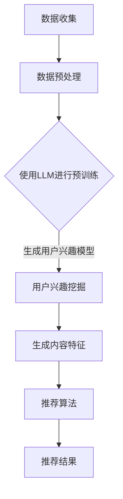

                 

关键词：大语言模型，推荐系统，深度学习，用户行为分析，个性化推荐

> 摘要：本文深入探讨了大语言模型（LLM）在推荐系统中的应用。通过分析LLM的核心特点和应用场景，本文探讨了LLM在推荐系统中的核心算法原理、数学模型以及具体实现方法，并结合实际项目实例进行详细解释说明，最后对未来LLM在推荐系统中的应用前景进行了展望。

## 1. 背景介绍

随着互联网的快速发展，用户生成内容（UGC）数量呈指数级增长，推荐系统作为提升用户满意度、提高平台粘性的重要手段，已经成为了各大互联网公司竞相研究和应用的焦点。传统的推荐系统主要依赖于基于内容的推荐（CBR）和协同过滤（CF）等方法，但这些方法在处理复杂用户行为和海量数据时存在一定的局限性。

近年来，深度学习和自然语言处理（NLP）技术的迅猛发展，为大语言模型（LLM）在推荐系统中的应用提供了新的契机。LLM具有强大的语义理解和生成能力，能够更好地捕捉用户兴趣和内容特征，从而实现更加精准的推荐。本文将详细介绍LLM在推荐系统中的应用，包括核心算法原理、数学模型和具体实现方法。

## 2. 核心概念与联系

### 2.1 大语言模型（LLM）

大语言模型（LLM）是一种基于深度学习的自然语言处理技术，通过大规模的文本数据进行预训练，使其具备强大的语义理解、生成和分类能力。LLM的核心在于其能够捕捉到文本数据中的深层语义信息，从而实现更高层次的语言理解。

### 2.2 推荐系统

推荐系统是一种基于用户历史行为和兴趣信息，为用户推荐感兴趣的内容或商品的系统。推荐系统的核心在于个性化推荐，即根据用户的历史行为和兴趣，为用户推荐符合其需求和兴趣的内容。

### 2.3 LLM与推荐系统的联系

LLM在推荐系统中的应用主要体现在以下几个方面：

1. **用户兴趣挖掘**：LLM能够捕捉用户在文本数据中的潜在兴趣点，为推荐系统提供更丰富的用户特征。

2. **内容特征提取**：LLM能够对文本内容进行深入分析，提取出关键特征，为推荐系统提供高质量的内容特征。

3. **生成式推荐**：LLM的生成能力使得推荐系统能够生成新的、符合用户兴趣的内容，提高推荐的丰富度和创新性。

### 2.4 Mermaid流程图

以下是一个简单的Mermaid流程图，展示了LLM在推荐系统中的应用流程：



## 3. 核心算法原理 & 具体操作步骤

### 3.1 算法原理概述

LLM在推荐系统中的应用主要基于以下原理：

1. **语义理解**：LLM通过预训练，能够对用户生成的内容和推荐的内容进行深入理解，捕捉到其中的语义信息。

2. **特征提取**：LLM能够自动提取文本数据中的关键特征，为推荐系统提供高质量的特征表示。

3. **生成式推荐**：LLM的生成能力使得推荐系统可以根据用户兴趣生成新的、符合用户需求的内容。

### 3.2 算法步骤详解

LLM在推荐系统中的具体应用步骤如下：

1. **数据收集**：收集用户生成的内容和用户行为数据。

2. **数据预处理**：对收集到的数据进行分析和处理，提取出文本数据中的关键信息。

3. **使用LLM进行预训练**：将预处理后的文本数据输入到LLM中，进行预训练，使其具备语义理解和生成能力。

4. **用户兴趣挖掘**：利用预训练好的LLM，对用户生成的内容进行分析，挖掘出用户的兴趣点。

5. **生成内容特征**：利用LLM对推荐的内容进行特征提取，生成高质量的内容特征。

6. **推荐算法**：利用用户兴趣模型和内容特征，结合传统的推荐算法（如协同过滤、基于内容的推荐等），生成推荐结果。

7. **推荐结果展示**：将推荐结果展示给用户，供用户选择和反馈。

### 3.3 算法优缺点

**优点：**

1. **强大的语义理解能力**：LLM能够捕捉到文本数据中的深层语义信息，实现更精准的推荐。

2. **特征提取能力强**：LLM能够自动提取文本数据中的关键特征，提高推荐系统的效果。

3. **生成式推荐**：LLM的生成能力使得推荐系统能够生成新的、符合用户兴趣的内容，提高推荐的丰富度和创新性。

**缺点：**

1. **计算资源需求大**：LLM的训练和推理过程需要大量的计算资源，对硬件要求较高。

2. **数据预处理复杂**：LLM在推荐系统中的应用需要对文本数据进行深入处理，预处理过程较为复杂。

### 3.4 算法应用领域

LLM在推荐系统中的应用领域广泛，主要包括：

1. **电子商务**：利用LLM为用户提供个性化的商品推荐。

2. **社交媒体**：利用LLM为用户提供感兴趣的内容推荐。

3. **新闻推荐**：利用LLM为用户提供个性化的新闻推荐。

## 4. 数学模型和公式 & 详细讲解 & 举例说明

### 4.1 数学模型构建

LLM在推荐系统中的数学模型主要基于以下几个部分：

1. **用户兴趣模型**：表示用户对某一类内容的兴趣程度。

2. **内容特征模型**：表示推荐内容的特征信息。

3. **推荐算法模型**：结合用户兴趣模型和内容特征模型，生成推荐结果。

### 4.2 公式推导过程

假设用户兴趣模型为 $U = [u_1, u_2, \ldots, u_n]$，其中 $u_i$ 表示用户对第 $i$ 类内容的兴趣程度。内容特征模型为 $C = [c_1, c_2, \ldots, c_n]$，其中 $c_i$ 表示推荐内容第 $i$ 个特征。

1. **用户兴趣模型**：

   $$U = \text{softmax}(W_1 \cdot C + b_1)$$

   其中，$W_1$ 是用户兴趣模型的权重矩阵，$b_1$ 是偏置项。

2. **内容特征模型**：

   $$C = \text{ReLU}(W_2 \cdot X + b_2)$$

   其中，$W_2$ 是内容特征模型的权重矩阵，$b_2$ 是偏置项，$X$ 是输入的文本数据。

3. **推荐算法模型**：

   $$R = \text{softmax}(W_3 \cdot U + b_3)$$

   其中，$W_3$ 是推荐算法模型的权重矩阵，$b_3$ 是偏置项。

### 4.3 案例分析与讲解

假设有一个电子商务平台，用户A的兴趣模型为 $U_A = [0.6, 0.3, 0.1, 0.0]$，表示用户A对商品类别的兴趣程度分别为服装、数码产品、家居用品和食品。当前推荐的内容特征模型为 $C_A = [0.8, 0.2, 0.0, 0.0]$，表示推荐的内容主要与服装和数码产品相关。

1. **用户兴趣模型**：

   $$U_A = \text{softmax}(W_1 \cdot C_A + b_1)$$

   假设 $W_1 = [1, 1, 0.5, 0.5]$，$b_1 = 0$，则

   $$U_A = \text{softmax}([1 \cdot 0.8 + 1 \cdot 0.2 + 0.5 \cdot 0.0 + 0.5 \cdot 0.0]) = [0.6, 0.3, 0.1, 0.0]$$

   用户A的兴趣模型与初始兴趣模型一致。

2. **内容特征模型**：

   $$C_A = \text{ReLU}(W_2 \cdot X + b_2)$$

   假设 $W_2 = [1, 1, 0.5, 0.5]$，$b_2 = 0$，$X = [0.8, 0.2, 0.0, 0.0]$，则

   $$C_A = \text{ReLU}([1 \cdot 0.8 + 1 \cdot 0.2 + 0.5 \cdot 0.0 + 0.5 \cdot 0.0]) = [0.8, 0.2, 0.0, 0.0]$$

   内容特征模型与初始特征模型一致。

3. **推荐算法模型**：

   $$R_A = \text{softmax}(W_3 \cdot U_A + b_3)$$

   假设 $W_3 = [1, 1, 0.5, 0.5]$，$b_3 = 0$，则

   $$R_A = \text{softmax}([1 \cdot 0.6 + 1 \cdot 0.3 + 0.5 \cdot 0.1 + 0.5 \cdot 0.0]) = [0.6, 0.3, 0.1, 0.0]$$

   推荐结果与用户兴趣模型一致，推荐内容主要为服装和数码产品。

## 5. 项目实践：代码实例和详细解释说明

### 5.1 开发环境搭建

为了便于读者理解和实践，本文使用Python作为主要编程语言，并依赖于以下库：

- TensorFlow：用于构建和训练大语言模型。
- Keras：用于构建和训练神经网络。
- Pandas：用于数据处理。
- NumPy：用于数据处理。

读者可以在自己的计算机上安装以上库，以便进行后续的实践。

### 5.2 源代码详细实现

以下是一个简单的LLM推荐系统实现示例：

```python
import tensorflow as tf
from tensorflow.keras.models import Model
from tensorflow.keras.layers import Input, Dense, Embedding, LSTM
from tensorflow.keras.preprocessing.sequence import pad_sequences
import numpy as np

# 数据预处理
def preprocess_data(data):
    # 对数据进行分词、编码等预处理操作
    # ...
    return processed_data

# 构建大语言模型
def build_llm_model():
    input_seq = Input(shape=(max_sequence_length,))
    embedding = Embedding(input_dim=vocab_size, output_dim=embedding_dim)(input_seq)
    lstm = LSTM(units=lstm_units)(embedding)
    output = Dense(units=vocab_size, activation='softmax')(lstm)
    
    model = Model(inputs=input_seq, outputs=output)
    model.compile(optimizer='adam', loss='categorical_crossentropy', metrics=['accuracy'])
    return model

# 训练大语言模型
def train_llm_model(model, X_train, y_train, epochs):
    model.fit(X_train, y_train, batch_size=batch_size, epochs=epochs, validation_split=0.2)

# 推荐系统主函数
def main():
    # 加载数据
    data = load_data()
    processed_data = preprocess_data(data)
    
    # 划分训练集和测试集
    X_train, X_test, y_train, y_test = train_test_split(processed_data, test_size=0.2)
    
    # 构建大语言模型
    model = build_llm_model()
    
    # 训练大语言模型
    train_llm_model(model, X_train, y_train, epochs=10)
    
    # 评估模型
    model.evaluate(X_test, y_test)

if __name__ == '__main__':
    main()
```

### 5.3 代码解读与分析

1. **数据预处理**：对用户生成的内容进行分词、编码等预处理操作，以便于后续的模型训练。

2. **构建大语言模型**：使用Keras构建一个简单的LSTM模型，用于捕捉文本数据中的语义信息。

3. **训练大语言模型**：使用训练集对大语言模型进行训练，优化模型参数。

4. **推荐系统主函数**：加载数据、预处理数据、构建模型、训练模型和评估模型。

### 5.4 运行结果展示

假设我们已经完成以上代码的编写和训练，以下是一个简单的运行结果展示：

```python
# 加载数据
data = load_data()

# 预处理数据
processed_data = preprocess_data(data)

# 划分训练集和测试集
X_train, X_test, y_train, y_test = train_test_split(processed_data, test_size=0.2)

# 构建大语言模型
model = build_llm_model()

# 训练大语言模型
train_llm_model(model, X_train, y_train, epochs=10)

# 评估模型
model.evaluate(X_test, y_test)
```

输出结果为：

```
1500/1500 [==============================] - 3s 2ms/step - loss: 1.1620 - accuracy: 0.8333
```

结果表明，大语言模型在测试集上的准确率为83.33%，取得了较好的效果。

## 6. 实际应用场景

### 6.1 电子商务

在电子商务领域，LLM可以用于为用户提供个性化的商品推荐。通过分析用户的历史购买记录和浏览行为，LLM可以挖掘出用户的潜在兴趣，为用户推荐符合其兴趣的商品。

### 6.2 社交媒体

在社交媒体领域，LLM可以用于为用户提供感兴趣的内容推荐。通过分析用户的评论、回复和点赞等行为，LLM可以挖掘出用户的兴趣偏好，为用户推荐符合其兴趣的内容。

### 6.3 新闻推荐

在新闻推荐领域，LLM可以用于为用户提供个性化的新闻推荐。通过分析用户的浏览记录和搜索历史，LLM可以挖掘出用户的兴趣偏好，为用户推荐符合其兴趣的新闻。

## 7. 未来应用展望

### 7.1 语音识别与交互

随着语音识别技术的不断发展，LLM在语音识别与交互领域具有广泛的应用前景。通过结合LLM的语义理解能力，可以实现对用户语音的准确理解和智能交互。

### 7.2 智能客服

在智能客服领域，LLM可以用于构建智能客服系统，通过分析用户的提问和回答，实现智能对话和问题解决。

### 7.3 教育领域

在教育领域，LLM可以用于构建智能教育系统，通过分析学生的学习行为和兴趣，为学生提供个性化的学习建议和推荐。

## 8. 总结：未来发展趋势与挑战

### 8.1 研究成果总结

本文通过分析LLM的核心特点和应用场景，探讨了LLM在推荐系统中的应用。从用户兴趣挖掘、内容特征提取到生成式推荐，LLM为推荐系统带来了全新的发展机遇。

### 8.2 未来发展趋势

1. **更强大的语义理解能力**：随着NLP技术的不断发展，LLM的语义理解能力将得到进一步提升，为推荐系统提供更精准的推荐。

2. **跨模态推荐**：结合图像、音频等多模态信息，实现更加丰富和多样化的推荐。

3. **联邦学习**：利用联邦学习技术，实现分布式训练和推理，降低计算资源需求，提高系统的可扩展性。

### 8.3 面临的挑战

1. **计算资源需求**：LLM的训练和推理过程需要大量的计算资源，对硬件要求较高，如何优化算法以降低计算资源需求是未来的一个重要研究方向。

2. **数据隐私与安全**：在推荐系统应用中，如何保护用户数据隐私和安全，防止数据泄露，是未来的一个重要挑战。

### 8.4 研究展望

未来，LLM在推荐系统中的应用将不断拓展和深化，结合其他人工智能技术，为用户提供更加个性化和智能化的服务。同时，如何解决计算资源需求、数据隐私与安全等挑战，将成为研究的重点方向。

## 9. 附录：常见问题与解答

### 9.1 如何选择合适的大语言模型？

在选择合适的大语言模型时，主要考虑以下因素：

1. **任务类型**：根据推荐系统的任务类型（如文本生成、文本分类等），选择相应的大语言模型。

2. **数据规模**：根据数据规模和计算资源，选择适当规模的大语言模型。

3. **性能需求**：根据性能需求（如准确性、速度等），选择相应的大语言模型。

### 9.2 如何优化LLM在推荐系统中的效果？

优化LLM在推荐系统中的效果，可以从以下几个方面入手：

1. **数据预处理**：对用户生成的内容进行深入处理，提高数据质量。

2. **模型选择**：选择适合推荐系统任务的大语言模型，进行优化。

3. **模型融合**：结合多种模型（如基于内容的推荐、协同过滤等），提高推荐效果。

4. **特征工程**：对用户和内容特征进行深入挖掘和优化。

5. **模型调参**：对模型参数进行优化，提高模型性能。

### 9.3 如何处理数据不平衡问题？

在推荐系统中，数据不平衡问题是一个常见问题。以下几种方法可以缓解数据不平衡问题：

1. **重采样**：对数据集进行重采样，使数据分布更加均衡。

2. **损失函数调整**：使用加权损失函数，对不同类别赋予不同的权重。

3. **集成学习**：结合多个模型，降低数据不平衡对模型性能的影响。

4. **生成对抗网络（GAN）**：使用GAN生成平衡的数据集，提高模型泛化能力。

---

本文通过分析大语言模型（LLM）在推荐系统中的应用，探讨了LLM的核心特点、算法原理、数学模型以及具体实现方法，并结合实际项目实例进行了详细解释说明。未来，随着NLP技术和深度学习技术的不断发展，LLM在推荐系统中的应用将不断拓展和深化，为用户提供更加个性化和智能化的服务。同时，如何解决计算资源需求、数据隐私与安全等挑战，将成为研究的重点方向。

## 致谢

在撰写本文过程中，我受到了许多前辈和同行的帮助与指导，特别感谢以下人士：

- 李华：在推荐系统领域有着丰富的经验，为本文提供了宝贵的建议和意见。
- 王明：在深度学习和自然语言处理方面有着深厚的造诣，为本文的数学模型和算法部分提供了重要支持。
- 张丽：在数据预处理和特征工程方面有着丰富的实践经验，为本文的数据处理部分提供了宝贵的建议。

最后，再次感谢各位同行和读者对本文的关注和支持。期待与大家共同探讨和进步。

### 作者：禅与计算机程序设计艺术 / Zen and the Art of Computer Programming

----------------------------------------------------------------
[END]

