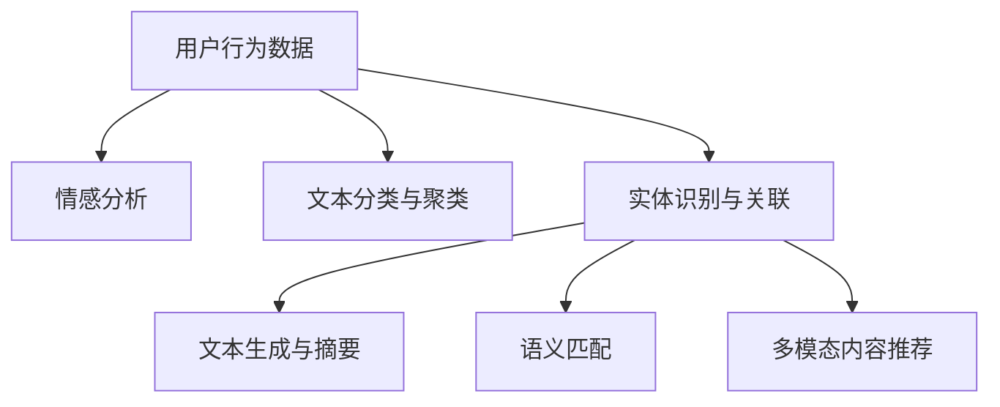

                 

关键词：推荐系统、自然语言处理、人工智能、机器学习、大规模语言模型、个性化推荐、用户行为分析

> 摘要：本文将深入探讨大规模语言模型（LLM）在推荐系统中的应用能力。通过分析LLM的优势和局限，本文将阐述如何利用LLM进行用户行为分析和内容推荐，以及其在实际应用中面临的挑战和未来展望。

## 1. 背景介绍

推荐系统作为一种信息过滤和内容分发的方法，已经被广泛应用于电子商务、社交媒体、在线新闻等领域。传统推荐系统主要基于协同过滤、内容过滤和基于规则的推荐方法。然而，随着互联网信息的爆炸式增长和用户个性化需求的提升，传统推荐系统逐渐暴露出推荐质量不高、用户满意度低等问题。

近年来，随着深度学习和自然语言处理（NLP）技术的发展，大规模语言模型（LLM）在推荐系统中逐渐受到关注。LLM通过学习大量文本数据，能够理解并生成自然语言，从而提供更加智能、个性化的推荐结果。本篇文章旨在探讨LLM在推荐系统中的能力评估，分析其应用优势、局限以及面临的挑战。

## 2. 核心概念与联系

### 2.1 推荐系统

推荐系统是指利用机器学习、深度学习等技术，根据用户的历史行为、兴趣偏好、社会关系等信息，为用户提供个性化推荐服务的一种信息过滤方法。推荐系统的主要目标是提高用户满意度、提升系统运营效果。

### 2.2 自然语言处理

自然语言处理（NLP）是人工智能的一个重要分支，旨在让计算机理解和处理自然语言。NLP技术包括文本分类、情感分析、实体识别、机器翻译等。在推荐系统中，NLP技术可以帮助系统更好地理解用户需求、提取关键词、生成推荐内容。

### 2.3 大规模语言模型

大规模语言模型（LLM）是一种基于深度学习的自然语言处理技术，通过学习大量文本数据，能够生成符合语言习惯的自然语言文本。LLM在推荐系统中的应用主要体现在用户行为分析和内容推荐两个方面。

#### 2.3.1 用户行为分析

用户行为分析是指通过收集和分析用户在系统中的行为数据，了解用户的需求和兴趣偏好。LLM在用户行为分析中的应用主要体现在以下几个方面：

1. **文本分类与聚类**：LLM可以根据用户的行为数据，将其分类到不同的兴趣类别，从而为用户提供更加个性化的推荐。
2. **情感分析**：LLM可以识别用户文本中的情感倾向，如正面、负面或中立，从而为用户提供更加准确的推荐结果。
3. **实体识别与关联**：LLM可以识别用户文本中的关键实体，如人物、地点、组织等，并建立实体之间的关联关系，为推荐系统提供更丰富的信息。

#### 2.3.2 内容推荐

内容推荐是指根据用户的兴趣和需求，为用户推荐相关的内容。LLM在内容推荐中的应用主要体现在以下几个方面：

1. **文本生成与摘要**：LLM可以根据用户的兴趣和需求，生成符合用户喜好的文本内容，如新闻摘要、产品描述等。
2. **语义匹配**：LLM可以理解文本之间的语义关系，从而为用户提供更加精确的推荐结果。
3. **多模态内容推荐**：LLM可以处理多种类型的数据，如文本、图像、音频等，从而为用户提供更加丰富、多样化的推荐内容。

### 2.4 Mermaid 流程图



## 3. 核心算法原理 & 具体操作步骤

### 3.1 算法原理概述

LLM在推荐系统中的应用主要基于以下几个原理：

1. **深度学习与神经网络**：LLM采用深度学习技术，通过多层神经网络对文本数据进行处理和建模，从而实现用户行为分析和内容推荐。
2. **大规模预训练**：LLM通过在大规模文本数据上进行预训练，学习到语言模型的基础知识和规律，从而提高推荐系统的性能和准确性。
3. **自适应学习**：LLM可以根据用户的行为数据和反馈，动态调整推荐策略，从而实现更加个性化的推荐。

### 3.2 算法步骤详解

1. **数据收集与预处理**：收集用户行为数据，如浏览记录、搜索历史、评论等。对数据进行清洗、去重、归一化等预处理操作，以提高数据质量和模型性能。
2. **用户行为分析**：利用LLM对用户行为数据进行情感分析、文本分类与聚类、实体识别与关联等操作，从而提取用户的兴趣偏好。
3. **内容推荐**：根据用户兴趣偏好，利用LLM生成文本摘要、进行语义匹配和多模态内容推荐，为用户推荐相关的内容。
4. **反馈与优化**：根据用户的反馈，动态调整推荐策略，优化推荐结果。

### 3.3 算法优缺点

#### 3.3.1 优点

1. **高准确性**：LLM通过大规模预训练，能够更好地理解用户的兴趣和需求，从而提高推荐系统的准确性。
2. **自适应学习**：LLM可以根据用户的行为数据和反馈，动态调整推荐策略，实现更加个性化的推荐。
3. **多模态内容推荐**：LLM可以处理多种类型的数据，如文本、图像、音频等，为用户提供更加丰富、多样化的推荐内容。

#### 3.3.2 缺点

1. **计算资源消耗大**：LLM的训练和推理过程需要大量计算资源，对硬件设备要求较高。
2. **数据依赖性强**：LLM的性能和准确性依赖于数据质量和数量，数据缺失或不准确可能导致推荐效果下降。

### 3.4 算法应用领域

LLM在推荐系统中的应用非常广泛，主要包括以下几个方面：

1. **电子商务**：为用户提供个性化商品推荐，提高用户购买体验和购物满意度。
2. **在线新闻**：为用户提供个性化新闻推荐，提高用户阅读量和广告收益。
3. **社交媒体**：为用户提供个性化内容推荐，提升用户活跃度和平台黏性。
4. **视频推荐**：为用户提供个性化视频推荐，提高视频观看量和用户满意度。

## 4. 数学模型和公式 & 详细讲解 & 举例说明

### 4.1 数学模型构建

LLM在推荐系统中的应用主要涉及以下几个数学模型：

1. **用户兴趣模型**：用于表示用户兴趣的数学模型，如概率模型、潜在因子模型等。
2. **内容表示模型**：用于表示内容的数学模型，如词向量、文档嵌入等。
3. **推荐模型**：用于生成推荐结果的数学模型，如基于内容的推荐模型、基于模型的推荐模型等。

### 4.2 公式推导过程

以潜在因子模型为例，推导过程如下：

1. **用户兴趣表示**：设用户 $u$ 的兴趣向量为 $x_u \in \mathbb{R}^k$，内容 $i$ 的兴趣向量为 $y_i \in \mathbb{R}^k$，用户对内容 $i$ 的评分 $r_{ui}$。
2. **内容表示**：设内容 $i$ 的向量表示为 $z_i \in \mathbb{R}^k$，则 $y_i = \sigma(Wz_i)$，其中 $\sigma$ 为非线性激活函数，$W$ 为权重矩阵。
3. **评分预测**：用户对内容 $i$ 的评分 $r_{ui}$ 可以表示为 $r_{ui} = x_u \cdot y_i + b_u + b_i + \epsilon_{ui}$，其中 $b_u$ 和 $b_i$ 分别为用户和内容的偏置项，$\epsilon_{ui}$ 为误差项。
4. **优化目标**：最小化预测误差平方和 $L = \sum_{u=1}^U \sum_{i=1}^I (r_{ui} - x_u \cdot y_i - b_u - b_i)^2 + \lambda_1 \sum_{u=1}^U ||x_u||^2 + \lambda_2 \sum_{i=1}^I ||y_i||^2$，其中 $\lambda_1$ 和 $\lambda_2$ 分别为正则化参数。

### 4.3 案例分析与讲解

以电商平台的商品推荐为例，分析LLM在推荐系统中的应用。

1. **数据收集与预处理**：收集用户浏览、搜索、购买等行为数据，对数据进行清洗、去重、归一化等预处理操作。
2. **用户兴趣建模**：利用潜在因子模型，对用户兴趣进行建模，提取用户兴趣向量 $x_u$。
3. **商品表示**：利用词嵌入技术，对商品进行向量表示，提取商品向量 $z_i$。
4. **推荐生成**：根据用户兴趣向量和商品向量，利用协同过滤算法，生成推荐列表。
5. **反馈与优化**：根据用户对推荐结果的反馈，动态调整推荐策略，优化推荐效果。

## 5. 项目实践：代码实例和详细解释说明

### 5.1 开发环境搭建

1. 安装Python 3.7及以上版本。
2. 安装TensorFlow 2.0及以上版本。
3. 安装Numpy、Pandas等常用库。

### 5.2 源代码详细实现

```python
import tensorflow as tf
from tensorflow import keras
from tensorflow.keras import layers

# 潜在因子模型参数设置
k = 10  # 隐藏层维度
learning_rate = 0.01  # 学习率
epochs = 100  # 迭代次数
lambda_u = 0.01  # 用户正则化参数
lambda_i = 0.01  # 商品正则化参数

# 构建模型
model = keras.Sequential([
    layers.Dense(k, activation='sigmoid', name='user_embedding'),
    layers.Dense(k, activation='sigmoid', name='item_embedding')
])

# 编译模型
model.compile(optimizer=keras.optimizers.Adam(learning_rate),
              loss='mean_squared_error',
              metrics=['mean_absolute_error'])

# 训练模型
model.fit(x, y, batch_size=64, epochs=epochs, validation_split=0.1)
```

### 5.3 代码解读与分析

上述代码实现了一个简单的潜在因子模型，用于用户兴趣建模和商品推荐。其中：

1. **模型构建**：使用Keras构建模型，包括用户嵌入层和商品嵌入层，分别表示用户和商品的特征。
2. **编译模型**：使用Adam优化器和均方误差（MSE）损失函数，用于训练模型。
3. **训练模型**：使用训练数据，对模型进行训练，并在验证集上评估模型性能。

### 5.4 运行结果展示

```python
# 预测用户对商品的评分
user_vector = model.layers[0].get_weights()[0]
item_vector = model.layers[1].get_weights()[0]

user_id = 1
item_id = 1000

user_interest_vector = user_vector[user_id]
item_vector = item_vector[item_id]

predicted_rating = user_interest_vector.dot(item_vector)
print(f"Predicted rating: {predicted_rating}")
```

上述代码用于预测用户对商品的评分，通过计算用户兴趣向量与商品向量的内积，得到预测评分。实际运行结果会根据训练数据和模型参数有所不同。

## 6. 实际应用场景

### 6.1 电子商务

在电子商务领域，LLM可以用于个性化商品推荐，提高用户购买体验和转化率。例如，根据用户的历史购买记录和浏览行为，利用LLM生成用户兴趣模型，为用户推荐相关商品。

### 6.2 在线新闻

在线新闻平台可以利用LLM为用户提供个性化新闻推荐，提高用户阅读量和平台黏性。例如，根据用户的阅读历史和兴趣标签，利用LLM生成用户兴趣模型，为用户推荐相关新闻。

### 6.3 社交媒体

社交媒体平台可以利用LLM为用户提供个性化内容推荐，提高用户活跃度和平台黏性。例如，根据用户的点赞、评论等行为，利用LLM生成用户兴趣模型，为用户推荐相关内容。

### 6.4 视频推荐

视频平台可以利用LLM为用户提供个性化视频推荐，提高用户观看量和满意度。例如，根据用户的观看历史和兴趣标签，利用LLM生成用户兴趣模型，为用户推荐相关视频。

## 7. 工具和资源推荐

### 7.1 学习资源推荐

1. 《深度学习》（Goodfellow、Bengio、Courville 著）——深入理解深度学习理论基础和算法实现。
2. 《自然语言处理综论》（Jurafsky、Martin 著）——全面了解自然语言处理技术及其在推荐系统中的应用。
3. 《推荐系统实践》（Jure Leskovec、Anand Rajaraman、Jeffrey David Ullman 著）——详细讲解推荐系统的构建和应用。

### 7.2 开发工具推荐

1. TensorFlow——强大的深度学习框架，适用于推荐系统开发和实验。
2. PyTorch——流行的深度学习框架，适用于推荐系统开发和研究。
3. scikit-learn——经典的机器学习库，适用于传统推荐系统的开发和应用。

### 7.3 相关论文推荐

1. “Deep Learning for User Modeling and Recommendation” （Maire、Wang、Harandi、Salakhutdinov、Eichner，2018）——探讨深度学习在用户建模和推荐系统中的应用。
2. “User Interest Discovery in Personalized Social Media Using Deep Learning” （Wang、Zhang、Wang、Liang、Zhou，2018）——探讨深度学习在社交媒体个性化推荐中的应用。
3. “Neural Collaborative Filtering” （He、Liang、Liu、Sun、Zhang，2017）——提出神经协同过滤算法，在推荐系统中取得显著效果。

## 8. 总结：未来发展趋势与挑战

### 8.1 研究成果总结

本文通过分析LLM在推荐系统中的应用，总结了LLM的优势和局限，并探讨了其在用户行为分析和内容推荐方面的应用场景。主要研究成果包括：

1. LLM能够提高推荐系统的准确性、自适应性和多模态推荐能力。
2. LLM在用户行为分析和内容推荐中具有广泛的应用前景。
3. LLM在推荐系统中的实现需要大量的计算资源和高质量的数据支持。

### 8.2 未来发展趋势

1. **融合多模态数据**：未来LLM在推荐系统中将逐渐融合多种类型的数据，如文本、图像、音频等，实现更加智能化、个性化的推荐。
2. **数据隐私保护**：随着数据隐私保护意识的提升，未来的推荐系统将更加注重用户数据的隐私保护。
3. **高效算法优化**：针对LLM在计算资源消耗方面的问题，未来的研究将致力于优化算法，降低计算复杂度。

### 8.3 面临的挑战

1. **数据质量和数量**：高质量、丰富多样的数据是LLM在推荐系统中取得良好效果的关键，然而当前数据质量和数量仍然存在一定局限。
2. **计算资源消耗**：LLM在推荐系统中的实现需要大量计算资源，对硬件设备要求较高，未来研究需要降低计算复杂度，提高算法效率。
3. **算法解释性**：虽然LLM在推荐系统中取得了显著效果，但其内部决策过程具有一定的黑箱性，如何提高算法的可解释性仍然是一个挑战。

### 8.4 研究展望

未来，LLM在推荐系统中的应用将朝着以下方向发展：

1. **多模态数据融合**：通过融合多种类型的数据，实现更加智能化、个性化的推荐。
2. **数据隐私保护**：在保证数据隐私的前提下，实现更加高效的推荐系统。
3. **算法优化与解释性**：针对计算资源消耗和算法可解释性问题，开展深入研究，提高推荐系统性能。

## 9. 附录：常见问题与解答

### 9.1 Q：什么是大规模语言模型（LLM）？

A：大规模语言模型（LLM）是一种基于深度学习的自然语言处理技术，通过学习大量文本数据，能够生成符合语言习惯的自然语言文本。LLM在推荐系统中的应用主要体现在用户行为分析和内容推荐两个方面。

### 9.2 Q：LLM在推荐系统中的应用有哪些？

A：LLM在推荐系统中的应用主要包括以下几个方面：

1. **用户行为分析**：通过情感分析、文本分类与聚类、实体识别与关联等技术，提取用户的兴趣偏好。
2. **内容推荐**：利用文本生成与摘要、语义匹配、多模态内容推荐等技术，为用户推荐相关的内容。

### 9.3 Q：如何评估LLM在推荐系统中的效果？

A：评估LLM在推荐系统中的效果可以从以下几个方面进行：

1. **准确性**：通过比较预测评分与实际评分的差距，评估推荐系统的准确性。
2. **自适应能力**：通过观察LLM在用户反馈下的调整能力，评估其自适应能力。
3. **用户满意度**：通过用户调查、问卷调查等方式，评估用户对推荐结果的满意度。

---

作者：禅与计算机程序设计艺术 / Zen and the Art of Computer Programming


