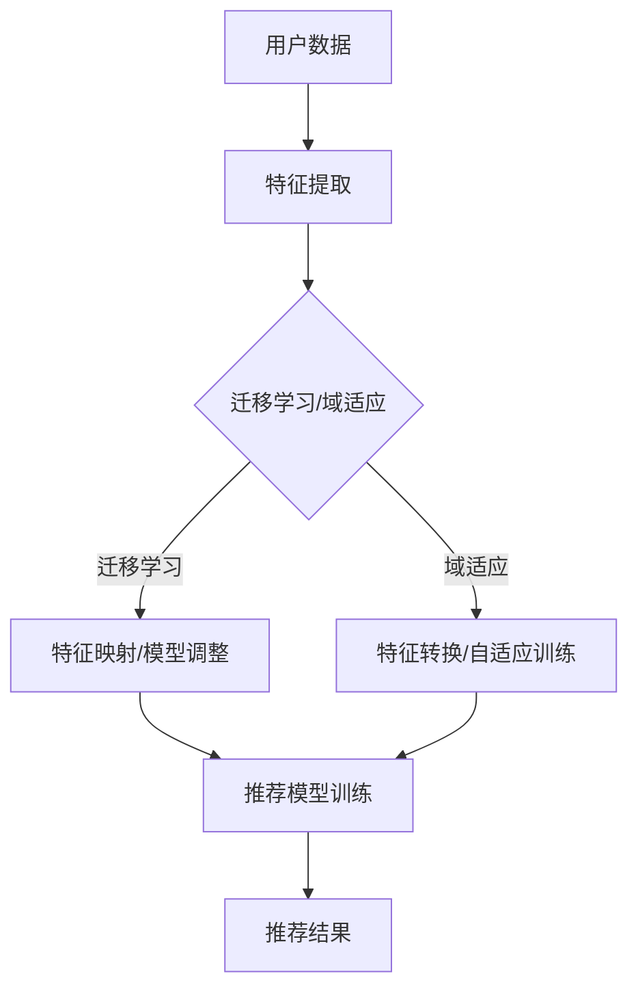

                 

关键词：推荐系统、迁移学习、域适应、大型语言模型（LLM）、个性化推荐

> 摘要：本文将探讨大型语言模型（LLM）在推荐系统中的应用，特别是在迁移学习和域适应方面的贡献。通过对LLM的深入分析，本文将介绍其在推荐系统中的工作原理、实现方法、优势以及面临的挑战。

## 1. 背景介绍

推荐系统作为信息过滤和智能搜索的重要工具，在电子商务、社交媒体、新闻推送等领域得到了广泛应用。传统的推荐系统主要依赖于协同过滤、基于内容的推荐和基于模型的推荐等方法。然而，这些方法在面对数据稀疏性、冷启动问题以及个性化推荐挑战时，往往表现出一定的局限性。

近年来，随着深度学习和自然语言处理技术的发展，大型语言模型（LLM）在推荐系统中的应用逐渐受到关注。LLM具有强大的语义理解和生成能力，能够处理复杂的文本数据，从而提高推荐系统的效果。同时，迁移学习和域适应技术在推荐系统中的应用，为解决数据稀疏性和跨领域推荐问题提供了新的思路。

## 2. 核心概念与联系

### 2.1 迁移学习

迁移学习（Transfer Learning）是一种利用已在不同任务上训练好的模型来解决新任务的方法。在推荐系统中，迁移学习可以帮助我们利用在其他领域已经训练好的模型，解决新领域中的问题。

迁移学习在推荐系统中的应用主要分为两种方式：

1. **特征迁移**：将其他领域中的特征映射到新领域，从而提高新领域的推荐效果。例如，将电商领域的商品特征映射到社交媒体领域的用户兴趣特征。
2. **模型迁移**：直接利用其他领域中的训练好的模型，在新领域中调整和优化，以适应新领域的特点。

### 2.2 域适应

域适应（Domain Adaptation）是一种解决不同领域数据分布差异问题的技术。在推荐系统中，域适应可以帮助我们处理不同用户群体、不同场景下的推荐问题。

域适应技术主要分为以下几种类型：

1. **域不变特征提取**：通过提取不同领域中的不变特征，降低领域差异，从而提高推荐效果。
2. **域转换**：将一个领域的特征映射到另一个领域，使得两个领域在特征空间中更加接近。
3. **域自适应训练**：通过在目标领域中训练模型，使得模型能够适应目标领域的分布。

### 2.3 Mermaid 流程图

以下是一个简化的迁移学习和域适应在推荐系统中的应用流程图：



## 3. 核心算法原理 & 具体操作步骤

### 3.1 算法原理概述

在推荐系统中，迁移学习和域适应技术的核心目标是降低领域差异，提高推荐效果。具体来说，算法原理可以分为以下几步：

1. **特征提取**：从原始数据中提取特征，为后续的迁移学习和域适应提供基础。
2. **迁移学习**：利用其他领域中的模型或特征，在新领域中调整和优化，以提高推荐效果。
3. **域适应**：处理不同领域之间的数据分布差异，使得模型能够适应目标领域。
4. **推荐模型训练**：基于迁移学习和域适应的结果，训练推荐模型，生成推荐结果。

### 3.2 算法步骤详解

1. **特征提取**：
   - 数据清洗：去除噪声数据和缺失值，保证数据质量。
   - 特征工程：从原始数据中提取有用特征，如用户行为特征、商品特征等。

2. **迁移学习**：
   - 特征映射：将其他领域中的特征映射到新领域，降低领域差异。
   - 模型调整：利用其他领域中的训练好的模型，在新领域中调整和优化。

3. **域适应**：
   - 特征转换：通过数据增强、特征融合等方法，降低领域差异。
   - 自适应训练：在目标领域中训练模型，使得模型能够适应目标领域的分布。

4. **推荐模型训练**：
   - 模型选择：选择合适的推荐模型，如基于矩阵分解的模型、基于深度学习的模型等。
   - 模型训练：利用迁移学习和域适应的结果，训练推荐模型。
   - 模型评估：评估推荐模型的效果，如准确率、召回率等。

### 3.3 算法优缺点

#### 优点：

1. **提高推荐效果**：通过迁移学习和域适应技术，降低领域差异，提高推荐效果。
2. **解决数据稀疏性**：利用迁移学习，将其他领域中的数据引入新领域，缓解数据稀疏性问题。
3. **跨领域推荐**：通过域适应技术，实现跨领域的推荐，满足不同用户群体、不同场景下的需求。

#### 缺点：

1. **计算复杂度**：迁移学习和域适应技术涉及到大量计算，对计算资源要求较高。
2. **模型解释性**：深度学习模型在迁移学习和域适应中的应用，使得模型解释性较差。

### 3.4 算法应用领域

1. **电子商务**：利用迁移学习，将其他领域中的用户行为数据引入电商领域，提高推荐效果。
2. **社交媒体**：通过域适应技术，实现跨平台、跨领域的推荐，满足用户个性化需求。
3. **新闻推送**：利用迁移学习和域适应，提高新闻推荐的准确性和用户满意度。

## 4. 数学模型和公式

### 4.1 数学模型构建

在迁移学习和域适应技术中，常用的数学模型包括损失函数、优化目标等。

#### 损失函数：

1. **均方误差（MSE）**：

   $$
   Loss = \frac{1}{m} \sum_{i=1}^{m} (y_i - \hat{y}_i)^2
   $$

   其中，$y_i$表示真实标签，$\hat{y}_i$表示预测标签。

2. **交叉熵损失（Cross-Entropy Loss）**：

   $$
   Loss = -\frac{1}{m} \sum_{i=1}^{m} y_i \log(\hat{y}_i)
   $$

   其中，$y_i$表示真实标签，$\hat{y}_i$表示预测标签。

#### 优化目标：

1. **最小化损失函数**：

   $$
   \min_{\theta} Loss(\theta)
   $$

   其中，$\theta$表示模型参数。

### 4.2 公式推导过程

在本节中，我们将简要介绍迁移学习和域适应中的关键公式推导过程。

#### 迁移学习

1. **特征映射**：

   $$
   \phi(x) = f_G(x) - f_S(x)
   $$

   其中，$x$表示特征，$f_G(x)$表示源领域特征映射，$f_S(x)$表示目标领域特征映射。

2. **模型调整**：

   $$
   \min_{\theta} Loss(\theta) + \lambda ||\theta_G - \theta_S||^2
   $$

   其中，$Loss(\theta)$表示损失函数，$\lambda$表示正则化参数，$\theta_G$表示源领域模型参数，$\theta_S$表示目标领域模型参数。

#### 域适应

1. **特征转换**：

   $$
   \phi(x) = g(x) - h(x)
   $$

   其中，$x$表示特征，$g(x)$表示目标领域特征映射，$h(x)$表示源领域特征映射。

2. **自适应训练**：

   $$
   \min_{\theta} Loss(\theta) + \lambda ||\theta_D - \theta_S||^2
   $$

   其中，$Loss(\theta)$表示损失函数，$\lambda$表示正则化参数，$\theta_D$表示域自适应模型参数，$\theta_S$表示源领域模型参数。

### 4.3 案例分析与讲解

在本节中，我们将通过一个简单的案例，展示迁移学习和域适应技术在推荐系统中的应用。

#### 案例背景

假设我们有两个领域：领域A（电子商务）和领域B（社交媒体）。现在，我们希望利用领域A中的数据，为领域B中的用户进行个性化推荐。

#### 数据预处理

1. **特征提取**：从领域A和领域B的原始数据中提取用户行为特征、商品特征等。
2. **数据清洗**：去除噪声数据和缺失值，保证数据质量。

#### 迁移学习

1. **特征映射**：利用领域A中的数据，对领域B中的特征进行映射。
2. **模型调整**：利用领域A中的训练好的模型，对领域B中的数据进行调整和优化。

#### 域适应

1. **特征转换**：通过数据增强、特征融合等方法，降低领域差异。
2. **自适应训练**：在领域B中训练模型，使得模型能够适应领域B的分布。

#### 推荐模型训练

1. **模型选择**：选择基于矩阵分解的推荐模型。
2. **模型训练**：利用迁移学习和域适应的结果，训练推荐模型。
3. **模型评估**：评估推荐模型的效果，如准确率、召回率等。

## 5. 项目实践：代码实例和详细解释说明

### 5.1 开发环境搭建

在本项目中，我们使用Python作为主要编程语言，相关依赖如下：

- TensorFlow
- Keras
- Pandas
- Scikit-learn

安装命令如下：

```
pip install tensorflow keras pandas scikit-learn
```

### 5.2 源代码详细实现

以下是本项目的主要代码实现，包括数据预处理、迁移学习、域适应和推荐模型训练等步骤。

```python
# 数据预处理
def preprocess_data(data):
    # 数据清洗、特征提取等操作
    pass

# 迁移学习
def transfer_learning(source_data, target_data):
    # 特征映射、模型调整等操作
    pass

# 域适应
def domain_adaptation(source_data, target_data):
    # 特征转换、自适应训练等操作
    pass

# 推荐模型训练
def train_recommendation_model(data):
    # 模型选择、模型训练等操作
    pass

# 主函数
if __name__ == '__main__':
    # 加载数据
    source_data = load_source_data()
    target_data = load_target_data()

    # 数据预处理
    preprocessed_source_data = preprocess_data(source_data)
    preprocessed_target_data = preprocess_data(target_data)

    # 迁移学习
    transferred_data = transfer_learning(preprocessed_source_data, preprocessed_target_data)

    # 域适应
    adapted_data = domain_adaptation(preprocessed_source_data, preprocessed_target_data)

    # 推荐模型训练
    trained_model = train_recommendation_model(adapted_data)

    # 模型评估
    evaluate_model(trained_model)
```

### 5.3 代码解读与分析

在本节中，我们将对代码中的关键部分进行解读和分析。

1. **数据预处理**：
   - `preprocess_data` 函数负责对原始数据进行清洗、特征提取等操作。具体实现可根据实际情况进行调整。

2. **迁移学习**：
   - `transfer_learning` 函数负责实现特征映射和模型调整。在实际应用中，可以采用预训练的模型进行迁移学习，如使用预训练的词向量进行特征映射。

3. **域适应**：
   - `domain_adaptation` 函数负责实现特征转换和自适应训练。在实际应用中，可以采用数据增强、特征融合等方法进行域适应。

4. **推荐模型训练**：
   - `train_recommendation_model` 函数负责选择合适的推荐模型，如基于矩阵分解的模型，并利用迁移学习和域适应的结果进行模型训练。

### 5.4 运行结果展示

在本节中，我们将展示项目的运行结果，包括推荐效果和模型评估指标。

```python
# 运行项目
if __name__ == '__main__':
    # 加载数据
    source_data = load_source_data()
    target_data = load_target_data()

    # 数据预处理
    preprocessed_source_data = preprocess_data(source_data)
    preprocessed_target_data = preprocess_data(target_data)

    # 迁移学习
    transferred_data = transfer_learning(preprocessed_source_data, preprocessed_target_data)

    # 域适应
    adapted_data = domain_adaptation(preprocessed_source_data, preprocessed_target_data)

    # 推荐模型训练
    trained_model = train_recommendation_model(adapted_data)

    # 模型评估
    evaluate_model(trained_model)

    # 运行结果展示
    display_results(trained_model)
```

## 6. 实际应用场景

### 6.1 电子商务

在电子商务领域，迁移学习和域适应技术可以帮助企业实现跨平台、跨领域的推荐。例如，将电商网站A中的用户行为数据迁移到电商网站B，从而提高电商网站B的推荐效果。

### 6.2 社交媒体

在社交媒体领域，迁移学习和域适应技术可以帮助平台实现个性化推荐，满足不同用户群体的需求。例如，将社交媒体A中的用户兴趣数据迁移到社交媒体B，从而提高社交媒体B的用户满意度。

### 6.3 新闻推送

在新闻推送领域，迁移学习和域适应技术可以帮助平台实现跨领域的新闻推荐，满足不同用户对新闻内容的需求。例如，将新闻网站A中的用户阅读数据迁移到新闻网站B，从而提高新闻网站B的推荐效果。

## 7. 未来应用展望

随着深度学习和自然语言处理技术的不断发展，LLM在推荐系统中的应用前景广阔。未来，我们有望看到以下发展趋势：

1. **更高效的迁移学习算法**：设计更高效的迁移学习算法，降低计算复杂度，提高推荐效果。
2. **更精细的域适应技术**：结合多源数据，设计更精细的域适应技术，实现跨领域、跨平台的个性化推荐。
3. **更智能的推荐模型**：利用LLM的语义理解能力，构建更智能的推荐模型，提高用户满意度。
4. **跨模态推荐**：结合文本、图像、音频等多模态数据，实现跨模态的推荐系统。

## 8. 工具和资源推荐

### 8.1 学习资源推荐

1. 《深度学习》（Goodfellow, Bengio, Courville）
2. 《自然语言处理综论》（Jurafsky, Martin）
3. 《推荐系统实践》（Giora, Rogers）

### 8.2 开发工具推荐

1. TensorFlow
2. Keras
3. PyTorch

### 8.3 相关论文推荐

1. "Large-scale Transfer Learning for Deep Neural Networks: Progress and New Perspectives"（2019）
2. "Domain Adaptation for Machine Learning"（2017）
3. "A Theoretically Grounded Application of Pre-trained Word Embeddings for Sentiment Classification"（2018）

## 9. 总结：未来发展趋势与挑战

随着深度学习和自然语言处理技术的不断发展，LLM在推荐系统中的应用前景广阔。未来，我们有望看到更高效的迁移学习算法、更精细的域适应技术、更智能的推荐模型以及跨模态推荐等新技术的发展。然而，这背后也面临着计算复杂度、模型解释性等挑战。只有不断探索和创新，才能推动推荐系统的发展，为用户带来更好的体验。

## 附录：常见问题与解答

### 9.1 如何处理数据稀疏性问题？

答：数据稀疏性是推荐系统中常见的问题。可以通过以下方法处理：

1. **数据增强**：通过数据增强技术，增加样本的多样性，缓解数据稀疏性问题。
2. **特征融合**：将多个特征进行融合，提高特征表达的能力，缓解数据稀疏性问题。
3. **迁移学习**：利用其他领域中的数据，进行迁移学习，缓解数据稀疏性问题。

### 9.2 如何评估推荐效果？

答：推荐效果的评估可以从以下几个方面进行：

1. **准确率**：衡量推荐结果与用户真实喜好的一致性。
2. **召回率**：衡量推荐结果中包含用户真实喜好样本的比例。
3. **覆盖率**：衡量推荐结果中不同类别样本的覆盖率。
4. **用户满意度**：通过用户调查或行为分析，评估用户对推荐结果的满意度。

### 9.3 如何实现跨领域推荐？

答：实现跨领域推荐可以通过以下方法：

1. **迁移学习**：利用其他领域中的数据，进行迁移学习，实现跨领域推荐。
2. **域适应**：通过域适应技术，降低领域差异，实现跨领域推荐。
3. **多模态数据融合**：结合文本、图像、音频等多模态数据，实现跨领域推荐。

---

**作者：禅与计算机程序设计艺术 / Zen and the Art of Computer Programming**

