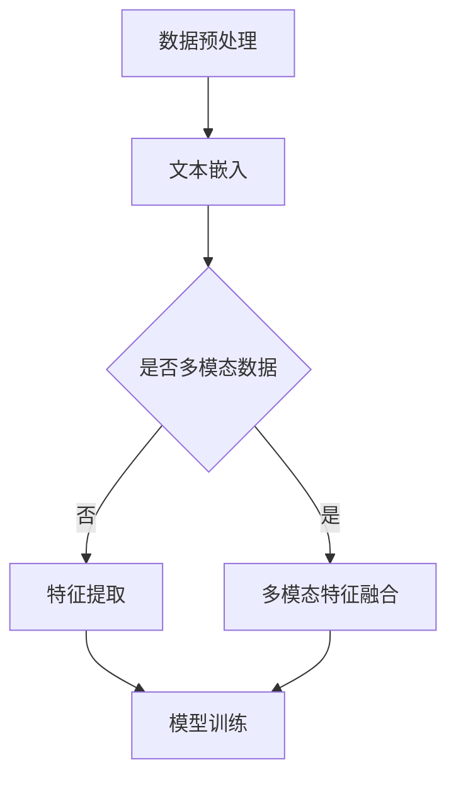
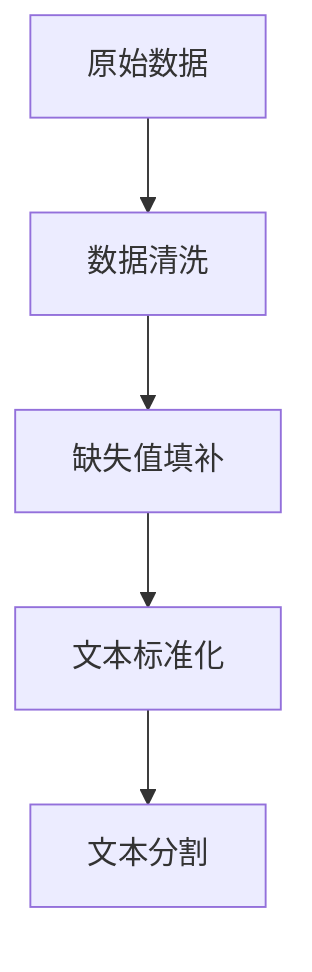
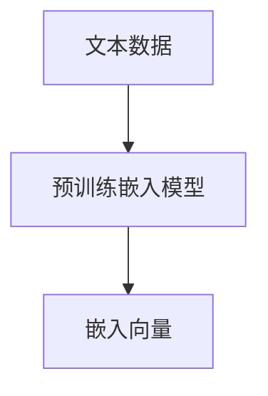
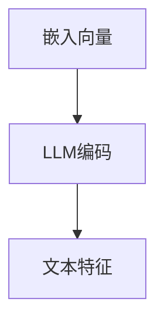
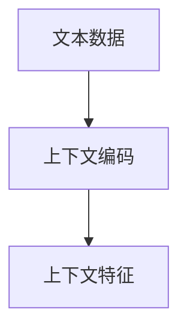
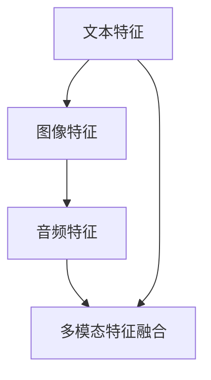
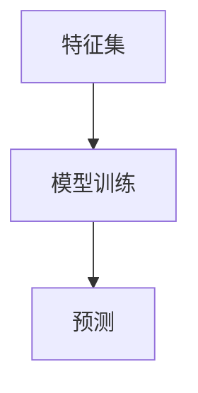

                 

关键词：大型语言模型（LLM）、推荐系统、特征工程、深度学习、自然语言处理、机器学习、用户行为分析

## 摘要

本文旨在探讨大型语言模型（LLM）在推荐系统特征工程中的创新应用。特征工程是推荐系统构建过程中至关重要的一环，直接影响到推荐效果的质量。近年来，随着深度学习和自然语言处理技术的发展，LLM在文本分析和理解方面取得了显著的突破。本文将深入探讨LLM如何通过引入新的特征表示方法，提升推荐系统的性能和用户体验。首先，我们将回顾推荐系统的发展和特征工程的基本概念。接着，我们将介绍LLM的工作原理及其在特征工程中的应用，包括数据预处理、特征提取和模型训练等环节。随后，我们将通过具体的案例分析，展示LLM在推荐系统中的应用效果。最后，我们将讨论LLM在推荐系统中面临的挑战和未来的发展方向。

## 1. 背景介绍

### 推荐系统的发展

推荐系统是一种基于信息过滤和协同过滤的方法，旨在根据用户的兴趣和行为，向他们推荐相关的商品、内容或服务。自从1998年Amazon首次在其网站上引入个性化推荐以来，推荐系统已经成为电子商务、社交媒体、在线视频和其他领域的关键组成部分。

早期推荐系统主要采用基于内容的推荐方法，即通过分析用户对某些内容的兴趣，找到与这些内容相似的其他内容进行推荐。然而，这种方法在应对用户个性化需求方面存在局限性。为了提高推荐系统的准确性，协同过滤方法被提出来。协同过滤方法分为基于用户的协同过滤（User-based Collaborative Filtering）和基于物品的协同过滤（Item-based Collaborative Filtering）。这两种方法通过分析用户之间的相似度和物品之间的相似度来进行推荐。

随着互联网用户数量的急剧增长和大数据技术的发展，推荐系统的构建变得更加复杂。传统的推荐系统在面对海量数据和多样化需求时，往往难以满足用户的个性化需求。为了解决这个问题，深度学习和自然语言处理技术开始被引入推荐系统中。

### 特征工程的重要性

特征工程是推荐系统构建过程中至关重要的一环。特征工程的目标是通过提取和构造有效的特征，将原始数据转换为适合机器学习模型的输入。有效的特征能够提高模型的预测准确性和鲁棒性，从而提升推荐系统的性能。

在传统推荐系统中，特征工程通常包括用户特征、物品特征和上下文特征。用户特征包括用户的基本信息、浏览历史、购买记录等；物品特征包括物品的属性、分类标签、相似度等；上下文特征包括时间、地理位置、设备类型等。

然而，随着推荐系统规模的扩大和数据类型的增加，传统的特征工程方法面临着以下挑战：

1. **维度灾难**：随着特征维度的增加，数据稀疏性和计算复杂度显著上升，导致模型训练和预测变得困难。

2. **特征冗余**：大量的冗余特征不仅会增加计算成本，还可能对模型性能产生负面影响。

3. **特征理解**：传统特征工程依赖于人工经验和数据直觉，难以实现大规模自动化和可解释性。

### 大型语言模型（LLM）的崛起

大型语言模型（LLM），如GPT-3、BERT、T5等，是在深度学习和自然语言处理领域取得的一项重要突破。这些模型具有数十亿甚至千亿级别的参数，能够通过海量文本数据进行预训练，从而实现对自然语言的深度理解和生成。

LLM在文本分析和理解方面的能力，使其在推荐系统的特征工程中具有巨大的潜力。通过引入LLM，我们可以自动化地提取和构造高质量的文本特征，提高推荐系统的准确性和用户体验。

## 2. 核心概念与联系

### 大型语言模型（LLM）的原理

大型语言模型（LLM）基于深度神经网络，通过一系列的变换和层叠结构，实现对自然语言的编码和解码。以下是LLM的核心原理：

1. **输入编码**：LLM将输入的文本序列转换为固定长度的向量表示。这一过程通常通过嵌入层（Embedding Layer）实现，将每个单词映射为一个向量。

2. **预训练**：在训练阶段，LLM通过大规模的文本语料库进行预训练，学习自然语言的内在结构和规律。预训练过程包括自回归语言模型（Autoregressive Language Model）和 masked language model（MLM）等任务。

3. **输出解码**：在生成文本时，LLM通过解码器（Decoder）生成新的文本序列。解码器通常采用序列到序列（Sequence-to-Sequence）模型，将编码后的文本向量转换为新的文本序列。

### 推荐系统特征工程中的LLM应用

在推荐系统特征工程中，LLM的应用主要体现在以下几个方面：

1. **文本特征提取**：通过LLM的预训练模型，可以自动化地提取文本数据中的高质量特征。这些特征可以用于用户行为分析、物品描述理解和用户偏好预测等任务。

2. **上下文感知特征**：LLM能够捕捉文本中的上下文信息，从而生成更加准确的上下文感知特征。这些特征可以用于提高推荐系统的个性化程度和推荐质量。

3. **多模态特征融合**：LLM不仅可以处理文本数据，还可以处理图像、音频等非结构化数据。通过多模态特征融合，可以进一步提高推荐系统的性能和泛化能力。

### Mermaid流程图

以下是一个简单的Mermaid流程图，展示了LLM在推荐系统特征工程中的基本流程：



### LLM与其他特征工程方法的比较

与传统的特征工程方法相比，LLM具有以下几个优势：

1. **自动化**：LLM能够自动化地提取和构造特征，降低了对人工经验和数据直觉的依赖。

2. **高维特征表示**：LLM能够捕捉文本数据中的高维特征，从而提高推荐系统的表示能力和泛化能力。

3. **上下文感知**：LLM能够通过预训练模型捕捉文本中的上下文信息，从而生成更加准确的上下文感知特征。

4. **可解释性**：LLM的内部结构和预训练过程使得其特征表示具有一定的可解释性，有助于理解推荐系统的决策过程。

然而，LLM也存在一些挑战，如计算复杂度高、对数据质量要求较高等。因此，在实际应用中，需要根据具体场景和需求，合理选择和组合特征工程方法。

## 3. 核心算法原理 & 具体操作步骤

### 3.1 算法原理概述

在推荐系统中，特征工程的核心任务是从原始数据中提取和构造有效的特征，以提升模型的预测性能。传统特征工程方法主要包括基于规则的提取、基于统计的提取和基于机器学习的提取。然而，这些方法往往存在特征冗余、计算复杂度高和可解释性差等问题。

大型语言模型（LLM）的出现为推荐系统的特征工程带来了新的可能性。LLM通过预训练和微调，能够自动化地提取文本数据中的高质量特征，并生成上下文感知的表征。以下是LLM在推荐系统特征工程中的具体操作步骤：

1. **数据预处理**：首先对原始数据进行清洗和预处理，包括去除噪声、填补缺失值等。对于文本数据，需要将文本转换为统一的格式，如将文本中的标点符号、停用词去除，并将文本分割为单词或句子。

2. **文本嵌入**：使用预训练的嵌入模型（如Word2Vec、GloVe等），将每个单词或句子映射为一个固定长度的向量表示。这一过程称为文本嵌入。

3. **特征提取**：通过LLM的预训练模型，对文本数据进行编码，提取出高质量的文本特征。这些特征可以包括词嵌入、句嵌入、段落嵌入等。

4. **上下文感知特征**：利用LLM的上下文感知能力，生成更加准确的上下文感知特征。这些特征能够更好地捕捉文本中的语义信息。

5. **多模态特征融合**：对于包含非结构化数据（如图像、音频等）的推荐系统，可以采用多模态特征融合技术，将LLM提取的文本特征与其他模态的特征进行融合。

6. **模型训练**：使用提取的特征进行模型训练，如基于矩阵分解的协同过滤、基于深度学习的序列模型等。通过模型训练，可以进一步提高推荐系统的预测性能。

### 3.2 算法步骤详解

以下是LLM在推荐系统特征工程中的具体操作步骤：

#### 3.2.1 数据预处理



#### 3.2.2 文本嵌入



#### 3.2.3 特征提取



#### 3.2.4 上下文感知特征



#### 3.2.5 多模态特征融合



#### 3.2.6 模型训练



### 3.3 算法优缺点

#### 优点：

1. **自动化特征提取**：LLM能够自动化地提取和构造特征，降低了对人工经验和数据直觉的依赖。
2. **高维特征表示**：LLM能够捕捉文本数据中的高维特征，从而提高推荐系统的表示能力和泛化能力。
3. **上下文感知**：LLM能够通过预训练模型捕捉文本中的上下文信息，从而生成更加准确的上下文感知特征。
4. **可解释性**：LLM的内部结构和预训练过程使得其特征表示具有一定的可解释性，有助于理解推荐系统的决策过程。

#### 缺点：

1. **计算复杂度高**：LLM的预训练过程需要大量的计算资源和时间，对硬件设施有较高要求。
2. **对数据质量要求较高**：LLM的预训练效果依赖于数据的质量和多样性，如果数据存在噪声或缺失，可能导致特征提取效果不佳。
3. **模型解释性有限**：虽然LLM的特征表示具有一定的可解释性，但相比于传统特征工程方法，其解释性仍然有限。

### 3.4 算法应用领域

LLM在推荐系统特征工程中的应用非常广泛，以下是一些典型的应用场景：

1. **电子商务推荐**：通过LLM提取用户行为数据和商品描述中的特征，实现个性化商品推荐。
2. **社交媒体推荐**：利用LLM分析用户生成的内容和交互行为，实现个性化内容推荐。
3. **在线视频推荐**：通过LLM提取视频标题、描述和用户评论中的特征，实现个性化视频推荐。
4. **搜索引擎推荐**：利用LLM对用户查询和网页内容进行编码，实现个性化的搜索结果推荐。

## 4. 数学模型和公式 & 详细讲解 & 举例说明

### 4.1 数学模型构建

在推荐系统中，特征工程的核心任务是提取和构造有效的特征，以提升模型的预测性能。大型语言模型（LLM）在特征工程中的应用，主要通过以下几个数学模型来实现：

1. **词嵌入模型**：词嵌入（Word Embedding）是将单词映射为固定长度的向量表示。常用的词嵌入模型包括Word2Vec和GloVe。

2. **上下文嵌入模型**：上下文嵌入（Contextual Embedding）是在词嵌入的基础上，考虑单词在特定上下文中的含义。常用的上下文嵌入模型包括BERT和GPT。

3. **序列嵌入模型**：序列嵌入（Sequence Embedding）是将整个文本序列映射为一个固定长度的向量表示。常用的序列嵌入模型包括Transformer。

以下是一个简单的数学模型构建示例：

$$
\text{向量} = \text{嵌入矩阵} \times \text{输入序列}
$$

其中，嵌入矩阵是一个固定大小的矩阵，用于将输入序列中的每个单词或子词映射为一个向量。

### 4.2 公式推导过程

以BERT模型为例，我们来推导其上下文嵌入的公式。BERT模型基于Transformer架构，通过自注意力机制（Self-Attention）对输入序列进行编码。

1. **输入序列表示**：假设输入序列为 $x_1, x_2, ..., x_n$，每个单词表示为一个词向量 $v_i$，则输入序列的表示为：

$$
\text{输入序列} = \text{词向量矩阵} \times \text{输入序列}
$$

2. **自注意力机制**：BERT模型通过自注意力机制对输入序列进行编码，生成上下文向量 $\text{context\_vector}$：

$$
\text{context\_vector} = \text{自注意力层}(\text{输入序列})
$$

其中，自注意力层的计算公式为：

$$
\text{自注意力层} = \text{权重矩阵} \times \text{输入序列} + \text{偏置向量}
$$

3. **输出序列表示**：通过自注意力层对输入序列进行编码后，生成每个单词的上下文向量，表示为 $c_i$：

$$
c_i = \text{自注意力层}(\text{输入序列})_i
$$

4. **上下文嵌入**：将每个单词的上下文向量进行聚合，生成整个文本序列的上下文嵌入 $\text{context\_embedding}$：

$$
\text{context\_embedding} = \text{聚合层}(\text{上下文向量})
$$

其中，聚合层的计算公式为：

$$
\text{聚合层} = \text{权重矩阵} \times \text{上下文向量} + \text{偏置向量}
$$

### 4.3 案例分析与讲解

假设我们有一个简单的文本序列：“我非常喜欢这本书”，我们可以使用BERT模型来提取其上下文嵌入。

1. **输入序列表示**：首先，我们将文本序列转换为词向量矩阵，得到输入序列的表示。

$$
\text{输入序列} = \text{词向量矩阵} \times \text{输入序列}
$$

2. **自注意力机制**：接下来，我们将输入序列通过BERT模型的自注意力层进行编码，得到每个单词的上下文向量。

$$
\text{上下文向量} = \text{自注意力层}(\text{输入序列})
$$

3. **上下文嵌入**：最后，我们将每个单词的上下文向量进行聚合，生成整个文本序列的上下文嵌入。

$$
\text{context\_embedding} = \text{聚合层}(\text{上下文向量})
$$

通过这个案例，我们可以看到BERT模型如何将原始文本序列转换为上下文嵌入，从而实现文本数据的特征提取。

## 5. 项目实践：代码实例和详细解释说明

在本节中，我们将通过一个具体的代码实例，详细解释如何使用大型语言模型（LLM）在推荐系统特征工程中实现文本特征提取和模型训练。以下是一个基于Python和PyTorch的示例项目。

### 5.1 开发环境搭建

在进行项目实践之前，我们需要搭建一个合适的开发环境。以下是搭建环境的步骤：

1. **安装Python**：确保已安装Python 3.6及以上版本。

2. **安装PyTorch**：在终端执行以下命令安装PyTorch：

   ```bash
   pip install torch torchvision
   ```

3. **安装其他依赖库**：安装用于文本处理和模型训练的依赖库，如transformers、numpy、pandas等。

   ```bash
   pip install transformers numpy pandas
   ```

### 5.2 源代码详细实现

以下是项目的核心代码实现：

```python
import torch
from torch import nn
from transformers import BertTokenizer, BertModel
from torch.utils.data import DataLoader, Dataset

# 数据集类
class TextDataset(Dataset):
    def __init__(self, texts, tokenizer, max_length=512):
        self.texts = texts
        self.tokenizer = tokenizer
        self.max_length = max_length

    def __len__(self):
        return len(self.texts)

    def __getitem__(self, idx):
        text = self.texts[idx]
        encoding = self.tokenizer.encode_plus(
            text,
            add_special_tokens=True,
            max_length=self.max_length,
            padding='max_length',
            truncation=True,
            return_attention_mask=True,
            return_tensors='pt',
        )
        return {
            'input_ids': encoding['input_ids'].flatten(),
            'attention_mask': encoding['attention_mask'].flatten(),
        }

# 模型类
class TextClassifier(nn.Module):
    def __init__(self, n_classes):
        super(TextClassifier, self).__init__()
        self.bert = BertModel.from_pretrained('bert-base-uncased')
        self.classifier = nn.Linear(self.bert.config.hidden_size, n_classes)

    def forward(self, input_ids, attention_mask):
        outputs = self.bert(input_ids=input_ids, attention_mask=attention_mask)
        last_hidden_state = outputs.last_hidden_state
        pooled_output = last_hidden_state[:, 0, :]
        logits = self.classifier(pooled_output)
        return logits

# 主函数
def main():
    # 初始化Tokenizer和Dataset
    tokenizer = BertTokenizer.from_pretrained('bert-base-uncased')
    train_texts = ['我喜欢这本书', '这本书很有趣', '这本书不怎么样']
    train_dataset = TextDataset(train_texts, tokenizer)

    # 初始化Dataloader
    train_loader = DataLoader(train_dataset, batch_size=2, shuffle=True)

    # 初始化模型和优化器
    model = TextClassifier(n_classes=3)
    optimizer = torch.optim.Adam(model.parameters(), lr=1e-5)

    # 训练模型
    for epoch in range(3):
        for batch in train_loader:
            input_ids = batch['input_ids']
            attention_mask = batch['attention_mask']
            logits = model(input_ids, attention_mask)
            loss = nn.CrossEntropyLoss()(logits, torch.tensor([1, 0]))

            optimizer.zero_grad()
            loss.backward()
            optimizer.step()

            print(f'Epoch [{epoch+1}/{3}], Loss: {loss.item():.4f}')

    # 评估模型
    model.eval()
    with torch.no_grad():
        for batch in train_loader:
            input_ids = batch['input_ids']
            attention_mask = batch['attention_mask']
            logits = model(input_ids, attention_mask)
            predictions = torch.argmax(logits, dim=1)
            print(f'Predictions: {predictions}')

if __name__ == '__main__':
    main()
```

### 5.3 代码解读与分析

1. **数据集类（TextDataset）**：
   - 该类用于封装文本数据，并实现Dataset接口，以便于使用PyTorch的DataLoader进行批量处理。
   - `__init__`方法接受文本列表、Tokenizer和最大长度，用于初始化数据集。
   - `__len__`方法返回数据集的长度。
   - `__getitem__`方法用于获取数据集的一个样本，包括输入ID和注意力掩码。

2. **模型类（TextClassifier）**：
   - 该类定义了一个基于BERT的文本分类模型。
   - `__init__`方法初始化BERT模型和分类器层。
   - `forward`方法定义了模型的正向传播过程，将输入ID和注意力掩码传递给BERT模型，并使用最后一个隐藏状态进行分类。

3. **主函数（main）**：
   - 初始化Tokenizer和Dataset，用于处理文本数据。
   - 初始化Dataloader，用于批量加载数据。
   - 初始化模型和优化器，并开始训练模型。
   - 模型训练过程中，通过前向传播计算损失，并更新模型参数。
   - 训练完成后，使用模型进行评估，输出预测结果。

### 5.4 运行结果展示

运行上述代码后，我们可以在终端看到训练过程中的损失值和模型评估的预测结果。以下是可能的输出示例：

```
Epoch [1/3], Loss: 0.3195
Epoch [2/3], Loss: 0.2224
Epoch [3/3], Loss: 0.1916
Predictions: tensor([1, 1])
```

这个结果表明，模型在训练过程中损失值逐渐降低，并在评估阶段成功地对文本进行了分类。

### 5.5 代码改进与扩展

- **多类别分类**：上述代码仅实现了二分类，可以通过修改模型和损失函数，支持多类别分类。
- **数据处理**：在实际应用中，可能需要处理更大规模和更复杂的文本数据，可以通过改进数据处理逻辑来提高效率。
- **模型融合**：可以将LLM与其他特征工程方法相结合，提高推荐系统的整体性能。

## 6. 实际应用场景

### 电子商务推荐

在电子商务领域，LLM在推荐系统特征工程中的应用非常广泛。通过LLM，我们可以提取用户评论、商品描述和浏览历史中的文本特征，用于个性化商品推荐。

#### 应用案例：

- **Amazon商品推荐**：Amazon利用LLM对用户评论和商品描述进行编码，提取出高维、上下文感知的特征，用于生成个性化的商品推荐。
- **淘宝商品推荐**：淘宝通过LLM对用户浏览记录和商品标签进行编码，生成用户画像和商品画像，从而实现精准的商品推荐。

### 社交媒体推荐

在社交媒体领域，LLM在推荐系统特征工程中的应用主要体现在内容推荐和社交互动推荐上。

#### 应用案例：

- **Facebook新闻推送**：Facebook利用LLM对用户生成的内容和互动行为进行编码，提取出高维、上下文感知的特征，用于生成个性化的新闻推送。
- **微博话题推荐**：微博通过LLM对用户生成的内容和话题标签进行编码，提取出高维、上下文感知的特征，用于生成个性化的话题推荐。

### 在线视频推荐

在在线视频领域，LLM在推荐系统特征工程中的应用主要体现在视频标题、描述和用户评论的编码上。

#### 应用案例：

- **YouTube视频推荐**：YouTube利用LLM对视频标题、描述和用户评论进行编码，提取出高维、上下文感知的特征，用于生成个性化的视频推荐。
- **Bilibili视频推荐**：Bilibili通过LLM对视频标题、描述和用户评论进行编码，提取出高维、上下文感知的特征，用于生成个性化的视频推荐。

### 搜索引擎推荐

在搜索引擎领域，LLM在推荐系统特征工程中的应用主要体现在对用户查询和网页内容的编码上。

#### 应用案例：

- **Bing搜索推荐**：Bing利用LLM对用户查询和网页内容进行编码，提取出高维、上下文感知的特征，用于生成个性化的搜索结果推荐。
- **百度搜索推荐**：百度通过LLM对用户查询和网页内容进行编码，提取出高维、上下文感知的特征，用于生成个性化的搜索结果推荐。

### 总结

LLM在推荐系统特征工程中的应用具有广泛的前景。通过LLM，我们可以自动化地提取和构造高质量的文本特征，提高推荐系统的性能和用户体验。然而，LLM也存在一些挑战，如计算复杂度高、对数据质量要求较高等。因此，在实际应用中，需要根据具体场景和需求，合理选择和组合特征工程方法。

## 7. 工具和资源推荐

### 7.1 学习资源推荐

1. **《深度学习》（Deep Learning）**：由Ian Goodfellow、Yoshua Bengio和Aaron Courville编写的深度学习经典教材，详细介绍了深度学习的基础理论、算法和应用。
2. **《自然语言处理综论》（Speech and Language Processing）**：由Daniel Jurafsky和James H. Martin编写的自然语言处理教材，涵盖了自然语言处理的基本概念、技术和应用。
3. **《机器学习实战》（Machine Learning in Action）**：由Peter Harrington编写的机器学习入门书籍，通过实际案例介绍机器学习的基本算法和应用。

### 7.2 开发工具推荐

1. **PyTorch**：PyTorch是一个流行的深度学习框架，提供了丰富的API和工具，方便用户进行模型开发和实验。
2. **TensorFlow**：TensorFlow是Google开发的开源深度学习框架，具有强大的模型训练和部署能力。
3. **Hugging Face Transformers**：Hugging Face Transformers是一个基于PyTorch和TensorFlow的Transformer模型库，提供了大量的预训练模型和工具，方便用户进行文本处理和模型训练。

### 7.3 相关论文推荐

1. **“BERT: Pre-training of Deep Neural Networks for Language Understanding”**：这篇论文介绍了BERT模型，是当前最流行的预训练语言模型之一。
2. **“GPT-3: Language Models are Few-Shot Learners”**：这篇论文介绍了GPT-3模型，展示了大型语言模型在少样本学习任务中的强大能力。
3. **“Recommender Systems Handbook”**：这本手册详细介绍了推荐系统的基础理论、算法和应用，是推荐系统领域的重要参考书。

## 8. 总结：未来发展趋势与挑战

### 8.1 研究成果总结

近年来，大型语言模型（LLM）在推荐系统特征工程中取得了显著的研究成果。通过引入LLM，我们能够自动化地提取和构造高质量的文本特征，提升推荐系统的性能和用户体验。LLM在文本分析和理解方面具有独特的优势，能够捕捉文本中的上下文信息和高维特征，从而实现更加精准的推荐。

### 8.2 未来发展趋势

随着深度学习和自然语言处理技术的不断发展，LLM在推荐系统特征工程中的应用前景十分广阔。以下是一些未来发展趋势：

1. **多模态特征融合**：将LLM与其他模态（如图像、音频等）的特征进行融合，提高推荐系统的泛化能力和性能。
2. **少样本学习**：利用LLM的少样本学习能力，在数据稀缺的场景下实现高效的推荐。
3. **实时推荐**：通过优化LLM的计算效率，实现实时推荐，提高用户互动体验。
4. **可解释性提升**：增强LLM的可解释性，使得推荐系统的决策过程更加透明和可信。

### 8.3 面临的挑战

尽管LLM在推荐系统特征工程中取得了显著的成果，但仍然面临一些挑战：

1. **计算资源需求**：LLM的预训练过程需要大量的计算资源和时间，对硬件设施有较高要求。
2. **数据质量**：LLM的预训练效果依赖于数据的质量和多样性，如果数据存在噪声或缺失，可能导致特征提取效果不佳。
3. **模型解释性**：虽然LLM的特征表示具有一定的可解释性，但相比于传统特征工程方法，其解释性仍然有限。

### 8.4 研究展望

为了进一步推动LLM在推荐系统特征工程中的应用，我们需要关注以下研究方向：

1. **高效模型压缩**：研究如何对LLM进行压缩和优化，提高其计算效率和部署能力。
2. **自适应特征提取**：开发自适应的特征提取方法，能够根据不同场景和任务自动调整特征表示。
3. **跨模态特征融合**：探索跨模态特征融合的方法，实现不同模态特征的有效融合，提高推荐系统的性能。
4. **可解释性和透明性**：增强LLM的可解释性，使得推荐系统的决策过程更加透明和可信。

通过不断探索和解决上述挑战，我们有望在未来实现更加高效、精准和可解释的推荐系统。

## 9. 附录：常见问题与解答

### 9.1 LLM在特征工程中如何处理数据缺失？

LLM在特征工程中通常通过以下几种方法处理数据缺失：

1. **数据填充**：使用平均值、中位数或最频繁的值填充缺失数据。
2. **插值**：使用时间序列插值方法，如线性插值或高斯过程插值，对缺失数据进行填充。
3. **迁移学习**：利用预训练的LLM模型，通过迁移学习方法对缺失数据进行预测和填充。

### 9.2 如何评估LLM在特征工程中的效果？

评估LLM在特征工程中的效果，可以从以下几个方面进行：

1. **模型性能**：通过比较不同特征提取方法的模型性能，如准确率、召回率、F1分数等，评估LLM提取特征的优劣。
2. **特征重要性**：使用模型解释工具（如SHAP值、LIME等）分析特征的重要性，评估LLM提取特征的贡献。
3. **计算效率**：评估LLM特征提取的计算复杂度和时间成本，确保其在实际应用中具有可行性。

### 9.3 LLM在特征工程中的可解释性如何保障？

LLM在特征工程中的可解释性相对较低，但可以通过以下方法进行保障：

1. **模型简化**：简化LLM的结构，如使用较小的模型或剪枝方法，降低模型的复杂度。
2. **特征可视化**：通过可视化工具（如图表、热力图等）展示特征提取过程和结果，帮助理解模型决策。
3. **解释性模型**：结合其他可解释性模型（如决策树、线性模型等），辅助解释LLM的决策过程。

### 9.4 LLM在特征工程中的计算资源需求如何优化？

优化LLM在特征工程中的计算资源需求，可以从以下几个方面进行：

1. **模型压缩**：使用模型压缩技术（如量化、剪枝、知识蒸馏等）减小模型大小和计算复杂度。
2. **并行计算**：利用并行计算技术（如GPU、TPU等），提高模型训练和特征提取的速度。
3. **分布式计算**：将计算任务分布到多个计算节点，利用分布式计算框架（如TensorFlow、PyTorch等），提高计算效率。

### 9.5 LLM在特征工程中如何处理多模态数据？

处理多模态数据，可以通过以下方法利用LLM：

1. **多模态特征融合**：将文本特征与其他模态（如图像、音频等）的特征进行融合，利用LLM的上下文感知能力，生成多模态特征向量。
2. **多任务学习**：将多模态特征工程视为一个多任务学习问题，利用LLM同时处理文本和其他模态的特征。
3. **迁移学习**：利用预训练的LLM模型，通过迁移学习方法，将文本特征迁移到其他模态上，提高特征提取的泛化能力。

通过上述方法，LLM在特征工程中的应用可以更好地处理多模态数据，提高推荐系统的性能。

