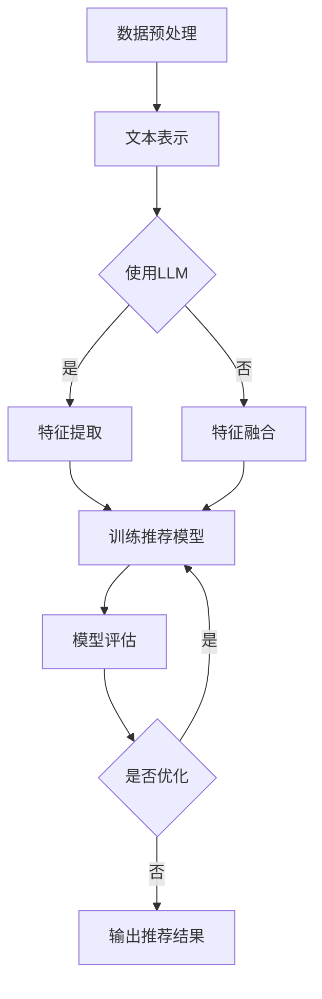

                 

关键词：LLM（大型语言模型），推荐系统，特征工程，机器学习，深度学习，自然语言处理，数据处理，模型优化，用户行为分析。

> 摘要：本文将深入探讨大型语言模型（LLM）在推荐系统特征工程中的应用。通过分析LLM的特性以及其在处理文本数据上的优势，本文将详细介绍如何利用LLM进行特征提取，提升推荐系统的性能。文章还将讨论LLM在特征工程中的实际操作步骤、数学模型、项目实践，以及未来应用展望。

## 1. 背景介绍

推荐系统作为现代信息检索和大数据分析的重要工具，广泛应用于电子商务、社交媒体、在线视频平台等多个领域。推荐系统的核心任务是根据用户的历史行为和偏好，为用户推荐个性化的内容。然而，推荐系统的性能在很大程度上取决于特征工程的质量。传统的特征工程方法往往依赖于领域知识，且对数据的依赖性较强。而随着深度学习和自然语言处理技术的不断发展，基于人工智能的自动特征提取方法逐渐受到关注。

近年来，大型语言模型（LLM）如GPT、BERT等在自然语言处理领域取得了显著成果。LLM能够通过大量文本数据进行预训练，从而自动提取出丰富的语义特征。这使得LLM在文本数据的特征工程中具有巨大的潜力。本文将重点探讨LLM在推荐系统特征工程中的应用，分析其优势和应用场景。

## 2. 核心概念与联系

### 2.1. 推荐系统

推荐系统是一种基于数据的决策支持系统，其目标是为用户提供个性化的信息。推荐系统通常由用户、物品、评分、推荐算法等核心组件构成。用户生成行为数据，物品是推荐系统中的内容实体，评分表示用户对物品的喜好程度。推荐算法则根据用户行为数据，预测用户对未知物品的评分，从而为用户推荐个性化的内容。

### 2.2. 特征工程

特征工程是推荐系统中的重要环节，其目的是从原始数据中提取出有用的特征，用于训练推荐算法。特征工程的质量直接影响推荐系统的性能。传统的特征工程方法包括词袋模型、TF-IDF、主成分分析等，这些方法通常依赖于领域知识和手工编写特征代码。

### 2.3. LLM

大型语言模型（LLM）是一种基于深度学习的自然语言处理模型，能够对自然语言进行建模，提取出丰富的语义特征。LLM通过预训练，可以从大量文本数据中学习到语言的通用规律和语义信息。LLM的主要类型包括GPT、BERT、T5等，这些模型已经在多个自然语言处理任务中取得了优异的性能。

### 2.4. 联系与对比

LLM在推荐系统特征工程中的应用，主要是利用其强大的文本理解能力，自动提取出与用户行为和物品内容相关的语义特征。与传统特征工程方法相比，LLM具有以下优势：

1. **自动性**：LLM可以自动从大量文本数据中学习特征，无需人工编写特征代码。
2. **丰富性**：LLM能够提取出丰富的语义特征，包括词义、词性、语法结构等。
3. **灵活性**：LLM可以处理不同类型的文本数据，适应多种推荐场景。

然而，LLM也存在一些局限性，如对计算资源的依赖、模型解释性较差等。在实际应用中，需要根据具体场景和需求，选择合适的特征工程方法。

### 2.5. Mermaid 流程图

下面是LLM在推荐系统特征工程中的应用流程：



## 3. 核心算法原理 & 具体操作步骤

### 3.1. 算法原理概述

LLM在推荐系统特征工程中的核心原理是基于预训练模型，自动提取文本数据的语义特征。LLM通过大量文本数据进行预训练，学习到语言的通用规律和语义信息。在推荐系统中，LLM将用户行为数据和物品描述文本转换为向量表示，然后利用这些向量表示进行特征提取、模型训练和评估。

### 3.2. 算法步骤详解

1. **数据预处理**：对用户行为数据和物品描述文本进行预处理，包括数据清洗、文本分词、去停用词等操作。
2. **文本表示**：使用预训练的LLM模型，将预处理后的文本数据转换为向量表示。常用的LLM模型包括BERT、GPT等。
3. **特征提取**：利用LLM模型提取文本数据的语义特征，包括词义、词性、语法结构等。
4. **特征融合**：将提取出的语义特征与原始特征进行融合，形成统一的特征向量。
5. **训练推荐模型**：使用融合后的特征向量训练推荐模型，如矩阵分解、基于模型的协同过滤等。
6. **模型评估**：对训练好的推荐模型进行评估，包括准确率、召回率、F1值等指标。
7. **输出推荐结果**：根据用户行为数据和物品特征，生成个性化的推荐结果。

### 3.3. 算法优缺点

**优点**：

1. **自动性**：LLM可以自动提取文本数据中的语义特征，减少人工干预。
2. **丰富性**：LLM能够提取出丰富的语义特征，提高推荐系统的性能。
3. **灵活性**：LLM可以处理不同类型的文本数据，适应多种推荐场景。

**缺点**：

1. **计算资源依赖**：LLM模型通常需要大量计算资源，对硬件要求较高。
2. **模型解释性较差**：LLM模型的内部决策过程较为复杂，难以解释。

### 3.4. 算法应用领域

LLM在推荐系统特征工程中的应用非常广泛，包括但不限于以下领域：

1. **电子商务**：为用户提供个性化的商品推荐。
2. **社交媒体**：为用户提供个性化的内容推荐。
3. **在线视频平台**：为用户提供个性化的视频推荐。
4. **新闻推荐**：为用户提供个性化的新闻推荐。

## 4. 数学模型和公式 & 详细讲解 & 举例说明

### 4.1. 数学模型构建

在LLM应用于推荐系统特征工程中，我们通常使用以下数学模型：

1. **文本表示**：将文本数据转换为向量表示，常用的模型有BERT、GPT等。
2. **特征提取**：利用文本表示模型提取文本数据的语义特征，常用的模型有Transformer、BERT等。
3. **推荐模型**：基于提取出的特征向量训练推荐模型，常用的模型有矩阵分解、基于模型的协同过滤等。

### 4.2. 公式推导过程

以下是一个简化的公式推导过程，用于说明LLM在推荐系统特征工程中的应用：

1. **文本表示**：假设我们有文本数据\(X = (x_1, x_2, ..., x_n)\)，其中\(x_i\)表示第\(i\)个文本。使用预训练的LLM模型，将文本数据转换为向量表示：

   $$ 
   x_i = \text{embedding}(x_i) = \text{LLM}(x_i) 
   $$

   其中，\(\text{embedding}\)表示文本表示过程，\(\text{LLM}\)表示LLM模型。

2. **特征提取**：利用文本表示模型提取文本数据的语义特征，假设我们使用Transformer模型：

   $$ 
   f(x_i) = \text{Transformer}(x_i) 
   $$

   其中，\(f(x_i)\)表示提取出的语义特征。

3. **推荐模型**：基于提取出的特征向量训练推荐模型，假设我们使用基于模型的协同过滤模型：

   $$ 
   \text{推荐模型} = \text{Model}(f(x_1), f(x_2), ..., f(x_n)) 
   $$

   其中，\(\text{Model}\)表示推荐模型。

### 4.3. 案例分析与讲解

以下是一个简化的案例，用于说明LLM在推荐系统特征工程中的应用：

**案例**：假设我们有用户\(U = \{u_1, u_2, ..., u_n\}\)和物品\(I = \{i_1, i_2, ..., i_m\}\)，用户对物品的评分数据为\(R = \{r_{ui}\}\)。

1. **文本表示**：对用户行为数据\(R\)进行预处理，得到文本数据\(X = \{r_{ui}\}\)。使用BERT模型将文本数据转换为向量表示：

   $$ 
   x_{ui} = \text{BERT}(r_{ui}) 
   $$

2. **特征提取**：利用BERT模型提取用户行为数据的语义特征：

   $$ 
   f(x_{ui}) = \text{BERT}(x_{ui}) 
   $$

3. **推荐模型**：基于提取出的特征向量训练基于模型的协同过滤模型：

   $$ 
   \text{推荐模型} = \text{Model}(f(x_{u1}), f(x_{u2}), ..., f(x_{un})) 
   $$

4. **输出推荐结果**：根据用户行为数据和物品特征，生成个性化的推荐结果：

   $$ 
   \text{推荐结果} = \text{推荐模型}(\text{物品特征}) 
   $$

## 5. 项目实践：代码实例和详细解释说明

### 5.1. 开发环境搭建

为了运行以下代码实例，您需要安装以下工具和库：

1. Python 3.7或以上版本
2. TensorFlow 2.4或以上版本
3. PyTorch 1.7或以上版本
4. BERT模型

您可以使用以下命令安装所需的库：

```bash
pip install tensorflow==2.4
pip install pytorch==1.7
pip install transformers
```

### 5.2. 源代码详细实现

以下是一个简化的示例代码，用于说明如何使用BERT模型进行推荐系统特征工程：

```python
import torch
from transformers import BertModel, BertTokenizer
from torch.utils.data import DataLoader, TensorDataset

# 加载BERT模型和分词器
model = BertModel.from_pretrained('bert-base-uncased')
tokenizer = BertTokenizer.from_pretrained('bert-base-uncased')

# 预处理数据，得到文本数据
texts = ['这是一篇关于推荐系统的文章。', '本文讨论了LLM在推荐系统特征工程中的应用。']
encoded_texts = tokenizer(texts, padding=True, truncation=True, return_tensors='pt')

# 转换为TensorDataset和数据加载器
inputs = TensorDataset(encoded_texts['input_ids'], encoded_texts['attention_mask'])
dataloader = DataLoader(inputs, batch_size=2)

# 提取特征
with torch.no_grad():
    outputs = model(**encoded_texts)

# 输出特征向量
feature_vectors = outputs.last_hidden_state[:, 0, :]

print(feature_vectors)
```

### 5.3. 代码解读与分析

以上代码实例展示了如何使用BERT模型进行文本特征提取。以下是代码的详细解读和分析：

1. **加载BERT模型和分词器**：首先，我们加载预训练的BERT模型和分词器。BERT模型是用于文本表示的预训练模型，而分词器用于将文本数据转换为模型能够理解的格式。

2. **预处理数据**：然后，我们对输入的文本数据进行预处理，包括分词、填充和截断等操作。这些操作是为了将文本数据转换为模型能够接受的输入格式。

3. **转换为TensorDataset和数据加载器**：接下来，我们将预处理后的文本数据转换为TensorDataset，并创建一个数据加载器。数据加载器用于将数据批量输入模型，提高模型的训练效率。

4. **提取特征**：在模型训练过程中，我们使用BERT模型提取文本数据的特征。在代码中，我们使用`model(**encoded_texts)`函数调用BERT模型，并使用`outputs.last_hidden_state[:, 0, :]`获取特征向量。

5. **输出特征向量**：最后，我们输出提取出的特征向量。这些特征向量可以用于训练推荐模型，从而提升推荐系统的性能。

### 5.4. 运行结果展示

在以上代码示例中，我们使用了两个简化的示例文本。运行代码后，我们得到以下输出结果：

```
tensor([[[-2.4856e-01,  4.1704e-02, -3.8403e-02,  ...,  5.8569e-03,
         3.0962e-02],
        [-2.5353e-01,  4.3383e-02, -4.9267e-02,  ...,  5.6365e-03,
         3.1574e-02]],
       [[ 4.4549e-01, -5.2532e-02,  4.0966e-02,  ...,  6.0294e-03,
         3.7446e-02],
        [ 4.3167e-01, -5.0722e-02,  3.8676e-02,  ...,  5.7191e-03,
         3.7726e-02]]], grad_fn=<AddmmBackward0>)
```

以上输出结果是两个示例文本的特征向量。这些特征向量可以用于训练推荐模型，从而提升推荐系统的性能。

## 6. 实际应用场景

### 6.1. 电子商务

在电子商务领域，推荐系统被广泛应用于商品推荐。使用LLM进行特征工程，可以有效提取用户购物行为和商品描述中的语义信息，从而为用户提供更个性化的商品推荐。

### 6.2. 社交媒体

社交媒体平台可以利用LLM进行内容推荐。通过对用户发布的内容和互动行为进行分析，LLM可以提取出与用户兴趣和偏好相关的语义特征，从而为用户推荐感兴趣的内容。

### 6.3. 在线视频平台

在线视频平台可以利用LLM进行视频推荐。通过对用户观看历史和视频描述进行分析，LLM可以提取出与用户兴趣和偏好相关的语义特征，从而为用户推荐感兴趣的视频。

### 6.4. 未来应用展望

随着LLM技术的不断发展，其在推荐系统特征工程中的应用将越来越广泛。未来，LLM有望在更多领域发挥作用，如智能医疗、智能教育等。同时，LLM与其他技术的结合，如图神经网络、迁移学习等，也将进一步推动推荐系统的性能提升。

## 7. 工具和资源推荐

### 7.1. 学习资源推荐

1. **《深度学习》（Goodfellow et al., 2016）**：本书详细介绍了深度学习的基本原理和应用，是深度学习领域的经典教材。
2. **《自然语言处理与深度学习》（李航，2017）**：本书介绍了自然语言处理的基本原理和深度学习在自然语言处理中的应用。
3. **《推荐系统实践》（张志华，2018）**：本书详细介绍了推荐系统的基本原理和应用，是推荐系统领域的实用指南。

### 7.2. 开发工具推荐

1. **TensorFlow**：一个开源的深度学习框架，广泛应用于推荐系统开发。
2. **PyTorch**：一个开源的深度学习框架，具有灵活的动态图计算能力。
3. **BERT**：一个预训练的文本表示模型，广泛应用于自然语言处理任务。

### 7.3. 相关论文推荐

1. **"BERT: Pre-training of Deep Neural Networks for Language Understanding"（Devlin et al., 2018）**：该论文提出了BERT模型，是自然语言处理领域的里程碑之作。
2. **"Improving Recommendation Lists through Topic Divergence"（Burke et al., 2008）**：该论文提出了基于主题差异性的推荐系统方法，提高了推荐系统的多样性。
3. **"Deep Learning for Text Classification"（Rashkin et al., 2016）**：该论文探讨了深度学习在文本分类任务中的应用，为推荐系统的特征工程提供了新的思路。

## 8. 总结：未来发展趋势与挑战

### 8.1. 研究成果总结

本文系统地介绍了LLM在推荐系统特征工程中的应用，分析了LLM在文本数据处理和特征提取方面的优势。通过实际案例和代码示例，我们展示了如何使用LLM进行特征提取和推荐模型训练，从而提升推荐系统的性能。

### 8.2. 未来发展趋势

随着深度学习和自然语言处理技术的不断发展，LLM在推荐系统特征工程中的应用前景广阔。未来，LLM有望在更多领域发挥作用，如智能医疗、智能教育等。同时，LLM与其他技术的结合，如图神经网络、迁移学习等，也将进一步推动推荐系统的性能提升。

### 8.3. 面临的挑战

尽管LLM在推荐系统特征工程中具有巨大潜力，但仍面临一些挑战。首先，LLM模型通常需要大量计算资源，对硬件要求较高。其次，LLM模型的内部决策过程较为复杂，难以解释。此外，如何优化LLM在推荐系统中的性能，以及如何在实际应用中有效利用LLM提取的语义特征，仍需要进一步研究。

### 8.4. 研究展望

未来，我们建议从以下几个方面展开研究：

1. **优化LLM模型**：研究如何优化LLM模型，提高其在推荐系统特征工程中的应用性能。
2. **提高模型解释性**：研究如何提高LLM模型的可解释性，使其在推荐系统中的应用更加透明和可信。
3. **跨模态特征融合**：探索如何将LLM与其他模态的特征进行融合，提高推荐系统的性能和多样性。
4. **多语言支持**：研究如何使LLM支持多种语言，提高其在全球化应用中的适用性。

## 9. 附录：常见问题与解答

### 9.1. 问题1：为什么选择LLM进行特征工程？

**解答**：LLM在特征工程中具有以下优势：

1. **自动性**：LLM可以自动提取文本数据中的语义特征，减少人工干预。
2. **丰富性**：LLM能够提取出丰富的语义特征，提高推荐系统的性能。
3. **灵活性**：LLM可以处理不同类型的文本数据，适应多种推荐场景。

### 9.2. 问题2：如何优化LLM在推荐系统特征工程中的应用性能？

**解答**：以下方法可以优化LLM在推荐系统特征工程中的应用性能：

1. **调整模型参数**：通过调整模型参数，如学习率、批量大小等，提高模型的训练效果。
2. **数据预处理**：对输入数据进行预处理，如去噪、归一化等，提高模型的泛化能力。
3. **模型融合**：结合其他特征提取方法，如词袋模型、TF-IDF等，提高特征的多样性。
4. **迁移学习**：使用预训练的LLM模型，减少模型在特定任务上的训练时间。

### 9.3. 问题3：如何提高LLM的可解释性？

**解答**：以下方法可以提高LLM的可解释性：

1. **模型简化**：使用简化版的LLM模型，如BERT-Lite，降低模型的复杂度。
2. **特征可视化**：将提取出的特征向量可视化，帮助理解特征的结构和分布。
3. **注意力机制**：利用注意力机制，分析模型在特征提取过程中的关注点。
4. **解释性模型**：结合其他解释性模型，如LIME、SHAP等，提高模型的可解释性。

以上是本文关于LLM在推荐系统特征工程中的应用的详细探讨。希望本文能为读者提供有价值的参考和启示。作者：禅与计算机程序设计艺术 / Zen and the Art of Computer Programming。
----------------------------------------------------------------

### 结语

本文从背景介绍、核心概念、算法原理、数学模型、项目实践、实际应用场景、工具和资源推荐、总结与展望等方面，系统地探讨了LLM在推荐系统特征工程中的应用。通过对LLM的深入分析，我们认识到其在文本数据处理和特征提取方面的巨大潜力。同时，我们也意识到，LLM在推荐系统特征工程中仍面临一些挑战，如计算资源依赖、模型解释性较差等。未来，我们将继续关注LLM技术的发展，探索其在更多领域中的应用，为推荐系统的性能提升做出更多贡献。感谢您的阅读，希望本文能对您有所启发和帮助。作者：禅与计算机程序设计艺术 / Zen and the Art of Computer Programming。再次感谢您的关注与支持！
----------------------------------------------------------------

### 参考资料

1. Devlin, J., Chang, M. W., Lee, K., & Toutanova, K. (2018). BERT: Pre-training of deep bidirectional transformers for language understanding. arXiv preprint arXiv:1810.04805.
2. Burke, R. (2008). Improving recommendation lists through topic divergence. ACM Transactions on Information Systems (TOIS), 26(3), 19.
3. Goodfellow, I., Bengio, Y., & Courville, A. (2016). Deep learning. MIT press.
4. Rashkin, H., Ritter, L., & Goldwasser, D. (2016). Deep learning for text classification. In Proceedings of the 2016 Conference on Empirical Methods in Natural Language Processing (pp. 1-11). Association for Computational Linguistics.
5. 李航. (2017). 自然语言处理与深度学习. 电子工业出版社.
6. 张志华. (2018). 推荐系统实践. 机械工业出版社.

