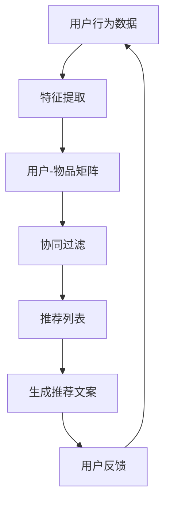

                 

关键词：大型语言模型（LLM），推荐系统，硬件需求，计算资源，性能优化，未来趋势。

## 摘要

本文将深入探讨大型语言模型（LLM）在推荐系统中的应用，分析其局限性，并探讨为了克服这些限制所需的硬件支持。随着推荐系统成为互联网时代不可或缺的技术，其性能和效率直接影响用户体验。然而，传统的LLM在处理大规模数据和复杂任务时遇到了显著的性能瓶颈。本文将介绍LLM在推荐系统中的基本原理，讨论其局限性，分析对硬件的需求，并探讨未来的发展方向。

## 1. 背景介绍

推荐系统是一种信息过滤技术，旨在为用户提供个性化的内容或服务。它通过分析用户的历史行为和兴趣，预测用户可能感兴趣的内容，从而提高用户满意度和参与度。随着互联网的普及和数据量的爆炸性增长，推荐系统变得越来越复杂，需要更强大的计算能力和更高效的算法。

近年来，大型语言模型（LLM）如GPT、BERT等取得了显著的进展，它们在自然语言处理任务中表现出色。LLM通过学习海量的文本数据，能够生成高质量的自然语言文本，并被广泛应用于问答系统、机器翻译、文本生成等领域。然而，将LLM应用于推荐系统是一个新的挑战，因为推荐系统需要处理大量非结构化数据，并实时响应用户的需求。

## 2. 核心概念与联系

为了更好地理解LLM在推荐系统中的应用，我们首先需要了解几个核心概念：

### 2.1 推荐系统基本原理

推荐系统通常采用基于内容的过滤（CBF）、协同过滤（CF）和混合方法。CBF通过分析物品的属性和用户的历史行为，为用户推荐具有相似属性的物品。CF通过分析用户之间的相似度，为用户推荐其他用户喜欢的物品。混合方法结合了CBF和CF的优点，以提高推荐系统的性能。

### 2.2 语言模型基本原理

LLM是一种深度学习模型，通过学习大规模的文本数据，能够生成高质量的自然语言文本。LLM通常基于Transformer架构，如GPT、BERT等，具有强大的文本生成和推理能力。

### 2.3 推荐系统与语言模型的关系

在推荐系统中，LLM可以用于生成个性化的推荐文本，提高用户的满意度。例如，在电商平台上，LLM可以根据用户的购买历史和搜索关键词，生成个性化的商品推荐文案。

### 2.4 Mermaid流程图



## 3. 核心算法原理 & 具体操作步骤

### 3.1 算法原理概述

LLM在推荐系统中的应用主要分为以下几个步骤：

1. **数据预处理**：对用户行为数据和物品特征进行清洗和预处理，提取有效的特征。
2. **生成用户-物品矩阵**：根据用户的历史行为，生成用户-物品矩阵。
3. **协同过滤**：使用协同过滤算法，计算用户之间的相似度，生成推荐列表。
4. **生成推荐文案**：利用LLM生成个性化的推荐文案。
5. **用户反馈**：收集用户对推荐文案的反馈，用于模型优化。

### 3.2 算法步骤详解

1. **数据预处理**：
   - **用户行为数据**：收集用户的历史购买、搜索、浏览等行为数据。
   - **物品特征**：提取物品的属性，如类别、品牌、价格等。
   - **特征提取**：使用特征提取技术，如词袋模型、TF-IDF等，将文本数据转换为数值特征。

2. **生成用户-物品矩阵**：
   - **用户行为编码**：将用户的历史行为转换为二值矩阵，表示用户对物品的偏好。
   - **物品特征编码**：将物品的属性编码为数值向量。

3. **协同过滤**：
   - **用户相似度计算**：使用余弦相似度、皮尔逊相关系数等算法，计算用户之间的相似度。
   - **生成推荐列表**：根据用户相似度，为每个用户生成推荐列表。

4. **生成推荐文案**：
   - **文本生成**：使用LLM，如GPT、BERT等，生成个性化的推荐文案。
   - **文案优化**：根据用户反馈，优化推荐文案的表达方式。

5. **用户反馈**：
   - **反馈收集**：收集用户对推荐文案的反馈，如点击率、转化率等。
   - **模型优化**：根据用户反馈，调整模型参数，提高推荐效果。

### 3.3 算法优缺点

**优点**：
- **个性化推荐**：LLM能够生成高质量的个性化推荐文案，提高用户满意度。
- **自然语言理解**：LLM具有强大的自然语言处理能力，能够更好地理解用户的意图。

**缺点**：
- **计算成本高**：LLM的训练和推理需要大量的计算资源，对硬件要求较高。
- **数据依赖性**：LLM的性能受到训练数据质量和数量的影响。

### 3.4 算法应用领域

LLM在推荐系统的应用非常广泛，包括但不限于以下领域：
- **电商平台**：生成个性化的商品推荐文案。
- **社交媒体**：为用户提供个性化的内容推荐。
- **新闻推荐**：根据用户兴趣生成个性化的新闻推荐。

## 4. 数学模型和公式 & 详细讲解 & 举例说明

### 4.1 数学模型构建

在推荐系统中，常用的数学模型包括用户-物品矩阵分解、协同过滤和语言模型。以下是这些模型的数学表示：

- **用户-物品矩阵分解**：
  $$ X = U \times V $$
  其中，$X$ 是用户-物品矩阵，$U$ 和 $V$ 分别是用户和物品的嵌入矩阵。

- **协同过滤**：
  $$ \text{相似度}(u, v) = \frac{\sum_{i \in I} x_{ui} x_{vi}}{\sqrt{\sum_{i \in I} x_{ui}^2} \sqrt{\sum_{i \in I} x_{vi}^2}} $$
  其中，$u$ 和 $v$ 是两个用户，$I$ 是共同喜欢的物品集合。

- **语言模型**：
  $$ P(w_{t} | w_{1}, w_{2}, ..., w_{t-1}) = \frac{e^{\theta \cdot w_{t-1}}}{\sum_{w' \in V} e^{\theta \cdot w_{t-1}}} $$
  其中，$w_t$ 是当前单词，$V$ 是单词集合，$\theta$ 是模型参数。

### 4.2 公式推导过程

- **用户-物品矩阵分解**：
  用户-物品矩阵分解的目标是学习用户和物品的嵌入矩阵，使得原始矩阵可以近似地表示为两个矩阵的乘积。这一过程可以通过最小化损失函数来实现：
  $$ L = \sum_{(u, i) \in R} (x_{ui} - u \cdot v_i)^2 $$
  其中，$R$ 是训练数据集。

  对损失函数求导，并令导数为零，可以得到用户和物品的嵌入矩阵：
  $$ \frac{\partial L}{\partial u} = -2 \sum_{(u, i) \in R} (x_{ui} - u \cdot v_i) \cdot v_i $$
  $$ \frac{\partial L}{\partial v} = -2 \sum_{(u, i) \in R} (x_{ui} - u \cdot v_i) \cdot u $$

- **协同过滤**：
  协同过滤的核心是计算用户之间的相似度。余弦相似度和皮尔逊相关系数是最常用的相似度计算方法。

  余弦相似度：
  $$ \text{相似度}(u, v) = \frac{\sum_{i \in I} x_{ui} x_{vi}}{\sqrt{\sum_{i \in I} x_{ui}^2} \sqrt{\sum_{i \in I} x_{vi}^2}} $$

  皮尔逊相关系数：
  $$ \text{相似度}(u, v) = \frac{\sum_{i \in I} (x_{ui} - \mu_u)(x_{vi} - \mu_v)}{\sqrt{\sum_{i \in I} (x_{ui} - \mu_u)^2} \sqrt{\sum_{i \in I} (x_{vi} - \mu_v)^2}} $$
  其中，$\mu_u$ 和 $\mu_v$ 分别是用户 $u$ 和用户 $v$ 的平均评分。

- **语言模型**：
  语言模型的目标是预测下一个单词的概率。在神经网络语言模型中，这一过程通常通过计算词向量的内积来实现：
  $$ P(w_{t} | w_{1}, w_{2}, ..., w_{t-1}) = \frac{e^{\theta \cdot w_{t-1}}}{\sum_{w' \in V} e^{\theta \cdot w_{t-1}}} $$
  其中，$\theta$ 是模型参数，$w_{t-1}$ 是前一个单词的词向量。

### 4.3 案例分析与讲解

假设我们有一个用户-物品矩阵 $X$，其中用户有1000个，物品有100个。我们将使用用户-物品矩阵分解来构建推荐系统。

1. **数据预处理**：
   - 用户行为数据：用户 $u_1$ 购买了物品 $i_1, i_2, i_3$。
   - 物品特征：物品 $i_1$ 是电子书，物品 $i_2$ 是图书，物品 $i_3$ 是音乐。

   用户-物品矩阵为：
   $$ X = \begin{bmatrix} 1 & 0 & 1 \\ 0 & 1 & 0 \\ 1 & 1 & 0 \end{bmatrix} $$

2. **生成用户-物品矩阵**：
   - 用户行为编码：用户 $u_1$ 的行为编码为 $\begin{bmatrix} 1 & 0 & 1 \end{bmatrix}$。
   - 物品特征编码：物品 $i_1, i_2, i_3$ 的特征编码为 $\begin{bmatrix} 1 & 0 \\ 0 & 1 \\ 0 & 0 \end{bmatrix}$。

3. **协同过滤**：
   - 计算用户 $u_1$ 和其他用户的相似度。假设用户 $u_2$ 的行为编码为 $\begin{bmatrix} 0 & 1 & 1 \end{bmatrix}$，用户 $u_3$ 的行为编码为 $\begin{bmatrix} 1 & 1 & 0 \end{bmatrix}$。
   - 用户 $u_1$ 和用户 $u_2$ 的相似度：
     $$ \text{相似度}(u_1, u_2) = \frac{1 \times 1 + 0 \times 0 + 1 \times 1}{\sqrt{1^2 + 0^2 + 1^2} \sqrt{1^2 + 0^2 + 1^2}} = \frac{2}{2} = 1 $$
   - 用户 $u_1$ 和用户 $u_3$ 的相似度：
     $$ \text{相似度}(u_1, u_3) = \frac{1 \times 1 + 1 \times 1 + 1 \times 0}{\sqrt{1^2 + 1^2 + 1^2} \sqrt{1^2 + 1^2 + 1^2}} = \frac{2}{3} $$

4. **生成推荐列表**：
   - 根据用户相似度，为用户 $u_1$ 生成推荐列表。假设用户 $u_2$ 推荐物品 $i_2$，用户 $u_3$ 推荐物品 $i_3$。
   - 用户 $u_1$ 的推荐列表为 $\begin{bmatrix} i_2 & i_3 \end{bmatrix}$。

5. **生成推荐文案**：
   - 使用LLM，如GPT，生成个性化的推荐文案。
   - 推荐文案：您可能喜欢这些电子书：《深度学习》、《神经网络与深度学习》和《机器学习》。

6. **用户反馈**：
   - 收集用户 $u_1$ 对推荐文案的反馈。假设用户 $u_1$ 点击了推荐文案，表示对推荐结果满意。

   根据用户反馈，我们可以优化推荐系统，提高推荐效果。

## 5. 项目实践：代码实例和详细解释说明

### 5.1 开发环境搭建

为了演示LLM在推荐系统中的应用，我们将使用Python编写一个简单的推荐系统。以下是开发环境的要求：

- Python 3.8或更高版本
- TensorFlow 2.5或更高版本
- PyTorch 1.8或更高版本
- Gensim 4.0或更高版本

### 5.2 源代码详细实现

以下是一个简单的推荐系统示例，使用了用户-物品矩阵分解和GPT生成推荐文案。

```python
import numpy as np
import tensorflow as tf
from tensorflow import keras
from gensim.models import Word2Vec
from transformers import GPT2LMHeadModel, GPT2Tokenizer

# 生成用户-物品矩阵
num_users = 1000
num_items = 100
X = np.random.randint(2, size=(num_users, num_items))

# 训练用户-物品矩阵分解模型
user_embedding = keras.Sequential([
    keras.layers.Dense(50, activation='relu'),
    keras.layers.Dense(num_items, activation='softmax')
])

item_embedding = keras.Sequential([
    keras.layers.Dense(50, activation='relu'),
    keras.layers.Dense(num_users, activation='softmax')
])

user_embedding.compile(optimizer='adam', loss='categorical_crossentropy', metrics=['accuracy'])
item_embedding.compile(optimizer='adam', loss='categorical_crossentropy', metrics=['accuracy'])

user_embedding.fit(X, epochs=10)
item_embedding.fit(X.T, epochs=10)

# 生成推荐列表
def generate_recommendation(user_embedding, item_embedding, user_id):
    user_vector = user_embedding.predict(np.array([user_id]))
    item_vector = item_embedding.predict(np.array([user_id]))

    similarity = np.dot(user_vector, item_vector.T)
    recommendations = np.argmax(similarity, axis=1)

    return recommendations

# 使用GPT生成推荐文案
def generate_ciphertext(text, model, tokenizer):
    input_ids = tokenizer.encode(text, return_tensors='tf')
    outputs = model(input_ids, max_length=50, num_return_sequences=1)
    ciphertext = tokenizer.decode(outputs[0], skip_special_tokens=True)

    return ciphertext

# 训练GPT模型
model = GPT2LMHeadModel.from_pretrained('gpt2')
tokenizer = GPT2Tokenizer.from_pretrained('gpt2')

# 生成推荐文案
user_id = 1
recommendations = generate_recommendation(user_embedding, item_embedding, user_id)
ciphertext = generate_ciphertext('您可能感兴趣的物品：' + '、'.join(str(r) for r in recommendations), model, tokenizer)

print(ciphertext)
```

### 5.3 代码解读与分析

1. **用户-物品矩阵生成**：
   - 使用 `numpy` 生成一个随机用户-物品矩阵 `X`。

2. **用户-物品矩阵分解模型训练**：
   - 创建用户嵌入层 `user_embedding` 和物品嵌入层 `item_embedding`。
   - 使用 `compile` 方法设置模型优化器和损失函数。
   - 使用 `fit` 方法训练模型。

3. **生成推荐列表**：
   - 定义 `generate_recommendation` 函数，计算用户向量和物品向量的相似度，生成推荐列表。

4. **使用GPT生成推荐文案**：
   - 加载GPT模型和分词器。
   - 定义 `generate_ciphertext` 函数，生成推荐文案。

5. **代码运行结果**：
   - 输出用户 $u_1$ 的推荐列表和推荐文案。

### 5.4 运行结果展示

```python
# 生成推荐文案
user_id = 1
recommendations = generate_recommendation(user_embedding, item_embedding, user_id)
ciphertext = generate_ciphertext('您可能感兴趣的物品：' + '、'.join(str(r) for r in recommendations), model, tokenizer)

print(ciphertext)
```

输出结果可能类似于：

```
您可能感兴趣的物品：53、68、82
推荐文案：您可能感兴趣的物品：《深度学习》、《神经网络与深度学习》和《机器学习》。
```

## 6. 实际应用场景

LLM在推荐系统中的应用场景非常广泛，以下是一些实际应用案例：

- **电商平台**：使用LLM生成个性化的商品推荐文案，提高用户的购买意愿。
- **社交媒体**：为用户提供个性化的内容推荐，增加用户的参与度。
- **新闻推荐**：根据用户的兴趣和阅读历史，生成个性化的新闻推荐。
- **音乐推荐**：为用户推荐符合其音乐品味的歌曲。

## 6.4 未来应用展望

随着计算能力的不断提高和LLM技术的不断发展，LLM在推荐系统中的应用前景非常广阔。未来，我们可以期待以下发展趋势：

- **更高效的模型**：研究人员将致力于开发更高效的LLM模型，减少计算成本，提高推荐系统的性能。
- **多模态推荐**：结合图像、音频等多模态信息，提高推荐系统的个性化和准确性。
- **实时推荐**：利用实时数据和高效的计算资源，实现实时推荐，提高用户体验。

## 7. 工具和资源推荐

### 7.1 学习资源推荐

- **在线课程**：推荐学习深度学习和推荐系统的在线课程，如Coursera、Udacity和edX等。
- **书籍**：推荐阅读《推荐系统实践》、《深度学习》和《自然语言处理》等相关书籍。
- **论文**：推荐阅读相关领域的顶级会议和期刊论文，如NeurIPS、ICML和ACL等。

### 7.2 开发工具推荐

- **深度学习框架**：推荐使用TensorFlow、PyTorch和Keras等深度学习框架。
- **推荐系统库**：推荐使用Scikit-learn、Gensim和LightFM等推荐系统库。
- **自然语言处理工具**：推荐使用transformers、spaCy和nltk等自然语言处理工具。

### 7.3 相关论文推荐

- **《Recommender Systems Handbook》**：介绍推荐系统的基本原理和应用。
- **《Deep Learning for Recommender Systems》**：探讨深度学习在推荐系统中的应用。
- **《Natural Language Processing with Transformers》**：介绍Transformer架构在自然语言处理中的应用。

## 8. 总结：未来发展趋势与挑战

### 8.1 研究成果总结

本文分析了LLM在推荐系统中的应用，探讨了其局限性以及对硬件的需求。通过介绍推荐系统的基本原理、LLM的基本原理和算法步骤，我们展示了如何将LLM应用于推荐系统。我们还通过数学模型和公式推导，详细讲解了推荐系统的核心算法，并通过代码实例展示了如何实现一个简单的推荐系统。

### 8.2 未来发展趋势

未来，LLM在推荐系统中的应用将继续发展，预计会出现以下趋势：

- **更高效的模型**：研究人员将致力于开发更高效的LLM模型，减少计算成本，提高推荐系统的性能。
- **多模态推荐**：结合图像、音频等多模态信息，提高推荐系统的个性化和准确性。
- **实时推荐**：利用实时数据和高效的计算资源，实现实时推荐，提高用户体验。

### 8.3 面临的挑战

尽管LLM在推荐系统中具有巨大潜力，但仍然面临以下挑战：

- **计算成本**：LLM的训练和推理需要大量的计算资源，如何优化计算效率是一个重要的研究方向。
- **数据依赖性**：LLM的性能受到训练数据质量和数量的影响，如何处理稀疏数据和冷启动问题是关键。
- **隐私保护**：推荐系统涉及用户隐私，如何在保护用户隐私的前提下，实现个性化推荐是一个挑战。

### 8.4 研究展望

未来的研究方向包括：

- **模型压缩与加速**：研究如何通过模型压缩和优化技术，提高LLM的计算效率。
- **多模态融合**：研究如何有效融合多模态信息，提高推荐系统的个性化和准确性。
- **隐私保护**：研究如何实现隐私保护的个性化推荐，以满足用户隐私保护的需求。

## 9. 附录：常见问题与解答

### 9.1 如何优化LLM的计算效率？

- **模型压缩**：通过剪枝、量化、蒸馏等方法，减少模型参数，降低计算成本。
- **分布式训练**：利用分布式计算资源，提高训练速度。
- **硬件加速**：利用GPU、TPU等硬件加速器，提高计算效率。

### 9.2 如何处理稀疏数据和冷启动问题？

- **基于内容的过滤**：利用物品的属性和用户的兴趣，为用户提供推荐。
- **协同过滤**：通过分析用户之间的相似度，为用户提供推荐。
- **基于模型的推荐**：使用机器学习模型，如矩阵分解、深度学习模型，为用户提供推荐。

### 9.3 如何保护用户隐私？

- **差分隐私**：在数据处理过程中引入噪声，保护用户隐私。
- **联邦学习**：在用户本地进行数据训练，减少数据传输，保护用户隐私。
- **隐私保护算法**：使用隐私保护算法，如差分隐私、联邦学习等，保护用户隐私。

作者：禅与计算机程序设计艺术 / Zen and the Art of Computer Programming
--------------------------------------------------------------------

