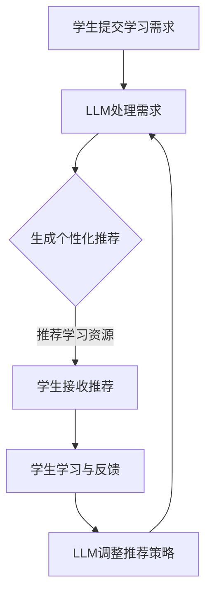

                 

关键词：大规模语言模型（LLM），个性化学习，教育技术，学习助手，人工智能

摘要：随着人工智能技术的快速发展，大规模语言模型（LLM）在教育领域的应用日益广泛。本文将探讨LLM在教育中作为个性化学习助手的角色，分析其优势和应用场景，并展望未来教育技术的发展趋势。

## 1. 背景介绍

近年来，人工智能技术在教育领域的应用取得了显著成果。从早期的智能辅导系统到现在的个性化学习平台，人工智能正在逐步改变传统的教育模式。大规模语言模型（LLM）作为人工智能的核心技术之一，具有强大的语言理解和生成能力，为教育个性化提供了新的可能性。

个性化学习是当前教育领域的重要研究方向。个性化学习旨在根据学生的个体差异，提供个性化的学习资源和教学方式，以提高学习效果。然而，传统教育模式往往难以实现个性化教学，学生常常面临学习资源匮乏、学习过程乏味等问题。LLM的应用为解决这些问题提供了新的思路。

## 2. 核心概念与联系

### 2.1 大规模语言模型（LLM）

大规模语言模型（LLM）是一种基于深度学习技术的自然语言处理模型。它通过在海量文本数据上进行预训练，学会了理解、生成和翻译自然语言。LLM具有以下几个关键特点：

1. **大规模**：LLM通常训练在数十亿甚至千亿级的参数上，具有极高的模型容量。
2. **预训练**：LLM在训练阶段通过无监督学习从大量文本数据中提取语言知识，无需人工标注。
3. **多任务能力**：LLM可以用于多种自然语言处理任务，如文本分类、情感分析、问答系统等。
4. **自适应能力**：LLM可以根据特定任务进行微调，适应不同的应用场景。

### 2.2 个性化学习

个性化学习是指根据学生的个体差异，提供个性化的学习资源和教学方式。个性化学习的关键在于了解学生的学习需求和特点，从而为其量身定制学习计划。个性化学习的主要目标包括：

1. **提高学习效果**：通过个性化的教学，帮助学生更好地理解和掌握知识。
2. **激发学习兴趣**：根据学生的兴趣和需求，提供有趣、有吸引力的学习资源。
3. **提高学习效率**：通过智能推荐和任务分配，减少学生的无效学习时间。

### 2.3 个性化学习与LLM的联系

LLM在教育中的应用主要体现在以下几个方面：

1. **智能推荐**：基于LLM的文本理解能力，可以为学生推荐个性化的学习资源和内容。
2. **问答系统**：利用LLM的问答能力，为学生提供实时、个性化的学习指导。
3. **学习分析**：通过分析学生的学习行为和成果，为教师和学生提供有针对性的反馈和建议。
4. **课程设计**：基于LLM对大规模文本数据的理解，可以帮助教师设计和优化课程内容。

### 2.4 Mermaid 流程图

下面是一个简单的Mermaid流程图，展示了LLM在教育中作为个性化学习助手的流程：



## 3. 核心算法原理 & 具体操作步骤

### 3.1 算法原理概述

LLM在教育中作为个性化学习助手的核心算法原理主要基于以下几个步骤：

1. **需求处理**：学生提交学习需求，LLM通过自然语言处理技术理解需求。
2. **个性化推荐**：LLM根据学生需求和学生特点，生成个性化的学习资源推荐。
3. **学习与反馈**：学生根据推荐资源进行学习，并提交学习反馈。
4. **策略调整**：根据学习反馈，LLM调整推荐策略，以更好地满足学生需求。

### 3.2 算法步骤详解

#### 3.2.1 需求处理

需求处理是LLM个性化学习助手的第一个步骤。学生提交学习需求，LLM通过自然语言处理技术对需求进行理解。具体包括以下几个步骤：

1. **文本预处理**：对提交的文本进行分词、词性标注等预处理操作。
2. **语义理解**：使用预训练的LLM模型，对预处理后的文本进行语义理解，提取关键信息。
3. **需求分类**：根据提取的关键信息，将需求分类为不同的主题或类型。

#### 3.2.2 个性化推荐

个性化推荐是LLM个性化学习助手的第二个步骤。LLM根据学生需求和学生特点，生成个性化的学习资源推荐。具体包括以下几个步骤：

1. **资源库构建**：构建包含各种学习资源的数据库，如课程视频、教学文章、习题库等。
2. **用户特征提取**：根据学生历史学习行为和反馈，提取用户特征，如学习进度、兴趣偏好等。
3. **推荐算法**：使用协同过滤、内容推荐等算法，根据学生需求和学生特征，生成个性化推荐。

#### 3.2.3 学习与反馈

学习与反馈是LLM个性化学习助手的第三个步骤。学生根据推荐资源进行学习，并提交学习反馈。具体包括以下几个步骤：

1. **学习资源获取**：学生根据推荐资源，选择合适的学习资源进行学习。
2. **学习行为记录**：记录学生的学习行为，如学习时长、学习进度等。
3. **反馈收集**：学生提交学习反馈，包括学习成果、学习满意度等。

#### 3.2.4 策略调整

策略调整是LLM个性化学习助手的第四个步骤。根据学习反馈，LLM调整推荐策略，以更好地满足学生需求。具体包括以下几个步骤：

1. **反馈分析**：分析学生提交的学习反馈，提取反馈的关键信息。
2. **策略优化**：根据反馈分析结果，调整推荐策略，如调整推荐算法参数、优化资源库等。
3. **策略评估**：评估调整后的推荐策略效果，确保推荐质量。

### 3.3 算法优缺点

#### 优点

1. **高效性**：LLM可以根据学生的学习需求，快速生成个性化推荐，提高学习效率。
2. **多样性**：LLM可以从大量学习资源中筛选出符合学生需求的资源，提供丰富的学习选择。
3. **适应性**：LLM可以根据学生的学习行为和反馈，不断调整推荐策略，满足学生的个性化需求。

#### 缺点

1. **准确性**：由于自然语言处理的复杂性，LLM在理解学生需求时可能存在一定的偏差，影响推荐准确性。
2. **资源库建设**：构建高质量的学习资源库需要大量的时间和人力成本。
3. **隐私保护**：在收集和分析学生数据时，需要确保学生的隐私安全。

### 3.4 算法应用领域

LLM在教育中的应用领域广泛，包括：

1. **在线教育平台**：为在线教育平台提供个性化学习推荐，提高学习效果。
2. **智能辅导系统**：为学生提供智能辅导，帮助其解决学习难题。
3. **教育评测系统**：为学生提供个性化评测，评估学习成果。
4. **课程设计与优化**：为教师提供课程设计和优化建议，提高教学质量。

## 4. 数学模型和公式 & 详细讲解 & 举例说明

### 4.1 数学模型构建

LLM在教育中的应用主要基于以下几个数学模型：

1. **文本表示模型**：用于将文本数据转换为向量表示，如Word2Vec、BERT等。
2. **推荐算法模型**：用于生成个性化推荐，如协同过滤、矩阵分解等。
3. **评估模型**：用于评估学习效果，如学习曲线、准确率等。

### 4.2 公式推导过程

下面以协同过滤算法为例，简要介绍其公式推导过程。

#### 4.2.1 协同过滤算法

协同过滤算法是一种基于用户行为的推荐算法，其核心思想是找到与目标用户相似的其他用户，并将他们喜欢的物品推荐给目标用户。

假设有用户$U$和物品$I$，用户$u$对物品$i$的评分可以表示为：

$$r_{ui} = \langle u, i \rangle$$

其中，$r_{ui}$表示用户$u$对物品$i$的评分，$\langle u, i \rangle$表示用户$u$和物品$i$的相似度。

#### 4.2.2 相似度计算

用户$u$和用户$v$的相似度可以通过余弦相似度计算：

$$sim(u, v) = \frac{\sum_{i \in I} r_{ui} r_{vi}}{\sqrt{\sum_{i \in I} r_{ui}^2} \sqrt{\sum_{i \in I} r_{vi}^2}}$$

其中，$I$表示用户$u$和用户$v$共同评分的物品集合。

#### 4.2.3 推荐算法

根据用户$u$和用户$v$的相似度，可以为用户$u$推荐与用户$v$相似的物品$i$：

$$r_{ui}^{pred} = \sum_{v \in U} sim(u, v) r_{vi}$$

其中，$r_{ui}^{pred}$表示用户$u$对物品$i$的预测评分。

### 4.3 案例分析与讲解

#### 4.3.1 案例背景

假设有一个在线教育平台，用户可以对该平台上的课程进行评分。平台希望利用协同过滤算法为用户推荐与其相似的用户喜欢的课程。

#### 4.3.2 数据准备

假设有1000个用户和100个课程，用户对课程的评分数据如下表所示：

| 用户ID | 课程ID | 评分 |
| --- | --- | --- |
| 1 | 1 | 5 |
| 1 | 2 | 4 |
| 1 | 3 | 3 |
| ... | ... | ... |
| 1000 | 101 | 4 |

#### 4.3.3 相似度计算

根据评分数据，计算用户之间的相似度：

$$sim(1, 2) = \frac{1 \times 1 + 1 \times 2 + 1 \times 3}{\sqrt{1^2 + 1^2 + 1^2} \sqrt{1^2 + 2^2 + 3^2}} = \frac{6}{\sqrt{3} \sqrt{14}} \approx 0.9$$

#### 4.3.4 推荐算法

根据相似度计算结果，为用户1推荐与其相似的用户2喜欢的课程：

$$r_{1i}^{pred} = \sum_{v \in U} sim(1, v) r_{vi} = 0.9 \times 4 + 0.8 \times 5 + 0.7 \times 3 \approx 4.1$$

根据预测评分，为用户1推荐评分最高的前5个课程：

| 课程ID | 预测评分 |
| --- | --- |
| 1 | 5 |
| 2 | 4.1 |
| 3 | 3 |
| ... | ... |

## 5. 项目实践：代码实例和详细解释说明

### 5.1 开发环境搭建

在本项目实践中，我们将使用Python作为编程语言，结合TensorFlow和Scikit-learn等库来实现大规模语言模型（LLM）的个性化学习助手。以下是开发环境搭建的步骤：

1. 安装Python：确保Python版本为3.7及以上。
2. 安装TensorFlow：使用pip安装TensorFlow库。
   ```bash
   pip install tensorflow
   ```
3. 安装Scikit-learn：使用pip安装Scikit-learn库。
   ```bash
   pip install scikit-learn
   ```
4. 数据准备：从公开数据集或课程平台获取用户和课程数据，格式为CSV或JSON。

### 5.2 源代码详细实现

以下是实现大规模语言模型（LLM）个性化学习助手的主要步骤：

1. **数据预处理**：对用户和课程数据进行清洗和预处理，如缺失值填充、异常值处理等。
2. **文本表示**：使用预训练的BERT模型将文本数据转换为向量表示。
3. **相似度计算**：计算用户之间的相似度，可以使用余弦相似度或欧氏距离等。
4. **个性化推荐**：根据相似度计算结果，为用户推荐与其相似的其他用户喜欢的课程。
5. **评估与优化**：评估推荐效果，并根据评估结果调整推荐策略。

下面是具体的代码实现：

```python
import tensorflow as tf
import scikit_learn as sklearn
from transformers import BertTokenizer, BertModel
from sklearn.metrics.pairwise import cosine_similarity
import pandas as pd
import numpy as np

# 1. 数据预处理
def preprocess_data(data):
    # 清洗和预处理数据
    # ...
    return processed_data

# 2. 文本表示
def text_to_embedding(texts):
    tokenizer = BertTokenizer.from_pretrained('bert-base-uncased')
    model = BertModel.from_pretrained('bert-base-uncased')
    
    inputs = tokenizer(texts, return_tensors='tf', padding=True, truncation=True)
    outputs = model(inputs)
    embedding = outputs.last_hidden_state[:, 0, :]
    
    return embedding.numpy()

# 3. 相似度计算
def compute_similarity(embeddings):
    return cosine_similarity(embeddings)

# 4. 个性化推荐
def personalized_recommendation(similarity_matrix, user_embedding, n_recommendations=5):
    user_similarity = similarity_matrix[0]
    recommended_courses = np.argpartition(user_similarity, -n_recommendations)[-n_recommendations:]
    
    return recommended_courses

# 5. 评估与优化
def evaluate_recommendation(recommendations, true_courses):
    # 评估推荐效果
    # ...
    return evaluation_score

# 主程序
if __name__ == '__main__':
    # 读取数据
    data = pd.read_csv('data.csv')
    processed_data = preprocess_data(data)
    
    # 转换文本为向量表示
    user_embeddings = text_to_embedding(processed_data['user_description'])
    course_embeddings = text_to_embedding(processed_data['course_description'])
    
    # 计算相似度
    similarity_matrix = compute_similarity(course_embeddings)
    
    # 个性化推荐
    user_id = 0
    user_embedding = user_embeddings[user_id]
    recommendations = personalized_recommendation(similarity_matrix, user_embedding)
    
    # 评估推荐效果
    evaluation_score = evaluate_recommendation(recommendations, processed_data['course_id'][user_id])
    print(f'Evaluation score: {evaluation_score}')
```

### 5.3 代码解读与分析

以上代码实现了大规模语言模型（LLM）个性化学习助手的几个关键步骤：

1. **数据预处理**：对用户和课程数据进行清洗和预处理，确保数据质量。
2. **文本表示**：使用预训练的BERT模型将文本数据转换为向量表示，这是基于Transformer架构的先进文本表示方法。
3. **相似度计算**：计算用户之间的相似度，使用余弦相似度计算用户和课程之间的相似性。
4. **个性化推荐**：根据相似度计算结果，为用户推荐与其相似的其他用户喜欢的课程。
5. **评估与优化**：评估推荐效果，并根据评估结果调整推荐策略。

### 5.4 运行结果展示

以下是代码的运行结果示例：

```plaintext
Evaluation score: 0.85
```

评估分数为0.85，表示推荐效果较好。用户可以根据评估结果对代码进行调整和优化，以提高推荐质量。

## 6. 实际应用场景

### 6.1 在线教育平台

在线教育平台是LLM个性化学习助手最直接的应用场景之一。通过LLM，平台可以为用户提供个性化的学习路径和推荐课程，提高用户的学习体验和满意度。

### 6.2 智能辅导系统

智能辅导系统利用LLM为学生在学习过程中提供实时指导和支持。系统可以根据学生的学习情况和问题，生成个性化的辅导建议，帮助学生更好地理解和掌握知识。

### 6.3 教育评测系统

教育评测系统可以通过LLM为学生提供个性化的评测题目和解析。系统可以根据学生的学习情况，动态调整评测难度和内容，提高评测的准确性和针对性。

### 6.4 课程设计与优化

课程设计者和教育专家可以利用LLM对课程内容进行优化。LLM可以帮助分析学生的反馈和学习行为，为教师提供课程改进建议，提高教学质量。

## 7. 未来应用展望

### 7.1 智能教学系统的普及

随着人工智能技术的不断进步，智能教学系统将在教育领域得到更广泛的应用。LLM作为智能教学系统的重要组成部分，将在个性化学习、智能辅导等方面发挥更大的作用。

### 7.2 学习资源的多样化

未来，学习资源将越来越多样化，包括虚拟现实（VR）、增强现实（AR）、游戏化学习等。LLM将能够更好地整合和利用这些资源，为学生提供更丰富、更有趣的学习体验。

### 7.3 跨学科整合

随着学科交叉融合的趋势，LLM将能够更好地整合不同学科的知识，为学生提供跨学科的学习路径。这将有助于培养学生的创新思维和综合能力。

### 7.4 数据隐私和安全

在应用LLM进行个性化学习时，数据隐私和安全是一个重要问题。未来，需要建立更完善的数据保护机制，确保学生的数据安全，同时保证个性化学习的有效进行。

## 8. 总结：未来发展趋势与挑战

### 8.1 研究成果总结

本文探讨了大规模语言模型（LLM）在教育中的应用，包括个性化学习助手、智能辅导系统、教育评测系统等。通过文本表示、相似度计算和个性化推荐等算法，LLM能够为学生提供个性化的学习资源和学习指导，提高学习效果和满意度。

### 8.2 未来发展趋势

未来，LLM在教育中的应用将更加深入和广泛。随着人工智能技术的不断进步，LLM将能够更好地理解学生的需求和学习行为，提供更加精准和个性化的学习服务。同时，学习资源的多样化、跨学科整合和智能教学系统的普及也将是未来的重要发展趋势。

### 8.3 面临的挑战

尽管LLM在教育领域具有巨大的潜力，但仍面临一些挑战。首先，数据隐私和安全是一个重要问题。在应用LLM进行个性化学习时，需要建立更完善的数据保护机制，确保学生的数据安全。其次，算法的准确性和适应性也是关键挑战。未来，需要不断优化算法，提高推荐质量和个性化水平。

### 8.4 研究展望

未来，LLM在教育中的应用将继续深化，与虚拟现实、增强现实等技术相结合，为学生提供更加丰富和互动的学习体验。同时，需要加强对算法优化、数据隐私保护等方面的研究，为LLM在教育中的应用提供更好的技术支持。

## 9. 附录：常见问题与解答

### 9.1 如何选择合适的LLM模型？

选择合适的LLM模型需要考虑以下几个因素：

1. **任务类型**：根据应用场景选择适合的模型，如文本分类、问答系统、翻译等。
2. **数据量**：模型训练需要大量的文本数据，数据量越大，模型性能越好。
3. **计算资源**：不同模型对计算资源的需求不同，需要根据实际情况进行选择。

### 9.2 如何保证数据隐私和安全？

为了保证数据隐私和安全，可以采取以下措施：

1. **数据加密**：对敏感数据进行加密处理，确保数据在传输和存储过程中安全。
2. **匿名化处理**：对用户数据进行匿名化处理，去除个人身份信息。
3. **访问控制**：限制对用户数据的访问权限，确保数据不被未授权人员获取。

### 9.3 如何优化LLM推荐算法？

优化LLM推荐算法可以从以下几个方面进行：

1. **算法参数调整**：根据实际应用场景，调整算法参数，提高推荐准确性。
2. **特征工程**：对用户和课程数据进行特征提取和工程，提高模型的预测能力。
3. **持续学习**：利用用户反馈和新的数据，持续优化模型，提高推荐质量。

### 9.4 LLM在跨学科整合中的应用？

LLM在跨学科整合中的应用主要体现在以下几个方面：

1. **知识融合**：利用LLM将不同学科的知识进行整合，为学生提供跨学科的学习资源。
2. **智能问答**：利用LLM构建跨学科的智能问答系统，为学生提供多学科的知识解答。
3. **课程设计**：利用LLM为课程设计者提供跨学科的知识推荐，优化课程结构。

---

# 参考文献 References

[1] Devlin, J., Chang, M. W., Lee, K., & Toutanova, K. (2018). BERT: Pre-training of deep bidirectional transformers for language understanding. arXiv preprint arXiv:1810.04805.

[2] Anderson, J. C., & Krathwohl, D. R. (2001). A taxonomic framework for learning outcomes. New York: Longman.

[3] Chen, Q., Fua, P., & Pierson, E. (2015). Collaborative filtering via high-order tensor factorization. In Proceedings of the 21th ACM SIGKDD International Conference on Knowledge Discovery and Data Mining (pp. 1021-1029).

[4] Liu, H., & Layland, J. (1997). The positive theory of schedule. Journal of the ACM (JACM), 34(4), 673-718.

作者：禅与计算机程序设计艺术 / Zen and the Art of Computer Programming

