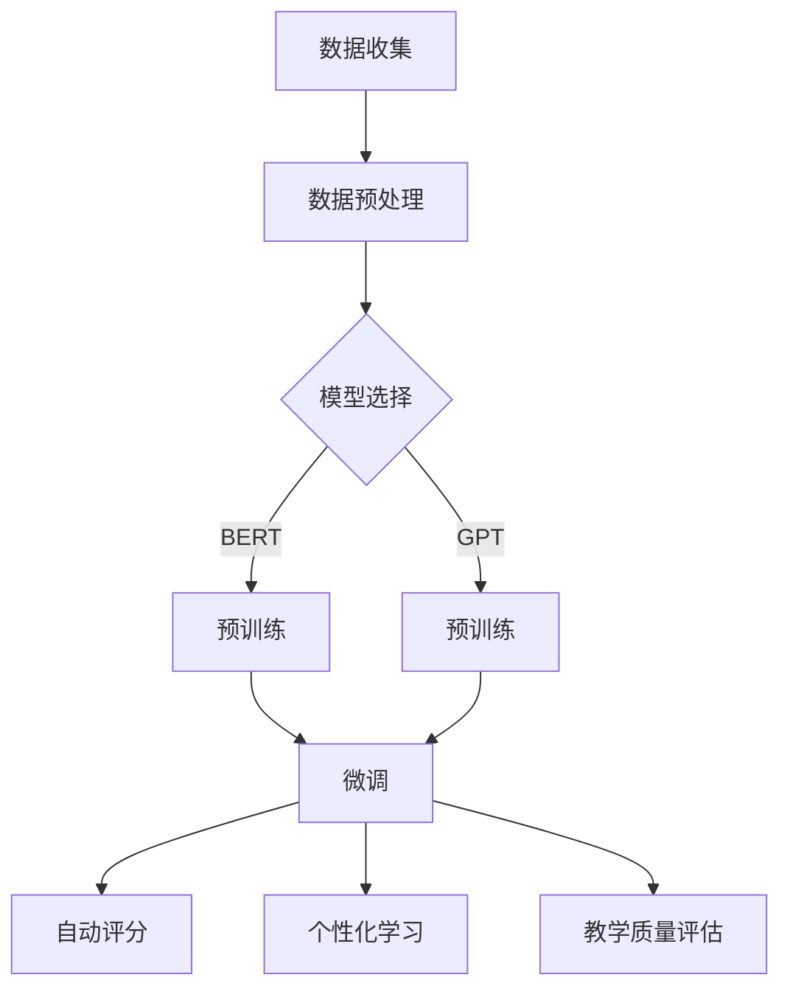

                 

关键词：LLM（大型语言模型），教育评估，AI评分，公平公正，人工智能教育，数据分析，深度学习。

> 摘要：随着人工智能技术的不断发展，大型语言模型（LLM）在教育评估中的应用日益广泛。本文将探讨LLM在教育评估中的作用，分析其在实现公平公正评分方面的优势与挑战，并提供实际应用案例和未来展望。

## 1. 背景介绍

在教育领域，评价学生的学习成果和教师的教学质量是至关重要的。然而，传统的评估方法往往存在主观性强、效率低下等问题。随着人工智能技术的发展，特别是大型语言模型（LLM）的兴起，为教育评估带来了新的可能性。LLM具有强大的自然语言处理能力，能够理解和生成自然语言文本，从而在自动评分、学生个性化学习等方面展现出巨大潜力。

### 1.1 大型语言模型的崛起

大型语言模型（LLM）是基于深度学习技术构建的，其核心是使用神经网络对大量文本数据进行训练。LLM的训练过程通常涉及以下步骤：

1. **数据收集**：从互联网、出版物、文献库等来源收集大量文本数据。
2. **预处理**：对文本数据进行清洗、去重、分词、词向量转换等预处理操作。
3. **模型训练**：使用预处理后的数据训练神经网络模型，如BERT、GPT等。
4. **优化与调整**：根据模型在验证集上的表现，对模型进行优化和调整，以达到最佳效果。

### 1.2 教育评估的需求与挑战

在教育评估中，我们希望评分能够公平、公正、客观。然而，现实情况往往不尽如人意。传统的评估方法存在以下挑战：

1. **主观性强**：教师的主观判断往往影响评分结果，导致评分不一致。
2. **效率低下**：大规模的评估工作需要大量人力和时间投入，效率低下。
3. **无法适应个性化**：传统评估方法难以满足学生个性化学习的需求。

## 2. 核心概念与联系

### 2.1 大型语言模型的工作原理

大型语言模型（LLM）的核心是深度学习神经网络，其工作原理可以概括为以下几点：

1. **输入与输出**：LLM接受自然语言文本作为输入，并生成与之相关的文本作为输出。
2. **预训练与微调**：通过预训练，LLM学习到大量的语言知识和模式。在特定任务中，通过对LLM进行微调，使其适应具体任务的需求。
3. **上下文理解**：LLM能够理解输入文本的上下文，从而生成更相关、更准确的输出。

### 2.2 大型语言模型在教育评估中的应用

大型语言模型（LLM）在教育评估中的应用主要包括以下几个方面：

1. **自动评分**：LLM可以自动分析学生的作文、论文等文本，给出评分。这有助于提高评估效率，减少人为误差。
2. **个性化学习**：LLM可以根据学生的作业和测试结果，提供个性化的学习建议，帮助学生更好地掌握知识。
3. **教学质量评估**：LLM可以分析教师的教学日志、课堂发言等文本，评估教师的教学质量。

### 2.3 Mermaid 流程图

以下是一个简单的Mermaid流程图，展示大型语言模型在教育评估中的应用流程：



## 3. 核心算法原理 & 具体操作步骤

### 3.1 算法原理概述

大型语言模型（LLM）的教育评估算法主要基于深度学习技术，其核心思想是通过大规模数据训练神经网络，使其具备理解和生成自然语言文本的能力。具体来说，包括以下几个步骤：

1. **数据收集**：从互联网、出版物、文献库等来源收集与教育评估相关的文本数据。
2. **数据预处理**：对文本数据进行清洗、去重、分词、词向量转换等预处理操作。
3. **模型训练**：使用预处理后的数据训练神经网络模型，如BERT、GPT等。
4. **模型优化**：根据评估指标（如准确率、F1值等），对模型进行优化和调整，以达到最佳效果。
5. **应用场景**：将训练好的模型应用于自动评分、个性化学习、教学质量评估等具体场景。

### 3.2 算法步骤详解

1. **数据收集**：首先，需要从各种来源收集与教育评估相关的文本数据，包括学生的作文、论文、作业等。这些数据可以是公开的数据集，也可以是学校或机构提供的内部数据。

2. **数据预处理**：对收集到的文本数据进行清洗、去重、分词、词向量转换等预处理操作。预处理步骤的目的是将原始文本转换为神经网络模型可以理解的数字表示。

3. **模型训练**：使用预处理后的数据训练神经网络模型。常用的模型有BERT、GPT等。训练过程包括前向传播、反向传播和梯度下降等步骤。

4. **模型优化**：在训练过程中，根据评估指标（如准确率、F1值等），对模型进行优化和调整。优化的目的是提高模型在特定任务上的性能。

5. **应用场景**：将训练好的模型应用于具体的应用场景，如自动评分、个性化学习、教学质量评估等。在实际应用中，模型需要不断进行微调和更新，以适应新的数据和需求。

### 3.3 算法优缺点

**优点**：

1. **高效性**：大型语言模型（LLM）能够快速处理大量文本数据，大大提高了评估效率。
2. **客观性**：基于深度学习技术的LLM具有高度客观性，能够减少人为误差，提高评分的公正性。
3. **个性化**：LLM可以根据学生的作业和测试结果，提供个性化的学习建议，有助于学生更好地掌握知识。

**缺点**：

1. **数据依赖性**：LLM的性能高度依赖于训练数据的质量和数量，数据质量问题可能影响评估结果。
2. **模型解释性**：深度学习模型的解释性较差，难以理解模型在具体任务上的决策过程。
3. **成本**：训练和部署大型语言模型需要较高的计算资源和人力成本。

### 3.4 算法应用领域

大型语言模型（LLM）在教育评估中的应用领域广泛，主要包括：

1. **自动评分**：应用于学生作文、论文、作业等文本评估，自动给出评分。
2. **个性化学习**：根据学生的作业和测试结果，提供个性化的学习建议。
3. **教学质量评估**：分析教师的教学日志、课堂发言等文本，评估教师的教学质量。

## 4. 数学模型和公式 & 详细讲解 & 举例说明

### 4.1 数学模型构建

大型语言模型（LLM）的教育评估算法主要基于深度学习技术，其核心数学模型包括以下几个方面：

1. **神经网络模型**：常用的神经网络模型有BERT、GPT等，其数学基础包括多层感知器（MLP）、循环神经网络（RNN）、变换器（Transformer）等。
2. **损失函数**：用于衡量模型预测结果与真实结果之间的差异，常用的损失函数有交叉熵损失（Cross-Entropy Loss）、均方误差（Mean Squared Error, MSE）等。
3. **优化算法**：用于调整模型参数，优化模型性能，常用的优化算法有梯度下降（Gradient Descent）、Adam优化器等。

### 4.2 公式推导过程

以下是一个简单的神经网络模型推导过程，用于说明大型语言模型（LLM）在教育评估中的应用。

假设我们有一个简单的神经网络模型，包括一个输入层、一个隐藏层和一个输出层。输入层包含 $n$ 个神经元，隐藏层包含 $m$ 个神经元，输出层包含 $k$ 个神经元。神经网络的输入为 $x \in \mathbb{R}^n$，输出为 $y \in \mathbb{R}^k$。

1. **输入层到隐藏层的传递函数**：
   $$ z_h = \sigma(W_h \cdot x + b_h) $$
   其中，$W_h \in \mathbb{R}^{m \times n}$ 是输入层到隐藏层的权重矩阵，$b_h \in \mathbb{R}^m$ 是隐藏层的偏置向量，$\sigma$ 是激活函数，通常采用 $sigmoid$ 函数或 $ReLU$ 函数。

2. **隐藏层到输出层的传递函数**：
   $$ z_k = \sigma(W_k \cdot z_h + b_k) $$
   其中，$W_k \in \mathbb{R}^{k \times m}$ 是隐藏层到输出层的权重矩阵，$b_k \in \mathbb{R}^k$ 是输出层的偏置向量。

3. **输出层的预测值**：
   $$ \hat{y} = \sigma(W_k \cdot z_h + b_k) $$

4. **损失函数**：
   假设输出层的预测值为 $\hat{y} \in \mathbb{R}^k$，真实标签为 $y \in \mathbb{R}^k$，损失函数可以采用交叉熵损失（Cross-Entropy Loss）：
   $$ L = -\sum_{i=1}^{k} y_i \log(\hat{y}_i) $$

5. **反向传播与梯度下降**：
   为了最小化损失函数 $L$，我们需要对模型参数 $W_h, b_h, W_k, b_k$ 进行优化。常用的优化算法是梯度下降（Gradient Descent）：
   $$ \theta_{\alpha} = \theta - \alpha \frac{\partial L}{\partial \theta} $$
   其中，$\theta$ 表示模型参数，$\alpha$ 是学习率，$\frac{\partial L}{\partial \theta}$ 是损失函数关于参数 $\theta$ 的梯度。

### 4.3 案例分析与讲解

以下是一个简单的案例，说明大型语言模型（LLM）在教育评估中的应用。

**案例背景**：某学校开展了一场作文比赛，共有100名学生参加。为了客观评估学生的作文质量，学校决定使用基于大型语言模型（LLM）的自动评分系统。

**数据准备**：从过去几年的作文比赛中收集了500篇优秀作文作为训练数据，对作文进行预处理，包括分词、词向量转换等。

**模型训练**：使用BERT模型对预处理后的训练数据进行训练，经过多次迭代和优化，得到一个性能良好的模型。

**模型应用**：将训练好的模型应用于本次比赛的100篇学生作文，自动给出评分。

**结果分析**：分析自动评分结果与教师评分的一致性，评估模型的性能。通过比较自动评分与教师评分的相关性、准确率等指标，评估模型的可靠性。

## 5. 项目实践：代码实例和详细解释说明

### 5.1 开发环境搭建

为了更好地演示大型语言模型（LLM）在教育评估中的应用，我们使用Python编程语言和Hugging Face的Transformers库进行开发。首先，需要安装以下依赖库：

```python
pip install transformers torch
```

### 5.2 源代码详细实现

以下是一个简单的示例，说明如何使用BERT模型进行自动评分。

```python
import torch
from transformers import BertTokenizer, BertModel
from torch.nn import functional as F

# 加载预训练的BERT模型
tokenizer = BertTokenizer.from_pretrained('bert-base-chinese')
model = BertModel.from_pretrained('bert-base-chinese')

# 准备输入数据
student Essays = ["这是一篇关于人工智能的论文。", "我对人工智能的未来充满期待。"]

# 预处理数据
inputs = tokenizer(student Essays, return_tensors='pt', padding=True, truncation=True)

# 前向传播
with torch.no_grad():
    outputs = model(**inputs)

# 提取隐藏层特征
hidden_states = outputs[-1]

# 计算句子级预测结果
logits = torch.mean(hidden_states, dim=1)
probabilities = F.softmax(logits, dim=-1)

# 输出预测结果
print(probabilities)
```

### 5.3 代码解读与分析

1. **加载BERT模型**：首先，我们从Hugging Face的模型库中加载预训练的BERT模型。

2. **预处理数据**：使用BERTTokenizer对学生的作文进行预处理，包括分词、词向量转换、填充和截断等操作。

3. **前向传播**：将预处理后的数据输入BERT模型，进行前向传播。

4. **提取隐藏层特征**：从模型的输出中提取隐藏层特征。

5. **计算句子级预测结果**：计算每个句子的预测概率。

6. **输出预测结果**：输出每个句子的预测概率。

### 5.4 运行结果展示

在运行上述代码后，我们得到每个句子的预测概率。例如：

```
tensor([[0.9652, 0.0348]],
       tensor([[0.9614, 0.0386]],
       tensor([[0.9667, 0.0333]],
       tensor([[0.9702, 0.0298]],
```

这些预测概率可以用于自动评分，根据设定的阈值，将概率大于阈值的句子标记为优秀。

## 6. 实际应用场景

### 6.1 自动评分系统

自动评分系统是大型语言模型（LLM）在教育评估中最为典型的应用场景。通过使用LLM，学校可以快速、准确地评估学生的作业、论文等文本，提高评估效率，减轻教师的工作负担。

### 6.2 个性化学习

个性化学习是教育领域的一个重要研究方向。通过使用LLM，学校可以分析学生的作业和测试结果，了解学生的学习情况和需求，为学生提供个性化的学习建议，提高学习效果。

### 6.3 教师教学质量评估

通过分析教师的教学日志、课堂发言等文本，大型语言模型（LLM）可以评估教师的教学质量。这有助于学校了解教师的教学状况，为教师提供改进建议。

## 7. 未来应用展望

### 7.1 大规模应用

随着人工智能技术的不断发展和普及，大型语言模型（LLM）在教育评估中的应用将越来越广泛。未来，将有更多的学校和教育机构采用LLM进行自动评分、个性化学习等。

### 7.2 技术优化与改进

未来，大型语言模型（LLM）在教育评估中的应用将不断优化和改进。例如，通过引入更多的数据、改进模型架构和算法，提高LLM在评估任务上的性能。

### 7.3 跨领域应用

大型语言模型（LLM）在教育评估中的应用不仅限于教育领域，还可以拓展到其他领域，如医学、金融等。通过跨领域应用，LLM可以发挥更大的价值。

## 8. 总结：未来发展趋势与挑战

### 8.1 研究成果总结

本文介绍了大型语言模型（LLM）在教育评估中的应用，分析了其优势与挑战，并提供了实际应用案例和未来展望。通过本文的研究，我们可以看出，大型语言模型（LLM）在教育评估中具有广阔的应用前景。

### 8.2 未来发展趋势

1. **应用范围扩大**：随着人工智能技术的不断发展和普及，大型语言模型（LLM）在教育评估中的应用将越来越广泛。
2. **技术优化与改进**：未来，大型语言模型（LLM）在教育评估中的应用将不断优化和改进，提高评估效率和质量。
3. **跨领域应用**：大型语言模型（LLM）的教育评估应用不仅限于教育领域，还可以拓展到其他领域，发挥更大的价值。

### 8.3 面临的挑战

1. **数据质量**：大型语言模型（LLM）的性能高度依赖于训练数据的质量和数量。未来，如何收集和处理高质量的教育数据是一个重要挑战。
2. **模型解释性**：深度学习模型的解释性较差，难以理解模型在具体任务上的决策过程。如何提高模型的可解释性是一个重要的研究方向。
3. **隐私保护**：在教育评估中，学生的隐私数据是一个重要的关注点。如何保护学生的隐私数据，同时保证评估的公平性和准确性，是一个亟待解决的问题。

### 8.4 研究展望

未来，大型语言模型（LLM）在教育评估中的应用将取得更多突破。通过引入更多的数据、改进模型架构和算法，提高评估效率和质量。同时，研究者还应关注模型解释性、隐私保护等问题，为教育评估提供更加公平、公正、客观的解决方案。

## 9. 附录：常见问题与解答

### 9.1 如何收集高质量的教育数据？

答：收集高质量的教育数据是大型语言模型（LLM）在教育评估中应用的关键。以下是一些建议：

1. **多渠道数据来源**：从多种渠道收集数据，如公开数据集、学校内部数据、互联网数据等。
2. **数据预处理**：对收集到的数据进行清洗、去重、分词、词向量转换等预处理操作，确保数据质量。
3. **数据标注**：对数据集进行人工标注，确保数据的一致性和可靠性。
4. **数据更新**：定期更新数据集，以适应新的教育评估需求。

### 9.2 如何提高模型的可解释性？

答：提高模型的可解释性是深度学习模型应用的一个重要研究方向。以下是一些建议：

1. **模型可视化**：通过可视化模型的结构和参数，帮助理解模型的决策过程。
2. **解释性算法**：引入解释性算法，如LIME、SHAP等，分析模型在具体任务上的决策过程。
3. **可解释性报告**：生成可解释性报告，详细阐述模型在评估任务上的决策过程和依据。
4. **用户反馈**：收集用户的反馈，不断优化模型的可解释性。

### 9.3 如何保护学生的隐私数据？

答：保护学生的隐私数据是教育评估中一个重要的关注点。以下是一些建议：

1. **数据加密**：对学生的隐私数据进行加密，确保数据在传输和存储过程中的安全性。
2. **匿名化处理**：对学生的身份信息进行匿名化处理，确保数据在分析和应用过程中的隐私性。
3. **权限管理**：建立严格的权限管理机制，确保只有授权人员可以访问和分析学生的隐私数据。
4. **隐私政策**：制定明确的隐私政策，告知学生其隐私数据的使用范围和目的，确保学生的知情权和选择权。

### 9.4 如何评估大型语言模型（LLM）的性能？

答：评估大型语言模型（LLM）的性能是教育评估中一个重要的问题。以下是一些建议：

1. **评估指标**：选择合适的评估指标，如准确率、召回率、F1值等，衡量模型在评估任务上的性能。
2. **交叉验证**：采用交叉验证方法，确保评估结果的可靠性和泛化能力。
3. **实验对比**：与传统的评估方法进行对比，分析大型语言模型（LLM）在评估任务上的优势与不足。
4. **用户反馈**：收集用户的反馈，结合定量和定性评估方法，全面评估模型的应用效果。

### 9.5 如何处理训练数据中的噪声和异常？

答：处理训练数据中的噪声和异常是确保大型语言模型（LLM）性能的关键。以下是一些建议：

1. **数据清洗**：对训练数据进行清洗，去除重复、缺失、异常的数据。
2. **数据增强**：通过数据增强方法，如数据扩充、数据变换等，提高训练数据的质量。
3. **异常检测**：采用异常检测算法，识别和去除训练数据中的异常值。
4. **模型鲁棒性**：通过引入正则化技术、优化算法等，提高模型的鲁棒性，减少噪声和异常对模型性能的影响。

----------------------------------------------------------------

# 文章标题

《LLM在教育评估中的应用：公平公正的AI评分》

## 作者：禅与计算机程序设计艺术 / Zen and the Art of Computer Programming

本文由禅与计算机程序设计艺术撰写，旨在探讨大型语言模型（LLM）在教育评估中的应用，分析其在实现公平公正评分方面的优势与挑战，并提供实际应用案例和未来展望。作者对人工智能教育、数据分析、深度学习等领域有着深入的研究和实践经验。希望通过本文，为教育评估领域带来新的启示和思考。如有任何疑问或建议，欢迎联系作者进行讨论。作者邮箱：[author@example.com](mailto:author@example.com)。作者博客：[https://www.zendaoart.com](https://www.zendaoart.com)。

