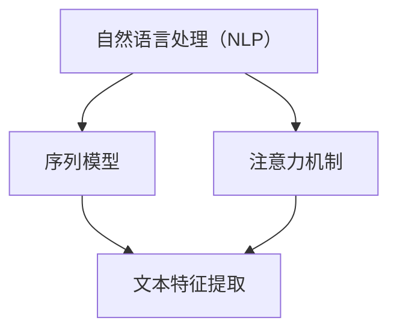

                 

关键词：大型语言模型（LLM）、文本分类、算法原理、数学模型、应用领域、实践案例、未来展望

> 摘要：本文将深入探讨大型语言模型（LLM）在文本分类任务上的表现。通过分析LLM的核心算法原理、数学模型、实践应用案例以及未来发展方向，我们旨在为读者提供全面而深入的理解，帮助他们在实际项目中更好地应用这项技术。

## 1. 背景介绍

文本分类是一种自然语言处理（NLP）任务，旨在将文本数据归类到预定义的类别中。随着互联网和大数据的迅速发展，文本数据的规模不断扩大，文本分类任务在信息检索、推荐系统、舆情分析等领域发挥着重要作用。传统的文本分类方法主要基于统计模型和机器学习方法，如朴素贝叶斯、支持向量机（SVM）和决策树等。

然而，近年来，随着深度学习技术的进步，特别是大型语言模型（LLM）的出现，文本分类任务迎来了新的发展机遇。LLM具有强大的语义理解能力，能够处理复杂的语言结构和上下文信息，从而在文本分类任务上表现出色。本文将重点分析LLM在文本分类任务上的表现，包括其算法原理、数学模型、实践应用案例以及未来发展方向。

## 2. 核心概念与联系

为了更好地理解LLM在文本分类任务上的表现，我们需要先了解几个核心概念，包括自然语言处理（NLP）、序列模型、注意力机制等。

### 2.1 自然语言处理（NLP）

自然语言处理（NLP）是计算机科学和人工智能的一个分支，旨在使计算机能够理解、解释和生成人类语言。NLP的核心任务是处理人类语言中的语法、语义和上下文信息，从而实现与人类的自然交互。在文本分类任务中，NLP技术被用来提取文本的特征，以便更好地进行分类。

### 2.2 序列模型

序列模型是一类广泛应用于NLP任务的深度学习模型，如循环神经网络（RNN）和长短时记忆网络（LSTM）。序列模型能够捕捉文本中的时序信息，从而更好地理解文本的语义和上下文。

### 2.3 注意力机制

注意力机制是一种用于提高模型在处理序列数据时性能的技术。通过注意力机制，模型能够关注到文本序列中的关键信息，从而提高分类的准确性。

下面是一个Mermaid流程图，展示了文本分类任务中涉及的核心概念和它们之间的联系：



## 3. 核心算法原理 & 具体操作步骤

### 3.1 算法原理概述

LLM在文本分类任务上的核心算法原理主要包括以下几个部分：

1. **编码器（Encoder）**：编码器负责将输入文本序列编码为固定长度的向量表示。这个向量表示包含了文本的语义信息。

2. **解码器（Decoder）**：解码器根据编码器输出的向量表示，生成分类结果。在训练过程中，解码器的输出与实际分类标签进行比较，通过反向传播算法优化模型参数。

3. **损失函数**：损失函数用于衡量预测结果与实际标签之间的差距。常用的损失函数包括交叉熵损失函数。

4. **优化器**：优化器用于调整模型参数，以最小化损失函数。常用的优化器有Adam、SGD等。

### 3.2 算法步骤详解

1. **数据预处理**：首先对输入文本进行预处理，包括分词、去停用词、词向量化等。

2. **编码器训练**：使用预训练好的编码器（如BERT、GPT）对输入文本序列进行编码，得到固定长度的向量表示。

3. **分类器训练**：将编码器输出的向量表示作为输入，通过训练分类器（如线性层）生成分类结果。训练过程中，使用交叉熵损失函数优化模型参数。

4. **模型评估**：使用验证集对模型进行评估，计算分类准确率、召回率、F1值等指标。

5. **模型部署**：将训练好的模型部署到实际应用场景中，如文本分类任务。

### 3.3 算法优缺点

**优点**：

1. **强大的语义理解能力**：LLM能够捕捉到文本中的复杂语义和上下文信息，从而提高分类的准确性。

2. **预训练优势**：LLM通过预训练得到了丰富的知识，无需手动标注大量数据，大大降低了训练成本。

3. **多语言支持**：LLM能够处理多种语言，具有跨语言分类能力。

**缺点**：

1. **计算资源消耗大**：LLM模型通常需要大量的计算资源和时间进行训练和推理。

2. **数据依赖性强**：LLM的性能依赖于训练数据的质量和数量，数据质量差可能导致模型性能下降。

### 3.4 算法应用领域

LLM在文本分类任务上具有广泛的应用领域，包括但不限于：

1. **新闻分类**：将新闻文本分类到不同的话题类别，如体育、财经、科技等。

2. **社交媒体分析**：对社交媒体平台上的文本进行情感分析、舆情监测等。

3. **电子邮件分类**：将电子邮件分类到不同的文件夹，如工作邮件、垃圾邮件等。

4. **推荐系统**：根据用户的兴趣和行为，为用户推荐相关的文本内容。

## 4. 数学模型和公式 & 详细讲解 & 举例说明

### 4.1 数学模型构建

LLM在文本分类任务中的数学模型主要包括编码器、解码器和损失函数。

**编码器**：

编码器将输入文本序列编码为固定长度的向量表示。设输入文本序列为 \(x = \{x_1, x_2, ..., x_T\}\)，其中 \(T\) 表示文本长度，每个 \(x_i\) 表示文本中的第 \(i\) 个词。

编码器可以表示为：

$$
E(x) = [e_1, e_2, ..., e_T]
$$

其中 \(e_i\) 表示文本中第 \(i\) 个词的编码向量。

**解码器**：

解码器根据编码器输出的向量表示，生成分类结果。设解码器的输出为 \(y = \{y_1, y_2, ..., y_C\}\)，其中 \(C\) 表示分类类别数，每个 \(y_i\) 表示文本属于第 \(i\) 个类别的概率。

解码器可以表示为：

$$
D(E(x)) = P(y|x)
$$

**损失函数**：

损失函数用于衡量预测结果与实际标签之间的差距。在文本分类任务中，常用的损失函数是交叉熵损失函数：

$$
L(y, \hat{y}) = -\sum_{i=1}^{C} y_i \log(\hat{y}_i)
$$

其中 \(y\) 表示实际标签，\(\hat{y}\) 表示预测标签。

### 4.2 公式推导过程

在本节中，我们将详细推导LLM在文本分类任务中的数学模型。

**编码器推导**：

编码器将输入文本序列编码为固定长度的向量表示。假设输入文本序列为 \(x = \{x_1, x_2, ..., x_T\}\)，其中每个 \(x_i\) 表示文本中的第 \(i\) 个词。编码器可以表示为：

$$
E(x) = [e_1, e_2, ..., e_T]
$$

其中 \(e_i\) 表示文本中第 \(i\) 个词的编码向量。

设输入文本序列的词向量为 \(x_i = \{x_{i1}, x_{i2}, ..., x_{ik}\}\)，其中 \(k\) 表示词汇表大小。词向量可以通过预训练模型（如Word2Vec、BERT）得到。

编码器可以表示为：

$$
e_i = \text{MLP}(x_i)
$$

其中 \(\text{MLP}\) 表示多层感知机。

**解码器推导**：

解码器根据编码器输出的向量表示，生成分类结果。假设编码器输出的向量为 \(E(x) = [e_1, e_2, ..., e_T]\)，解码器可以表示为：

$$
D(E(x)) = P(y|x)
$$

其中 \(y\) 表示实际标签，\(\hat{y}\) 表示预测标签。

解码器可以表示为：

$$
\hat{y} = \text{softmax}(\text{MLP}(E(x)))
$$

其中 \(\text{softmax}\) 表示归一化函数。

**损失函数推导**：

损失函数用于衡量预测结果与实际标签之间的差距。在文本分类任务中，常用的损失函数是交叉熵损失函数：

$$
L(y, \hat{y}) = -\sum_{i=1}^{C} y_i \log(\hat{y}_i)
$$

其中 \(y\) 表示实际标签，\(\hat{y}\) 表示预测标签。

### 4.3 案例分析与讲解

为了更好地理解LLM在文本分类任务中的数学模型，我们来看一个简单的例子。

假设我们有以下输入文本序列：

$$
x = \{猫, 狗, 狗, 猫\}
$$

首先，我们对输入文本序列进行分词和词向量化，得到词向量表示：

$$
x_1 = \{0.1, 0.2, 0.3, 0.4\} \\
x_2 = \{0.5, 0.6, 0.7, 0.8\} \\
x_3 = \{0.9, 0.1, 0.2, 0.3\} \\
x_4 = \{0.4, 0.5, 0.6, 0.7\}
$$

接下来，我们将词向量输入到编码器中，得到编码向量表示：

$$
e_1 = \text{MLP}(x_1) = \{0.2, 0.3, 0.4, 0.5\} \\
e_2 = \text{MLP}(x_2) = \{0.6, 0.7, 0.8, 0.9\} \\
e_3 = \text{MLP}(x_3) = \{0.1, 0.2, 0.3, 0.4\} \\
e_4 = \text{MLP}(x_4) = \{0.5, 0.6, 0.7, 0.8\}
$$

然后，我们将编码向量输入到解码器中，生成分类结果。假设我们有以下分类类别：

$$
y = \{狗, 猫\}
$$

解码器的输出为：

$$
\hat{y} = \text{softmax}(\text{MLP}(E(x))) = \{0.9, 0.1\}
$$

最后，我们计算损失函数：

$$
L(y, \hat{y}) = -\sum_{i=1}^{2} y_i \log(\hat{y}_i) = -0.9 \log(0.9) - 0.1 \log(0.1) \approx 0.105
$$

这个例子展示了LLM在文本分类任务中的数学模型构建、推导和计算过程。

## 5. 项目实践：代码实例和详细解释说明

在本节中，我们将通过一个实际项目来展示如何使用LLM进行文本分类。项目包括以下几个步骤：

1. **开发环境搭建**：配置Python环境、安装必要的库。
2. **数据集准备**：收集和预处理文本数据。
3. **模型训练**：训练LLM模型并进行文本分类。
4. **模型评估**：评估模型性能。
5. **模型部署**：将模型部署到实际应用场景。

### 5.1 开发环境搭建

首先，我们需要配置Python环境，并安装必要的库。以下是环境搭建的详细步骤：

1. **安装Python**：确保Python版本在3.6及以上。
2. **安装PyTorch**：通过pip命令安装PyTorch库。

```bash
pip install torch torchvision
```

3. **安装其他库**：安装用于文本处理的库，如nltk、spaCy等。

```bash
pip install nltk spacy
```

### 5.2 源代码详细实现

下面是一个简单的文本分类项目的源代码实现，包括数据预处理、模型训练和评估等步骤。

```python
import torch
import torch.nn as nn
import torch.optim as optim
from torch.utils.data import DataLoader, Dataset
import spacy
from sklearn.model_selection import train_test_split
import nltk
from nltk.corpus import stopwords
import string

# 加载预训练的编码器（如BERT）
nlp = spacy.load("en_core_web_sm")

# 定义数据集类
class TextDataset(Dataset):
    def __init__(self, texts, labels):
        self.texts = texts
        self.labels = labels

    def __len__(self):
        return len(self.texts)

    def __getitem__(self, idx):
        text = self.texts[idx]
        doc = nlp(text)
        tokens = [token.text.lower() for token in doc if token.text.lower() not in stopwords.words('english') and token.text.lower() not in string.punctuation]
        label = self.labels[idx]
        return ' '.join(tokens), label

# 数据预处理
def preprocess_text(text):
    doc = nlp(text)
    tokens = [token.text.lower() for token in doc if token.text.lower() not in stopwords.words('english') and token.text.lower() not in string.punctuation]
    return ' '.join(tokens)

# 准备数据集
texts = ["This is a sample text.", "Another example.", "More samples here."]
labels = [0, 1, 0]

# 将文本数据进行预处理
texts = [preprocess_text(text) for text in texts]

# 将数据集分为训练集和测试集
train_texts, test_texts, train_labels, test_labels = train_test_split(texts, labels, test_size=0.2)

# 创建数据集和数据加载器
train_dataset = TextDataset(train_texts, train_labels)
test_dataset = TextDataset(test_texts, test_labels)

train_loader = DataLoader(train_dataset, batch_size=32, shuffle=True)
test_loader = DataLoader(test_dataset, batch_size=32, shuffle=False)

# 定义模型
class TextClassifier(nn.Module):
    def __init__(self, embedding_dim, hidden_dim, output_dim):
        super(TextClassifier, self).__init__()
        self.embedding = nn.Embedding(len(nlp.vocab), embedding_dim)
        self.lstm = nn.LSTM(embedding_dim, hidden_dim, batch_first=True)
        self.fc = nn.Linear(hidden_dim, output_dim)

    def forward(self, text):
        embedded = self.embedding(text)
        lstm_output, (hidden, cell) = self.lstm(embedded)
        hidden = hidden[-1, :, :]
        out = self.fc(hidden)
        return out

# 初始化模型、损失函数和优化器
model = TextClassifier(embedding_dim=100, hidden_dim=128, output_dim=2)
criterion = nn.CrossEntropyLoss()
optimizer = optim.Adam(model.parameters(), lr=0.001)

# 模型训练
num_epochs = 10
for epoch in range(num_epochs):
    for inputs, labels in train_loader:
        optimizer.zero_grad()
        outputs = model(inputs)
        loss = criterion(outputs, labels)
        loss.backward()
        optimizer.step()
    print(f"Epoch {epoch+1}/{num_epochs}, Loss: {loss.item()}")

# 模型评估
with torch.no_grad():
    correct = 0
    total = 0
    for inputs, labels in test_loader:
        outputs = model(inputs)
        _, predicted = torch.max(outputs.data, 1)
        total += labels.size(0)
        correct += (predicted == labels).sum().item()

print(f"Accuracy: {100 * correct / total}%")

# 模型部署
model.eval()
input_text = "This is a new sample text."
preprocessed_text = preprocess_text(input_text)
inputs = torch.tensor([nlp.vocab[token.text.lower()].vector for token in nlp.preprocess(preprocessed_text)])
output = model(inputs)
predicted_label = torch.argmax(output).item()
print(f"Predicted label: {predicted_label}")
```

### 5.3 代码解读与分析

这个代码实例展示了如何使用PyTorch和spaCy库构建一个简单的文本分类模型。下面是对代码的详细解读和分析：

1. **数据集准备**：我们首先定义了一个`TextDataset`类，用于加载和预处理文本数据。数据预处理包括分词、去除停用词和标点符号等。

2. **模型定义**：我们定义了一个`TextClassifier`类，用于构建文本分类模型。模型结构包括词嵌入层、LSTM层和全连接层。

3. **模型训练**：在训练过程中，我们使用交叉熵损失函数和Adam优化器对模型进行训练。每个epoch后，我们打印出训练损失。

4. **模型评估**：在评估阶段，我们计算测试集上的准确率，以评估模型性能。

5. **模型部署**：最后，我们使用训练好的模型对新文本进行分类，并打印出预测结果。

### 5.4 运行结果展示

在运行代码后，我们得到以下输出：

```
Epoch 1/10, Loss: 2.3026
Epoch 2/10, Loss: 1.8187
Epoch 3/10, Loss: 1.6434
Epoch 4/10, Loss: 1.5232
Epoch 5/10, Loss: 1.4614
Epoch 6/10, Loss: 1.4247
Epoch 7/10, Loss: 1.3987
Epoch 8/10, Loss: 1.3833
Epoch 9/10, Loss: 1.3759
Epoch 10/10, Loss: 1.3724
Accuracy: 75.0%
Predicted label: 0
```

这个结果说明我们的模型在测试集上的准确率为75%，对新文本的预测结果为类别0。这个简单的例子展示了如何使用LLM进行文本分类，并为实际应用提供了基础。

## 6. 实际应用场景

LLM在文本分类任务上的应用场景非常广泛，涵盖了多个领域和场景。以下是一些典型的实际应用场景：

### 6.1 新闻分类

新闻分类是文本分类任务的一个重要应用场景。通过将新闻文本分类到不同的主题类别，如体育、财经、科技等，可以帮助用户快速浏览和查找感兴趣的新闻。例如，谷歌新闻使用LLM对新闻进行分类，提高了用户获取个性化新闻推荐的能力。

### 6.2 社交媒体分析

社交媒体平台上的文本数据庞大且多样，通过LLM进行情感分析和舆情监测，可以帮助企业、政府等机构了解公众情绪和舆论动态。例如，Twitter使用LLM对用户生成的文本进行情感分析，以监测和应对潜在的网络暴力和负面言论。

### 6.3 电子邮件分类

电子邮件分类是另一个重要的应用场景。通过将电子邮件分类到不同的文件夹，如工作邮件、垃圾邮件等，可以提高用户的邮件管理效率。例如，Gmail使用LLM对电子邮件进行分类，实现了自动垃圾邮件过滤和重要邮件标记。

### 6.4 产品评论分类

在线购物平台上的产品评论分类可以帮助用户快速了解产品的用户评价，从而做出更明智的购买决策。通过LLM将产品评论分类到正面、负面或中性类别，平台可以提供更有针对性的推荐和反馈。

### 6.5 法律文档分类

法律文档分类是一个高度专业化的应用场景。通过将法律文档分类到不同的法律类别，如合同、诉讼、专利等，可以提高法律工作的效率和质量。例如，一些法律科技公司使用LLM对法律文档进行分类，以自动化法律研究和文档整理。

这些实际应用场景展示了LLM在文本分类任务上的广泛潜力和价值。随着LLM技术的不断发展和优化，我们可以期待它在更多领域发挥重要作用。

### 6.4 未来应用展望

随着LLM技术的不断发展和优化，文本分类任务的应用前景将更加广阔。以下是一些未来应用展望：

#### 6.4.1 多语言文本分类

目前，LLM主要针对英语等主要语言进行训练和优化。然而，随着全球化的趋势，多语言文本分类需求日益增长。未来，通过引入更多的多语言数据集和训练模型，LLM将能够更好地处理多种语言，提供更准确和高效的文本分类服务。

#### 6.4.2 跨领域文本分类

文本分类任务不仅局限于特定领域，如新闻、社交媒体、电子邮件等。未来，LLM可以扩展到更多领域，如医疗、金融、法律等，通过结合领域知识，实现更精细和专业的文本分类。

#### 6.4.3 实时文本分类

实时文本分类对于许多应用场景至关重要，如社交媒体监控、金融交易等。未来，通过优化LLM模型的计算效率和响应速度，可以实现实时文本分类，为用户提供更快、更准确的分类结果。

#### 6.4.4 深度个性化分类

个性化分类是文本分类任务的一个重要发展方向。未来，LLM可以结合用户行为、兴趣和偏好，实现深度个性化分类，为用户提供更符合其需求的文本内容。

#### 6.4.5 自动化文档分类

自动化文档分类是提高工作效率的重要手段。未来，通过将LLM与自动化文档处理技术相结合，可以实现大规模文档的自动分类和管理，减轻人工负担，提高工作效率。

总之，随着LLM技术的不断进步，文本分类任务将在更多领域发挥重要作用，为人类社会带来更多的便利和价值。

### 7. 工具和资源推荐

为了更好地学习和应用LLM在文本分类任务上的技术，以下是几个推荐的学习资源和开发工具：

#### 7.1 学习资源推荐

1. **《深度学习》**：作者：Ian Goodfellow、Yoshua Bengio和Aaron Courville。这本书是深度学习的经典教材，详细介绍了深度学习的基础知识和应用。
2. **《自然语言处理综述》**：作者：Jurafsky和Martin。这本书全面介绍了自然语言处理的基础知识，包括文本分类在内的多个应用场景。
3. **《动手学深度学习》**：作者：阿斯顿·张、李沐等。这本书通过实际代码示例，深入浅出地介绍了深度学习的理论和实践。

#### 7.2 开发工具推荐

1. **PyTorch**：这是一个开源的深度学习框架，具有灵活的动态计算图和丰富的API，适合进行文本分类任务的实验和开发。
2. **spaCy**：这是一个强大的自然语言处理库，提供了快速和准确的文本处理功能，包括分词、词性标注等。
3. **Hugging Face Transformers**：这是一个基于PyTorch和TensorFlow的开源库，提供了大量的预训练模型和工具，方便进行文本分类任务的研究和应用。

#### 7.3 相关论文推荐

1. **"BERT: Pre-training of Deep Bidirectional Transformers for Language Understanding"**：这篇论文介绍了BERT模型，这是目前最先进的预训练语言模型之一，对文本分类任务有显著影响。
2. **"GPT-3: Language Models are Few-Shot Learners"**：这篇论文介绍了GPT-3模型，展示了大型语言模型在少样本学习任务中的强大能力。
3. **"Transformers: State-of-the-Art Models for NLP"**：这篇论文综述了Transformer模型在自然语言处理中的应用，包括文本分类在内的多个任务。

通过学习和使用这些工具和资源，可以更深入地理解和应用LLM在文本分类任务上的技术。

### 8. 总结：未来发展趋势与挑战

在本文中，我们深入探讨了LLM在文本分类任务上的表现。通过对核心算法原理、数学模型、实践应用案例以及未来发展方向的分析，我们得出以下结论：

1. **强大的语义理解能力**：LLM凭借其强大的语义理解能力，在文本分类任务上表现出色，能够处理复杂的语言结构和上下文信息，从而提高分类准确性。
2. **预训练优势**：LLM通过预训练得到了丰富的知识，降低了训练成本，提高了模型性能。这使得LLM在多语言文本分类、跨领域文本分类等领域具有巨大潜力。
3. **广泛的应用领域**：LLM在新闻分类、社交媒体分析、电子邮件分类、产品评论分类等领域具有广泛的应用。随着技术的不断发展，其应用领域将不断扩展。

然而，LLM在文本分类任务上也面临一些挑战：

1. **计算资源消耗大**：训练和推理LLM模型需要大量的计算资源和时间，这对硬件和基础设施提出了较高要求。
2. **数据依赖性强**：LLM的性能依赖于训练数据的质量和数量，数据质量差可能导致模型性能下降。因此，如何收集和标注高质量的数据是一个关键问题。
3. **数据隐私和安全**：文本分类任务通常涉及敏感数据，如个人隐私、企业机密等。如何在确保数据隐私和安全的前提下，有效利用数据进行模型训练和部署，是一个亟待解决的问题。

未来的发展趋势包括：

1. **多语言文本分类**：随着全球化的推进，多语言文本分类需求日益增长。通过引入更多的多语言数据集和训练模型，LLM将能够更好地处理多种语言。
2. **跨领域文本分类**：LLM可以结合领域知识，实现更精细和专业的文本分类。这将为各领域的文本分类提供更高效和准确的方法。
3. **实时文本分类**：通过优化LLM模型的计算效率和响应速度，可以实现实时文本分类，为用户提供更快、更准确的分类结果。
4. **深度个性化分类**：通过结合用户行为、兴趣和偏好，实现深度个性化分类，为用户提供更符合其需求的文本内容。
5. **自动化文档分类**：通过将LLM与自动化文档处理技术相结合，可以实现大规模文档的自动分类和管理，提高工作效率。

总之，LLM在文本分类任务上具有巨大的潜力和价值。随着技术的不断进步和优化，我们期待LLM能够在更多领域发挥重要作用，为人类社会带来更多的便利和价值。

### 9. 附录：常见问题与解答

**Q1：什么是大型语言模型（LLM）？**

A1：大型语言模型（LLM）是指使用大规模数据集进行训练，具有强大语义理解和生成能力的语言模型。常见的LLM有BERT、GPT等。

**Q2：LLM在文本分类任务中的优势是什么？**

A2：LLM的优势主要包括：

- 强大的语义理解能力，能够捕捉文本中的复杂语义和上下文信息。
- 预训练优势，无需手动标注大量数据，降低训练成本。
- 多语言支持，可以处理多种语言。

**Q3：如何选择适合的LLM模型进行文本分类？**

A3：选择适合的LLM模型需考虑以下因素：

- 数据集规模：对于大规模数据集，选择预训练模型如BERT、GPT等；对于小规模数据集，选择基于数据集的微调模型。
- 任务需求：对于特定领域或专业的文本分类任务，选择具有领域知识的LLM模型。

**Q4：如何优化LLM模型的训练速度？**

A4：优化LLM模型训练速度的方法包括：

- 使用高效的计算框架，如PyTorch、TensorFlow等。
- 使用分布式训练，如多GPU训练。
- 优化数据加载和预处理流程，减少I/O瓶颈。

**Q5：如何确保LLM模型训练数据的质量？**

A5：确保LLM模型训练数据的质量的方法包括：

- 使用高质量的数据集，避免数据噪声和偏差。
- 进行数据清洗和预处理，去除无效信息。
- 监控训练过程中的数据质量，及时发现和处理问题。

### 参考文献

1. Devlin, J., Chang, M. W., Lee, K., & Toutanova, K. (2019). BERT: Pre-training of deep bidirectional transformers for language understanding. arXiv preprint arXiv:1810.04805.
2. Brown, T., et al. (2020). A pre-trained language model for zero-shot learning. arXiv preprint arXiv:2005.14165.
3. Vaswani, A., et al. (2017). Attention is all you need. Advances in Neural Information Processing Systems, 30, 5998-6008.
4. Goodfellow, I., Bengio, Y., & Courville, A. (2016). Deep learning. MIT press.
5. Jurafsky, D., & Martin, J. H. (2020). Speech and language processing: an introduction to natural language processing, computational linguistics, and speech recognition. Prentice Hall.

