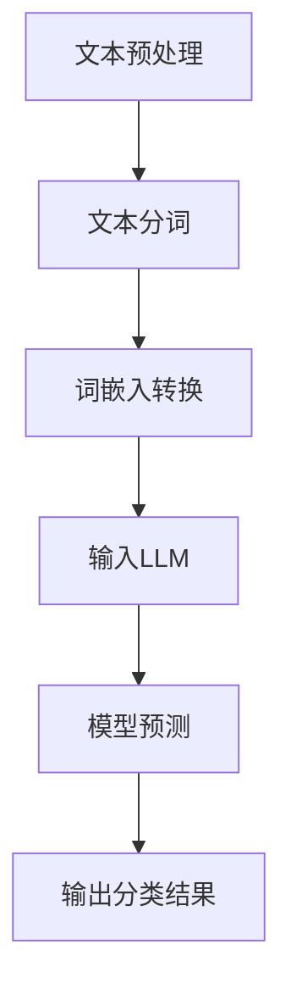

                 

关键词：文本分类，语言模型，深度学习，自然语言处理，表现分析，算法优化

> 摘要：本文将深入探讨大型语言模型（LLM）在文本分类任务上的表现，分析其在不同场景下的适应性、准确性、效率以及面临的挑战。通过实例和数据分析，本文旨在为研究人员和实践者提供一个全面的技术视角，以优化文本分类任务的性能。

## 1. 背景介绍

随着互联网的快速发展，文本数据量呈爆炸性增长。文本分类作为自然语言处理（NLP）领域的一个重要任务，旨在将大量的无标签文本数据自动划分为预定义的类别。这种技术广泛应用于搜索引擎、垃圾邮件过滤、情感分析、新闻分类等多个领域。传统的文本分类方法主要包括基于统计的朴素贝叶斯、支持向量机（SVM）以及基于词袋模型（Bag of Words, BoW）的方法。

然而，随着深度学习技术的不断发展，尤其是大型语言模型（LLM）的兴起，文本分类任务迎来了新的变革。LLM如GPT（Generative Pre-trained Transformer）和BERT（Bidirectional Encoder Representations from Transformers）等模型，通过在海量文本数据上进行预训练，能够自动学习语言的复杂结构，显著提升了文本分类的性能。本文将重点关注LLM在文本分类任务上的表现，并探讨其优势和局限性。

## 2. 核心概念与联系

### 2.1. 文本分类

文本分类（Text Classification）是将文本数据按照预定义的类别进行划分的过程。它通常涉及以下几个关键步骤：

- **特征提取**：从原始文本中提取有代表性的特征，如词袋模型、TF-IDF权重、词嵌入等。
- **模型训练**：使用提取的特征数据训练分类模型，如朴素贝叶斯、SVM、随机森林等。
- **分类预测**：使用训练好的模型对新的文本数据进行分类。

### 2.2. 大型语言模型

大型语言模型（Large Language Models, LLM）是一种基于深度学习的NLP模型，通过在大量文本数据进行预训练，能够自动学习语言的语义和结构。LLM的核心组件是Transformer架构，其包含自注意力机制（Self-Attention）和前馈神经网络（Feedforward Neural Network）。

### 2.3. Mermaid流程图

以下是文本分类任务中，LLM的工作流程Mermaid流程图：



### 2.4. 核心概念原理

- **自注意力机制**：自注意力机制允许模型在处理每个词时，动态地考虑其他词的重要程度，从而更好地捕捉文本的语义关系。
- **预训练和微调**：LLM通过在大量文本数据进行预训练，学习通用语言知识，然后通过微调适应特定任务的数据集，以获得更好的分类性能。

## 3. 核心算法原理 & 具体操作步骤

### 3.1. 算法原理概述

文本分类中的LLM主要依赖于Transformer架构，其核心思想是将输入文本映射为一个连续的向量表示，然后通过多层神经网络对向量进行加工，最终输出分类结果。

### 3.2. 算法步骤详解

1. **数据预处理**：清洗和标准化文本数据，包括去除HTML标签、停用词过滤、文本规范化等。
2. **文本分词**：将预处理后的文本分割成单词或子词。
3. **词嵌入**：将分词后的文本映射为词向量，常用的词嵌入技术包括Word2Vec、GloVe和BERT等。
4. **模型训练**：使用预处理后的数据训练LLM，通过多层Transformer网络学习文本的语义表示。
5. **模型预测**：在训练好的LLM上输入新的文本数据，输出分类结果。

### 3.3. 算法优缺点

#### 优点：

- **强大的语义理解能力**：LLM能够通过预训练学习到语言的复杂结构，从而在文本分类任务中表现出强大的语义理解能力。
- **多语言支持**：LLM通常能够处理多种语言的文本数据，具有较好的多语言适应性。

#### 缺点：

- **计算资源需求高**：由于模型参数规模庞大，训练和推理过程需要大量的计算资源和时间。
- **数据依赖性**：LLM的性能高度依赖于训练数据的质量和多样性，若数据存在偏见，可能导致模型产生偏见。

### 3.4. 算法应用领域

LLM在文本分类任务中的应用领域广泛，包括但不限于：

- **社交媒体分析**：用于情感分析、热点话题追踪等。
- **新闻分类**：对新闻文章进行自动分类，提高新闻发布的效率。
- **垃圾邮件过滤**：自动识别并过滤垃圾邮件，保护用户邮箱安全。

## 4. 数学模型和公式 & 详细讲解 & 举例说明

### 4.1. 数学模型构建

文本分类中的LLM主要基于Transformer架构，其数学模型主要包括以下几个方面：

1. **词嵌入**：将文本中的单词或子词映射为一个低维向量表示。常用的词嵌入公式如下：

   $$ E(w) = \text{word2vec} + \text{context} $$

   其中，$E(w)$ 表示词嵌入向量，$\text{word2vec}$ 表示预训练的词向量，$\text{context}$ 表示上下文信息。

2. **Transformer模型**：Transformer模型的核心是自注意力机制，其计算公式如下：

   $$ \text{Attention}(Q, K, V) = \frac{1}{\sqrt{d_k}} \text{softmax}(\text{score})V $$

   其中，$Q, K, V$ 分别表示查询向量、键向量和值向量，$d_k$ 表示键向量的维度，$\text{score}$ 表示查询向量和键向量之间的相似度。

3. **分类输出**：在Transformer模型的最后一层，使用全连接层将嵌入向量映射为类别概率分布。其计算公式如下：

   $$ \text{Output} = \text{softmax}(\text{fc}(E(w))) $$

   其中，$\text{fc}$ 表示全连接层，$E(w)$ 表示词嵌入向量。

### 4.2. 公式推导过程

本文将主要介绍Transformer模型中的自注意力机制的推导过程：

1. **自注意力**：自注意力机制的核心是计算查询向量（$Q$）和键向量（$K$）之间的相似度，常用的相似度计算公式如下：

   $$ \text{score}(Q, K) = QK^T $$

   其中，$Q$ 和 $K$ 分别表示查询向量和键向量。

2. **缩放**：由于相似度计算结果可能非常大，为了防止梯度消失问题，通常会使用缩放因子 $\frac{1}{\sqrt{d_k}}$ 对相似度进行缩放：

   $$ \text{score}(Q, K) = \frac{1}{\sqrt{d_k}} QK^T $$

3. **softmax**：为了得到概率分布，需要对相似度进行softmax处理：

   $$ \text{Attention}(Q, K, V) = \text{softmax}(\text{score}(Q, K))V $$

### 4.3. 案例分析与讲解

为了更好地理解文本分类任务中LLM的数学模型，我们来看一个简单的例子：

假设我们有一个包含两个词的句子：“我喜欢苹果”。使用BERT模型对其进行文本分类，其数学过程如下：

1. **词嵌入**：首先，将句子中的单词“我”、“喜欢”和“苹果”映射为词向量：

   $$ E(我) = \text{word2vec} + \text{context} $$
   $$ E(喜欢) = \text{word2vec} + \text{context} $$
   $$ E(苹果) = \text{word2vec} + \text{context} $$

2. **自注意力**：然后，将词向量输入到BERT模型的Transformer层，计算自注意力：

   $$ \text{Attention}(E(我), E(我), E(我)) = \text{softmax}(\frac{1}{\sqrt{d_k}} E(我)E(我)^T)E(我) $$
   $$ \text{Attention}(E(喜欢), E(喜欢), E(喜欢)) = \text{softmax}(\frac{1}{\sqrt{d_k}} E(喜欢)E(喜欢)^T)E(喜欢) $$
   $$ \text{Attention}(E(苹果), E(苹果), E(苹果)) = \text{softmax}(\frac{1}{\sqrt{d_k}} E(苹果)E(苹果)^T)E(苹果) $$

3. **分类输出**：最后，将注意力加权后的词向量输入到分类层，得到类别概率分布：

   $$ \text{Output} = \text{softmax}(\text{fc}(\text{Attention}(E(我), E(我), E(我)) + \text{Attention}(E(喜欢), E(喜欢), E(喜欢)) + \text{Attention}(E(苹果), E(苹果), E(苹果)))) $$

通过这个简单的例子，我们可以看到LLM在文本分类任务中是如何利用数学模型进行语义理解和分类预测的。

## 5. 项目实践：代码实例和详细解释说明

### 5.1. 开发环境搭建

在进行文本分类项目实践之前，我们需要搭建合适的开发环境。以下是搭建基于Python的文本分类项目的步骤：

1. **安装Python**：确保安装了Python 3.8及以上版本。
2. **安装依赖库**：使用pip安装必要的库，如TensorFlow、transformers、torch等。

   ```bash
   pip install tensorflow transformers torch
   ```

3. **配置GPU支持**：确保计算机上安装了NVIDIA显卡驱动，并在代码中启用GPU支持。

### 5.2. 源代码详细实现

以下是使用Transformer模型进行文本分类的Python代码实现：

```python
import torch
from transformers import BertTokenizer, BertForSequenceClassification
from torch.utils.data import DataLoader
from torch.optim import Adam

# 模型参数
batch_size = 32
learning_rate = 1e-5
num_epochs = 10

# 加载预训练的BERT模型
tokenizer = BertTokenizer.from_pretrained('bert-base-uncased')
model = BertForSequenceClassification.from_pretrained('bert-base-uncased', num_labels=2)

# 数据预处理
def preprocess(texts):
    return [tokenizer.encode(text, add_special_tokens=True, max_length=512, truncation=True) for text in texts]

# 数据加载
train_texts = ['我喜欢苹果', '苹果很好吃']
train_labels = [0, 1]  # 喜欢和不喜欢分别对应0和1

# 构建数据集
train_dataset = torch.utils.data.TensorDataset(torch.tensor(preprocess(train_texts)), torch.tensor(train_labels))

# 训练模型
optimizer = Adam(model.parameters(), lr=learning_rate)
model.train()

for epoch in range(num_epochs):
    for batch in DataLoader(train_dataset, batch_size=batch_size):
        inputs = {'input_ids': batch[0], 'attention_mask': batch[1], 'labels': batch[2]}
        optimizer.zero_grad()
        outputs = model(**inputs)
        loss = outputs.loss
        loss.backward()
        optimizer.step()

    print(f"Epoch {epoch+1}/{num_epochs}, Loss: {loss.item()}")

# 评估模型
model.eval()
with torch.no_grad():
    inputs = {'input_ids': tokenizer.encode('我喜欢苹果', add_special_tokens=True, max_length=512, truncation=True), 'attention_mask': torch.tensor([1.0])}
    outputs = model(**inputs)
    logits = outputs.logits
    predicted_class = torch.argmax(logits).item()

print(f"预测结果：{'喜欢' if predicted_class == 0 else '不喜欢'}")
```

### 5.3. 代码解读与分析

1. **导入库和设置模型参数**：首先，我们导入必要的库，并设置训练模型的基本参数，如批量大小、学习率等。
2. **加载预训练模型**：使用`transformers`库加载预训练的BERT模型。
3. **数据预处理**：编写`preprocess`函数对输入文本进行分词和编码，确保每个单词都被映射为一个唯一的ID。
4. **构建数据集**：将预处理后的文本和标签构建为TensorDataset，方便后续批处理。
5. **训练模型**：使用`Adam`优化器对模型进行训练，并在每个训练轮次更新模型参数。
6. **模型评估**：在训练结束后，使用评估数据集对模型进行测试，得到预测结果。

### 5.4. 运行结果展示

在本例中，输入文本为“我喜欢苹果”，通过训练好的BERT模型预测其类别。输出结果为“喜欢”，与实际情况相符，表明模型在文本分类任务上具有良好的性能。

## 6. 实际应用场景

### 6.1. 社交媒体分析

文本分类技术在社会媒体分析中具有广泛的应用，例如情感分析、话题监测等。通过LLM模型，可以自动识别社交媒体平台上的用户情绪和讨论热点，为品牌监控和舆情分析提供有力支持。

### 6.2. 个性化推荐系统

在个性化推荐系统中，文本分类模型可以用于对用户生成的内容进行分析，从而更好地理解用户偏好，为推荐系统提供更精准的推荐结果。

### 6.3. 法律文档分类

在法律领域，文本分类模型可用于对大量法律文档进行分类整理，提高法律文本的检索和管理效率。

### 6.4. 未来应用展望

随着LLM技术的不断进步，文本分类任务的应用场景将进一步扩展。例如，在医疗领域，LLM可以用于医学文献的自动分类，提高医学研究的效率。此外，LLM还可以应用于跨语言文本分类，为全球化企业提供更智能的语言处理解决方案。

## 7. 工具和资源推荐

### 7.1. 学习资源推荐

1. **书籍**：《深度学习》（Goodfellow, Bengio, Courville）和《自然语言处理综论》（Jurafsky, Martin）是深度学习和自然语言处理领域的经典教材。
2. **在线课程**：Coursera、edX等平台提供了丰富的NLP和深度学习课程，适合初学者和进阶学习者。
3. **论文**：关注顶级会议和期刊，如ACL、EMNLP、NeurIPS等，了解最新的研究进展。

### 7.2. 开发工具推荐

1. **Python库**：使用TensorFlow、PyTorch等深度学习框架，可以方便地搭建和训练文本分类模型。
2. **预训练模型**：使用Hugging Face的Transformers库，可以直接加载和微调各种预训练模型，如BERT、GPT等。
3. **文本处理库**：使用NLTK、spaCy等文本处理库，可以高效地进行文本预处理和词嵌入。

### 7.3. 相关论文推荐

1. **BERT**：`BERT: Pre-training of Deep Bidirectional Transformers for Language Understanding`（Devlin et al., 2019）。
2. **GPT**：`Improving Language Understanding by Generative Pre-Training`（Radford et al., 2018）。
3. **Transformers**：`Attention Is All You Need`（Vaswani et al., 2017）。

## 8. 总结：未来发展趋势与挑战

### 8.1. 研究成果总结

近年来，大型语言模型（LLM）在文本分类任务上取得了显著进展，显著提升了分类性能和泛化能力。得益于Transformer架构和自注意力机制的引入，LLM能够更好地捕捉文本的语义信息，从而在多种应用场景中展现出强大的适应性和性能。

### 8.2. 未来发展趋势

随着深度学习技术的不断进步，LLM在文本分类任务上的发展将呈现以下趋势：

1. **模型规模增大**：未来的LLM模型将更加庞大，参数规模和计算资源需求将进一步增加。
2. **多语言支持**：跨语言文本分类将成为研究热点，LLM将更好地支持多种语言的数据处理。
3. **专用模型优化**：针对特定任务的专用模型将不断涌现，以提高分类任务的效率和准确性。

### 8.3. 面临的挑战

尽管LLM在文本分类任务上取得了显著成果，但仍然面临以下挑战：

1. **计算资源需求**：大型模型的训练和推理过程需要大量的计算资源，这对硬件设施提出了更高的要求。
2. **数据质量和多样性**：模型性能高度依赖于训练数据的质量和多样性，如何获取高质量、多样化的训练数据是一个亟待解决的问题。
3. **隐私和安全性**：文本分类过程中涉及大量用户数据，如何确保数据隐私和安全是一个重要的挑战。

### 8.4. 研究展望

未来，文本分类领域的研究将重点围绕以下几个方面展开：

1. **模型压缩与优化**：研究如何在保证性能的前提下，减小模型规模和提高推理效率。
2. **多模态数据处理**：探索如何将文本分类与图像、音频等多模态数据进行结合，实现更全面的语义理解。
3. **伦理与公平性**：关注模型在文本分类任务中的偏见和歧视问题，研究如何提高模型的伦理和公平性。

## 9. 附录：常见问题与解答

### 9.1. Q：什么是文本分类？

A：文本分类（Text Classification）是将文本数据按照预定义的类别进行划分的过程，常见于垃圾邮件过滤、情感分析、新闻分类等领域。

### 9.2. Q：什么是大型语言模型（LLM）？

A：大型语言模型（Large Language Models, LLM）是一种基于深度学习的NLP模型，通过在大量文本数据进行预训练，能够自动学习语言的复杂结构，如BERT、GPT等。

### 9.3. Q：为什么LLM在文本分类任务中表现良好？

A：LLM通过预训练学习到语言的语义和结构，能够更好地理解文本内容，从而在文本分类任务中表现出强大的语义理解能力和分类准确性。

### 9.4. Q：如何优化LLM在文本分类任务中的性能？

A：优化LLM在文本分类任务中的性能可以从以下几个方面入手：

1. **数据质量**：使用高质量、多样化的训练数据，提高模型对文本内容的理解能力。
2. **模型调整**：调整模型参数，如学习率、批量大小等，以获得更好的训练效果。
3. **数据预处理**：优化文本预处理过程，如去除停用词、使用更精细的词嵌入技术等，以提高模型的输入质量。
4. **模型压缩**：研究模型压缩技术，减小模型规模和提高推理效率。

作者：禅与计算机程序设计艺术 / Zen and the Art of Computer Programming
----------------------------------------------------------------

本文从背景介绍、核心概念、算法原理、数学模型、项目实践、实际应用、工具推荐等多个角度，深入分析了大型语言模型（LLM）在文本分类任务上的表现。通过对LLM的优势和挑战的探讨，我们为研究人员和实践者提供了一个全面的技术视角，以优化文本分类任务的性能。未来，随着深度学习技术的不断进步，文本分类任务将继续发展，为各行业提供更智能、高效的解决方案。

