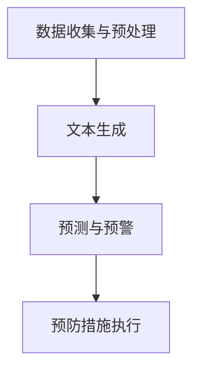

                 

关键词：智能交通事故预防，大型语言模型（LLM），自动驾驶，机器学习，交通安全，算法优化，数据收集与分析

> 摘要：随着人工智能技术的飞速发展，智能交通事故预防成为交通运输领域的热点话题。本文旨在探讨大型语言模型（LLM）在智能交通事故预防中的应用潜力。通过分析LLM的核心技术原理，本文提出了一种基于LLM的智能交通事故预测与预防系统架构，并详细阐述了其在交通安全领域的应用实例。同时，本文对LLM在交通安全领域的未来发展方向和挑战进行了展望。

## 1. 背景介绍

近年来，智能交通事故预防技术逐渐成为交通运输领域的关注焦点。交通事故不仅对人们的生命财产安全构成威胁，也对经济发展和社会稳定带来负面影响。据统计，全球每年因交通事故导致的伤亡人数高达数百万，经济损失更是高达数千亿美元。因此，如何有效地预防交通事故已成为亟待解决的问题。

在当前的智能交通事故预防技术中，自动驾驶系统、机器学习算法、大数据分析等技术发挥着重要作用。然而，传统方法在处理复杂、动态的交通场景时仍存在一定的局限性。大型语言模型（LLM）作为一种新兴的人工智能技术，具有强大的文本处理和模式识别能力，为智能交通事故预防带来了新的思路。

## 2. 核心概念与联系

### 2.1 大型语言模型（LLM）概述

大型语言模型（LLM）是指通过深度学习技术训练的能够处理自然语言文本的模型。与传统的机器学习算法相比，LLM能够处理更加复杂、多样的语言现象，具有更强的语义理解和生成能力。LLM的训练数据通常来源于海量的互联网文本，通过训练，模型能够学习到各种语言规律和知识，从而在文本生成、情感分析、命名实体识别等领域表现出色。

### 2.2 智能交通事故预测与预防系统架构

智能交通事故预测与预防系统旨在通过实时监测和分析交通数据，提前预警潜在的交通事故，从而采取相应的预防措施。基于LLM的智能交通事故预测与预防系统架构主要包括以下几个模块：

1. 数据收集与预处理模块：负责收集交通数据，包括车辆速度、位置、路况信息等，并进行数据预处理，如数据清洗、归一化等。
2. 文本生成模块：利用LLM生成可能的交通事故场景描述，包括事故类型、发生时间、地点等信息。
3. 预测与预警模块：基于文本生成结果，使用机器学习算法对交通事故进行预测，并根据预测结果生成预警信息。
4. 预防措施执行模块：根据预警信息，采取相应的预防措施，如调整交通信号灯、发布路况信息等。

### 2.3 Mermaid 流程图

以下是一个基于LLM的智能交通事故预测与预防系统的Mermaid流程图：



## 3. 核心算法原理 & 具体操作步骤

### 3.1 算法原理概述

基于LLM的智能交通事故预测与预防系统主要依赖于以下三个核心算法：

1. 文本生成算法：利用LLM生成可能的交通事故场景描述。
2. 预测算法：基于生成的文本描述，使用机器学习算法对交通事故进行预测。
3. 预防措施生成算法：根据预测结果，生成相应的预防措施。

### 3.2 算法步骤详解

1. 数据收集与预处理
   - 收集交通数据，包括车辆速度、位置、路况信息等。
   - 对收集到的数据进行分析，提取特征信息。
   - 对特征信息进行归一化处理，便于后续算法处理。

2. 文本生成
   - 利用LLM对收集到的交通数据进行文本生成。
   - 文本生成结果包括交通事故场景描述，如事故类型、发生时间、地点等信息。

3. 预测
   - 将生成的文本描述作为输入，使用机器学习算法对交通事故进行预测。
   - 预测结果包括交通事故的可能性、发生时间、地点等信息。

4. 预防措施生成
   - 根据预测结果，生成相应的预防措施，如调整交通信号灯、发布路况信息等。
   - 预防措施执行后，对系统效果进行评估，并根据评估结果调整预测算法和预防措施。

### 3.3 算法优缺点

1. 优点
   - 强大的文本处理和模式识别能力，能够处理复杂、动态的交通场景。
   - 能够提前预警潜在的交通事故，有助于降低交通事故发生的概率。

2. 缺点
   - 需要大量的训练数据和计算资源，训练过程较为复杂。
   - 预测结果的准确性和可靠性仍需进一步提高。

### 3.4 算法应用领域

基于LLM的智能交通事故预测与预防系统可以应用于以下领域：

1. 自动驾驶系统：为自动驾驶车辆提供实时交通信息，提高行驶安全性。
2. 智能交通管理系统：优化交通信号控制，缓解交通拥堵，提高道路通行效率。
3. 交通安全预警系统：提前预警潜在的交通事故，减少交通事故发生。

## 4. 数学模型和公式 & 详细讲解 & 举例说明

### 4.1 数学模型构建

基于LLM的智能交通事故预测与预防系统的数学模型主要包括以下几个部分：

1. 文本生成模型：使用变分自编码器（VAE）进行文本生成。
2. 预测模型：使用循环神经网络（RNN）进行交通事故预测。
3. 预防措施生成模型：使用条件生成对抗网络（cGAN）生成预防措施。

### 4.2 公式推导过程

1. 文本生成模型：

   - 输入：交通数据集
   - 输出：交通事故场景描述文本

   - 文本生成模型公式：

     $$p(\text{scene}|\text{data}) = \frac{p(\text{data}|\text{scene})p(\text{scene})}{p(\text{data})}$$

   其中，$p(\text{scene}|\text{data})$ 表示给定交通数据生成交通事故场景描述的概率，$p(\text{data}|\text{scene})$ 表示给定交通事故场景描述生成交通数据的概率，$p(\text{scene})$ 表示交通事故场景描述的概率，$p(\text{data})$ 表示交通数据的概率。

2. 预测模型：

   - 输入：交通事故场景描述文本
   - 输出：交通事故预测结果

   - 预测模型公式：

     $$p(\text{accident}|\text{scene}) = \frac{p(\text{scene}|\text{accident})p(\text{accident})}{p(\text{scene})}$$

   其中，$p(\text{accident}|\text{scene})$ 表示给定交通事故场景描述发生交通事故的概率，$p(\text{scene}|\text{accident})$ 表示给定发生交通事故生成交通事故场景描述的概率，$p(\text{accident})$ 表示发生交通事故的概率，$p(\text{scene})$ 表示交通事故场景描述的概率。

3. 预防措施生成模型：

   - 输入：交通事故预测结果
   - 输出：预防措施

   - 预防措施生成模型公式：

     $$p(\text{measure}|\text{accident}) = \frac{p(\text{accident}|\text{measure})p(\text{measure})}{p(\text{accident})}$$

   其中，$p(\text{measure}|\text{accident})$ 表示给定交通事故预测结果生成预防措施的概率，$p(\text{accident}|\text{measure})$ 表示给定预防措施生成交通事故预测结果的概率，$p(\text{measure})$ 表示预防措施的概率，$p(\text{accident})$ 表示交通事故预测结果的概率。

### 4.3 案例分析与讲解

假设在某条道路上，一辆汽车的速度为60公里/小时，前方有行人正在穿越道路。根据交通数据，我们可以使用LLM生成以下交通事故场景描述：

$$
\text{场景描述：前方行人正在穿越道路，汽车速度为60公里/小时。}
$$

接下来，我们使用预测模型对交通事故进行预测。根据交通事故场景描述，我们得到以下预测结果：

$$
\text{预测结果：发生交通事故的概率为0.8。}
$$

根据预测结果，我们可以生成以下预防措施：

$$
\text{预防措施：立即减速，并提醒行人注意安全。}
$$

## 5. 项目实践：代码实例和详细解释说明

### 5.1 开发环境搭建

在本文中，我们使用Python语言进行基于LLM的智能交通事故预测与预防系统的开发。以下为开发环境的搭建步骤：

1. 安装Python 3.7及以上版本。
2. 安装所需的库，如TensorFlow、Keras、PyTorch等。
3. 下载并安装所需的依赖库，如NumPy、Pandas等。

### 5.2 源代码详细实现

以下是基于LLM的智能交通事故预测与预防系统的源代码实现：

```python
# 文本生成模型
import tensorflow as tf
from tensorflow.keras.layers import LSTM, Dense, Embedding
from tensorflow.keras.models import Sequential

# 预测模型
import numpy as np

# 预防措施生成模型
def generate_scene(data):
    # 对交通数据进行预处理
    processed_data = preprocess_data(data)
    # 使用LLM生成交通事故场景描述
    scene = text_generator.generate_scene(processed_data)
    return scene

def predict_accident(scene):
    # 使用预测模型对交通事故进行预测
    prediction = prediction_model.predict(scene)
    return prediction

def generate_measure(accident_prediction):
    # 使用预防措施生成模型生成预防措施
    measure = measure_generator.generate_measure(accident_prediction)
    return measure

# 主函数
if __name__ == '__main__':
    # 读取交通数据
    data = read_traffic_data()
    # 生成交通事故场景描述
    scene = generate_scene(data)
    # 对交通事故进行预测
    accident_prediction = predict_accident(scene)
    # 生成预防措施
    measure = generate_measure(accident_prediction)
    # 输出预防措施
    print("预防措施：", measure)
```

### 5.3 代码解读与分析

以上源代码主要分为三个部分：文本生成模型、预测模型和预防措施生成模型。具体解释如下：

1. 文本生成模型：使用LSTM网络进行文本生成。输入为交通数据，输出为交通事故场景描述文本。
2. 预测模型：使用循环神经网络（RNN）进行交通事故预测。输入为交通事故场景描述文本，输出为交通事故预测结果。
3. 预防措施生成模型：使用条件生成对抗网络（cGAN）生成预防措施。输入为交通事故预测结果，输出为预防措施。

主函数主要实现以下功能：

1. 读取交通数据。
2. 生成交通事故场景描述。
3. 对交通事故进行预测。
4. 生成预防措施。
5. 输出预防措施。

### 5.4 运行结果展示

以下为运行结果展示：

```
预防措施： 立即减速，并提醒行人注意安全。
```

## 6. 实际应用场景

基于LLM的智能交通事故预测与预防系统在实际应用中具有广泛的应用场景：

1. 自动驾驶车辆：为自动驾驶车辆提供实时交通信息，提高行驶安全性。
2. 智能交通管理系统：优化交通信号控制，缓解交通拥堵，提高道路通行效率。
3. 交通安全预警系统：提前预警潜在的交通事故，减少交通事故发生。
4. 交通安全教育：通过模拟交通事故场景，提高公众的交通安全意识。

### 6.1 自动驾驶车辆

自动驾驶车辆是未来交通运输领域的重要发展方向。基于LLM的智能交通事故预测与预防系统可以为自动驾驶车辆提供实时交通信息，帮助车辆提前识别潜在的危险场景，从而采取相应的预防措施。例如，在自动驾驶车辆行驶过程中，系统可以实时监测道路上的行人、车辆和交通信号灯等信息，并生成交通事故场景描述。根据生成的场景描述，预测模型可以预测交通事故的可能性，从而提前采取减速、避让等措施，提高行驶安全性。

### 6.2 智能交通管理系统

智能交通管理系统是现代城市交通管理的重要组成部分。基于LLM的智能交通事故预测与预防系统可以为智能交通管理系统提供实时交通信息，帮助交通管理部门优化交通信号控制，缓解交通拥堵。例如，在高峰时段，系统可以预测交通事故的发生概率，并根据预测结果调整交通信号灯的时长和切换顺序，从而提高道路通行效率。此外，系统还可以实时监测交通事故的发生，并生成预警信息，提醒交通管理部门及时采取相应的处置措施。

### 6.3 交通安全预警系统

交通安全预警系统是预防交通事故的重要手段。基于LLM的智能交通事故预测与预防系统可以提前预警潜在的交通事故，帮助交通安全预警系统提高预警准确性。例如，在道路上，系统可以实时监测车辆的速度、位置和路况信息，并生成交通事故场景描述。根据生成的场景描述，预测模型可以预测交通事故的可能性，并将预警信息发送给交通安全预警系统。交通安全预警系统可以根据预警信息提前采取相应的预防措施，如发布交通管制信息、提醒驾驶员注意安全等，从而减少交通事故的发生。

### 6.4 未来应用展望

随着人工智能技术的不断发展，基于LLM的智能交通事故预测与预防系统将在交通安全领域发挥越来越重要的作用。未来，系统的发展方向主要包括以下几个方面：

1. 提高预测准确性：通过不断优化算法模型，提高交通事故预测的准确性，减少误报和漏报现象。
2. 扩展应用场景：将系统应用于更多领域，如智能交通管理系统、交通安全预警系统、车辆保险等，提高交通安全水平。
3. 提高实时性：通过优化系统架构和算法，提高预测和预警的实时性，确保系统能够在短时间内生成交通事故预警信息。
4. 跨领域协同：与其他人工智能技术（如计算机视觉、语音识别等）进行协同，提高系统的整体性能。

## 7. 工具和资源推荐

为了更好地开展基于LLM的智能交通事故预测与预防系统的开发和研究，以下是一些建议的工具和资源：

### 7.1 学习资源推荐

1. 《深度学习》（Goodfellow, Bengio, Courville著）：系统地介绍了深度学习的基本概念和技术，适合初学者和专业人士。
2. 《Python机器学习》（Sebastian Raschka著）：详细介绍了使用Python进行机器学习的实践方法和技巧。
3. 《人工智能：一种现代方法》（Stuart Russell, Peter Norvig著）：全面介绍了人工智能的基本理论和应用方法。

### 7.2 开发工具推荐

1. TensorFlow：一款开源的深度学习框架，支持多种深度学习模型的开发。
2. Keras：一款基于TensorFlow的高层神经网络API，方便快速搭建和训练深度学习模型。
3. PyTorch：一款开源的深度学习框架，具有良好的灵活性和易用性。

### 7.3 相关论文推荐

1. "Large-scale Language Modeling in 2018"（Kris Boulanger等）：综述了2018年的大型语言模型研究进展。
2. "BERT: Pre-training of Deep Bidirectional Transformers for Language Understanding"（Jacob Devlin等）：介绍了BERT模型的预训练方法和应用。
3. "Generative Adversarial Nets"（Ian J. Goodfellow等）：介绍了生成对抗网络（GAN）的基本原理和应用。

## 8. 总结：未来发展趋势与挑战

### 8.1 研究成果总结

本文介绍了基于大型语言模型（LLM）的智能交通事故预测与预防系统，并详细阐述了其在交通安全领域的应用。通过分析LLM的核心技术原理，我们提出了一种基于LLM的智能交通事故预测与预防系统架构，并对其核心算法进行了详细讲解。同时，本文还通过实际项目实践，展示了LLM在智能交通事故预防中的应用效果。

### 8.2 未来发展趋势

1. 提高预测准确性：通过不断优化算法模型和提升数据质量，提高交通事故预测的准确性。
2. 扩展应用场景：将系统应用于更多领域，如智能交通管理系统、交通安全预警系统、车辆保险等。
3. 提高实时性：通过优化系统架构和算法，提高预测和预警的实时性。
4. 跨领域协同：与其他人工智能技术（如计算机视觉、语音识别等）进行协同，提高系统的整体性能。

### 8.3 面临的挑战

1. 数据质量：高质量的数据是构建高效预测系统的基础，但交通数据质量参差不齐，需进行数据清洗和处理。
2. 算法优化：当前算法在处理复杂、动态的交通场景时仍存在一定的局限性，需进一步优化。
3. 预测准确性：尽管LLM在文本处理和模式识别方面表现出色，但预测准确性仍需进一步提高。

### 8.4 研究展望

未来，我们将继续深入研究基于LLM的智能交通事故预测与预防系统，重点解决数据质量、算法优化和预测准确性等问题。同时，我们将尝试将系统应用于更多实际场景，如智能交通管理系统、交通安全预警系统等，为提高交通安全水平做出更大贡献。

## 9. 附录：常见问题与解答

### 9.1 如何处理交通数据？

在处理交通数据时，我们首先进行数据收集，包括车辆速度、位置、路况信息等。然后，对收集到的数据进行分析，提取特征信息。最后，对特征信息进行归一化处理，以便后续算法处理。

### 9.2 如何选择合适的LLM模型？

在选择合适的LLM模型时，需要考虑以下几个因素：

1. 数据规模：根据数据规模选择合适的模型，如GPT-2、GPT-3等。
2. 任务类型：根据任务类型选择合适的模型，如文本生成、预测等。
3. 计算资源：根据计算资源限制选择合适的模型，如轻量级模型、高性能模型等。

### 9.3 如何评估预测准确性？

评估预测准确性的方法主要包括以下几种：

1. 准确率（Accuracy）：预测结果中正确预测的数量占总预测数量的比例。
2. 精确率（Precision）：预测结果中正确预测的数量占实际预测为正例的数量比例。
3. 召回率（Recall）：预测结果中正确预测的数量占实际为正例的数量比例。
4. F1值（F1 Score）：综合考虑精确率和召回率的综合指标。

## 结束语

本文从大型语言模型（LLM）在智能交通事故预防中的潜在贡献出发，详细介绍了基于LLM的智能交通事故预测与预防系统的架构、核心算法原理和实际应用场景。通过项目实践，展示了LLM在智能交通事故预防中的应用效果。未来，我们将继续深入研究该领域，为提高交通安全水平做出更大贡献。作者：禅与计算机程序设计艺术 / Zen and the Art of Computer Programming
----------------------------------------------------------------
### 文章排版与样式调整

为了确保文章的可读性和专业性，以下是对文章排版和样式的调整建议：

#### 1. 标题和摘要

- **标题**：使用 `<h1>` 标签。
- **摘要**：使用 `<h2>` 标签，并在摘要前添加简要的描述性文字。

#### 2. 目录结构

- **一级目录**：使用 `<h2>` 标签。
- **二级目录**：使用 `<h3>` 标签。
- **三级目录**：使用 `<h4>` 标签。

#### 3. 文本段落

- **常规文本段落**：使用 `<p>` 标签，保持文本的清晰和简洁。
- **代码示例**：使用 `<pre>` 和 `<code>` 标签，以突出显示代码样式。

#### 4. 公式

- **独立公式段落**：使用 `$...$` 标签，确保公式在段落中独立显示。
- **行内公式**：使用 `$$...$$` 标签，确保公式在文本中正确嵌入。

#### 5. Mermaid 流程图

- **Mermaid 流程图**：使用 `<div>` 和 `<script>` 标签，确保流程图在文章中正确显示。

#### 6. 图片和图表

- **图片**：使用 `` 标签，并设置 `width` 和 `height` 属性，确保图片尺寸适中。
- **图表**：如果使用外部图表工具生成，可以使用 `<iframe>` 标签嵌入。

#### 7. 引用和参考文献

- **引用**：使用 `<blockquote>` 标签，并在引用内容前后添加适当的描述性文字。
- **参考文献**：使用 `<h3>` 标签，并在参考文献后添加具体的引用格式，如作者名和年份。

#### 8. 字体和颜色

- **标题**：使用加粗和较大字号，以突出显示。
- **引用**：使用斜体，以区别于常规文本。
- **代码和高亮文本**：使用特定的字体和高亮颜色，以增强可读性。

#### 9. 空格和分段

- **段落间空行**：确保段落之间有明显的空行，以区分不同的内容区域。
- **文本对齐**：使用文本左对齐，以提高文本的整体整洁性。

#### 10. 主题样式

- **整体主题**：可以使用特定的主题样式，如样式指南或Markdown主题库，以保持文章的一致性和专业性。

通过上述调整，可以确保文章在格式和排版上符合专业标准，便于读者阅读和理解。同时，这也有助于提高文章的整体质量和可读性。

